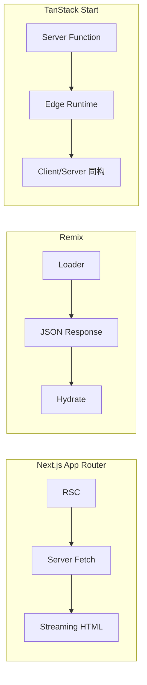
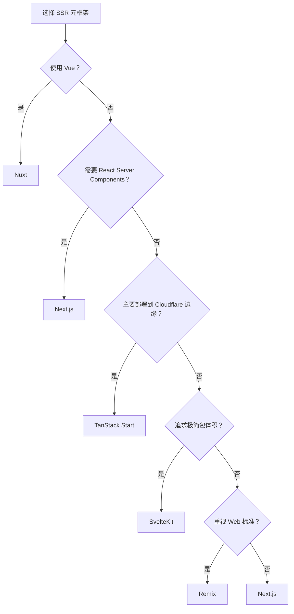

# SSR 元框架对比矩阵

> 对比主流全栈/SSR 元框架（Next.js、Nuxt、SvelteKit、Remix、TanStack Start 等），帮助你在服务端渲染、边缘部署、数据获取策略等维度做出选型决策。

---

## 核心指标对比

| 指标 | Next.js | Nuxt | SvelteKit | Remix | TanStack Start |
|------|---------|------|-----------|-------|----------------|
| **底层 UI 框架** | React | Vue | Svelte | React | React |
| **路由模式** | 文件系统路由 (App Router) | 文件系统路由 (Pages/Views) | 文件系统路由 | 文件系统路由 | 文件系统路由 |
| **渲染策略** | SSR / SSG / ISR / RSC | SSR / SSG / ISR / Hybrid | SSR / CSR / Prerender | SSR 为主 | SSR / CSR / 边缘 |
| **数据获取** | Server Components + fetch | useAsyncData / useFetch | load 函数 (统一服务端/客户端) | Loader/Action | Server Functions |
| **边缘运行支持** | ✅ Vercel Edge / Node.js | ✅ Nitro (多预设) | ✅ Adapters (Vercel/Netlify/Cloudflare) | ⚠️ 有限 | ✅ **原生 Cloudflare 优先** |
| **部署灵活性** | 高 (Vercel 最优) | 极高 (Nitro 适配器) | 高 | 中等 | 高 |
| **TypeScript 支持** | 极佳 | 优秀 | 良好 | 良好 | 极佳 |
| **学习曲线** | 中等 | 平缓 | 平缓 | 中等 | 中等 |
| **中文文档** | 丰富 | 丰富 | 较少 | 较少 | 较少 |

---

## 架构与特性矩阵

| 特性 | Next.js | Nuxt | SvelteKit | Remix | TanStack Start |
|------|---------|------|-----------|-------|----------------|
| **React Server Components** | ✅ 原生支持 | ❌ | ❌ | ❌ | ⚠️ 计划中 |
| **服务端数据变更 (Form Action)** | ✅ Server Actions | ✅ API Routes / Server API | ✅ Form Actions | ✅ Actions | ✅ Server Functions |
| **边缘函数/Worker 部署** | ✅ Edge Runtime | ✅ Edge Preset | ✅ Edge Adapters | ⚠️ 部分支持 | ✅ 核心设计目标 |
| **中间件 (Middleware)** | ✅ | ✅ | ✅ | ⚠️ (Loader 中处理) | ✅ |
| **增量静态再生 (ISR)** | ✅ 成熟 | ✅ | ⚠️ 基础支持 | ❌ | ⚠️ |
| **API 路由** | ✅ | ✅ | ✅ | ✅ | ✅ |
| **数据库/ORM 集成** | Prisma/Drizzle + Vercel Postgres | Prisma/Drizzle + 任意 | 任意 | 任意 | D1/Turso 边缘优先 |

---

## 边缘部署与运行时对比

| 框架 | Vercel Edge | Cloudflare Workers | Cloudflare Pages | Netlify Edge | Node.js |
|------|-------------|-------------------|------------------|--------------|---------|
| **Next.js** | ✅ 最优 | ⚠️ 有限 | ⚠️ | ⚠️ | ✅ |
| **Nuxt** | ✅ | ✅ | ✅ | ✅ | ✅ |
| **SvelteKit** | ✅ Adapter | ✅ Adapter | ✅ Adapter | ✅ Adapter | ✅ |
| **Remix** | ⚠️ | ✅ | ✅ | ⚠️ | ✅ |
| **TanStack Start** | ⚠️ | ✅ **首选** | ✅ | ⚠️ | ✅ |

---

## 适用场景推荐

| 场景 | 首选 | 次选 | 理由 |
|------|------|------|------|
| React 全栈 / 大型电商 | **Next.js** | Remix | RSC + ISR 生态最成熟，Vercel 一键部署 |
| Vue 全栈 / 内容站点 | **Nuxt** | — | Nitro 架构极度灵活，SSR/SSG 切换无感知 |
| 极致轻量 / 高性能 SSR | **SvelteKit** | Next.js | 编译时优化 + 最小运行时，包体积极小 |
| 坚守 Web 标准 / 渐进增强 | **Remix** | Next.js | 以原生 Form + Link 为核心，SEO 与可访问性优先 |
| 边缘优先 / Cloudflare 生态 | **TanStack Start** | SvelteKit | 原生适配 Workers/D1/KV，冷启动与延迟最优 |
| 快速原型 / 独立开发者 | **Nuxt** | SvelteKit | 低配置、高产出，文档与模板生态完善 |

---

## 数据获取策略对比

---

## 决策建议

---

> **关联文档**
>
> - [前端框架对比](./frontend-frameworks-compare.md)
> - [构建工具对比](./build-tools-compare.md)
> - `docs/guides/TANSTACK_START_CLOUDFLARE_DEPLOYMENT.md` — TanStack Start 边缘部署实战
> - `jsts-code-lab/59-fullstack-patterns/` — 全栈模式实现
