# 技术选型决策树

> 交互式技术选型指南，帮助你根据项目需求快速选择合适的技术栈。
> 每个选型均提供 **Mermaid 可视化流程图**（推荐在 VitePress 网站中浏览）和 **ASCII 文本树**（兼容纯文本阅读）。

---

## 1. UI库选型决策树

### Mermaid 流程图

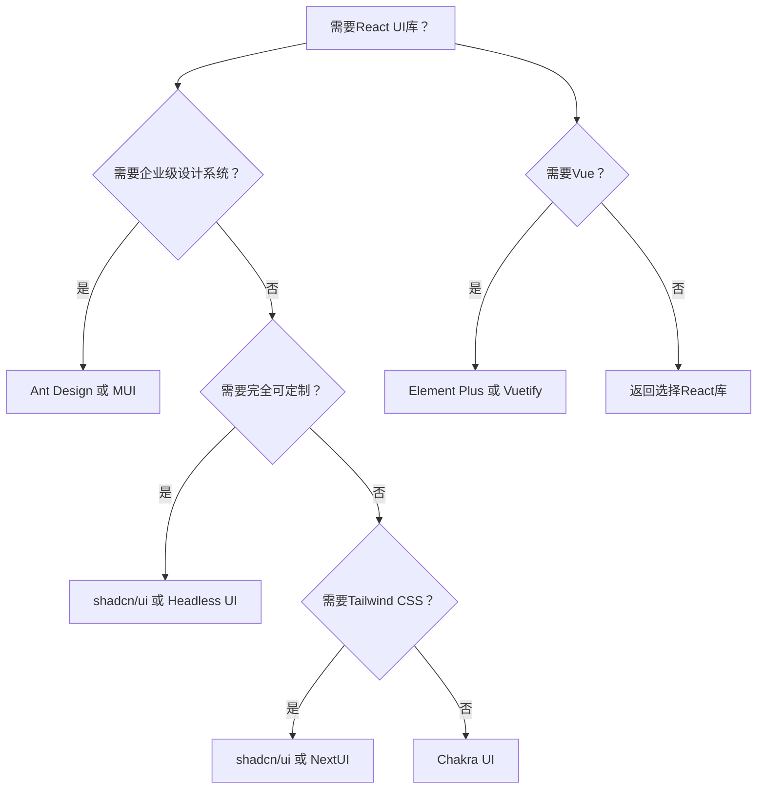
```mermaid
flowchart TD
    A[需要React UI库？] --> B{需要企业级设计系统？}
    B -->|是| C[Ant Design 或 MUI]
    B -->|否| D{需要完全可定制？}
    D -->|是| E[shadcn/ui 或 Headless UI]
    D -->|否| F{需要Tailwind CSS？}
    F -->|是| G[shadcn/ui 或 NextUI]
    F -->|否| H[Chakra UI]
    A --> I{需要Vue？}
    I -->|是| J[Element Plus 或 Vuetify]
    I -->|否| K[返回选择React库]
```

### ASCII 文本树

```
需要React UI库？
├── 需要企业级设计系统？
│   ├── 是 → Ant Design 或 MUI
│   │         📌 Ant Design：阿里巴巴出品，生态完善，中后台首选
│   │         📌 MUI：Material Design风格，文档丰富，社区活跃
│   └── 否 → 继续
├── 需要完全可定制？
│   ├── 是 → shadcn/ui 或 Headless UI
│   │         📌 shadcn/ui：无运行时依赖，可复制组件，Tailwind原生
│   │         📌 Headless UI：完全无样式，最大灵活性
│   └── 否 → 继续
├── 需要Tailwind CSS？
│   ├── 是 → shadcn/ui 或 NextUI
│   │         📌 NextUI：现代设计，暗黑模式支持好，动画丰富
│   └── 否 → Chakra UI
│             📌 Chakra UI：简单易用，样式即props，无障碍支持好
└── 需要Vue？
    ├── 是 → Element Plus 或 Vuetify
    │         📌 Element Plus：国内最流行，中后台组件丰富
    │         📌 Vuetify：Material Design，移动端适配好
    └── 否 → 返回选择React库
```

### 快速推荐

| 场景 | 推荐 | 理由 |
|------|------|------|
| 企业级中后台 | **Ant Design** | 组件最全面，生态成熟 |
| 快速原型开发 | **Chakra UI** | API简洁，上手快 |
| 高度定制需求 | **shadcn/ui** | 源码可控，样式自由 |
| 移动端优先 | **Vuetify** | Material Design，响应式好 |
| 现代React项目 | **shadcn/ui + Tailwind** | 2024年最流行组合 |

---

## 2. 状态管理选型决策树

### Mermaid 流程图

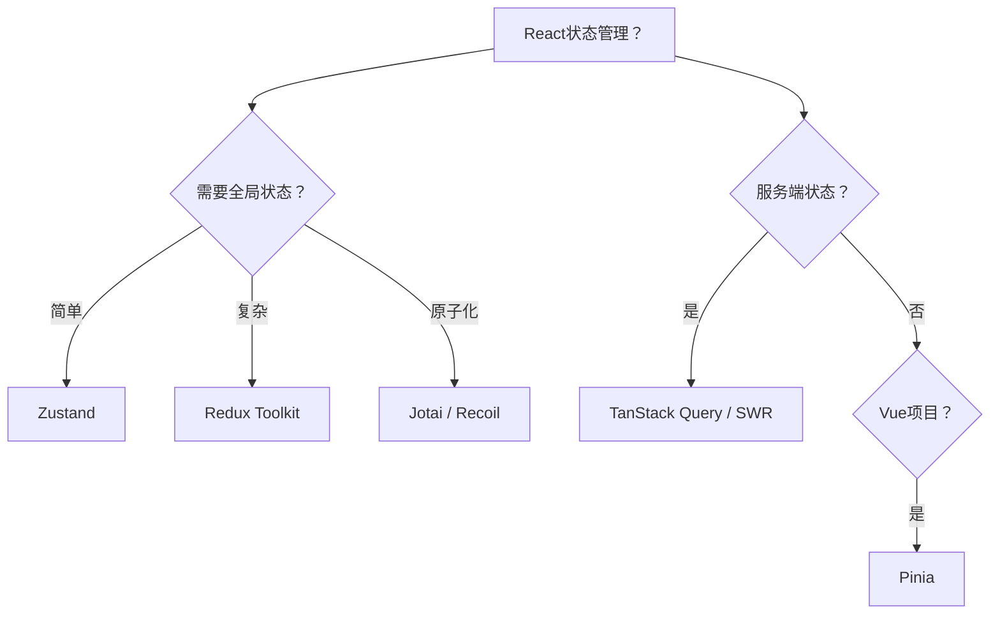
```mermaid
flowchart TD
    A[React状态管理？] --> B{需要全局状态？}
    B -->|简单| C[Zustand]
    B -->|复杂| D[Redux Toolkit]
    B -->|原子化| E[Jotai / Recoil]
    A --> F{服务端状态？}
    F -->|是| G[TanStack Query / SWR]
    F -->|否| H{Vue项目？}
    H -->|是| I[Pinia]
```

### ASCII 文本树

```
React状态管理？
├── 需要全局状态？
│   ├── 简单 → Zustand
│   │         📌 轻量(~1KB)，无样板代码，TypeScript友好
│   │         📌 适合：小型到中型应用，快速开发
│   ├── 复杂 → Redux Toolkit
│   │         📌 生态最成熟，DevTools强大，适合大型团队
│   │         📌 适合：复杂业务逻辑，时间旅行调试需求
│   └── 原子化 → Jotai / Recoil
│         📌 Jotai：简单原子化，依赖自动追踪
│             📌 Recoil：Facebook出品，适合复杂派生状态
├── 服务端状态？
│   ├── 是 → TanStack Query / SWR
│   │         📌 TanStack Query：功能最全，缓存策略丰富
│   │         📌 SWR：轻量，Vercel出品，实时更新友好
│   └── 否 → 继续
└── Vue？
    └── Pinia
        📌 Vue官方推荐，TypeScript支持好，DevTools集成
        📌 替代Vuex，更简洁的API
```

### 快速推荐

| 场景 | 推荐 | 理由 |
|------|------|------|
| 新项目首选 | **Zustand** | 2024年React社区首选，简单够用 |
| 服务端数据 | **TanStack Query** | 自动缓存、重试、乐观更新 |
| 大型企业应用 | **Redux Toolkit** | 可预测性强，调试能力强 |
| Vue项目 | **Pinia** | 官方推荐，迁移成本低 |
| 原子化偏好 | **Jotai** | 组合式思维，灵活拆分状态 |

---

## 3. 构建工具选型决策树

### Mermaid 流程图

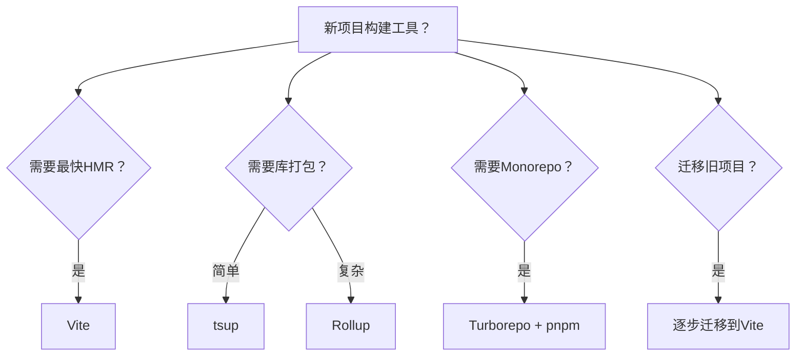
```mermaid
flowchart TD
    A[新项目构建工具？] --> B{需要最快HMR？}
    B -->|是| C[Vite]
    A --> D{需要库打包？}
    D -->|简单| E[tsup]
    D -->|复杂| F[Rollup]
    A --> G{需要Monorepo？}
    G -->|是| H[Turborepo + pnpm]
    A --> I{迁移旧项目？}
    I -->|是| J[逐步迁移到Vite]
```

### ASCII 文本树

```
新项目构建工具？
├── 需要最快HMR？
│   └── Vite
│       📌 冷启动<300ms，HMR即时更新
│       📌 生态丰富，插件多，配置简单
├── 需要库打包？
│   ├── 简单 → tsup
│   │     📌 零配置，基于esbuild，TypeScript库首选
│   │     📌 自动生成dts，支持CJS/ESM双输出
│   └── 复杂 → Rollup
│         📌 最灵活的打包方案，tree-shaking最优
│         📌 适合需要精细控制的大型库
├── 需要Monorepo？
│   └── Turborepo + pnpm
│       📌 远程缓存，并行执行，任务管道
│       📌 pnpm workspace + Turborepo = 最佳实践
└── 迁移旧项目？
    └── 逐步迁移到Vite
        📌 支持渐进式迁移，兼容性模式
        📌 可先迁移开发环境，保留生产构建
```

### 快速推荐

| 场景 | 推荐 | 理由 |
|------|------|------|
| 新项目 | **Vite** | 开发体验最佳，社区生态最大 |
| TypeScript库 | **tsup** | 一行命令打包，零配置 |
| Monorepo | **Turborepo + pnpm** | 构建缓存，CI/CD加速 |
| 大型库 | **Rollup** | 输出控制最精细 |
| Webpack迁移 | **Vite** | 有官方迁移指南，成本可控 |

---

## 4. 后端框架选型决策树

### Mermaid 流程图

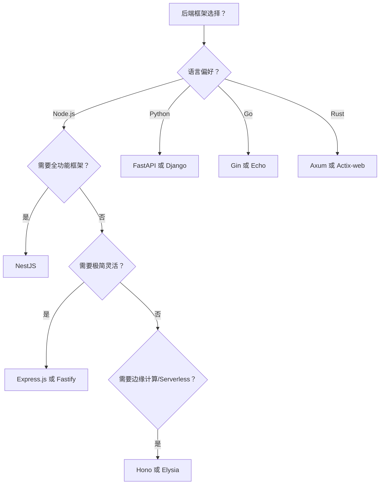
```mermaid
flowchart TD
    A[后端框架选择？] --> B{语言偏好？}
    B -->|Node.js| C{需要全功能框架？}
    B -->|Python| D[FastAPI 或 Django]
    B -->|Go| E[Gin 或 Echo]
    B -->|Rust| F[Axum 或 Actix-web]
    C -->|是| G[NestJS]
    C -->|否| H{需要极简灵活？}
    H -->|是| I[Express.js 或 Fastify]
    H -->|否| J{需要边缘计算/Serverless？}
    J -->|是| K[Hono 或 Elysia]
```

### ASCII 文本树

```
后端框架选择？
├── 语言偏好？
│   ├── Node.js → 继续
│   ├── Python → FastAPI 或 Django
│   │             📌 FastAPI：现代异步，自动生成文档，TypeHint友好
│   │             📌 Django：全功能，ORM强大，适合快速开发
│   ├── Go → Gin 或 Echo
│   │         📌 Gin：性能极高，国内社区活跃
│   │         📌 Echo：简洁现代，中间件丰富
│   └── Rust → Axum 或 Actix-web
│               📌 Axum：Tokio生态，类型安全
│               📌 Actix-web：性能王者，Actor模型
└── Node.js 具体选择
    ├── 需要全功能框架？
    │   ├── 是 → NestJS
    │   │         📌 企业级架构，依赖注入，模块化设计
    │   │         📌 类似Angular，适合大型团队协作
    │   └── 否 → 继续
    ├── 需要极简灵活？
    │   ├── 是 → Express.js 或 Fastify
    │   │         📌 Express：生态最成熟，中间件最多
    │   │         📌 Fastify：性能更好，JSON Schema验证
    │   └── 否 → 继续
    └── 需要边缘计算/Serverless？
        └── Hono 或 Elysia
            📌 Hono：超轻量，多运行时支持(Node/Bun/Deno)
            📌 Elysia：Bun原生，类型安全端到端
```

### 快速推荐

| 场景 | 推荐 | 理由 |
|------|------|------|
| 企业级Node.js | **NestJS** | 架构规范，适合大型团队 |
| 快速API开发 | **Fastify** | 性能优于Express，现代特性 |
| 全栈TypeScript | **Elysia + Bun** | 端到端类型安全 |
| Serverless | **Hono** | 冷启动快，多平台支持 |
| Python API | **FastAPI** | 异步现代，自动生成Swagger |
| 高性能API | **Go/Gin** | 资源占用低，并发强 |
| 极致性能 | **Rust/Actix-web** | 内存安全，速度最快 |

---

## 5. ORM选型决策树

### Mermaid 流程图

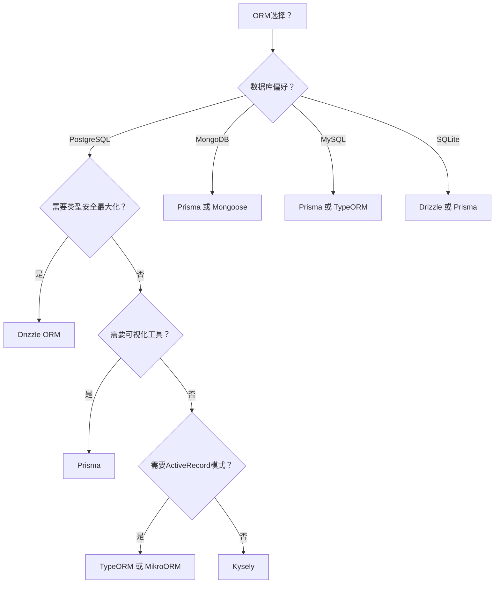
```mermaid
flowchart TD
    A[ORM选择？] --> B{数据库偏好？}
    B -->|PostgreSQL| C{需要类型安全最大化？}
    B -->|MongoDB| D[Prisma 或 Mongoose]
    B -->|MySQL| E[Prisma 或 TypeORM]
    B -->|SQLite| F[Drizzle 或 Prisma]
    C -->|是| G[Drizzle ORM]
    C -->|否| H{需要可视化工具？}
    H -->|是| I[Prisma]
    H -->|否| J{需要ActiveRecord模式？}
    J -->|是| K[TypeORM 或 MikroORM]
    J -->|否| L[Kysely]
```

### ASCII 文本树

```
ORM选择？
├── 数据库偏好？
│   ├── PostgreSQL → 继续
│   ├── MongoDB → Prisma 或 Mongoose
│   │              📌 Prisma：统一体验，也能连MongoDB
│   │              📌 Mongoose：MongoDB专用，Schema灵活
│   ├── MySQL → Prisma 或 TypeORM
│   └── SQLite → Drizzle 或 Prisma
└── PostgreSQL 具体选择
    ├── 需要类型安全最大化？
    │   ├── 是 → Drizzle ORM
    │   │         📌 SQL-like API，类型推导最强
    │   │         📌 轻量无运行时，接近原生SQL
    │   └── 否 → 继续
    ├── 需要可视化工具？
    │   ├── 是 → Prisma
    │   │         📌 Prisma Studio可视化数据，迁移系统完善
    │   │         📌 生态最佳，文档完善，多数据库支持
    │   └── 否 → 继续
    ├── 需要ActiveRecord模式？
    │   └── TypeORM 或 MikroORM
    │       📌 TypeORM：装饰器风格，类似Java Hibernate
    │       📌 MikroORM：数据映射器，Unit of Work模式
    └── 需要查询构建器？
        └── Kysely
            📌 纯类型安全查询构建器，无实体概念
            📌 最接近SQL，适合复杂查询场景
```

### 快速推荐

| 场景 | 推荐 | 理由 |
|------|------|------|
| 新项目首选 | **Prisma** | 生态最完善，开发体验好 |
| 类型安全优先 | **Drizzle** | 类型推导最强，无运行时 |
| 复杂查询 | **Kysely** | 类型安全+SQL灵活度 |
| 类Hibernate风格 | **TypeORM** | 装饰器模式，熟悉感强 |
| MongoDB | **Mongoose** | 生态成熟，文档丰富 |
| 性能敏感 | **Drizzle** | 运行时开销最小 |

---

## 6. 测试框架选型决策树

### Mermaid 流程图

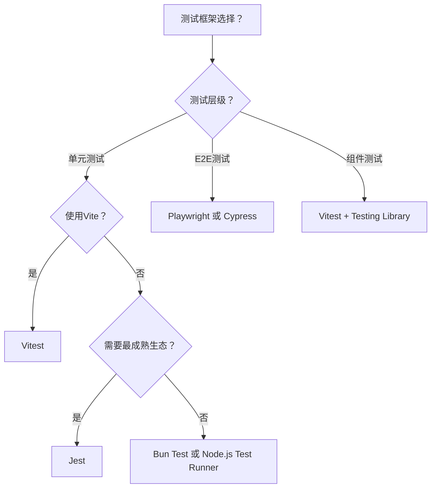
```mermaid
flowchart TD
    A[测试框架选择？] --> B{测试层级？}
    B -->|单元测试| C{使用Vite？}
    B -->|E2E测试| D[Playwright 或 Cypress]
    B -->|组件测试| E[Vitest + Testing Library]
    C -->|是| F[Vitest]
    C -->|否| G{需要最成熟生态？}
    G -->|是| H[Jest]
    G -->|否| I[Bun Test 或 Node.js Test Runner]
```

### ASCII 文本树

```
测试框架选择？
├── 测试层级？
│   ├── 单元测试 → 继续
│   ├── E2E测试 → Playwright 或 Cypress
│   │             📌 Playwright：微软出品，多浏览器，速度快
│   │             📌 Cypress：调试体验好，社区丰富，但单线程
│   └── 组件测试 → Vitest + Testing Library
│                   📌 Vitest：Vite原生，配置继承，速度快
└── 单元测试具体选择
    ├── 使用Vite？
    │   ├── 是 → Vitest
    │   │         📌 与Vite配置共享，HMR支持，API兼容Jest
    │   └── 否 → 继续
    ├── 需要最成熟生态？
    │   └── Jest
    │       📌 生态最丰富，Snapshot测试，Mock功能强
    │       📌 Create React App默认，社区资源多
    └── 需要速度优先？
        └── Bun Test 或 Node.js Test Runner
            📌 Bun Test：Bun原生，速度极快
            📌 Node Test Runner：无需依赖，Node 20+内置
```

### 快速推荐

| 场景 | 推荐 | 理由 |
|------|------|------|
| Vite项目 | **Vitest** | 无缝集成，配置零重复 |
| E2E测试 | **Playwright** | 速度更快，多浏览器并行 |
| 传统企业项目 | **Jest** | 生态最成熟，文档最多 |
| 纯Node.js | **Node Test Runner** | 零依赖，内置断言 |
| 组件测试 | **Testing Library** | 用户行为导向，无障碍友好 |
| API测试 | **Vitest + MSW** | Mock服务 worker，真实HTTP模拟 |
| 视觉回归 | **Playwright + Storybook** | 截图对比，组件文档 |

---

## 7. 包管理器选型决策树

### Mermaid 流程图

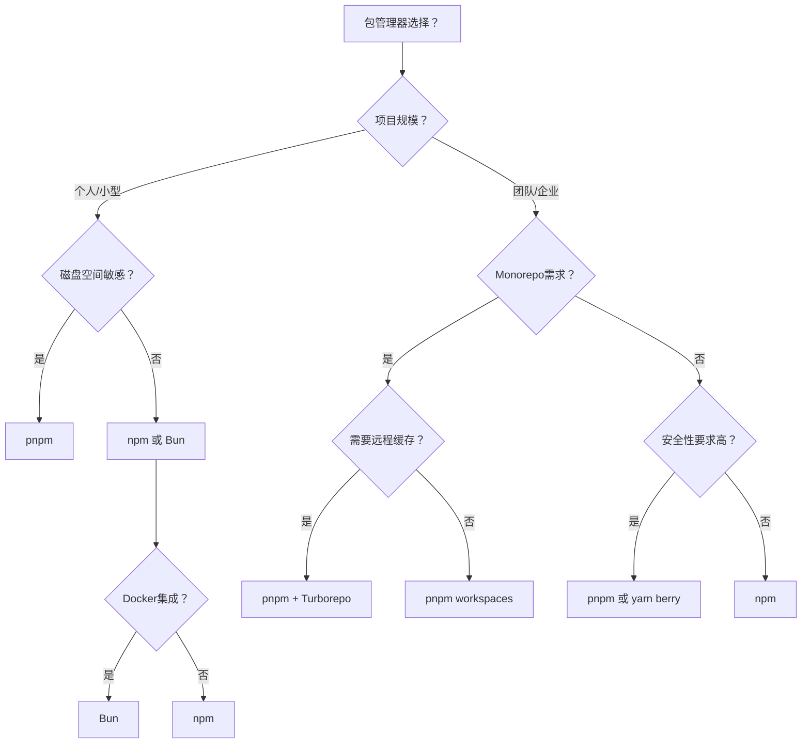
```mermaid
flowchart TD
    A[包管理器选择？] --> B{项目规模？}
    B -->|个人/小型| C{磁盘空间敏感？}
    B -->|团队/企业| D{Monorepo需求？}
    C -->|是| E[pnpm]
    C -->|否| F[npm 或 Bun]
    D -->|是| G{需要远程缓存？}
    D -->|否| H{安全性要求高？}
    G -->|是| I[pnpm + Turborepo]
    G -->|否| J[pnpm workspaces]
    H -->|是| K[pnpm 或 yarn berry]
    H -->|否| L[npm]
    F --> M{Docker集成？}
    M -->|是| N[Bun]
    M -->|否| O[npm]
```

### ASCII 文本树

```
包管理器选择？
├── 项目规模？
│   ├── 个人/小型 → 磁盘空间敏感？
│   │   ├── 是 → pnpm
│   │   │         📌 硬链接节省磁盘，node_modules结构扁平
│   │   │         📌 安装速度比npm快3倍，默认lockfile
│   │   └── 否 → npm 或 Bun
│   │       ├── Docker集成？
│   │       │   ├── 是 → Bun
│   │       │   │         📌 内置运行时+包管理器，Docker镜像极小
│   │       │   │         📌 lockfile兼容npm，安装速度极快
│   │       │   └── 否 → npm
│   │       │             📌 Node.js内置，零学习成本，生态最通用
│   │       │             📌 适合：不需要特殊功能的标准项目
│   └── 团队/企业 → Monorepo需求？
│       ├── 是 → 需要远程缓存？
│       │   ├── 是 → pnpm + Turborepo
│       │   │         📌 pnpm workspace + Turborepo远程缓存 = 企业级Monorepo
│       │   │         📌 支持任务管道，并行执行，CI/CD大幅加速
│       │   └── 否 → pnpm workspaces
│       │             📌 原生workspace支持，filter命令强大
│       │             📌 比yarn workspaces更省磁盘，更快速度
│       └── 否 → 安全性要求高？
│           ├── 是 → pnpm 或 yarn berry
│           │   📌 pnpm：严格依赖隔离，自动阻止幽灵依赖
│           │   📌 yarn berry：Plug'n'Play零依赖，签名验证支持
│           └── 否 → npm
│               📌 成熟稳定，企业审计友好，与Registry生态无缝
```

### 快速推荐

| 场景 | 推荐 | 理由 |
|------|------|------|
| 个人项目 | **npm** | 零配置，随Node.js安装 |
| 磁盘空间敏感 | **pnpm** | 硬链接机制，全局存储节省空间 |
| Monorepo | **pnpm + Turborepo** | 远程缓存，任务管道，filter命令 |
| 极致速度 | **Bun** | 安装速度最快，内置运行时 |
| 企业安全 | **pnpm** | 严格依赖隔离，阻止幽灵依赖 |
| Docker场景 | **Bun** | 极简镜像，单二进制 |
| Yarn迁移 | **yarn berry** | Plug'n'Play，离线模式 |

### 参考对比矩阵

- [包管理器对比矩阵](../comparison-matrices/package-managers-compare.md)

---

## 8. Monorepo 工具选型决策树

### Mermaid 流程图

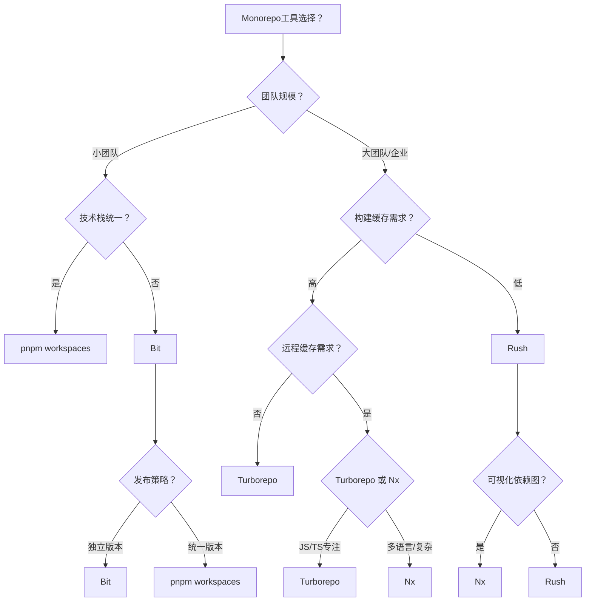
```mermaid
flowchart TD
    A[Monorepo工具选择？] --> B{团队规模？}
    B -->|小团队| C{技术栈统一？}
    B -->|大团队/企业| D{构建缓存需求？}
    C -->|是| E[pnpm workspaces]
    C -->|否| F[Bit]
    D -->|高| G{远程缓存需求？}
    D -->|低| H[Rush]
    G -->|是| I{Turborepo 或 Nx}
    G -->|否| J[Turborepo]
    I -->|JS/TS专注| K[Turborepo]
    I -->|多语言/复杂| L[Nx]
    F --> M{发布策略？}
    M -->|独立版本| N[Bit]
    M -->|统一版本| O[pnpm workspaces]
    H --> P{可视化依赖图？}
    P -->|是| Q[Nx]
    P -->|否| R[Rush]
```

### ASCII 文本树

```
Monorepo工具选择？
├── 团队规模？
│   ├── 小团队 → 技术栈统一？
│   │   ├── 是 → pnpm workspaces
│   │   │         📌 零额外工具，pnpm原生支持，上手成本最低
│   │   │         📌 适合：同技术栈的小型项目集合
│   │   └── 否 → Bit
│   │             📌 组件驱动开发，支持异构技术栈组合
│   │             📌 适合：微前端、跨框架组件库
│   └── 大团队/企业 → 构建缓存需求？
│       ├── 高 → 远程缓存需求？
│       │   ├── 是 → JS/TS专注？
│       │   │   ├── 是 → Turborepo
│       │   │   │         📌 Vercel出品，与JS生态深度集成
│       │   │   │         📌 配置极简，远程缓存免费额度 generous
│       │   │   └── 否 → Nx
│       │   │             📌 多语言支持，插件生态丰富
│       │   │             📌 强大的依赖图分析和项目约束规则
│       │   └── 否 → Turborepo
│       │       📌 本地任务缓存，并行执行，增量构建
│       └── 低 → Rush
│           📌 微软出品，企业级版本管理，统一版本策略
│           📌 内置发布流程，change log自动生成
```

### 快速推荐

| 场景 | 推荐 | 理由 |
|------|------|------|
| 小型JS/TS项目 | **pnpm workspaces** | 零额外依赖，足够简单 |
| 追求极速构建 | **Turborepo** | 配置简单，远程缓存开箱即用 |
| 多语言Monorepo | **Nx** | 插件生态最全，不限于JS |
| 企业级发布管理 | **Rush** | 微软出品，版本策略严谨 |
| 跨框架组件库 | **Bit** | 组件级独立发布，技术栈无关 |
| 大型团队 | **Nx 或 Turborepo** | 依赖图可视化，任务并行化 |

### 参考对比矩阵

- [Monorepo 工具对比矩阵](../comparison-matrices/monorepo-tools-compare.md)

---

## 9. 部署平台选型决策树

### Mermaid 流程图

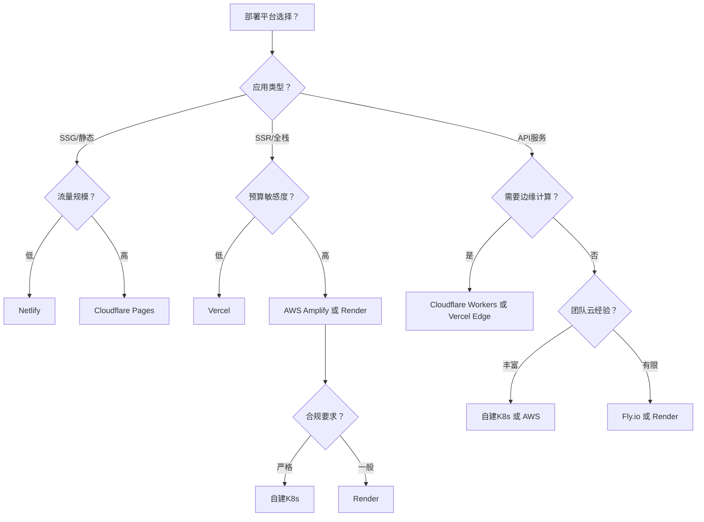
```mermaid
flowchart TD
    A[部署平台选择？] --> B{应用类型？}
    B -->|SSG/静态| C{流量规模？}
    B -->|SSR/全栈| D{预算敏感度？}
    B -->|API服务| E{需要边缘计算？}
    C -->|低| F[Netlify]
    C -->|高| G[Cloudflare Pages]
    D -->|低| H[Vercel]
    D -->|高| I[AWS Amplify 或 Render]
    E -->|是| J[Cloudflare Workers 或 Vercel Edge]
    E -->|否| K{团队云经验？}
    K -->|丰富| L[自建K8s 或 AWS]
    K -->|有限| M[Fly.io 或 Render]
    I --> N{合规要求？}
    N -->|严格| O[自建K8s]
    N -->|一般| P[Render]
```

### ASCII 文本树

```
部署平台选择？
├── 应用类型？
│   ├── SSG/静态 → 流量规模？
│   │   ├── 低 → Netlify
│   │   │         📌 静态托管标杆，表单处理+Identity集成
│   │   │         📌 免费额度 generous，适合个人/开源项目
│   │   └── 高 → Cloudflare Pages
│   │             📌 全球CDN，边缘缓存，免费流量几乎无限
│   │             📌 与Workers无缝集成，边缘函数支持
│   ├── SSR/全栈 → 预算敏感度？
│   │   ├── 低 → Vercel
│   │   │         📌 NextJS官方平台，零配置部署，预览环境自动生成
│   │   │         📌 生态最全，但超出免费额度费用较高
│   │   └── 高 → AWS Amplify 或 Render
│   │       ├── 合规要求？
│   │       │   ├── 严格 → 自建K8s
│   │       │   │         📌 完全可控，数据驻留自主管理
│   │       │   │         📌 适合：金融、医疗等强合规行业
│   │       │   └── 一般 → Render
│   │       │             📌 价格透明，自动SSL，数据库托管一体
│   │       │             📌 适合：初创团队，预算敏感的全栈应用
│   └── API服务 → 需要边缘计算？
│       ├── 是 → Cloudflare Workers 或 Vercel Edge
│       │         📌 Cloudflare Workers：V8 isolate，冷启动0ms
│       │         📌 Vercel Edge：与NextJS深度集成，全球低延迟
│       └── 否 → 团队云经验？
│           ├── 丰富 → 自建K8s 或 AWS
│           │         📌 K8s：容器编排标准，多云可移植
│           └── 有限 → Fly.io
│                     📌 按区域部署容器，全球负载均衡极简
│                     📌 自带PostgreSQL托管，适合全栈API
```

### 快速推荐

| 场景 | 推荐 | 理由 |
|------|------|------|
| NextJS应用 | **Vercel** | 官方平台，功能集成最深 |
| 静态网站/博客 | **Cloudflare Pages** | 免费流量大，全球CDN |
| 边缘API/Worker | **Cloudflare Workers** | 冷启动为零，定价低 |
| 预算敏感全栈 | **Render** | 价格透明，一体化托管 |
| 全球容器部署 | **Fly.io** | 区域级部署，数据库一体 |
| 强合规需求 | **自建K8s** | 完全自主可控 |
| AWS生态 | **AWS Amplify** | 与AWS服务深度集成 |

### 参考对比矩阵

- [部署平台对比矩阵](../comparison-matrices/deployment-platforms-compare.md)

---

## 10. 监控与可观测性选型决策树

### Mermaid 流程图

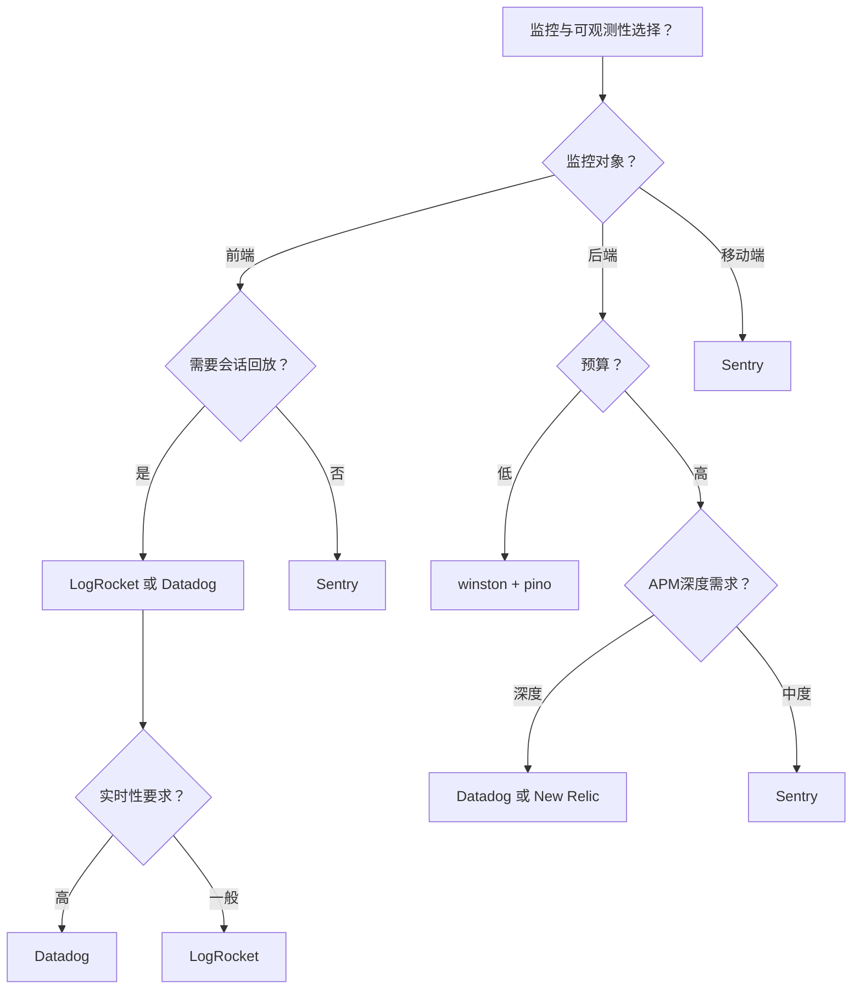
```mermaid
flowchart TD
    A[监控与可观测性选择？] --> B{监控对象？}
    B -->|前端| C{需要会话回放？}
    B -->|后端| D{预算？}
    B -->|移动端| E[Sentry]
    C -->|是| F[LogRocket 或 Datadog]
    C -->|否| G[Sentry]
    D -->|低| H[winston + pino]
    D -->|高| I{APM深度需求？}
    I -->|深度| J[Datadog 或 New Relic]
    I -->|中度| K[Sentry]
    F --> L{实时性要求？}
    L -->|高| M[Datadog]
    L -->|一般| N[LogRocket]
```

### ASCII 文本树

```
监控与可观测性选择？
├── 监控对象？
│   ├── 前端 → 需要会话回放？
│   │   ├── 是 → LogRocket 或 Datadog
│   │   │         📌 LogRocket：前端会话回放标杆，DOM录制精准
│   │   │         📌 Datadog：全栈可观测，RUM+APM关联分析
│   │   └── 否 → Sentry
│   │       📌 错误追踪行业标杆，source map还原精准
│   │       📌 性能监控、发布健康度、Issue自动分配
│   ├── 后端 → 预算？
│   │   ├── 低 → winston + pino
│   │   │         📌 winston：生态最成熟，传输方式丰富
│   │   │         📌 pino：高性能JSON日志，开销极低
│   │   └── 高 → APM深度需求？
│   │       ├── 深度 → Datadog 或 New Relic
│   │       │         📌 Datadog：基础设施+应用+日志统一平台
│   │       │         📌 New Relic：APM先驱，分布式追踪完善
│   │       └── 中度 → Sentry
│   │           📌 后端错误追踪，性能监控，发布回归检测
│   └── 移动端 → Sentry
│       📌 跨平台支持(iOS/Android/RN/Flutter)，崩溃符号化
│       📌 发布版本追踪，用户影响面评估
```

### 快速推荐

| 场景 | 推荐 | 理由 |
|------|------|------|
| 前端错误追踪 | **Sentry** | source map还原最准，生态最全 |
| 前端会话回放 | **LogRocket** | DOM录制体验最佳 |
| 全栈可观测 | **Datadog** | APM+日志+基础设施统一 |
| 预算有限 | **pino + Sentry** | 高性能日志+核心错误追踪 |
| 移动端崩溃 | **Sentry** | 跨平台，符号化完善 |
| 企业级APM | **New Relic** | 分布式追踪成熟 |
| 自托管日志 | **winston** | 传输插件丰富，生态成熟 |

### 参考对比矩阵

- [可观测性工具对比矩阵](../comparison-matrices/observability-tools-compare.md)

---

## 11. CI/CD 流水线选型决策树

### Mermaid 流程图

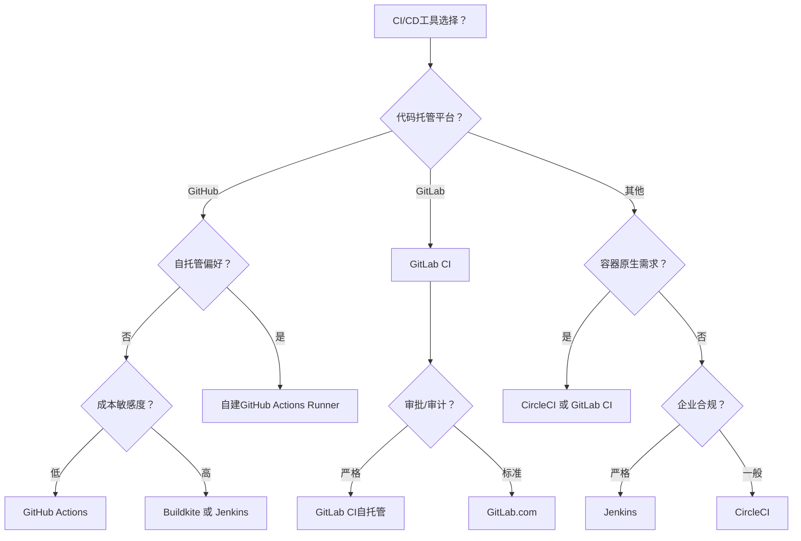
```mermaid
flowchart TD
    A[CI/CD工具选择？] --> B{代码托管平台？}
    B -->|GitHub| C{自托管偏好？}
    B -->|GitLab| D[GitLab CI]
    B -->|其他| E{容器原生需求？}
    C -->|否| F{成本敏感度？}
    C -->|是| G[自建GitHub Actions Runner]
    F -->|低| H[GitHub Actions]
    F -->|高| I[Buildkite 或 Jenkins]
    E -->|是| J[CircleCI 或 GitLab CI]
    E -->|否| K{企业合规？}
    K -->|严格| L[Jenkins]
    K -->|一般| M[CircleCI]
    D --> N{审批/审计？}
    N -->|严格| O[GitLab CI自托管]
    N -->|标准| P[GitLab.com]
```

### ASCII 文本树

```
CI/CD工具选择？
├── 代码托管平台？
│   ├── GitHub → 自托管偏好？
│   │   ├── 否 → 成本敏感度？
│   │   │   ├── 低 → GitHub Actions
│   │   │   │         📌 与GitHub深度集成，Actions Marketplace丰富
│   │   │   │         📌 矩阵构建，并发执行，预览环境自动部署
│   │   │   └── 高 → Buildkite 或 Jenkins
│   │   │       📌 Buildkite：混合模式，SaaS控制+自托管Runner，按用户定价
│   │   │       📌 Jenkins：完全免费，插件最多，但维护成本高
│   │   └── 是 → 自建GitHub Actions Runner
│   │       📌 数据不出境，自定义硬件资源，企业级隔离
│   ├── GitLab → 审批/审计需求？
│   │   ├── 严格 → GitLab CI自托管
│   │   │         📌 完整DevOps平台，CI/CD+代码+Issue一体化
│   │   │         📌 审批流程、审计日志、合规认证齐全
│   │   └── 标准 → GitLab.com
│   │       📌 与GitLab仓库无缝，CI配置即代码(.gitlab-ci.yml)
│   └── 其他 → 容器原生需求？
│       ├── 是 → CircleCI 或 GitLab CI
│       │   📌 CircleCI：Docker原生，执行速度快，配置简洁
│       │   📌 GitLab CI：Kubernetes Executor，弹性伸缩
│       └── 否 → 企业合规？
│           ├── 严格 → Jenkins
│           │         📌 完全自托管，数据主权可控，插件覆盖一切
│           └── 一般 → CircleCI
│               📌 云原生，SSH调试，并行工作流强大
```

### 快速推荐

| 场景 | 推荐 | 理由 |
|------|------|------|
| GitHub仓库 | **GitHub Actions** | 原生集成，Marketplace丰富 |
| 完整DevOps平台 | **GitLab CI** | 代码+CI+CD+监控一体化 |
| 容器原生构建 | **CircleCI** | Docker优化，执行速度快 |
| 完全自托管 | **Jenkins** | 零授权费，插件生态最全 |
| 混合模式 | **Buildkite** | SaaS控制+自托管执行器 |
| 企业合规/审计 | **GitLab自托管** | 审批流程，审计日志完备 |
| 预算敏感 | **Jenkins** | 开源免费，硬件自主 |

### 参考对比矩阵

- [CI/CD 工具对比矩阵](../comparison-matrices/ci-cd-tools-compare.md)

---

## 12. Web API 技术选型决策树

### Mermaid 流程图

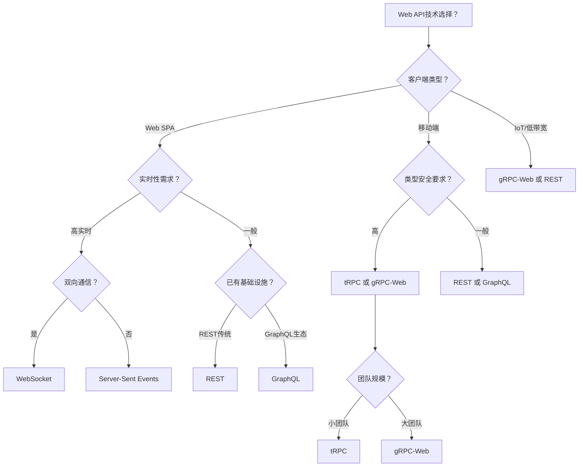
```mermaid
flowchart TD
    A[Web API技术选择？] --> B{客户端类型？}
    B -->|Web SPA| C{实时性需求？}
    B -->|移动端| D{类型安全要求？}
    B -->|IoT/低带宽| E[gRPC-Web 或 REST]
    C -->|高实时| F{双向通信？}
    C -->|一般| G{已有基础设施？}
    F -->|是| H[WebSocket]
    F -->|否| I[Server-Sent Events]
    D -->|高| J[tRPC 或 gRPC-Web]
    D -->|一般| K[REST 或 GraphQL]
    G -->|REST传统| L[REST]
    G -->|GraphQL生态| M[GraphQL]
    J --> N{团队规模？}
    N -->|小团队| O[tRPC]
    N -->|大团队| P[gRPC-Web]
```

### ASCII 文本树

```
Web API技术选择？
├── 客户端类型？
│   ├── Web SPA → 实时性需求？
│   │   ├── 高实时 → 双向通信？
│   │   │   ├── 是 → WebSocket
│   │   │   │         📌 全双工通道，聊天/协作/游戏首选
│   │   │   │         📌 Socket.io降级友好，rooms机制强大
│   │   │   └── 否 → Server-Sent Events
│   │   │             📌 单向服务端推送，基于HTTP，自动重连
│   │   │             📌 适合：股票行情、实时通知、日志流
│   │   └── 一般 → 已有基础设施？
│   │       ├── REST传统 → REST
│   │       │         📌 最通用，缓存友好，CDN支持好
│   │       │         📌 适合：无特殊需求的标准CRUD服务
│   │       └── GraphQL生态 → GraphQL
│   │           📌 客户端驱动查询，一次请求获取所需数据
│   │           📌 适合：复杂数据关系，前端需求多变
│   ├── 移动端 → 类型安全要求？
│   │   ├── 高 → 团队规模？
│   │   │   ├── 小团队 → tRPC
│   │   │   │         📌 端到端TypeScript类型安全，零样板代码
│   │   │   │         📌 需全栈TypeScript，仅适合统一技术栈
│   │   │   └── 大团队 → gRPC-Web
│   │   │             📌 强Schema约束，多语言代码生成
│   │   │             📌 HTTP/2传输，二进制ProtoBuf高效
│   │   └── 一般 → REST 或 GraphQL
│   │       📌 REST：移动端缓存策略成熟，开发成本低
│   │       📌 GraphQL：减少请求次数，弱网环境友好
│   └── IoT/低带宽 → gRPC-Web 或 REST
│       📌 gRPC-Web：二进制传输，带宽占用最低
│       📌 REST：兼容性最好，嵌入式设备友好
```

### 快速推荐

| 场景 | 推荐 | 理由 |
|------|------|------|
| 标准CRUD API | **REST** | 最通用，缓存成熟 |
| 前端数据灵活查询 | **GraphQL** | 客户端驱动，减少往返 |
| 全栈TypeScript | **tRPC** | 端到端类型安全 |
| 实时双向通信 | **WebSocket** | 全双工，生态成熟 |
| 服务端推送 | **Server-Sent Events** | HTTP原生，自动重连 |
| 移动端/多语言 | **gRPC-Web** | 强Schema，二进制高效 |
| 物联网/低带宽 | **gRPC-Web** | ProtoBuf压缩率高 |

### 参考对比矩阵

- [后端框架对比矩阵](../comparison-matrices/backend-frameworks-compare.md)
- [部署平台对比矩阵](../comparison-matrices/deployment-platforms-compare.md)

---

## 13. 认证方案选型决策树

### Mermaid 流程图

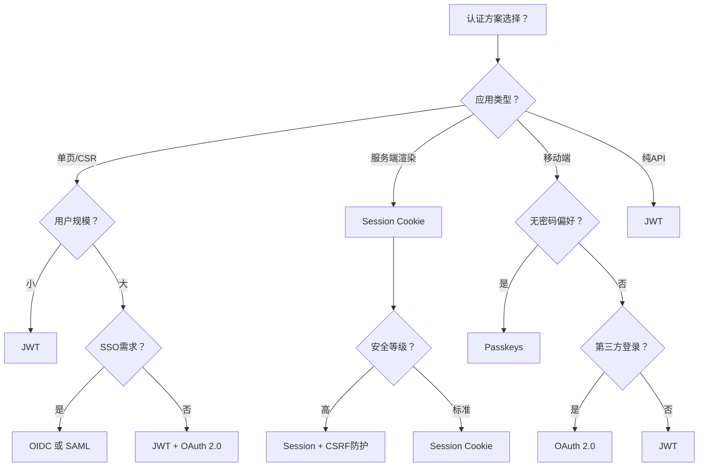
```mermaid
flowchart TD
    A[认证方案选择？] --> B{应用类型？}
    B -->|单页/CSR| C{用户规模？}
    B -->|服务端渲染| D[Session Cookie]
    B -->|移动端| E{无密码偏好？}
    B -->|纯API| F[JWT]
    C -->|小| G[JWT]
    C -->|大| H{SSO需求？}
    E -->|是| I[Passkeys]
    E -->|否| J{第三方登录？}
    H -->|是| K[OIDC 或 SAML]
    H -->|否| L[JWT + OAuth 2.0]
    J -->|是| M[OAuth 2.0]
    J -->|否| N[JWT]
    D --> O{安全等级？}
    O -->|高| P[Session + CSRF防护]
    O -->|标准| Q[Session Cookie]
```

### ASCII 文本树

```
认证方案选择？
├── 应用类型？
│   ├── 单页/CSR → 用户规模？
│   │   ├── 小 → JWT
│   │   │         📌 无状态，水平扩展友好，实现简单
│   │   │         📌 注意：需配合HttpOnly cookie存储防XSS
│   │   └── 大 → SSO需求？
│   │       ├── 是 → OIDC 或 SAML
│   │       │         📌 OIDC：现代标准，基于OAuth 2.0，JSON格式
│   │       │         📌 SAML：企业级，XML断言，与AD/LDAP集成深
│   │       └── 否 → JWT + OAuth 2.0
│   │           📌 OAuth 2.0：授权框架，适合第三方登录场景
│   │           📌 PKCE流程保护移动/SPA端的授权码
│   ├── 服务端渲染 → 安全等级？
│   │   ├── 高 → Session + CSRF防护
│   │   │         📌 服务端存储状态，可即时撤销
│   │   │         📌 CSRF Token + SameSite Cookie，安全性最高
│   │   └── 标准 → Session Cookie
│   │       📌 传统可靠，自动处理HttpOnly/Secure/SameSite
│   │       📌 适合：SSR框架(NextJS/Nuxt)原生支持
│   ├── 移动端 → 无密码偏好？
│   │   ├── 是 → Passkeys
│   │   │         📌 FIDO2/WebAuthn，生物识别/硬件密钥
│   │   │         📌 防钓鱼，无共享密钥，未来趋势
│   │   └── 否 → 第三方登录？
│   │       ├── 是 → OAuth 2.0
│   │       │         📌 社交登录，Apple/Google/微信一键授权
│   │       └── 否 → JWT
│   │           📌 移动端存储安全区(Keychain/Keystore)，刷新Token轮转
│   └── 纯API → JWT
│       📌 无状态认证，适合微服务间传递
│       📌 短期access token + 长期refresh token组合
```

### 快速推荐

| 场景 | 推荐 | 理由 |
|------|------|------|
| SSR应用 | **Session Cookie** | 原生安全，可即时撤销 |
| 单页应用 | **JWT in HttpOnly Cookie** | 无状态，扩展性好 |
| 第三方登录 | **OAuth 2.0 + OIDC** | 行业标准，社交登录兼容 |
| 企业SSO | **SAML / OIDC** | 与IdP深度集成 |
| 移动端原生 | **JWT + Passkeys** | 安全区存储+无密码 |
| 微服务间 | **JWT** | 无状态传递，服务解耦 |
| 未来趋势 | **Passkeys** | 防钓鱼，用户体验好 |

### 参考对比矩阵

- [安全与合规分类文档](../categories/security-compliance.md)

---

## 14. 数据存储选型决策树

### Mermaid 流程图

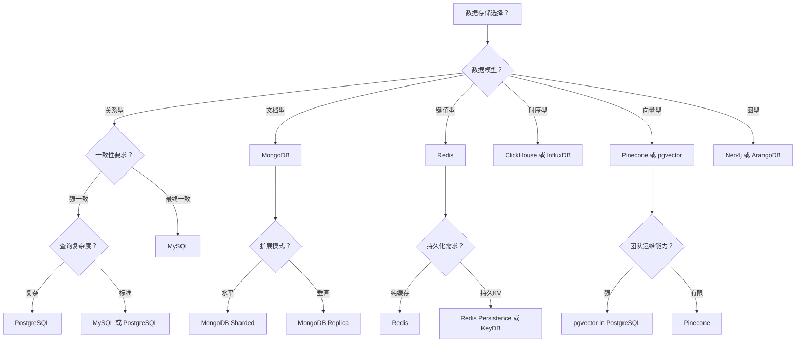
```mermaid
flowchart TD
    A[数据存储选择？] --> B{数据模型？}
    B -->|关系型| C{一致性要求？}
    B -->|文档型| D[MongoDB]
    B -->|键值型| E[Redis]
    B -->|时序型| F[ClickHouse 或 InfluxDB]
    B -->|向量型| G[Pinecone 或 pgvector]
    B -->|图型| H[Neo4j 或 ArangoDB]
    C -->|强一致| I{查询复杂度？}
    C -->|最终一致| J[MySQL]
    I -->|复杂| K[PostgreSQL]
    I -->|标准| L[MySQL 或 PostgreSQL]
    D --> M{扩展模式？}
    M -->|水平| N[MongoDB Sharded]
    M -->|垂直| O[MongoDB Replica]
    E --> P{持久化需求？}
    P -->|纯缓存| Q[Redis]
    P -->|持久KV| R[Redis Persistence 或 KeyDB]
    G --> S{团队运维能力？}
    S -->|强| T[pgvector in PostgreSQL]
    S -->|有限| U[Pinecone]
```

### ASCII 文本树

```
数据存储选择？
├── 数据模型？
│   ├── 关系型 → 一致性要求？
│   │   ├── 强一致 → 查询复杂度？
│   │   │   ├── 复杂 → PostgreSQL
│   │   │   │         📌 高级查询优化器，窗口函数，CTE递归
│   │   │   │         📌 JSONB支持文档查询，PostGIS地理扩展
│   │   │   │         📌 pgvector插件支持向量搜索
│   │   │   └── 标准 → MySQL 或 PostgreSQL
│   │   │       📌 MySQL：国内生态最熟，读写分离方案成熟
│   │   │       📌 PostgreSQL：功能更全，扩展生态丰富
│   │   └── 最终一致 → MySQL
│   │       📌 主从异步复制，读扩展性好，运维简单
│   ├── 文档型 → MongoDB
│   │   📌 Schema灵活，嵌套文档，聚合管道强大
│   │   📌 水平分片成熟，适合：内容管理、用户画像、日志
│   ├── 键值型 → Redis
│   │   📌 内存级延迟，数据结构丰富(String/Hash/Stream)
│   │   📌 持久化RDB/AOF，适合：缓存、会话、排行榜、限流
│   ├── 搜索/日志 → Elasticsearch
│   │   📌 倒排索引，全文搜索，聚合分析
│   │   📌 ELK生态成熟，适合：日志分析、站内搜索、APM
│   ├── 时序型 → ClickHouse
│   │   📌 列式存储，压缩率高，聚合查询极速
│   │   📌 适合：Metrics、IoT数据、大规模日志分析
│   ├── 向量型 → 团队运维能力？
│   │   ├── 强 → pgvector in PostgreSQL
│   │   │         📌 同一数据库管理，ACID保障，成本最低
│   │   └── 有限 → Pinecone
│   │       📌 全托管向量数据库，语义搜索开箱即用
│   │       📌 自动索引优化，无需调参
│   └── 图型 → Neo4j
│       📌 原生图存储，Cypher查询直观
│       📌 适合：知识图谱、社交网络、推荐系统
```

### 快速推荐

| 场景 | 推荐 | 理由 |
|------|------|------|
| 通用关系型 | **PostgreSQL** | 功能最全，扩展丰富 |
| 国内传统项目 | **MySQL** | 生态最熟，运维资源多 |
| Schema灵活 | **MongoDB** | 文档模型，快速迭代 |
| 缓存/会话 | **Redis** | 内存级速度，数据结构丰富 |
| 全文搜索 | **Elasticsearch** | 倒排索引，ELK生态 |
| 时序/分析 | **ClickHouse** | 列式存储，聚合极速 |
| 向量/RAG | **Pinecone** | 托管服务，开箱即用 |
| 图数据库 | **Neo4j** | 原生图存储，Cypher直观 |

### 参考对比矩阵

- [ORM 对比矩阵](../comparison-matrices/orm-compare.md)

---

## 决策速查表

| 技术领域 | 首选推荐 | 备选方案 |
|---------|---------|---------|
| React UI库 | shadcn/ui + Tailwind | Ant Design |
| 状态管理 | Zustand | Jotai / TanStack Query |
| 构建工具 | Vite | Rollup (库) |
| Node.js后端 | NestJS (大型) / Fastify (中小型) | Hono (边缘) |
| ORM | Prisma | Drizzle |
| 测试 | Vitest + Playwright | Jest + Cypress |
| 包管理器 | pnpm | npm / Bun |
| Monorepo工具 | Turborepo + pnpm | Nx / Rush |
| 部署平台 | Vercel (全栈) / Cloudflare (静态) | Render / Fly.io |
| 监控可观测 | Sentry + Datadog | LogRocket / New Relic |
| CI/CD | GitHub Actions | GitLab CI / CircleCI |
| Web API | REST (通用) / GraphQL (灵活) | tRPC / gRPC-Web |
| 认证方案 | JWT (API/SPA) / Session (SSR) | OIDC / Passkeys |
| 数据存储 | PostgreSQL | MongoDB / Redis |

---

> 💡 **提示**：以上推荐基于2024-2025年技术趋势和生态活跃度，实际选型需结合团队技术栈和项目具体需求。
