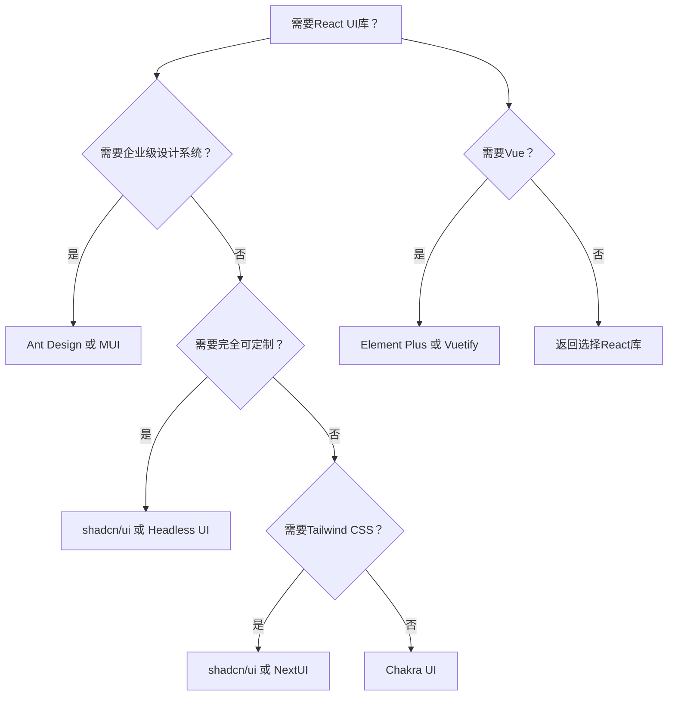
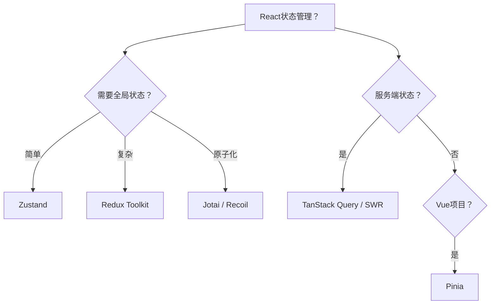
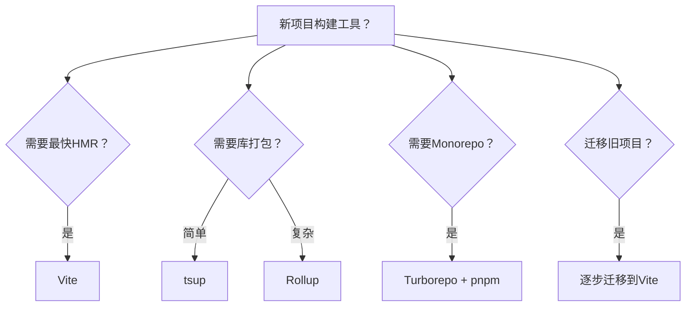
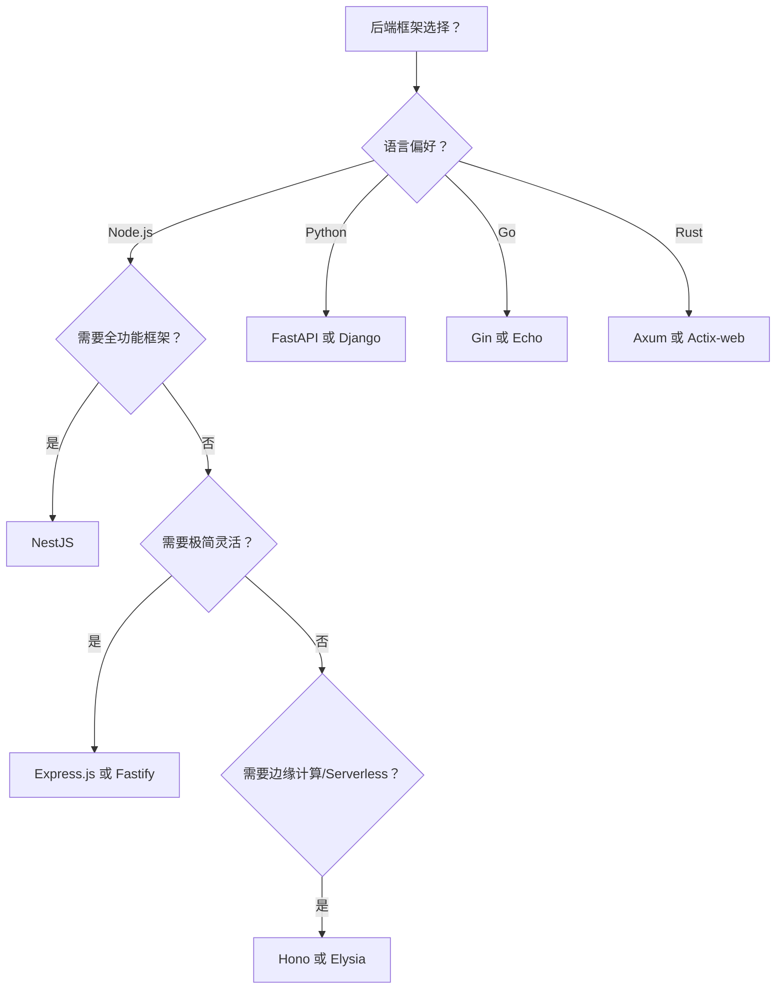
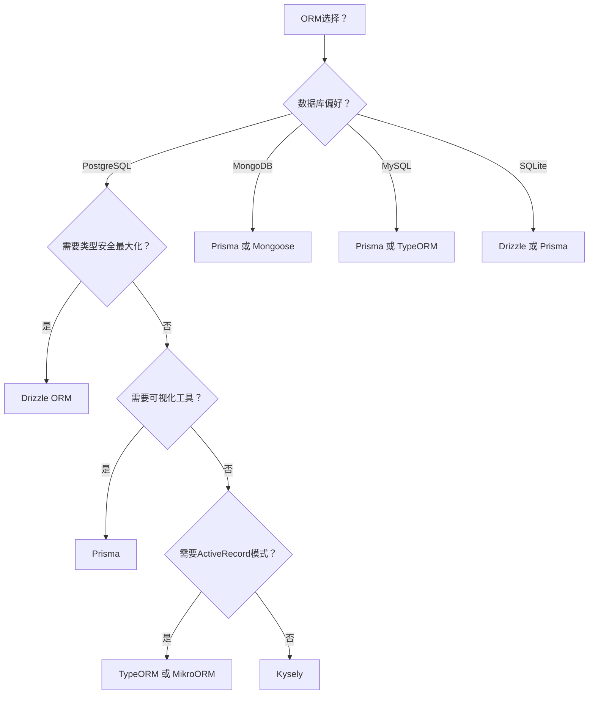
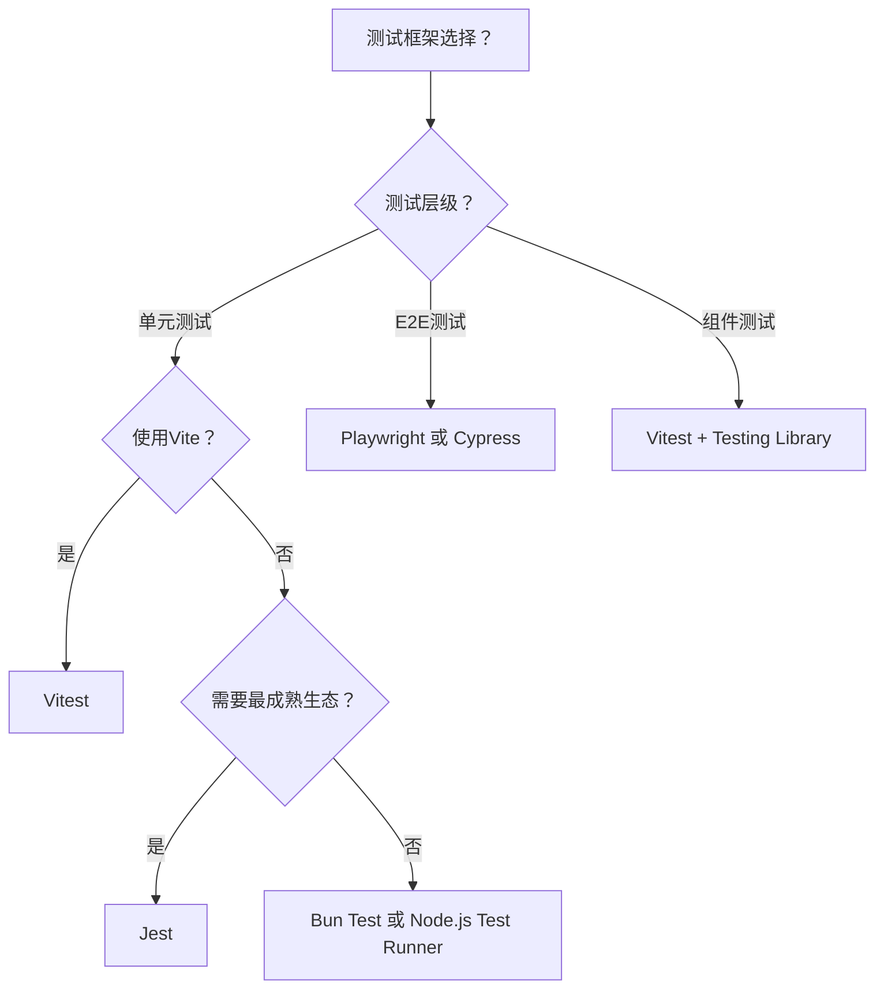

# 技术选型决策树

> 交互式技术选型指南，帮助你根据项目需求快速选择合适的技术栈。
> 每个选型均提供 **Mermaid 可视化流程图**（推荐在 VitePress 网站中浏览）和 **ASCII 文本树**（兼容纯文本阅读）。

---

## 1. UI库选型决策树

### Mermaid 流程图



### ASCII 文本树

```
需要React UI库？
├── 需要企业级设计系统？
│   ├── 是 → Ant Design 或 MUI
│   │         📌 Ant Design：阿里巴巴出品，生态完善，中后台首选
│   │         📌 MUI：Material Design风格，文档丰富，社区活跃
│   └── 否 → 继续
├── 需要完全可定制？
│   ├── 是 → shadcn/ui 或 Headless UI
│   │         📌 shadcn/ui：无运行时依赖，可复制组件，Tailwind原生
│   │         📌 Headless UI：完全无样式，最大灵活性
│   └── 否 → 继续
├── 需要Tailwind CSS？
│   ├── 是 → shadcn/ui 或 NextUI
│   │         📌 NextUI：现代设计，暗黑模式支持好，动画丰富
│   └── 否 → Chakra UI
│             📌 Chakra UI：简单易用，样式即props，无障碍支持好
└── 需要Vue？
    ├── 是 → Element Plus 或 Vuetify
    │         📌 Element Plus：国内最流行，中后台组件丰富
    │         📌 Vuetify：Material Design，移动端适配好
    └── 否 → 返回选择React库
```

### 快速推荐

| 场景 | 推荐 | 理由 |
|------|------|------|
| 企业级中后台 | **Ant Design** | 组件最全面，生态成熟 |
| 快速原型开发 | **Chakra UI** | API简洁，上手快 |
| 高度定制需求 | **shadcn/ui** | 源码可控，样式自由 |
| 移动端优先 | **Vuetify** | Material Design，响应式好 |
| 现代React项目 | **shadcn/ui + Tailwind** | 2024年最流行组合 |

---

## 2. 状态管理选型决策树

### Mermaid 流程图



### ASCII 文本树

```
React状态管理？
├── 需要全局状态？
│   ├── 简单 → Zustand
│   │         📌 轻量(~1KB)，无样板代码，TypeScript友好
│   │         📌 适合：小型到中型应用，快速开发
│   ├── 复杂 → Redux Toolkit
│   │         📌 生态最成熟，DevTools强大，适合大型团队
│   │         📌 适合：复杂业务逻辑，时间旅行调试需求
│   └── 原子化 → Jotai / Recoil
│         📌 Jotai：简单原子化，依赖自动追踪
│             📌 Recoil：Facebook出品，适合复杂派生状态
├── 服务端状态？
│   ├── 是 → TanStack Query / SWR
│   │         📌 TanStack Query：功能最全，缓存策略丰富
│   │         📌 SWR：轻量，Vercel出品，实时更新友好
│   └── 否 → 继续
└── Vue？
    └── Pinia
        📌 Vue官方推荐，TypeScript支持好，DevTools集成
        📌 替代Vuex，更简洁的API
```

### 快速推荐

| 场景 | 推荐 | 理由 |
|------|------|------|
| 新项目首选 | **Zustand** | 2024年React社区首选，简单够用 |
| 服务端数据 | **TanStack Query** | 自动缓存、重试、乐观更新 |
| 大型企业应用 | **Redux Toolkit** | 可预测性强，调试能力强 |
| Vue项目 | **Pinia** | 官方推荐，迁移成本低 |
| 原子化偏好 | **Jotai** | 组合式思维，灵活拆分状态 |

---

## 3. 构建工具选型决策树

### Mermaid 流程图



### ASCII 文本树

```
新项目构建工具？
├── 需要最快HMR？
│   └── Vite
│       📌 冷启动<300ms，HMR即时更新
│       📌 生态丰富，插件多，配置简单
├── 需要库打包？
│   ├── 简单 → tsup
│   │     📌 零配置，基于esbuild，TypeScript库首选
│   │     📌 自动生成dts，支持CJS/ESM双输出
│   └── 复杂 → Rollup
│         📌 最灵活的打包方案，tree-shaking最优
│         📌 适合需要精细控制的大型库
├── 需要Monorepo？
│   └── Turborepo + pnpm
│       📌 远程缓存，并行执行，任务管道
│       📌 pnpm workspace + Turborepo = 最佳实践
└── 迁移旧项目？
    └── 逐步迁移到Vite
        📌 支持渐进式迁移，兼容性模式
        📌 可先迁移开发环境，保留生产构建
```

### 快速推荐

| 场景 | 推荐 | 理由 |
|------|------|------|
| 新项目 | **Vite** | 开发体验最佳，社区生态最大 |
| TypeScript库 | **tsup** | 一行命令打包，零配置 |
| Monorepo | **Turborepo + pnpm** | 构建缓存，CI/CD加速 |
| 大型库 | **Rollup** | 输出控制最精细 |
| Webpack迁移 | **Vite** | 有官方迁移指南，成本可控 |

---

## 4. 后端框架选型决策树

### Mermaid 流程图



### ASCII 文本树

```
后端框架选择？
├── 语言偏好？
│   ├── Node.js → 继续
│   ├── Python → FastAPI 或 Django
│   │             📌 FastAPI：现代异步，自动生成文档，TypeHint友好
│   │             📌 Django：全功能，ORM强大，适合快速开发
│   ├── Go → Gin 或 Echo
│   │         📌 Gin：性能极高，国内社区活跃
│   │         📌 Echo：简洁现代，中间件丰富
│   └── Rust → Axum 或 Actix-web
│               📌 Axum：Tokio生态，类型安全
│               📌 Actix-web：性能王者，Actor模型
└── Node.js 具体选择
    ├── 需要全功能框架？
    │   ├── 是 → NestJS
    │   │         📌 企业级架构，依赖注入，模块化设计
    │   │         📌 类似Angular，适合大型团队协作
    │   └── 否 → 继续
    ├── 需要极简灵活？
    │   ├── 是 → Express.js 或 Fastify
    │   │         📌 Express：生态最成熟，中间件最多
    │   │         📌 Fastify：性能更好，JSON Schema验证
    │   └── 否 → 继续
    └── 需要边缘计算/Serverless？
        └── Hono 或 Elysia
            📌 Hono：超轻量，多运行时支持(Node/Bun/Deno)
            📌 Elysia：Bun原生，类型安全端到端
```

### 快速推荐

| 场景 | 推荐 | 理由 |
|------|------|------|
| 企业级Node.js | **NestJS** | 架构规范，适合大型团队 |
| 快速API开发 | **Fastify** | 性能优于Express，现代特性 |
| 全栈TypeScript | **Elysia + Bun** | 端到端类型安全 |
| Serverless | **Hono** | 冷启动快，多平台支持 |
| Python API | **FastAPI** | 异步现代，自动生成Swagger |
| 高性能API | **Go/Gin** | 资源占用低，并发强 |
| 极致性能 | **Rust/Actix-web** | 内存安全，速度最快 |

---

## 5. ORM选型决策树

### Mermaid 流程图



### ASCII 文本树

```
ORM选择？
├── 数据库偏好？
│   ├── PostgreSQL → 继续
│   ├── MongoDB → Prisma 或 Mongoose
│   │              📌 Prisma：统一体验，也能连MongoDB
│   │              📌 Mongoose：MongoDB专用，Schema灵活
│   ├── MySQL → Prisma 或 TypeORM
│   └── SQLite → Drizzle 或 Prisma
└── PostgreSQL 具体选择
    ├── 需要类型安全最大化？
    │   ├── 是 → Drizzle ORM
    │   │         📌 SQL-like API，类型推导最强
    │   │         📌 轻量无运行时，接近原生SQL
    │   └── 否 → 继续
    ├── 需要可视化工具？
    │   ├── 是 → Prisma
    │   │         📌 Prisma Studio可视化数据，迁移系统完善
    │   │         📌 生态最佳，文档完善，多数据库支持
    │   └── 否 → 继续
    ├── 需要ActiveRecord模式？
    │   └── TypeORM 或 MikroORM
    │       📌 TypeORM：装饰器风格，类似Java Hibernate
    │       📌 MikroORM：数据映射器，Unit of Work模式
    └── 需要查询构建器？
        └── Kysely
            📌 纯类型安全查询构建器，无实体概念
            📌 最接近SQL，适合复杂查询场景
```

### 快速推荐

| 场景 | 推荐 | 理由 |
|------|------|------|
| 新项目首选 | **Prisma** | 生态最完善，开发体验好 |
| 类型安全优先 | **Drizzle** | 类型推导最强，无运行时 |
| 复杂查询 | **Kysely** | 类型安全+SQL灵活度 |
| 类Hibernate风格 | **TypeORM** | 装饰器模式，熟悉感强 |
| MongoDB | **Mongoose** | 生态成熟，文档丰富 |
| 性能敏感 | **Drizzle** | 运行时开销最小 |

---

## 6. 测试框架选型决策树

### Mermaid 流程图



### ASCII 文本树

```
测试框架选择？
├── 测试层级？
│   ├── 单元测试 → 继续
│   ├── E2E测试 → Playwright 或 Cypress
│   │             📌 Playwright：微软出品，多浏览器，速度快
│   │             📌 Cypress：调试体验好，社区丰富，但单线程
│   └── 组件测试 → Vitest + Testing Library
│                   📌 Vitest：Vite原生，配置继承，速度快
└── 单元测试具体选择
    ├── 使用Vite？
    │   ├── 是 → Vitest
    │   │         📌 与Vite配置共享，HMR支持，API兼容Jest
    │   └── 否 → 继续
    ├── 需要最成熟生态？
    │   └── Jest
    │       📌 生态最丰富，Snapshot测试，Mock功能强
    │       📌 Create React App默认，社区资源多
    └── 需要速度优先？
        └── Bun Test 或 Node.js Test Runner
            📌 Bun Test：Bun原生，速度极快
            📌 Node Test Runner：无需依赖，Node 20+内置
```

### 快速推荐

| 场景 | 推荐 | 理由 |
|------|------|------|
| Vite项目 | **Vitest** | 无缝集成，配置零重复 |
| E2E测试 | **Playwright** | 速度更快，多浏览器并行 |
| 传统企业项目 | **Jest** | 生态最成熟，文档最多 |
| 纯Node.js | **Node Test Runner** | 零依赖，内置断言 |
| 组件测试 | **Testing Library** | 用户行为导向，无障碍友好 |
| API测试 | **Vitest + MSW** | Mock服务 worker，真实HTTP模拟 |
| 视觉回归 | **Playwright + Storybook** | 截图对比，组件文档 |

---

## 决策速查表

| 技术领域 | 首选推荐 | 备选方案 |
|---------|---------|---------|
| React UI库 | shadcn/ui + Tailwind | Ant Design |
| 状态管理 | Zustand | Jotai / TanStack Query |
| 构建工具 | Vite | Rollup (库) |
| Node.js后端 | NestJS (大型) / Fastify (中小型) | Hono (边缘) |
| ORM | Prisma | Drizzle |
| 测试 | Vitest + Playwright | Jest + Cypress |

---

> 💡 **提示**：以上推荐基于2024-2025年技术趋势和生态活跃度，实际选型需结合团队技术栈和项目具体需求。
