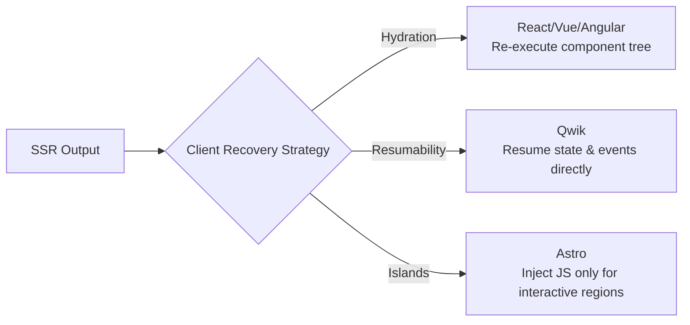
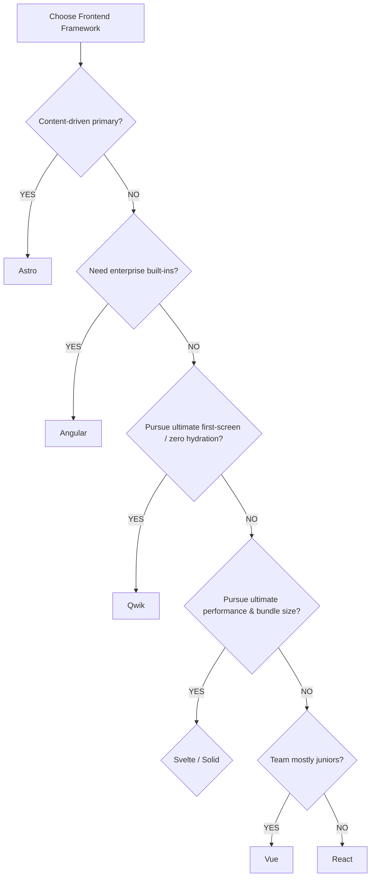

# Frontend Framework Comparison Matrix

> English summary comparing mainstream frontend frameworks on core features, learning curves, ecosystem maturity, and recommended use cases.
>
> **Last updated**: 2026-04

---

## Core Metrics Comparison

| Metric | React 19 | Vue 3.6 | Svelte 5 | Solid v2 | Angular | Qwik | Astro |
|--------|----------|---------|----------|----------|---------|------|-------|
| **First release** | 2013 | 2014 | 2016 | 2021 | 2010 (AngularJS) / 2016 | 2022 | 2021 |
| **Maintainer** | Meta | Community (Evan You) | Community (Rich Harris) | Community (Ryan Carniato) | Google | Builder.io | Community (Fred K. Schott) |
| **Paradigm** | Declarative UI + RSC | Progressive framework | Compile-time Runes | Fine-grained reactivity | Enterprise MVC | Resumability | Content-driven / Islands |
| **Reactivity** | VDOM + reconciliation / React Compiler | Vapor Mode (direct DOM) | Compile-time no VDOM + Runes | Fine-grained Signals | Zone.js + Signals | Fine-grained lazy + Signals | Islands architecture |
| **Template** | JSX | Single-File Component (SFC) | HTML-like + Runes | JSX | Template + TS | JSX | Astro template + framework Islands |
| **Runtime (gzip)** | ~40KB | ~10KB (Vapor Mode) | ~4KB | ~7KB | ~130KB+ | ~1KB (Qwikloader) | ~0KB (no JS by default) |
| **TypeScript** | Excellent | Excellent | Good | Good | Native | Official | Native |
| **Learning curve** | Medium | Gentle | Gentle | Medium | Steep | Medium | Gentle |
| **Enterprise ecosystem** | Very strong | Strong | Medium | Weak | Very strong | Weak | Medium |

---

## Performance & Feature Matrix

| Feature | React 19 | Vue 3.6 | Svelte 5 | Solid v2 | Angular | Qwik | Astro |
|---------|----------|---------|----------|----------|---------|------|-------|
| **Concurrent rendering** | ✅ (Fiber + RSC) | ⚠️ (Vapor Mode) | ❌ (not needed) | ❌ (not needed) | ❌ | ❌ (not needed) | ❌ (not needed) |
| **Auto memoization** | ✅ (React Compiler 1.0) | ⚠️ (Vapor Mode Beta) | ✅ Runes compile-time | ✅ Signal-level auto | ❌ (not needed) | ✅ Lazy auto | ❌ (not needed) |
| **SSR** | ✅ Next.js v16 (PPR) | ✅ Nuxt 4.0 | ✅ SvelteKit | ✅ SolidStart | ✅ Angular Universal | ✅ Qwik City | ✅ Core design |
| **Compile-time optimization** | ✅ React Compiler 1.0 | ⚠️ Vapor Mode | ✅ Runes core | ✅ Core design | ❌ | ✅ Core design | ✅ Static compile |
| **Built-in state management** | ❌ (external) | ✅ (Composition API) | ✅ Runes ($state/$derived) | ✅ (Signals) | ✅ (Signals + RxJS) | ✅ (Signals) | ❌ (Island framework owns) |
| **Official router** | ❌ (React Router) | ✅ Vue Router | ❌ (SvelteKit built-in) | ❌ (Solid Router) | ✅ Angular Router | ✅ Qwik City | ❌ (file-based built-in) |
| **Zero/low hydration** | ⚠️ (RSC partial) | ❌ | ❌ | ❌ | ❌ | ✅ Resumability | ✅ Islands |
| **View Transitions** | ✅ (React 19.2) | ⚠️ (experimental) | ✅ SvelteKit built-in | ⚠️ (community) | ❌ | ⚠️ (community) | ✅ Native |
| **Signals** | ⚠️ (Preact Signals compat) | ✅ 3.5+ | ✅ Runes native | ✅ Native Signals | ✅ Angular Signals | ✅ Native Signals | ⚠️ (Island framework) |

---

## React Compiler vs Manual Optimization

| Dimension | React (manual) | React (Compiler 1.0) | Solid | Svelte |
|-----------|---------------|----------------------|-------|--------|
| **Optimization** | `useMemo` / `useCallback` manual | Build-time auto derivation | Signal-level auto tracking | Compile-time auto generation |
| **Dev burden** | High (maintain dep arrays) | Low (compiler handles) | Low | Low |
| **Performance gain** | Depends on skill | 35%–60% fewer re-renders | Benchmark leader | Minimal runtime overhead |

---

## SSR Recovery Strategies

| Feature | Hydration (traditional) | Resumability (Qwik) | Islands (Astro) |
|---------|------------------------|---------------------|-----------------|
| First-screen JS execution | Full component logic | Near-zero (~1KB loader) | Zero (pure HTML) |
| Interaction latency | Wait for hydration | Lazy-load on event | Only Islands need loading |
| State recovery | Re-create + hydrate | Serialize from server | Static pages, no recovery |
| Best for | General web apps | Content / e-commerce / marketing | Blogs / docs / marketing |

---

## Recommended Use Cases

| Scenario | First Choice | Alternative | Reason |
|----------|-------------|-------------|--------|
| Large enterprise app | **Angular** | React | Built-in router, forms, DI, strict typing |
| Largest ecosystem / hiring | **React** | Vue | Largest talent pool, most third-party libraries |
| Rapid dev / small-medium projects | **Vue** | React | Low learning curve, great docs, SFC productivity |
| Ultimate performance / small apps | **Svelte** | Solid | Compile-time optimization, minimal runtime |
| High interactivity / complex state | **Solid** | React | Signals model provides optimal fine-grained updates |
| First-screen极致 / Core Web Vitals | **Qwik** | Astro | Resumability = zero hydration, instantly interactive |
| Content-driven websites | **Astro** | Next.js | Islands = zero JS by default, SEO & performance optimal |
| Full-stack TypeScript | **Angular** / **Next.js** | Nuxt | End-to-end type safety |
| Progressive enhancement | **Astro** | htmx | Static shell + partial interactivity, minimal intrusion |

---

## 2026 Ecosystem Updates

| Framework / Tech | 2026 Key Update |
|-----------------|-----------------|
| **React 19.2** | Stable; Activity component, `use()` Hook, PPR, Performance Tracks. React Compiler 1.0 stable since Oct 2025. |
| **Vue 3.6 Vapor** | Vapor Mode Beta; compiles to direct DOM ops, baseline <10KB, near-SolidJS performance. Nuxt 4.0 GA. |
| **Svelte 5 Runes** | Runes standard syntax; `$state` / `$derived` / `$effect` explicit reactivity replaces implicit `$:`. 39% faster than React 19 in js-framework-benchmark. |
| **Astro v6 Server Islands** | Server Islands stable; "static shell + server-rendered dynamic islands" pattern mature. Acquired by Cloudflare Jan 2026. |
| **Next.js v16** | Turbopack default for production; PPR fully available; React Compiler integrated by default. |
| **SolidJS v2** | New compiler architecture, stronger tree-shaking; lower SSR streaming TTFB; SolidStart fine-grained server/client boundary. |
| **Signals paradigm** | State of JS 2025: 47% use Signals-based state management; `alien-signals` becomes cross-framework universal primitive. |

---

## Decision Tree

---

*For the full Chinese version, see [../comparison-matrices/frontend-frameworks-compare.md](../comparison-matrices/frontend-frameworks-compare.md)*
