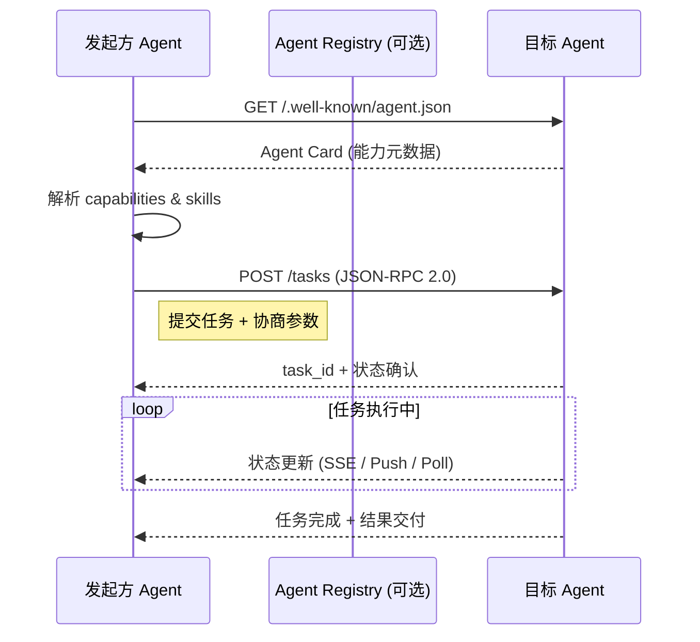
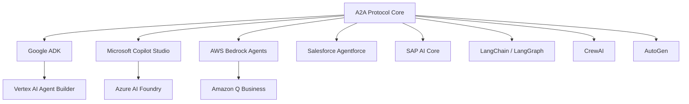
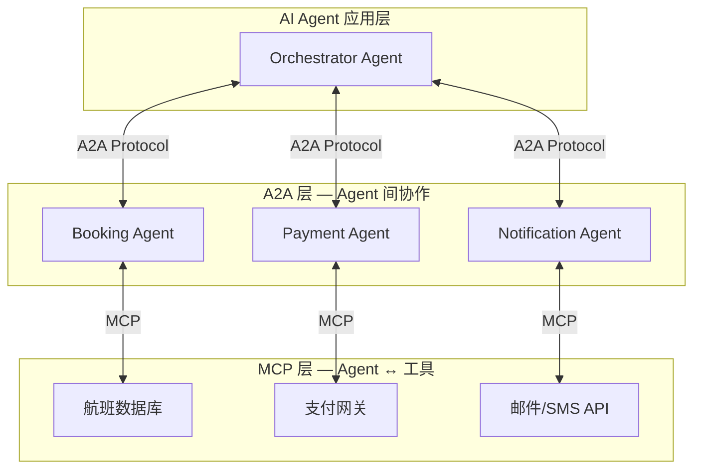
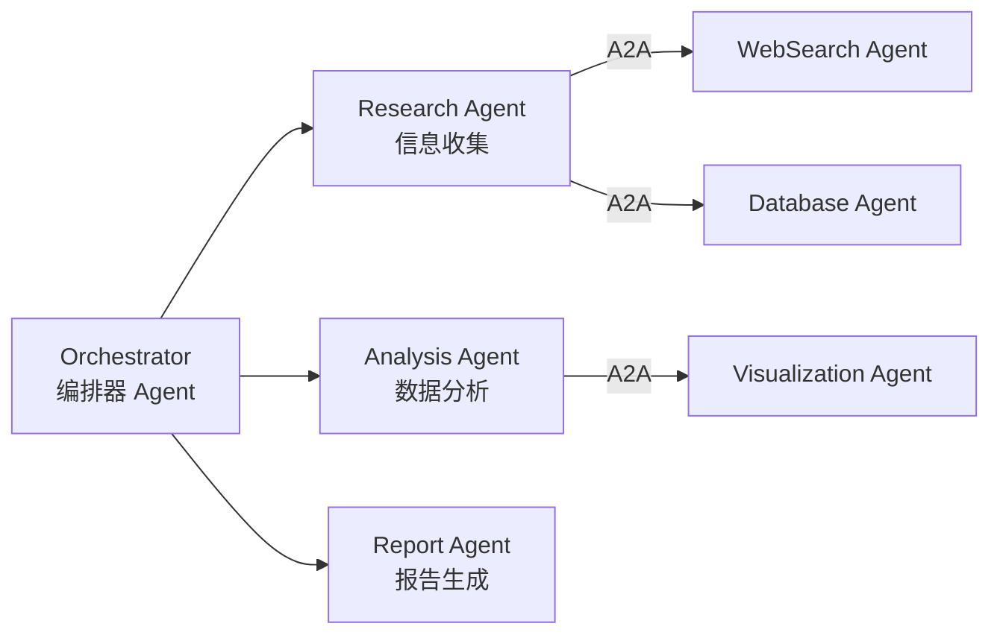
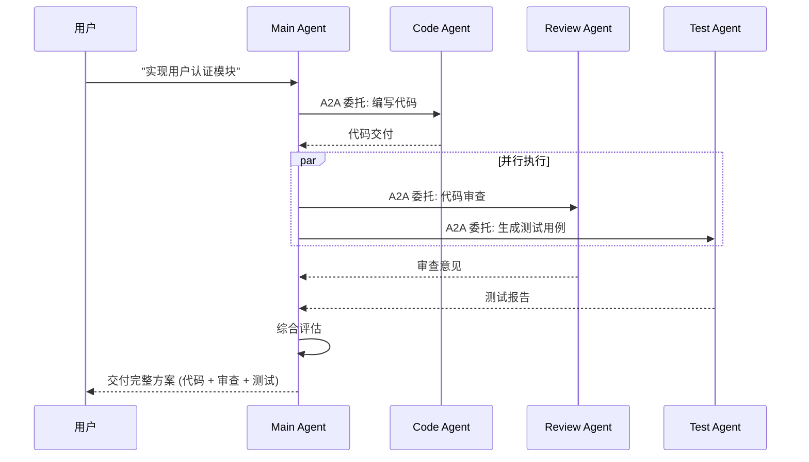
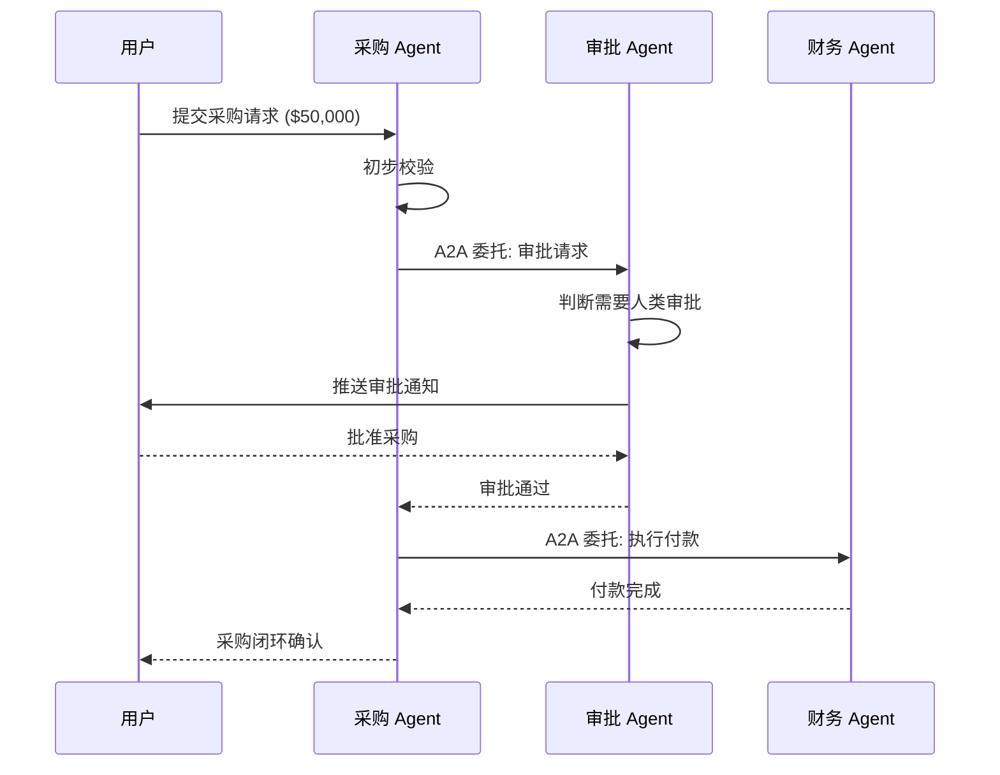
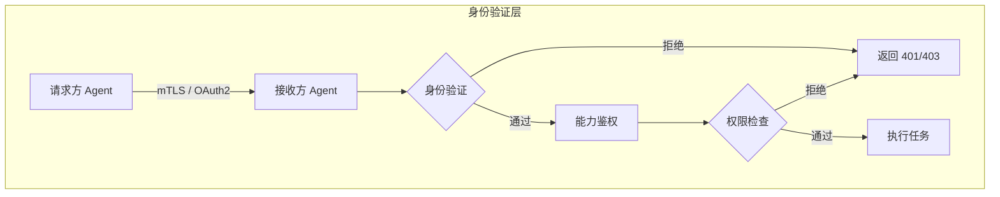

# A2A (Agent-to-Agent) Protocol 完全指南

> 深度解析 Agent-to-Agent Protocol 协议规范、Agent Cards 自动发现、能力协商机制、安全最佳实践，以及与 MCP 的互补关系。

---

## 1. A2A 概述

### 1.1 什么是 A2A

**Agent-to-Agent Protocol (A2A)** 是由 Google 于 2025 年提出的开放协议，旨在标准化不同 AI Agent 之间的通信与协作方式。2026 年初，该协议正式交由 **Linux Foundation** 托管，成为中立的开放标准。

与 MCP（Model Context Protocol）聚焦于"Agent ↔ 工具"的集成不同，A2A 专注于"Agent ↔ Agent"的互操作性——让来自不同厂商、不同框架、不同部署环境的智能体能够相互发现、协商能力、委托任务并协同完成复杂目标。

```
┌─────────────────┐         A2A Protocol         ┌─────────────────┐
│   Agent Alpha   │  ═════════════════════════►  │   Agent Beta    │
│  (Google ADK /  │   JSON-RPC 2.0 / gRPC over   │  (LangChain /   │
│   Vertex AI)    │◄═══════════════════════════  │   CrewAI /      │
│                 │   Agent Card Discovery       │   AutoGen)      │
└─────────────────┘                              └─────────────────┘
```

### 1.2 A2A 与 MCP 的核心区别

| 维度 | MCP (Model Context Protocol) | A2A (Agent-to-Agent Protocol) |
|------|------------------------------|-------------------------------|
| **通信范围** | Agent ↔ 工具 / 资源 / 提示模板 | Agent ↔ Agent |
| **协议定位** | 工具集成与上下文供给 | 智能体间协作与任务编排 |
| **发现机制** | 静态配置或手动连接 | **Agent Cards** 自动发现 (`/.well-known/agent.json`) |
| **协商能力** | 服务端声明能力，客户端调用 | 双向能力协商（我能做什么 + 我需要什么） |
| **任务模型** | 单次工具调用（无状态/短连接） | 有状态任务生命周期（提交 → 更新 → 完成） |
| **传输层** | stdio / SSE / HTTP | JSON-RPC 2.0 over HTTP / gRPC |
| **主要驱动** | Anthropic | Google → Linux Foundation |
| **生态规模 (2026 Q1)** | 97M+ 月下载量，10K+ 公开 Server | 150+ 企业/组织支持，快速成长期 |

**一句话总结**：MCP 解决"Agent 如何使用工具"，A2A 解决"Agent 如何与其他 Agent 协作"。

---

## 2. 架构核心概念

### 2.1 Agent Card：自动发现的基石

**Agent Card** 是 A2A 协议最具创新性的设计。每个遵循 A2A 协议的 Agent 必须在固定端点暴露自身的元数据：

```
GET /.well-known/agent.json
```

Agent Card 包含以下核心信息：

| 字段 | 说明 | 示例 |
|------|------|------|
| `name` | Agent 人类可读名称 | `TravelBookingAgent` |
| `description` | 功能描述 | `帮助用户预订机票、酒店和租车服务` |
| `version` | 协议版本 | `1.0` |
| `capabilities` | 支持的能力列表 | `["text_generation", "task_delegation", "human_in_the_loop"]` |
| `skills` | 具体技能定义（输入/输出模式） | 见下方示例 |
| `authentication` | 认证方式 | `oauth2`, `api_key`, `mTLS` |
| `endpoint` | 任务提交端点 | `https://agent.example.com/a2a/v1/tasks` |

#### Agent Card 示例

```json
{
  "name": "TravelBookingAgent",
  "description": "帮助用户预订机票、酒店和租车服务",
  "version": "1.0",
  "capabilities": {
    "streaming": true,
    "pushNotifications": true,
    "stateTransitionHistory": true
  },
  "skills": [
    {
      "id": "book_flight",
      "name": "预订机票",
      "description": "根据出发地、目的地和日期搜索并预订航班",
      "inputSchema": {
        "type": "object",
        "properties": {
          "origin": { "type": "string" },
          "destination": { "type": "string" },
          "date": { "type": "string", "format": "date" }
        },
        "required": ["origin", "destination", "date"]
      },
      "outputSchema": {
        "type": "object",
        "properties": {
          "confirmationCode": { "type": "string" },
          "price": { "type": "number" }
        }
      }
    }
  ],
  "authentication": {
    "type": "oauth2",
    "authorizationEndpoint": "https://auth.example.com/oauth/authorize"
  },
  "endpoint": "https://travel-agent.example.com/a2a/v1"
}
```

### 2.2 自动发现流程



### 2.3 任务生命周期模型

A2A 将 Agent 间交互抽象为**任务（Task）**的生命周期：

```
┌─────────┐    submit    ┌──────────┐   working   ┌──────────┐
│  初始化  │ ───────────► │ 已提交   │ ──────────► │ 执行中   │
│         │              │ submitted│             │ working  │
└─────────┘              └──────────┘             └────┬─────┘
                                                       │
                              ┌────────────────────────┼────────────────────────┐
                              ▼                        ▼                        ▼
                        ┌──────────┐            ┌──────────┐            ┌──────────┐
                        │ 已完成   │            │ 需要输入 │            │ 已取消   │
                        │completed │            │input-required│        │cancelled │
                        └──────────┘            └────┬─────┘            └──────────┘
                                                     │
                                                     ▼
                                              ┌──────────┐
                                              │ 等待人类 │
                                              │ human-in-│
                                              │ the-loop │
                                              └──────────┘
```

| 状态 | 说明 |
|------|------|
| `submitted` | 任务已提交，等待处理 |
| `working` | Agent 正在执行任务 |
| `input-required` | 需要额外输入（可能触发 Human-in-the-Loop） |
| `completed` | 任务成功完成 |
| `failed` | 任务执行失败 |
| `cancelled` | 任务被显式取消 |

---

## 3. 协议栈详解

### 3.1 JSON-RPC 2.0 基础层

A2A v1.0 早期版本（2026 年初）以 **JSON-RPC 2.0** 作为核心传输协议，兼容现有的 HTTP 基础设施：

```typescript
// 任务提交请求
{
  "jsonrpc": "2.0",
  "id": "task-001",
  "method": "tasks/send",
  "params": {
    "id": "booking-2026-0427",
    "sessionId": "session-abc-123",
    "skillId": "book_flight",
    "input": {
      "origin": "PEK",
      "destination": "JFK",
      "date": "2026-05-01"
    }
  }
}

// 任务提交响应
{
  "jsonrpc": "2.0",
  "id": "task-001",
  "result": {
    "id": "booking-2026-0427",
    "status": "submitted",
    "createdAt": "2026-04-27T04:00:00Z"
  }
}
```

### 3.2 gRPC 支持（v1.0 早期 2026）

为满足高吞吐、低延迟的企业级场景，A2A v1.0 引入了 **gRPC** 作为可选传输层：

| 特性 | JSON-RPC over HTTP | gRPC |
|------|-------------------|------|
| **序列化** | JSON | Protocol Buffers (二进制) |
| **流式支持** | SSE / 长轮询 | 原生双向流 (Bidirectional Streaming) |
| **性能** | 良好 | 更高吞吐、更低延迟 |
| **类型安全** | JSON Schema 校验 | 编译期类型检查 |
| **基础设施兼容** | 通用 HTTP 代理/负载均衡 | 需 HTTP/2 支持 |
| **适用场景** | 通用集成、Web 环境 | 微服务网格、高频交互 |

```protobuf
// A2A gRPC 服务定义 (概念示例)
syntax = "proto3";
package a2a.v1;

service AgentService {
  rpc GetAgentCard(Empty) returns (AgentCard);
  rpc SendTask(TaskRequest) returns (Task);
  rpc SubscribeTaskUpdates(TaskSubscription) returns (stream TaskUpdate);
  rpc CancelTask(CancelRequest) returns (Task);
}

message TaskRequest {
  string id = 1;
  string skill_id = 2;
  map<string, google.protobuf.Value> input = 3;
}

message TaskUpdate {
  string task_id = 1;
  TaskStatus status = 2;
  google.protobuf.Value intermediate_result = 3;
}
```

### 3.3 签名 Agent Cards

在企业级部署中，Agent Card 需要被**签名**以防止中间人攻击和伪造：

```json
{
  "name": "EnterpriseHRAgent",
  "description": "企业内部 HR 服务 Agent",
  "version": "1.0",
  "capabilities": { "streaming": true },
  "skills": [...],
  "authentication": { "type": "mTLS" },
  "endpoint": "https://hr.internal.example.com/a2a/v1",
  "_security": {
    "signature": "base64-encoded-signature",
    "algorithm": "Ed25519",
    "keyId": "did:web:example.com#agent-key-1",
    "issuer": "did:web:example.com"
  }
}
```

签名 Agent Card 支持基于 **DID (Decentralized Identifiers)** 的身份体系，实现跨组织的去信任化验证。

### 3.4 多租户支持

A2A 协议原生支持多租户场景：

```typescript
// 多租户任务请求头
{
  "jsonrpc": "2.0",
  "id": "task-002",
  "method": "tasks/send",
  "params": { /* ... */ },
  "_meta": {
    "tenantId": "tenant-acme-corp",
    "namespace": "production",
    "routingKey": "eu-west-1"
  }
}
```

| 多租户维度 | 说明 |
|-----------|------|
| `tenantId` | 租户隔离标识 |
| `namespace` | 逻辑环境分区（dev/staging/prod） |
| `routingKey` | 地理/集群路由键 |

---

## 4. 企业生态与采用情况

### 4.1 150+ 企业支持者

截至 **2026 年 Q1**，A2A 协议已获得超过 **150 家企业和组织** 的公开支持，涵盖云厂商、SaaS 巨头、咨询公司和开源社区：

| 类别 | 代表企业/组织 |
|------|--------------|
| **云厂商** | Google Cloud, Microsoft Azure, AWS, IBM Cloud, Oracle Cloud |
| **企业软件** | Salesforce, SAP, ServiceNow, Workday, Snowflake |
| **咨询与集成** | Deloitte, Accenture, McKinsey, Capgemini, Wipro |
| **AI 平台** | LangChain, LlamaIndex, Hugging Face, Cohere, AI21 Labs |
| **开源社区** | Linux Foundation, CNCF, Apache Software Foundation |

### 4.2 主要平台的集成状态



---

## 5. A2A 与 MCP：互补而非竞争

### 5.1 关系定位

A2A 和 MCP 解决的是 AI 生态系统中**不同层次**的问题，二者是**互补关系**：



### 5.2 协同工作模式

| 层级 | 协议 | 作用 |
|------|------|------|
| **应用编排层** | A2A | 主 Agent 发现、委托、协调多个子 Agent |
| **工具执行层** | MCP | 每个子 Agent 通过 MCP 调用其专属工具和资源 |

**典型协同场景**：

1. **旅行规划 Agent (主控)** 通过 A2A 发现 `FlightAgent`、`HotelAgent`、`CarRentalAgent`
2. 主控 Agent 通过 A2A 向三个子 Agent 并行提交任务
3. `FlightAgent` 通过 MCP 调用航空公司 API 查询航班
4. `HotelAgent` 通过 MCP 调用 Booking.com MCP Server 查询酒店
5. 结果汇总后，主控 Agent 通过 A2A 向 `PaymentAgent` 发起支付委托

---

## 6. 实践模式

### 6.1 多 Agent 编排 (Multi-Agent Orchestration)



编排器 Agent 负责：
- 通过 Agent Cards 发现可用 Agent
- 根据任务类型路由到合适的子 Agent
- 聚合子 Agent 的返回结果
- 处理失败重试和回退逻辑

```typescript
// 编排器伪代码示例
async function orchestrateResearchTask(query: string) {
  // 1. 发现可用 Agent
  const agents = await discoverAgents({ capability: 'research' })
  
  // 2. 并行委托子任务
  const [webResults, dbResults] = await Promise.all([
    agents.webSearch.sendTask({ query, maxResults: 10 }),
    agents.database.sendTask({ query, sources: ['internal_kb'] })
  ])
  
  // 3. 委托分析 Agent 综合结果
  const analysis = await agents.analyzer.sendTask({
    inputs: [webResults, dbResults],
    outputFormat: 'structured_report'
  })
  
  return analysis
}
```

### 6.2 任务委托 (Task Delegation)

任务委托是 A2A 的核心模式之一，支持**链式委托**和**并行委托**：

| 委托模式 | 说明 | 适用场景 |
|---------|------|---------|
| **直接委托** | Agent A → Agent B，等待返回 | 简单子任务 |
| **链式委托** | A → B → C，结果沿链返回 | 流水线处理 |
| **并行委托** | A → [B, C, D]，结果聚合 | Map-Reduce 类任务 |
| **动态委托** | 根据中间结果决定下一步委托 | 自适应工作流 |



### 6.3 Agent 集群 (Agent Swarm)

Agent Swarm 模式模拟蜂群行为，大量简单 Agent 通过 A2A 协作解决复杂问题：

```typescript
// Swarm 协调器示例
class AgentSwarm {
  private workers: A2AAgent[] = []
  
  async initialize(count: number, skillFilter: string) {
    const available = await discoverAgents({ skill: skillFilter })
    this.workers = available.slice(0, count)
  }
  
  async execute(task: Task): Promise<Result[]> {
    // 将大任务拆分为子任务
    const subtasks = this.decompose(task)
    
    // 分发给 Swarm 中的 Agent
    const promises = subtasks.map((sub, i) => 
      this.workers[i % this.workers.length].sendTask(sub)
    )
    
    // 聚合结果
    const results = await Promise.all(promises)
    return this.aggregate(results)
  }
}
```

### 6.4 跨 Agent 人机协同 (Human-in-the-Loop)

A2A 原生支持跨多个 Agent 的人类介入点：



**关键设计**：当 Agent 遇到超出权限或置信度阈值的决策时，通过 `input-required` 状态将控制权优雅地交还给人类，人类响应后任务自动恢复执行。

---

## 7. 安全考量

### 7.1 Agent 身份验证



| 认证机制 | 适用场景 | 实现要点 |
|---------|---------|---------|
| **mTLS** | 企业内部、高安全场景 | 双向证书校验，证书由企业 CA 签发 |
| **OAuth 2.0 + JWT** | SaaS 集成、多租户 | Token 包含 scope 限制，短有效期 |
| **DID + VC** | 跨组织、去信任场景 | 可验证凭证，支持链上/链下验证 |
| **API Key + HMAC** | 快速集成、内部测试 | 密钥轮换，请求签名防篡改 |

### 7.2 能力范围限定

Agent 应严格遵循**最小权限原则**，在 Agent Card 中明确声明能力边界：

```json
{
  "skills": [
    {
      "id": "read_customer_data",
      "name": "读取客户数据",
      "scopes": ["customer:read"],
      "dataClassification": "PII",
      "maxAccessLevel": "read-only"
    }
  ],
  "policies": {
    "maxTaskDuration": "300s",
    "maxConcurrentTasks": 10,
    "allowedOrigins": ["https://crm.internal.example.com"],
    "auditLevel": "full"
  }
}
```

### 7.3 信任边界

在多 Agent 协作中，必须明确定义信任边界：

| 信任层级 | 说明 | 控制措施 |
|---------|------|---------|
| **完全信任** | 同一组织内、同一安全域 | 内部 mTLS，能力全开 |
| **受限信任** | 合作方 Agent | OAuth scope 限制，审计日志 |
| **零信任** | 公开市场/第三方 Agent | 沙箱执行，输入输出校验，速率限制 |

```typescript
// 信任边界校验示例
function validateTrustBoundary(
  callerAgent: AgentCard,
  requestedSkill: string,
  sensitivityLevel: 'low' | 'medium' | 'high'
): boolean {
  // 1. 验证签名有效性
  if (!verifyAgentCardSignature(callerAgent)) return false
  
  // 2. 检查组织信任列表
  const orgTrust = TRUST_REGISTRY[callerAgent.issuer]
  if (!orgTrust || orgTrust.level === 'blocked') return false
  
  // 3. 敏感操作需额外授权
  if (sensitivityLevel === 'high' && orgTrust.level !== 'full_trust') {
    return false
  }
  
  // 4. 校验请求技能是否在允许范围内
  return orgTrust.allowedSkills.includes(requestedSkill)
}
```

---

## 8. 2026 现状与演进路线图

### 8.1 当前状态 (2026 Q1)

| 里程碑 | 状态 | 时间 |
|--------|------|------|
| A2A 协议初版发布 | ✅ 已完成 | 2025 年 (Google) |
| Linux Foundation 托管 | ✅ 已完成 | 2026 年初 |
| A2A v1.0 (含 gRPC) | ✅ 早期发布 | 2026 年初 |
| 150+ 企业支持 | ✅ 已达成 | 2026 Q1 |
| 签名 Agent Cards | ✅ 规范已定 | 2026 Q1 |
| 官方 TypeScript SDK | 🔄 预览版 | 2026 Q2 预期 |
| MCP-A2A 网关 | 🔄 社区开发中 | 2026 Q2-Q3 |
| 标准化测试套件 | 🔄 进行中 | 2026 Q2 |

### 8.2 与 MCP 的生态对比

| 指标 | MCP (2026 Q1) | A2A (2026 Q1) |
|------|--------------|---------------|
| **月下载量** | 97M+ | 快速增长中 |
| **公开 Server/Agent** | 10,000+ | 数百+（早期阶段） |
| **SDK 成熟度** | 稳定版 (v1.x) | 预览版 / 社区 SDK |
| **主要厂商** | Anthropic, OpenAI, Cursor, VS Code | Google, Microsoft, Salesforce, SAP |
| **标准化组织** | 社区驱动 | Linux Foundation |
| **协议范围** | Agent ↔ 工具 | Agent ↔ Agent |

### 8.3 演进趋势预测

1. **网关融合**：2026 下半年预期出现 MCP-A2A 网关，允许 MCP Client 通过网关与 A2A Agent 通信
2. **标准化测试套件**：Linux Foundation 将发布一致性测试套件，确保不同实现的互操作性
3. **企业级功能**：更细粒度的 RBAC、审计追踪、合规报告模板
4. **与模型无关**：A2A 将保持模型无关性，支持 Gemini、Claude、GPT、Llama 等各类底层模型

---

## 9. 快速开始

### 9.1 暴露 Agent Card

```typescript
// 最小 A2A Agent 实现
import { createServer } from 'node:http'

const agentCard = {
  name: 'SimpleCalculatorAgent',
  description: '执行基础数学运算',
  version: '1.0',
  capabilities: { streaming: false },
  skills: [
    {
      id: 'calculate',
      name: '计算',
      description: '执行加减乘除',
      inputSchema: {
        type: 'object',
        properties: {
          a: { type: 'number' },
          b: { type: 'number' },
          op: { enum: ['+', '-', '*', '/'] }
        }
      }
    }
  ],
  endpoint: 'http://localhost:3000/a2a/v1'
}

const server = createServer((req, res) => {
  if (req.url === '/.well-known/agent.json') {
    res.writeHead(200, { 'Content-Type': 'application/json' })
    res.end(JSON.stringify(agentCard))
    return
  }
  
  if (req.url === '/a2a/v1' && req.method === 'POST') {
    // 处理 JSON-RPC 2.0 请求
    handleTask(req, res)
    return
  }
  
  res.writeHead(404)
  res.end()
})

server.listen(3000)
```

### 9.2 调用其他 Agent

```typescript
// 通过 A2A 调用外部 Agent
async function callExternalAgent(agentUrl: string, task: object) {
  // 1. 获取 Agent Card
  const cardRes = await fetch(`${agentUrl}/.well-known/agent.json`)
  const agentCard = await cardRes.json()
  
  // 2. 提交任务
  const response = await fetch(agentCard.endpoint, {
    method: 'POST',
    headers: { 'Content-Type': 'application/json' },
    body: JSON.stringify({
      jsonrpc: '2.0',
      id: crypto.randomUUID(),
      method: 'tasks/send',
      params: task
    })
  })
  
  return response.json()
}
```

---

## 10. 总结

A2A (Agent-to-Agent Protocol) 代表了 AI 生态从"单 Agent + 工具"向"多 Agent 协作网络"演进的关键基础设施。其核心创新 **Agent Cards** 实现了 Agent 的自动发现和能力协商，使不同框架、不同厂商的智能体能够无缝协作。

与 MCP 的互补关系明确了二者在 AI 架构中的定位：
- **MCP** 是 Agent 的"手脚"——连接工具和数据
- **A2A** 是 Agent 的"语言"——实现 Agent 间通信

随着 Linux Foundation 的托管和 150+ 企业的支持，A2A 有望在 2026-2027 年成为多 Agent 系统的标准互操作协议。对于构建企业级 AI 系统的开发者而言，理解并掌握 A2A 将是设计可扩展、可互操作 Agent 架构的必备能力。

---

## References

| 来源 | 链接 | 说明 |
|------|------|------|
| A2A 官方协议规范 | `https://google.github.io/A2A/` | Google 官方协议文档 |
| A2A GitHub 仓库 | `https://github.com/google/A2A` | 参考实现与示例 |
| Linux Foundation 公告 | `https://www.linuxfoundation.org/` | A2A 托管新闻稿 |
| MCP 官方文档 | `https://modelcontextprotocol.io/` | 对比参考 |
| Anthropic MCP 规范 | `https://github.com/modelcontextprotocol` | MCP 协议仓库 |
| Google ADK 文档 | `https://developers.google.com/adk` | Google Agent Development Kit |
| Agent Card 规范草案 | `https://github.com/google/A2A/blob/main/documentation/agent_card.md` | Agent Card 详细定义 |
| JSON-RPC 2.0 规范 | `https://www.jsonrpc.org/specification` | A2A 基础传输协议 |
| gRPC 官方文档 | `https://grpc.io/docs/` | A2A v1.0 可选传输层 |
| DID 核心规范 | `https://www.w3.org/TR/did-core/` | 去中心化身份标识 |

---

> **关联文档**
>
> - [MCP (Model Context Protocol) 完全指南](./mcp-guide.md) — Agent 与工具集成协议
> - `jsts-code-lab/94-ai-agent-lab/` — AI Agent 实验代码
> - [AI Agent 基础设施](../categories/23-ai-agent-infrastructure.md)
> - [AI SDK 指南](./ai-sdk-guide.md)
