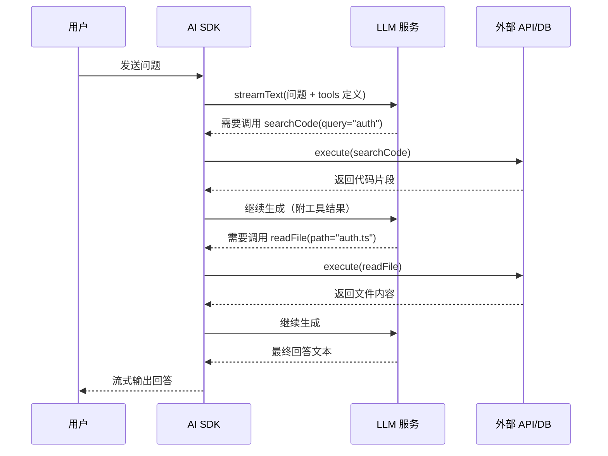
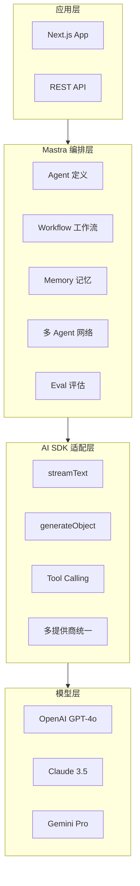
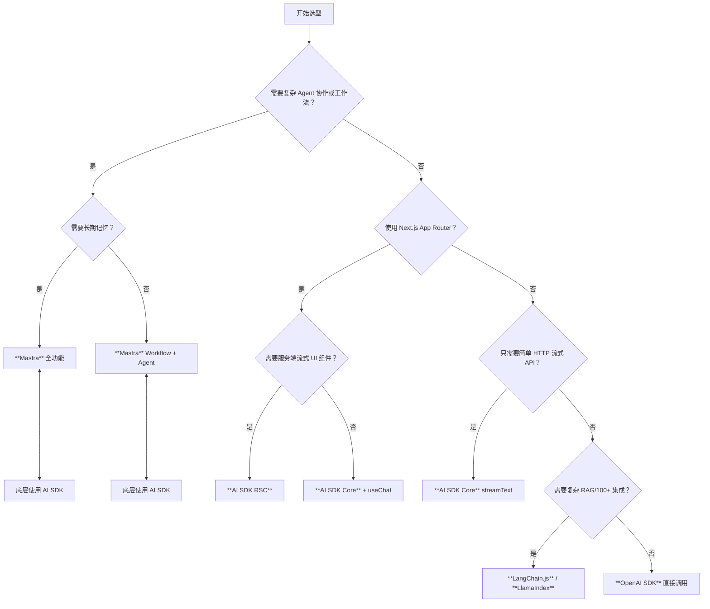

# AI SDK 与 Mastra 完整开发指南

> 全面覆盖 Vercel AI SDK、AI SDK RSC 与 Mastra 三大 AI 开发框架的核心 API、最佳实践与选型策略，帮助开发者快速构建生产级 AI 应用。

---

## 目录

- [AI SDK 与 Mastra 完整开发指南](#ai-sdk-与-mastra-完整开发指南)
  - [目录](#目录)
  - [概述 — AI SDK 生态全景](#概述--ai-sdk-生态全景)
  - [Vercel AI SDK Core](#vercel-ai-sdk-core)
    - [安装与配置](#安装与配置)
    - [generateText / streamText](#generatetext--streamtext)
    - [generateObject / streamObject](#generateobject--streamobject)
    - [Tool Calling 完整示例](#tool-calling-完整示例)
    - [多提供商统一接口](#多提供商统一接口)
  - [AI SDK RSC](#ai-sdk-rsc)
    - [React Server Components 集成](#react-server-components-集成)
    - [createStreamableValue / readStreamableValue](#createstreamablevalue--readstreamablevalue)
    - [AI 流式 UI 组件](#ai-流式-ui-组件)
  - [Mastra](#mastra)
    - [Agent 定义与编排](#agent-定义与编排)
    - [Workflow 工作流](#workflow-工作流)
    - [Memory 记忆层](#memory-记忆层)
    - [与 AI SDK 的关系](#与-ai-sdk-的关系)
  - [选型建议 — 何时用哪个](#选型建议--何时用哪个)
    - [决策矩阵](#决策矩阵)
    - [技术栈组合建议](#技术栈组合建议)
    - [渐进式采用路径](#渐进式采用路径)
  - [完整项目示例](#完整项目示例)
    - [项目结构](#项目结构)
    - [核心代码](#核心代码)
    - [部署检查清单](#部署检查清单)

---

## 概述 — AI SDK 生态全景

2023 年以来，JavaScript/TypeScript AI 开发生态经历了快速迭代。从直接调用 OpenAI SDK，到使用 LangChain 进行复杂编排，再到如今以 **Vercel AI SDK** 和 **Mastra** 为代表的新一代框架，开发者拥有了更多结构化、类型安全的选项。

| 框架/库 | 定位 | 核心优势 | 适用场景 |
|---------|------|---------|---------|
| **Vercel AI SDK** | 模型调用与流式输出标准化层 | 多提供商统一接口、极佳的流式与结构化输出支持、与 React/Next.js 深度集成 | 前端 AI 聊天、流式 UI、结构化数据提取 |
| **AI SDK RSC** | React Server Components 的 AI 流式扩展 | 服务端流式渲染、Server Action 原生集成、零客户端状态管理 | 需要 SSR 的 AI 应用、复杂流式 UI 组件 |
| **Mastra** | TypeScript AI Agent 框架 | Agent 编排、工作流引擎、记忆层、与 AI SDK 互补 | 多 Agent 协作系统、自动化工作流、长期记忆应用 |
| **LangChain.js** | 全功能 LLM 编排框架 | 丰富的链式抽象、RAG 流水线、生态工具最多 | 复杂 RAG 系统、需要大量预构建集成 |
| **LlamaIndex TS** | 数据增强型 LLM 框架 | 高级索引与检索、文档解析、知识图谱 | 企业知识库、复杂文档问答 |

> **设计哲学差异**：Vercel AI SDK 主张"最小抽象、最大类型安全"；Mastra 主张"Agent 优先、工作流驱动"；LangChain 主张"链式组合、生态覆盖"。

---

## Vercel AI SDK Core

Vercel AI SDK 是构建 AI 应用的基础层，提供与模型提供商无关的统一 API。它由三个子包组成：

- `ai` — 核心运行时（流式、工具调用、结构化输出）
- `@ai-sdk/openai` / `@ai-sdk/anthropic` / `@ai-sdk/google` 等 — 提供商适配器
- `@ai-sdk/react` / `@ai-sdk/vue` / `@ai-sdk/svelte` 等 — UI 框架钩子

### 安装与配置

```bash
# 核心包 + OpenAI 适配器
npm install ai @ai-sdk/openai

# 其他提供商适配器（按需安装）
npm install @ai-sdk/anthropic @ai-sdk/google @ai-sdk/azure
```

基本配置：

```typescript
import { createOpenAI } from '@ai-sdk/openai';
import { generateText } from 'ai';

// 使用兼容 OpenAI API 格式的自定义端点
const openai = createOpenAI({
  baseURL: process.env.OPENAI_BASE_URL,
  apiKey: process.env.OPENAI_API_KEY,
});

const model = openai('gpt-4o');

const { text } = await generateText({
  model,
  prompt: '解释 TypeScript 的类型推断机制',
});
```

### generateText / streamText

`generateText` 用于一次性获取完整文本响应，`streamText` 用于流式获取 Token。

```typescript
import { generateText, streamText } from 'ai';

// ---- 非流式：generateText ----
const { text, usage, finishReason } = await generateText({
  model: openai('gpt-4o'),
  system: '你是一位资深前端架构师，用中文回答。',
  prompt: 'Next.js App Router 与 Pages Router 的核心区别是什么？',
  maxTokens: 2000,
  temperature: 0.7,
});

console.log(text);        // 完整响应文本
console.log(usage);       // { promptTokens: 32, completionTokens: 245, totalTokens: 277 }

// ---- 流式：streamText ----
const result = await streamText({
  model: openai('gpt-4o'),
  prompt: '用 3 个要点总结 React 19 的新特性',
});

// 消费流（服务端/脚本环境）
for await (const chunk of result.textStream) {
  process.stdout.write(chunk);
}

// 前端 React 中配合 useChat/useCompletion 消费
```

**streamText 高级用法 —— 带工具调用的流式输出**：

```typescript
const result = await streamText({
  model: openai('gpt-4o'),
  messages: [
    { role: 'user', content: '北京今天天气怎么样？' }
  ],
  tools: {
    getWeather: {
      description: '获取指定城市的天气信息',
      parameters: z.object({
        city: z.string().describe('城市名称'),
        date: z.string().optional().describe('日期，格式 YYYY-MM-DD'),
      }),
      execute: async ({ city, date }) => {
        // 实际调用天气 API
        return await weatherApi.fetch(city, date);
      },
    },
  },
  maxToolRoundtrips: 5, // 允许模型最多进行 5 轮工具调用
});

// 流中自动处理工具调用并继续生成最终回答
for await (const chunk of result.textStream) {
  process.stdout.write(chunk);
}
```

### generateObject / streamObject

结构化输出是 AI SDK 的核心优势之一，基于 Zod Schema 实现完全类型安全。

```typescript
import { generateObject, streamObject } from 'ai';
import { z } from 'zod';

// ---- 非流式结构化输出 ----
const { object } = await generateObject({
  model: openai('gpt-4o'),
  schema: z.object({
    title: z.string().describe('文章标题'),
    tags: z.array(z.string()).describe('相关标签'),
    summary: z.string().describe('100 字以内摘要'),
    difficulty: z.enum(['入门', '进阶', '高级']).describe('难度级别'),
  }),
  prompt: '为一篇介绍 React Server Components 的技术博客生成元数据',
});

// object 完全类型推断为 { title: string; tags: string[]; summary: string; difficulty: '入门' | '进阶' | '高级' }
console.log(object.title);

// ---- 流式结构化输出 ----
const { partialObjectStream } = await streamObject({
  model: openai('gpt-4o'),
  schema: z.object({
    steps: z.array(z.object({
      instruction: z.string(),
      estimatedTime: z.string(),
    })),
  }),
  prompt: '制定一个 7 天 TypeScript 学习计划',
});

for await (const partialObject of partialObjectStream) {
  // partialObject 逐步填充，可实时渲染 UI
  console.log(partialObject);
}
```

### Tool Calling 完整示例

Tool Calling（函数调用）让 LLM 能够调用外部 API、查询数据库或执行代码。AI SDK 的工具调用支持自动执行（`execute`）和手动执行（由开发者控制）两种模式。

```typescript
import { streamText, tool } from 'ai';
import { z } from 'zod';

// 定义工具集合
const tools = {
  searchCode: tool({
    description: '在代码库中搜索相关代码片段',
    parameters: z.object({
      query: z.string().describe('搜索关键词'),
      language: z.enum(['typescript', 'javascript', 'python']).optional(),
    }),
    execute: async ({ query, language }) => {
      const results = await codeSearchIndex.search(query, { language });
      return results.slice(0, 5).map(r => ({
        file: r.filePath,
        snippet: r.codeSnippet,
      }));
    },
  }),

  runTest: tool({
    description: '运行指定测试文件',
    parameters: z.object({
      filePath: z.string(),
    }),
    execute: async ({ filePath }) => {
      const { stdout, stderr, exitCode } = await execAsync(`npm test ${filePath}`);
      return { stdout, stderr, exitCode };
    },
  }),

  readFile: tool({
    description: '读取文件内容',
    parameters: z.object({
      path: z.string(),
    }),
    execute: async ({ path }) => {
      const content = await fs.readFile(path, 'utf-8');
      return { content, lineCount: content.split('\n').length };
    },
  }),
};

// 在对话流中使用工具
const result = await streamText({
  model: openai('gpt-4o'),
  system: `你是一位资深工程师助手。在回答技术问题前，先搜索代码库获取上下文。
如果涉及代码修改，先读取相关文件，然后给出建议。`,
  messages: conversationHistory,
  tools,
  maxToolRoundtrips: 10,
});

// 前端消费流
return result.toDataStreamResponse();
```

**多轮工具调用执行流程**：



### 多提供商统一接口

AI SDK 的核心价值之一是**提供商无关性**。切换模型只需更改导入和模型名称，业务代码完全不变。

```typescript
import { createOpenAI } from '@ai-sdk/openai';
import { createAnthropic } from '@ai-sdk/anthropic';
import { createGoogleGenerativeAI } from '@ai-sdk/google';
import { createAzure } from '@ai-sdk/azure';

// 统一模型工厂
function createModel(provider: string, modelId: string) {
  switch (provider) {
    case 'openai':
      return createOpenAI({ apiKey: process.env.OPENAI_KEY })(modelId);
    case 'anthropic':
      return createAnthropic({ apiKey: process.env.ANTHROPIC_KEY })(modelId);
    case 'google':
      return createGoogleGenerativeAI({ apiKey: process.env.GOOGLE_KEY })(modelId);
    case 'azure':
      return createAzure({
        resourceName: process.env.AZURE_RESOURCE,
        apiKey: process.env.AZURE_KEY,
      })(modelId);
    default:
      throw new Error(`Unknown provider: ${provider}`);
  }
}

// 业务代码完全无关
async function generateSummary(provider: string, content: string) {
  const model = createModel(provider, 'gpt-4o'); // 或 'claude-3-5-sonnet-20241022' 等
  const { text } = await generateText({ model, prompt: `总结以下内容：${content}` });
  return text;
}
```

支持的提供商还包括：Cohere、Mistral、Fireworks、Together AI、Groq、xAI、DeepSeek、OpenRouter 等。

---

## AI SDK RSC

AI SDK RSC（React Server Components）是 AI SDK 针对 React Server Components 的扩展，允许在服务端直接流式渲染 AI 生成的 UI，无需客户端 JavaScript 即可展示流式内容。

### React Server Components 集成

传统流式方案需要客户端维护 WebSocket 或 EventSource 连接，而 RSC 方案利用 HTTP 流直接推送服务端渲染的 UI 片段。

```tsx
// app/page.tsx — Server Component
import { generateStreamingUI } from './actions';
import { Suspense } from 'react';

export default function ChatPage() {
  return (
    <div>
      <h1>AI 助手</h1>
      <Suspense fallback={<LoadingSkeleton />}>
        <ChatResponse query="解释 useEffect 的依赖数组" />
      </Suspense>
    </div>
  );
}

async function ChatResponse({ query }: { query: string }) {
  // 直接在服务端等待流式结果
  const ui = await generateStreamingUI(query);
  return <div className="prose">{ui}</div>;
}
```

### createStreamableValue / readStreamableValue

这是 RSC 的核心原语，用于在 Server Action 和客户端之间传递流式值。

```tsx
// app/actions.ts
'use server';

import { createStreamableValue } from 'ai/rsc';
import { streamText } from 'ai';
import { openai } from '@ai-sdk/openai';

export async function generateExplanation(topic: string) {
  const stream = createStreamableValue('');

  (async () => {
    const { textStream } = await streamText({
      model: openai('gpt-4o-mini'),
      prompt: `用通俗易懂的中文解释：${topic}`,
    });

    for await (const chunk of textStream) {
      stream.update(chunk);
    }

    stream.done();
  })();

  return stream.value; // 返回可序列化的流式值
}
```

```tsx
// app/components/StreamingText.tsx
'use client';

import { readStreamableValue } from 'ai/rsc';
import { useState, useEffect } from 'react';

export function StreamingText({ stream }: { stream: any }) {
  const [text, setText] = useState('');

  useEffect(() => {
    let cancelled = false;
    (async () => {
      for await (const chunk of readStreamableValue(stream)) {
        if (cancelled) break;
        setText(chunk);
      }
    })();
    return () => { cancelled = true; };
  }, [stream]);

  return <div className="whitespace-pre-wrap">{text}</div>;
}
```

### AI 流式 UI 组件

RSC 最强大的能力是流式渲染**结构化 UI 组件**，而不仅仅是纯文本。

```tsx
// app/actions.ts
'use server';

import { createStreamableUI } from 'ai/rsc';
import { streamText } from 'ai';
import { openai } from '@ai-sdk/openai';
import { WeatherCard, StockChart, CodeBlock } from './components';

export async function submitUserMessage(message: string) {
  const uiStream = createStreamableUI(<LoadingDots />);

  (async () => {
    const { textStream, toolResults } = await streamText({
      model: openai('gpt-4o'),
      messages: [{ role: 'user', content: message }],
      tools: {
        getWeather: {
          description: '获取天气',
          parameters: z.object({ city: z.string() }),
          execute: async ({ city }) => {
            const data = await fetchWeather(city);
            // 直接流式更新 UI！
            uiStream.update(<WeatherCard data={data} />);
            return data;
          },
        },
        getStock: {
          description: '获取股票数据',
          parameters: z.object({ symbol: z.string() }),
          execute: async ({ symbol }) => {
            const data = await fetchStock(symbol);
            uiStream.update(<StockChart data={data} />);
            return data;
          },
        },
      },
    });

    // 同时流式输出文本
    let text = '';
    for await (const chunk of textStream) {
      text += chunk;
      uiStream.update(
        <div>
          <div className="prose">{text}</div>
          {/* 工具结果已在 execute 中更新 */}
        </div>
      );
    }

    uiStream.done();
  })();

  return uiStream.value;
}
```

```tsx
// app/components/Chat.tsx
'use client';

import { useState } from 'react';
import { submitUserMessage } from '../actions';

export function Chat() {
  const [messages, setMessages] = useState<{ id: number; ui: React.ReactNode }[]>([]);

  async function handleSubmit(formData: FormData) {
    const message = formData.get('message') as string;
    const id = Date.now();
    const ui = await submitUserMessage(message);
    setMessages(prev => [...prev, { id, ui }]);
  }

  return (
    <div>
      <form action={handleSubmit}>
        <input name="message" placeholder="输入问题..." />
        <button type="submit">发送</button>
      </form>
      <div>
        {messages.map(m => (
          <div key={m.id}>{m.ui}</div>
        ))}
      </div>
    </div>
  );
}
```

> **关键优势**：AI SDK RSC 让服务端可以直接渲染和流式推送 React 组件，客户端只需要最基本的 React 来接收流式更新。这大幅减少了前端状态管理复杂度，同时改善了首屏性能。

---

## Mastra

Mastra 是一个基于 TypeScript 的 AI Agent 框架，构建于 Vercel AI SDK 之上，专注于 Agent 编排、工作流管理和长期记忆。它填补了 AI SDK（底层模型调用）与复杂业务系统之间的空白。

### Agent 定义与编排

Mastra 的 Agent 是带有指令、工具、记忆和评估能力的自治单元。

```typescript
import { Mastra } from '@mastra/core';
import { Agent } from '@mastra/core/agent';
import { openai } from '@ai-sdk/openai';

// 定义单个 Agent
const codeReviewer = new Agent({
  name: 'CodeReviewer',
  instructions: `你是一位严格的代码审查专家。审查代码时关注：
1. 类型安全性
2. 潜在的空值问题
3. 性能陷阱
4. 是否符合项目编码规范`,
  model: openai('gpt-4o'),
  tools: {
    // 可以复用 AI SDK 的工具定义
    getFileContent: fileReaderTool,
    runStaticAnalysis: eslintTool,
  },
});

const securityAuditor = new Agent({
  name: 'SecurityAuditor',
  instructions: '你是一位安全审计专家，专注于 OWASP Top 10 和供应链安全。',
  model: openai('gpt-4o'),
  tools: {
    scanDependencies: dependencyScannerTool,
    checkSecrets: secretScannerTool,
  },
});

// 初始化 Mastra
const mastra = new Mastra({
  agents: { codeReviewer, securityAuditor },
});

// 调用 Agent
const result = await codeReviewer.generate(
  '请审查以下代码：\n```ts\nfunction parseUser(data: any) { return JSON.parse(data); }\n```'
);
console.log(result.text);
```

**多 Agent 协作（Orchestration）**：

```typescript
import { AgentNetwork } from '@mastra/core/network';

// 创建一个 Agent 网络，由协调者 Agent 调度
const devTeam = new AgentNetwork({
  name: 'DevTeam',
  coordinator: new Agent({
    name: 'TechLead',
    instructions: '你是技术负责人，根据任务分配合适的团队成员。',
    model: openai('gpt-4o'),
  }),
  members: { codeReviewer, securityAuditor, testWriter },
});

// 网络自动决定由哪个 Agent 处理哪个子任务
const result = await devTeam.generate(
  '审查这个 PR 并确保没有安全问题和测试缺失',
  { context: { prId: 123, files: ['auth.ts', 'payment.tsx'] } }
);
```

### Workflow 工作流

Mastra 的工作流引擎允许定义确定性步骤流程，适合需要严格控制的业务场景。

```typescript
import { Workflow } from '@mastra/core/workflows';
import { z } from 'zod';

// 定义一个代码审查工作流
const prReviewWorkflow = new Workflow({
  name: 'PR Review Pipeline',
  triggerSchema: z.object({
    prId: z.number(),
    branch: z.string(),
    author: z.string(),
  }),
});

prReviewWorkflow
  // 步骤 1：获取 PR 差异
  .step('fetchDiff', async ({ context }) => {
    const { prId } = context.triggerData;
    const diff = await githubApi.getPRDiff(prId);
    return { diff, fileCount: diff.files.length };
  })
  // 步骤 2：并行审查（代码质量 + 安全）
  .parallel([
    {
      name: 'codeQuality',
      run: async ({ context }) => {
        const { diff } = context.steps.fetchDiff.output;
        const result = await codeReviewer.generate(`审查以下代码差异：\n${diff}`);
        return { issues: result.text };
      },
    },
    {
      name: 'securityCheck',
      run: async ({ context }) => {
        const { diff } = context.steps.fetchDiff.output;
        const result = await securityAuditor.generate(`安全审查：\n${diff}`);
        return { risks: result.text };
      },
    },
  ])
  // 步骤 3：汇总报告
  .step('summarize', async ({ context }) => {
    const quality = context.steps.codeQuality.output;
    const security = context.steps.securityCheck.output;

    const summary = await techLead.generate(
      `请汇总审查结果：\n代码质量：${quality.issues}\n安全风险：${security.risks}`
    );

    return {
      report: summary.text,
      approved: !summary.text.includes('严重') && !security.risks.includes('高危'),
    };
  })
  // 条件分支
  .if(({ context }) => !context.steps.summarize.output.approved)
  .step('requestChanges', async ({ context }) => {
    await githubApi.postReview(context.triggerData.prId, {
      body: context.steps.summarize.output.report,
      event: 'REQUEST_CHANGES',
    });
  })
  .else()
  .step('approvePR', async ({ context }) => {
    await githubApi.postReview(context.triggerData.prId, {
      body: '审查通过 ✅',
      event: 'APPROVE',
    });
  })
  .commit(); // 提交工作流定义

// 执行工作流
const run = await prReviewWorkflow.execute({
  triggerData: { prId: 456, branch: 'feature/auth', author: 'alice' },
});

console.log(run.results); // 各步骤结果
console.log(run.status);  // 'completed' | 'failed' | 'suspended'
```

### Memory 记忆层

Mastra 提供多层级记忆系统，让 Agent 保持长期上下文。

```typescript
import { Memory } from '@mastra/memory';
import { PostgresStore } from '@mastra/pg';
import { PgVector } from '@mastra/pg-vector';

const memory = new Memory({
  // 短期工作记忆（当前会话）
  workingMemory: { type: 'text-window', maxTokens: 16000 },

  // 长期语义记忆（向量检索）
  semanticMemory: {
    store: new PgVector({
      connectionString: process.env.DATABASE_URL,
      dimension: 1536,
    }),
    // 自动将对话中的重要信息存入向量库
    embeddingModel: openai('text-embedding-3-small'),
  },

  // 结构化记忆（实体关系图）
  entityMemory: {
    store: new PostgresStore({ connectionString: process.env.DATABASE_URL }),
    // 自动提取对话中的实体（人、项目、技术栈等）
  },
});

// 将记忆绑定到 Agent
const personalAssistant = new Agent({
  name: 'Assistant',
  instructions: '你是用户的个人助手。',
  model: openai('gpt-4o'),
  memory,
});

// 对话自动保存到记忆
await personalAssistant.generate('我叫张三，我在用 React 开发项目。');

// 后续对话自动检索相关记忆
const result = await personalAssistant.generate('帮我写一个组件');
// Agent 自动知道：用户叫张三、技术栈是 React
```

### 与 AI SDK 的关系

Mastra 并非 AI SDK 的替代者，而是**上层编排框架**：

| 层级 | 技术 | 职责 |
|------|------|------|
| 模型层 | OpenAI / Anthropic / Google API | 原始模型能力 |
| 适配层 | **Vercel AI SDK** | 统一接口、流式输出、工具调用、结构化数据 |
| 编排层 | **Mastra** | Agent 定义、工作流、记忆、多 Agent 协作、评估 |
| 应用层 | Next.js / Express / Hono | UI、API 路由、业务逻辑 |



---

## 选型建议 — 何时用哪个

### 决策矩阵

| 场景 | 推荐方案 | 理由 |
|------|---------|------|
| **纯前端 AI 聊天界面** | AI SDK + `@ai-sdk/react` | useChat / useCompletion 开箱即用，UI 钩子最完善 |
| **流式结构化数据展示**（如实时生成表格、表单项） | AI SDK `streamObject` | partialObjectStream 原生支持增量结构化输出 |
| **Next.js 全栈应用 + 服务端流式 UI** | AI SDK RSC | Server Components 直接流式渲染，减少客户端逻辑 |
| **需要长期记忆的个人助手** | Mastra Memory | 语义记忆 + 实体记忆 + 工作记忆的完整分层方案 |
| **多步骤审批/业务流程自动化** | Mastra Workflow | 步骤编排、条件分支、并行执行、状态持久化 |
| **多 Agent 协作系统**（如虚拟团队） | Mastra AgentNetwork | 协调者调度模式，支持 Agent 间的任务委派 |
| **复杂 RAG 知识库** | LlamaIndex TS | 高级索引策略、文档解析、知识图谱 |
| **需要大量预构建集成**（如 100+ 数据源） | LangChain.js | 生态最丰富，但学习曲线陡峭 |
| **简单的一次性 API 调用** | OpenAI SDK 直接 | 无额外抽象，最直接 |

### 技术栈组合建议



### 渐进式采用路径

1. **阶段 1 — 原型验证**：使用 AI SDK Core + OpenAI，最快验证产品假设
2. **阶段 2 — 全栈产品**：引入 AI SDK RSC 或 `@ai-sdk/react`，构建完整 UI
3. **阶段 3 — 智能增强**：引入 Mastra 的 Agent 和 Workflow，增加自动化能力
4. **阶段 4 — 规模化**：使用 Mastra Memory 实现个性化，AgentNetwork 实现团队协作

---

## 完整项目示例

以下是一个基于 **Next.js + AI SDK + Mastra** 的全栈 AI 助手项目结构。

### 项目结构

```
my-ai-app/
├── app/
│   ├── api/
│   │   └── chat/
│   │       └── route.ts          # 传统 API Route（备用）
│   ├── actions.ts                # Server Actions（RSC 方案）
│   ├── page.tsx                  # 主页面
│   └── layout.tsx
├── components/
│   ├── Chat.tsx                  # 客户端聊天组件
│   ├── Message.tsx               # 消息渲染
│   └── WeatherCard.tsx           # 工具结果 UI
├── lib/
│   ├── mastra/
│   │   ├── agents.ts             # Agent 定义
│   │   ├── workflows.ts          # 工作流定义
│   │   └── memory.ts             # 记忆配置
│   ├── tools.ts                  # 工具函数（AI SDK & Mastra 共用）
│   └── models.ts                 # 多提供商模型工厂
├── .env.local
├── next.config.js
└── package.json
```

### 核心代码

```typescript
// lib/models.ts
import { createOpenAI } from '@ai-sdk/openai';
import { createAnthropic } from '@ai-sdk/anthropic';

export function getModel(provider: 'openai' | 'anthropic' = 'openai') {
  if (provider === 'openai') {
    return createOpenAI({ apiKey: process.env.OPENAI_API_KEY! })('gpt-4o');
  }
  return createAnthropic({ apiKey: process.env.ANTHROPIC_API_KEY! })('claude-3-5-sonnet-20241022');
}
```

```typescript
// lib/tools.ts
import { tool } from 'ai';
import { z } from 'zod';

export const weatherTool = tool({
  description: '获取指定城市的当前天气',
  parameters: z.object({
    city: z.string().describe('城市名称，如"北京"'),
  }),
  execute: async ({ city }) => {
    const res = await fetch(`https://api.weather.com/v1/current?city=${encodeURIComponent(city)}`);
    return res.json();
  },
});

export const searchTool = tool({
  description: '搜索网络信息',
  parameters: z.object({ query: z.string() }),
  execute: async ({ query }) => {
    // 集成搜索 API
    return { results: [`关于 ${query} 的搜索结果...`] };
  },
});
```

```typescript
// lib/mastra/agents.ts
import { Agent } from '@mastra/core/agent';
import { getModel } from '../models';
import { weatherTool, searchTool } from '../tools';

export const assistantAgent = new Agent({
  name: 'GeneralAssistant',
  instructions: `你是一位全栈开发助手，能够帮助用户：
- 解答技术问题
- 查询天气信息
- 搜索最新资料
回答要简洁，使用 Markdown 格式。`,
  model: getModel('openai'),
  tools: { weatherTool, searchTool },
});
```

```typescript
// app/actions.ts
'use server';

import { createStreamableValue } from 'ai/rsc';
import { streamText } from 'ai';
import { getModel } from '@/lib/models';
import { weatherTool, searchTool } from '@/lib/tools';

export async function chat(message: string) {
  const stream = createStreamableValue('');

  (async () => {
    const { textStream } = await streamText({
      model: getModel('openai'),
      messages: [{ role: 'user', content: message }],
      tools: { weatherTool, searchTool },
      maxToolRoundtrips: 3,
    });

    for await (const chunk of textStream) {
      stream.update(chunk);
    }
    stream.done();
  })();

  return stream.value;
}
```

```tsx
// components/Chat.tsx
'use client';

import { useState } from 'react';
import { readStreamableValue } from 'ai/rsc';
import { chat } from '@/app/actions';

export function Chat() {
  const [messages, setMessages] = useState<{ role: string; content: string }[]>([]);
  const [input, setInput] = useState('');
  const [isLoading, setIsLoading] = useState(false);

  async function handleSubmit(e: React.FormEvent) {
    e.preventDefault();
    if (!input.trim()) return;

    const userMessage = input;
    setInput('');
    setMessages(prev => [...prev, { role: 'user', content: userMessage }]);
    setIsLoading(true);

    const stream = await chat(userMessage);
    let assistantContent = '';

    setMessages(prev => [...prev, { role: 'assistant', content: '' }]);

    for await (const chunk of readStreamableValue(stream)) {
      assistantContent = chunk;
      setMessages(prev => [
        ...prev.slice(0, -1),
        { role: 'assistant', content: assistantContent },
      ]);
    }

    setIsLoading(false);
  }

  return (
    <div className="max-w-2xl mx-auto p-4">
      <div className="space-y-4 mb-4">
        {messages.map((m, i) => (
          <div key={i} className={`p-3 rounded ${m.role === 'user' ? 'bg-blue-100' : 'bg-gray-100'}`}>
            <strong>{m.role === 'user' ? '用户' : 'AI'}：</strong>
            <div className="whitespace-pre-wrap">{m.content}</div>
          </div>
        ))}
      </div>
      <form onSubmit={handleSubmit} className="flex gap-2">
        <input
          value={input}
          onChange={e => setInput(e.target.value)}
          className="flex-1 border rounded px-3 py-2"
          placeholder="输入消息..."
        />
        <button type="submit" disabled={isLoading} className="bg-blue-600 text-white px-4 py-2 rounded">
          {isLoading ? '发送中...' : '发送'}
        </button>
      </form>
    </div>
  );
}
```

```tsx
// app/page.tsx
import { Chat } from '@/components/Chat';

export default function Home() {
  return (
    <main className="min-h-screen bg-white">
      <h1 className="text-2xl font-bold text-center py-6">AI 开发助手</h1>
      <Chat />
    </main>
  );
}
```

### 部署检查清单

- [ ] 配置环境变量：`OPENAI_API_KEY`、`ANTHROPIC_API_KEY`（可选）
- [ ] 如果使用 Mastra Memory，配置 `DATABASE_URL`（PostgreSQL）
- [ ] Next.js 配置 `runtime = 'edge'` 或 `'nodejs'`（根据模型提供商要求）
- [ ] 配置流式响应超时（Vercel 默认 15s，AI 响应可能需要延长）
- [ ] 实现消息持久化（数据库/Redis）以支持历史记录

---

> **关联文档**
>
> - [AI 工具对比矩阵](../../website/comparison-matrices/ai-tools-compare.md) — Vercel AI SDK、LangChain.js、Mastra、LlamaIndex TS、OpenAI SDK 的详细对比
> - `jsts-code-lab/` — 相关代码示例与实验（待补充）
> - [Vercel AI SDK 官方文档](https://sdk.vercel.ai/docs)
> - [Mastra 官方文档](https://mastra.ai/docs)
