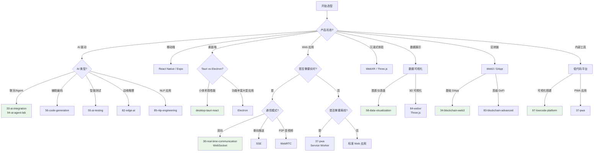
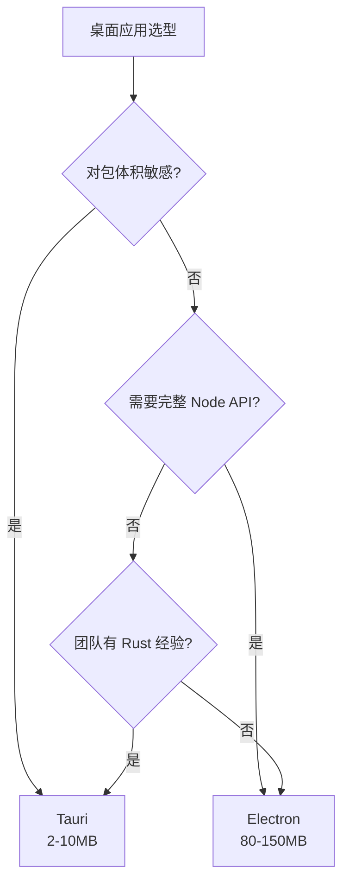

# 应用领域选型指南

> 根据业务场景快速选择正确的技术栈和应用领域入口。本文档面向技术决策者、架构师和全栈开发者。

---

## 选型决策树

---

## 按业务场景选型

### 1. AI 与 Agent 应用

| 业务场景 | 推荐入口 | 技术栈 | 学习曲线 |
|----------|----------|--------|----------|
| AI 聊天机器人 | `jsts-code-lab/33-ai-integration/` | Vercel AI SDK + OpenAI/Claude | 1-2 周 |
| 多 Agent 协作系统 | `jsts-code-lab/94-ai-agent-lab/` | MCP + AI SDK Tool Calling | 2-4 周 |
| AI 辅助测试 | `jsts-code-lab/55-ai-testing/` | Vitest + LLM 测试生成 | 1 周 |
| 代码生成工具 | `jsts-code-lab/56-code-generation/` | AST + AI SDK | 2-3 周 |
| 浏览器端 AI 推理 | `jsts-code-lab/82-edge-ai/` | ONNX Runtime + WebNN | 2-4 周 |
| NLP 文本分析 | `jsts-code-lab/85-nlp-engineering/` | 自定义分词 + 分类器 | 1-2 周 |
| 自主决策 Agent | `jsts-code-lab/89-autonomous-systems/` | BDI + 行为树 | 2-3 周 |
| 生产级 AI 系统 | `examples/ai-agent-production/` | Mastra + MCP + PostgreSQL | 3-4 周 |

**选型原则**:

- 需要 UI 流式输出 → Vercel AI SDK（React Server Components 原生支持）
- 需要多 Agent 协作 → 94-ai-agent-lab（MCP + 多 Agent 工作流）
- 需要边缘推理 → 82-edge-ai（WebNN/WebGPU 量化模型）
- 只需要单次 LLM 调用 → 33-ai-integration（最轻量）

---

### 2. 移动端与桌面端

| 业务场景 | 推荐入口 | 技术栈 | 关键考量 |
|----------|----------|--------|----------|
| 跨平台移动 App | `examples/mobile-react-native-expo/` | React Native + Expo | 原生性能、OTA 更新 |
| 轻量级桌面工具 | `examples/desktop-tauri-react/` | Tauri + React | 包体积 < 5MB、内存低 |
| 复杂桌面 IDE | `docs/platforms/DESKTOP_DEVELOPMENT.md` | Electron | 完整 Node API、生态成熟 |
| Web + 移动共享代码 | `docs/platforms/MOBILE_DEVELOPMENT.md` | React Native Web / Expo | 代码复用率 |

**Tauri vs Electron 决策**:

---

### 3. Web3 与区块链

| 业务场景 | 推荐入口 | 技术栈 | 复杂度 |
|----------|----------|--------|--------|
| 钱包连接 + 交易 | `jsts-code-lab/34-blockchain-web3/` | viem / ethers.js | ⭐⭐⭐ |
| NFT 铸造/交易 | `jsts-code-lab/34-blockchain-web3/` | Ethers.js + IPFS | ⭐⭐⭐⭐ |
| DeFi 协议交互 | `jsts-code-lab/83-blockchain-advanced/` | viem + Layer 2 | ⭐⭐⭐⭐⭐ |
| 跨链桥接 | `jsts-code-lab/83-blockchain-advanced/` | Rollup + 跨链协议 | ⭐⭐⭐⭐⭐ |

---

### 4. 实时通信

| 业务场景 | 推荐协议 | 推荐入口 | 关键考量 |
|----------|----------|----------|----------|
| 聊天室 / 在线客服 | WebSocket | `jsts-code-lab/30-real-time-communication/` | 双向、 rooms |
| 股票行情 / 日志流 | SSE | `jsts-code-lab/30-real-time-communication/` | 单向、自动重连 |
| 视频会议 / P2P 传输 | WebRTC | `jsts-code-lab/30-real-time-communication/` | NAT 穿透、信令 |
| 在线协作编辑 | WebSocket + CRDT | `jsts-code-lab/30-real-time-communication/` | 冲突解决 |

---

### 5. 游戏与沉浸式图形

| 业务场景 | 推荐技术 | 推荐入口 | 复杂度 |
|----------|----------|----------|--------|
| VR/AR 体验 | WebXR API | `jsts-code-lab/84-webxr/` | ⭐⭐⭐⭐⭐ |
| 3D 数据展示 | Three.js + React Three Fiber | `docs/platforms/DATA_VISUALIZATION.md` | ⭐⭐⭐⭐ |
| 2D 游戏 | PixiJS / Phaser | `docs/categories/34-webxr-ar-vr.md` | ⭐⭐⭐ |
| 交互式仪表盘 | D3.js / ECharts | `jsts-code-lab/58-data-visualization/` | ⭐⭐⭐ |
| 数据大屏 | ECharts / AntV | `jsts-code-lab/58-data-visualization/` | ⭐⭐⭐ |

---

### 6. 边缘与 Serverless

| 业务场景 | 推荐平台 | 推荐入口 | 关键考量 |
|----------|----------|----------|----------|
| 全球 API 边缘化 | Cloudflare Workers | `jsts-code-lab/93-deployment-edge-lab/` | 冷启动 < 1ms |
| A/B 测试 / 特性开关 | Vercel Edge Config | `jsts-code-lab/93-deployment-edge-lab/` | 全球同步 |
| AI 边缘推理 | Cloudflare Workers AI | `jsts-code-lab/82-edge-ai/` | 低延迟 |
| 事件驱动处理 | AWS Lambda / Vercel Functions | `jsts-code-lab/31-serverless/` | 自动扩缩容 |
| 有状态边缘会话 | Durable Objects | `jsts-code-lab/32-edge-computing/` | 状态持久化 |

---

### 7. 低代码与可视化

| 业务场景 | 推荐入口 | 技术栈 | 关键考量 |
|----------|----------|--------|----------|
| 内部管理后台搭建 | `jsts-code-lab/97-lowcode-platform/` | Schema + 拖拽设计器 | 开发效率 |
| 可安装 Web 应用 | `jsts-code-lab/37-pwa/` | Service Worker + Manifest | 离线体验 |
| 数据报表系统 | `jsts-code-lab/58-data-visualization/` | Canvas/SVG + 动画 | 交互性 |
| 可视化工作流 | `jsts-code-lab/97-lowcode-platform/` | DAG + 表达式引擎 | 业务灵活性 |

---

## 技术栈成熟度评估

| 领域 | 生产就绪度 | 生态丰富度 | 人才可得性 | 长期趋势 |
|------|------------|------------|------------|----------|
| AI / Agent | ⭐⭐⭐⭐ | ⭐⭐⭐⭐⭐ | ⭐⭐⭐⭐ | 🔥 高速增长 |
| 移动端 (RN/Expo) | ⭐⭐⭐⭐⭐ | ⭐⭐⭐⭐⭐ | ⭐⭐⭐⭐⭐ | 📈 稳定 |
| 桌面端 (Tauri) | ⭐⭐⭐⭐ | ⭐⭐⭐⭐ | ⭐⭐⭐ | 📈 上升 |
| Web3 | ⭐⭐⭐⭐ | ⭐⭐⭐⭐ | ⭐⭐⭐ | ➡️ 稳定 |
| 实时通信 | ⭐⭐⭐⭐⭐ | ⭐⭐⭐⭐⭐ | ⭐⭐⭐⭐⭐ | ➡️ 成熟 |
| WebXR | ⭐⭐⭐ | ⭐⭐⭐ | ⭐⭐ | 📈 演进中 |
| Serverless/边缘 | ⭐⭐⭐⭐⭐ | ⭐⭐⭐⭐⭐ | ⭐⭐⭐⭐⭐ | 📈 成熟 |
| 低代码 | ⭐⭐⭐⭐⭐ | ⭐⭐⭐⭐ | ⭐⭐⭐⭐ | ➡️ 成熟 |
| 数据可视化 | ⭐⭐⭐⭐⭐ | ⭐⭐⭐⭐⭐ | ⭐⭐⭐⭐⭐ | ➡️ 成熟 |

---

## 常见选型陷阱

### ❌ 陷阱 1: 用 Electron 做简单工具

- **问题**: 100MB+ 包体积，用户下载成本高
- **正解**: 简单工具首选 Tauri（< 5MB）或 PWA

### ❌ 陷阱 2: AI 应用直接调用原始 API

- **问题**: 无流式输出、无错误处理、无成本追踪
- **正解**: 使用 Vercel AI SDK 或类似框架封装

### ❌ 陷阱 3: 所有实时功能都用 WebSocket

- **问题**: WebSocket 维护成本高，SSE 更适合单向场景
- **正解**: 单向推送用 SSE，双向通信用 WebSocket

### ❌ 陷阱 4: 在边缘运行重型 AI 模型

- **问题**: 边缘计算资源有限，大模型推理延迟高
- **正解**: 边缘跑量化/TinyML 模型，大模型放云端

### ❌ 陷阱 5: 低代码平台过度定制

- **问题**: 低代码的优势是快速，过度定制反而拖慢开发
- **正解**: 80% 标准功能用低代码，20% 复杂逻辑手写

---

## 关联文档

- `docs/application-domains-index.md` — 应用领域总索引与资源地图
- `jsts-code-lab/application-domains-README.md` — 代码实验室应用领域总览
- `docs/decision-trees.md` — 通用技术选型决策树

---

> 📅 最后更新: 2026-04-27
> 💡 **提示**: 技术选型没有银弹。本文档提供的是"默认推荐"，实际项目中请结合团队技术栈、交付时间和长期维护成本综合判断。
