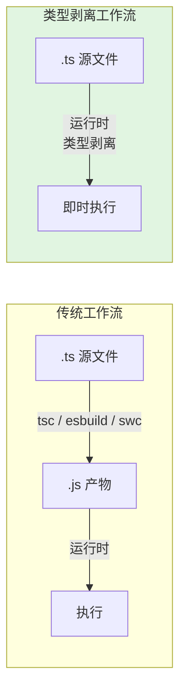
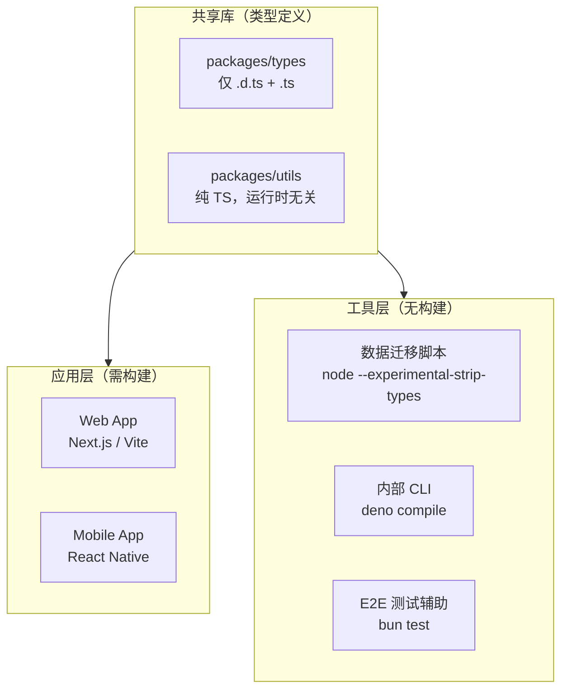
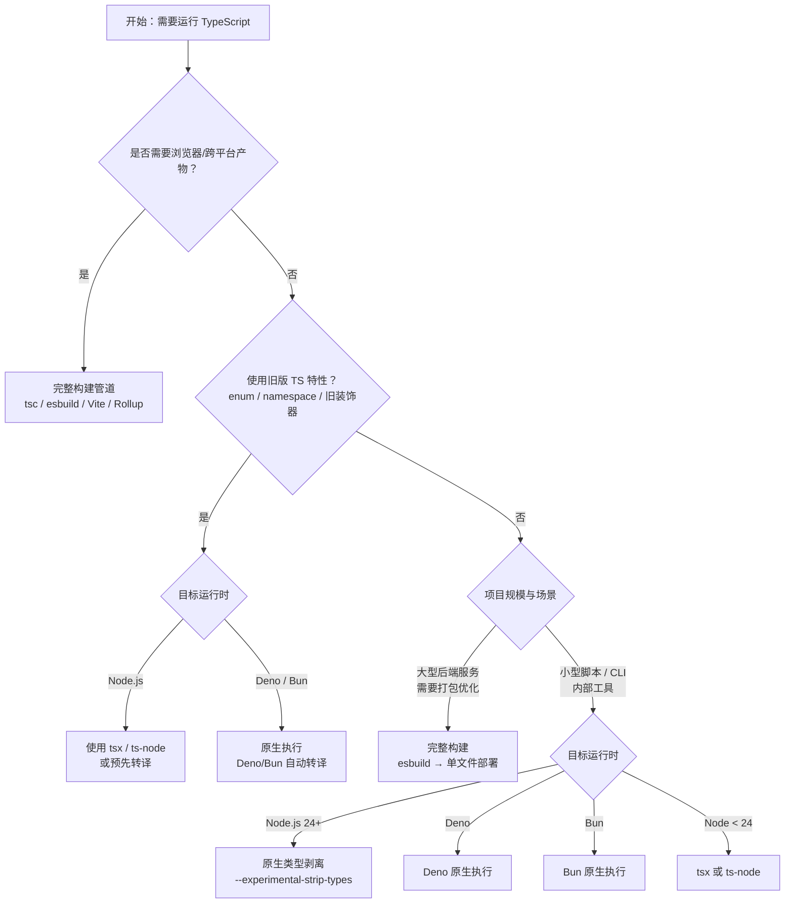
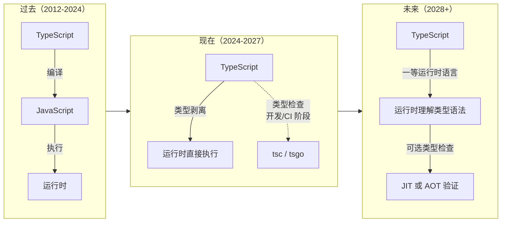

# 无构建 TypeScript（Build-Free TS）与类型剥离范式指南

> 主题：Type Stripping / 无构建执行范式 | 最后更新：2026 年 4 月
>
> 本指南梳理 Node.js、Deno、Bun 直接执行 TypeScript 的技术原理、选型策略与工程实践。

---

## 概述

自 2012 年 TypeScript 诞生以来，"TS → JS → 执行" 一直是不可动摇的工作流。开发者必须借助 `tsc`、`esbuild`、`swc` 或 `tsx` 等工具将类型擦除后的 JavaScript 交给运行时。然而，从 2024 年开始，这一范式发生了根本性动摇：

- **Node.js 24 LTS**（2025 年 10 月）引入了 `--experimental-strip-types`，将类型剥离从实验性推向准稳定；
- **Deno** 自 2018 年诞生起就原生支持 TS 执行，到 2.7 版本已具备 95%+ 的 npm 兼容性；
- **Bun** 从 1.0 起将 TS 作为一等公民，1.3.x 版本声称实现 99.7% 的 Node.js 兼容度。

这不是简单的"省掉编译步骤"。**类型剥离（Type Stripping）** 代表了一种新的运行时契约：运行时只负责**移除类型注解并执行**，而**类型检查**仍由编辑器或 `tsc` 在开发/CI 阶段完成。TS 与 JS 的边界正在从"编译时"向"开发时"迁移。

---

## 什么是类型剥离？（Type Stripping）

### 核心定义

**类型剥离**是指运行时在加载 `.ts` 文件时，**仅执行词法层面的类型注解删除**，而不进行类型检查、语法转换或 polyfill 注入，随后将得到的类 JavaScript 代码直接送入 V8/JavaScriptCore 引擎执行。



### 类型剥离 ≠ 类型检查

这是最容易混淆的概念。类型剥离运行时**完全不关心类型正确性**：

```typescript
// math.ts
function add(a: number, b: number): number {
  return a + b;
}

// 类型剥离后等价于：
// function add(a, b) {
//   return a + b;
// }

// 以下代码在类型剥离时不会报错，运行时才会暴露问题
add("hello", "world"); // ❌ 运行时拼接字符串，但不会触发 TS 类型错误
```

**类型安全仍由以下环节保障**：

1. **IDE/编辑器**：通过 Language Server 实时检查；
2. **提交前**：`tsc --noEmit` 在 pre-commit hook 中拦截；
3. **CI 阶段**：类型检查作为独立流水线步骤。

### 剥离范围

类型剥离仅删除以下**纯类型语法**，保留其他所有运行时语义：

| 可剥离内容 | 示例 | 剥离后 |
|-----------|------|--------|
| 参数/返回值类型注解 | `function f(x: string): number` | `function f(x)` |
| 变量类型注解 | `const x: number = 1` | `const x = 1` |
| 接口（interface） | `interface User { name: string }` | *(完全移除)* |
| 类型别名（type） | `type ID = string` | *(完全移除)* |
| 泛型参数 | `function id<T>(x: T): T` | `function id(x)` |
| `import type` / `export type` | `import type { Foo } from './foo'` | *(完全移除)* |
| `satisfies` 运算符 | `const x = {} satisfies Record<string, string>` | `const x = {}` |

---

## 三大运行时现状对比（2026.04）

### 总览

| 维度 | Node.js 24 LTS | Deno 2.7 | Bun 1.3.x |
|------|---------------|----------|-----------|
| **TS 执行方式** | `--experimental-strip-types` | 原生内置，零配置 | 原生内置，零配置 |
| **首次支持版本** | v22.6.0（实验）/ v24.x（准稳定） | v0.1.0（2018） | v1.0.0（2023） |
| **启动延迟** | ~25-40ms（含模块解析） | ~15-25ms | **~5-10ms** |
| **npm 兼容率** | 100%（自身即 npm） | **~95%+** | **~99.7%**（声称） |
| `node:` 前缀兼容 | 原生 | ✅ 完整支持 | ✅ 完整支持 |
| `npm:` 前缀支持 | 原生 | ✅ 原生支持 | ✅ 原生支持 |
| **类型剥离速度** | 中等（基于内部 C++ 实现） | 快（Rust 核心） | **最快**（Zig + 自研 JS 引擎） |
| **内置包管理** | npm / pnpm / yarn（外部） | `deno` CLI 内置 | `bun` CLI 内置 |
| **内置测试运行器** | `node --test` | `deno test` | `bun test` |
| **内置打包器** | 无 | `deno bundle`（已弃用） / `deno compile` | `bun build` |
| **单文件可执行编译** | `sea`（较复杂） | `deno compile`（推荐） | `bun build --compile` |

### Node.js 24 LTS：`--experimental-strip-types`

Node.js 在 v22.6.0 首次引入 `--experimental-strip-types`，到 **v24 LTS（2025 年 10 月）** 该特性已毕业为准稳定状态，预计 v26 LTS 完全移除实验性标志。

```bash
# 直接执行 TypeScript 文件（Node.js 24+）
node --experimental-strip-types src/server.ts

# 配合 watch 模式（开发环境）
node --experimental-strip-types --watch src/server.ts

# package.json 中配置快捷方式
{
  "scripts": {
    "dev": "node --experimental-strip-types --watch src/index.ts",
    "start": "node --experimental-strip-types src/index.ts"
  }
}
```

**Node.js 类型剥离的关键行为**：

1. **仅支持 ESM**：`.ts` 文件默认按 ECMAScript 模块处理；若使用 CommonJS 语法（`require`/`module.exports`），需显式将文件改为 `.cts` 并配合 `"type": "commonjs"`。
2. **不转译新语法**：`enum`、`namespace`、参数属性（parameter properties）、旧版装饰器等需要转换的特性**不支持**直接剥离执行。
3. **Source Map 自动生成**：运行时会自动内联 source map，堆栈跟踪指向原始 `.ts` 行号。

```typescript
// ✅ 可直接执行
import { createServer } from 'node:http';

const PORT: number = 3000;

const server = createServer((req, res) => {
  res.writeHead(200, { 'Content-Type': 'application/json' });
  res.end(JSON.stringify({ runtime: 'Node.js 24', ts: true }));
});

server.listen(PORT, () => console.log(`Listening on ${PORT}`));
```

### Deno 2.7：安全优先的原生 TS

Deno 是原生 TypeScript 执行的先行者。到 **Deno 2.7（2026 年 2 月）**，其 npm 兼容性已达到 95%+，并新增了 `deno audit`（依赖安全审计）、Deno KV（内置键值存储 GA）以及 Deno Deploy（边缘部署 GA）。

```bash
# 直接运行 TS（零配置）
deno run src/server.ts

# 使用 npm 包（自动从 npm registry 拉取）
deno run --allow-net npm:express@5

# Deno 2.x 识别 package.json（Node 项目无缝迁移）
deno run --allow-all npm:start

# 单文件编译为可执行二进制
deno compile --allow-net --output mycli src/cli.ts
```

**Deno 的 TS 执行特性**：

- **类型检查可选**：默认执行时**不进行**类型检查（剥离即执行）。若需要类型检查，显式添加 `--check` 标志：
  ```bash
  deno run --check src/server.ts
  ```
- **内置 deno.json 配置**：支持 `compilerOptions` 用于 IDE 和 `--check` 模式，但运行时剥离不依赖这些配置。
- **URL 导入**：除 npm 包外，仍支持原生 HTTP 导入（这是 Deno 的设计初衷之一）。

```typescript
// Deno 2.7 示例：使用内置 KV 的 TS 脚本
const kv = await Deno.openKv();

interface User {
  id: string;
  name: string;
}

async function getUser(id: string): Promise<User | null> {
  const entry = await kv.get<User>(["users", id]);
  return entry.value;
}

const user = await getUser("1001");
console.log(user);
```

### Bun 1.3.x：最快的一体化实现

Bun 将 TypeScript 执行性能推向了极致。其类型剥离与模块解析均在 **Zig** 编写的自研引擎中完成，绕过大量传统 Node.js 的 C++ 绑定开销。

```bash
# 直接运行（无需任何标志）
bun src/server.ts

# 内置 watch 模式
bun --watch src/server.ts

# 运行测试（原生 TS 支持）
bun test src/math.test.ts

# 内置打包（支持 TS 入口）
bun build src/index.ts --outdir ./dist

# 编译为单文件可执行程序
bun build src/cli.ts --compile --outfile mycli
```

**Bun 1.3.x 的亮点**：

| 特性 | 说明 |
|------|------|
| **原生 S3 客户端** | `bun:aws` 内置 S3 驱动，无需 `aws-sdk` |
| **原生 SQL 驱动** | `bun:sql` 内置 PostgreSQL/MySQL/SQLite 驱动 |
| **HTML 路由** | `Bun.serve` 可直接返回 HTML 模板，内置 JSX/TSX 支持 |
| **兼容层** | 99.7% Node.js API 兼容，包括 `node:fs`、`node:path` 等 |
| **转译能力** | 除类型剥离外，Bun 还会自动转译 `JSX`、`装饰器` 等需要转换的语法 |

```typescript
// Bun 1.3.x：原生 TS + 内置 SQL 示例
import { Database } from "bun:sql";

interface Product {
  id: number;
  name: string;
  price: number;
}

const db = new Database("postgres://localhost/mydb");

const products = await db.query<Product>`
  SELECT id, name, price FROM products WHERE price > ${100}
`;

console.table(products);
```

---

## 选型策略：原生执行 vs tsx/ts-node vs 完整构建

### 三种执行模式对比

| 维度 | 原生类型剥离 | `tsx` / `ts-node` | 完整构建（tsc/esbuild/Vite） |
|------|------------|-------------------|---------------------------|
| **是否需要构建产物** | ❌ 不需要 | ❌ 不需要（JIT 转译） | ✅ 需要 `.js` 产物 |
| **类型检查** | ❌ 不执行 | ❌ 不执行（可选） | ✅ `tsc` 可执行 |
| **语法转译** | 不转译（部分运行时有限支持） | ✅ 自动转译 | ✅ 完全控制转译目标 |
| **启动速度** | 快（原生剥离） | 中等（Node 加载器钩子） | 慢（需先构建） |
| **装饰器支持** | ❌ Node.js 不支持；Bun 支持 | ✅ 支持 | ✅ 支持 |
| `enum` / `namespace` | ❌ Node.js 不支持；Bun/Deno 支持 | ✅ 支持 | ✅ 支持 |
| **生产部署** | 可直接部署源码 | 通常仅限开发 | 部署产物 |
| **Source Map** | 自动生成 | 支持 | 需配置 |
| **适用场景** | 脚本、内部工具、CLI | 开发调试、遗留项目 | 大型应用、浏览器产物 |

### `tsx` 的定位变化

`tsx`（以及底层的 `esbuild`）长期以来是 Node.js 运行 TS 的最佳方案。在类型剥离时代，它的角色正在转变：

```bash
# 传统方式：tsx 负责转译 + 执行
npx tsx src/server.ts

# 新方式：Node.js 24+ 原生执行（tsx 仅作为降级备选）
node --experimental-strip-types src/server.ts

# tsx 仍适用于需要转译的场景
npx tsx --tsconfig ./tsconfig.json src/server.ts
```

**`tsx` 仍不可替代的场景**：

1. 需要**路径别名**（`@/utils` → `./src/utils`）解析；
2. 使用**旧版装饰器**（Legacy Decorators）或 `enum`；
3. 需要**自定义转译目标**（如降级到 ES2015）；
4. 项目处于 **Node.js 22 以下**环境。

---

## CI/CD 与部署策略

### 能否跳过构建步骤？

这是类型剥离范式中最具实际意义的问题。答案是：**取决于运行时与部署目标**。

| 部署目标 | 是否可跳过构建 | 条件与注意事项 |
|---------|--------------|--------------|
| **Node.js 24+ 服务器 / 容器** | ✅ 可以 | 确保生产环境 Node.js ≥ 24；`package.json` 中的 `"type": "module"` 需正确设置 |
| **Deno Deploy** | ✅ 可以 | 原生支持 TS，直接推送源码 |
| **Bun 运行时 / 容器** | ✅ 可以 | `bun src/index.ts` 直接启动 |
| **Vercel / Netlify 边缘函数** | ⚠️ 部分可以 | Deno 运行时（Vercel Edge）支持 TS；Node 运行时仍需构建 |
| **AWS Lambda** | ❌ 不建议 | Lambda 的 Node.js 托管运行时更新滞后；建议仍用 esbuild 打包为单文件 |
| **传统 Linux 服务器** | ⚠️ 谨慎 | 需保证服务器上的 Node.js/Deno/Bun 版本与开发环境一致 |

### 推荐的 CI 流水线（无构建模式）

```yaml
# .github/workflows/deploy.yml —— 无构建部署示例（Node.js 24 + 类型剥离）
name: Deploy

on:
  push:
    branches: [main]

jobs:
  typecheck:
    runs-on: ubuntu-latest
    steps:
      - uses: actions/checkout@v4
      - uses: actions/setup-node@v4
        with:
          node-version: '24'
      - run: npm ci
      # ✅ 类型检查仍在 CI 中执行，但不生成产物
      - run: npx tsc --noEmit

  deploy:
    needs: typecheck
    runs-on: ubuntu-latest
    steps:
      - uses: actions/checkout@v4
      - uses: actions/setup-node@v4
        with:
          node-version: '24'
      - run: npm ci --production
      # ✅ 直接上传源码，无需构建步骤
      - run: rsync -avz --exclude='node_modules' . user@server:/app/
      - run: ssh user@server 'cd /app && pm2 restart ecosystem.config.js'
```

### 容器化部署示例

```dockerfile
# Dockerfile —— 无构建 TypeScript 部署（Node.js 24）
FROM node:24-alpine

WORKDIR /app
COPY package*.json ./
RUN npm ci --production

# ✅ 直接复制 .ts 源码，无需 COPY dist/
COPY src/ ./src/

EXPOSE 3000
CMD ["node", "--experimental-strip-types", "src/index.ts"]
```

对比传统构建镜像，无构建镜像：

- **体积更小**：无需包含 `dist/` 产物（通常与源码体积相当或更大）；
- **构建更快**：省去 `npm run build` 步骤；
- **调试更直接**：容器内堆栈跟踪指向 `.ts` 文件，无需 source map 映射。

---

## 局限性与不支持的特性

类型剥离**不是万能药**。以下 TypeScript 特性在纯粹的"剥离"模型中无法工作，因为它们需要语法转换（transpilation）：

| 特性 | 需要转译？ | Node.js 24 原生剥离 | Deno 2.7 | Bun 1.3.x |
|------|----------|-------------------|----------|-----------|
| **`enum`** | ✅ 是（生成双向映射对象） | ❌ 不支持 | ✅ 支持 | ✅ 支持 |
| **`namespace` / `module {}`** | ✅ 是（合并为对象） | ❌ 不支持 | ✅ 支持 | ✅ 支持 |
| **旧版装饰器（Legacy Decorators）** | ✅ 是 | ❌ 不支持 | ✅ 支持 | ✅ 支持 |
| **TC39  Stage 3 装饰器** | ⚠️ 部分引擎原生支持 | ✅ Node.js 24+ 原生 | ✅ 支持 | ✅ 支持 |
| **参数属性（Parameter Properties）** | ✅ 是 | ❌ 不支持 | ✅ 支持 | ✅ 支持 |
| **`const enum`** | ✅ 是（内联替换） | ❌ 不支持 | ✅ 支持 | ✅ 支持 |
| **`import x = require(...)`** | ✅ 是 | ❌ 不支持（ESM 优先） | ✅ 支持 | ✅ 支持 |
| **JSX / TSX** | ✅ 是 | ❌ 不支持 | ✅ 支持 | ✅ 支持 |
| **`moduleResolution: 'bundler'`** | 否（仅解析策略） | ⚠️ 需 `--experimental-require-module` 配合 | ✅ 支持 | ✅ 支持 |

### Node.js 类型剥离的明确限制

以下代码在 Node.js 24 的 `--experimental-strip-types` 下**会直接报错**：

```typescript
// ❌ 错误：enum 需要转译
enum Status {
  Pending,
  Success,
  Error,
}

// ❌ 错误：namespace 需要转译
namespace Utils {
  export function log(msg: string) {
    console.log(msg);
  }
}

// ❌ 错误：参数属性需要转译
class User {
  constructor(public name: string, private age: number) {}
}

// ❌ 错误：旧版装饰器需要转译
function sealed(target: any) {
  Object.seal(target);
}

@sealed
class Greeter {}
```

**迁移策略**：

```typescript
// ✅ 将 enum 改为 const + union 类型（零运行时开销）
type Status = 'pending' | 'success' | 'error';
const Status = {
  Pending: 'pending',
  Success: 'success',
  Error: 'error',
} as const;

// ✅ 将 namespace 改为 ES Module 导出
export function log(msg: string) {
  console.log(msg);
}

// ✅ 将参数属性显式声明
class User {
  name: string;
  private age: number;
  constructor(name: string, age: number) {
    this.name = name;
    this.age = age;
  }
}
```

---

## 工程实践与最佳实践

### 1. 小型脚本与内部工具

类型剥离的最大收益场景是**一次性脚本、数据迁移、内部 CLI 工具**：

```typescript
#!/usr/bin/env -S node --experimental-strip-types
// scripts/seed-database.ts

import { createConnection } from 'node:mysql2/promise';

interface SeedConfig {
  host: string;
  database: string;
  count: number;
}

const config: SeedConfig = {
  host: process.env.DB_HOST ?? 'localhost',
  database: process.env.DB_NAME ?? 'dev',
  count: parseInt(process.env.SEED_COUNT ?? '100', 10),
};

async function seed(): Promise<void> {
  const conn = await createConnection(config.host);
  for (let i = 0; i < config.count; i++) {
    await conn.execute('INSERT INTO users (name) VALUES (?)', [`user-${i}`]);
  }
  console.log(`Seeded ${config.count} rows`);
  await conn.end();
}

seed();
```

配合 `chmod +x` 与 Shebang，可直接作为可执行脚本运行，无需任何构建配置。

### 2. CLI 工具开发

使用 Deno 或 Bun 开发 CLI 工具时，可直接分发**源码级单文件**，或使用编译为原生二进制：

```bash
# Deno：编译为无依赖单文件可执行程序
deno compile --allow-read --allow-write --output ./bin/my-cli src/cli.ts

# Bun：编译为单文件可执行程序（包含运行时）
bun build src/cli.ts --compile --outfile ./bin/my-cli

# Node.js：使用 sea（Single Executable Application）
# 注：Node.js SEA 目前仍需构建 blob 步骤，类型剥离尚不直接支持单文件编译
```

### 3. Monorepo 中的混合策略

在大型 Monorepo 中，建议采用**分层策略**：



### 4. package.json 脚本规范

```jsonc
{
  "scripts": {
    // 开发：使用原生类型剥离 + watch
    "dev": "node --experimental-strip-types --watch src/index.ts",
    
    // 生产启动（Node.js 24+）
    "start": "node --experimental-strip-types src/index.ts",
    
    // 类型检查（独立步骤）
    "typecheck": "tsc --noEmit",
    
    // 降级方案（旧版 Node 或需转译时）
    "dev:legacy": "tsx watch src/index.ts",
    "start:legacy": "tsx src/index.ts",
    
    // 脚本执行
    "seed": "node --experimental-strip-types scripts/seed.ts",
    "migrate": "node --experimental-strip-types scripts/migrate.ts"
  }
}
```

### 5. tsconfig.json 建议（无构建项目）

即使不通过 `tsc` 编译，仍建议保留 `tsconfig.json` 用于编辑器和类型检查：

```jsonc
{
  "compilerOptions": {
    "target": "ES2024",
    "module": "NodeNext",
    "moduleResolution": "NodeNext",
    "strict": true,
    "noEmit": true,           // ✅ 关键：不输出产物，仅用于类型检查
    "esModuleInterop": true,
    "skipLibCheck": true,
    "verbatimModuleSyntax": true  // ✅ 强制区分 import / import type
  },
  "include": ["src/**/*", "scripts/**/*"]
}
```

---

## 决策矩阵：选择你的执行策略

### 流程图



### 快速决策表

| 场景 | 推荐方案 | 理由 |
|------|---------|------|
| **快速原型 / 一次性脚本** | Bun / Deno 原生 | 零配置，最快启动 |
| **Node.js 24+ 后端 API** | `node --experimental-strip-types` | 无需构建，原生 source map |
| **需要 `enum` 或旧装饰器** | Bun / Deno 原生，或 `tsx` | 原生执行同时支持转译 |
| **大型 Monorepo 后端** | 保留 esbuild 构建 | 需要路径别名、单文件打包、 tree-shaking |
| **Next.js / React 应用** | 保留完整构建 | 框架本身需要构建步骤 |
| **边缘部署（Cloudflare Workers）** | Deno Deploy / Vercel Edge | 原生 TS 支持，全球分发 |
| **团队 CI 统一且 Node < 24** | `tsx` + `tsc --noEmit` | 一致性优先，等待 runtime 升级 |

---

## 未来展望：TypeScript 会成为"一等运行时语言"吗？

### 短期（2026-2027）

1. **Node.js 类型剥离稳定化**：预计 v26 LTS 完全移除 `--experimental-` 前缀，`.ts` 文件可作为 CLI 入口默认执行。
2. **TypeScript 7.0 Go 编译器**：tsgo 的 10× 性能提升将彻底改变"类型检查"的成本结构。当类型检查从"分钟级"降至"秒级"，开发-运行循环将进一步缩短。
3. ** WinterTC / TC55 标准化**：随着 Minimum Common Web API 的普及，"同一份 TS 代码在 Node/Deno/Bun 上无修改运行"将成为常态。

### 中期（2027-2028）

- **运行时类型检查（Runtime Type Checking）**：社区正在探索基于 TS 类型注解的轻量级运行时校验（如 `zod` 与 TS 类型双向生成）。类型剥离为这一方向铺平了道路——类型信息在运行时被移除，但可通过构建时宏或反射补充。
- **单文件可执行生态**：`deno compile` 和 `bun build --compile` 将推动 TS 成为系统级脚本语言（替代 Bash/Python 的候选者）。

### 长期愿景



TypeScript 不太可能完全取代 JavaScript 成为 ECMAScript 标准的一部分，但 **".ts 文件无需构建即可在任何主流服务端运行时执行"** 正在成为现实。这一范式转变的核心意义在于：

> **类型检查与代码执行解耦**。类型系统是开发时的约束，而非运行时的前置条件。

对于小型脚本、内部工具、边缘函数和快速原型，"无构建 TypeScript" 已经是可以落地的工作流。对于大型前端应用，构建步骤仍将长期存在——但那是**打包优化**（tree-shaking、代码分割、资源内联）的需要，而非**类型擦除**的需要。

---

## 参考资源

- [Node.js 24 Documentation — Type Stripping](https://nodejs.org/docs/latest-v24.x/api/typescript.html)
- [Deno 2.x Manual — TypeScript Support](https://docs.deno.com/runtime/fundamentals/typescript/)
- [Bun Documentation — TypeScript](https://bun.sh/docs/runtime/typescript)
- [TypeScript 7.0 / tsgo 路线图](https://github.com/microsoft/typescript-go)
- [tsx — TypeScript Execute](https://github.com/privatenumber/tsx)
- [WinterTC / TC55 Minimum Common Web API](https://wintertc.org/)
- [Node.js SEA (Single Executable Applications)](https://nodejs.org/api/single-executable-applications.html)
- [Deno `deno compile` 文档](https://docs.deno.com/runtime/reference/cli/compiler/)
- [Bun `build --compile` 文档](https://bun.sh/docs/bundler/executables)

---

> 📅 本文档最后更新：2026 年 4 月
>
> 💡 **关键洞察**：类型剥离不是银弹，但它标志着服务端 TypeScript 从"编译语言"向"脚本语言"回归。对于新启动的小型项目和内部工具，优先考虑原生执行；对于已有构建管道的大型项目，类型剥离可作为开发加速器，而非替代方案。
