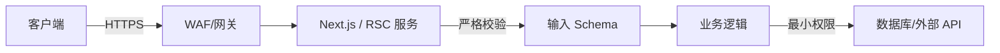

# React Server Components (RSC) 与 Server Actions 安全指南

> 本文档深度分析 CVE-2025-55182（React2Shell）漏洞，并提供 RSC / Server Actions 的安全最佳实践。

---

## 漏洞概览：CVE-2025-55182（React2Shell）

| 属性 | 详情 |
|------|------|
| **CVE 编号** | CVE-2025-55182 |
| **公开名称** | React2Shell |
| **CVSS 评分** | **10.0（Critical）** |
| **漏洞类型** | Prototype Pollution → Remote Code Execution (RCE) |
| **攻击向量** | RSC Flight Protocol 反序列化漏洞 |
| **披露时间** | 2025 年 |

### 漏洞原理

React Server Components 使用 **RSC Flight Protocol** 在服务端与客户端之间传输序列化的组件树与数据。该协议基于自定义的流式格式，将 JavaScript 对象、Promise、模块引用等序列化为可流式传输的行协议（line-based protocol）。

漏洞的核心在于 **Flight Protocol 的反序列化器** 对传入数据缺乏足够的原型链隔离：

1. 攻击者构造恶意的 `multipart/form-data` 请求体
2. 在请求中注入特殊的 payload，例如：
   - `__proto__:then` —— 污染对象原型链
   - `status: "resolved_model"` —— 欺骗反序列化器进入特定的解析分支
3. 反序列化器在解析过程中，将恶意属性写入到 `Object.prototype` 或其他关键内置对象的原型上
4. 导致后续代码执行路径被劫持，最终达成 **远程代码执行 (RCE)**

```text
# 攻击请求体示意（multipart/form-data）
------WebKitFormBoundary
Content-Disposition: form-data; name="__proto__:then"

{ "status": "resolved_model", "value": " malicious code... " }
------WebKitFormBoundary--
```

### 影响范围

| 软件包 | 受影响版本 | 安全版本 |
|--------|-----------|---------|
| `next` | **15.x**、**16.x prior to 16.0.7** | ≥ 16.0.7 |
| `react-server-dom-webpack` | **19.0.0 – 19.2.2** | ≥ 19.2.3 |
| `react-server-dom-esm` | **19.0.0 – 19.2.2** | ≥ 19.2.3 |
| `react-server-dom-turbopack` | **19.0.0 – 19.2.2** | ≥ 19.2.3 |

> ⚠️ **注意**：该漏洞仅影响使用 **React Server Components** 或 **Server Actions** 的应用。纯客户端渲染 (CSR) 的 React 应用不受此漏洞影响。

---

## 修复方案

### 1. 升级依赖（首要措施）

```bash
# Next.js 用户
npm install next@latest react@latest react-dom@latest

# 使用 RSC 的独立项目
npm install react-server-dom-webpack@latest
# 或
npm install react-server-dom-esm@latest
```

升级后请验证版本：

```bash
npm ls next react react-dom react-server-dom-webpack
```

### 2. WAF / 网关规则

在修复前或无法立即升级时，可在 WAF（Web Application Firewall）或反向代理层配置临时规则：

- **拦截包含 `__proto__` 的 multipart/form-data 字段名**
- **拦截包含 `constructor.prototype` 的字段名**
- **对 `/action`、`/_rsc` 等 Server Actions / RSC 端点加强审查**

```nginx
# Nginx 示例（临时缓解规则）
if ($request_body ~* "__proto__") {
    return 403;
}
```

> ⚠️ 此规则仅为临时缓解，不能替代依赖升级。

### 3. 输入验证与沙箱

- 对所有进入 Server Actions 的用户输入执行 **严格校验**（Zod、Valibot 等 schema 验证）
- 禁止直接将用户输入序列化后传递给 RSC 流
- 在服务端运行环境中启用 **最小权限原则**（如容器沙箱、Seccomp、非 root 用户）

---

## RSC / Server Actions 安全最佳实践

### 架构层安全



1. **始终使用 HTTPS**：防止 Flight Protocol 流在传输中被中间人篡改
2. **WAF 前置**：对 RSC 和 Server Actions 路由实施流量审查
3. **最小权限**：RSC 服务端进程应以非 root 运行，限制文件系统与网络访问

### Server Actions 输入校验

Server Actions 本质是暴露给客户端的函数端点，**必须像对待 API 接口一样对待它们**。

```tsx
'use server';

import { z } from 'zod';

const CreatePostSchema = z.object({
  title: z.string().min(1).max(200),
  content: z.string().min(1).max(10000),
  published: z.boolean().default(false),
});

export async function createPost(formData: FormData) {
  // 1. 提取原始输入
  const raw = Object.fromEntries(formData.entries());

  // 2. Schema 校验（拒绝任何非预期字段）
  const parsed = CreatePostSchema.safeParse(raw);
  if (!parsed.success) {
    return { error: 'Invalid input', details: parsed.error.format() };
  }

  // 3. 鉴权（Server Action 不是默认安全的！）
  const user = await getCurrentUser();
  if (!user || !user.canCreatePost) {
    throw new Error('Unauthorized');
  }

  // 4. 业务逻辑
  const post = await db.post.create({
    data: { ...parsed.data, authorId: user.id },
  });

  return { success: true, postId: post.id };
}
```

### 关键安全原则

| 原则 | 说明 |
|------|------|
| **零信任输入** | 即使来自同一应用的前端，也不要信任任何传入 Server Actions 的数据 |
| **最小暴露面** | 仅导出必要的 Server Actions，避免通过 `export *` 批量暴露 |
| **鉴权前置** | 每个 Server Action 内部必须执行身份验证与授权检查 |
| **禁止序列化不可信数据** | 切勿将用户输入直接嵌入 RSC Flight Payload |
| **保持更新** | 订阅 React / Next.js 安全公告，及时应用补丁版本 |

### 安全审计检查清单

- [ ] `next`、`react`、`react-dom` 已升级至官方修复版本
- [ ] 所有 Server Actions 均有输入 schema 校验
- [ ] 所有 Server Actions 均执行鉴权与授权
- [ ] 服务端运行环境启用最小权限（非 root、只读文件系统、网络限制）
- [ ] WAF 已配置对 `__proto__`、`constructor` 等原型污染关键字的拦截规则
- [ ] 生产环境启用安全响应头（CSP、`X-Content-Type-Options: nosniff` 等）
- [ ] 定期运行 `npm audit` 或 `pnpm audit`，监控依赖漏洞

---

## 参考资源

- [React Security Advisories](https://github.com/facebook/react/security/advisories)
- [Next.js Security](https://nextjs.org/docs/app/building-your-application/deploying/production-checklist)
- [OWASP Prototype Pollution Prevention](https://cheatsheetseries.owasp.org/cheatsheets/Prototype_Pollution_Prevention_Cheat_Sheet.html)
- [CWE-1321: Improperly Controlled Modification of Object Prototype Attributes](https://cwe.mitre.org/data/definitions/1321.html)

---

> 📅 本文档最后更新：2026 年 4 月
>
> ⚠️ 安全信息具有时效性，请以官方安全公告为准
