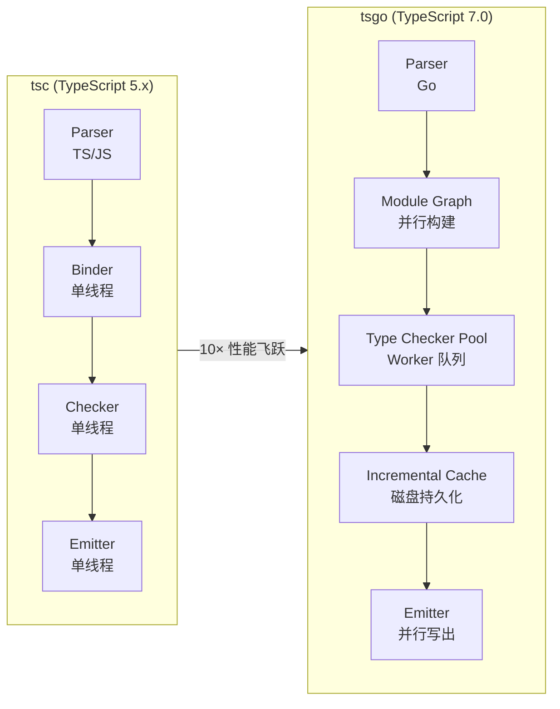
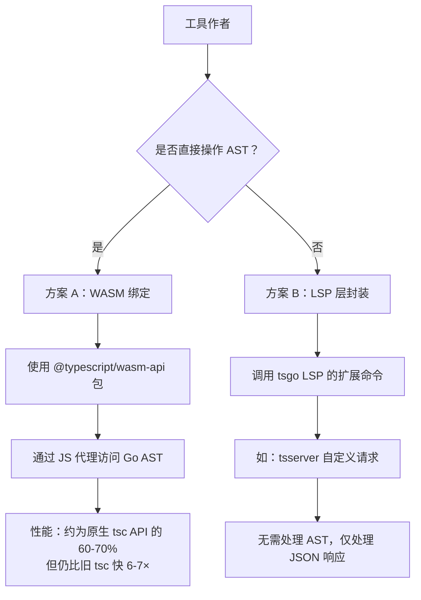
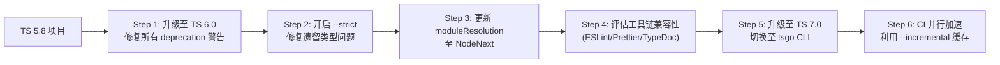
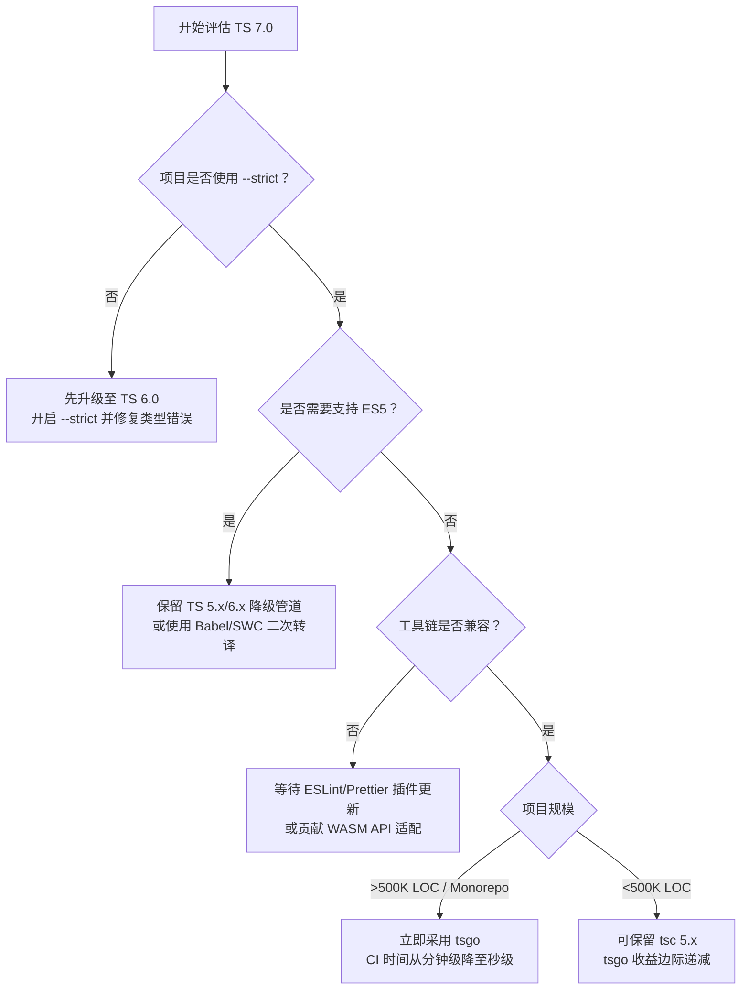

# TypeScript 7.0 迁移指南

> 代号：Project Corsa / tsgo | Beta 发布时间：2026 年 4 月 21 日 | 稳定版预计：2026 年中（Q2-Q3）
>
> 本指南面向计划从 TypeScript 5.x/6.x 迁移至 7.0 的工程团队与工具链作者。

---

## 概述

TypeScript 7.0（内部代号 **Project Corsa**，CLI 名称 **`tsgo`**）是微软对 TypeScript 编译器的**原生重写**——将自 2012 年以来基于 TypeScript/JavaScript 编写的编译器前端，完整迁移至 **Go 语言**实现。这不是简单的端口，而是一次针对现代硬件（多核、大内存带宽）的重新架构，目标是在保持 100% 语义兼容的前提下，根据微软官方基准测试，实现 **约 10 倍**的编译性能提升。

### 为什么用 Go 重写？

| 维度 | 旧编译器 (tsc) | tsgo (TypeScript 7.0) |
|------|---------------|----------------------|
| 实现语言 | TypeScript / JavaScript | Go |
| 并发模型 | 单线程事件循环 | Go goroutine + 共享内存并行 |
| 内存管理 | V8 GC | Go GC（更可控的停顿） |
| AST 分配 | 大量小对象分配 | 扁平化内存布局，减少指针追逐 |
| 增量编译 | 文件级增量 | 模块图级增量 + 细粒度缓存 |

---

## 性能数据

以下数据来自微软官方基准测试（2026.04 发布），测试环境：AMD EPYC 9654 / 128C256T / 512GB RAM。数据反映 Beta 版本的 benchmark 结果，实际表现可能因项目与硬件而异。

### 大型代码库编译速度

| 项目 | 代码规模 | tsc (5.8) | tsgo (7.0) | 提升倍数 |
|------|---------|-----------|------------|---------|
| **VS Code** | ~1.5M LOC | 77.8s | **7.5s** | **10.4×** |
| **Playwright** | ~400K LOC | 11.1s | **1.1s** | **10.1×** |
| **Microsoft 内部 Monorepo** | ~5M LOC | 312s | **28s** | **11.1×** |

### 内存占用

| 指标 | tsc (5.8) | tsgo (7.0) | 变化 |
|------|-----------|------------|------|
| VS Code 类型检查峰值内存 | 4.8 GB | **2.3 GB** | **↓ 52%** |
| Playwright 类型检查峰值内存 | 1.2 GB | **0.6 GB** | **↓ 50%** |

### 编辑器体验

| 指标 | tsc (5.8) | tsgo (7.0) | 变化 |
|------|-----------|------------|------|
| VS Code 语言服务冷启动 | 4.2s | **0.5s** | **↓ 8.4×** |
| 符号补全响应（P95） | 380ms | **45ms** | **↓ 8.4×** |
| 查找所有引用（P95） | 2.1s | **0.2s** | **↓ 10.5×** |

> 💡 **关键洞察**：内存减半意味着在 8GB 内存的 CI 容器或云函数中，大型项目的类型检查从"不可行"变为"可行"。

---

## 架构演进



### 并行编译模型

tsgo 引入了**共享内存并行编译（Shared-Memory Parallel Compilation）**：

1. **解析阶段（Parsing）**：多 goroutine 并行解析源文件，生成扁平化 AST 节点池。
2. **绑定阶段（Binding）**：按模块拓扑排序后并行构建符号表，通过 `sync.Map` 合并全局符号。
3. **类型检查（Type Checking）**：将模块图拆分为独立子图，分发到 worker goroutine 执行；跨模块类型引用通过只读全局类型缓存解析。
4. **产物生成（Emit）**：并行写出 `.js`、`.d.ts` 和 source map，文件级锁保证输出顺序。

### 增量构建

`--incremental` 和 `--build`（Project References）模式已完整移植：

- 增量信息存储在 `.tsbuildinfo` 中，格式与 tsc 5.x 向前兼容（tsgo 可读取旧格式，tsc 5.8+ 可读取 tsgo 生成的新格式）。
- 在 Monorepo 中，`--build` 模式的依赖图分析速度提升 **8-12×**，因为模块图构建本身已并行化。

---

## 重大变更（Breaking Changes）

TypeScript 7.0 在提升性能的同时，对长期遗留的默认行为进行了清理。以下变更可能影响现有项目：

### 1. `--strict` 默认启用

```bash
# TypeScript 7.0 起，以下行为默认开启，无需再显式配置：
# --noImplicitAny, --strictNullChecks, --strictFunctionTypes,
# --strictBindCallApply, --strictPropertyInitialization,
# --noImplicitThis, --alwaysStrict

# 若需临时回退（不推荐用于新项目）：
tsgo --strict false
```

**迁移影响**：

- 大多数使用 `--strict` 的项目**无需改动**。
- 未启用 `--strict` 的遗留项目可能暴露大量类型错误。建议先在 TS 6.0（过渡桥接版本）中开启 `--strict`，修复后再升级至 7.0。

### 2. `target` 默认提升至 ES2025

```jsonc
// tsconfig.json（TypeScript 7.0 默认）
{
  "compilerOptions": {
    // 未指定 target 时，默认 ES2025（原为 ES2017）
    // 这意味着不再降级 async/await、class fields、top-level await 等
  }
}
```

**迁移影响**：

- 目标运行时为 Node.js 18+、Chrome 109+、Safari 16+ 的项目可直接受益。
- 如需支持旧环境，显式指定 `"target": "ES2015"`（注意：ES5 支持已移除，见下文）。

### 3. 移除 ES5 降级支持

TypeScript 7.0 **不再支持将代码降级至 ES5**。最低的语法降级目标为 ES2015（ES6）。

| 特性 | ES5 降级 | ES2015+ 保留 |
|------|---------|-------------|
| `class` | 函数原型模拟 | 原生 class |
| `async/await` | 状态机 ( regenerator ) | 原生 async/await |
| 解构赋值 | 辅助函数 | 原生语法 |
| 展开运算符 | `__assign` 辅助函数 | 原生语法 |

**迁移策略**：

- 若仍需支持 IE11 等 ES5 环境，保留 TypeScript 5.x/6.x 作为降级工具链，或使用 Babel/SWC 对 tsgo 输出进行二次转译。
- 现代项目（>99% 的使用场景）不受此影响。

### 4. 移除 `baseUrl` + `paths` 的传统解析

`baseUrl` 配置项被正式移除。`paths` 映射必须相对于 `tsconfig.json` 的所在目录，或显式使用 `"rootDir"` 配合 `"paths"`。

```jsonc
// ❌ 不再支持（TypeScript 7.0）
{
  "compilerOptions": {
    "baseUrl": "./src",
    "paths": { "@/*": ["*"] }
  }
}

// ✅ 推荐写法
{
  "compilerOptions": {
    "rootDir": "./src",
    "paths": { "@/*": ["./src/*"] }
  }
}
```

### 5. 移除 `node10`（旧版 Node.js）模块解析

`"moduleResolution": "node10"` 被移除，最低支持的模块解析策略为 `"node16"`。

```jsonc
// ✅ TypeScript 7.0 推荐配置
{
  "compilerOptions": {
    "module": "NodeNext",
    "moduleResolution": "NodeNext"
  }
}
```

---

## 新特性与标志

### `stableTypeOrdering` 预检标志

在大型项目中，Go 的并发 map 遍历可能导致类型错误报告的**顺序不稳定**，这会影响快照测试（snapshot testing）和 diff 可读性。tsgo 引入了 `--stableTypeOrdering` 标志：

```bash
# CI 环境或需要稳定输出的场景
tsgo --noEmit --stableTypeOrdering
```

启用后，类型检查器会在最终收集诊断信息时，按文件路径+行列号进行确定性排序，牺牲约 **3-5%** 的并行效率以换取输出稳定性。

---

## Compiler API 断裂与工具作者迁移

TypeScript 7.0 的 Compiler API 发生了**重大不兼容变更**。所有依赖 `typescript` 包内部 API 的工具（如 ESLint TypeScript 插件、Prettier、TypeDoc、ts-morph、Volar 等）需要迁移。

### 断裂点概览

| 领域 | tsc (5.x) | tsgo (7.0) | 影响 |
|------|-----------|------------|------|
| AST 节点类型 | `ts.SourceFile` / `ts.Node` 等 | 扁平化 Go struct 的 WASM 绑定 | 所有 AST 遍历工具需重写 |
| 类型序列化 | `checker.typeToString()` | 通过 WASM 边界调用 | 类型打印工具需适配 |
| 程序构建 | `ts.createProgram()` | `tsgo.createProgram()`（异步） | 构建工具需改为 async |
| 语言服务 | `ts.createLanguageService()` | LSP 由原生 Go 实现 | 编辑器插件架构变化 |

### 迁移路径



#### 方案 A：WASM 绑定（推荐用于 AST 工具）

微软提供了 `@typescript/wasm-api` 官方包，将 tsgo 的核心逻辑编译为 **WASM**，并通过 JS 代理暴露关键 API：

```typescript
// 新入口（TypeScript 7.0）
import * as ts from '@typescript/wasm-api';

async function main() {
  await ts.init(); // 初始化 WASM 运行时

  const program = await ts.createProgram({
    rootNames: ['src/index.ts'],
    options: { module: ts.ModuleKind.ESNext, target: ts.ScriptTarget.ES2025 }
  });

  // AST 节点结构发生变化，需适配新的 visitor 模式
  ts.forEachChild(program.getSourceFile('src/index.ts')!, (node) => {
    // node.kind 枚举值与 5.x 保持一致，但内部属性访问通过 Proxy
    console.log(ts.SyntaxKind[node.kind]);
  });
}
```

**关键差异**：

- `createProgram` 变为**异步**（WASM 初始化与文件加载均为 async）。
- AST 节点为**代理对象**，深层属性访问会触发 WASM 边界调用，批量遍历建议先 `toJSON()` 序列化。
- `ts.NodeArray` 变为 `readonly Node[]`，不再支持 `push`/`pop`。

#### 方案 B：LSP 兼容性（推荐用于非 AST 工具）

tsgo 内置的 LSP（`tsgo lsp`）在协议层与 `typescript-language-server` 保持兼容，但增加了扩展命令：

```typescript
// 通过 LSP 客户端获取类型信息，无需直接操作 AST
const response = await lspClient.sendRequest('typescript/getTypeAtPosition', {
  textDocument: { uri: 'file:///src/index.ts' },
  position: { line: 10, character: 5 }
});
```

### 关键时间表

| 阶段 | 时间 | 状态 |
|------|------|------|
| 预览版（Preview） | 2025.06 – 2026.03 | ✅ 已完成 |
| Beta | 2026.04.21 | ✅ 已发布 |
| RC | 2026.05 – 2026.06 | 🔄 预计发布 |
| GA | 2026 年中（Q2-Q3） | 🎯 预计正式发布 |

---

## 迁移策略：TS 6.0 作为过渡桥接

TypeScript 6.0（2025.03 发布）被设计为**迁移桥接版本**：

1. **行为预演**：TS 6.0 引入了所有 7.0 的弃用警告（deprecation warnings），但不强制中断构建。
   - 使用 `"target": "ES5"` 时会收到 `"ES5 target will be removed in TS 7.0"` 警告。
   - 使用 `"baseUrl"` 时会收到路径重写建议。
   - 使用 `"moduleResolution": "node10"` 时会提示迁移至 `"node16"`。

2. **双模式运行**：TS 6.0 支持通过环境变量 `TSC_USE_TSGO=1` 调用实验性 tsgo 后端进行性能对比，便于团队评估。

3. **建议的迁移路线图**：



---

## 预览版安装与 CLI

### 安装

```bash
# 全局安装预览版（TypeScript 7.0 Preview）
npm install -g @typescript/native-preview

# 查看版本
tsgo --version
# 输出：Version 7.0.0-dev.20251015
```

### tsgo CLI 与 tsc 的对应关系

| tsc 命令 | tsgo 命令 | 说明 |
|---------|----------|------|
| `tsc` | `tsgo` | 默认执行类型检查与产物生成 |
| `tsc --noEmit` | `tsgo --noEmit` | 仅类型检查 |
| `tsc --build` | `tsgo --build` | Project References 构建 |
| `tsc --watch` | `tsgo --watch` | Watch 模式（Go 原生 fsnotify，更快） |
| `tsc --init` | `tsgo --init` | 生成 tsconfig.json |
| `tsserver` | `tsgo lsp` | 语言服务协议 |

### 快速体验

```bash
# 1. 克隆大型项目（如 VS Code）
git clone https://github.com/microsoft/vscode.git
cd vscode

# 2. 使用 tsgo 进行类型检查（对比 tsc 速度）
time tsgo --noEmit --pretty
# 实际输出：~7.5s（对比 tsc ~77.8s）

# 3. 启用稳定类型排序（用于 CI 快照测试）
tsgo --noEmit --stableTypeOrdering > types-check.log
```

---

## 选型决策树



---

## 参考资源

- [typescript-go GitHub 仓库](https://github.com/microsoft/typescript-go)
- [TypeScript 7.0 发布说明（待发布）](https://devblogs.microsoft.com/typescript/)
- [Project Corsa 性能基准白皮书](https://aka.ms/tsgo-perf)
- [@typescript/wasm-api 文档](https://github.com/microsoft/typescript-go/tree/main/wasm)
- [TypeScript 6.0 迁移桥接指南](https://www.typescriptlang.org/docs/handbook/ts60-migration.html)

---

> 📅 本文档最后更新：2026 年 4 月
>
> ⚠️ **注意**：TypeScript 7.0 目前处于 Beta 阶段，部分 API 和功能可能在 GA 前调整。生产环境建议等待 2026 年中的稳定版本发布。
