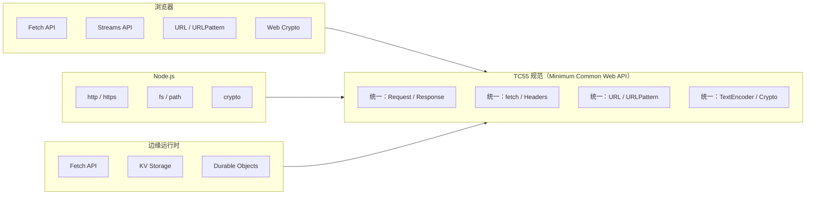
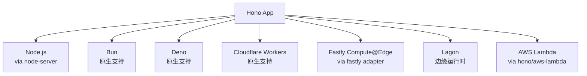
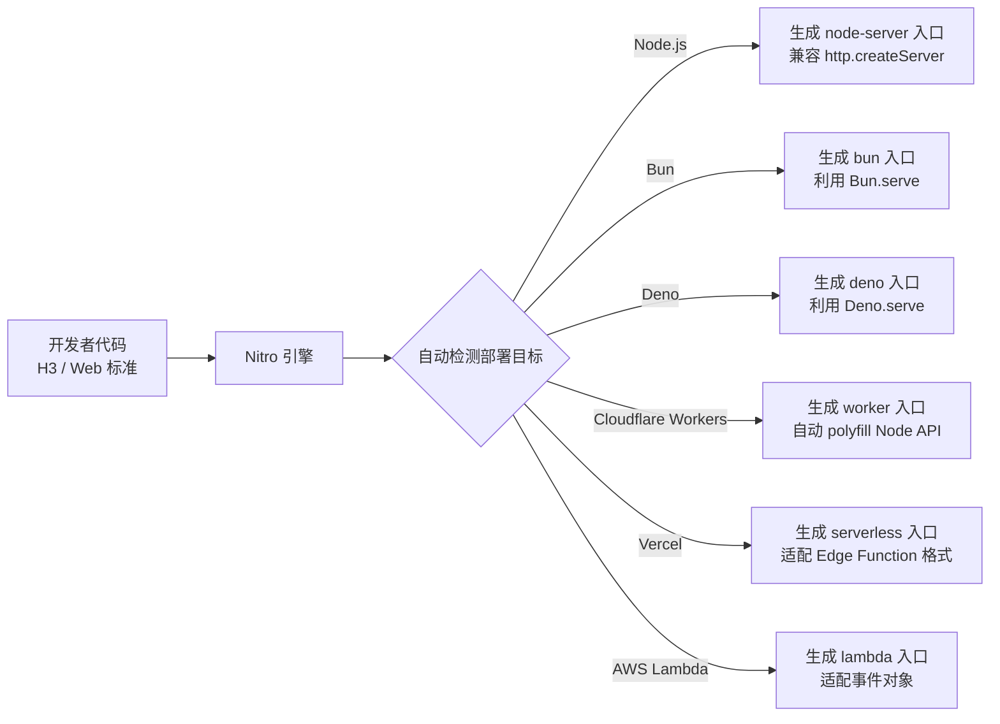
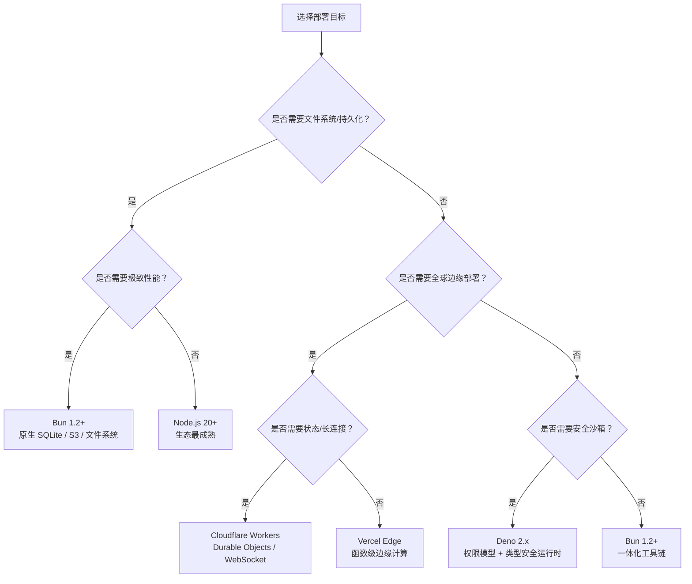

# WinterTC / TC55 运行时互操作指南

> WinterTC（原 WinterCG）→ Ecma TC55 | Minimum Common Web API GA：2025 年 12 月
>
> 本指南梳理 JavaScript 运行时标准化进程，以及如何在多运行时环境中编写可移植的服务端代码。

---

## 概述

JavaScript 已从浏览器脚本语言演变为**通用运行时（Universal Runtime）**，覆盖浏览器、服务器（Node.js）、边缘（Cloudflare Workers / Vercel Edge / Deno Deploy）及嵌入式设备。然而，各运行时的 API 表面长期存在差异：`fetch` 在 Node.js 18+ 才原生可用，`Deno` 拥有独有的权限模型，`Bun` 提供 `Bun.file()` 等便捷 API。

**WinterTC**（前身为 WinterCG，W3C Web-interoperable Runtimes Community Group）致力于解决这一碎片化问题。2024 年 12 月，该组织正式升级为 **Ecma International Technical Committee 55（TC55）**，成为与 TC39（ECMAScript 语言规范）平行的标准化委员会。

### 标准化目标



**核心目标**：定义一组**最小公共 Web API（Minimum Common Web API）**，确保同一份代码在不同运行时中具有可预测的行为，无需条件编译或运行时检测。

---

## Minimum Common Web API 规范（2025.12 GA）

TC55 规范第一版（2025 年 12 月 ECMA GA 发布）确立了以下 API 的最小公共子集：

### 已纳入规范的 API

| API 类别 | 具体接口 | 状态 | 备注 |
|---------|---------|------|------|
| **HTTP / Fetch** | `fetch`, `Request`, `Response`, `Headers`, `FormData` | ✅ 已纳入 | 所有运行时必须原生支持 |
| **Streams** | `ReadableStream`, `WritableStream`, `TransformStream` | ✅ 已纳入 | 包括 BYOB reader 支持 |
| **URL** | `URL`, `URLSearchParams`, `URLPattern` | ✅ 已纳入 | `URLPattern` 从 Chrome 95+ 下沉为通用标准 |
| **Encoding** | `TextEncoder`, `TextDecoder` | ✅ 已纳入 | 含 `stream` 模式 |
| **Crypto** | `crypto.subtle` (Web Crypto) | ✅ 已纳入 | 覆盖对称/非对称加密、哈希、随机数 |
| **Timers** | `setTimeout`, `setInterval`, `queueMicrotask` | ✅ 已纳入 | 行为与浏览器一致 |
| **Structured Clone** | `structuredClone` | ✅ 已纳入 | 跨上下文数据序列化 |
| **Console** | `console` 对象 | ✅ 已纳入 | 输出格式标准化 |
| **Abort** | `AbortController`, `AbortSignal` | ✅ 已纳入 | 含 `AbortSignal.timeout` |
| **WebAssembly** | `WebAssembly` 全局对象 | ✅ 已纳入 | 运行时必须支持 WASM 实例化 |

### 明确排除的 API（运行时特定）

| API | 原因 | 替代策略 |
|-----|------|---------|
| `fs`（Node.js 文件系统） | 边缘运行时不具备持久文件系统 | 使用 `fetch` + 存储服务，或运行时特定适配层 |
| `process`（Node.js） | 非浏览器概念 | 使用 `import.meta.env` 或环境变量抽象 |
| `Deno` 命名空间 | Deno 特定 | 通过 `import` 条件或适配库隔离 |
| `Bun` 特定 API（`Bun.file`, `Bun.write`） | Bun 特定 | 使用标准 `fetch` + `Response` 或 Nitro 适配 |

---

## 多运行时框架生态

### Hono：WinterTC 世界的 Express

[Hono](https://hono.dev)（日语「炎」，意为火焰）是一个基于 **Web 标准 Request / Response** 的极速、轻量 Web 框架，被称为"WinterTC 世界的 Express"。

#### 多运行时支持



| 运行时 | 适配方式 | 启动延迟 | 适用场景 |
|--------|---------|---------|---------|
| **Node.js** | `hono/node-server` | ~20ms | 传统服务器、容器 |
| **Bun** | 原生 | ~5ms | 高性能全栈服务 |
| **Deno** | 原生 | ~10ms | 安全沙箱环境 |
| **Cloudflare Workers** | 原生 | ~0ms（冷启动） | 边缘计算、全球分发 |
| **Fastly Compute@Edge** | `@hono/fastly` | ~0ms（冷启动） | 超低延迟边缘逻辑 |
| **AWS Lambda** | `@hono/aws-lambda` | ~50ms | 无服务器事件响应 |

#### 核心设计哲学

```typescript
// Hono 的 API 设计刻意模仿 Express，但完全基于 Web 标准
import { Hono } from 'hono';

const app = new Hono();

// 标准 Request / Response，无任何运行时假设
app.get('/api/user/:id', async (c) => {
  const id = c.req.param('id');

  // c.req.raw 是原生 Request 对象
  // c.json() 返回标准 Response
  return c.json({ id, runtime: c.req.header('x-runtime') ?? 'unknown' });
});

// 导出供任何 WinterTC 兼容运行时消费
export default app;
```

**关键特性**：

- **零依赖**：核心包仅 ~14KB（gzip），无 Node.js 特定模块。
- **中间件兼容**：与 Express 风格的 `app.use()` 中间件模式兼容，但基于标准 `Request`/`Response`。
- **类型安全**：完整的 TypeScript 类型推断，包括路径参数和查询参数。
- **边缘优化**：在 Cloudflare Workers 中无需任何 polyfill，直接利用 V8 isolate 的 fetch 实现。

### Nitro (UnJS)：统一部署适配层

[Nitro](https://nitro.unjs.io) 是 UnJS 生态的**通用服务端引擎**，也是 Nuxt 3 的底层核心。它在 Hono 的"同构应用"理念上更进一步：提供**自动 polyfill 和部署目标适配**，让开发者编写一次代码，自动部署到任意平台。

#### 架构原理



#### 自动 Polyfill 策略

```typescript
// 开发者可安全使用部分 Node.js API，Nitro 会自动注入 polyfill
// nitro.config.ts
export default defineNitroConfig({
  // 显式声明需要 polyfill 的 Node 模块
  experimental: {
    wasm: true,           // 自动处理 .wasm 导入
    asyncContext: true,   // AsyncLocalStorage 跨运行时兼容
  },
  // 部署目标自动推断（也可显式指定）
  preset: 'cloudflare-pages' // 或 'node-server', 'deno', 'bun'
});
```

**关键特性**：

- **存储抽象层**：`useStorage()` 统一访问 KV、Redis、FS、内存存储，运行时自动选择最优实现。
- **任务系统**：`defineTask()` 定义后台任务，在支持 Scheduled Functions 的平台（Cloudflare Workers / Vercel Cron）自动注册。
- **打包优化**：自动分析依赖，将服务端代码树摇（tree-shake）至最小体积，边缘部署包体积通常 <500KB。

---

## 运行时现状与兼容性（2026.04）

### Bun 1.2+

Bun 在 1.2 版本中达到了**生产就绪**里程碑：

| 指标 | 数据 |
|------|------|
| npm 兼容率 | **98%** |
| 冷启动时间 | **8-15ms** |
| 内置功能 | S3 原生客户端、SQLite（`bun:sqlite`）、HTML 模板引擎 |

**限制**：

- 约 **2% 的 native addon**（Node-API / C++ 扩展）不兼容，主要涉及：
  - 依赖 `libuv` 特定行为的模块（如某些自定义事件循环集成）。
  - 硬编码 V8 API 的 C++ 扩展（如早期版本的 `sharp` 图像处理库）。
- 迁移建议：优先检查 `package.json` 中是否包含 `node-gyp` 构建依赖。

```typescript
// Bun 1.2+ 原生 S3 支持示例
import { S3Client } from 'bun:aws';

const s3 = new S3Client({
  bucket: 'my-bucket',
  region: 'us-east-1'
});

const obj = await s3.get('data.json');
const data = await obj.json();
```

### Deno 2.x

Deno 2.x 大幅提升了 **Node.js 兼容性**，同时保留了安全优先的设计：

| 特性 | Deno 2.x 状态 |
|------|--------------|
| `npm:` 前缀 | ✅ 原生支持，可直接导入 98%+ 的 npm 包 |
| `node:` 前缀 | ✅ 完整兼容，无需 Deno 特定替代 |
| `package.json` | ✅ 自动识别并解析依赖 |
| 权限模型 | `--allow-read`, `--allow-net` 等细粒度控制，2.x 引入**宽松模式**（`--unstable-permissions` 简化配置） |
| WinterTC 合规 | ✅ 100% 通过 Minimum Common Web API 测试套件 |

```bash
# Deno 2.x 运行 Node 项目（无需修改代码）
deno run --allow-read --allow-net --allow-env npm:express-server

# 或使用新的宽松模式（开发环境）
deno run --unstable-permissions npm:express-server
```

---

## ECMAScript 模块提案前沿

### `import defer`（ES2026 Stage 3）

**延迟模块求值（Deferred Module Evaluation）** 允许模块在导入时不立即执行顶层代码，直到首次访问其导出：

```typescript
// 传统 import：模块立即执行，可能阻塞启动
import { heavyComputation } from './analytics';

// import defer：模块在首次访问时才初始化
import defer { heavyComputation } from './analytics';

console.log('App started'); // 此时 analytics.js 尚未执行
heavyComputation();          // 首次调用时才触发模块求值
```

**WinterTC 意义**：边缘函数（如 Cloudflare Workers）的启动时间至关重要。`import defer` 允许将非关键路径的模块（如错误上报、分析统计）推迟到首次请求时才加载，显著降低**冷启动（cold start）**时间。

**当前支持**：

- TypeScript 6.0+ 已支持类型检查（`"module": "ES2026"`）。
- V8 引擎（Chrome / Node.js / Edge）实现中，预计 2026 年下半年可用。
- Babel/SWC 转译支持正在开发中（需将 `import defer` 降级为动态 `import()` 模拟）。

### `import bytes`（Stage 2.7）

**二进制文件导入** 提案允许在 ESM 中直接导入任意文件为 `Uint8Array`：

```typescript
// 导入 WASM 模块二进制（无需 fetch 或 fs.readFile）
import bytes wasmModule from './module.wasm';

// wasmModule: Uint8Array
const module = await WebAssembly.instantiate(wasmModule, imports);

// 同样适用于图片、字体、配置文件等
import bytes logo from './logo.png';
// logo: Uint8Array，可直接用于 Response
return new Response(logo, { headers: { 'Content-Type': 'image/png' } });
```

**WinterTC 意义**：

- 边缘运行时没有文件系统，`import bytes` 使打包器能将静态资源内联为模块依赖，运行时直接通过模块图获取。
- 与 Nitro 等工具的 `assets` 处理结合，可实现零配置的资源内联与分发。

**当前状态**：

- Stage 2.7（TC39，2025.10），语法细节仍在讨论中（`import bytes` vs `import source`）。
- 预计进入 ES2027 或 ES2028。
- 当前可通过打包器（Vite / Rollup / esbuild 的 `?inline` / `?raw` 导入）模拟类似行为。

---

## 工程实践：编写 WinterTC 兼容代码

### 可移植性检查清单

```typescript
// ✅ 推荐：使用 Web 标准 API
export const handler = async (request: Request): Promise<Response> => {
  const url = new URL(request.url);
  const pattern = new URLPattern({ pathname: '/api/:id' });
  const match = pattern.exec(url);

  if (!match) return new Response('Not Found', { status: 404 });

  const id = match.pathname.groups.id;
  const data = await fetch(`https://api.example.com/items/${id}`);
  return new Response(data.body, { headers: data.headers });
};

// ❌ 避免：运行时特定 API
export const handler = (req, res) => {          // Node.js http 风格
  const fs = require('fs');                     // CommonJS
  const data = fs.readFileSync('./config.json'); // 文件系统假设
  res.end(data);                                // Node 特定的响应对象
};
```

### 条件导出与多运行时支持

```jsonc
// package.json
{
  "exports": {
    ".": {
      // 标准 WinterTC 入口（Hono / 标准 Request-Response）
      "default": "./src/index.ts",

      // Node.js 特定优化（如使用 http.createServer）
      "node": "./src/adapters/node.ts",

      // Bun 特定优化（如使用 Bun.serve）
      "bun": "./src/adapters/bun.ts"
    }
  }
}
```

### 部署目标选择决策树



---

## 参考资源

- [WinterTC / TC55 官方站点](https://wintertc.org/)
- [Minimum Common Web API 规范草案](https://tc55.org/specs/minimum-common-api/)
- [Hono 官方文档](https://hono.dev/)
- [Nitro 官方文档](https://nitro.unjs.io/)
- [Bun 1.2 发布说明](https://bun.sh/blog/bun-v1.2)
- [Deno 2.x 手册](https://docs.deno.com/)
- [TC39 `import defer` 提案](https://github.com/tc39/proposal-defer-import-evaluation)
- [TC39 `import bytes` 提案](https://github.com/tc39/proposal-import-attributes)

---

> 📅 本文档最后更新：2026 年 4 月
>
> 🔄 **动态更新提示**：WinterTC 规范正在快速迭代，建议关注 [tc55.org](https://tc55.org/) 获取最新 API 清单。
