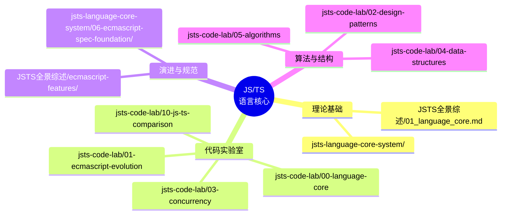

# JavaScript / TypeScript 语言核心总索引

> 语言核心（Language Core）单一入口：语法、类型系统、变量系统、控制流、执行模型、执行流程、ECMAScript 规范、模块系统、对象模型、原型链、异步编程、错误处理等。
>
> 对齐版本：ECMAScript 2025 (ES16) | TypeScript 5.8–6.0 | TS 7.0 Go 编译器预览

---

## 📋 目录

- [JavaScript / TypeScript 语言核心总索引](#javascript--typescript-语言核心总索引)
  - [📋 目录](#-目录)
  - [🗺️ 文档全景图](#️-文档全景图)
  - [📚 按主题分类索引](#-按主题分类索引)
    - [类型系统 (Type System)](#类型系统-type-system)
    - [变量系统 (Variable System)](#变量系统-variable-system)
    - [控制流 (Control Flow)](#控制流-control-flow)
    - [执行模型 (Execution Model)](#执行模型-execution-model)
    - [执行流 (Execution Flow)](#执行流-execution-flow)
    - [模块系统 (Module System)](#模块系统-module-system)
    - [对象模型与原型链 (Object Model \& Prototype)](#对象模型与原型链-object-model--prototype)
    - [异步编程 (Asynchronous Programming)](#异步编程-asynchronous-programming)
    - [ECMAScript 演进与规范](#ecmascript-演进与规范)
    - [JavaScript / TypeScript 对比](#javascript--typescript-对比)
    - [设计模式与算法基础](#设计模式与算法基础)
  - [🛤️ 学习路径推荐](#️-学习路径推荐)
    - [路径 A：入门 → 进阶（应用开发者）](#路径-a入门--进阶应用开发者)
    - [路径 B：进阶 → 深入（高级开发者）](#路径-b进阶--深入高级开发者)
    - [路径 C：深入规范（研究员 / 编译器工程师）](#路径-c深入规范研究员--编译器工程师)
  - [🔗 快速链接](#-快速链接)
  - [📝 更新日志](#-更新日志)

---

## 🗺️ 文档全景图



---

## 📚 按主题分类索引

### 类型系统 (Type System)

> 涵盖 TypeScript 静态类型系统的全部维度：从基础类型到条件类型、泛型、型变与类型健全性。

| 文档 | 来源 | 说明 |
|------|------|------|
| [jsts-language-core-system/01-type-system/README.md](../jsts-language-core-system/01-type-system/README.md) | 深度系统 | 类型系统总览与导航 |
| [01-foundations.md](../jsts-language-core-system/01-type-system/01-foundations.md) | 深度系统 | 基础类型与类型推断 |
| [02-type-inference-annotations.md](../jsts-language-core-system/01-type-system/02-type-inference-annotations.md) | 深度系统 | 类型推断与显式注解 |
| [03-interfaces-vs-type-aliases.md](../jsts-language-core-system/01-type-system/03-interfaces-vs-type-aliases.md) | 深度系统 | 接口与类型别名语义差异 |
| [04-unions-intersections.md](../jsts-language-core-system/01-type-system/04-unions-intersections.md) | 深度系统 | 联合类型与交叉类型 |
| [05-narrowing-guards.md](../jsts-language-core-system/01-type-system/05-narrowing-guards.md) | 深度系统 | 类型收窄与类型守卫 |
| [06-generics-deep-dive.md](../jsts-language-core-system/01-type-system/06-generics-deep-dive.md) | 深度系统 | 泛型深度解析 |
| [08-conditional-types.md](../jsts-language-core-system/01-type-system/08-conditional-types.md) | 深度系统 | 条件类型 |
| [10-utility-types-patterns.md](../jsts-language-core-system/01-type-system/10-utility-types-patterns.md) | 深度系统 | 工具类型与模式 |
| [12-variance.md](../jsts-language-core-system/01-type-system/12-variance.md) | 深度系统 | 型变（协变/逆变/双变/不变） |
| [13-structural-vs-nominal.md](../jsts-language-core-system/01-type-system/13-structural-vs-nominal.md) | 深度系统 | 结构化类型 vs 名义类型 |
| [14-type-soundness-boundary.md](../jsts-language-core-system/01-type-system/14-type-soundness-boundary.md) | 深度系统 | 类型健全性边界 |
| [JSTS全景综述/GRADUAL_TYPING_THEORY.md](../30-knowledge-base/30.8-research/tsjs-stack-panorama-2026/GRADUAL_TYPING_THEORY.md) | 全景综述 | 渐进类型理论 |
| [JSTS全景综述/TYPE_SOUNDNESS_ANALYSIS.md](../30-knowledge-base/30.8-research/tsjs-stack-panorama-2026/TYPE_SOUNDNESS_ANALYSIS.md) | 全景综述 | 类型健全性分析 |

### 变量系统 (Variable System)

> var / let / const、作用域链、词法环境、闭包、提升、TDZ、解构。

| 文档 | 来源 | 说明 |
|------|------|------|
| [jsts-language-core-system/02-variable-system/README.md](../jsts-language-core-system/02-variable-system/README.md) | 深度系统 | 变量系统总览 |
| [01-var-let-const.md](../jsts-language-core-system/02-variable-system/01-var-let-const.md) | 深度系统 | 三种声明的语义差异 |
| [02-hoisting.md](../jsts-language-core-system/02-variable-system/02-hoisting.md) | 深度系统 | 提升机制 |
| [03-temporal-dead-zone.md](../jsts-language-core-system/02-variable-system/03-temporal-dead-zone.md) | 深度系统 | 暂时性死区 (TDZ) |
| [04-scope-chain.md](../jsts-language-core-system/02-variable-system/04-scope-chain.md) | 深度系统 | 作用域链 |
| [05-lexical-environment.md](../jsts-language-core-system/02-variable-system/05-lexical-environment.md) | 深度系统 | 词法环境 |
| [06-closure-deep-dive.md](../jsts-language-core-system/02-variable-system/06-closure-deep-dive.md) | 深度系统 | 闭包深度解析 |
| [07-global-object.md](../jsts-language-core-system/02-variable-system/07-global-object.md) | 深度系统 | 全局对象 |
| [08-symbol-private-state.md](../jsts-language-core-system/02-variable-system/08-symbol-private-state.md) | 深度系统 | Symbol 与私有状态 |
| [09-destructuring-rest-spread.md](../jsts-language-core-system/02-variable-system/09-destructuring-rest-spread.md) | 深度系统 | 解构、剩余与展开 |

### 控制流 (Control Flow)

> 条件、循环、异常、生成器、异步控制、显式资源管理、模式匹配前瞻。

| 文档 | 来源 | 说明 |
|------|------|------|
| [jsts-language-core-system/03-control-flow/README.md](../jsts-language-core-system/03-control-flow/README.md) | 深度系统 | 控制流总览 |
| [01-conditional-statements.md](../jsts-language-core-system/03-control-flow/01-conditional-statements.md) | 深度系统 | 条件语句 |
| [02-loop-iterations.md](../jsts-language-core-system/03-control-flow/02-loop-iterations.md) | 深度系统 | 循环与迭代 |
| [03-exception-handling.md](../jsts-language-core-system/03-control-flow/03-exception-handling.md) | 深度系统 | 异常处理 |
| [04-short-circuit-logical.md](../jsts-language-core-system/03-control-flow/04-short-circuit-logical.md) | 深度系统 | 短路逻辑 |
| [05-nullish-optional-chaining.md](../jsts-language-core-system/03-control-flow/05-nullish-optional-chaining.md) | 深度系统 | 空值合并与可选链 |
| [06-generator-iterator-control.md](../jsts-language-core-system/03-control-flow/06-generator-iterator-control.md) | 深度系统 | 生成器与迭代器控制 |
| [07-async-control-flow.md](../jsts-language-core-system/03-control-flow/07-async-control-flow.md) | 深度系统 | 异步控制流 |
| [08-using-explicit-resource.md](../jsts-language-core-system/03-control-flow/08-using-explicit-resource.md) | 深度系统 | `using` 显式资源管理 |
| [09-pattern-matching-future.md](../jsts-language-core-system/03-control-flow/09-pattern-matching-future.md) | 深度系统 | 模式匹配前瞻 |

### 执行模型 (Execution Model)

> V8 引擎架构、调用栈、执行上下文、this 绑定、事件循环、内存管理、Agent / Realm。

| 文档 | 来源 | 说明 |
|------|------|------|
| [jsts-language-core-system/04-execution-model/README.md](../jsts-language-core-system/04-execution-model/README.md) | 深度系统 | 执行模型总览 |
| [01-engine-architecture.md](../jsts-language-core-system/04-execution-model/01-engine-architecture.md) | 深度系统 | 引擎架构 |
| [02-compilation-vs-execution.md](../jsts-language-core-system/04-execution-model/02-compilation-vs-execution.md) | 深度系统 | 编译 vs 执行阶段 |
| [03-call-stack.md](../jsts-language-core-system/04-execution-model/03-call-stack.md) | 深度系统 | 调用栈 |
| [04-execution-context.md](../jsts-language-core-system/04-execution-model/04-execution-context.md) | 深度系统 | 执行上下文 |
| [05-lexical-environment-variable.md](../jsts-language-core-system/04-execution-model/05-lexical-environment-variable.md) | 深度系统 | 词法环境与变量对象 |
| [06-this-binding.md](../jsts-language-core-system/04-execution-model/06-this-binding.md) | 深度系统 | this 绑定规则 |
| [07-event-loop-browser.md](../jsts-language-core-system/04-execution-model/07-event-loop-browser.md) | 深度系统 | 浏览器事件循环 |
| [08-event-loop-nodejs.md](../jsts-language-core-system/04-execution-model/08-event-loop-nodejs.md) | 深度系统 | Node.js 事件循环 |
| [09-task-microtask-queues.md](../jsts-language-core-system/04-execution-model/09-task-microtask-queues.md) | 深度系统 | Task / Microtask 队列 |
| [11-memory-management-gc.md](../jsts-language-core-system/04-execution-model/11-memory-management-gc.md) | 深度系统 | 内存管理与垃圾回收 |
| [12-agent-realm-job-queue.md](../jsts-language-core-system/04-execution-model/12-agent-realm-job-queue.md) | 深度系统 | Agent、Realm 与 Job Queue |
| [JSTS全景综述/V8_RUNTIME_THEORY.md](../30-knowledge-base/30.8-research/tsjs-stack-panorama-2026/V8_RUNTIME_THEORY.md) | 全景综述 | V8 运行时形式化理论 |

### 执行流 (Execution Flow)

> 同步流、回调、Promise 执行语义、async/await 转换、顶层 await、事件循环经典题。

| 文档 | 来源 | 说明 |
|------|------|------|
| [jsts-language-core-system/05-execution-flow/README.md](../jsts-language-core-system/05-execution-flow/README.md) | 深度系统 | 执行流总览 |
| [01-synchronous-flow.md](../jsts-language-core-system/05-execution-flow/01-synchronous-flow.md) | 深度系统 | 同步执行流 |
| [02-callback-pattern.md](../jsts-language-core-system/05-execution-flow/02-callback-pattern.md) | 深度系统 | 回调模式 |
| [03-promise-execution-flow.md](../jsts-language-core-system/05-execution-flow/03-promise-execution-flow.md) | 深度系统 | Promise 执行语义 |
| [04-async-await-transformation.md](../jsts-language-core-system/05-execution-flow/04-async-await-transformation.md) | 深度系统 | async/await 转换机制 |
| [05-event-loop-quiz-patterns.md](../jsts-language-core-system/05-execution-flow/05-event-loop-quiz-patterns.md) | 深度系统 | 事件循环经典题 |
| [06-top-level-await.md](../jsts-language-core-system/05-execution-flow/06-top-level-await.md) | 深度系统 | 顶层 await |
| [jsts-code-lab/14-execution-flow/](../jsts-code-lab/14-execution-flow/) | 代码实验室 | 执行流可运行代码 |

### 模块系统 (Module System)

> ESM、CommonJS、互操作、模块解析算法、循环依赖、Import Attributes。

| 文档 | 来源 | 说明 |
|------|------|------|
| [jsts-language-core-system/08-module-system/README.md](../jsts-language-core-system/08-module-system/README.md) | 深度系统 | 模块系统总览 |
| [01-module-system-overview.md](../jsts-language-core-system/08-module-system/01-module-system-overview.md) | 深度系统 | 模块系统概述 |
| [02-esm-deep-dive.md](../jsts-language-core-system/08-module-system/02-esm-deep-dive.md) | 深度系统 | ESM 深度解析 |
| [03-commonjs-mechanics.md](../jsts-language-core-system/08-module-system/03-commonjs-mechanics.md) | 深度系统 | CommonJS 机制 |
| [04-cjs-esm-interop.md](../jsts-language-core-system/08-module-system/04-cjs-esm-interop.md) | 深度系统 | CJS/ESM 互操作 |
| [05-module-resolution.md](../jsts-language-core-system/08-module-system/05-module-resolution.md) | 深度系统 | 模块解析算法 |
| [06-cyclic-dependencies.md](../jsts-language-core-system/08-module-system/06-cyclic-dependencies.md) | 深度系统 | 循环依赖处理 |
| [JSTS全景综述/MODULE_RESOLUTION_SEMANTICS.md](../30-knowledge-base/30.8-research/tsjs-stack-panorama-2026/MODULE_RESOLUTION_SEMANTICS.md) | 全景综述 | 模块解析形式化语义 |
| [jsts-code-lab/00-language-core/06-modules/](../jsts-code-lab/00-language-core/06-modules/) | 代码实验室 | 模块可运行示例 |

### 对象模型与原型链 (Object Model & Prototype)

> 属性描述符、原型链、Proxy / Reflect、私有字段、对象创建模式、Hidden Class。

| 文档 | 来源 | 说明 |
|------|------|------|
| [jsts-language-core-system/09-object-model/README.md](../jsts-language-core-system/09-object-model/README.md) | 深度系统 | 对象模型总览 |
| [01-object-model-overview.md](../jsts-language-core-system/09-object-model/01-object-model-overview.md) | 深度系统 | 对象模型概述 |
| [02-prototype-chain.md](../jsts-language-core-system/09-object-model/02-prototype-chain.md) | 深度系统 | 原型链深度解析 |
| [03-proxy-and-reflect.md](../jsts-language-core-system/09-object-model/03-proxy-and-reflect.md) | 深度系统 | Proxy 与 Reflect |
| [04-private-fields.md](../jsts-language-core-system/09-object-model/04-private-fields.md) | 深度系统 | 私有字段 |
| [05-object-creation-patterns.md](../jsts-language-core-system/09-object-model/05-object-creation-patterns.md) | 深度系统 | 对象创建模式 |
| [jsts-code-lab/00-language-core/05-objects-classes/](../jsts-code-lab/00-language-core/05-objects-classes/) | 代码实验室 | 对象与类可运行示例 |

### 异步编程 (Asynchronous Programming)

> Promise、async/await、事件循环、Worker、Atomics、Streams。

| 文档 | 来源 | 说明 |
|------|------|------|
| [JSTS全景综述/04_concurrency.md](../30-knowledge-base/30.8-research/tsjs-stack-panorama-2026/04_concurrency.md) | 全景综述 | 并发模型全景 |
| [JSTS全景综述/CONCURRENCY_MODELS_DEEP_DIVE.md](../30-knowledge-base/30.8-research/tsjs-stack-panorama-2026/CONCURRENCY_MODELS_DEEP_DIVE.md) | 全景综述 | 并发模型深度分析 |
| [jsts-code-lab/03-concurrency/](../jsts-code-lab/03-concurrency/) | 代码实验室 | 并发与异步代码实验室 |
| [jsts-language-core-system/05-execution-flow/03-promise-execution-flow.md](../jsts-language-core-system/05-execution-flow/03-promise-execution-flow.md) | 深度系统 | Promise 执行语义 |
| [jsts-language-core-system/05-execution-flow/04-async-await-transformation.md](../jsts-language-core-system/05-execution-flow/04-async-await-transformation.md) | 深度系统 | async/await 转换 |

### ECMAScript 演进与规范

> 从 ES2020 到 ES2026 的特性演进、ECMA-262 规范基础、抽象操作、内部方法。

| 文档 | 来源 | 说明 |
|------|------|------|
| [JSTS全景综述/01_language_core.md](../30-knowledge-base/30.8-research/tsjs-stack-panorama-2026/01_language_core.md) | 全景综述 | 语言核心特性全览（ES2020–ES2026） |
| [JSTS全景综述/ES2026_FEATURES_PREVIEW.md](../30-knowledge-base/30.8-research/tsjs-stack-panorama-2026/ES2026_FEATURES_PREVIEW.md) | 全景综述 | ES2026 前瞻 |
| [JSTS全景综述/ecmascript-features/](../30-knowledge-base/30.8-research/tsjs-stack-panorama-2026/ecmascript-features/) | 全景综述 | 各版本 ECMAScript 特性深度文档 |
| [jsts-language-core-system/06-ecmascript-spec-foundation/README.md](../jsts-language-core-system/06-ecmascript-spec-foundation/README.md) | 深度系统 | 规范基础总览 |
| [01-abstract-operations.md](../jsts-language-core-system/06-ecmascript-spec-foundation/01-abstract-operations.md) | 深度系统 | 抽象操作 |
| [02-specification-types.md](../jsts-language-core-system/06-ecmascript-spec-foundation/02-specification-types.md) | 深度系统 | 规范类型 |
| [03-internal-methods-slots.md](../jsts-language-core-system/06-ecmascript-spec-foundation/03-internal-methods-slots.md) | 深度系统 | 内部方法与内部槽 |
| [04-completion-records.md](../jsts-language-core-system/06-ecmascript-spec-foundation/04-completion-records.md) | 深度系统 | Completion Records |
| [05-environment-records.md](../jsts-language-core-system/06-ecmascript-spec-foundation/05-environment-records.md) | 深度系统 | 环境记录 |
| [06-realm-and-global-object.md](../jsts-language-core-system/06-ecmascript-spec-foundation/06-realm-and-global-object.md) | 深度系统 | Realm 与全局对象 |
| [jsts-code-lab/01-ecmascript-evolution/](../jsts-code-lab/01-ecmascript-evolution/) | 代码实验室 | ECMAScript 演进代码示例 |

### JavaScript / TypeScript 对比

> 语法映射、语义模型、类型擦除、运行时差异、编译器 API。

| 文档 | 来源 | 说明 |
|------|------|------|
| [jsts-code-lab/10-js-ts-comparison/README.md](../jsts-code-lab/10-js-ts-comparison/README.md) | 代码实验室 | JS/TS 对比分析模块 |
| [jsts-language-core-system/07-js-ts-symmetric-difference/README.md](../jsts-language-core-system/07-js-ts-symmetric-difference/README.md) | 深度系统 | JS/TS 对称差 |
| [JSTS全景综述/JS_TO_TS_SYNTAX_SEMANTICS_MAPPING.md](../30-knowledge-base/30.8-research/tsjs-stack-panorama-2026/JS_TO_TS_SYNTAX_SEMANTICS_MAPPING.md) | 全景综述 | 语法语义映射 |
| [JSTS全景综述/JS_TS_语言语义模型全面分析.md](../30-knowledge-base/30.8-research/tsjs-stack-panorama-2026/JS_TS_语言语义模型全面分析.md) | 全景综述 | 语言语义模型全面分析 |

### 设计模式与算法基础

> 经典设计模式、数据结构、算法在 JS/TS 中的实现。

| 文档 | 来源 | 说明 |
|------|------|------|
| [jsts-code-lab/02-design-patterns/](../jsts-code-lab/02-design-patterns/) | 代码实验室 | 23 种设计模式实现 |
| [jsts-code-lab/04-data-structures/](../jsts-code-lab/04-data-structures/) | 代码实验室 | 数据结构实现与复杂度分析 |
| [jsts-code-lab/05-algorithms/](../jsts-code-lab/05-algorithms/) | 代码实验室 | 算法实现与优化 |
| [JSTS全景综述/03_design_patterns.md](../30-knowledge-base/30.8-research/tsjs-stack-panorama-2026/03_design_patterns.md) | 全景综述 | 设计模式全景 |
| [JSTS全景综述/DATA_STRUCTURES_ALGORITHMS_THEORY.md](../30-knowledge-base/30.8-research/tsjs-stack-panorama-2026/DATA_STRUCTURES_ALGORITHMS_THEORY.md) | 全景综述 | 数据结构与算法理论 |

---

## 🛤️ 学习路径推荐

### 路径 A：入门 → 进阶（应用开发者）

适合有基础 JS 经验、希望系统掌握语言核心以提升工程能力的开发者。

```
Step 1: jsts-code-lab/00-language-core/          → 语法、类型、函数、对象基础代码
Step 2: jsts-language-core-system/02-variable-system/  → 作用域、闭包、提升
Step 3: jsts-language-core-system/03-control-flow/     → 条件、循环、异常、生成器
Step 4: jsts-language-core-system/08-module-system/    → ESM / CommonJS 模块
Step 5: jsts-language-core-system/09-object-model/     → 原型链、Proxy、私有字段
Step 6: jsts-code-lab/03-concurrency/            → Promise、async/await、事件循环
```

### 路径 B：进阶 → 深入（高级开发者）

适合已熟悉日常开发、希望理解引擎行为与类型系统边界的高级开发者。

```
Step 1: jsts-language-core-system/01-type-system/      → 泛型、条件类型、型变、工具类型
Step 2: jsts-language-core-system/04-execution-model/  → V8、调用栈、执行上下文、GC
Step 3: jsts-language-core-system/05-execution-flow/   → Promise 语义、async/await 转换
Step 4: jsts-code-lab/10-js-ts-comparison/       → 类型擦除、运行时差异、编译器 API
Step 5: JSTS全景综述/01_language_core.md         → ES2020–ES2026 新特性系统梳理
Step 6: jsts-language-core-system/07-js-ts-symmetric-difference/ → JS-Only / TS-Only 边界
```

### 路径 C：深入规范（研究员 / 编译器工程师）

适合对编程语言理论、规范语义、编译器实现有深入研究兴趣的读者。

```
Step 1: jsts-language-core-system/06-ecmascript-spec-foundation/ → 抽象操作、规范类型、Completion Records
Step 2: jsts-language-core-system/04-execution-model/12-agent-realm-job-queue.md → Agent / Realm 模型
Step 3: JSTS全景综述/JS_TS_语言语义模型全面分析.md     → 形式化语义三层模型
Step 4: JSTS全景综述/FORMAL_SEMANTICS_COMPLETE.md       → 操作语义、指称语义、公理语义
Step 5: JSTS全景综述/GRADUAL_TYPING_THEORY.md           → 渐进类型系统数学理论
Step 6: JSTS全景综述/V8_RUNTIME_THEORY.md               → V8 形式化模型与 GC 正确性
```

---

## 🔗 快速链接

| 资源 | 链接 |
|------|------|
| **语言核心速查表** | [JS_LANGUAGE_CORE_CHEATSHEET.md](./cheatsheets/JS_LANGUAGE_CORE_CHEATSHEET.md) |
| **TypeScript 速查表** | [TYPESCRIPT_CHEATSHEET.md](./cheatsheets/TYPESCRIPT_CHEATSHEET.md) |
| **语言核心分类** | [categories/00-language-core.md](./categories/00-language-core.md) |
| **全景综述总索引** | [JSTS全景综述/00_总索引与导航.md](../30-knowledge-base/30.8-research/tsjs-stack-panorama-2026/00_总索引与导航.md) |
| **ECMA-262 规范** | <https://tc39.es/ecma262/> |
| **TypeScript 文档** | <https://www.typescriptlang.org/docs/> |

---

## 📝 更新日志

| 日期 | 更新 |
|------|------|
| 2026-04-27 | 创建语言核心总索引，整合 `jsts-language-core-system/`、`JSTS全景综述/` 与 `jsts-code-lab/` 的语言核心内容 |
