# AI Agent Architecture Patterns: A Comprehensive Research Review

> **AI Agent 架构模式：生产级智能体系统的设计范式综述**
>
> 本文档系统性地梳理了构建生产级（production-grade）AI Agent 系统的核心架构模式，涵盖从单 Agent 推理循环到多 Agent 协同编排、从内存管理到工具调用、从人机协作到服务化部署的完整技术谱系。每项模式均附适用场景、TypeScript 伪代码、反模式（anti-patterns）及工程实践建议。

---

## 目录

1. [ReAct (Reasoning + Acting)](#1-react-reasoning--acting)
2. [Plan-and-Solve / Plan-and-Execute](#2-plan-and-solve--plan-and-execute)
3. [Reflection / Self-Correction](#3-reflection--self-correction)
4. [Multi-Agent Orchestration](#4-multi-agent-orchestration)
5. [Human-in-the-Loop (HITL)](#5-human-in-the-loop-hitl)
6. [Tool Use Patterns](#6-tool-use-patterns)
7. [Memory Architectures](#7-memory-architectures)
8. [Agent-as-a-Service (AaaS)](#8-agent-as-a-service-aaas)
9. [References](#9-references)

---

## 1. ReAct (Reasoning + Acting)

### 1.1 概念阐释

ReAct（Reasoning + Acting，Yao et al., 2022）是 AI Agent 领域最具影响力的基础架构模式之一。其核心思想是将**推理（Reasoning）**与**行动（Acting）**交织在一个连续的循环中：Agent 首先基于当前上下文生成内部思考（Thought），随后根据思考结果选择并执行动作（Action），最后将环境反馈（Observation）纳入记忆，进入下一轮循环。

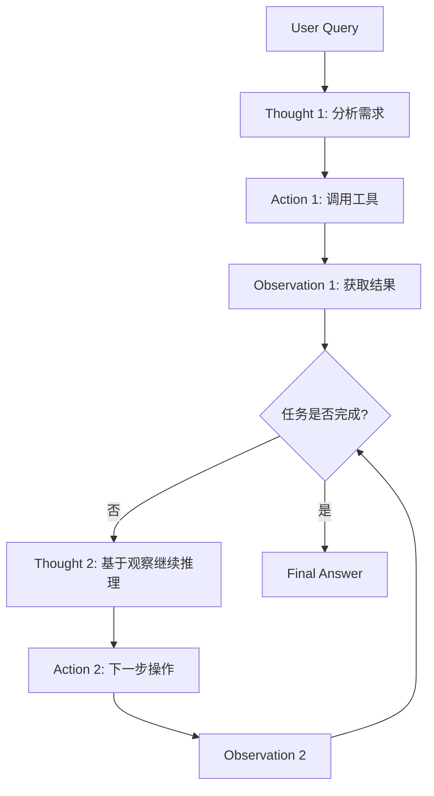

ReAct 的突破性贡献在于证明了**显式推理轨迹（explicit reasoning traces）**能够显著提升大语言模型（LLM）在需要多步决策任务上的表现，相较于单纯的 Chain-of-Thought（CoT）或单纯的动作序列，ReAct 在知识密集型任务（如 HotpotQA）和决策密集型任务（如 WebShop）上均取得了更优结果。

### 1.2 何时使用 / 何时避免

**适用场景（When to Use）**：
- 任务步骤**动态不可预知**，需要根据中间结果灵活调整策略；
- 环境反馈丰富，且每次 Action 后均有明确的 Observation；
- 单次调用无法完成的任务，需要多轮工具调用或信息检索；
- 对**可解释性（interpretability）**有要求，需要展示 Agent 的思考过程。

**避免场景（When NOT to Use）**：
- 任务路径**完全确定且可预先规划**（此时 Plan-and-Execute 更高效）；
- 对**延迟（latency）**极度敏感的场景（ReAct 的循环迭代天然引入多轮 LLM 调用）；
- 环境无有效反馈或 Observation 噪声极大（Agent 会陷入无效循环）；
- 需要严格保证**确定性输出**的合规场景（如金融交易最终确认）。

### 1.3 TypeScript 伪代码

```typescript
interface ReActAgentConfig {
  llm: LLMClient;
  tools: Map<string, Tool>;
  maxIterations: number;
}

interface Step {
  thought: string;
  action: { tool: string; input: unknown } | 'finish';
  observation?: string;
}

class ReActAgent {
  private memory: Step[] = [];

  constructor(private config: ReActAgentConfig) {}

  async run(query: string): Promise<string> {
    for (let i = 0; i < this.config.maxIterations; i++) {
      // 构造 prompt：历史步骤 + 当前 query
      const prompt = this.buildPrompt(query);

      // LLM 生成 Thought + Action
      const response = await this.config.llm.complete(prompt);
      const parsed = this.parseResponse(response);

      if (parsed.action === 'finish') {
        return parsed.thought; // Final Answer
      }

      // 执行工具调用
      const tool = this.config.tools.get(parsed.action.tool);
      if (!tool) throw new Error(`Unknown tool: ${parsed.action.tool}`);
      const observation = await tool.execute(parsed.action.input);

      // 记录步骤
      this.memory.push({
        thought: parsed.thought,
        action: parsed.action,
        observation: String(observation),
      });
    }
    throw new Error('Max iterations exceeded');
  }

  private buildPrompt(query: string): string {
    const history = this.memory
      .map((s, idx) =>
        `Step ${idx + 1}:\nThought: ${s.thought}\n` +
        `Action: ${JSON.stringify(s.action)}\n` +
        `Observation: ${s.observation}`
      )
      .join('\n---\n');
    return `You are a ReAct agent. Solve the following query.\n${history}\nQuery: ${query}\nThought:`;
  }

  private parseResponse(raw: string): { thought: string; action: any } {
    // 解析 LLM 输出，提取 Thought 和 Action
    // 实际实现中可使用结构化输出（Structured Output）或正则解析
    // ...
  }
}
```

### 1.4 工程实例

- **LangChain `AgentExecutor`**：最广泛使用的 ReAct 实现，支持 `zero-shot-react-description` 和 `structured-chat` 等变体；
- **AutoGPT**（早期版本）：虽然架构更复杂，但其核心决策循环本质上是 ReAct 的扩展；
- **OpenAI Function Calling + ReAct**：将 ReAct 的 Action 映射为 `function_call` 消息，Observation 映射为 `function` 角色消息，形成标准化的对话循环。

### 1.5 反模式与陷阱

| 反模式 | 表现 | 后果 | 对策 |
|--------|------|------|------|
| **Thought 漂移（Thought Drift）** | Agent 的思考逐渐偏离原始问题 | 输出与用户需求无关 | 在 prompt 中定期重述原始 query |
| **工具迷恋（Tool Addiction）** | Agent 倾向于调用工具而非直接回答 | 不必要的延迟和成本 | 增加 "finish" 动作的引导权重 |
| **无限循环（Infinite Loop）** | 在相同 Thought/Action 之间振荡 | 资源浪费、用户体验差 | 设置 max iterations，引入重复检测 |
| **Observation 过载** | 将过大的原始数据直接喂给 LLM | 超出上下文窗口、关键信息淹没 | 对 Observation 进行摘要或过滤 |

---

## 2. Plan-and-Solve / Plan-and-Execute

### 2.1 概念阐释

Plan-and-Solve（亦称 Plan-and-Execute）是一种**先规划、后执行**的架构模式。与 ReAct 的"边想边做"不同，Plan-and-Solve 在执行前首先生成一个完整的任务计划（Plan），将复杂目标分解为有序的子任务（Subtasks），然后按序或按需执行各个子任务。

```mermaid
flowchart LR
    A[User Query] --> B[Planner<br/>生成完整计划]
    B --> C[Plan: [Step1, Step2, Step3]]
    C --> D[Executor<br/>执行 Step 1]
    D --> E[执行 Step 2]
    E --> F[执行 Step 3]
    F --> G[Synthesizer<br/>汇总结果]
    G --> H[Final Answer]
```

该模式的核心优势在于**全局可见性（global visibility）**：Planner 在生成计划时拥有对任务全貌的鸟瞰视角，能够识别依赖关系、避免重复劳动、优化执行路径。当某个子任务失败时，Executor 可以重新调用 Planner 进行**动态重规划（replanning）**。

### 2.2 与 ReAct 的对比

| 维度 | ReAct | Plan-and-Solve |
|------|-------|----------------|
| 决策时机 | 每步即时决策 | 先全局规划，后执行 |
| 适应性 | 高（随时调整） | 中（重规划开销） |
| 可解释性 | 展示思考链 | 展示结构化计划 |
| 延迟 | 多轮交互，延迟高 | 可并行执行子任务，延迟可控 |
| 适用任务 | 探索性、动态任务 | 结构化、可分解任务 |

### 2.3 何时使用 / 何时避免

**适用场景**：
- 任务可明确分解为**独立或弱耦合**的子任务；
- 需要**并行执行**多个子任务以优化延迟；
- 任务存在严格的**前置依赖**关系（如数据处理流水线）；
- 对成本敏感，希望减少 LLM 调用次数（一次规划 vs 多次推理）。

**避免场景**：
- 任务高度不确定，计划可能在第一步后就完全失效；
- 环境状态变化极快，预先规划无意义；
- 需要极强的上下文感知和即兴应变能力。

### 2.4 TypeScript 伪代码

```typescript
interface Subtask {
  id: string;
  description: string;
  dependencies: string[]; // 依赖的子任务 ID
  status: 'pending' | 'running' | 'completed' | 'failed';
  result?: string;
}

class PlanAndSolveAgent {
  constructor(
    private planner: LLMClient,
    private executor: LLMClient,
    private tools: ToolRegistry
  ) {}

  async run(query: string): Promise<string> {
    // Phase 1: Planning
    const plan = await this.createPlan(query);

    // Phase 2: Execution (支持拓扑排序 + 并行)
    const completed = new Set<string>();
    const running = new Set<string>();

    while (completed.size < plan.length) {
      const ready = plan.filter(
        (t) =>
          t.status === 'pending' &&
          t.dependencies.every((d) => completed.has(d))
      );

      // 并行执行所有就绪子任务
      await Promise.all(
        ready.map((task) => this.executeSubtask(task, query, plan))
      );

      // 检查是否需要重规划
      const failed = plan.filter((t) => t.status === 'failed');
      if (failed.length > 0) {
        const newPlan = await this.replan(query, plan);
        plan.push(...newPlan);
      }
    }

    // Phase 3: Synthesis
    return this.synthesize(query, plan);
  }

  private async createPlan(query: string): Promise<Subtask[]> {
    const prompt = `Given the user query, break it into subtasks.\nQuery: ${query}\nOutput as JSON array of {id, description, dependencies}.`;
    const response = await this.planner.complete(prompt);
    return JSON.parse(response);
  }

  private async executeSubtask(
    task: Subtask,
    originalQuery: string,
    allTasks: Subtask[]
  ): Promise<void> {
    task.status = 'running';
    try {
      const context = allTasks
        .filter((t) => task.dependencies.includes(t.id))
        .map((t) => `${t.id}: ${t.result}`)
        .join('\n');

      const prompt = `Original query: ${originalQuery}\nSubtask: ${task.description}\nContext from dependencies:\n${context}`;
      task.result = await this.executor.complete(prompt);
      task.status = 'completed';
    } catch (e) {
      task.status = 'failed';
    }
  }

  private async replan(query: string, currentPlan: Subtask[]): Promise<Subtask[]> {
    const prompt = `Some subtasks failed. Given the original query and current progress, generate new subtasks to complete the work.\n...`;
    // ...
    return [];
  }

  private async synthesize(query: string, plan: Subtask[]): Promise<string> {
    const results = plan.map((t) => `## ${t.description}\n${t.result}`).join('\n');
    const prompt = `Synthesize the following subtask results into a final answer for: ${query}\n${results}`;
    return this.executor.complete(prompt);
  }
}
```

### 2.5 反模式与陷阱

- **过度规划（Over-planning）**：Planner 生成过于细粒度的计划，导致管理开销超过执行收益。建议设置子任务的最小颗粒度。
- **计划僵化（Plan Rigidity）**：一旦计划生成便拒绝调整。应实现"检查点（checkpoint）"机制，允许定期重规划。
- **依赖地狱（Dependency Hell）**：子任务间存在循环依赖或过度串行化。Planner 应输出有向无环图（DAG），执行引擎需做环路检测。

---

## 3. Reflection / Self-Correction

### 3.1 概念阐释

Reflection（反思）模式赋予 Agent **元认知（metacognition）**能力，使其能够评估自身输出的质量，并在发现不足时进行自我修正。该模式源于人类解决问题的认知机制："我是否回答了问题？""我的推理是否存在漏洞？""是否有更优的方案？"

Reflection 可分为两类：

1. **Self-Reflection（自反思）**：单个 Agent 审视自己的输出；
2. **Cross-Reflection（交叉反思 / 多 Agent 评审）**：多个 Agent 相互评审、辩论、投票。

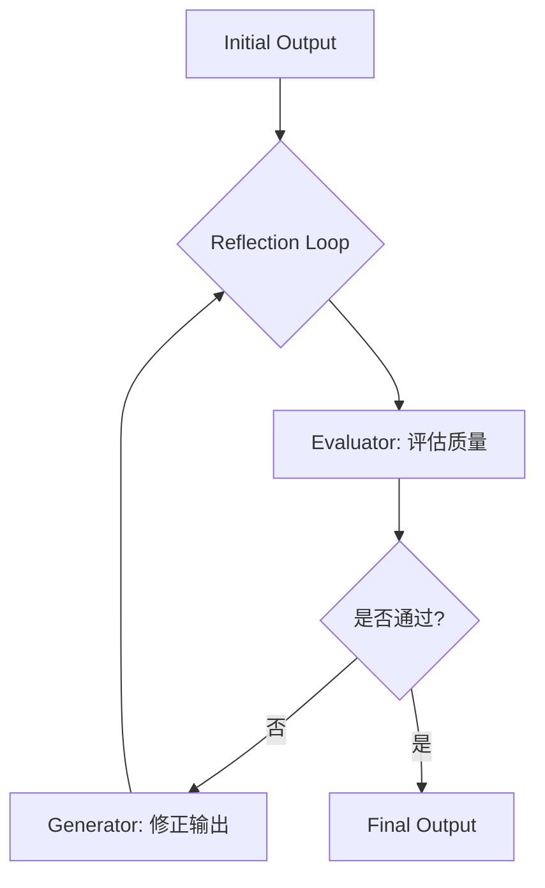

### 3.2 Self-Reflection

在 Self-Reflection 中，同一个 LLM（或同一模型的不同调用）交替扮演**生成器（Generator）**和**评估器（Evaluator）**两个角色。Generator 产出初稿，Evaluator 根据预设标准（如准确性、完整性、安全性）进行评分并给出改进建议，Generator 据此修正，循环往复直至通过或达到最大迭代次数。

**适用场景**：代码生成、文案润色、数学证明、安全审核。

**局限**：Evaluator 与 Generator 共享同一模型偏见，可能无法发现系统性盲点。

### 3.3 Cross-Reflection (Multi-Agent Critique)

Cross-Reflection 引入多个独立 Agent，每个 Agent 可能拥有不同的角色设定、知识领域或评估标准。典型的变体包括：

- **Red Team / Blue Team**：一方负责生成，另一方负责攻击/挑错；
- **Peer Review**：多个 Agent 独立评审，最终通过投票或共识机制决定输出；
- **Devil's Advocate**：专门设置一个"唱反调"的 Agent，强制挑战主流观点。

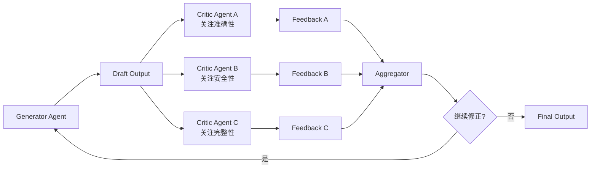

### 3.4 TypeScript 伪代码

```typescript
interface ReflectionConfig {
  generator: LLMClient;
  evaluator: LLMClient;
  criteria: string[]; // 评估维度
  maxReflectionRounds: number;
  threshold: number; // 最低通过分数
}

class ReflectiveAgent {
  constructor(private config: ReflectionConfig) {}

  async generateWithReflection(task: string): Promise<string> {
    let currentDraft = await this.config.generator.complete(
      `Generate a response for: ${task}`
    );

    for (let round = 1; round <= this.config.maxReflectionRounds; round++) {
      const evaluation = await this.evaluate(currentDraft, task);

      if (evaluation.score >= this.config.threshold) {
        return currentDraft;
      }

      currentDraft = await this.config.generator.complete(
        `Improve the following based on feedback (score: ${evaluation.score}):\n` +
          `Draft: ${currentDraft}\nFeedback: ${evaluation.feedback}`
      );
    }

    return currentDraft; // 达到最大轮数，返回最佳尝试
  }

  private async evaluate(draft: string, task: string): Promise<{ score: number; feedback: string }> {
    const criteria = this.config.criteria.join(', ');
    const prompt =
      `Evaluate the following draft for the task "${task}".\n` +
      `Criteria: ${criteria}\n` +
      `Draft: ${draft}\n` +
      `Output JSON: { "score": 0-100, "feedback": "..." }`;
    const response = await this.config.evaluator.complete(prompt);
    return JSON.parse(response);
  }
}
```

### 3.5 反模式与陷阱

- **评估疲劳（Evaluation Fatigue）**：Evaluator 逐渐放松标准。解决：使用结构化评分表（rubric）而非开放式评价。
- **修正振荡（Correction Oscillation）**：Generator 在 A 和 B 两种风格之间反复横跳。解决：累积历史反馈，要求 Generator 综合所有意见。
- **自恋偏差（Narcissistic Bias）**：Evaluator 过度认同自己的风格。Cross-Reflection 可缓解此问题。

---

## 4. Multi-Agent Orchestration

### 4.1 概述

当单一 Agent 的能力边界被突破时，Multi-Agent 系统（MAS, Multi-Agent System）通过**角色分工（role specialization）**和**协同机制（coordination mechanism）**实现更复杂的智能行为。根据组织形态，Multi-Agent 编排可分为四种典型模式。

### 4.2 Hierarchical（层级式：Manager + Workers）

**概念**：存在一个中央 Manager Agent 负责任务分解、进度监控和结果汇总；多个 Worker Agent 负责具体子任务的执行。Manager 拥有全局状态视图，Worker 之间通常不直接通信。

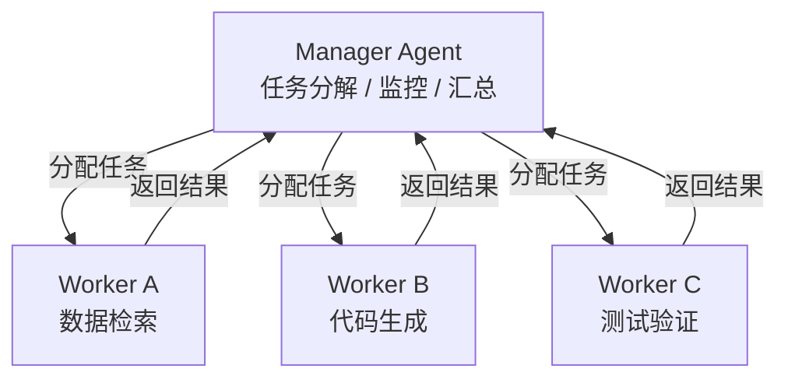

**适用场景**：软件开发（架构师 + 程序员 + 测试员）、研究助理（分析师 + 撰稿人 + 校对员）、企业流程自动化。

**反模式**：Manager 成为单点瓶颈（Single Point of Bottleneck）。解决：引入二级子 Manager 或允许 Worker 间有限通信。

### 4.3 Peer-to-Peer（P2P，平等协作）

**概念**：所有 Agent 处于平等地位，通过**共享消息总线（shared message bus）**或**黑板系统（blackboard system）**进行通信。没有中央控制器，Agent 根据消息内容自主决定下一步行动。

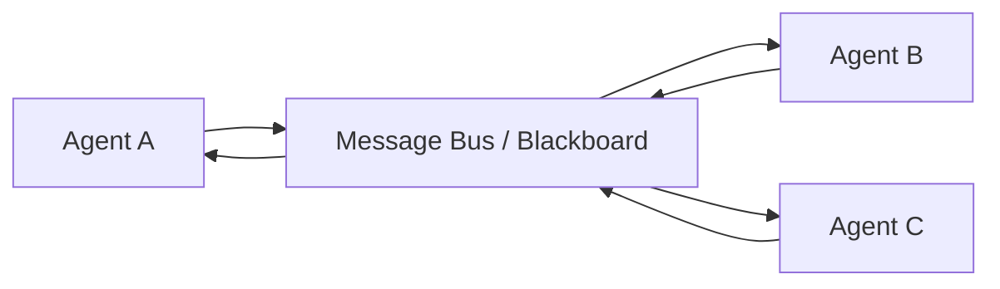

**适用场景**：头脑风暴、创意生成、开放域讨论（如模拟公司战略会议）。

**反模式**：**群体思维（Groupthink）**。当多数 Agent 持有相似观点时，少数异议被压制。解决：引入随机性、设置 Devil's Advocate 角色。

### 4.4 Competitive（竞争式：Red Team / Blue Team）

**概念**：Agent 被划分为对立的阵营，通过竞争驱动质量提升。最典型的是 **Red Team（红队，攻击方）** vs **Blue Team（蓝队，防御方）**。

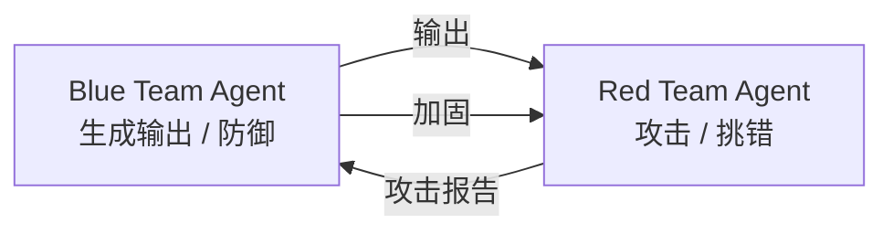

**适用场景**：安全测试、内容安全审核、对抗性代码审查、LLM 安全对齐（safety alignment）。

**反模式**：对抗升级导致无意义的"抬杠"。解决：设置中性 Judge Agent 进行仲裁，规定对抗轮数上限。

### 4.5 Market-based（市场竞价式）

**概念**：引入经济学隐喻，Agent 对任务进行"竞价"，出价最优（如能力匹配度最高、成本最低、延迟最短）的 Agent 获得任务执行权。需要中央 Auctioneer 或分布式共识机制。

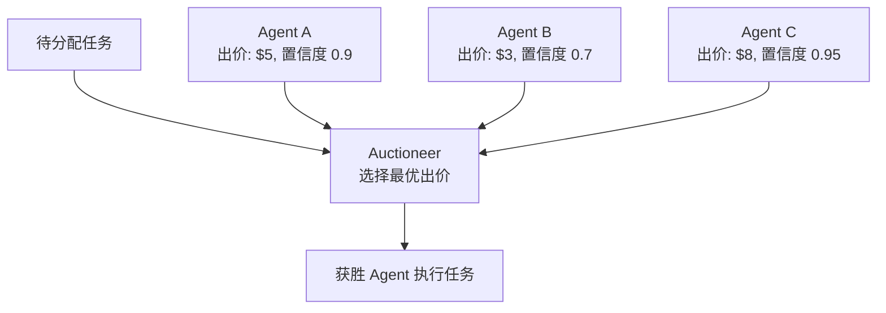

**适用场景**：大规模异构 Agent 集群（如多个专业模型）、成本敏感型任务调度、边缘-云端协同计算。

**反模式**：**竞价操纵（Bid Manipulation）**。Agent 虚报能力以获取任务。解决：引入执行后的绩效评估和信誉系统（reputation system）。

### 4.6 Multi-Agent 编排的通用 TypeScript 框架

```typescript
type AgentRole = 'manager' | 'worker' | 'critic' | 'auctioneer';

interface Agent {
  id: string;
  role: AgentRole;
  llm: LLMClient;
  systemPrompt: string;
  inbox: Message[];
}

interface Message {
  from: string;
  to: string | 'broadcast';
  type: 'task' | 'result' | 'critique' | 'bid' | 'heartbeat';
  payload: unknown;
  timestamp: number;
}

class MultiAgentSystem {
  private agents = new Map<string, Agent>();
  private messageBus: Message[] = [];

  register(agent: Agent): void {
    this.agents.set(agent.id, agent);
  }

  async broadcast(from: string, payload: unknown): Promise<void> {
    const msg: Message = { from, to: 'broadcast', type: 'task', payload, timestamp: Date.now() };
    this.messageBus.push(msg);
    // 异步通知所有 Agent
    const tasks = Array.from(this.agents.values())
      .filter((a) => a.id !== from)
      .map((a) => this.deliver(a, msg));
    await Promise.all(tasks);
  }

  private async deliver(agent: Agent, msg: Message): Promise<void> {
    // Agent 根据自身角色和状态决定如何处理消息
    const response = await agent.llm.complete(
      `You are ${agent.role}.\nMessage: ${JSON.stringify(msg)}\nYour inbox: ${JSON.stringify(agent.inbox)}\nRespond with action.`
    );
    // 解析响应并可能产生新消息...
  }
}
```

---

## 5. Human-in-the-Loop (HITL)

### 5.1 概念阐释

Human-in-the-Loop（HITL，人机回环）指在 Agent 的决策或执行流程中**策略性地插入人类干预点**。HITL 不是对自动化的否定，而是对**可靠性（reliability）**、**问责制（accountability）**和**用户体验（UX）**的工程性平衡。

### 5.2 四级自动化谱系

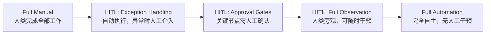

| 级别 | 名称 | 人工职责 | Agent 职责 | 典型场景 |
|------|------|----------|------------|----------|
| L0 | Full Manual | 全部 | 无 | 创意写作初稿 |
| L1 | Exception Handling | 处理异常和边缘案例 | 常规流程自动化 | 客服机器人升级 |
| L2 | Approval Gates | 在关键决策点确认/否决 | 生成方案并等待授权 | 金融交易审批 |
| L3 | Full Observation | 实时监控，随时接管 | 自主执行，汇报状态 | 自动驾驶 |
| L4 | Full Automation | 事后审计 | 完全自主 | 日志分析、批量数据处理 |

### 5.3 HITL 的插入点设计

1. **输入确认（Input Clarification）**：Agent 对模糊 query 进行追问，而非猜测；
2. **计划审批（Plan Approval）**：Plan-and-Solve 架构中，在执行前展示计划供人类确认；
3. **工具调用确认（Tool Call Approval）**：高风险的工具（如转账、删除数据、发送邮件）需人工授权；
4. **输出审核（Output Review）**：最终输出发布前由人类检查；
5. **异常升级（Exception Escalation）**：置信度低于阈值或检测到冲突时自动升级。

### 5.4 TypeScript 伪代码

```typescript
type HITLLevel = 'full-auto' | 'approval-gates' | 'exception-only' | 'full-manual';

interface HITLGate {
  id: string;
  trigger: (context: ExecutionContext) => boolean;
  promptTemplate: string; // 向人类展示的信息模板
  timeoutMs: number;
  defaultAction: 'approve' | 'reject' | 'escalate';
}

class HITLController {
  private gates: HITLGate[] = [];

  addGate(gate: HITLGate): void {
    this.gates.push(gate);
  }

  async executeWithHITL<T>(
    task: () => Promise<T>,
    context: ExecutionContext,
    level: HITLLevel
  ): Promise<T> {
    if (level === 'full-manual') {
      return this.waitForHumanTask(task, context);
    }

    // 检查是否有 gate 被触发
    const triggered = this.gates.filter((g) => g.trigger(context));

    if (triggered.length > 0 && level !== 'full-auto') {
      const decisions = await Promise.all(
        triggered.map((g) => this.requestHumanDecision(g, context))
      );
      if (decisions.some((d) => d === 'reject')) {
        throw new Error('Human rejected execution');
      }
    }

    try {
      const result = await task();
      return result;
    } catch (error) {
      if (level === 'exception-only' || level === 'approval-gates') {
        const decision = await this.requestHumanDecisionForException(error, context);
        if (decision === 'retry') {
          return this.executeWithHITL(task, context, level);
        }
      }
      throw error;
    }
  }

  private async requestHumanDecision(gate: HITLGate, context: ExecutionContext): Promise<'approve' | 'reject'> {
    // 通过 UI / WebSocket / 邮件向人类发送请求
    // 等待响应或超时
    // ...
    return 'approve';
  }

  private async waitForHumanTask<T>(task: () => Promise<T>, context: ExecutionContext): Promise<T> {
    // 在 full-manual 模式下，完全由人类触发 task
    // ...
    return task();
  }
}
```

### 5.5 反模式与陷阱

- **HITL 疲劳（HITL Fatigue）**：过多的确认请求导致人类用户麻木点击"同意"。解决：使用**批量审批（batch approval）**和智能阈值调整。
- **虚假安全感（False Sense of Security）**：人类过度信任 Agent 的输出，审批流于形式。解决：在审批界面突出显示高风险字段和 Agent 置信度。
- **延迟灾难（Latency Disaster）**：同步等待人类响应阻塞整个流程。解决：采用异步 HITL，允许 Agent 在等待期间处理其他独立任务。

---

## 6. Tool Use Patterns

### 6.1 概念阐释

Tool Use（工具使用）是 Agent 扩展自身能力边界的核心机制。LLM 本身仅拥有训练时固化参数中的知识，而 Tool Use 使其能够在推理时动态访问外部世界：执行代码、查询数据库、调用 API、操作文件系统等。

### 6.2 Function Calling 基础

现代 LLM（如 GPT-4、Claude 3、Gemini）通过 **Function Calling / Tool Calling** 接口规范化工具使用：

1. 开发者向模型注册可用工具的 JSON Schema；
2. 模型在需要时输出结构化调用请求（非自然语言）；
3. 宿主程序执行调用并将结果返回给模型。

### 6.3 工具选择策略

#### 6.3.1 全量注入（All Tools）

将所有可用工具的 Schema 一次性注入系统提示（System Prompt）。实现最简单，但受限于上下文窗口，且可能引入无关工具的干扰。

**适用**：工具数量少（< 10）、关系简单。

#### 6.3.2 路由式选择（Routing / Tool Retrieval）

先由**路由器（Router）**根据 query 语义选择最相关的工具子集，再将子集注入主 Agent。

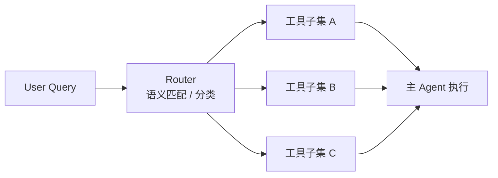

**实现方式**：
- 基于 Embedding 的向量检索（将工具描述向量化）；
- 基于 LLM 的分类器（"这个 query 需要哪类工具？"）；
- 预定义规则（如正则映射）。

**适用**：工具数量庞大（100+），且存在明显类别划分。

#### 6.3.3 规划式选择（Planning-based）

Agent 在生成 Thought 的同时决定需要哪些工具，甚至**动态组合**多个工具形成工作流。这是 ReAct 和 Plan-and-Solve 的自然延伸。

**适用**：复杂任务需要多工具协同，且调用顺序和依赖关系不固定。

### 6.4 MCP (Model Context Protocol) 集成

MCP（Model Context Protocol，Anthropic, 2024）是新兴的开放标准，旨在标准化 LLM 与外部数据源、工具之间的集成方式。MCP 采用客户端-服务器架构：

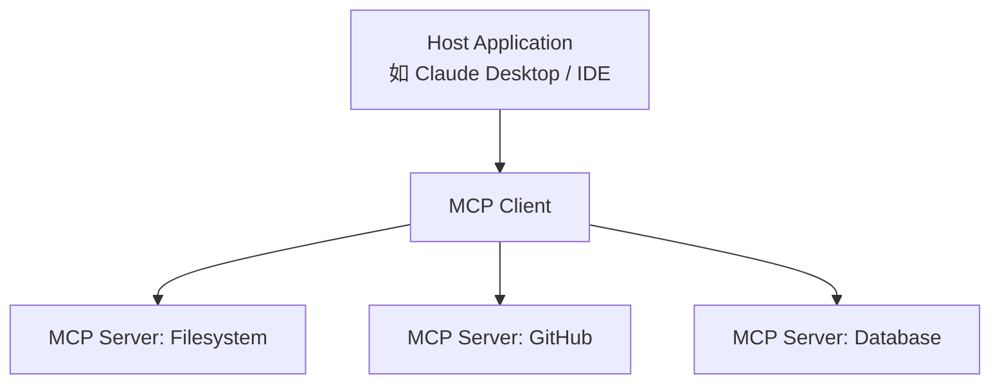

**对架构的影响**：
- 工具提供者不再需要为每个 LLM 平台编写适配器；
- Agent 系统可**热插拔** MCP Server，实现工具生态的标准化；
- 安全风险集中于 MCP Client 的权限管控。

### 6.5 TypeScript 伪代码

```typescript
interface Tool {
  name: string;
  description: string;
  parameters: JSONSchema;
  execute: (args: unknown) => Promise<unknown>;
}

interface ToolRouter {
  selectTools(query: string, allTools: Tool[]): Promise<Tool[]>;
}

class ToolEnabledAgent {
  constructor(
    private llm: LLMClient,
    private toolRegistry: Tool[],
    private router?: ToolRouter
  ) {}

  async run(query: string): Promise<string> {
    const tools = this.router
      ? await this.router.selectTools(query, this.toolRegistry)
      : this.toolRegistry;

    const availableTools = tools.map((t) => ({
      type: 'function' as const,
      function: {
        name: t.name,
        description: t.description,
        parameters: t.parameters,
      },
    }));

    const messages: ChatMessage[] = [
      { role: 'system', content: 'You have access to the following tools...' },
      { role: 'user', content: query },
    ];

    while (true) {
      const response = await this.llm.chat(messages, { tools: availableTools });

      if (response.content) {
        return response.content; // Final answer
      }

      if (response.tool_calls) {
        for (const call of response.tool_calls) {
          const tool = tools.find((t) => t.name === call.function.name);
          if (!tool) throw new Error(`Tool ${call.function.name} not found`);

          const result = await tool.execute(JSON.parse(call.function.arguments));
          messages.push({
            role: 'tool',
            tool_call_id: call.id,
            content: JSON.stringify(result),
          });
        }
      }
    }
  }
}

// Router 实现示例
class EmbeddingToolRouter implements ToolRouter {
  constructor(private embeddingModel: EmbeddingClient) {}

  async selectTools(query: string, allTools: Tool[]): Promise<Tool[]> {
    const queryVec = await this.embeddingModel.embed(query);
    const toolVecs = await Promise.all(
      allTools.map(async (t) => ({
        tool: t,
        vec: await this.embeddingModel.embed(t.description),
      }))
    );

    return toolVecs
      .map((t) => ({ ...t, similarity: cosineSimilarity(queryVec, t.vec) }))
      .sort((a, b) => b.similarity - a.similarity)
      .slice(0, 5)
      .map((t) => t.tool);
  }
}
```

### 6.6 反模式与陷阱

- **工具滥用（Tool Abuse）**：Agent 在已有知识的情况下仍调用工具（如用计算器算 2+2）。解决：在 prompt 中强调"先思考，仅必要时使用工具"。
- **Schema 漂移（Schema Drift）**：工具实现变更但 Schema 未同步更新。解决：CI/CD 中集成 Schema 校验。
- **工具级联失败（Tool Cascade Failure）**：工具 A 依赖工具 B，B 失败导致 A 也失败。解决：实现断路器（Circuit Breaker）和降级策略。

---

## 7. Memory Architectures

### 7.1 概念阐释

Memory（记忆）是 Agent 维持**时间连续性（temporal continuity）**和**知识累积（knowledge accumulation）**的基础设施。没有记忆的 Agent 每次交互都是"金鱼式"的从头开始。根据时间尺度和信息类型，记忆通常分为三个层级。

### 7.2 三级记忆架构

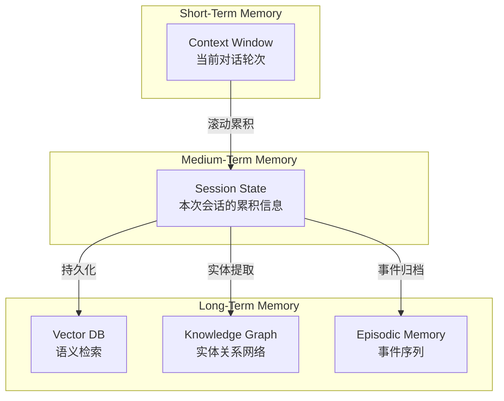

#### 7.2.1 Short-Term Memory（短期记忆 / 上下文窗口）

即 LLM 的**上下文窗口（context window）**本身。它是 Agent 的"工作记忆"，直接参与当前推理过程。

**特点**：访问最快、精度最高、容量有限（4K-2M tokens 不等）。

**优化策略**：
- **滑动窗口（Sliding Window）**：仅保留最近 N 轮对话；
- **摘要压缩（Summarization）**：将早期对话压缩为摘要，释放窗口空间；
- **提示压缩（Prompt Compression）**：使用小型模型剔除冗余 token。

#### 7.2.2 Medium-Term Memory（中期记忆 / 会话状态）

跨越单次 LLM 调用但在单会话内有效的状态存储。例如：用户在本次对话中指定的偏好、Agent 已收集但未处理完毕的信息片段、多步任务中的中间变量。

**实现方式**：内存中的 Key-Value Store、Redis Session、浏览器的 `localStorage`。

#### 7.2.3 Long-Term Memory（长期记忆）

跨会话、跨时间的持久化知识库。长期记忆又可细分为：

- **Semantic Memory（语义记忆）**：关于世界的一般性知识，通常以**向量数据库（Vector DB）**形式存储，支持语义检索；
- **Episodic Memory（情景记忆）**：关于具体事件的记忆（"上周用户提到他住在上海"），通常按时间序列存储；
- **Procedural Memory（程序性记忆）**：关于"如何做"的记忆，常以规则库或微调权重的形式存在。

### 7.3 Episodic vs Semantic Memory

| 维度 | Episodic Memory | Semantic Memory |
|------|-----------------|-----------------|
| 内容 | 具体事件、对话、经历 | 抽象知识、概念、关系 |
| 存储形式 | 时间序列日志 + 摘要 | 向量嵌入 + 知识图谱 |
| 检索方式 | 时间范围查询 + 语义相似度 | 纯语义相似度 |
| 遗忘机制 | 按时间衰减（TTL） | 按使用频率更新 |
| 示例 | "2024-03-15 用户投诉物流延迟" | "退货政策：7天无理由" |

### 7.4 记忆架构的 TypeScript 实现

```typescript
interface MemoryEntry {
  id: string;
  content: string;
  timestamp: number;
  type: 'episodic' | 'semantic' | 'procedural';
  embedding?: number[];
  metadata: Record<string, unknown>;
}

interface MemoryConfig {
  shortTermMaxTokens: number;
  summarizer: LLMClient;
  vectorStore: VectorDBClient;
  knowledgeGraph?: GraphDBClient;
}

class HierarchicalMemory {
  private shortTerm: ChatMessage[] = []; // 原始对话
  private mediumTerm = new Map<string, unknown>(); // 会话状态

  constructor(private config: MemoryConfig) {}

  async add(message: ChatMessage): Promise<void> {
    this.shortTerm.push(message);
    await this.compressIfNeeded();
  }

  private async compressIfNeeded(): Promise<void> {
    const tokenCount = estimateTokens(this.shortTerm);
    if (tokenCount > this.config.shortTermMaxTokens * 0.8) {
      const toSummarize = this.shortTerm.splice(0, Math.floor(this.shortTerm.length / 2));
      const summary = await this.config.summarizer.complete(
        `Summarize the following conversation for future reference:\n${JSON.stringify(toSummarize)}`
      );
      await this.persistToLongTerm(summary, 'episodic');
    }
  }

  async persistToLongTerm(content: string, type: 'episodic' | 'semantic'): Promise<void> {
    const embedding = await this.config.vectorStore.embed(content);
    const entry: MemoryEntry = {
      id: crypto.randomUUID(),
      content,
      timestamp: Date.now(),
      type,
      embedding,
      metadata: {},
    };
    await this.config.vectorStore.upsert(entry);

    // 同步更新知识图谱
    if (this.config.knowledgeGraph) {
      const entities = await this.extractEntities(content);
      await this.config.knowledgeGraph.mergeEntities(entities);
    }
  }

  async retrieveRelevant(query: string, topK: number = 5): Promise<MemoryEntry[]> {
    const queryVec = await this.config.vectorStore.embed(query);
    return this.config.vectorStore.similaritySearch(queryVec, topK);
  }

  getContextWindow(): ChatMessage[] {
    return this.shortTerm;
  }

  private async extractEntities(text: string): Promise<Entity[]> {
    // 使用 NER 或 LLM 提取实体关系
    // ...
    return [];
  }
}
```

### 7.5 反模式与陷阱

- **记忆污染（Memory Pollution）**：错误信息被存入长期记忆并反复检索。解决：记忆写入前加入置信度校验，支持人类手动修正记忆。
- **检索噪声（Retrieval Noise）**：向量检索返回语义相似但实质上无关的内容。解决：结合关键词过滤、元数据标签、重排序（reranking）。
- **记忆膨胀（Memory Bloat）**：长期记忆无限增长导致检索效率下降。解决：实现记忆合并（memory consolidation）、定期归档冷数据。

---

## 8. Agent-as-a-Service (AaaS)

### 8.1 概念阐释

Agent-as-a-Service（AaaS）是智能体技术向**服务化、平台化**演进的必然趋势。预计到 2027 年，主流云厂商（AWS、Azure、GCP、阿里云）将提供托管式 Agent Runtime，使开发者无需管理底层 LLM 调用、状态存储、工具注册和编排逻辑，即可部署和运行生产级 Agent。

AaaS 并非简单的"LLM API 包装"，而是涵盖以下能力的完整平台：

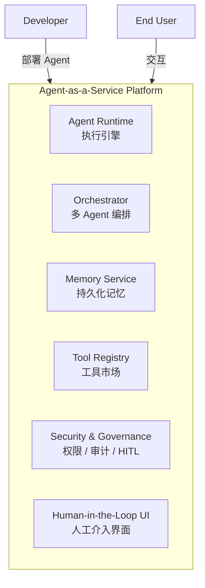

### 8.2 AaaS 的核心能力预测

| 能力层 | 2025 现状 | 2027 预测 |
|--------|-----------|-----------|
| **Runtime** | 自建 LangChain/LangGraph | 托管 Serverless Agent Runtime，自动扩缩容 |
| **Orchestration** | 代码级编排 | 声明式编排（YAML/JSON 定义 Agent 工作流） |
| **Memory** | 自建 Vector DB | 托管多层级记忆服务，自动跨会话同步 |
| **Tools** | 自行对接 API | 标准化 Tool Marketplace，一键订阅 |
| **HITL** | 自行开发 UI | 平台内置审批流、通知、审计日志 |
| **Observability** | 基础日志 | Agent 专用可观测性（思考链可视化、延迟分析、成本追踪） |

### 8.3 对架构设计的影响

1. **关注点分离（Separation of Concerns）**：开发者聚焦于 Agent 的"业务逻辑"（角色设定、工具选择、评判标准），平台负责"基础设施"（容错、并发、持久化）。
2. **可移植性（Portability）**：基于开放标准（如 MCP、A2A - Agent-to-Agent Protocol）的 Agent 可在不同 AaaS 平台间迁移。
3. **成本模型变革**：从"按 Token 计费"演进为"按 Agent 执行单元（Agent Compute Unit）计费"，类似 Serverless 的 request-based pricing。
4. **安全边界重构**：Agent 获得广泛工具访问权限后，AaaS 平台需提供细粒度权限管控（RBAC + ABAC）、沙箱执行环境、输出审核 pipeline。

### 8.4 TypeScript 伪代码：面向 AaaS 的 Agent 定义

```typescript
// 声明式 Agent 定义 —— 面向未来的 AaaS 部署范式
interface AgentManifest {
  apiVersion: 'v1';
  kind: 'Agent';
  metadata: {
    name: string;
    version: string;
    labels: Record<string, string>;
  };
  spec: {
    // 角色与行为
    role: {
      systemPrompt: string;
      model: string; // 如 'gpt-4o', 'claude-3-5-sonnet'
      temperature: number;
    };

    // 架构模式选择
    architecture: {
      pattern: 'react' | 'plan-and-solve' | 'reflection' | 'custom';
      maxIterations: number;
      reflection?: {
        enabled: boolean;
        criteria: string[];
      };
    };

    // 记忆配置
    memory: {
      shortTerm: { maxTokens: number };
      longTerm: {
        enabled: boolean;
        vectorStore: 'platform-default' | string;
        knowledgeGraph: boolean;
      };
    };

    // 工具注册
    tools: {
      fromMarketplace: string[]; // 平台工具市场 ID
      custom: Array<{
        name: string;
        endpoint: string;
        schema: JSONSchema;
      }>;
      selectionStrategy: 'all' | 'router' | 'planning';
    };

    // HITL 配置
    humanInTheLoop: {
      level: 'none' | 'exception' | 'approval-gates' | 'full-observation';
      gates: Array<{
        trigger: string; // 如 'tool:send_email', 'confidence<0.8'
        approvers: string[]; // 用户组或角色
        timeoutSeconds: number;
      }>;
    };

    // 多 Agent 编排（可选）
    orchestration?: {
      type: 'single' | 'hierarchical' | 'peer-to-peer';
      subAgents?: string[]; // 引用的其他 Agent 名称
    };
  };
}

// 部署到 AaaS 平台
class AaaSClient {
  constructor(private endpoint: string, private apiKey: string) {}

  async deploy(manifest: AgentManifest): Promise<{ agentId: string; endpoint: string }> {
    const response = await fetch(`${this.endpoint}/v1/agents`, {
      method: 'POST',
      headers: {
        'Content-Type': 'application/json',
        Authorization: `Bearer ${this.apiKey}`,
      },
      body: JSON.stringify(manifest),
    });
    return response.json();
  }

  async invoke(agentId: string, input: string): Promise<AgentResponse> {
    const response = await fetch(`${this.endpoint}/v1/agents/${agentId}/invoke`, {
      method: 'POST',
      headers: { Authorization: `Bearer ${this.apiKey}` },
      body: JSON.stringify({ input }),
    });
    return response.json();
  }
}
```

### 8.5 反模式与陷阱

- **供应商锁定（Vendor Lock-in）**：过度依赖某 AaaS 平台的专有编排语法。解决：优先采用开源标准（如 MCP、AGNTCY）。
- **黑箱焦虑（Black Box Anxiety）**：托管 Runtime 隐藏了关键中间状态，调试困难。解决：选择提供完整可观测性（observability）和导出能力的平台。
- **成本失控（Cost Explosion）**：AaaS 的便捷性可能导致 Agent 调用量激增。解决：实施预算上限（budget cap）和速率限制（rate limiting）。

---

## 9. References

1. Yao, S., Zhao, J., Yu, D., Du, N., Shafran, I., Narasimhan, K., & Cao, Y. (2022). ReAct: Synergizing Reasoning and Acting in Language Models. *arXiv preprint arXiv:2210.03629*.
2. Wang, L., et al. (2023). Plan-and-Solve Prompting: Improving Zero-Shot Chain-of-Thought Reasoning by Large Language Models. *arXiv preprint arXiv:2305.04091*.
3. Shinn, N., Cassano, F., Gopinath, A., Narasimhan, K., & Yao, S. (2023). Reflexion: Self-Reflective Agents with Verbal Reinforcement Learning. *arXiv preprint arXiv:2303.11366*.
4. Wu, Q., et al. (2023). AutoGen: Enabling Next-Gen LLM Applications via Multi-Agent Conversation. *arXiv preprint arXiv:2308.08155*.
5. Anthropic. (2024). Model Context Protocol (MCP) Specification. https://modelcontextprotocol.io/
6. Google. (2024). A2A (Agent-to-Agent) Protocol. https://github.com/google/A2A
7. Xi, Z., et al. (2023). The Rise and Potential of Large Language Model Based Agents: A Survey. *Science China Information Sciences*, 67(1), 1-26.
8. Park, J. S., et al. (2023). Generative Agents: Interactive Simulacra of Human Behavior. *Proceedings of the 36th Annual ACM Symposium on User Interface Software and Technology*.
9. Wei, J., et al. (2022). Chain-of-Thought Prompting Elicits Reasoning in Large Language Models. *Advances in Neural Information Processing Systems*, 35.
10. Schick, T., et al. (2023). Toolformer: Language Models Can Teach Themselves to Use Tools. *Advances in Neural Information Processing Systems*, 36.
11. Wang, L., et al. (2024). A Survey on Large Language Model based Autonomous Agents. *Frontiers of Computer Science*, 18(6), 186345.
12. Shen, Y., et al. (2024). HuggingGPT: Solving AI Tasks with ChatGPT and its Friends in Hugging Face. *Advances in Neural Information Processing Systems*, 36.
13. Anthropic. (2024). Building Effective Agents. https://www.anthropic.com/research/building-effective-agents
14. IBM Research. (2024). Multi-Agent Systems: A Survey of Architectures and Coordination Mechanisms. *IBM Technical Report*.
15. LangChain Inc. (2024). LangGraph: Building Stateful, Multi-Agent Applications. https://langchain-ai.github.io/langgraph/

---

> **文档元信息**
> - 作者：AI Agent Architecture Research Group
> - 版本：v1.0
> - 最后更新：2026-04-27
> - 状态：Research / 研究综述
> - 适用范围：docs/research/ 目录，面向架构师与高级开发者的深度参考文档
