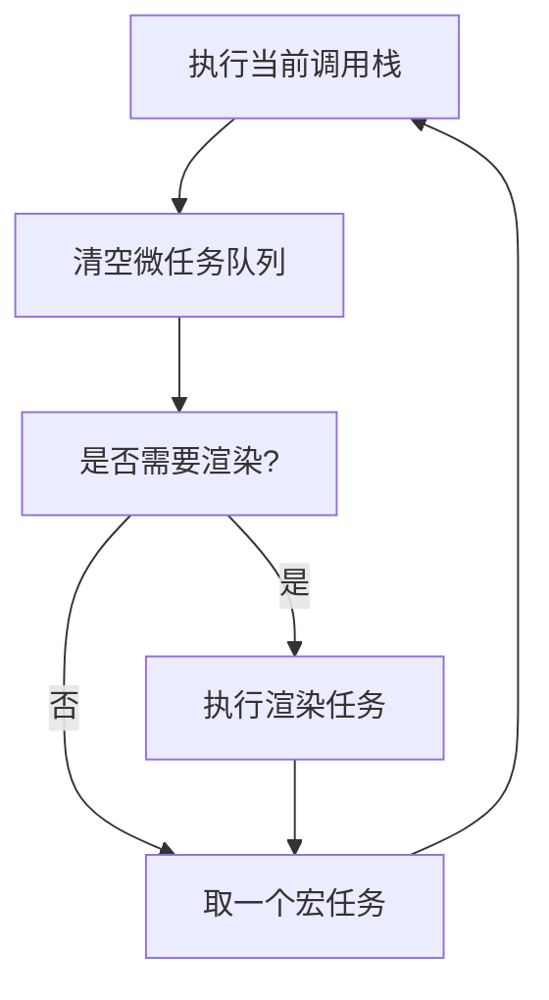

# 并发编程深度理论：从事件循环到并行计算

> **目标读者**：中高级前端/Node.js 工程师、架构师
> **关联文档**：[`docs/categories/04-concurrency.md`](../../docs/categories/04-concurrency.md)
> **版本**：2026-04
> **字数**：约 4,200 字

---

## 1. JavaScript 并发模型的独特性

### 1.1 单线程 + 事件循环 ≠ 无能

JavaScript 的并发模型常被误解为"单线程 = 无并发"。实际上，JS 实现了**协作式多任务**的极致：

```
┌─────────────────────────────────────────────────────────┐
│                      调用栈 (Call Stack)                │
│  ─ 同步代码执行                                          │
│  ─ 函数调用压栈/出栈                                      │
└─────────────────────────────────────────────────────────┘
                            ↓
┌─────────────────────────────────────────────────────────┐
│                    Web APIs / Node APIs                 │
│  ─ setTimeout, fetch, fs.readFile                       │
│  ─ 委托给浏览器/操作系统执行                              │
└─────────────────────────────────────────────────────────┘
                            ↓
┌──────────────┐    ┌──────────────┐    ┌──────────────┐
│   宏任务队列  │    │   微任务队列  │    │  渲染队列     │
│  (Macrotask) │    │ (Microtask)  │    │ (Animation)  │
│  ─ setTimeout│    │ ─ Promise    │    │ ─ requestAF  │
│  ─ I/O       │    │ ─ queueMicro │    │ ─ 重排重绘    │
│  ─ UI事件    │    │ ─ MutationOb │    │              │
└──────────────┘    └──────────────┘    └──────────────┘
```

**关键洞察**：JS 的"单线程"指的是**执行线程**单一，但**I/O 操作**完全异步并行。

### 1.2 事件循环的优先级



**执行顺序规则**：

1. 当前调用栈全部执行完毕
2. 清空所有微任务（Promise、queueMicrotask）
3. 执行必要渲染（如果到帧边界）
4. 取一个宏任务执行
5. 循环

**经典面试题解析**：

```javascript
console.log('1');
setTimeout(() => console.log('2'), 0);
Promise.resolve().then(() => console.log('3'));
console.log('4');
// 输出: 1 → 4 → 3 → 2
// 原因: 同步(1,4) → 微任务(3) → 宏任务(2)
```

---

## 2. 异步编程演进史

### 2.1 四代异步模型

| 世代 | 模式 | 代码特征 | 问题 |
|------|------|---------|------|
| **1.0** | Callback | `fs.readFile(path, cb)` | 回调地狱、错误处理混乱 |
| **2.0** | Promise | `.then().catch()` | 链式冗长、串行复杂 |
| **3.0** | async/await | `const data = await fn()` | 表面同步、实际仍异步 |
| **4.0** | Async Iterators | `for await (const x of stream)` | 流式处理、背压控制 |

### 2.2 async/await 的隐式成本

async/await 虽然让代码看起来像同步，但**每次 await 都是一个事件循环的让步点**：

```javascript
// ❌ 看似高效，实际多次事件循环切换
async function slow() {
  const a = await fetchA();  // 让步 → 微任务
  const b = await fetchB();  // 让步 → 微任务
  const c = await fetchC();  // 让步 → 微任务
  return [a, b, c];
}

// ✅ 并行发起，只等一次
async function fast() {
  const [a, b, c] = await Promise.all([fetchA(), fetchB(), fetchC()]);
  return [a, b, c];
}
```

**性能差异**：`slow()` 需要 3 个事件循环周期，`fast()` 只需要 1 个。

---

## 3. 并行计算：突破单线程限制

### 3.1 Web Workers / Worker Threads

当 CPU 密集型任务阻塞主线程时，Worker 是唯一的解决方案。

**Web Workers（浏览器）**：

```javascript
const worker = new Worker('worker.js');
worker.postMessage({ data: hugeArray });
worker.onmessage = (e) => console.log(e.data.result);
```

**Worker Threads（Node.js）**：

```javascript
const { Worker, isMainThread, parentPort } = require('worker_threads');

if (isMainThread) {
  const worker = new Worker(__filename);
  worker.on('message', (result) => console.log(result));
} else {
  // 执行 CPU 密集型计算
  const result = heavyComputation();
  parentPort.postMessage(result);
}
```

**Worker 通信开销模型**：

- 结构化克隆算法序列化/反序列化数据
- > 1MB 的数据传输建议使用 SharedArrayBuffer

### 3.2 SharedArrayBuffer + Atomics

**SharedArrayBuffer** 允许多个线程共享同一块内存：

```javascript
const shared = new SharedArrayBuffer(1024);
const buffer = new Int32Array(shared);

// Worker 1
Atomics.store(buffer, 0, 42);

// Worker 2
const value = Atomics.load(buffer, 0); // 42
```

**Atomics API**：

| 操作 | 说明 |
|------|------|
| `Atomics.load` / `store` | 原子读写 |
| `Atomics.add` / `sub` | 原子加减 |
| `Atomics.compareExchange` | CAS 操作 |
| `Atomics.wait` / `notify` | 线程同步（锁） |

**安全限制**：SharedArrayBuffer 需要以下响应头：

```
Cross-Origin-Opener-Policy: same-origin
Cross-Origin-Embedder-Policy: require-corp
```

---

## 4. 并发设计模式

### 4.1 生产者-消费者模式

```javascript
class AsyncQueue<T> {
  private queue: T[] = [];
  private resolvers: Array<(value: T) => void> = [];

  enqueue(item: T) {
    if (this.resolvers.length > 0) {
      const resolve = this.resolvers.shift()!;
      resolve(item);
    } else {
      this.queue.push(item);
    }
  }

  async dequeue(): Promise<T> {
    if (this.queue.length > 0) return this.queue.shift()!;
    return new Promise((resolve) => this.resolvers.push(resolve));
  }
}
```

### 4.2 信号量（Semaphore）

限制并发数量，防止资源过载：

```javascript
class Semaphore {
  private permits: number;
  private queue: Array<() => void> = [];

  constructor(permits: number) {
    this.permits = permits;
  }

  async acquire(): Promise<void> {
    if (this.permits > 0) {
      this.permits--;
      return;
    }
    return new Promise((resolve) => this.queue.push(resolve));
  }

  release() {
    if (this.queue.length > 0) {
      const next = this.queue.shift()!;
      next();
    } else {
      this.permits++;
    }
  }
}

// 使用：限制最多 5 个并发请求
const semaphore = new Semaphore(5);
async function limitedFetch(url: string) {
  await semaphore.acquire();
  try {
    return await fetch(url);
  } finally {
    semaphore.release();
  }
}
```

### 4.3 读写锁（ReadWriteLock）

读操作可并行，写操作独占：

```javascript
class ReadWriteLock {
  private readers = 0;
  private writer = false;
  private readQueue: Array<() => void> = [];
  private writeQueue: Array<() => void> = [];

  async acquireRead() {
    if (!this.writer) { this.readers++; return; }
    return new Promise<void>((resolve) => this.readQueue.push(resolve));
  }

  async acquireWrite() {
    if (this.readers === 0 && !this.writer) { this.writer = true; return; }
    return new Promise<void>((resolve) => this.writeQueue.push(resolve));
  }

  releaseRead() {
    this.readers--;
    if (this.readers === 0) this.processWriteQueue();
  }

  releaseWrite() {
    this.writer = false;
    this.processReadQueue();
    this.processWriteQueue();
  }
}
```

---

## 5. 并发陷阱与反模式

### 陷阱 1：竞态条件（Race Condition）

```javascript
// ❌ 竞态：两个并发请求可能覆盖彼此的结果
async function updateUser(userId: string, data: Partial<User>) {
  const user = await db.users.findById(userId);
  Object.assign(user, data);
  await db.users.save(user);
}

// ✅ 乐观锁：使用版本号
async function updateUserSafe(userId: string, data: Partial<User>) {
  const result = await db.users.updateOne(
    { _id: userId, version: data.expectedVersion },
    { $set: data, $inc: { version: 1 } }
  );
  if (result.matchedCount === 0) throw new ConflictError();
}
```

### 陷阱 2：Promise 内存泄漏

```javascript
// ❌ 无限期挂起的 Promise 导致内存泄漏
function leakyTimeout(ms: number) {
  return new Promise((resolve) => setTimeout(resolve, ms));
}
// 如果组件在 timeout 前卸载，Promise 永远不会释放

// ✅ 使用 AbortController
function safeTimeout(ms: number, signal: AbortSignal) {
  return new Promise((resolve, reject) => {
    const timer = setTimeout(resolve, ms);
    signal.addEventListener('abort', () => {
      clearTimeout(timer);
      reject(new Error('Aborted'));
    });
  });
}
```

### 陷阱 3：死锁

```javascript
// ❌ 死锁：两个锁互相等待
async function deadlock() {
  const lockA = new Mutex();
  const lockB = new Mutex();

  Promise.all([
    (async () => { await lockA.lock(); await lockB.lock(); })(),
    (async () => { await lockB.lock(); await lockA.lock(); })(),
  ]);
}

// ✅ 固定加锁顺序
async function safe() {
  const locks = [lockA, lockB].sort((a, b) => a.id - b.id);
  for (const lock of locks) await lock.lock();
}
```

---

## 6. 性能对比：串行 vs 并行 vs 并发

| 场景 | 串行 | 并发（异步） | 并行（多线程） |
|------|------|-------------|--------------|
| **HTTP 请求 10 个 API** | 10s | 1s (Promise.all) | N/A |
| **图片压缩 100 张** | 50s | 50s (CPU 阻塞) | 10s (4 Workers) |
| **数据库查询** | 2s | 2s (I/O 等待) | N/A |
| **大数据分析** | 60s | 60s | 15s (8 Workers) |

**规则**：

- **I/O 密集型** → 异步并发（不需要 Worker）
- **CPU 密集型** → Worker 并行
- **混合场景** → 主线程 I/O + Worker CPU

---

## 7. 总结

JavaScript 的并发编程已经从"回调地狱"进化为**多维度工具箱**：

1. **异步编程**：Promise / async-await / Async Iterators — 解决 I/O 并发
2. **Worker 线程**：Web Workers / Worker Threads — 突破 CPU 瓶颈
3. **共享内存**：SharedArrayBuffer + Atomics — 高性能数据交换
4. **设计模式**：队列、信号量、读写锁 — 结构化并发控制

**关键原则**：

- 区分 I/O 密集和 CPU 密集，选择正确的并发模型
- 始终考虑错误处理和资源清理（AbortController、try-finally）
- 避免过度并发，使用信号量限制资源消耗

---

## 参考资源

- [Node.js Worker Threads 文档](https://nodejs.org/api/worker_threads.html)
- [Web Workers MDN](https://developer.mozilla.org/en-US/docs/Web/API/Web_Workers_API)
- [Jake Archibald: Tasks, microtasks, queues and schedules](https://jakearchibald.com/2015/tasks-microtasks-queues-and-schedules/)
- [Structured Clone Algorithm](https://developer.mozilla.org/en-US/docs/Web/API/Web_Workers_API/Structured_clone_algorithm)
