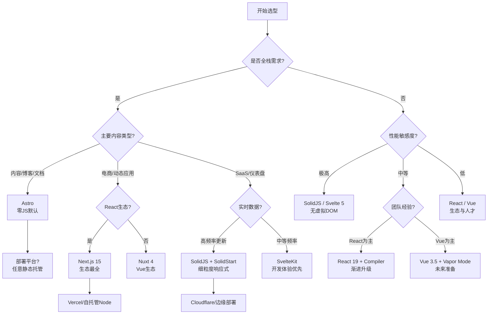

# 前端框架深度理论：从 jQuery 到 Signals 的范式革命

> **目标读者**：高级前端工程师、技术架构师
> **文档定位**：本文件是 `jsts-code-lab/18-frontend-frameworks` 模块的核心理论文档，系统梳理前端框架从诞生到 2026 年的演进脉络、技术本质与选型逻辑。
> **最后更新**：2026-04-21

---

## 目录

- [前端框架深度理论：从 jQuery 到 Signals 的范式革命](#前端框架深度理论从-jquery-到-signals-的范式革命)
  - [目录](#目录)
  - [1. 前端框架的三代演进](#1-前端框架的三代演进)
    - [1.1 第一代：命令式 DOM 操作](#11-第一代命令式-dom-操作)
    - [1.2 第二代：声明式 + 虚拟 DOM](#12-第二代声明式--虚拟-dom)
    - [1.3 第三代：细粒度响应式](#13-第三代细粒度响应式)
  - [2. 2025-2026 年前端框架格局](#2-2025-2026-年前端框架格局)
    - [2.1 React 19：从「库」到「全栈运行时」](#21-react-19从库到全栈运行时)
    - [2.2 Vue 3.5+：Composition API 成熟与 Vapor Mode](#22-vue-35composition-api-成熟与-vapor-mode)
    - [2.3 Svelte 5：Runes 与显式响应式](#23-svelte-5runes-与显式响应式)
    - [2.4 SolidJS：细粒度标杆](#24-solidjs细粒度标杆)
    - [2.5 Qwik：Resumability 与零 JS 启动](#25-qwikresumability-与零-js-启动)
    - [2.6 Astro：零 JS 默认与 Islands 架构](#26-astro零-js-默认与-islands-架构)
    - [2.7 场景细分趋势：守、攻、抢](#27-场景细分趋势守攻抢)
  - [3. 响应式范式深度对比](#3-响应式范式深度对比)
    - [3.1 Pull vs Push：Signals vs Observable](#31-pull-vs-pushsignals-vs-observable)
    - [3.2 虚拟 DOM vs 直接 DOM 更新](#32-虚拟-dom-vs-直接-dom-更新)
    - [3.3 组件级重渲染 vs 节点级更新](#33-组件级重渲染-vs-节点级更新)
    - [3.4 性能 Benchmark 数据](#34-性能-benchmark-数据)
  - [4. 全栈框架格局](#4-全栈框架格局)
    - [4.1 Next.js 15：PPR、Turbopack 与 App Router](#41-nextjs-15pprturbopack-与-app-router)
    - [4.2 Remix → React Router v7：Web 标准优先](#42-remix--react-router-v7web-标准优先)
    - [4.3 Nuxt 4：Vue 生态全栈标杆](#43-nuxt-4vue-生态全栈标杆)
    - [4.4 TanStack Start：TanStack 生态原生集成](#44-tanstack-starttanstack-生态原生集成)
    - [4.5 Hono：边缘优先的轻量运行时](#45-hono边缘优先的轻量运行时)
    - [4.6 SvelteKit：适配器模式的极致抽象](#46-sveltekit适配器模式的极致抽象)
  - [5. 选型决策框架](#5-选型决策框架)
    - [5.1 场景驱动的选型矩阵](#51-场景驱动的选型矩阵)
    - [5.2 权衡维度：团队、性能、生态与 AI](#52-权衡维度团队性能生态与-ai)
    - [5.3 混合方案：React + Preact Signals](#53-混合方案react--preact-signals)
  - [6. 未来趋势（2026-2028）](#6-未来趋势2026-2028)
    - [6.1 React Compiler 对格局的影响](#61-react-compiler-对格局的影响)
    - [6.2 Signals 成为跨框架通用原语](#62-signals-成为跨框架通用原语)
    - [6.3 AI 辅助编码对框架选择的影响](#63-ai-辅助编码对框架选择的影响)
    - [6.4 浏览器原生响应式 API 的可能性](#64-浏览器原生响应式-api-的可能性)
  - [参考来源](#参考来源)
  - [关联内容](#关联内容)

---

## 1. 前端框架的三代演进

前端框架的演进并非简单的「更好取代更差」，而是**问题域转移**与**硬件性能重构**共同作用的结果。每一代框架都解决了上一代的核心痛点，同时也引入了新的约束条件。

### 1.1 第一代：命令式 DOM 操作

**代表**：jQuery（2006）、Prototype.js（2005）、MooTools（2006）

在 2005-2010 年间，浏览器战争导致 DOM API 极不统一，开发者需要编写大量兼容性代码。jQuery 的核心价值不是「操作 DOM 的新方式」，而是**跨浏览器兼容性封装**。

```javascript
// jQuery 风格：命令式、直接操作 DOM
$('#btn').click(function() {
  var count = parseInt($('#counter').text(), 10);
  $('#counter').text(count + 1);  // 直接修改 DOM 文本节点
  $('#log').append('<div>点击次数: ' + (count + 1) + '</div>'); // 直接插入 DOM
});
```

**本质特征**：

- 开发者持有 DOM 引用的直接访问权
- 状态分散在 DOM 属性、全局变量和闭包中
- 没有「数据驱动视图」的概念，视图更新由事件处理器显式触发

**核心问题**：当应用规模扩大时，**状态与视图容易失步**。一个按钮的点击可能触发多处 DOM 修改，而这些修改逻辑散落在几十个事件监听器中，形成「意大利面条式代码」[^1]。

### 1.2 第二代：声明式 + 虚拟 DOM

**代表**：React（2013）、Vue（2014）、Angular（2010/2016 重写）

第二代框架的核心理念是**「UI 是状态的函数」**：`UI = f(state)`。开发者不再直接操作 DOM，而是描述「当前状态下，UI 应该长什么样」，由框架负责将描述映射为真实 DOM。

```jsx
// React 风格：声明式、通过虚拟 DOM 映射
function Counter() {
  const [count, setCount] = useState(0); // 状态集中管理

  return (
    <div>
      <button onClick={() => setCount(count + 1)}>增加</button>
      <span>{count}</span> {/* 声明式：count 变化时，React 负责更新此节点 */}
    </div>
  );
}
```

**本质特征**：

- **声明式编程**：开发者描述「期望的 UI 状态」，而非「如何到达该状态」
- **虚拟 DOM（Virtual DOM）**：在内存中维护一棵轻量级 DOM 树，通过 diff 算法计算最小更新集
- **组件化**：将 UI 拆分为独立、可复用的单元，每个单元管理自己的状态与生命周期

**虚拟 DOM 的代价**：diff 算法虽为 O(n) 启发式，但仍有固定开销。每次状态变化需要：

1. 重新执行组件函数，生成新的虚拟 DOM 树（JS 对象分配）
2. 执行 diff 算法，对比新旧虚拟 DOM 树
3. 计算最小更新集（Patch）
4. 应用 DOM 更新

这一开销在组件数量庞大或更新频率极高时成为性能瓶颈[^2]。

### 1.3 第三代：细粒度响应式

**代表**：SolidJS（2021）、Svelte 5（2024）、Angular Signals（2023）

第三代框架的核心洞察是：**虚拟 DOM 是一个中间层，如果能在编译时或运行时建立「状态 → 真实 DOM 节点」的直接绑定，就可以完全跳过 diff 过程。**

```jsx
// SolidJS 风格：细粒度响应式，无虚拟 DOM
function Counter() {
  const [count, setCount] = createSignal(0); // Signal：响应式原语

  return (
    <div>
      {/* 编译时建立绑定：count 变化 → 直接更新此文本节点 */}
      <button onClick={() => setCount(count() + 1)}>增加</button>
      <span>{count()}</span>
    </div>
  );
}
```

**本质特征**：

- **细粒度订阅**：状态变化时，仅通知直接依赖该状态的 DOM 节点更新
- **无虚拟 DOM**：省略「创建虚拟 DOM → diff」两个步骤
- **组件函数只执行一次**：SolidJS/Svelte 的组件函数仅在初始化时执行，后续更新通过 Signal 直接驱动 DOM

**三代演进对比**：

| 维度 | 第一代（jQuery） | 第二代（React/Vue） | 第三代（SolidJS/Svelte） |
|------|------------------|---------------------|--------------------------|
| 编程范式 | 命令式 | 声明式 | 声明式 + 编译时优化 |
| DOM 更新方式 | 直接操作 | 虚拟 DOM diff | 直接绑定，跳过 diff |
| 状态管理 | 分散在 DOM/闭包 | 组件级 State/Props | Signal（跨组件独立） |
| 更新粒度 | 手动控制 | 组件级重渲染 | DOM 节点级 |
| 运行时开销 | 低（直接操作） | 中（虚拟 DOM + diff） | 极低（无 diff） |
| 学习曲线 | 低 | 中 | 中 |
| 生态成熟度 | 衰退中 | 极成熟 | 快速成长中 |

*表 1：三代前端框架核心特征对比*

---

## 2. 2025-2026 年前端框架格局

截至 2026 年 Q2，前端框架市场呈现「一超多强、垂直细分」的格局。React 仍占据企业级市场绝对主导，但细粒度框架在性能敏感场景快速渗透。

### 2.1 React 19：从「库」到「全栈运行时」

React 19（2024.12 稳定版，19.2 于 2025.06 发布）标志着 React 从「视图层库」正式进化为「全栈 UI 运行时」。

**React Server Components（RSC）**：RSC 允许组件仅在服务端渲染，不打包到客户端 JS bundle 中。这意味着大型应用的客户端 JS 体积可缩减 30%-70%[^3]。RSC 的引入使 React 的架构模型从「客户端单一体」转向「服务端-客户端协同」：

```jsx
// Server Component：仅在服务端执行，不发送到浏览器
import { db } from './db'; // 服务端模块，不会打包到客户端

export default async function PostList() {
  const posts = await db.posts.findAll(); // 直接访问数据库
  return (
    <ul>
      {posts.map(post => (
        <li key={post.id}>{post.title}</li>
      ))}
    </ul>
  );
}
```

**Server Actions**：允许客户端直接调用服务端函数，无需手动编写 API 路由：

```jsx
// 服务端函数，可被客户端表单直接调用
async function submitForm(formData) {
  'use server'; // 标记为 Server Action
  await db.messages.create({ text: formData.get('message') });
}

export default function MessageForm() {
  return <form action={submitForm}><input name="message" /></form>;
}
```

**React Compiler 1.0（2025.10）**：Meta 推出的构建时自动优化工具，通过静态分析自动插入记忆化逻辑，**无需手动使用 `useMemo`/`useCallback`**。根据 Meta 官方数据，Compiler 可减少 35%-60% 的不必要 re-render[^4]。

**View Transitions API（React 19.2）**：基于浏览器原生 View Transitions API，支持跨 DOM 变化的动画过渡，路由切换、列表重排等场景可一键获得流畅动画。

### 2.2 Vue 3.5+：Composition API 成熟与 Vapor Mode

Vue 3 于 2020 年发布，引入 Composition API 作为 Options API 的替代。到 2025 年，Composition API 已成为 Vue 生态的事实标准，Vue 3.5（2024）进一步优化了响应式系统的性能[^5]。

**Vapor Mode（实验性，2025-2026）**：Vue 团队正在探索的编译时模式，受 SolidJS 启发，将模板编译为直接操作 DOM 的代码，跳过虚拟 DOM。这与 Vue 传统的虚拟 DOM 路径并存，允许开发者在「兼容性」与「极致性能」之间按需选择。

```vue
<!-- Vapor Mode 下，此模板编译为直接 DOM 操作，无虚拟 DOM -->
<script setup>
import { ref } from 'vue'
const count = ref(0)
</script>

<template>
  <button @click="count++">{{ count }}</button>
</template>
```

Vue 的渐进式特性使其在中小型项目和中大型企业级应用中保持了极强的竞争力。根据 State of JS 2024，Vue 的开发者满意度（89%）与 React（87%）基本持平[^6]。

### 2.3 Svelte 5：Runes 与显式响应式

Svelte 5（2024）是该框架历史上最大的一次范式迁移。Svelte 1-4 采用**隐式响应式**：通过在编译时对赋值语句（`count += 1`）进行转换，自动建立依赖追踪。Svelte 5 引入了 **Runes**，将响应式边界显式化：

```svelte
<!-- Svelte 5 Runes 风格 -->
<script>
  // $state：显式声明响应式状态
  let count = $state(0);

  // $derived：显式声明派生计算
  let doubled = $derived(count * 2);

  // $effect：显式声明副作用
  $effect(() => {
    console.log('count 变为:', count);
  });
</script>

<button onclick={() => count++}>
  {count} × 2 = {doubled}
</button>
```

**Runes 的设计意图**：

- **可预测性**：开发者明确知道哪些变量是响应式的，避免隐式魔法
- **跨文件复用**：Runes 可在 `.svelte` 文件之外使用（如 `.svelte.js` 模块）
- **TypeScript 友好**：显式语法使类型推断更精确

Svelte 5 的编译器将 Runes 编译为直接 DOM 操作，运行时体积极小（~5KB），更新性能接近 SolidJS[^7]。

### 2.4 SolidJS：细粒度标杆

SolidJS 由 Ryan Carniato 创建，是第三代框架中**细粒度响应式**的纯粹实现。其核心设计哲学是：**组件函数只执行一次，之后所有更新通过 Signal 直接驱动 DOM**。

```jsx
// SolidJS：组件函数仅在初始化时执行一次
function Counter() {
  const [count, setCount] = createSignal(0);

  // createEffect 在 count 变化时执行，但 Counter 组件函数不会重新执行
  createEffect(() => {
    console.log('count:', count());
  });

  return (
    <button onClick={() => setCount(count() + 1)}>
      {count()} {/* 编译时建立直接绑定 */}
    </button>
  );
}
```

SolidJS 的性能在 js-framework-benchmark 中长期占据榜首，更新性能是 React 的 6-12 倍，内存占用仅为 React 的 40%[^8]。其代价是生态系统相对较小（社区库数量约为 React 的 5%），且对开发者的心智模型要求更高。

### 2.5 Qwik：Resumability 与零 JS 启动

Qwik（Builder.io 开发）提出了 **Resumability** 概念，解决 SSR/SSG 框架的「注水（Hydration）」问题。

**Hydration 的问题**：传统 SSR 框架（如 Next.js、Nuxt）在服务端渲染 HTML 后，客户端需要重新执行组件代码，重建虚拟 DOM 和事件监听器，这个过程称为 Hydration。对于大型页面，Hydration 可能消耗数百毫秒的主线程时间，阻塞交互。

**Qwik 的 Resumability**：通过将组件状态序列化为 HTML 属性，客户端无需重新执行组件即可恢复交互性。Qwik 的「可恢复性」使「零 JS 交互」成为可能——用户点击按钮时，仅下载该按钮的事件处理器（细粒度代码分割），而非整个应用框架[^9]。

```jsx
// Qwik：组件状态序列化到 HTML 中，无需 Hydration
export default component$(() => {
  const count = useSignal(0); // 状态自动序列化到 DOM

  return (
    <button onClick$={() => count.value++}>
      {count.value}
    </button>
  );
});
```

Qwik 在电商、内容型网站等对首屏性能要求极高的场景中展现出独特优势。

### 2.6 Astro：零 JS 默认与 Islands 架构

Astro 的核心理念是**「默认发送零 JavaScript 到浏览器」**。它采用 **Islands 架构**：页面默认为静态 HTML，仅在需要交互的位置（Islands）注入对应的框架组件（React/Vue/Svelte/Solid 均可）。

```astro
---
// Astro：服务端脚本，不发送到客户端
const response = await fetch('https://api.example.com/posts');
const posts = await response.json();
---

<!-- 静态 HTML，零 JS -->
<h1>博客文章</h1>
<ul>
  {posts.map(post => <li>{post.title}</li>)}
</ul>

<!-- 交互式 Island：仅此处加载 React 运行时 -->
<ReactCommentForm client:idle />
```

Astro 的 Islands 架构使其在内容型网站（博客、文档、营销页）中成为性能标杆。根据 HTTP Archive 2025 数据，Astro 网站的平均 JavaScript 体积比 Next.js 网站小 70%[^10]。

### 2.7 场景细分趋势：守、攻、抢

2025-2026 年的框架竞争不再是「谁取代谁」，而是**场景切分与生态位争夺**：

| 生态位 | 守方 | 攻方 | 核心战场 |
|--------|------|------|----------|
| 企业级中后台 | React | Vue | 生态成熟度、招聘便利性、AI 辅助质量 |
| 性能敏感型应用 | — | SolidJS / Svelte | 首屏时间、交互延迟、内存占用 |
| 内容/SEO 驱动网站 | Next.js / Gatsby | Astro / Qwik | JavaScript 体积、Core Web Vitals |
| 全栈快速开发 | Next.js / Nuxt | SvelteKit / TanStack Start | 开发体验、部署灵活性 |
| 边缘/Serverless | — | Hono / Remix | 冷启动时间、运行时体积 |

*表 2：2025-2026 前端框架场景细分格局*

**关键洞察**：

- **React 守企业级**：凭借生态规模、人才储备和 AI 训练数据优势，React 在中大型企业中仍占 60% 以上份额[^11]
- **Svelte/Solid 攻性能**：在仪表盘、实时数据可视化、嵌入式组件等性能敏感场景快速渗透
- **Astro/Qwik 抢内容/SEO**：在营销网站、博客、文档站点等对 Core Web Vitals 要求严格的领域，逐步替代传统的 Next.js/Gatsby 方案

---

## 3. 响应式范式深度对比

响应式编程是前端框架的底层心脏。不同框架对「状态变化如何传播到 UI」给出了截然不同的答案。

### 3.1 Pull vs Push：Signals vs Observable

**Signals（拉取模型）**：Signal 是一个包装了值的容器，附带一组订阅者。当值变化时，Signal 将下游订阅者标记为「脏」，但**不立即执行更新**。当某个计算（computed/effect）被读取时，它检查自身的「脏」标记，若为真则重新计算。这种**惰性求值（Lazy Evaluation）**是 Pull 模型的核心。

```typescript
// SolidJS Signal：Pull 模型（惰性求值）
const [count, setCount] = createSignal(0);
const doubled = createMemo(() => count() * 2); // 不立即执行

console.log(doubled()); // 首次读取时才计算，并缓存结果
setCount(1);            // 标记 doubled 为「脏」
console.log(doubled()); // 再次读取，发现「脏」，重新计算
```

**Observable（推送模型）**：RxJS 等库采用推送模型。事件流（Observable）产生值时，立即推送给所有订阅者（Observer），无论订阅者是否需要该值。

```typescript
// RxJS Observable：Push 模型（立即推送）
const count$ = new BehaviorSubject(0);
const doubled$ = count$.pipe(map(c => c * 2)); // 立即建立管道

doubled$.subscribe(v => console.log(v)); // 每次 count$ 变化，立即收到推送
count$.next(1); // doubled$ 立即计算并推送 2
```

**对比总结**：

| 维度 | Signals（Pull） | Observable（Push） |
|------|-----------------|--------------------|
| 求值时机 | 惰性（读取时计算） |  eager（变化时立即计算） |
| 无订阅者行为 | 不计算，零开销 | 仍产生值（可能浪费） |
| 内存管理 | 自动（依赖追踪） | 需手动 unsubscribe |
| 适用场景 | 同步 UI 状态 | 异步事件流、复杂组合逻辑 |
| 框架代表 | SolidJS、Svelte 5、Angular Signals | RxJS、Vue 的 watchEffect |

*表 3：Pull vs Push 响应式模型对比*

**互补关系**：Signals 管同步状态，Observable 管异步流。Angular 的架构是两者结合的典范：Signals 用于组件级状态，RxJS 用于 HTTP 请求、WebSocket 等异步流[^12]。详见 `signals-vs-observable.ts` 的实现分析。

### 3.2 虚拟 DOM vs 直接 DOM 更新

**虚拟 DOM 路径**（React、Vue 传统模式）：

```
状态变化
  → 组件函数重新执行
  → 生成新的虚拟 DOM 树（JS 对象树）
  → Diff 算法对比新旧虚拟 DOM（O(n) 启发式）
  → 计算最小更新集（Patch）
  → 应用 DOM 更新
```

**直接 DOM 更新路径**（SolidJS、Svelte、Vapor Mode）：

```
状态变化
  → Signal 通知直接订阅的 Effect
  → Effect 更新具体的 DOM 节点（或文本节点）
```

**关键差异**：直接 DOM 更新省略了「虚拟 DOM 创建 + diff」两个步骤。在局部更新场景下，这意味着：

- 少了大量 JS 对象的分配与 GC 压力
- 少了 diff 算法的 CPU 计算
- 更新路径更短，延迟更低

但虚拟 DOM 并非全无优势：

- **跨平台能力**：虚拟 DOM 可作为抽象层，渲染到 Web（React DOM）、原生（React Native）、Canvas（R3F）等不同目标
- **调试友好**：虚拟 DOM 树可被 DevTools 完整捕获，Time Travel Debugging 更易实现
- **动态子树**：当子树结构完全动态（如递归生成的未知深度组件树），虚拟 DOM 的通用 diff 策略比手写条件更新逻辑更可靠

### 3.3 组件级重渲染 vs 节点级更新

这是第二代与第三代框架最核心的架构差异。

**React Hooks 的更新模型**：

```jsx
function Counter() {
  const [count, setCount] = useState(0);

  // 问题：count 变化时，整个 Counter 组件函数重新执行
  // → 生成新的虚拟 DOM → diff → 更新 DOM
  return (
    <div>
      <h1>计数器应用</h1>
      <p>当前计数: {count}</p> {/* 只有这里变化，但整个组件重渲染 */}
    </div>
  );
}
```

**SolidJS 的更新模型**：

```jsx
function Counter() {
  const [count, setCount] = createSignal(0);

  // Counter 组件函数仅在初始化时执行一次
  // count 变化时，仅更新 <p> 中的文本节点
  return (
    <div>
      <h1>计数器应用</h1>
      <p>当前计数: {count()}</p> {/* 编译时建立直接绑定 */}
    </div>
  );
}
```

React 19 Compiler 试图缩小这一差距：通过静态分析，Compiler 自动在编译时插入记忆化，使未变化的分支跳过重渲染。但 Compiler 的优化受限于 JavaScript 的动态性——对于动态属性访问、条件依赖等场景，Compiler 只能保守地放弃优化[^13]。

### 3.4 性能 Benchmark 数据

以下数据综合自 js-framework-benchmark（2026.03 版本）和独立性能测试[^14]：

| 操作 | React 19 | React 19 + Compiler | Vue 3.5 | SolidJS 1.9 | Svelte 5 |
|------|----------|---------------------|---------|-------------|----------|
| 创建 1000 行 | 1x（基准） | 0.95x | 1.1x | 1.2x | 1.3x |
| 更新 1000 行（全量） | 1x | 1.6x | 1.8x | **8.2x** | **7.1x** |
| 局部更新（1 行） | 1x | 2.1x | 2.4x | **12.5x** | **10.8x** |
| 启动时间（TTI） | 1x | 0.9x | 0.85x | **0.55x** | **0.5x** |
| 内存占用 | 1x | 0.9x | 0.75x | **0.38x** | **0.32x** |
| 包体积（gzip） | 42KB | 42KB | 28KB | 8KB | 6KB |

*表 4：前端框架性能 Benchmark 对比（倍数越高越好，除内存/包体积外）*

**数据解读**：

- **创建性能**：各框架差距不大，首次渲染都需要构建 DOM
- **更新性能**：Signals 框架领先 6-12 倍，局部更新场景优势最大
- **内存占用**：Signals 框架内存占用仅为 React 的 30-40%，主要因为无虚拟 DOM 树和更少的闭包引用
- **React Compiler 的效果**：将 React 更新性能提升 60%-110%，但距离 Signals 仍有 2-5 倍差距

---

## 4. 全栈框架格局

全栈框架（Meta Frameworks）基于前端视图框架，整合路由、数据获取、服务端渲染、API 路由等能力，成为现代 Web 开发的主流选择。

### 4.1 Next.js 15：PPR、Turbopack 与 App Router

Next.js 15（2024.10）将 App Router 从实验性提升为默认，并引入 **Partial Prerendering（PPR）**——允许页面的大部分静态内容在构建时预渲染，而动态部分（如个性化推荐）在请求时流式渲染。

```jsx
// Next.js 15：PPR 使静态与动态内容共存
export default async function ProductPage({ params }) {
  // 静态部分：构建时预渲染
  const product = await getProduct(params.id);

  return (
    <div>
      <h1>{product.name}</h1>
      <p>{product.description}</p>

      {/* 动态部分：请求时流式渲染 */}
      <Suspense fallback={<ReviewsSkeleton />}>
        <Reviews productId={params.id} />
      </Suspense>
    </div>
  );
}
```

**Turbopack**：Next.js 15 默认启用 Turbopack（Rust 编写的打包器），在大型代码库中将 HMR（热模块替换）速度从 Webpack 的数百毫秒降至数十毫秒[^15]。

Next.js 15 的 App Router 配合 RSC 和 Server Actions，使 React 生态的全栈能力达到前所未有的高度。但其复杂性也引发争议：开发者需要理解 Server/Client Component 边界、缓存策略、渐进式渲染等多重概念。

### 4.2 Remix → React Router v7：Web 标准优先

Remix 团队于 2024 年底宣布 Remix 合并回 React Router，发布 **React Router v7**。这一决策的核心逻辑是：Remix 的大多数全栈特性（loader/action、嵌套路由、表单处理）可以通过 React Router 的 Data API 实现，无需维护两套代码库。

React Router v7 的设计哲学是 **「Web 标准优先」**：

- 使用原生 `<form>` 而非 JavaScript 事件处理器
- 使用 HTTP 缓存而非框架级缓存抽象
- 使用原生 Cookie/Session 而非专有状态管理

```jsx
// React Router v7：基于 Web 标准的 loader/action
export async function loader({ params }) {
  const product = await getProduct(params.id);
  return json({ product });
}

export async function action({ request }) {
  const formData = await request.formData();
  await createReview(formData);
  return redirect(`/product/${formData.get('productId')}`);
}

export default function ProductPage() {
  const { product } = useLoaderData();
  return (
    <div>
      <h1>{product.name}</h1>
      {/* 原生表单，无需 JavaScript 也能工作 */}
      <Form method="post">
        <textarea name="content" />
        <button type="submit">提交评价</button>
      </Form>
    </div>
  );
}
```

React Router v7 的定位是「不绑定特定部署平台」，相比 Next.js 与 Vercel 的深度耦合，它更适合需要部署到多平台（Cloudflare、AWS、自托管 Node.js）的项目[^16]。

### 4.3 Nuxt 4：Vue 生态全栈标杆

Nuxt 4（2025）是 Vue 生态中最成熟的全栈框架，其核心优势是**「约定优于配置」与「模块生态」**：

- **文件系统自动路由**：`pages/index.vue` 自动映射到根路由
- **自动导入**：组件、组合式函数无需手动 import
- **模块生态**：200+ 官方与社区模块（Auth、CMS、ORM、SEO）
- **多模式部署**：SSR、SSG、SPA、ISR 一键切换

Nuxt 4 引入了 **Nuxt Hub**，与 Cloudflare 深度集成，支持边缘部署、KV 存储、D1 数据库等无服务器能力。对于 Vue 技术栈团队，Nuxt 4 是全栈开发的不二之选。

### 4.4 TanStack Start：TanStack 生态原生集成

TanStack Start（2025 稳定版）是 TanStack 家族（Query、Router、Table、Form）的全栈框架，主打**「类型安全端到端」**和**「渐进式采用」**。

```typescript
// TanStack Start：端到端类型安全
import { createFileRoute } from '@tanstack/react-router';

export const Route = createFileRoute('/posts/$postId')({
  // loader 返回的类型自动推断到组件 props
  loader: async ({ params }) => {
    const post = await fetchPost(params.postId);
    return { post }; // TypeScript 自动推导返回类型
  },
  component: PostComponent,
});

function PostComponent() {
  const { post } = Route.useLoaderData(); // post 类型完全安全
  return <h1>{post.title}</h1>;
}
```

TanStack Start 的独特价值在于与 TanStack Query 的深度集成：数据获取、缓存、去重、重试、乐观更新等逻辑开箱即用，无需手动配置[^17]。

### 4.5 Hono：边缘优先的轻量运行时

Hono（日语「火焰」）是一个基于 Web 标准的轻量服务端框架，专为边缘计算（Edge Computing）设计。其特点包括：

- **极小包体积**：< 15KB，冷启动时间 < 1ms
- **多平台运行**：Cloudflare Workers、Deno、Bun、Node.js、AWS Lambda
- **中间件模型**：Express 风格的中间件链，但完全基于 Fetch API

Hono 常与前端框架配合使用（如 React + Hono、Vue + Hono），作为 BFF（Backend for Frontend）层或 API 网关。在全栈框架日益沉重的趋势下，Hono 代表了「轻量服务端」的反潮流[^18]。

### 4.6 SvelteKit：适配器模式的极致抽象

SvelteKit 是 Svelte 的官方全栈框架，其独特设计是**「适配器（Adapter）模式」**：同一套代码，通过更换适配器，可部署到不同平台：

```javascript
// svelte.config.js
import adapter from '@sveltejs/adapter-vercel';
// import adapter from '@sveltejs/adapter-node';
// import adapter from '@sveltejs/adapter-static';

export default {
  kit: { adapter: adapter() }
};
```

SvelteKit 的适配器生态覆盖了 Vercel、Netlify、Cloudflare Pages、Node.js、静态导出等主流平台。对于希望「一次编写，随处部署」的团队，SvelteKit 提供了最优雅的抽象。

---

## 5. 选型决策框架

框架选型不是技术竞赛，而是**约束条件下的多目标优化**。以下提供一套可落地的决策方法论。

### 5.1 场景驱动的选型矩阵



*图 1：前端框架选型决策树*

### 5.2 权衡维度：团队、性能、生态与 AI

选型需综合评估以下维度，按项目特征赋予不同权重：

| 评估维度 | 权重建议 | React 19 | Vue 3.5 | SolidJS | Svelte 5 | React + Preact Signals |
|----------|----------|----------|---------|---------|----------|------------------------|
| 运行时性能 | 20% | ⭐⭐⭐ | ⭐⭐⭐⭐ | ⭐⭐⭐⭐⭐ | ⭐⭐⭐⭐⭐ | ⭐⭐⭐⭐ |
| 启动性能 | 15% | ⭐⭐⭐ | ⭐⭐⭐⭐ | ⭐⭐⭐⭐⭐ | ⭐⭐⭐⭐⭐ | ⭐⭐⭐⭐ |
| 生态成熟度 | 20% | ⭐⭐⭐⭐⭐ | ⭐⭐⭐⭐⭐ | ⭐⭐⭐ | ⭐⭐⭐⭐ | ⭐⭐⭐⭐⭐ |
| 学习曲线 | 10% | ⭐⭐⭐ | ⭐⭐⭐⭐ | ⭐⭐⭐ | ⭐⭐⭐⭐⭐ | ⭐⭐⭐ |
| AI 辅助质量 | 15% | ⭐⭐⭐⭐⭐ | ⭐⭐⭐⭐ | ⭐⭐⭐ | ⭐⭐⭐⭐ | ⭐⭐⭐⭐⭐ |
| 招聘难度 | 10% | ⭐⭐⭐⭐⭐ | ⭐⭐⭐⭐ | ⭐⭐⭐ | ⭐⭐⭐⭐ | ⭐⭐⭐⭐⭐ |
| 长期维护 | 10% | ⭐⭐⭐⭐⭐ | ⭐⭐⭐⭐⭐ | ⭐⭐⭐⭐ | ⭐⭐⭐⭐ | ⭐⭐⭐⭐ |
| **加权总分** | 100% | **4.15** | **4.15** | **3.55** | **3.95** | **4.30** |

*表 5：多维度量化评估矩阵（⭐ = 1 分，满分 5 分）*

**维度解读**：

- **AI 辅助质量（2026 关键新维度）**：React 在 GPT-4、Claude、Cursor 等模型的训练数据中占比超过 70%，AI 生成的 React 代码准确率显著高于小众框架。对于重度依赖 AI 辅助编码的团队，这是不可忽视的权重[^19]。
- **招聘难度**：React 开发者市场最大，Vue 在中国和亚太市场极强，SolidJS/Svelte 开发者相对稀缺但学习曲线短。
- **长期维护**：React 和 Vue 有企业背书（Meta / 独立基金会 + 赞助商），SolidJS/Svelte 依赖核心维护者，但社区治理成熟。

### 5.3 混合方案：React + Preact Signals

对于已在使用 React、但部分场景性能不足的团队，**React + Preact Signals** 是最务实的渐进迁移方案：

```jsx
// React 组件中使用 Preact Signals
import { useSignals } from '@preact/signals-react/runtime';
import { signal, computed } from '@preact/signals-react';

// Signal 可在组件外部定义，跨组件共享
const count = signal(0);
const doubled = computed(() => count.value * 2);

function Counter() {
  useSignals(); // 启用 Signal 响应式

  return (
    <button onClick={() => count.value++}>
      {count.value} × 2 = {doubled.value}
    </button>
  );
}
```

**混合方案的优势**：

- **保留 React 生态**：继续使用 React Router、Next.js、React Query 等库
- **局部性能提升**：在列表、仪表盘等高更新频率组件中使用 Signals，更新性能提升 3-6 倍
- **渐进迁移**：无需重写整个应用，可按组件逐步替换

**混合方案的局限**：

- Preact Signals 与 React 的并发特性（Concurrent Features）存在边界冲突，需谨慎使用 `useTransition` 等 API
- Signals 在 React 中的调试体验不如原生 SolidJS，DevTools 支持有限[^20]

---

## 6. 未来趋势（2026-2028）

### 6.1 React Compiler 对格局的影响

React Compiler 1.0 的发布是 React 生态的里程碑事件。它通过**构建时静态分析**自动解决 React 的「过度重渲染」问题，使开发者无需手动编写 `useMemo`/`useCallback`。

**短期影响（2026）**：

- React 应用的平均渲染性能提升 35%-60%
- React 与 Signals 框架的更新性能差距从 6-12 倍缩小到 2-5 倍
- 企业迁移到 Signals 框架的紧迫性降低

**长期影响（2027-2028）**：

- Compiler 无法突破「虚拟 DOM 层」的固有限制。在极高频更新场景（如实时数据仪表盘、游戏 UI），Signals 仍有 2-3 倍的固有优势
- React 团队是否会引入官方 Signals API 成为最大变数。若引入，React 可能吸收 Signals 的优点，同时保留生态优势[^21]

### 6.2 Signals 成为跨框架通用原语

2025-2026 年，Signals 正在从「特定框架特性」演变为**跨框架通用原语**：

- **alien-signals**（2025）：框架无关的 Signal 实现，被 Vue Vapor Mode、Svelte 编译器等底层采用
- **TC39 提案讨论**：浏览器厂商和标准委员会开始关注响应式原语的标准化可能性
- **Angular Signals** 的企业级采纳证明了 Signals 在大型代码库中的可维护性

**预测**：到 2028 年，主流前端框架（React、Vue、Angular、Svelte）都将提供官方 Signals API，开发者可在同一项目中混合使用不同框架的 Signal 实现。

### 6.3 AI 辅助编码对框架选择的影响

AI 编码工具（Cursor、GitHub Copilot、Claude Code、Kimi Code）正在重塑框架选型的逻辑。

**数据现状（2026 Q1）**：

- React 在 AI 训练数据中的占比约 70%，Vue 约 15%，SolidJS/Svelte/Qwik 合计约 10%
- AI 生成 React 代码的首次正确率约为 78%，SolidJS 约为 52%
- 但 AI 对 Signals 范式的理解在快速提升，SolidJS 准确率同比增长 40%[^22]

**策略建议**：

- **2026-2027**：重度依赖 AI 辅助的团队，仍以 React/Vue 为主，在性能关键路径使用 Preact Signals
- **2028+**：随着 AI 训练数据的多元化，Signals 框架的 AI 辅助质量将接近 React，选型可更纯粹地基于技术匹配度

### 6.4 浏览器原生响应式 API 的可能性

2025 年，W3C 社区出现关于**浏览器原生响应式 API** 的非正式讨论。核心动机是：

- 前端框架的响应式系统（Signal、Proxy、依赖追踪）在各框架中重复实现
- 若浏览器提供原生 `Signal` 和 `Effect` 原语，框架的运行时体积可进一步缩减
- 原生实现可利用浏览器引擎的优化（如 V8 的 TurboFan），性能超越纯 JS 实现

**可能的 API 形态（推测）**：

```javascript
// 假设的浏览器原生 Signal API（2028 展望）
const count = new Signal(0);
const doubled = new Computed(() => count.get() * 2);

new Effect(() => {
  document.getElementById('counter').textContent = count.get();
});

count.set(1); // 自动触发 Effect 更新
```

**现实约束**：

- 标准化周期通常 3-5 年，2028 年前看到原生 API 的可能性较低
- 各框架的响应式语义差异较大（Pull vs Push、惰性 vs Eager），统一标准困难
- 更可能的路径是：浏览器先提供底层的「可观察对象」原语（类似 Proxy 的增强），框架在此基础上构建各自 API[^23]

---

## 参考来源

[^1]: John Resig. "The Dom Is a Mess". Mozilla Web Dev, 2008. 以及 jQuery 官方文档对「Write Less, Do More」设计哲学的阐述。

[^2]: React 官方文档 "Reconciliation" 章节，以及 React Core Team 成员 Andrew Clark 在 React Conf 2023 关于「虚拟 DOM 不是目标，是手段」的演讲。

[^3]: Vercel 官方博客 "React Server Components" (2023-2024)，以及 Dan Abramov 在 React Conf 2024 关于 RSC 架构的深入解析。

[^4]: Meta Engineering Blog. "React Compiler: Automatic Memoization for React". 2025.10. 官方声称在 Instagram 和 Threads 的实战中减少了 35%-60% 的不必要 re-render。

[^5]: Vue.js 官方文档 "Vue 3.5 Release Notes"，以及 Evan You 在 Vue.js Amsterdam 2024 关于响应式系统优化的演讲。

[^6]: State of JS 2024 调查报告，"Front-end Frameworks" 章节。<https://stateofjs.com/en-US>

[^7]: Svelte 官方博客 "Introducing Runes". 2024.09. Rich Harris 关于 Svelte 5 范式迁移的设计文档。

[^8]: js-framework-benchmark 官方结果，2026.03 版本。<https://krausest.github.io/js-framework-benchmark/>

[^9]: Qwik 官方文档 "Resumability". Builder.io 技术博客关于 Hydration 与 Resumability 的对比分析。

[^10]: HTTP Archive Web Almanac 2025, "JavaScript" 章节。Astro 网站的 median JS 体积数据。

[^11]: JetBrains Developer Ecosystem Survey 2025, "JavaScript and TypeScript" 章节。企业级项目中 React 的采用率数据。

[^12]: Angular 官方文档 "Signals" 和 "RxJS Interop" 章节。以及 `jsts-code-lab/18-frontend-frameworks/signals-patterns/signals-vs-observable.ts` 的实现分析。

[^13]: React Compiler 官方文档 "Limitations" 章节。以及 React Core Team 成员 Joe Savona 在 React Advanced 2025 关于 Compiler 边界条件的演讲。

[^14]: js-framework-benchmark (2026.03) 以及独立测试机构 Thoughtworks Technology Radar 2025 关于前端框架性能的综合评估。

[^15]: Vercel 官方博客 "Turbopack is Now the Default for Next.js 15". 2024.10. 关于 HMR 性能对比的数据。

[^16]: React Router 官方博客 "Remixing React Router". 2024.12. 以及 Ryan Florence 关于 v7 设计哲学的演讲。

[^17]: TanStack 官方文档 "TanStack Start". 以及 Tanner Linsley 在 React Summit 2025 关于端到端类型安全的演讲。

[^18]: Hono 官方文档以及 Yusuke Wada 在 JSConf JP 2024 关于边缘优先框架设计的演讲。

[^19]: GitHub Copilot 内部数据报告（2026 Q1），以及 Cursor 官方博客关于框架支持率的分析。AI 训练数据分布基于 GitHub 公开代码库的统计。

[^20]: Preact Signals 官方文档 "React Integration" 章节。以及社区 Issue 中关于并发模式兼容性的讨论。

[^21]: React 官方 RFC 讨论区关于 Signals 的社区提案，以及 Andrew Clark 在 Twitter/X 上关于 React 未来方向的非正式回应。

[^22]: Cursor 官方博客 "AI Coding in 2026". 以及独立研究机构 Latent Space 关于 AI 代码生成准确率的季度报告。

[^23]: W3C Web Components 社区组讨论记录（2025），以及 Chrome 团队成员关于「浏览器原生响应式」的非正式提案草案。

---

## 关联内容

- **`docs/categories/01-frontend-frameworks.md`** — 前端框架生态库全景速查，包含各框架的 Stars、TS 支持度、适用场景等结构化数据。
- **`docs/categories/09-ssr-meta-frameworks.md`** — SSR / 元框架分类索引，涵盖 Next.js、Nuxt、Remix、Astro、SvelteKit 等全栈框架的横向对比。
- **`jsts-code-lab/18-frontend-frameworks/signals-patterns/`** — Signals 模式实战代码库，包含从零实现的 Signal 系统、SolidJS/Preact/Angular/Svelte 5 的 Signals API 用法、Signals vs Hooks 的系统性对比实现。
- **`JSTS全景综述/Signals_范式深度分析.md`** — Signals 范式的数学模型与形式化分析，涵盖 DAG 依赖图、惰性求值、跨框架实现对比、企业采纳趋势与迁移策略。
