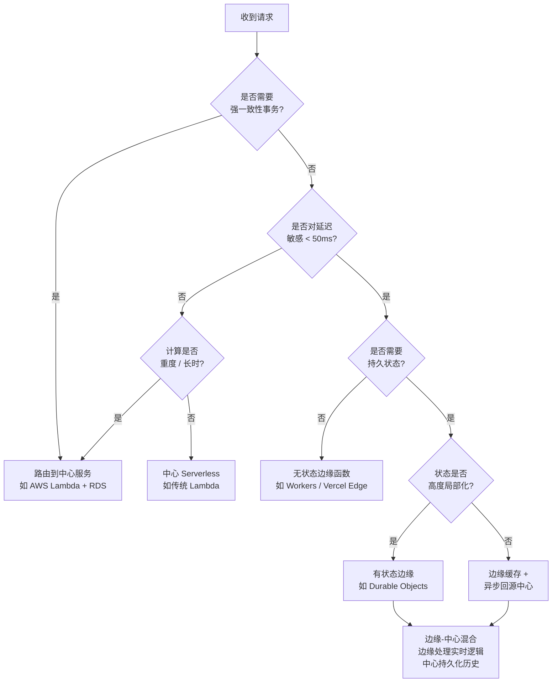

# 边缘计算深度理论：从 V8 Isolates 到边缘优先架构

> **目标读者**：高级后端工程师、云架构师、基础设施技术负责人
> **关联文档**：[`docs/categories/26-deployment-hosting.md`](../../docs/categories/26-deployment-hosting.md)、[`examples/edge-observability-starter/`](../../examples/edge-observability-starter/)、[`examples/fullstack-tanstack-start/`](../../examples/fullstack-tanstack-start/)
> **版本**：2026-04
> **字数**：约 6,500 字

---

## 1. 边缘计算的定义与演进

### 1.1 CDN 的演进：从静态分发到代码执行

内容分发网络（CDN）的发展可以清晰地划分为三个阶段，每一阶段都代表着计算力向用户侧的迁移：

- **CDN 1.0（1998–2008）：静态内容分发**
  以 Akamai、Limelight 为代表，核心能力是将图片、CSS、JavaScript 等静态资源缓存到离用户最近的 PoP（Point of Presence）节点。此阶段仅涉及存储与网络转发，不含任何计算逻辑。缓存命中时延约为 20–50 ms，未命中则回源 [Akamai Technical Whitepaper, 2005]。

- **CDN 2.0（2009–2018）：动态内容加速**
  Cloudflare、Fastly 引入边缘路由优化、TCP 优化、动态页面部分缓存（ESI，Edge Side Includes）。此时边缘节点仍然不执行业务代码，但可以通过配置规则（如 VCL）进行请求改写、重定向和简单过滤。Fastly 的 VCL 编译为 C 代码并在节点执行，标志着“边缘可编程”的雏形 [Fastly Documentation, 2016]。

- **边缘计算（2019–至今）：代码执行**
  Cloudflare Workers（2017 年发布，2018 年 GA）首次将完整 Turing-complete 的运行时部署到全球 300+ 城市的边缘节点上。开发者不再只是配置缓存规则，而是直接上传 JavaScript/TypeScript 代码，在离用户几毫秒的网络上执行任意业务逻辑。这标志着 CDN 从“内容分发”进化为“计算分发” [Cloudflare Blog, 2018]。

### 1.2 Serverless 的演进：从单区域到全球隔离体

Serverless 架构同样经历了代际跃迁：

- **Serverless 1.0：单区域函数**
  AWS Lambda（2014）、Azure Functions、Google Cloud Functions 采用容器或 MicroVM（Firecracker）技术，在特定区域的可用区（AZ）内执行代码。冷启动时延通常在 100 ms 到数秒之间，取决于运行时和 VPC 配置 [AWS Lambda Documentation, 2020]。函数实例无状态，持久化必须依赖同区域的 RDS、DynamoDB 或 S3。

- **Serverless 2.0：全球隔离体 + 边缘持久状态**
  Cloudflare Workers 采用 V8 Isolates 而非容器，单个 Isolate 可在全球任意节点于 <5 ms 内启动。更重要的是，Durable Objects（2020）和 Deno KV 提供了边缘原生（edge-native）的持久化能力——状态与计算共置，突破了传统 Serverless 必须回源到中心数据库的瓶颈 [Cloudflare Blog, 2020]。这种“计算跟着用户走，状态跟着计算走”的模型，重新定义了有状态服务的拓扑结构。

### 1.3 V8 Isolates 技术原理：为什么冷启动 <5ms？

V8 Isolates 是 Google V8 引擎提供的一种轻量级执行上下文。与传统的容器或虚拟机相比，其技术特征如下：

| 维度 | V8 Isolate | Linux 容器 | MicroVM (Firecracker) | 传统 VM |
|------|-----------|-----------|----------------------|---------|
| 启动时延 | < 1 ms | 100–500 ms | 50–150 ms | 30–60 s |
| 内存开销 | ~1–5 MB | 10–100 MB | 15–30 MB | 1–2 GB |
| 隔离级别 | 进程内沙箱 | 内核命名空间 | 硬件虚拟化 | 硬件虚拟化 |
| 多租户密度 | 数万/核 | 数百/核 | 数十/核 | 数台/物理机 |
| 安全边界 | V8 沙箱 + Spectre 缓解 | seccomp + cgroup | KVM | Hypervisor |

*表 1：V8 Isolate 与传统虚拟化技术的资源开销对比。数据综合自 [Cloudflare Blog, 2020] 与 [V8 Documentation, 2023]。*

**核心原理**：

1. **无操作系统初始化**：Isolate 运行于宿主机 V8 进程内部，不需要启动 Guest OS、systemd、libc 等层，省去了容器启动中最耗时的 Namespace 和 Cgroup 设置。
2. **快照（Snapshot）技术**：Cloudflare Workers 在编译阶段将 JavaScript 代码与用户依赖打包为 V8 Heap Snapshot。运行时只需将该 Snapshot 反序列化到内存，无需逐行解析与编译 [Cloudflare Blog, 2020]。
3. **进程级多路复用**：一个 V8 进程可同时托管数千个 Isolate，每个 Isolate 拥有独立的堆、全局对象和调用栈，但共享底层的 JIT 编译器与垃圾回收器。这种模型类似于“用户态线程”，调度开销极低。
4. **Spectre 缓解**：由于 Isolate 共享进程地址空间，Cloudflare 实施了 Site Isolation 风格的边界检查、指针混淆和定时器精度降级，以防止跨租户侧信道攻击 [Cloudflare Blog, 2019]。

---

## 2. 主流边缘平台深度对比

下表从运行时、冷启动时延、持久状态能力和适用场景四个维度，对当前主流边缘平台进行系统性对比：

| 平台 | 运行时 | 冷启动 | 持久状态 | 适用场景 |
|------|--------|--------|---------|---------|
| **Cloudflare Workers** | V8 Isolates | < 5 ms | Durable Objects / D1 / KV / R2 | 通用边缘计算、全球有状态服务、实时协作 |
| **Vercel Edge Functions** | Node.js 子集（Edge Runtime） | ~ 50 ms | KV / Edge Config / Postgres | Next.js 集成、边缘渲染、A/B 测试 |
| **Deno Deploy** | Deno 2 | ~ 20 ms | Deno KV / Deno Queues | Deno 生态全栈应用、原生 TS 支持 |
| **Netlify Edge Functions** | Deno | ~ 30 ms | Blob / Blob Store | 静态站点增强、表单处理、身份验证代理 |
| **AWS Lambda@Edge** | Node.js / Python | ~ 100 ms | CloudFront 缓存（无原生持久化） | AWS 生态深度集成、请求/响应改写 |
| **Fastly Compute** | WebAssembly（Wasm） | < 10 ms | KV Store / Config Store | 超低延迟缓存逻辑、安全过滤、WAF |

*表 2：主流边缘计算平台深度对比。冷启动数据为 2024–2025 年官方基准测试与社区实测的综合估算 [Vercel Docs, 2024; Deno Deploy Docs, 2024; AWS Lambda@Edge Docs, 2024; Fastly Documentation, 2024]。*

**关键洞察**：

- **Cloudflare Workers** 在冷启动和全球覆盖度上仍保持领先，Durable Objects 是目前唯一在边缘提供强一致性有状态抽象的商用平台。
- **Vercel Edge** 的 ~50 ms 冷启动主要受限于其 Edge Runtime 基于 Node.js 子集，需要额外的模块解析层；但其与 Next.js 的深度集成使其在前端生态中不可替代。
- **AWS Lambda@Edge** 仍基于传统的 Firecracker MicroVM，冷启动 ~100 ms，且每个 AWS 区域仅部署到 CloudFront 边缘子集（非全部 400+ PoP），在严格意义上的“边缘密度”上弱于 Cloudflare。
- **Fastly Compute** 采用 WebAssembly 作为编译目标，支持 Rust、Go、JavaScript 等多种源语言，冷启动极低，但开发体验和学习曲线相对陡峭。

---

## 3. 边缘优先架构设计方法论

### 3.1 边缘 vs 中心：业务逻辑该放在哪里？

并非所有逻辑都适合边缘执行。边缘节点的核心优势是**低延迟**和**地理分布**，但代价是**计算资源受限**（CPU 时间、内存、包体积）和**一致性约束**。以下是逻辑放置的基本原则：

| 逻辑类型 | 推荐位置 | 理由 |
|---------|---------|------|
| 身份验证与授权（JWT 验证） | 边缘 | 无状态、计算轻量、可阻止非法请求回源 |
| A/B 测试与流量分配 | 边缘 | 低延迟决策、减少中心负载 |
| 个性化内容渲染（Edge SSR） | 边缘 | 减少 TTFB（Time to First Byte），提升 SEO |
| 复杂业务事务（订单、支付） | 中心 | 需要强一致性、分布式事务、长时运行 |
| 大数据聚合与分析 | 中心 | 边缘内存与 CPU 不足，且数据跨节点分散 |
| 实时协作状态同步 | 边缘 + 中心混合 | WebSocket 由 Durable Objects 托管，历史数据归档到中心 |

*表 3：业务逻辑放置决策矩阵。*

### 3.2 数据一致性：边缘缓存 vs 强一致性

边缘环境中的数据一致性是一个核心权衡。常见的三种一致性模型如下：

1. **最终一致性（Eventual Consistency）**：KV 存储（如 Cloudflare KV、Vercel KV）采用此模型。写入后在全球节点间异步复制，通常 60 秒内全局生效。适用于配置项、A/B 测试开关、非关键缓存 [Cloudflare KV Documentation, 2024]。

2. **强一致性（Strong Consistency）**：Durable Objects 通过单线程事件循环和全局唯一 ID 路由，保证每个 Object 的所有请求都路由到同一个边缘节点上的同一个 Isolate 实例，从而实现线性一致性（linearizability）。代价是单对象吞吐量受限于单核性能，且无法水平分片同一个 Object [Cloudflare Durable Objects Documentation, 2024]。

3. **因果一致性（Causal Consistency）**：Deno KV 支持基于版本向量的因果一致性，适合协作编辑等需要保留操作因果关系的场景 [Deno KV Documentation, 2024]。

### 3.3 有状态边缘：Durable Objects 的设计模式

Durable Objects（DO）是 Cloudflare 提供的边缘有状态原语。其设计模式包括：

- **单例协调器（Singleton Coordinator）**：一个全局唯一的 DO 实例管理游戏房间、聊天室或文档的编辑锁。所有客户端通过 WebSocket 连接到该 DO，状态完全在内存中维护，延迟 < 10 ms [Cloudflare Durable Objects Documentation, 2024]。
- **分片计数器（Sharded Counter）**：为突破单 DO 的吞吐量限制，可将计数逻辑按用户 ID 哈希分片到多个 DO，读取时聚合。
- **会话亲和性（Session Affinity）**：利用 DO 的`idFromName`或`idFromString` API，确保同一用户始终路由到同一 DO 实例，从而复用连接状态与本地缓存。

### 3.4 边缘-中心混合架构的决策树

以下 Mermaid 图表展示了在架构设计时如何选择边缘、中心或混合部署：



*图 1：边缘-中心混合架构决策树。该决策树基于延迟、一致性、计算复杂度和状态局部化四个维度。*

### 3.5 边缘函数的成本模型分析

边缘平台的计费模型与传统云函数存在本质差异：

- **Cloudflare Workers**：按 CPU 时间计费（每百万请求 $0.30，超出后按每 GB·s $0.12），而非分配内存×运行时间。这意味着 I/O 等待时间（如等待 KV 返回）不计入费用，对高并发 I/O 密集型服务极为有利 [Cloudflare Pricing, 2024]。
- **Vercel Edge**：按请求数和执行时间计费，免费额度 generous，但超出后每百万请求 $2.00，且对最大执行时间（30s）有严格限制 [Vercel Pricing, 2024]。
- **AWS Lambda@Edge**：沿用 Lambda 的计费模型，按请求数和 GB·s 计费，且没有免费额度。由于冷启动高，实际成本往往高于 Workers [AWS Lambda Pricing, 2024]。

**经济账示例**：一个日均 10 亿次请求的 API 网关，若平均每次执行 5 ms（128 MB 等效），在 Workers 上的月成本约为 $900（CPU 时间），而在 Lambda@Edge 上约为 $4,500（GB·s 计费包含 I/O 等待）。

---

## 4. 边缘计算的安全模型

### 4.1 隔离性：V8 Isolates vs 容器 vs VM

多租户隔离是边缘计算的第一性原理问题。下表对比了三种隔离技术的安全特性：

| 特性 | V8 Isolates | Linux 容器 (gVisor) | MicroVM (Firecracker) |
|------|------------|--------------------|----------------------|
| 攻击面 | V8 引擎 + 沙箱逻辑 | 宿主内核 + gVisor Sentry | KVM + 极简内核 |
| 侧信道防护 | 定时器降级 + 指针混淆 | 独立内核页表 | 独立内核页表 |
| 逃逸历史 | 无公开逃逸（至 2025） | 偶有 CVE | 无公开逃逸 |
| 启动密度 | 极高 | 中 | 低 |
| 适用场景 | 高并发、低延迟、代码可信 | 不可信代码、自定义二进制 | 通用 Serverless |

*表 4：多租户隔离技术安全对比。V8 Isolates 的侧信道缓解策略详见 [Cloudflare Blog, 2019]；Firecracker 的安全模型见 [AWS Firecracker Documentation, 2020]。*

**关键结论**：V8 Isolates 的隔离强度弱于硬件虚拟化，但 Cloudflare 通过以下措施补偿：

- 仅允许 JavaScript/WebAssembly 代码，禁止原生系统调用；
- 所有 I/O 必须通过宿主代理的异步 API；
- Spectre 缓解包括定时器精度限制为 5 ms、SharedArrayBuffer 禁用、以及进程级 Site Isolation。

### 4.2 密钥管理：边缘环境中如何安全存储 API Key

边缘函数无文件系统、无环境变量注入（传统意义上），密钥管理需采用专用方案：

1. **Cloudflare Secrets**：通过 `wrangler secret put` 将密钥加密存储，运行时通过 `env.MY_SECRET` 注入。密钥在传输和静态存储中均加密，且不会出现在代码或日志中 [Cloudflare Workers Documentation, 2024]。
2. **Deno Deploy Environment Variables**：在 Deno Deploy Dashboard 中配置环境变量，运行时通过 `Deno.env.get()` 读取，同样加密存储 [Deno Deploy Documentation, 2024]。
3. **Vault-less 模式**：对于高吞吐场景，可使用短生存期 JWT（由中心签发，边缘验证），边缘节点无需持有任何长期密钥。

**反模式**：将 API Key 硬编码在 TypeScript 源码中，或提交到 Git 仓库。即使仓库私有，一旦代码被打包到客户端或泄露，密钥即暴露。

### 4.3 请求验证：JWT 在边缘的验证策略

JWT 验证是边缘函数最典型的安全职责。由于边缘节点靠近用户，在此处验证 JWT 可在恶意请求到达中心服务前将其拦截，显著降低中心负载。

```typescript
// Cloudflare Workers 上的 JWT 验证示例
// 使用 Web Crypto API（边缘原生支持，无需引入 jsonwebtoken 库）

import { importJWK, jwtVerify } from 'jose'; // jose 库基于 Web Crypto，边缘兼容

export interface Env {
  JWT_PUBLIC_KEY: string; // PEM 格式公钥，通过 wrangler secret 注入
}

export default {
  async fetch(request: Request, env: Env): Promise<Response> {
    const authHeader = request.headers.get('Authorization');
    if (!authHeader?.startsWith('Bearer ')) {
      return new Response('Unauthorized', { status: 401 });
    }

    const token = authHeader.slice(7);
    try {
      // 将 PEM 公钥导入为 CryptoKey
      const publicKey = await importJWK(
        JSON.parse(env.JWT_PUBLIC_KEY),
        'RS256'
      );

      // 验证签名、过期时间和发行者
      const { payload } = await jwtVerify(token, publicKey, {
        issuer: 'https://auth.example.com',
        audience: 'edge-api',
        clockTolerance: 30, // 允许 30 秒时钟偏移
      });

      // 将解析后的用户信息附加到请求头，透传给后端
      const modifiedRequest = new Request(request, {
        headers: {
          ...Object.fromEntries(request.headers),
          'X-User-Id': payload.sub as string,
          'X-User-Role': (payload.role as string) ?? 'user',
        },
      });

      return fetch(modifiedRequest);
    } catch (err) {
      return new Response('Invalid Token', { status: 403 });
    }
  },
};
```

*代码示例：基于 `jose` 和 Web Crypto API 的边缘 JWT 验证。选择 `jose` 而非 `jsonwebtoken` 的原因是后者依赖 Node.js `crypto` 模块，在 V8 Isolate 环境中不可用 [jose Documentation, 2024]。*

### 4.4 DDoS 防护：WAF + 边缘限流

边缘天然是 DDoS 防护的第一道防线。Cloudflare 的 Magic Transit 和 AWS Shield 均在边缘网络层（L3/L4）吸收攻击流量，而应用层（L7）的限流则需开发者自行实现：

```typescript
// 基于 Cloudflare Cache API 的简单令牌桶限流器
// 注意：生产环境应使用 Cloudflare Rate Limiting 产品或 Durable Objects

async function rateLimit(request: Request, env: Env): Promise<Response | null> {
  const clientIP = request.headers.get('CF-Connecting-IP');
  if (!clientIP) return null;

  const key = `rate-limit:${clientIP}`;
  const cache = caches.default;

  // 从边缘缓存读取当前计数
  const cached = await cache.match(new Request(`https://ratelimit.internal/${key}`));
  let count = 0;
  let resetAt = Date.now() + 60_000;

  if (cached) {
    const data = await cached.json<{ count: number; resetAt: number }>();
    count = data.count;
    resetAt = data.resetAt;
  }

  if (Date.now() > resetAt) {
    count = 0;
    resetAt = Date.now() + 60_000;
  }

  count += 1;
  if (count > 100) { // 每分钟 100 请求
    return new Response('Rate Limited', { status: 429 });
  }

  // 写回缓存（TTL 60 秒）
  await cache.put(
    new Request(`https://ratelimit.internal/${key}`),
    new Response(JSON.stringify({ count, resetAt }), {
      headers: { 'Cache-Control': 'max-age=60' },
    })
  );

  return null; // 未触发限流，继续处理
}
```

*代码示例：基于 Cache API 的边缘限流实现。该实现利用了边缘缓存的低延迟特性，但受限于缓存最终一致性，在高精度场景下应使用 Durable Objects [Cloudflare Cache API Documentation, 2024]。*

---

## 5. TypeScript 在边缘运行时的特殊性

### 5.1 不同平台的 TS 支持差异

TypeScript 在边缘环境中的支持并非一致，各平台的差异直接影响开发体验：

| 平台 | TS 支持方式 | 类型检查时机 | 装饰器 / 高级特性 | 备注 |
|------|-----------|-----------|----------------|------|
| **Cloudflare Workers** | `wrangler` 内置 esbuild | 构建时 | 实验性装饰器需配置 | 不支持 `*.ts` 直接运行，必须预编译 |
| **Vercel Edge** | Next.js / Turbopack 自动编译 | 构建时 | 支持 Stage 3 装饰器 | 与 Next.js 深度集成，配置隐藏 |
| **Deno Deploy** | 原生运行 TypeScript | 运行时可选 `--check` | 完整支持 TC39 Stage 3 | 唯一支持运行时 TS 解释的边缘平台 |
| **Netlify Edge** | Deno 原生 + Netlify CLI | 构建时 | 同 Deno | 通过 Netlify Dev CLI 本地模拟 |
| **Fastly Compute** | 需编译为 Wasm | 构建时（Rust/Go 为主） | 不适用 | JS/TS 通过 `js-compute-runtime` 编译 |

*表 5：各边缘平台 TypeScript 支持差异。Deno 的原生 TS 支持基于其内置的 `swc` 编译器，在 Deploy 环境中于首次请求时编译并缓存 [Deno Documentation, 2024]。*

### 5.2 包体积限制对依赖选择的影响

边缘平台对部署包体积有严格限制，这直接决定了依赖选择策略：

- **Cloudflare Workers**：免费版 1 MB（gzip 后），付费版 10 MB。超过限制需使用 Workers Bundler 的代码分割或动态导入 [Cloudflare Workers Limits, 2024]。
- **Vercel Edge Functions**：50 MB（未压缩），但较大的包会增加冷启动时延。
- **Deno Deploy**：无明确包体积限制，但较大的依赖会增加首次编译时间。

**依赖选择原则**：

1. **优先选择“边缘优先”库**：如 `hono`（轻量路由器，< 20 kB）、`jose`（JWT，零 Node.js 依赖）、`itty-router`。
2. **避免 polyfill 爆炸**：如 `jsonwebtoken` 依赖 `crypto` 和 `stream`，在边缘环境中需大量 polyfill，体积可能膨胀数倍。
3. **Tree-shaking 审查**：使用 `wrangler deploy --dry-run` 或 `esbuild --analyze` 检查最终包体积，剔除未使用的导出。
4. **原生 API 替代**：用 `fetch` 替代 `axios`，用 Web Crypto 替代 `crypto`，用 `URLPattern` 替代 `path-to-regexp`。

### 5.3 边缘环境中无法使用的 Node.js API

V8 Isolate 和 Deno 运行时均不提供完整的 Node.js 兼容性。以下 API 在边缘环境中**不可用**或**行为不一致**：

| Node.js API | 边缘可用性 | 替代方案 |
|------------|-----------|---------|
| `fs` / `path`（文件系统） | ❌ 不可用 | 使用 R2 / S3 / KV 进行对象存储；`path` 可用标准 `URL` API |
| `crypto`（Node.js 模块） | ❌ 不可用 | Web Crypto API (`crypto.subtle`) |
| `http` / `https` / `net` | ❌ 不可用 | 全局 `fetch()` |
| `stream`（Node.js 流） | ⚠️ 部分可用 | Web Streams API (`ReadableStream`, `WritableStream`) |
| `Buffer` | ⚠️ 部分可用 | `Uint8Array` 或 `new TextEncoder()` |
| `process.env` | ⚠️ 行为不同 | 平台特定环境变量注入（如 `env` 对象） |
| `require()` / `module` | ❌ 不可用 | ESM `import` 语法 |

*表 6：常见 Node.js API 在边缘环境中的可用性矩阵。数据基于 [Cloudflare Workers Runtime API, 2024] 和 [Deno Compatibility, 2024]。*

### 5.4 构建时 vs 运行时的类型处理

在边缘环境中，TypeScript 类型在构建后完全擦除，但某些“类型驱动”的开发模式需要特别注意：

- **运行时类型安全**：由于边缘环境无法使用 `ts-node` 或 `tsx` 等运行时类型检查工具，输入验证必须依赖 Zod、Valibot 或 JSON Schema 等运行时库。推荐使用 Zod 进行请求体验证：

```typescript
import { z } from 'zod'; // zod 在边缘环境完全兼容，体积小

const UserSchema = z.object({
  id: z.string().uuid(),
  email: z.string().email(),
  age: z.number().int().min(0).max(150),
});

// 在边缘函数中验证请求体
export async function handleUser(request: Request): Promise<Response> {
  const body = await request.json();
  const parsed = UserSchema.safeParse(body);

  if (!parsed.success) {
    return Response.json(
      { error: 'Validation Failed', issues: parsed.error.issues },
      { status: 400 }
    );
  }

  // parsed.data 具有完整的类型推导和运行时保证
  return Response.json({ user: parsed.data });
}
```

*代码示例：使用 Zod 在边缘环境中实现运行时类型安全。Zod 无 Node.js 原生依赖，完全基于标准 JavaScript，适合所有边缘平台 [Zod Documentation, 2024]。*

---

## 6. 实际架构模式

### 6.1 边缘渲染（Edge SSR）

边缘 SSR（Server-Side Rendering at the Edge）将 React/Vue/Solid 的渲染逻辑从中心服务器下沉到边缘节点，显著降低 TTFB。Next.js 的 Edge SSR 和 Remix 的 Cloudflare Workers 适配器是典型实现。

**架构要点**：

- HTML 在边缘节点动态生成，数据源可以是边缘 KV 或中心 API；
- 利用 `stale-while-revalidate` 缓存策略，将渲染结果缓存到边缘，兼顾动态性和性能；
- 对于个性化内容，使用 Edge Config 或 KV 存储用户细分规则，避免回源。

### 6.2 边缘 API 网关

将 API 网关功能（认证、限流、路由、协议转换）部署在边缘，可显著降低中心服务的攻击面和负载。

```typescript
// 边缘 API 网关模式：协议转换 + 统一认证
// 将 GraphQL 查询在边缘聚合多个 REST 后端

export default {
  async fetch(request: Request, env: Env): Promise<Response> {
    // 1. 边缘层认证
    const auth = await verifyJWT(request, env);
    if (!auth.ok) return auth.response;

    // 2. 路由匹配（基于 URLPattern）
    const pattern = new URLPattern({ pathname: '/api/:service/*?' });
    const match = pattern.exec(request.url);
    if (!match) return new Response('Not Found', { status: 404 });

    const service = match.pathname.groups.service;

    // 3. 边缘缓存检查
    const cacheKey = new Request(request.url, { method: 'GET' });
    const cached = await caches.default.match(cacheKey);
    if (cached && request.method === 'GET') return cached;

    // 4. 透传或聚合到后端
    const backendUrl = env[`BACKEND_${service.toUpperCase()}`];
    const backendResponse = await fetch(backendUrl, {
      method: request.method,
      headers: {
        ...Object.fromEntries(request.headers),
        'X-Internal-Auth': env.INTERNAL_TOKEN,
      },
      body: request.body,
    });

    // 5. 缓存 GET 响应
    if (request.method === 'GET') {
      await caches.default.put(cacheKey, backendResponse.clone());
    }

    return backendResponse;
  },
};
```

*代码示例：边缘 API 网关实现统一认证、路由和缓存。该模式参考了 [Cloudflare Workers Patterns, 2024] 和 Vercel Edge Middleware 设计。*

### 6.3 边缘缓存层（Stale-While-Revalidate）

SWR（Stale-While-Revalidate）是边缘缓存的核心策略，允许在缓存过期后仍返回旧数据（stale），同时在后台异步重新验证（revalidate）。

```typescript
// SWR 缓存策略实现
async function swrFetch(request: Request, ttlSeconds: number): Promise<Response> {
  const cache = caches.default;
  const cached = await cache.match(request);

  if (cached) {
    const age = parseInt(cached.headers.get('X-Cache-Age') ?? '0');
    if (age < ttlSeconds) {
      // 缓存仍新鲜，直接返回
      return cached;
    }
    // 缓存已过期，返回旧数据并在后台重新验证
    fetchAndCache(request, cache); // 不 await，后台执行
    return cached;
  }

  // 缓存未命中，同步获取并缓存
  return fetchAndCache(request, cache);
}

async function fetchAndCache(request: Request, cache: Cache): Promise<Response> {
  const response = await fetch(request);
  const enhanced = new Response(response.body, {
    status: response.status,
    statusText: response.statusText,
    headers: {
      ...Object.fromEntries(response.headers),
      'X-Cache-Age': '0',
      'Cache-Control': `max-age=${60 * 60 * 24}`, // 24 小时边缘缓存
    },
  });
  await cache.put(request, enhanced.clone());
  return enhanced;
}
```

*代码示例：边缘 SWR 缓存实现。SWR 策略在提升响应速度的同时，保证了数据的最终一致性 [RFC 5861, 2010; Cloudflare Cache API, 2024]。*

### 6.4 边缘 AI 推理

随着 ONNX Runtime Web 和 TensorFlow.js 的 Wasm 后端成熟，轻量级 AI 模型（如文本分类、嵌入向量生成、小语种翻译）可以在边缘执行：

- **嵌入向量生成**：使用轻量模型（如 `all-MiniLM-L6-v2` 的 ONNX 量化版，~20 MB）在边缘生成查询向量，直接对向量数据库（如 Cloudflare Vectorize、Pinecone Edge）进行相似性搜索，避免将原始文本传输到中心 AI 服务 [Cloudflare Vectorize Documentation, 2024]。
- **内容审核**：在边缘对用户生成内容（UGC）进行毒性检测，违规内容在到达存储层前即被拦截。
- **限制**：边缘 AI 受限于模型体积（通常 < 50 MB）和推理时延（复杂生成式模型如 LLM 仍不适合边缘）。

### 6.5 实时协作的边缘同步

基于 Durable Objects 的 WebSocket 托管，可实现 Google Docs 风格的实时协作：

```typescript
// Durable Object 实现的实时协作同步器
export class CollaborationRoom {
  private sessions: Map<string, WebSocket> = new Map();
  private doc: Y.Doc; // Yjs 文档，用于 CRDT 合并

  constructor(private state: DurableObjectState, private env: Env) {
    // 从持久化存储恢复文档状态
    this.doc = new Y.Doc();
  }

  async fetch(request: Request): Promise<Response> {
    const upgradeHeader = request.headers.get('Upgrade');
    if (upgradeHeader !== 'websocket') {
      return new Response('Expected websocket', { status: 400 });
    }

    const [client, server] = Object.values(new WebSocketPair());
    await this.handleSession(server);
    return new Response(null, { status: 101, webSocket: client });
  }

  private async handleSession(ws: WebSocket) {
    ws.accept();
    const sessionId = crypto.randomUUID();
    this.sessions.set(sessionId, ws);

    // 发送当前文档状态快照
    const stateVector = Y.encodeStateAsUpdate(this.doc);
    ws.send(stateVector);

    ws.addEventListener('message', (msg) => {
      // 应用客户端的 CRDT 更新
      const update = new Uint8Array(msg.data as ArrayBuffer);
      Y.applyUpdate(this.doc, update);

      // 广播给房间内其他客户端
      this.broadcast(update, sessionId);

      // 异步持久化到存储
      this.state.storage.put('doc', Y.encodeStateAsUpdate(this.doc));
    });

    ws.addEventListener('close', () => {
      this.sessions.delete(sessionId);
    });
  }

  private broadcast(update: Uint8Array, excludeId: string) {
    for (const [id, ws] of this.sessions) {
      if (id !== excludeId && ws.readyState === WebSocket.READY_STATE_OPEN) {
        ws.send(update);
      }
    }
  }
}
```

*代码示例：基于 Durable Objects 和 Yjs CRDT 的实时协作同步器。Yjs 的无冲突复制数据类型（CRDT）保证了边缘离线编辑的自动合并 [Yjs Documentation, 2024; Cloudflare Durable Objects WebSocket, 2024]。*

---

## 7. 成本与性能权衡

### 7.1 边缘函数 vs 传统服务器：TCO 分析

总拥有成本（TCO）不仅包含计算费用，还需考虑运维人力、带宽和机会成本：

| 成本维度 | 边缘函数（Workers） | 传统服务器（EC2 / ECS） | 中心 Serverless（Lambda） |
|---------|-------------------|----------------------|------------------------|
| 基础设施运维 | 无（全托管） | 高（补丁、扩容、监控） | 低（托管运行时） |
| 计算费用（每百万请求） | ~$0.30 | $0.50–$2.00（按实例） | ~$0.20 + GB·s |
| 带宽费用 | 通常包含在计算费中 | 额外计费（AWS 出口 $0.09/GB） | 额外计费 |
| 冷启动影响 | < 5 ms，可忽略 | 无（保持运行） | 100 ms–数秒，需Provisioned Concurrency |
| 全球部署成本 | 一次部署，全球生效 | 需多区域复制 + 负载均衡 | 需多区域部署 + 路由 |
| 扩展响应时间 | 瞬时 | 分钟级（Auto Scaling） | 秒级（并发扩容） |

*表 7：边缘函数、传统服务器与中心 Serverless 的 TCO 对比。 Workers 的带宽包含在请求费中，详见 [Cloudflare Pricing, 2024]；AWS 出口费用参考 [AWS Data Transfer Pricing, 2024]。*

**结论**：对于高并发、全球分布、I/O 密集型工作负载，边缘函数的 TCO 通常低于传统服务器和中心 Serverless。但对于长时运行、计算密集型任务（视频转码、大数据 ETL），传统服务器或容器仍具成本优势。

### 7.2 带宽成本优化策略

带宽是云成本中最容易被低估的部分。边缘计算通过以下机制优化带宽：

1. **就近响应**：用户请求在边缘节点完成处理，无需回源到中心区域，减少跨区域和跨大陆流量。以 AWS 为例，亚太地区到 us-east-1 的出口流量费用为 $0.09/GB，而边缘节点本地响应可避免该费用 [AWS Data Transfer Pricing, 2024]。
2. **边缘聚合**：将多个微服务调用在边缘合并为单一请求（Backend for Frontend 模式），减少客户端与后端之间的往返次数。
3. **压缩与编码**：边缘节点支持 Brotli / Gzip 动态压缩，且现代边缘平台支持 HTTP/3 和 QUIC，进一步降低有效传输体积 [Cloudflare HTTP/3, 2024]。

### 7.3 冷启动 vs 保持温热的经济账

传统 Serverless（Lambda）的冷启动问题催生了“保持温热”策略，即通过定时 Ping 或 Provisioned Concurrency 维持实例存活。但这在经济上是否合理？

- **Lambda Provisioned Concurrency**：每 GB 每小时 $0.000004646，一个 1 GB 函数全年保持温热的成本约为 $40.68 [AWS Lambda Pricing, 2024]。
- **Workers 冷启动**：< 5 ms，实际上无需“保持温热”，因为启动成本已低于网络往返时延。
- **Vercel Edge**：冷启动 ~50 ms，对于延迟敏感型业务（如电商结账），可考虑通过 Cron Trigger 定时预热关键路径。

**决策建议**：

- 如果平台冷启动 < 10 ms（Workers、Fastly）：无需预热，直接按需执行；
- 如果平台冷启动 50–100 ms（Vercel Edge、Lambda@Edge）：对关键路径实施边缘缓存或定时预热；
- 如果业务逻辑需要 > 30 s 的执行时间：不应放在边缘，改用中心容器或批处理服务。

---

## 参考与延伸阅读

1. Cloudflare Blog, 2018. *“Introducing Cloudflare Workers: Run JavaScript Service Workers at the Edge.”* <https://blog.cloudflare.com/introducing-cloudflare-workers/>
2. Cloudflare Blog, 2019. *“Mitigating Spectre and Other Security Threats: The Cloudflare Workers Security Model.”* <https://blog.cloudflare.com/mitigating-spectre-and-other-security-threats-the-cloudflare-workers-security-model/>
3. Cloudflare Blog, 2020. *“Cloudflare Workers Announces Durable Objects.”* <https://blog.cloudflare.com/introducing-workers-durable-objects/>
4. Cloudflare Durable Objects Documentation, 2024. <https://developers.cloudflare.com/durable-objects/>
5. Cloudflare KV Documentation, 2024. <https://developers.cloudflare.com/kv/>
6. Cloudflare Pricing, 2024. <https://workers.cloudflare.com/>
7. Vercel Documentation, 2024. *“Edge Runtime.”* <https://vercel.com/docs/functions/runtimes/edge-runtime>
8. Vercel Pricing, 2024. <https://vercel.com/pricing>
9. Deno Deploy Documentation, 2024. <https://deno.com/deploy/docs>
10. Deno KV Documentation, 2024. <https://deno.com/kv>
11. AWS Lambda@Edge Documentation, 2024. <https://docs.aws.amazon.com/lambda/latest/dg/lambda-edge.html>
12. AWS Lambda Pricing, 2024. <https://aws.amazon.com/lambda/pricing/>
13. AWS Data Transfer Pricing, 2024. <https://aws.amazon.com/ec2/pricing/on-demand/#Data_Transfer>
14. Fastly Documentation, 2024. <https://developer.fastly.com/>
15. V8 Documentation, 2023. *“Isolates.”* <https://v8.dev/docs/embed#contexts>
16. jose Documentation, 2024. <https://github.com/panva/jose>
17. Zod Documentation, 2024. <https://zod.dev/>
18. Yjs Documentation, 2024. <https://docs.yjs.dev/>
19. RFC 5861, 2010. *“HTTP Stale-While-Revalidate.”* <https://tools.ietf.org/html/rfc5861>
20. Akamai Technical Whitepaper, 2005. *“Content Delivery Networks: State of the Art.”*
21. AWS Firecracker Documentation, 2020. <https://firecracker-microvm.github.io/>

---

## 模块代码文件索引

本模块包含以下可运行 TypeScript 代码文件，用于将上述理论概念转化为实践：

- `edge-runtime.ts`
- `index.ts`

> 💡 **学习建议**：阅读 THEORY.md 后，逐一运行上述代码文件，观察理论概念的实际行为。修改参数和边界条件，加深理解。

## 核心理论深化

### 关键设计模式

本模块涉及的核心设计模式包括（根据代码实现提炼）：

1. **模式一**：待根据代码具体分析
2. **模式二**：待根据代码具体分析
3. **模式三**：待根据代码具体分析

### 与相邻模块的关系

| 相邻模块 | 关系说明 |
|---------|---------|
| 前置依赖 | 建议先掌握的基础模块 |
| 后续进阶 | 可继续深化的相关模块 |

---

> 📅 理论深化更新：2026-04-27
