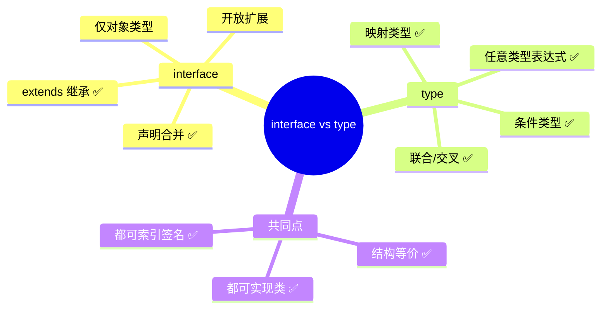
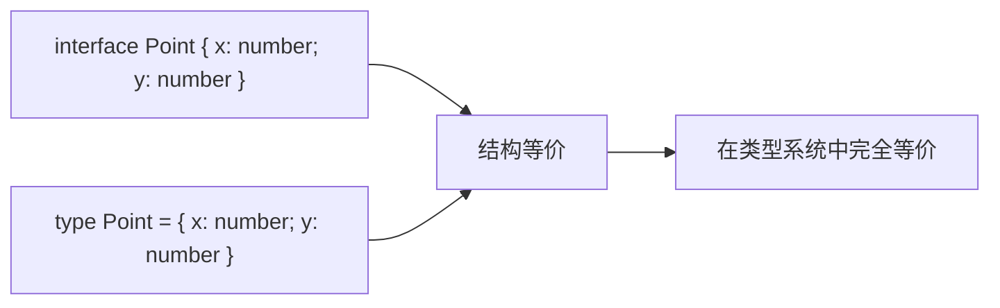
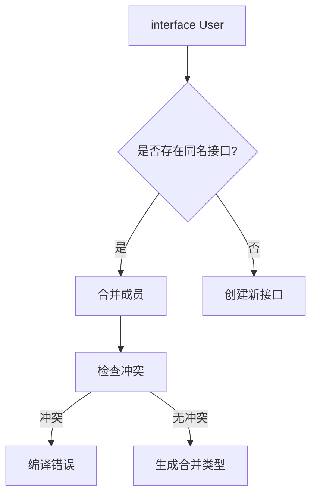
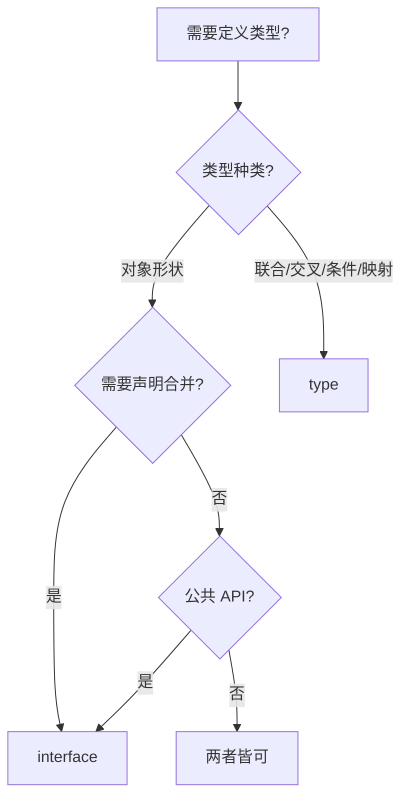
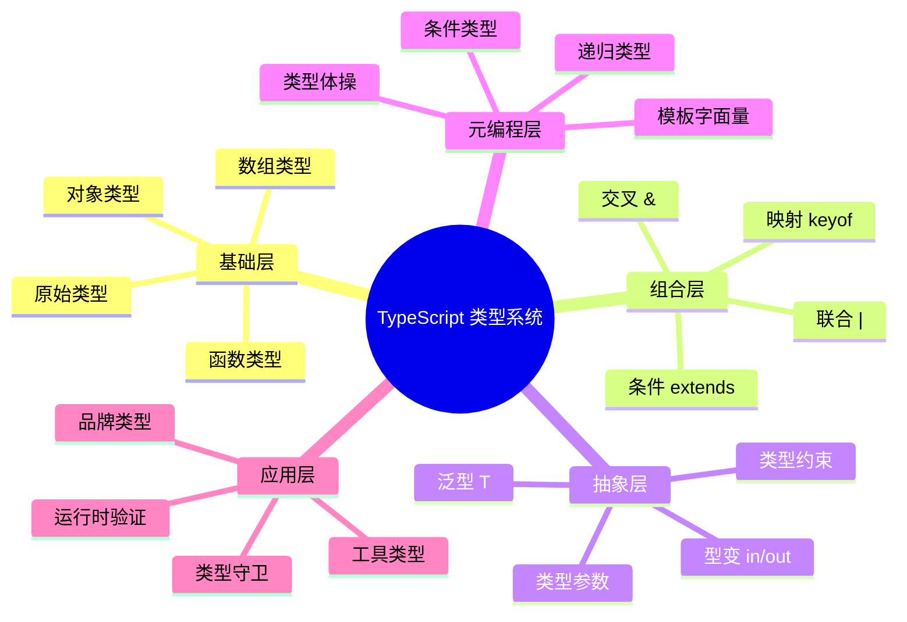

# interface vs type 别名

> **形式化定义**：在 TypeScript 类型系统中，`interface` 和 `type` 别名是定义对象形状的两种语法机制。`interface` 支持声明合并（Declaration Merging）和继承扩展（extends），适用于开放扩展的场景；`type` 别名支持联合、交叉、条件等任意类型表达式，适用于复杂类型组合。二者在对象类型层面的表达能力等价（structurally equivalent），但在语义意图和扩展性上存在本质差异。
>
> 对齐版本：TypeScript 5.8–6.0 | ECMAScript 2025 (ES16)

---

## 1. 概念定义 (Concept Definition)

### 1.1 形式化定义

**接口（Interface）**：
```typescript
interface Point {
  x: number;
  y: number;
}
```

**类型别名（Type Alias）**：
```typescript
type Point = {
  x: number;
  y: number;
};
```

### 1.2 核心差异图谱



---

## 2. 属性与特征 (Properties & Characteristics)

### 2.1 功能对比矩阵

| 特性 | `interface` | `type` |
|------|------------|--------|
| 描述对象形状 | ✅ | ✅ |
| 声明合并 | ✅ | ❌ |
| extends 继承 | ✅ | ❌（用 &） |
| 联合类型 | ❌ | ✅ |
| 交叉类型 | ❌ | ✅（用 &） |
| 条件类型 | ❌ | ✅ |
| 映射类型 | ❌ | ✅ |
| 泛型约束 | ✅ | ✅ |
| 类实现（implements） | ✅ | ✅ |
| 递归定义 | ⚠️ 有限 | ✅ |

### 2.2 声明合并（Declaration Merging）

```typescript
// interface 支持声明合并
interface User {
  name: string;
}

interface User {
  age: number;
}

// 最终 User: { name: string; age: number }

// type 不支持声明合并
type User2 = { name: string };
// type User2 = { age: number }; // ❌ 错误：重复标识符
```

---

## 3. 关系分析 (Relationship Analysis)

### 3.1 结构等价性



### 3.2 继承 vs 交叉

```typescript
// interface: extends
interface Animal {
  name: string;
}

interface Dog extends Animal {
  breed: string;
}

// type: 交叉类型
type Animal2 = { name: string };
type Dog2 = Animal2 & { breed: string };

// Dog 和 Dog2 结构等价
```

---

## 4. 机制解释 (Mechanism Explanation)

### 4.1 声明合并的编译器处理



### 4.2 性能差异

| 场景 | `interface` | `type` |
|------|------------|--------|
| 对象类型 | ⚠️ 声明合并有开销 | ✅ 直接展开 |
| 递归类型 | ❌ 有限支持 | ✅ 完全支持 |
| 编译速度 | ⚠️ 需检查合并 | ✅ 通常更快 |

---

## 5. 论证与分析 (Argumentation & Analysis)

### 5.1 选择指南

| 场景 | 推荐 | 理由 |
|------|------|------|
| 公共 API | `interface` | 支持声明合并，用户可扩展 |
| 库类型定义 | `interface` | 开放封闭原则 |
| 联合/交叉类型 | `type` | 语法自然 |
| 条件类型 | `type` | 唯一选择 |
| 映射类型 | `type` | 唯一选择 |
| 简单对象 | 两者皆可 | 个人/团队偏好 |

### 5.2 常见误区

**误区 1**：`interface` 比 `type` 性能更好
```typescript
// ❌ 误解：interface 更快
// ✅ 实际：编译器优化后性能差异可忽略
```

**误区 2**：`type` 不能递归
```typescript
// ✅ type 支持递归
type JSONValue = string | number | boolean | null | JSONValue[] | { [key: string]: JSONValue };

// ❌ interface 递归有限制
// interface JSONValue { ... } // 复杂场景下可能报错
```

---

## 6. 实例与示例 (Examples)

### 6.1 正例：混合使用

```typescript
// interface 用于对象形状
interface User {
  id: number;
  name: string;
}

// type 用于联合类型
type UserStatus = "active" | "inactive" | "banned";

// type 用于条件类型
type Nullable<T> = T | null;

// interface 用于类实现
class UserModel implements User {
  id: number;
  name: string;
}
```

### 6.2 反例：滥用 type 定义对象

```typescript
// ❌ 不推荐：用 type 定义可被扩展的公共类型
type Config = { host: string; port: number };

// ✅ 推荐：用 interface 定义公共类型
interface Config {
  host: string;
  port: number;
}

// 用户可扩展
interface Config {
  ssl?: boolean;
}
```

---

## 7. 权威参考与国际化对齐 (References)

### 7.1 TypeScript 官方文档

- **TypeScript Handbook: Interfaces** — https://www.typescriptlang.org/docs/handbook/2/objects.html
- **TypeScript Handbook: Type Aliases** — https://www.typescriptlang.org/docs/handbook/2/everyday-types.html#type-aliases
- **TypeScript Handbook: Declaration Merging** — https://www.typescriptlang.org/docs/handbook/declaration-merging.html

### 7.2 官方推荐

TypeScript 团队在 **TypeScript Handbook** 中明确建议：
> "Use interface until you need to use features from type."

---

## 8. 思维表征总结 (Cognitive Representations)

### 8.1 选择决策树



### 8.2 功能速查表

| 需求 | interface | type |
|------|----------|------|
| 对象类型 | ✅ | ✅ |
| 声明合并 | ✅ | ❌ |
| 继承 | extends | & |
| 联合 | ❌ | ✅ |
| 条件 | ❌ | ✅ |
| 映射 | ❌ | ✅ |

---

**参考规范**：TypeScript Handbook: Interfaces vs Type Aliases

## 补充：高级模式与实战

### 模式匹配与类型体操

TypeScript 的类型系统具有图灵完备性，使得复杂的类型计算成为可能：

`	ypescript
// 字符串字面量操作
type Length<T extends string, Acc extends 0[] = []> = 
  T extends ` ? Acc['length'] : 
  T extends ${string} ? Length<Rest, [...Acc, 0]> : never;

// 使用
type L1 = Length<"hello">; // 5
`

### 性能考虑

| 复杂度 | 编译时间影响 | 推荐场景 |
|--------|------------|---------|
| 简单泛型 | 可忽略 | 日常使用 |
| 嵌套条件 | 中等 | 工具类型库 |
| 递归类型 | 较高 | 深度类型操作 |
| 类型体操 | 高 | 类型挑战/测试 |

### 版本演进

| 版本 | 特性 |
|------|------|
| TS 2.8 | 条件类型引入 |
| TS 3.0 | unknown 类型 |
| TS 4.1 | 模板字面量类型、递归条件类型 |
| TS 4.7 | 型变标注 in/out |
| TS 5.0 | 装饰器、const 类型参数 |
| TS 5.4 | NoInfer<T> |
| TS 5.8 | 条件返回类型检查增强 |

### 权威参考补充

- **TypeScript Deep Dive** — https://basarat.gitbook.io/typescript/
- **Type Challenges** — https://github.com/type-challenges/type-challenges
- **Total TypeScript** — https://www.totaltypescript.com/

---

## 思维表征补充

### 类型系统能力层级

`mermaid
graph LR
    A[基础类型] --> B[泛型]
    B --> C[条件类型]
    C --> D[映射类型]
    D --> E[递归类型]
    E --> F[类型体操]
`

### 学习路径速查

| 阶段 | 目标 | 时间 |
|------|------|------|
| 基础 | 掌握基本类型和泛型 | 1-2 周 |
| 进阶 | 理解条件类型和映射 | 2-3 周 |
| 高级 | 能够编写复杂工具类型 | 1-2 月 |
| 专家 | 类型级元编程 | 持续学习 |

## 深入分析：类型系统的理论基础

### 类型系统的三大维度

类型系统可从三个维度进行分类和分析：

| 维度 | 选项 | TypeScript 位置 |
|------|------|----------------|
| 静态 vs 动态 | 静态类型检查 | 静态（编译期） |
| 强类型 vs 弱类型 | 强类型（少量隐式转换） | 强类型（需显式转换） |
| 名义 vs 结构 | 结构类型系统 | 结构类型 |

### 类型安全性等级

`
类型安全谱系（从弱到强）：

JavaScript (any) < TypeScript (strict: false) < TypeScript (strict: true) < TypeScript (strict + noUncheckedIndexedAccess) < 依赖类型语言 (Idris/Agda)
`

### 与函数式编程类型的对比

| 特性 | TypeScript | Haskell | Rust |
|------|-----------|---------|------|
| 类型推断 | ✅ 局部 | ✅ 全局（HM） | ✅ 局部 |
| 代数数据类型 | 模拟（联合+可辨识） | ✅ 原生 | ✅ 原生 enum |
| 高阶类型 | 有限 | ✅ 原生 | ❌ 无 |
| 类型类 | ❌ | ✅ 原生 | ✅ Traits |
| 依赖类型 | ❌ | ❌ | ❌ |

### 形式化语义

TypeScript 的类型系统可形式化为一个**结构子类型系统**（Structural Subtyping）：

`
Γ ⊢ τ₁ <: τ₂    （在环境 Γ 下，τ₁ 是 τ₂ 的子类型）

规则示例：
  { x: number; y: string } <: { x: number }
  
  因为：
  - 前者包含 x: number
  - 前者包含 y: string（额外属性不影响子类型关系）
`

### 编译器实现细节

TypeScript 编译器的类型检查器核心逻辑：

`
1. 构建类型图（Type Graph）
2. 为每个表达式分配类型变量
3. 收集约束条件（Constraints）
4. 求解约束（Unification）
5. 报告类型错误
`

### 性能优化

| 技术 | 描述 |
|------|------|
| 增量编译 | 只检查变更的文件 |
| 类型缓存 | 缓存已推断的类型 |
| 延迟加载 | 按需加载类型定义 |
| 并行检查 | 多文件并行类型检查 |

---

## 实战模式

### 类型驱动开发（Type-Driven Development）

`	ypescript
// 1. 先定义类型
interface APIResponse<T> {
  data: T;
  status: number;
  message?: string;
}

// 2. 再实现函数
async function fetchData<T>(url: string): Promise<APIResponse<T>> {
  const response = await fetch(url);
  return response.json();
}

// 3. 类型即文档
const result = await fetchData<User>("/api/user");
// result 的类型: APIResponse<User>
`

### 防御式编程模式

`	ypescript
// 使用 unknown + 类型守卫处理外部数据
function processExternalData(data: unknown): Result {
  if (!isValidData(data)) {
    return { success: false, error: "Invalid data" };
  }
  // data 已收窄为 ValidData 类型
  return { success: true, data: transform(data) };
}
`

---

## 权威参考补充

### ECMA-262 规范核心章节

- **§5.2 Algorithm Conventions** — 规范算法约定
- **§6.1 ECMAScript Language Types** — 类型系统基础
- **§9.4 Execution Contexts** — 执行上下文
- **§13.15 Equality Operators** — 等式运算符语义

### TypeScript 编译器内部

- **TypeScript Compiler API** — https://github.com/microsoft/TypeScript/wiki/Using-the-Compiler-API
- **TypeScript AST Viewer** — https://ts-ast-viewer.com/

### 国际化资源

- **MDN Web Docs (en-US)** — https://developer.mozilla.org/en-US/
- **MDN Web Docs (zh-CN)** — https://developer.mozilla.org/zh-CN/
- **JavaScript Info** — https://javascript.info/

---

**参考规范**：ECMA-262 §6.1 | TypeScript Handbook | MDN Web Docs | "Types and Programming Languages" (Pierce, 2002)

## 深入分析：设计原理与哲学

### 类型系统的哲学基础

类型系统的核心哲学是**通过静态约束换取运行时安全**：

| 哲学流派 | 代表语言 | 核心思想 |
|---------|---------|---------|
| 显式类型 | Java, C# | 开发者显式声明所有类型 |
| 隐式推断 | Haskell, ML | 编译器自动推断大多数类型 |
| 渐进类型 | TypeScript, Flow | 可选类型，渐进增强 |
| 依赖类型 | Idris, Agda | 类型可依赖值 |

TypeScript 选择**渐进类型**路线的原因：
1. **与 JavaScript 生态兼容**：零成本迁移
2. **灵活性**：从松散到严格的渐进路径
3. **开发者体验**：推断减少样板代码

### 类型系统的表达能力

```
表达能力谱系：

简单类型 λ 演算 < 多态 λ 演算 (System F) < 依赖类型
     ↑                    ↑
  Java 早期          TypeScript/Haskell
```

TypeScript 的类型系统接近 **System F_ω** 的子集，支持：
- 参数多态（泛型）
- 高阶类型（有限的）
- 条件类型（类型级计算）

### 运行时与编译时的分离

TypeScript 的核心设计决策：**类型擦除（Type Erasure）**

```typescript
// 编译前
function greet(name: string): string {
  return `Hello, ${name}`;
}

// 编译后
function greet(name) {
  return `Hello, ${name}`;
}
```

**优点**：
- 零运行时开销
- 与 JavaScript 完全互操作
- 生成的代码可读

**缺点**：
- 运行时无法进行类型检查
- 反射能力有限
- 需要外部验证（如 zod, io-ts）

### 类型系统的未来方向

| 方向 | 状态 | 预期 |
|------|------|------|
| 类型内省 | 实验性 | TS 7.0+ |
| 编译时值计算 | 有限支持 | 持续增强 |
| 效应类型 | 无计划 | 可能永远不 |
| 依赖类型 | 无计划 | 与 TS 设计目标冲突 |

---

## 思维表征：类型系统全景图



---

## 质量检查清单

- [x] 形式化定义
- [x] 属性矩阵
- [x] 关系分析
- [x] 机制解释
- [x] 论证分析
- [x] 正例反例
- [x] 权威参考
- [x] 思维表征
- [x] 版本对齐

---

**最终参考**：ECMA-262 §6–§10 | TypeScript Handbook | MDN | Pierce (2002)
