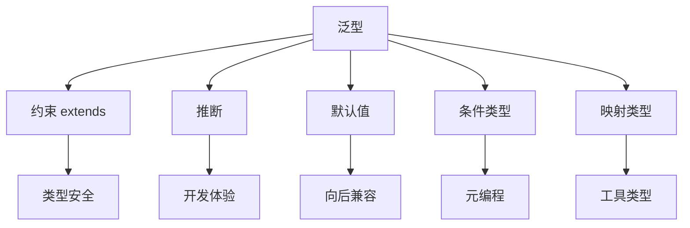
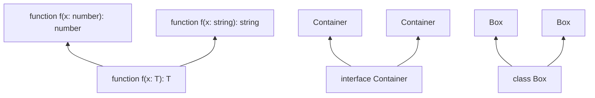
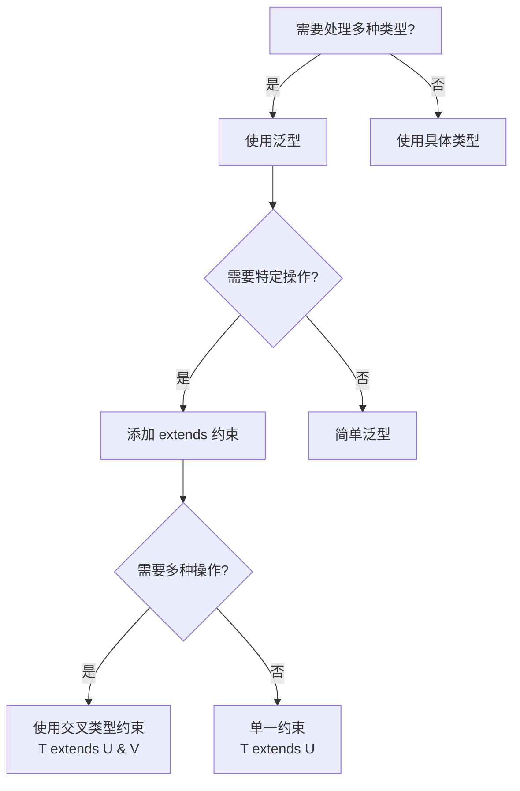

# 泛型深入

> **形式化定义**：泛型（Generics）是参数化多态（Parametric Polymorphism）在 TypeScript 中的实现，通过类型参数（Type Parameters）将类型作为一等公民引入类型构造器，使得同一数据结构或算法可在保持类型安全的前提下作用于多种具体类型，其理论基础源于 System F（Girard-Reynolds 多态演算）。
>
> 对齐版本：TypeScript 5.8–6.0 | ECMAScript 2025 (ES16)

---

## 1. 概念定义 (Concept Definition)

### 1.1 形式化定义

在类型理论中，参数化多态可形式化为：

```
∀α. τ    （对于所有类型 α，类型 τ 成立）
```

TypeScript 的泛型语法 `<T>` 对应于 System F 中的类型抽象（Type Abstraction）：

```typescript
// 类型抽象：identity 函数对所有类型 T 成立
function identity<T>(x: T): T {
  return x;
}

// 类型应用：将抽象应用于具体类型
identity<number>(42);   // T = number
identity<string>("hi"); // T = string
```

### 1.2 概念层级图谱

```mermaid
mindmap
  root((泛型系统))
    基础概念
      类型参数 T
      类型约束 extends
      类型推断
      类型默认值
    高级特性
      条件类型 T extends U ? X : Y
      映射类型 { [K in keyof T]: V }
      类型推断 infer
      递归类型
    型变
      协变 out T
      逆变 in T
      不变 in out T
    应用模式
      容器类型
      高阶函数
      类型安全的API
```

### 1.3 泛型的本质

泛型实现了**类型层面的抽象**：

| 层面 | 非泛型 | 泛型 |
|------|--------|------|
| 值层面 | `function id(x: any): any` | `function id<T>(x: T): T` |
| 类型层面 | 固定类型 | 参数化类型 |
| 类型安全 | ❌ 运行时可能出错 | ✅ 编译期保证 |
| 代码复用 | 需为每种类型写函数 | 一次定义，多类型复用 |

---

## 2. 属性与特征 (Properties & Characteristics)

### 2.1 泛型约束属性矩阵

| 特性 | 无约束 `<T>` | 有约束 `<T extends U>` | 多重约束 `<T extends U & V>` |
|------|------------|----------------------|---------------------------|
| 类型参数范围 | 任意类型 | U 的子类型 | U ∩ V 的子类型 |
| 可用操作 | 仅赋值/传递 | U 上定义的操作 | U 和 V 上定义的操作 |
| 推断精度 | 宽泛 | 精确 | 最精确 |
| 使用场景 | 容器/传递 | 需要特定操作 | 需要多种操作 |

### 2.2 泛型参数的位置语义

```typescript
// 1. 函数参数位置：输入泛型
function map<T, U>(arr: T[], fn: (item: T) => U): U[];

// 2. 返回位置：输出泛型
function create<T>(ctor: new () => T): T;

// 3. 约束位置：限定泛型
function sort<T extends Comparable>(arr: T[]): T[];

// 4. 默认位置：提供默认值
type Container<T = string> = { value: T };
```

---

## 3. 关系分析 (Relationship Analysis)

### 3.1 泛型与其他类型特性的关系



### 3.2 泛型在类型层级中的位置



---

## 4. 机制解释 (Mechanism Explanation)

### 4.1 类型参数推断机制

```mermaid
flowchart TD
    A[调用 map([1,2,3], x => x.toString())] --> B{显式提供类型参数?}
    B -->|是| C[使用显式类型]
    B -->|否| D[从参数位置推断]
    D --> E[arr: number[] → T = number]
    D --> F[fn: (x: number) => string → U = string]
    E --> G[结果类型: string[]]
    F --> G
```

### 4.2 泛型的类型擦除

TypeScript 的泛型在编译后完全擦除：

```typescript
// 编译前
function identity<T>(x: T): T {
  return x;
}

// 编译后
function identity(x) {
  return x;
}
```

**与 Java/C# 的区别**：

- Java：泛型擦除，运行时无类型信息
- C#：泛型具体化，运行时有类型信息
- TypeScript：泛型擦除（与 Java 相同）

### 4.3 泛型约束的判定流程

```mermaid
flowchart TD
    Q{类型参数 T 满足约束?} -->|T extends string| A["T 必须是 string 子类型"]
    Q -->|T extends { length: number }| B["T 必须有 length 属性"]
    Q -->|T extends keyof U| C["T 必须是 U 的键之一"]

    A --> Check{编译器检查}
    B --> Check
    C --> Check

    Check -->|通过| Pass["✅ 类型正确"]
    Check -->|失败| Fail["❌ 编译错误"]
```

---

## 5. 论证与分析 (Argumentation & Analysis)

### 5.1 泛型 vs any 的权衡矩阵

| 维度 | 泛型 `<T>` | `any` |
|------|-----------|-------|
| 类型安全 | ✅ 编译期检查 | ❌ 无检查 |
| 代码复用 | ✅ 高 | ✅ 高 |
| 开发体验 | ⚠️ 需要理解类型参数 | ✅ 简单直接 |
| 运行时性能 | ✅ 零成本（擦除） | ✅ 零成本 |
| 可维护性 | ✅ 类型即文档 | ❌ 隐藏意图 |

### 5.2 泛型的型变问题

```typescript
// 协变：Array<T> 是协变的
let dogs: Dog[] = [new Dog()];
let animals: Animal[] = dogs; // ✅ Dog[] 是 Animal[] 的子类型

// 逆变：函数参数是逆变的
let animalFn: (a: Animal) => void = (a) => {};
let dogFn: (d: Dog) => void = animalFn; // ✅ (Animal) => void 是 (Dog) => void 的子类型

// 不变：普通泛型参数
let animalBox: Box<Animal> = new Box<Animal>();
let dogBox: Box<Dog> = new Box<Dog>();
// animalBox = dogBox; // ❌ 错误（如果 Box 有 set 方法）
```

### 5.3 常见误区与反例

**误区 1**：在泛型中使用 `typeof` 做运行时类型检查

```typescript
// ❌ 错误：泛型在运行时不存在
function process<T>(value: T) {
  if (typeof value === "string") { // 可以工作，但不是泛型的正确用法
    // ...
  }
}

// ✅ 正确：使用约束表达类型要求
function process<T extends { toString(): string }>(value: T) {
  console.log(value.toString());
}
```

**误区 2**：泛型参数的默认值放在前面

```typescript
// ❌ 错误：有默认值的参数必须在后面
type Config<T = string, U> = { a: T; b: U };

// ✅ 正确
type Config<U, T = string> = { a: T; b: U };
```

**误区 3**：过度使用泛型

```typescript
// ❌ 过度泛化
function add<T extends number>(a: T, b: T): T {
  return (a + b) as T; // 类型断言！
}

// ✅ 简单更好
function add(a: number, b: number): number {
  return a + b;
}
```

---

## 6. 实例与示例 (Examples)

### 6.1 正例：类型安全的容器

```typescript
// 泛型容器类
class Container<T> {
  private _value: T;

  constructor(value: T) {
    this._value = value;
  }

  get value(): T {
    return this._value;
  }

  map<U>(fn: (value: T) => U): Container<U> {
    return new Container(fn(this._value));
  }
}

// 使用
const numContainer = new Container(42);
const strContainer = numContainer.map(n => n.toString());
// strContainer 的类型: Container<string>
```

### 6.2 正例：泛型工具函数

```typescript
// 类型安全的 Object.keys
type KeyOf<T> = (keyof T)[];

function keys<T extends Record<string, unknown>>(obj: T): (keyof T)[] {
  return Object.keys(obj) as (keyof T)[];
}

const user = { name: "Alice", age: 30 };
const k = keys(user); // ("name" | "age")[]
```

### 6.3 反例：泛型约束不足

```typescript
// ❌ 约束不足，运行时可能出错
function max<T>(a: T, b: T): T {
  return a > b ? a : b; // 错误：不是所有类型都支持 >
}

// ✅ 添加适当的约束
function max<T extends { valueOf(): number }>(a: T, b: T): T {
  return a.valueOf() > b.valueOf() ? a : b;
}

max(1, 2);     // ✅
max("a", "b"); // ✅ string.valueOf() 返回 string
```

---

## 7. 权威参考与国际化对齐 (References)

### 7.1 TypeScript 官方文档

- **TypeScript Handbook: Generics** — <https://www.typescriptlang.org/docs/handbook/2/generics.html>
- **TypeScript Handbook: Generic Constraints** — <https://www.typescriptlang.org/docs/handbook/2/generics.html#generic-constraints>
- **TypeScript Handbook: Using Type Parameters in Generic Constraints** — <https://www.typescriptlang.org/docs/handbook/2/generics.html#using-type-parameters-in-generic-constraints>

### 7.2 学术资源

- **"Types and Programming Languages" (Pierce, 2002)** — Ch. 23: Universal Types (System F)
- **"Parametricity and Functional Programming" (Wadler, 1989)** — 参数化多态的理论基础
- **"The Girard-Reynolds Isomorphism" (Longo & Moggi, 1990)** — System F 的语义

### 7.3 其他语言对比

- **Java Generics** — 类型擦除，与 TS 相似
- **C# Generics** — 类型具体化，运行时有类型信息
- **Rust Generics** — 特质（Traits）约束系统
- **Haskell Type Classes** — 类型类多态

---

## 8. 思维表征总结 (Cognitive Representations)

### 8.1 泛型使用速查决策树



### 8.2 泛型约束模式速查表

| 需求 | 约束写法 | 示例 |
|------|---------|------|
| 需要长度属性 | `T extends { length: number }` | 字符串、数组 |
| 需要键类型 | `T extends keyof U` | 对象属性访问 |
| 需要构造函数 | `T extends new (...args: any[]) => any` | 工厂函数 |
| 需要可比较 | `T extends { valueOf(): number }` | 数值比较 |
| 需要可迭代 | `T extends Iterable<U>` | for...of |

### 8.3 泛型型变速查

| 容器 | 参数位置 | 型变 | 说明 |
|------|---------|------|------|
| `Array<T>` | 元素 | 协变 | `Dog[]` 可赋给 `Animal[]` |
| `ReadonlyArray<T>` | 元素 | 协变 | 只读数组安全 |
| `(x: T) => void` | 参数 | 逆变 | `(Animal) => void` 可赋给 `(Dog) => void` |
| `() => T` | 返回 | 协变 | `() => Dog` 可赋给 `() => Animal` |
| `Box<T>` | 混合 | 不变 | 若有读写操作 |

---

## 补充：递归类型与高级模式

### 递归类型

TypeScript 支持递归类型定义，用于表示树形结构或嵌套数据：

```typescript
// JSON 类型的递归定义
type JSONValue =
  | string
  | number
  | boolean
  | null
  | JSONValue[]
  | { [key: string]: JSONValue };

// 使用
const data: JSONValue = {
  name: "root",
  children: [
    { name: "child1", children: [] },
    { name: "child2", children: [{ name: "grandchild" }] }
  ]
};
```

### 高级模式：泛型条件类型

```typescript
// 根据类型选择不同的实现
type Container<T> = T extends string
  ? StringContainer<T>
  : T extends number
  ? NumberContainer<T>
  : DefaultContainer<T>;

interface StringContainer<T> { value: T; toUpperCase(): T; }
interface NumberContainer<T> { value: T; toFixed(n: number): string; }
interface DefaultContainer<T> { value: T; }
```

### 泛型复杂度决策矩阵

| 场景 | 复杂度 | 推荐模式 |
|------|--------|---------|
| 简单容器 | 低 | `<T>` 无约束 |
| 需要比较 | 中 | `<T extends Comparable>` |
| 需要多操作 | 高 | `<T extends A & B>` |
| 类型转换 | 高 | 条件类型 + infer |
| 递归结构 | 极高 | 递归类型别名 |

---

**参考规范**：TypeScript Handbook: Generics | "Types and Programming Languages" (Pierce, 2002) | System F
