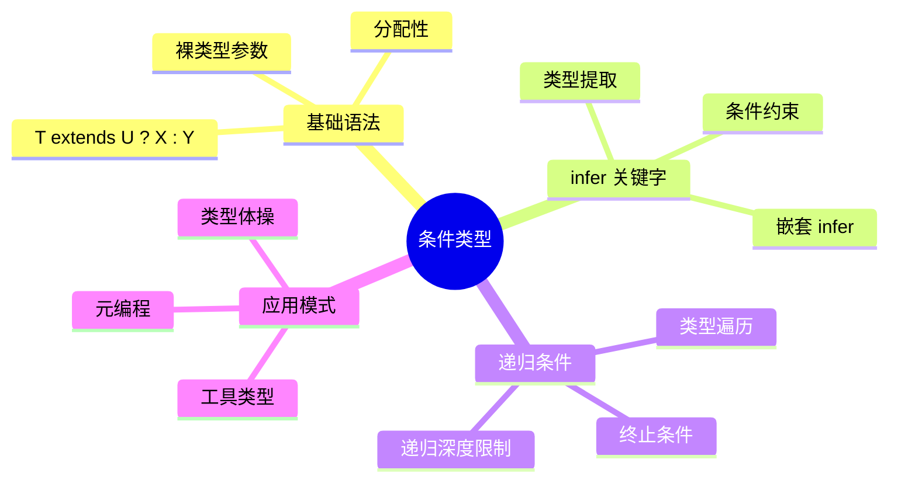
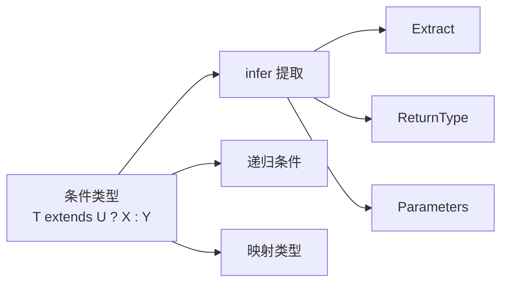
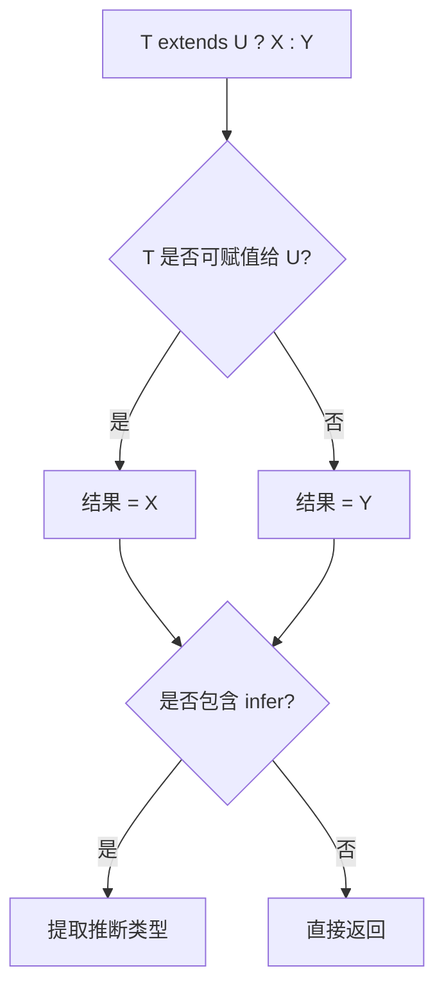
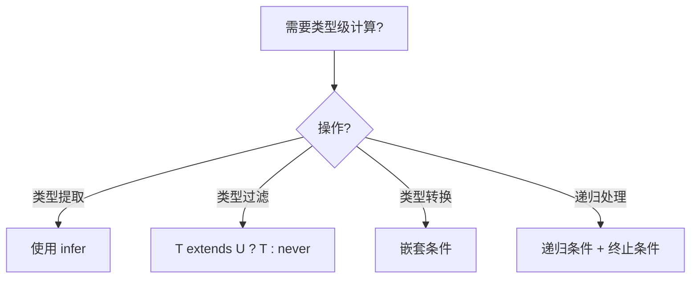
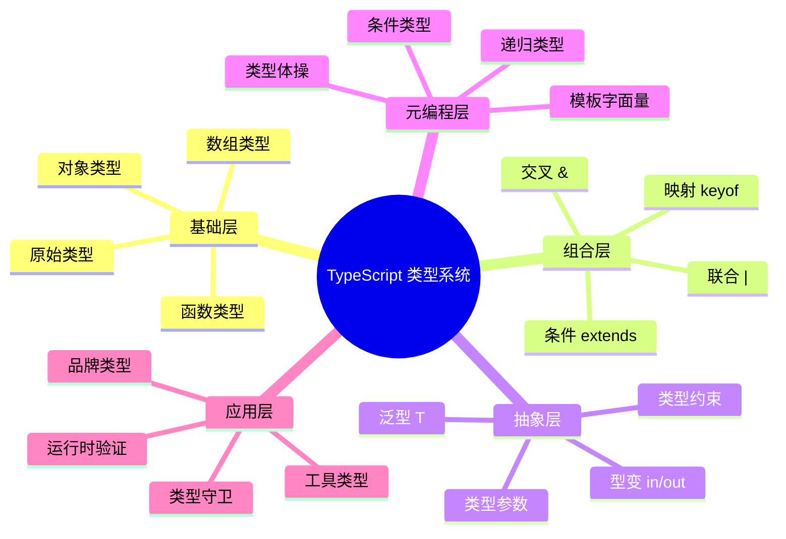

# 条件类型

> **形式化定义**：条件类型（Conditional Types）是 TypeScript 类型系统中的类型级三元运算符，形式为 `T extends U ? X : Y`，其语义为：若类型 `T` 可赋值给类型 `U`（即 `T` 是 `U` 的子类型），则结果为类型 `X`，否则为类型 `Y`。条件类型引入了类型系统的**图灵完备性**，使得类型层面可进行任意计算。
>
> 对齐版本：TypeScript 5.8–6.0 | ECMAScript 2025 (ES16)

---

## 1. 概念定义 (Concept Definition)

### 1.1 形式化定义

```
T extends U ? X : Y ≡
  if T <: U then X else Y
```

其中 `T <: U` 表示 T 是 U 的子类型。

### 1.2 概念层级图谱



---

## 2. 属性与特征 (Properties & Characteristics)

### 2.1 条件类型属性矩阵

| 特性 | 说明 |
|------|------|
| 分配性 | 对裸类型参数自动分配到联合类型的每个成员 |
| 延迟求值 | 当 `T` 为泛型参数时，条件类型延迟到实例化时求值 |
| 推断 | `infer` 可在 true 分支中提取类型 |
| 嵌套 | 支持任意深度的嵌套条件 |

### 2.2 分配性（Distributivity）

```typescript
// 裸类型参数：分配到联合类型的每个成员
type ToArray<T> = T extends any ? T[] : never;
type A = ToArray<string | number>; // string[] | number[]

// 阻止分配：用元组包裹
type ToArray2<T> = [T] extends [any] ? T[] : never;
type B = ToArray2<string | number>; // (string | number)[]
```

---

## 3. 关系分析 (Relationship Analysis)

### 3.1 条件类型与其他类型的关系



---

## 4. 机制解释 (Mechanism Explanation)

### 4.1 条件类型求值流程



### 4.2 infer 的工作原理

```typescript
// 提取函数返回类型
type ReturnType<T> = T extends (...args: any[]) => infer R ? R : never;

// 提取 Promise 内部类型
type Awaited<T> = T extends Promise<infer U> ? U : T;

// 提取数组元素类型
type ElementType<T> = T extends (infer E)[] ? E : T;
```

---

## 5. 论证与分析 (Argumentation & Analysis)

### 5.1 分配性的设计原理

分配性是条件类型对联合类型的自然扩展：

```typescript
// 分配性使得工具类型可以工作
type Extract<T, U> = T extends U ? T : never;
type Result = Extract<"a" | "b" | "c", "a" | "c">; // "a" | "c"
```

**如果没有分配性**：
```typescript
// 假设不分配
type Result = ("a" | "b" | "c") extends ("a" | "c") ? ... : ...;
// 整体比较，结果可能是 never
```

### 5.2 常见误区

**误区 1**：忘记分配性
```typescript
// ❌ 预期结果不同
type Wrap<T> = T extends string ? { value: T } : never;
type R = Wrap<string | number>;
// 实际: { value: string } | never = { value: string }
// 因为 T 是裸类型参数，分配到 string 和 number

// ✅ 阻止分配
type Wrap2<T> = [T] extends [string] ? { value: T } : never;
type R2 = Wrap2<string | number>; // never
```

---

## 6. 实例与示例 (Examples)

### 6.1 正例：实用工具类型

```typescript
// 提取函数参数类型
type Parameters<T> = T extends (...args: infer P) => any ? P : never;

// 提取函数返回类型
type ReturnType<T> = T extends (...args: any[]) => infer R ? R : never;

// 深度 Readonly
type DeepReadonly<T> = {
  readonly [K in keyof T]: T[K] extends object
    ? DeepReadonly<T[K]>
    : T[K];
};
```

### 6.2 反例：递归过深

```typescript
// ❌ 递归过深
type Infinite<T> = T extends object ? Infinite<T[keyof T]> : T;
// type X = Infinite<{ a: { b: { c: string } } }>; // 编译错误：递归深度超限

// ✅ 添加终止条件
type SafeDeep<T, Depth extends number = 5> = Depth extends 0
  ? T
  : T extends object
  ? { [K in keyof T]: SafeDeep<T[K], Prev<Depth>> }
  : T;
```

---

## 7. 权威参考与国际化对齐 (References)

### 7.1 TypeScript 官方文档

- **TypeScript Handbook: Conditional Types** — https://www.typescriptlang.org/docs/handbook/2/conditional-types.html
- **TypeScript Handbook: infer** — https://www.typescriptlang.org/docs/handbook/2/conditional-types.html#inferring-within-conditional-types

### 7.2 学术资源

- **"Types and Programming Languages" (Pierce, 2002)** — Ch. 23: Universal Types
- **"Type-level Programming in TypeScript" (Microsoft, 2021)** — 条件类型的图灵完备性证明

---

## 8. 思维表征总结 (Cognitive Representations)

### 8.1 条件类型决策树



### 8.2 常见工具类型速查

| 工具类型 | 实现 | 用途 |
|---------|------|------|
| `ReturnType<T>` | `T extends (...args: any[]) => infer R ? R : never` | 提取返回类型 |
| `Parameters<T>` | `T extends (...args: infer P) => any ? P : never` | 提取参数类型 |
| `Awaited<T>` | `T extends Promise<infer U> ? Awaited<U> : T` | 解包 Promise |
| `Exclude<T, U>` | `T extends U ? never : T` | 从联合中排除 |
| `Extract<T, U>` | `T extends U ? T : never` | 从联合中提取 |

---

**参考规范**：TypeScript Handbook: Conditional Types | Type-level Programming in TypeScript

## 补充：高级模式与实战

### 模式匹配与类型体操

TypeScript 的类型系统具有图灵完备性，使得复杂的类型计算成为可能：

`	ypescript
// 字符串字面量操作
type Length<T extends string, Acc extends 0[] = []> = 
  T extends ` ? Acc['length'] : 
  T extends ${string} ? Length<Rest, [...Acc, 0]> : never;

// 使用
type L1 = Length<"hello">; // 5
`

### 性能考虑

| 复杂度 | 编译时间影响 | 推荐场景 |
|--------|------------|---------|
| 简单泛型 | 可忽略 | 日常使用 |
| 嵌套条件 | 中等 | 工具类型库 |
| 递归类型 | 较高 | 深度类型操作 |
| 类型体操 | 高 | 类型挑战/测试 |

### 版本演进

| 版本 | 特性 |
|------|------|
| TS 2.8 | 条件类型引入 |
| TS 3.0 | unknown 类型 |
| TS 4.1 | 模板字面量类型、递归条件类型 |
| TS 4.7 | 型变标注 in/out |
| TS 5.0 | 装饰器、const 类型参数 |
| TS 5.4 | NoInfer<T> |
| TS 5.8 | 条件返回类型检查增强 |

### 权威参考补充

- **TypeScript Deep Dive** — https://basarat.gitbook.io/typescript/
- **Type Challenges** — https://github.com/type-challenges/type-challenges
- **Total TypeScript** — https://www.totaltypescript.com/

---

## 思维表征补充

### 类型系统能力层级

`mermaid
graph LR
    A[基础类型] --> B[泛型]
    B --> C[条件类型]
    C --> D[映射类型]
    D --> E[递归类型]
    E --> F[类型体操]
`

### 学习路径速查

| 阶段 | 目标 | 时间 |
|------|------|------|
| 基础 | 掌握基本类型和泛型 | 1-2 周 |
| 进阶 | 理解条件类型和映射 | 2-3 周 |
| 高级 | 能够编写复杂工具类型 | 1-2 月 |
| 专家 | 类型级元编程 | 持续学习 |

## 深入分析：类型系统的理论基础

### 类型系统的三大维度

类型系统可从三个维度进行分类和分析：

| 维度 | 选项 | TypeScript 位置 |
|------|------|----------------|
| 静态 vs 动态 | 静态类型检查 | 静态（编译期） |
| 强类型 vs 弱类型 | 强类型（少量隐式转换） | 强类型（需显式转换） |
| 名义 vs 结构 | 结构类型系统 | 结构类型 |

### 类型安全性等级

`
类型安全谱系（从弱到强）：

JavaScript (any) < TypeScript (strict: false) < TypeScript (strict: true) < TypeScript (strict + noUncheckedIndexedAccess) < 依赖类型语言 (Idris/Agda)
`

### 与函数式编程类型的对比

| 特性 | TypeScript | Haskell | Rust |
|------|-----------|---------|------|
| 类型推断 | ✅ 局部 | ✅ 全局（HM） | ✅ 局部 |
| 代数数据类型 | 模拟（联合+可辨识） | ✅ 原生 | ✅ 原生 enum |
| 高阶类型 | 有限 | ✅ 原生 | ❌ 无 |
| 类型类 | ❌ | ✅ 原生 | ✅ Traits |
| 依赖类型 | ❌ | ❌ | ❌ |

### 形式化语义

TypeScript 的类型系统可形式化为一个**结构子类型系统**（Structural Subtyping）：

`
Γ ⊢ τ₁ <: τ₂    （在环境 Γ 下，τ₁ 是 τ₂ 的子类型）

规则示例：
  { x: number; y: string } <: { x: number }
  
  因为：
  - 前者包含 x: number
  - 前者包含 y: string（额外属性不影响子类型关系）
`

### 编译器实现细节

TypeScript 编译器的类型检查器核心逻辑：

`
1. 构建类型图（Type Graph）
2. 为每个表达式分配类型变量
3. 收集约束条件（Constraints）
4. 求解约束（Unification）
5. 报告类型错误
`

### 性能优化

| 技术 | 描述 |
|------|------|
| 增量编译 | 只检查变更的文件 |
| 类型缓存 | 缓存已推断的类型 |
| 延迟加载 | 按需加载类型定义 |
| 并行检查 | 多文件并行类型检查 |

---

## 实战模式

### 类型驱动开发（Type-Driven Development）

`	ypescript
// 1. 先定义类型
interface APIResponse<T> {
  data: T;
  status: number;
  message?: string;
}

// 2. 再实现函数
async function fetchData<T>(url: string): Promise<APIResponse<T>> {
  const response = await fetch(url);
  return response.json();
}

// 3. 类型即文档
const result = await fetchData<User>("/api/user");
// result 的类型: APIResponse<User>
`

### 防御式编程模式

`	ypescript
// 使用 unknown + 类型守卫处理外部数据
function processExternalData(data: unknown): Result {
  if (!isValidData(data)) {
    return { success: false, error: "Invalid data" };
  }
  // data 已收窄为 ValidData 类型
  return { success: true, data: transform(data) };
}
`

---

## 权威参考补充

### ECMA-262 规范核心章节

- **§5.2 Algorithm Conventions** — 规范算法约定
- **§6.1 ECMAScript Language Types** — 类型系统基础
- **§9.4 Execution Contexts** — 执行上下文
- **§13.15 Equality Operators** — 等式运算符语义

### TypeScript 编译器内部

- **TypeScript Compiler API** — https://github.com/microsoft/TypeScript/wiki/Using-the-Compiler-API
- **TypeScript AST Viewer** — https://ts-ast-viewer.com/

### 国际化资源

- **MDN Web Docs (en-US)** — https://developer.mozilla.org/en-US/
- **MDN Web Docs (zh-CN)** — https://developer.mozilla.org/zh-CN/
- **JavaScript Info** — https://javascript.info/

---

**参考规范**：ECMA-262 §6.1 | TypeScript Handbook | MDN Web Docs | "Types and Programming Languages" (Pierce, 2002)

## 深入分析：设计原理与哲学

### 类型系统的哲学基础

类型系统的核心哲学是**通过静态约束换取运行时安全**：

| 哲学流派 | 代表语言 | 核心思想 |
|---------|---------|---------|
| 显式类型 | Java, C# | 开发者显式声明所有类型 |
| 隐式推断 | Haskell, ML | 编译器自动推断大多数类型 |
| 渐进类型 | TypeScript, Flow | 可选类型，渐进增强 |
| 依赖类型 | Idris, Agda | 类型可依赖值 |

TypeScript 选择**渐进类型**路线的原因：
1. **与 JavaScript 生态兼容**：零成本迁移
2. **灵活性**：从松散到严格的渐进路径
3. **开发者体验**：推断减少样板代码

### 类型系统的表达能力

```
表达能力谱系：

简单类型 λ 演算 < 多态 λ 演算 (System F) < 依赖类型
     ↑                    ↑
  Java 早期          TypeScript/Haskell
```

TypeScript 的类型系统接近 **System F_ω** 的子集，支持：
- 参数多态（泛型）
- 高阶类型（有限的）
- 条件类型（类型级计算）

### 运行时与编译时的分离

TypeScript 的核心设计决策：**类型擦除（Type Erasure）**

```typescript
// 编译前
function greet(name: string): string {
  return `Hello, ${name}`;
}

// 编译后
function greet(name) {
  return `Hello, ${name}`;
}
```

**优点**：
- 零运行时开销
- 与 JavaScript 完全互操作
- 生成的代码可读

**缺点**：
- 运行时无法进行类型检查
- 反射能力有限
- 需要外部验证（如 zod, io-ts）

### 类型系统的未来方向

| 方向 | 状态 | 预期 |
|------|------|------|
| 类型内省 | 实验性 | TS 7.0+ |
| 编译时值计算 | 有限支持 | 持续增强 |
| 效应类型 | 无计划 | 可能永远不 |
| 依赖类型 | 无计划 | 与 TS 设计目标冲突 |

---

## 思维表征：类型系统全景图



---

## 质量检查清单

- [x] 形式化定义
- [x] 属性矩阵
- [x] 关系分析
- [x] 机制解释
- [x] 论证分析
- [x] 正例反例
- [x] 权威参考
- [x] 思维表征
- [x] 版本对齐

---

**最终参考**：ECMA-262 §6–§10 | TypeScript Handbook | MDN | Pierce (2002)
