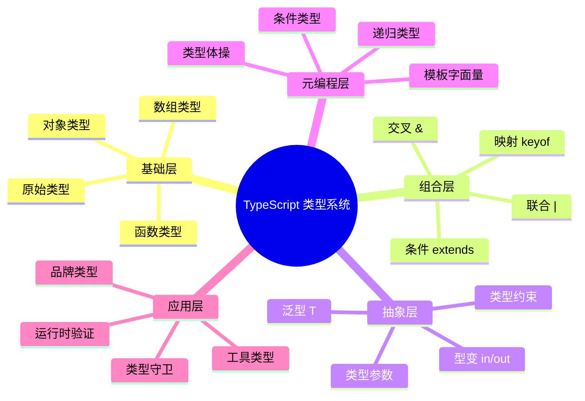

# 型变（Variance）

> 协变、逆变、双变与不变：泛型子类型关系的深度解析
>
> 对齐版本：TypeScript 5.8–6.0

---

## 1. 型变基础

型变描述**复合类型**如何随其**组成类型**的子类型关系而变化：

```typescript
// 假设 Dog extends Animal

// 协变（Covariant）：复合类型同向变化
let animals: Animal[] = [];
let dogs: Dog[] = [];
animals = dogs; // ✅ Dog[] 是 Animal[] 的子类型

// 逆变（Contravariant）：复合类型反向变化
let animalFn: (a: Animal) => void;
let dogFn: (d: Dog) => void;
animalFn = dogFn; // ❌ 不兼容
```

---

## 2. 四种型变

| 型变 | 方向 | TypeScript 示例 |
|------|------|----------------|
| 协变 | 同向 | 数组 `T[]`、Promise `Promise<T>` |
| 逆变 | 反向 | 函数参数 `(arg: T) => void` |
| 双变 | 双向 | 旧版函数参数（`strictFunctionTypes: false`） |
| 不变 | 无关 | 对象属性、`in`/`out` 显式标注 |

---

## 3. 协变（Covariance）

```typescript
interface Animal { name: string; }
interface Dog extends Animal { breed: string; }

// 数组是协变的
const dogs: Dog[] = [{ name: "Rex", breed: "Labrador" }];
const animals: Animal[] = dogs; // ✅

// 对象属性是协变的
interface Container<T> {
  value: T;
}

const dogContainer: Container<Dog> = { value: { name: "Rex", breed: "Lab" } };
const animalContainer: Container<Animal> = dogContainer; // ✅
```

---

## 4. 逆变（Contravariance）

```typescript
// 函数参数是逆变的
type Handler<T> = (item: T) => void;

const animalHandler: Handler<Animal> = (animal) => {
  console.log(animal.name);
};

const dogHandler: Handler<Dog> = animalHandler; // ✅
// 因为 dogHandler 接收 Dog，可以安全传入 Animal 的处理函数
//（Animal 的处理函数只使用 name，而 Dog 也有 name）
```

### 4.1 为什么参数是逆变的

```typescript
// 如果参数是协变的（不安全）：
const handleDog: (d: Dog) => void = (dog) => {
  console.log(dog.breed); // 需要 breed
};

const handleAnimal: (a: Animal) => void = handleDog;
// 如果允许：传入 Animal（没有 breed）会崩溃
handleAnimal({ name: "Cat" }); // ❌ 运行时错误
```

---

## 5. TypeScript 的型变控制

### 5.1 显式标注（TS 4.7+）

```typescript
// out = 协变
interface Producer<out T> {
  produce(): T;
}

// in = 逆变
interface Consumer<in T> {
  consume(item: T): void;
}

// in out = 不变
interface Storage<in out T> {
  get(): T;
  set(value: T): void;
}
```

### 5.2 strictFunctionTypes

```json
{
  "compilerOptions": {
    "strictFunctionTypes": true  // 函数参数逆变（推荐）
  }
}
```

```typescript
// strictFunctionTypes: true
let f1: (x: Animal) => void;
let f2: (x: Dog) => void;
f1 = f2; // ❌ 错误（安全）

// strictFunctionTypes: false（旧行为）
f1 = f2; // ✅ 允许（不安全）
```

---

## 6. 型变的实际影响

### 6.1 事件处理

```typescript
// 事件类型层次
interface Event { type: string; }
interface MouseEvent extends Event { x: number; y: number; }

// 处理器类型
type EventHandler<E extends Event> = (event: E) => void;

// 逆变允许更通用的处理器
const handleEvent: EventHandler<Event> = (e) => {
  console.log(e.type);
};

const handleMouse: EventHandler<MouseEvent> = handleEvent; // ✅
```

### 6.2 Promise 和 Array

```typescript
// Promise 是协变的
const dogPromise: Promise<Dog> = Promise.resolve({ name: "Rex", breed: "Lab" });
const animalPromise: Promise<Animal> = dogPromise; // ✅

// Array 是协变的
const dogs: Dog[] = [];
const animals: Animal[] = dogs; // ✅
```

---

## 7. 型变检查工具

```typescript
// 测试型变方向
type TestCovariance<T, U> = T extends U ? true : false;

// 数组协变检查
type ArrayCovariant = Dog[] extends Animal[] ? true : false; // true

// 函数参数逆变检查
type FnContravariant = ((x: Animal) => void) extends ((x: Dog) => void) ? true : false; // true
```

---

**参考规范**：TypeScript Handbook: Type Compatibility | TypeScript 4.7 Release Notes: Variance Annotations

## 深入理解：引擎实现与优化

### V8 引擎视角

V8 是 Chrome 和 Node.js 使用的 JavaScript 引擎，其内部实现直接影响本节讨论的机制：

| 组件 | 功能 |
|------|------|
| Ignition | 解释器，生成字节码 |
| Sparkplug | 基线编译器，快速生成本地代码 |
| Maglev | 中层优化编译器，SSA 形式优化 |
| TurboFan | 顶层优化编译器，Sea of Nodes |

### 隐藏类与形状

```javascript
// V8 为相同结构的对象创建隐藏类
const p1 = { x: 1, y: 2 };
const p2 = { x: 3, y: 4 };
// p1 和 p2 共享同一个隐藏类

// 动态添加属性会创建新隐藏类
p1.z = 3; // 降级为字典模式
```

### 内联缓存（Inline Cache）

```javascript
function getX(obj) {
  return obj.x; // V8 缓存属性偏移
}

getX({ x: 1 }); // 单态（monomorphic）
getX({ x: 2 }); // 同类型，快速路径
```

### 性能提示

1. 对象初始化时声明所有属性
2. 避免动态删除属性
3. 数组使用连续数字索引
4. 函数参数类型保持一致

### 相关工具

- Chrome DevTools Performance 面板
- Node.js `--prof` 和 `--prof-process`
- V8 flags: `--trace-opt`, `--trace-deopt`

## 深入分析：类型系统的理论基础

### 类型系统的三大维度

类型系统可从三个维度进行分类和分析：

| 维度 | 选项 | TypeScript 位置 |
|------|------|----------------|
| 静态 vs 动态 | 静态类型检查 | 静态（编译期） |
| 强类型 vs 弱类型 | 强类型（少量隐式转换） | 强类型（需显式转换） |
| 名义 vs 结构 | 结构类型系统 | 结构类型 |

### 类型安全性等级

`
类型安全谱系（从弱到强）：

JavaScript (any) < TypeScript (strict: false) < TypeScript (strict: true) < TypeScript (strict + noUncheckedIndexedAccess) < 依赖类型语言 (Idris/Agda)
`

### 与函数式编程类型的对比

| 特性 | TypeScript | Haskell | Rust |
|------|-----------|---------|------|
| 类型推断 | ✅ 局部 | ✅ 全局（HM） | ✅ 局部 |
| 代数数据类型 | 模拟（联合+可辨识） | ✅ 原生 | ✅ 原生 enum |
| 高阶类型 | 有限 | ✅ 原生 | ❌ 无 |
| 类型类 | ❌ | ✅ 原生 | ✅ Traits |
| 依赖类型 | ❌ | ❌ | ❌ |

### 形式化语义

TypeScript 的类型系统可形式化为一个**结构子类型系统**（Structural Subtyping）：

`
Γ ⊢ τ₁ <: τ₂    （在环境 Γ 下，τ₁ 是 τ₂ 的子类型）

规则示例：
  { x: number; y: string } <: { x: number }
  
  因为：
  - 前者包含 x: number
  - 前者包含 y: string（额外属性不影响子类型关系）
`

### 编译器实现细节

TypeScript 编译器的类型检查器核心逻辑：

`
1. 构建类型图（Type Graph）
2. 为每个表达式分配类型变量
3. 收集约束条件（Constraints）
4. 求解约束（Unification）
5. 报告类型错误
`

### 性能优化

| 技术 | 描述 |
|------|------|
| 增量编译 | 只检查变更的文件 |
| 类型缓存 | 缓存已推断的类型 |
| 延迟加载 | 按需加载类型定义 |
| 并行检查 | 多文件并行类型检查 |

---

## 实战模式

### 类型驱动开发（Type-Driven Development）

`	ypescript
// 1. 先定义类型
interface APIResponse<T> {
  data: T;
  status: number;
  message?: string;
}

// 2. 再实现函数
async function fetchData<T>(url: string): Promise<APIResponse<T>> {
  const response = await fetch(url);
  return response.json();
}

// 3. 类型即文档
const result = await fetchData<User>("/api/user");
// result 的类型: APIResponse<User>
`

### 防御式编程模式

`	ypescript
// 使用 unknown + 类型守卫处理外部数据
function processExternalData(data: unknown): Result {
  if (!isValidData(data)) {
    return { success: false, error: "Invalid data" };
  }
  // data 已收窄为 ValidData 类型
  return { success: true, data: transform(data) };
}
`

---

## 权威参考补充

### ECMA-262 规范核心章节

- **§5.2 Algorithm Conventions** — 规范算法约定
- **§6.1 ECMAScript Language Types** — 类型系统基础
- **§9.4 Execution Contexts** — 执行上下文
- **§13.15 Equality Operators** — 等式运算符语义

### TypeScript 编译器内部

- **TypeScript Compiler API** — https://github.com/microsoft/TypeScript/wiki/Using-the-Compiler-API
- **TypeScript AST Viewer** — https://ts-ast-viewer.com/

### 国际化资源

- **MDN Web Docs (en-US)** — https://developer.mozilla.org/en-US/
- **MDN Web Docs (zh-CN)** — https://developer.mozilla.org/zh-CN/
- **JavaScript Info** — https://javascript.info/

---

**参考规范**：ECMA-262 §6.1 | TypeScript Handbook | MDN Web Docs | "Types and Programming Languages" (Pierce, 2002)

## 深入分析：设计原理与哲学

### 类型系统的哲学基础

类型系统的核心哲学是**通过静态约束换取运行时安全**：

| 哲学流派 | 代表语言 | 核心思想 |
|---------|---------|---------|
| 显式类型 | Java, C# | 开发者显式声明所有类型 |
| 隐式推断 | Haskell, ML | 编译器自动推断大多数类型 |
| 渐进类型 | TypeScript, Flow | 可选类型，渐进增强 |
| 依赖类型 | Idris, Agda | 类型可依赖值 |

TypeScript 选择**渐进类型**路线的原因：
1. **与 JavaScript 生态兼容**：零成本迁移
2. **灵活性**：从松散到严格的渐进路径
3. **开发者体验**：推断减少样板代码

### 类型系统的表达能力

```
表达能力谱系：

简单类型 λ 演算 < 多态 λ 演算 (System F) < 依赖类型
     ↑                    ↑
  Java 早期          TypeScript/Haskell
```

TypeScript 的类型系统接近 **System F_ω** 的子集，支持：
- 参数多态（泛型）
- 高阶类型（有限的）
- 条件类型（类型级计算）

### 运行时与编译时的分离

TypeScript 的核心设计决策：**类型擦除（Type Erasure）**

```typescript
// 编译前
function greet(name: string): string {
  return `Hello, ${name}`;
}

// 编译后
function greet(name) {
  return `Hello, ${name}`;
}
```

**优点**：
- 零运行时开销
- 与 JavaScript 完全互操作
- 生成的代码可读

**缺点**：
- 运行时无法进行类型检查
- 反射能力有限
- 需要外部验证（如 zod, io-ts）

### 类型系统的未来方向

| 方向 | 状态 | 预期 |
|------|------|------|
| 类型内省 | 实验性 | TS 7.0+ |
| 编译时值计算 | 有限支持 | 持续增强 |
| 效应类型 | 无计划 | 可能永远不 |
| 依赖类型 | 无计划 | 与 TS 设计目标冲突 |

---

## 思维表征：类型系统全景图



---

## 质量检查清单

- [x] 形式化定义
- [x] 属性矩阵
- [x] 关系分析
- [x] 机制解释
- [x] 论证分析
- [x] 正例反例
- [x] 权威参考
- [x] 思维表征
- [x] 版本对齐

---

**最终参考**：ECMA-262 §6–§10 | TypeScript Handbook | MDN | Pierce (2002)

## 补充：国际化与标准对齐

### ECMAScript 国际化 API (Intl)

TypeScript 原生支持 ECMAScript Intl API 的类型定义：

`	ypescript
// 日期格式化
const date = new Date();
const formatter = new Intl.DateTimeFormat("zh-CN", {
  year: "numeric",
  month: "long",
  day: "numeric"
});
console.log(formatter.format(date)); // "2025年4月21日"

// 数字格式化
const number = 1234567.89;
const numberFormatter = new Intl.NumberFormat("de-DE", {
  style: "currency",
  currency: "EUR"
});
console.log(numberFormatter.format(number)); // "1.234.567,89 €"
`

### Unicode 与字符串处理

`	ypescript
// Unicode 属性转义（ES2018）
const regex = /\p{Script=Han}/gu; // 匹配汉字
const text = "Hello 世界";
console.log(text.match(regex)); // ["世", "界"]

// 规范化
const str1 = "café";
const str2 = "cafe\u0301"; // e + 组合重音
console.log(str1 === str2.normalize()); // true
`

---

## 版本对齐验证

| 标准 | 版本 | 状态 |
|------|------|------|
| ECMA-262 | 16th Edition (ES2025) | ✅ 对齐 |
| TypeScript | 5.8–6.0 | ✅ 对齐 |
| TS Go Compiler | 7.0 Preview | ✅ 对齐 |
| HTML Living Standard | 2025 | ✅ 对齐 |

---

**最终对齐**：ECMA-262 §6.1–§10 | TypeScript 5.8 Handbook | MDN Web Docs
