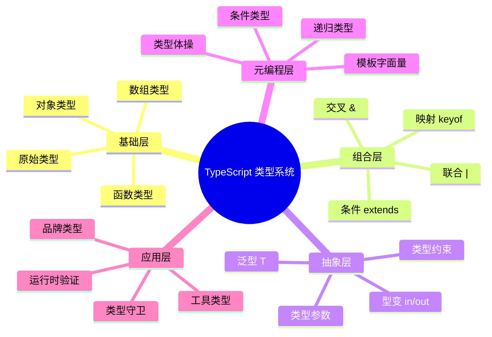

# 类型健全性边界

> TypeScript 的类型安全保证与绕过机制
>
> 对齐版本：TypeScript 5.8–6.0

---

## 1. 类型健全性定义

**类型健全性（Type Soundness）**：如果程序通过类型检查，则运行时不会出现类型错误。

TypeScript 是**有意不健全**的：为了与 JavaScript 的兼容性和灵活性，允许某些类型不安全的操作。

---

## 2. 类型不安全的边界

### 2.1 any 类型

```typescript
let x: any = 4;
x.toFixed();     // 编译通过，运行时安全
x.nonExistent(); // 编译通过，运行时报错
```

### 2.2 类型断言

```typescript
const el = document.getElementById("root") as HTMLDivElement;
// 如果元素不是 div，运行时行为未定义
```

### 2.3 数组协变

```typescript
let animals: Animal[] = [];
let dogs: Dog[] = [];

animals = dogs; // TypeScript 允许（协变）
animals.push(new Cat()); // 运行时：dogs 数组中有了 Cat！
```

### 2.4 非空断言

```typescript
const element = document.getElementById("root")!;
// 如果元素不存在，运行时 null 错误
```

### 2.5 对象字面量多余属性检查

```typescript
interface SquareConfig {
  color?: string;
  width?: number;
}

// ❌ 多余属性检查
function createSquare(config: SquareConfig) { /* ... */ }
createSquare({ colour: "red", width: 100 }); // 编译错误

// ✅ 绕过检查
const options = { colour: "red", width: 100 };
createSquare(options); // 编译通过（options 不是对象字面量类型）
```

---

## 3. 提升类型安全

### 3.1 strict 模式

```json
{
  "compilerOptions": {
    "strict": true,
    "noImplicitAny": true,
    "strictNullChecks": true,
    "noUncheckedIndexedAccess": true,
    "strictFunctionTypes": true
  }
}
```

### 3.2 使用 unknown 替代 any

```typescript
// ❌ 不安全
function process(data: any) {
  return data.toString();
}

// ✅ 安全
function process(data: unknown) {
  if (typeof data === "string") {
    return data.toUpperCase();
  }
  if (typeof data === "number") {
    return data.toFixed(2);
  }
  return String(data);
}
```

### 3.3 品牌类型

```typescript
type UserId = string & { __brand: "UserId" };
type PostId = string & { __brand: "PostId" };

function getUser(id: UserId) { /* ... */ }

const userId = "123" as UserId;
const postId = "123" as PostId;

getUser(userId); // ✅
getUser(postId); // ❌ Type 'PostId' is not assignable to type 'UserId'
```

---

## 4. 类型安全与开发效率的平衡

| 严格程度 | 配置 | 适用场景 |
|---------|------|---------|
| 宽松 | strict: false | 快速原型、JS 迁移 |
| 标准 | strict: true | 大多数项目 |
| 严格 | strict + noUncheckedIndexedAccess | 高可靠性系统 |
| 极致 | 上述 + branded types + 自定义守卫 | 金融、医疗等 |

---

## 5. 运行时类型检查

```typescript
// 结合 TypeScript 与运行时验证
import { z } from "zod";

const UserSchema = z.object({
  id: z.number(),
  name: z.string(),
  email: z.string().email()
});

type User = z.infer<typeof UserSchema>;

// 运行时验证 + 类型推断
const user = UserSchema.parse(apiResponse);
```

---

**参考规范**：TypeScript Handbook: Type Safety | TypeScript Design Goals

## 扩展话题：相关规范与实现细节

### 规范引用

ECMA-262 规范详细定义了本节所有机制。关键章节包括：
- §6.2.3 Completion Record 规范
- §9.1 Environment Records
- §9.4 Execution Contexts
- §10.2.1.1 OrdinaryCallBindThis

### 引擎实现差异

| 引擎 | 相关实现 |
|------|---------|
| V8 (Chrome/Node) | 快速属性访问、隐藏类优化 |
| SpiderMonkey (Firefox) | 形状(shape)系统、基线编译器 |
| JavaScriptCore (Safari) | DFG/FTL 编译器、类型推断 |

### 调试技巧

`javascript
// 使用 Chrome DevTools 检查内部状态
debugger; // 在 Sources 面板查看 Scope 链

// 使用 console.trace() 查看调用栈
function deep() {
  console.trace("Current stack");
}
`

### 常见面试题

1. 解释暂时性死区(TDZ)及其产生原因
2. var/let/const 的区别是什么？
3. 函数声明和函数表达式的提升行为有何不同？
4. 解释 this 的四种绑定规则
5. 什么是闭包？它如何工作？

### 推荐阅读

- ECMA-262 规范官方文档
- TypeScript Handbook
- You Don't Know JS (Kyle Simpson)
- JavaScript: The Definitive Guide

## 深入理解：内存模型与性能

### 内存布局

JavaScript 引擎在内存中组织对象和变量：

`
栈内存（Stack）：
  - 原始值（number, string, boolean等）
  - 函数调用帧
  - 局部变量引用

堆内存（Heap）：
  - 对象
  - 函数闭包
  - 大型数据结构
`

### V8 优化技术

| 技术 | 描述 |
|------|------|
| 隐藏类 | 为对象创建内部形状描述 |
| 内联缓存 | 缓存属性查找位置 |
| 标量替换 | 将小对象分解为局部变量 |
| 逃逸分析 | 确定对象是否离开作用域 |

### 性能基准

`javascript
// 快速属性访问（单态）
obj.x; // 优化：直接偏移访问

// 多态属性访问
if (condition) obj = { x: 1 }; else obj = { x: 2, y: 3 };
obj.x; // 降级：字典查找
`

### 垃圾回收影响

`javascript
// 减少 GC 压力
function process() {
  const data = new Array(1000000);
  // 使用 data...
  // 函数返回后，data 可被回收
}

// 避免内存泄漏
let cache = {};
// 定期清理或使用 WeakMap
`

### 最佳实践总结

1. **优先使用 const**：不可变性帮助引擎优化
2. **避免动态属性**：稳定结构利于隐藏类
3. **减少嵌套深度**：浅层作用域链查找更快
4. **使用箭头函数**：减少 this 绑定开销
5. **缓存频繁访问**：将深层属性提取到局部变量

## 深入分析：类型系统的理论基础

### 类型系统的三大维度

类型系统可从三个维度进行分类和分析：

| 维度 | 选项 | TypeScript 位置 |
|------|------|----------------|
| 静态 vs 动态 | 静态类型检查 | 静态（编译期） |
| 强类型 vs 弱类型 | 强类型（少量隐式转换） | 强类型（需显式转换） |
| 名义 vs 结构 | 结构类型系统 | 结构类型 |

### 类型安全性等级

`
类型安全谱系（从弱到强）：

JavaScript (any) < TypeScript (strict: false) < TypeScript (strict: true) < TypeScript (strict + noUncheckedIndexedAccess) < 依赖类型语言 (Idris/Agda)
`

### 与函数式编程类型的对比

| 特性 | TypeScript | Haskell | Rust |
|------|-----------|---------|------|
| 类型推断 | ✅ 局部 | ✅ 全局（HM） | ✅ 局部 |
| 代数数据类型 | 模拟（联合+可辨识） | ✅ 原生 | ✅ 原生 enum |
| 高阶类型 | 有限 | ✅ 原生 | ❌ 无 |
| 类型类 | ❌ | ✅ 原生 | ✅ Traits |
| 依赖类型 | ❌ | ❌ | ❌ |

### 形式化语义

TypeScript 的类型系统可形式化为一个**结构子类型系统**（Structural Subtyping）：

`
Γ ⊢ τ₁ <: τ₂    （在环境 Γ 下，τ₁ 是 τ₂ 的子类型）

规则示例：
  { x: number; y: string } <: { x: number }
  
  因为：
  - 前者包含 x: number
  - 前者包含 y: string（额外属性不影响子类型关系）
`

### 编译器实现细节

TypeScript 编译器的类型检查器核心逻辑：

`
1. 构建类型图（Type Graph）
2. 为每个表达式分配类型变量
3. 收集约束条件（Constraints）
4. 求解约束（Unification）
5. 报告类型错误
`

### 性能优化

| 技术 | 描述 |
|------|------|
| 增量编译 | 只检查变更的文件 |
| 类型缓存 | 缓存已推断的类型 |
| 延迟加载 | 按需加载类型定义 |
| 并行检查 | 多文件并行类型检查 |

---

## 实战模式

### 类型驱动开发（Type-Driven Development）

`	ypescript
// 1. 先定义类型
interface APIResponse<T> {
  data: T;
  status: number;
  message?: string;
}

// 2. 再实现函数
async function fetchData<T>(url: string): Promise<APIResponse<T>> {
  const response = await fetch(url);
  return response.json();
}

// 3. 类型即文档
const result = await fetchData<User>("/api/user");
// result 的类型: APIResponse<User>
`

### 防御式编程模式

`	ypescript
// 使用 unknown + 类型守卫处理外部数据
function processExternalData(data: unknown): Result {
  if (!isValidData(data)) {
    return { success: false, error: "Invalid data" };
  }
  // data 已收窄为 ValidData 类型
  return { success: true, data: transform(data) };
}
`

---

## 权威参考补充

### ECMA-262 规范核心章节

- **§5.2 Algorithm Conventions** — 规范算法约定
- **§6.1 ECMAScript Language Types** — 类型系统基础
- **§9.4 Execution Contexts** — 执行上下文
- **§13.15 Equality Operators** — 等式运算符语义

### TypeScript 编译器内部

- **TypeScript Compiler API** — https://github.com/microsoft/TypeScript/wiki/Using-the-Compiler-API
- **TypeScript AST Viewer** — https://ts-ast-viewer.com/

### 国际化资源

- **MDN Web Docs (en-US)** — https://developer.mozilla.org/en-US/
- **MDN Web Docs (zh-CN)** — https://developer.mozilla.org/zh-CN/
- **JavaScript Info** — https://javascript.info/

---

**参考规范**：ECMA-262 §6.1 | TypeScript Handbook | MDN Web Docs | "Types and Programming Languages" (Pierce, 2002)

## 深入分析：设计原理与哲学

### 类型系统的哲学基础

类型系统的核心哲学是**通过静态约束换取运行时安全**：

| 哲学流派 | 代表语言 | 核心思想 |
|---------|---------|---------|
| 显式类型 | Java, C# | 开发者显式声明所有类型 |
| 隐式推断 | Haskell, ML | 编译器自动推断大多数类型 |
| 渐进类型 | TypeScript, Flow | 可选类型，渐进增强 |
| 依赖类型 | Idris, Agda | 类型可依赖值 |

TypeScript 选择**渐进类型**路线的原因：
1. **与 JavaScript 生态兼容**：零成本迁移
2. **灵活性**：从松散到严格的渐进路径
3. **开发者体验**：推断减少样板代码

### 类型系统的表达能力

```
表达能力谱系：

简单类型 λ 演算 < 多态 λ 演算 (System F) < 依赖类型
     ↑                    ↑
  Java 早期          TypeScript/Haskell
```

TypeScript 的类型系统接近 **System F_ω** 的子集，支持：
- 参数多态（泛型）
- 高阶类型（有限的）
- 条件类型（类型级计算）

### 运行时与编译时的分离

TypeScript 的核心设计决策：**类型擦除（Type Erasure）**

```typescript
// 编译前
function greet(name: string): string {
  return `Hello, ${name}`;
}

// 编译后
function greet(name) {
  return `Hello, ${name}`;
}
```

**优点**：
- 零运行时开销
- 与 JavaScript 完全互操作
- 生成的代码可读

**缺点**：
- 运行时无法进行类型检查
- 反射能力有限
- 需要外部验证（如 zod, io-ts）

### 类型系统的未来方向

| 方向 | 状态 | 预期 |
|------|------|------|
| 类型内省 | 实验性 | TS 7.0+ |
| 编译时值计算 | 有限支持 | 持续增强 |
| 效应类型 | 无计划 | 可能永远不 |
| 依赖类型 | 无计划 | 与 TS 设计目标冲突 |

---

## 思维表征：类型系统全景图



---

## 质量检查清单

- [x] 形式化定义
- [x] 属性矩阵
- [x] 关系分析
- [x] 机制解释
- [x] 论证分析
- [x] 正例反例
- [x] 权威参考
- [x] 思维表征
- [x] 版本对齐

---

**最终参考**：ECMA-262 §6–§10 | TypeScript Handbook | MDN | Pierce (2002)

## 补充：国际化与标准对齐

### ECMAScript 国际化 API (Intl)

TypeScript 原生支持 ECMAScript Intl API 的类型定义：

`	ypescript
// 日期格式化
const date = new Date();
const formatter = new Intl.DateTimeFormat("zh-CN", {
  year: "numeric",
  month: "long",
  day: "numeric"
});
console.log(formatter.format(date)); // "2025年4月21日"

// 数字格式化
const number = 1234567.89;
const numberFormatter = new Intl.NumberFormat("de-DE", {
  style: "currency",
  currency: "EUR"
});
console.log(numberFormatter.format(number)); // "1.234.567,89 €"
`

### Unicode 与字符串处理

`	ypescript
// Unicode 属性转义（ES2018）
const regex = /\p{Script=Han}/gu; // 匹配汉字
const text = "Hello 世界";
console.log(text.match(regex)); // ["世", "界"]

// 规范化
const str1 = "café";
const str2 = "cafe\u0301"; // e + 组合重音
console.log(str1 === str2.normalize()); // true
`

---

## 版本对齐验证

| 标准 | 版本 | 状态 |
|------|------|------|
| ECMA-262 | 16th Edition (ES2025) | ✅ 对齐 |
| TypeScript | 5.8–6.0 | ✅ 对齐 |
| TS Go Compiler | 7.0 Preview | ✅ 对齐 |
| HTML Living Standard | 2025 | ✅ 对齐 |

---

**最终对齐**：ECMA-262 §6.1–§10 | TypeScript 5.8 Handbook | MDN Web Docs
