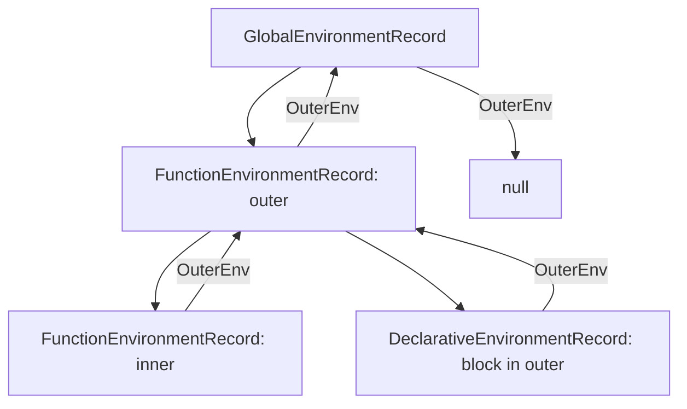

# 词法环境与环境记录

> ECMAScript 规范中的变量存储模型：Lexical Environment 与 Environment Record
>
> 对齐版本：ECMA-262 §9.2–9.3

---

## 1. 词法环境（Lexical Environment）

ECMAScript 规范定义词法环境为：

> **词法环境** = **环境记录（Environment Record）** + **外层词法环境引用（Outer Lexical Environment Reference）**

```
LexicalEnvironment: {
  EnvironmentRecord: { /* 变量绑定 */ },
  OuterEnv: /* 指向外部词法环境 */
}
```

---

## 2. 环境记录类型

### 2.1 声明式环境记录（Declarative Environment Record）

存储 `let`、`const`、`class`、`function` 等声明的绑定：

```javascript
{
  let x = 1;
  const y = 2;
  function foo() {}
  // 这些都在声明式环境记录中
}
```

### 2.2 对象环境记录（Object Environment Record）

将 JavaScript 对象作为环境记录，用于 `with` 语句和全局对象：

```javascript
// 全局环境记录的对象环境记录部分绑定到全局对象（window/global）
var globalVar = 1; // 通过对象环境记录绑定到全局对象
```

### 2.3 全局环境记录（Global Environment Record）

特殊的环境记录，由两部分组成：
- **声明式环境记录**：存储 `let/const/class`
- **对象环境记录**：绑定到全局对象，存储 `var` 和函数声明

### 2.4 函数环境记录（Function Environment Record）

函数调用时创建，包含：
- `this` 绑定
- `super` 绑定
- 参数和局部变量

### 2.5 模块环境记录（Module Environment Record）

模块执行时创建，存储：
- 模块的顶级声明
- 导入绑定的间接引用（immutability guarantee）

---

## 3. 绑定操作

| 操作 | 描述 |
|------|------|
| `CreateBinding(N, D)` | 创建名为 N 的绑定，D 表示是否可删除 |
| `InitializeBinding(N, V)` | 将绑定 N 初始化为值 V |
| `SetMutableBinding(N, V, S)` | 设置可变绑定 N 的值为 V，S 表示严格模式 |
| `GetBindingValue(N, S)` | 获取绑定 N 的值 |

---

## 4. 环境记录与作用域

### 4.1 函数调用时的环境记录创建

```javascript
function outer() {
  const x = 10;
  function inner() {
    const y = 20;
    console.log(x + y);
  }
  inner();
}
outer();
```

环境记录链：

```
inner() FunctionEnvironmentRecord
  → outer() FunctionEnvironmentRecord
    → GlobalEnvironmentRecord
```

### 4.2 块语句的环境记录创建

```javascript
{
  const x = 1;
  {
    const y = 2;
    // x 通过外层引用找到，y 在当前环境记录中找到
  }
}
```

---

## 5. 可视化



---

**参考规范**：ECMA-262 §9.2 Lexical Environments | ECMA-262 §9.3 Environment Records
