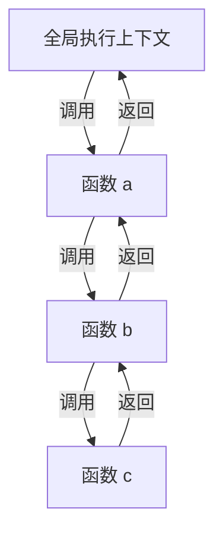

# 调用栈（Call Stack）

> 函数调用的 LIFO 结构：执行上下文帧的管理
>
> 对齐版本：ECMAScript 2025 (ES16)

---

## 1. 调用栈基础

调用栈（Call Stack）是 JavaScript 运行时使用的 **LIFO（Last In, First Out）** 数据结构，用于管理函数调用：

```javascript
function a() {
  console.log("a");
  b();
}

function b() {
  console.log("b");
  c();
}

function c() {
  console.log("c");
}

a();
```

调用栈变化：

```
1. a() 被调用     [main, a]
2. b() 被调用     [main, a, b]
3. c() 被调用     [main, a, b, c]
4. c() 返回       [main, a, b]
5. b() 返回       [main, a]
6. a() 返回       [main]
```

---

## 2. 栈帧内容

每个栈帧（Stack Frame）包含：

| 内容 | 说明 |
|------|------|
| 函数参数 | 调用时传入的参数值 |
| 局部变量 | 函数内声明的变量 |
| 返回地址 | 函数返回后应继续执行的代码位置 |
| 外层环境引用 | 指向外部词法环境的指针 |
| this 绑定 | 当前执行上下文的 this 值 |

---

## 3. 栈溢出（Stack Overflow）

### 3.1 无限递归

```javascript
function infinite() {
  infinite();
}
infinite(); // RangeError: Maximum call stack size exceeded
```

### 3.2 过深的调用链

```javascript
function deep(n) {
  if (n === 0) return;
  deep(n - 1);
}

deep(100000); // 可能导致栈溢出（取决于引擎的栈大小限制）
```

### 3.3 尾调用优化（TCO）

ES6 规范了尾调用优化，但主流引擎（除 Safari 外）未实现：

```javascript
// 尾调用形式
function factorial(n, acc = 1) {
  if (n === 0) return acc;
  return factorial(n - 1, n * acc); // 尾位置调用
}

// 如果 TCO 实现，这不会增加栈深度
// 但 V8/SpiderMonkey 中仍会栈溢出
```

---

## 4. 错误与调试

### 4.1 堆栈追踪（Stack Trace）

```javascript
function c() {
  throw new Error("Oops");
}

function b() { c(); }
function a() { b(); }

a();
// Error: Oops
//     at c (file.js:2:9)
//     at b (file.js:6:17)
//     at a (file.js:7:17)
//     at file.js:9:1
```

### 4.2 Source Map 与原始堆栈

压缩/转译后的代码堆栈难以理解，Source Map 将堆栈映射回原始源码：

```
原始堆栈（压缩后）：
  at a.min.js:1:1024

Source Map 还原后：
  at src/utils/helper.ts:42:10
```

---

## 5. 异步与调用栈

### 5.1 异步回调的堆栈断裂

```javascript
function asyncOperation() {
  setTimeout(() => {
    throw new Error("Async error");
  }, 0);
}

asyncOperation();
// 堆栈只显示 setTimeout 回调，不显示 asyncOperation 的调用链
```

### 5.2 async/await 的堆栈恢复

```javascript
async function asyncOperation() {
  await new Promise(resolve => setTimeout(resolve, 0));
  throw new Error("Async error");
}

// async/await 保持了异步操作的堆栈信息
```

---

## 6. 可视化



---

**参考规范**：ECMA-262 §9.4 Execution Contexts
