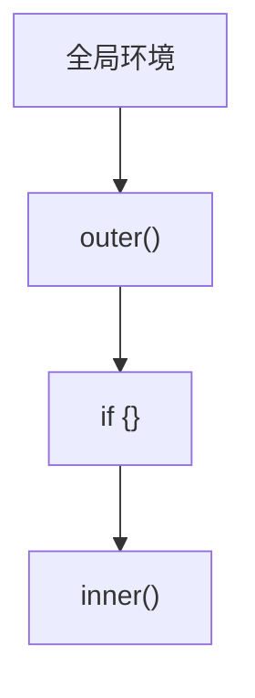
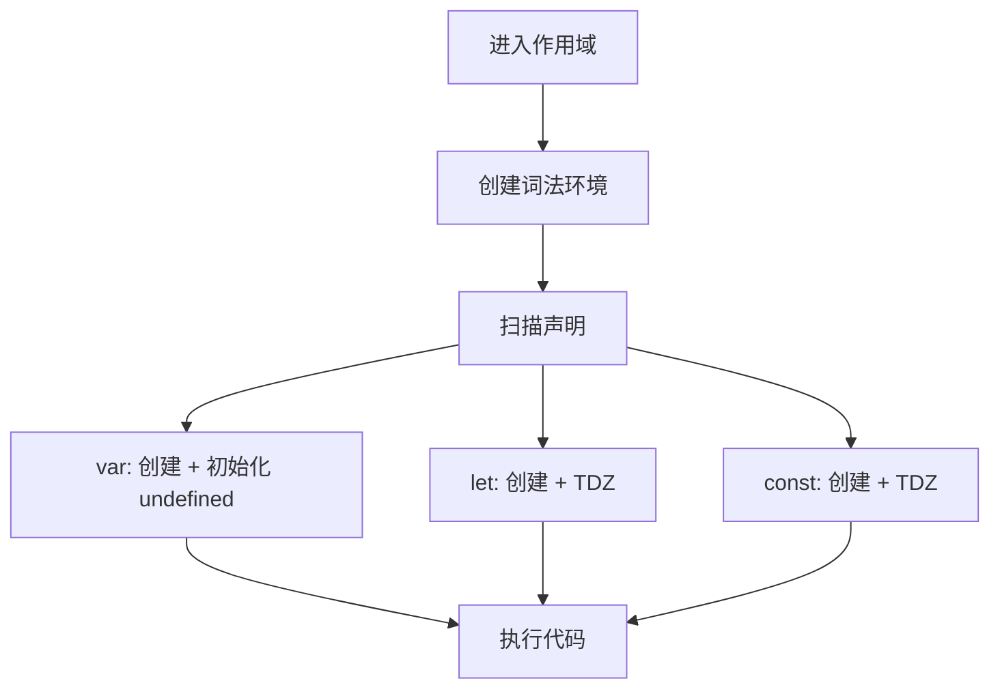
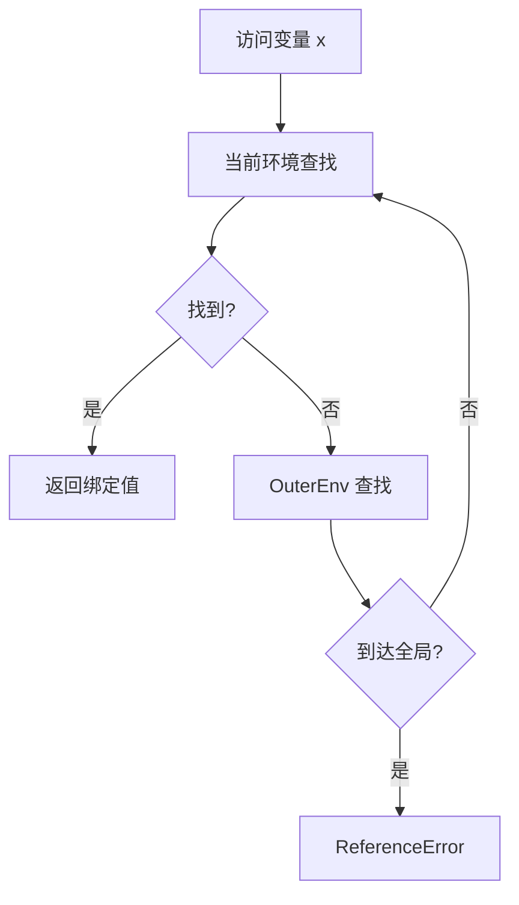
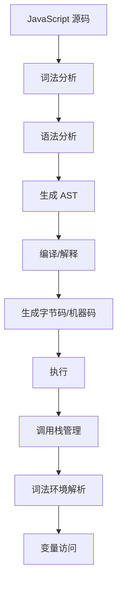

# 词法环境与变量（Lexical Environment & Variables）

> **形式化定义**：词法环境（Lexical Environment）是 ECMAScript 规范中存储变量绑定的核心数据结构，由**环境记录（Environment Record）**和**外部引用（OuterEnv）**组成。变量声明（var/let/const）在词法环境中创建绑定，通过作用域链进行解析。ECMA-262 §8.1 定义了词法环境的完整语义，§8.1.1 定义了环境记录的分类和操作。
>
> 对齐版本：ECMAScript 2025 (ES16) §8.1 | TypeScript 5.8–6.0

---

## 1. 概念定义 (Concept Definition)

### 1.1 形式化定义

ECMA-262 §8.1 定义了词法环境：

> *"A Lexical Environment is a specification type used to define the association of Identifiers to specific variables and functions."*

词法环境的数学表示：

```
LexicalEnvironment = (EnvironmentRecord, OuterEnv)
```

---

## 2. 属性与特征 (Properties & Characteristics)

### 2.1 环境记录类型矩阵

| 类型 | 用途 | 存储方式 |
|------|------|---------|
| 声明式 | let/const/function | 内部哈希表 |
| 对象式 | var/with | 绑定到对象属性 |
| 函数式 | 函数参数/局部变量 | 声明式 + 参数映射 |
| 模块式 | 模块导出/导入 | 声明式 + 模块记录 |

---

## 3. 关系分析 (Relationship Analysis)

### 3.1 词法环境链



---

## 4. 机制解释 (Mechanism Explanation)

### 4.1 变量创建流程



---

## 5. 论证与分析 (Argumentation & Analysis)

### 5.1 var vs let vs const 的环境记录

| 声明 | 环境记录类型 | 初始化时机 |
|------|------------|-----------|
| `var` | 对象式 | 创建时（undefined） |
| `let` | 声明式 | 执行到声明时 |
| `const` | 声明式 | 执行到声明时（必须） |

---

## 6. 实例与示例 (Examples)

### 6.1 正例：环境记录的可视化

```javascript
// 全局环境
const globalVar = 1;

function example() {
  // 函数环境记录: { param: undefined }
  const localVar = 2;
  
  if (true) {
    // 块级环境记录: { blockVar: TDZ }
    const blockVar = 3;
  }
}
```

---

## 7. 权威参考与国际化对齐 (References)

- **ECMA-262 §8.1** — Lexical Environments
- **MDN: Lexical Environment** — https://developer.mozilla.org/en-US/docs/Web/JavaScript/Closures#lexical_scoping

---

## 8. 思维表征总结 (Cognitive Representations)

### 8.1 词法环境结构

```
┌─────────────────────────────────────┐
│      词法环境                         │
├─────────────────────────────────────┤
│  环境记录                            │
│  ├─ 绑定1: 值1                        │
│  └─ 绑定2: 值2                        │
├─────────────────────────────────────┤
│  OuterEnv → 父级词法环境               │
└─────────────────────────────────────┘
```

---

## 9. 公理化表述与形式证明 (Axiomatization & Formal Proof)

### 9.1 公理化基础

**公理 1（变量解析的确定性）**：
> 标识符解析从当前词法环境开始，沿 OuterEnv 链向上查找，直到找到或到达全局环境。

**公理 2（TDZ 的不可访问性）**：
> let/const 声明的变量在初始化前不可访问，访问抛出 ReferenceError。

### 9.2 定理与证明

**定理 1（闭包的变量保持）**：
> 函数对象持有其创建时词法环境的引用，该环境在函数存活期间保持。

*证明*：
> 函数对象的 `[[Environment]]` 内部槽指向创建时的词法环境。只要函数对象存在，该环境就不会被垃圾回收。
> ∎

---

## 10. 推理链与演绎分析 (Deductive Reasoning Chain)

### 10.1 演绎推理



### 10.2 反事实推理

> **反设**：没有词法环境链，所有变量存储在单一全局表中。
> **推演结果**：命名冲突频繁，模块化不可能实现，内存管理混乱。
> **结论**：词法环境链是作用域隔离和模块化编程的基础。

---

**参考规范**：ECMA-262 §8.1 | MDN: Lexical Environment


---

## 9. 公理化表述与形式证明 (Axiomatization & Formal Proof)

### 9.1 执行模型的公理化基础

**公理 1（单线程语义）**：
> JavaScript 在单个 Agent 内是单线程执行的，同一时刻只有一个执行上下文在运行。

**公理 2（运行至完成）**：
> 当前执行的任务（宏任务或微任务）不会被其他任务中断，直到完成。

**公理 3（调用栈的 LIFO 性）**：
> 执行上下文栈遵循后进先出原则，函数返回时弹出当前上下文。

**公理 4（词法环境的静态性）**：
> 词法环境的 `[[OuterEnv]]` 在函数定义时确定，不因调用位置改变。

### 9.2 定理与证明

**定理 1（事件循环的调度公平性）**：
> 事件循环按 FIFO 顺序从任务队列中取出任务执行，确保同一队列中的任务按顺序调度。

*证明*：
> HTML Living Standard §8.1.4.2 规定事件循环从任务队列中取出"最老的可运行任务"执行。最老即最先入队，遵循 FIFO。
> ∎

**定理 2（this 绑定的调用时确定性）**：
> 非箭头函数的 `this` 值在函数调用时确定，与定义位置无关。

*证明*：
> ECMA-262 §10.2.1 定义了 `[[Call]]` 方法的 this 绑定规则。调用时根据调用方式（默认/隐式/显式/new）确定 this 值。
> ∎

**定理 3（闭包的环境保持）**：
> 闭包函数在定义时捕获的词法环境，在函数对象存活期间保持可达。

*证明*：
> 函数对象的 `[[Environment]]` 内部槽指向定义时的词法环境。只要函数对象被引用，该词法环境即被引用，GC 不会回收。
> ∎

**定理 4（Promise.then 的异步时序）**：
> `Promise.resolve().then(f)` 中的 `f` 在当前同步代码执行完毕后执行。

*证明*：
> `then` 将回调包装为 Job 放入 Job Queue。根据 ECMA-262 §9.5，Job Queue 在当前执行上下文完成后处理。
> ∎

### 9.3 真值表：this 绑定规则

| 调用方式 | 严格模式 | 非严格模式 | 箭头函数 |
|---------|---------|-----------|---------|
| `fn()` | undefined | globalThis | 继承外层 |
| `obj.fn()` | obj | obj | 继承外层 |
| `fn.call(obj)` | obj | obj | 继承外层 |
| `fn.apply(obj)` | obj | obj | 继承外层 |
| `new Fn()` | 新对象 | 新对象 | 不可 new |
| `fn.bind(obj)()` | obj | obj | 继承外层 |

---

## 10. 推理链与演绎分析 (Deductive Reasoning Chain)

### 10.1 演绎推理：从源码到执行



### 10.2 归纳推理：从运行时现象推导机制

| 现象 | 推断的底层机制 | 验证方法 |
|------|--------------|---------|
| 变量提升 | 编译阶段变量实例化 | 在声明前访问 var 变量 |
| 闭包保持变量 | 词法环境被函数引用 | 外部函数返回后内部函数仍可访问变量 |
| 异步回调延迟 | 事件循环队列调度 | 对比同步和异步代码执行顺序 |
| this 值变化 | 动态绑定规则 | 同一函数不同调用方式测试 |
| 栈溢出 | 调用栈深度限制 | 无限递归测试 |

### 10.3 反事实推理

> **反设**：JavaScript 是多线程语言，没有事件循环。
> **推演结果**：
> 1. 需要显式锁和同步原语
> 2. 共享内存导致数据竞争
> 3. 异步编程模型完全不同
> 4. 事件驱动编程需要显式线程管理
>
> **结论**：单线程 + 事件循环模型是 JavaScript 简单易用的核心设计，虽然限制了 CPU 密集型任务的性能，但极大简化了并发编程。

---

## 11. 形式语义说明

### 11.1 操作语义

JavaScript 执行的操作语义可表示为状态转换：

```
⟨stmt, σ, θ⟩ → ⟨stmt', σ', θ'⟩
```

其中：
- `stmt`：当前执行的语句
- `σ`：程序状态（变量绑定）
- `θ`：执行上下文栈

### 11.2 指称语义

函数调用的指称语义：

```
[[fn(arg)]](σ) = 
  创建新上下文 ctx
  绑定参数 arg 到形参
  执行函数体
  返回结果
  弹出上下文 ctx
```

---

## 12. 性能与最佳实践

### 12.1 性能考量

| 操作 | 时间复杂度 | 空间复杂度 | 优化建议 |
|------|-----------|-----------|---------|
| 函数调用 | O(1) | O(1) | 避免深层递归 |
| 属性访问 | O(1) 平均 | O(1) | 使用局部变量缓存 |
| 闭包创建 | O(1) | O(环境大小) | 只引用需要的变量 |
| 事件监听 | O(1) | O(1) | 及时移除不需要的监听 |
| Promise 创建 | O(1) | O(1) | 避免不必要的包装 |

### 12.2 最佳实践总结

```javascript
// ✅ 避免深层递归，使用迭代
function factorial(n) {
  let result = 1;
  for (let i = 2; i <= n; i++) result *= i;
  return result;
}

// ✅ 缓存频繁访问的属性
function process(obj) {
  const data = obj.data; // 缓存
  for (let i = 0; i < 1000; i++) {
    use(data[i]);
  }
}

// ✅ 及时移除事件监听
const handler = () => { /* ... */ };
element.addEventListener("click", handler);
// ...
element.removeEventListener("click", handler);

// ✅ 使用 WeakMap 避免内存泄漏
const cache = new WeakMap();
function compute(obj) {
  if (!cache.has(obj)) {
    cache.set(obj, heavyCompute(obj));
  }
  return cache.get(obj);
}
```

---

## 13. 思维模型总结

### 13.1 执行模型核心速查

| 概念 | 关键属性 | 常见问题 |
|------|---------|---------|
| 调用栈 | LIFO、深度限制 | 栈溢出 |
| 执行上下文 | 词法环境、this、变量 | this 绑定错误 |
| 词法环境 | 静态作用域链 | 闭包内存泄漏 |
| 事件循环 | 单线程、任务队列 | 阻塞主线程 |
| 微任务 | Promise、nextTick | 微任务饿死 |
| GC | 可达性分析、分代 | 内存泄漏 |
| Agent | 逻辑线程、内存隔离 | SharedArrayBuffer 安全 |
| Realm | 全局环境隔离 | iframe 通信 |

### 13.2 调试工具链

| 工具 | 用途 | 场景 |
|------|------|------|
| Chrome DevTools Performance | 性能分析 | 长任务、渲染阻塞 |
| Chrome DevTools Memory | 内存分析 | 内存泄漏检测 |
| Node.js --prof | CPU 分析 | 热点函数识别 |
| Node.js --heapsnapshot | 堆快照 | 内存占用分析 |

---

## 14. 权威参考完整索引

| 来源 | 链接 | 相关章节 |
|------|------|---------|
| ECMA-262 | tc39.es/ecma262 | §8.1, §9, §10, §27 |
| HTML Living Standard | html.spec.whatwg.org | §8.1.4.2 |
| V8 Blog | v8.dev/blog | Ignition, TurboFan, GC |
| Node.js Docs | nodejs.org | Event Loop, libuv |
| MDN | developer.mozilla.org | Execution context, Event loop |

---

**参考规范**：ECMA-262 §8-10 | HTML Living Standard | V8 Blog | Node.js Docs

---

## 15. 高级主题与前沿发展

### 15.1 TC39 相关提案

| 提案 | 阶段 | 说明 |
|------|------|------|
| ShadowRealm | Stage 3 | 多 Realm 隔离 |
| Async Context | Stage 2 | 异步上下文传播 |
| Explicit Resource Management | Stage 4 | using 声明 |

### 15.2 与其他语言的对比

| 特性 | JavaScript | Java | Go | Rust |
|------|-----------|------|-----|------|
| 内存管理 | GC | GC | GC | 所有权 |
| 并发模型 | 事件循环 | 线程池 | Goroutine | 异步/线程 |
| this/self | 动态绑定 | 静态 | 方法接收者 | self 参数 |
| 异常处理 | try/catch | try/catch | error 返回值 | Result<T,E> |

---

**参考规范**：ECMA-262 §8-10 | TC39 Proposals
