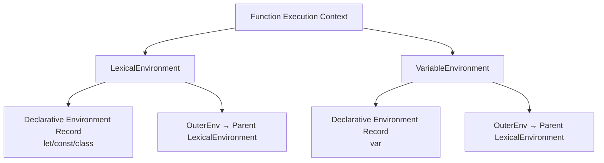

# 词法环境与变量环境

> ECMAScript 规范中执行上下文的两个环境组件
>
> 对齐版本：ECMA-262 §9.2–9.3

---

## 1. 规范定义

每个执行上下文包含两个环境引用：

### 1.1 LexicalEnvironment（词法环境）

用于解析 `let`、`const`、`class` 声明的标识符引用。

### 1.2 VariableEnvironment（变量环境）

用于解析 `var` 声明的标识符引用。

---

## 2. 为什么需要两个环境

因为 `let/const` 和 `var` 有不同的作用域规则：

```javascript
{
  let x = 1;
  var y = 2;
}

// x 不可访问（块级作用域）
// y 可访问（函数作用域）
```

在函数执行上下文中：

- **LexicalEnvironment**：管理块级作用域（let/const）
- **VariableEnvironment**：管理函数级作用域（var）

当进入块级语句时，LexicalEnvironment 会被替换为新的环境记录，但 VariableEnvironment 保持不变。

---

## 3. 初始化过程

### 3.1 全局执行上下文

```javascript
// 全局代码
let globalLet = 1;
var globalVar = 2;
```

初始化：

- LexicalEnvironment：绑定 `globalLet`（未初始化）
- VariableEnvironment：绑定 `globalVar`（undefined）

### 3.2 函数执行上下文

```javascript
function example() {
  let localLet = 1;
  var localVar = 2;
  {
    let blockLet = 3;
    var blockVar = 4;
  }
}
```

初始化：

1. 函数开始时：
   - LexicalEnvironment = VariableEnvironment（指向同一个环境）
   - 绑定所有 `var` 声明到 VariableEnvironment
   - 绑定参数、函数声明

2. 执行到 `let localLet` 时：
   - localLet 在 LexicalEnvironment 中初始化

3. 进入块级语句 `{}` 时：
   - 创建新的 LexicalEnvironment
   - 绑定 `blockLet`
   - VariableEnvironment 保持不变，`blockVar` 绑定在 VariableEnvironment 中

---

## 4. 与闭包的关系

闭包捕获的是 **LexicalEnvironment**：

```javascript
function outer() {
  const secret = "hidden";
  return function inner() {
    return secret;
  };
}

const fn = outer();
// fn 的 [[Environment]] 指向 outer 的 LexicalEnvironment
// outer 的执行上下文已弹出，但 LexicalEnvironment 被闭包引用，保留在内存中
```

---

## 5. 可视化



---

**参考规范**：ECMA-262 §9.4.3 CreateFunctionEnvironment | ECMA-262 §14.2.4 FunctionDeclarationInstantiation
