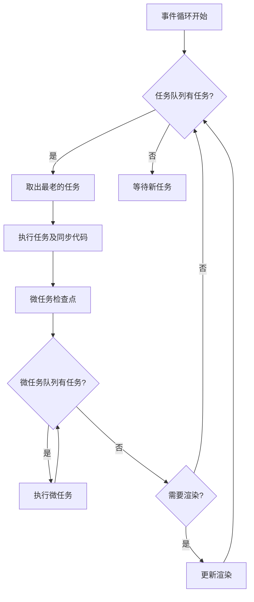

# 浏览器事件循环

> HTML 标准定义的事件循环：任务队列、微任务与渲染时机
>
> 对齐版本：HTML Living Standard §8.1.4 | ECMAScript 2025 (ES16)

---

## 1. HTML 规范模型

浏览器的事件循环由 HTML Living Standard 定义，是一个协调脚本执行、渲染、网络事件等任务的机制。核心组件：

- **事件循环（Event Loop）**：一个或多个任务队列 + 一个微任务队列
- **任务（Task）**：macrotask，如 setTimeout、用户交互事件、脚本执行
- **微任务（Microtask）**：Promise 回调、MutationObserver、queueMicrotask



---

## 2. 任务类型详解

### 2.1 宏任务（Macrotask）来源

| 来源 | 说明 | 示例 |
|------|------|------|
| `setTimeout` / `setInterval` | 定时器回调 | `setTimeout(fn, 100)` |
| I/O 操作 | 文件、网络请求完成 | `fetch().then()` 的回调不是宏任务，但底层网络事件是 |
| UI 渲染事件 | 用户交互 | `click`, `scroll`, `keydown` |
| `MessageChannel` | 跨上下文消息 | 常用于 polyfill `setImmediate` |
| `requestAnimationFrame` | 动画帧回调 | 在渲染阶段之前执行 |

### 2.2 微任务（Microtask）来源

| 来源 | 说明 |
|------|------|
| `Promise.then` / `.catch` / `.finally` | Promise 解决后的回调 |
| `queueMicrotask()` | 显式添加微任务 |
| `MutationObserver` | DOM 变更观察回调 |
| `async/await` 的 `await` 后续 | `await` 后的代码作为微任务执行 |

---

## 3. 事件循环步骤详解

HTML 规范定义的事件循环处理模型（简化版）：

```
1. 令 oldestTask 为任务队列中最老的可运行任务
2. 如果没有任务，跳到步骤 8
3. 从任务队列中移除 oldestTask
4. 将 oldestTask 设为当前正在运行的任务
5. 执行 oldestTask
6. 将事件循环的当前正在运行任务设为空
7. 执行微任务检查点
8. 更新渲染（如果必要且有机会）
9. 返回步骤 1
```

### 3.1 微任务检查点（Microtask Checkpoint）

```javascript
console.log("Start");

setTimeout(() => console.log("setTimeout"), 0);

Promise.resolve().then(() => {
  console.log("Promise 1");
  Promise.resolve().then(() => console.log("Promise 2"));
  queueMicrotask(() => console.log("queueMicrotask"));
});

Promise.resolve().then(() => console.log("Promise 3"));

console.log("End");

// 输出：
// Start
// End
// Promise 1
// Promise 3
// Promise 2
// queueMicrotask
// setTimeout
```

**关键规则**：微任务检查点会**递归清空**微任务队列，直到为空。这意味着微任务中创建的新微任务也会在同一次检查点中执行。

### 3.2 渲染时机

```javascript
// 每帧的理想事件循环流程
function eventLoopIteration() {
  // 1. 执行一个宏任务
  const task = dequeueTask();
  execute(task);

  // 2. 清空所有微任务
  while (microtaskQueue.length > 0) {
    const microtask = dequeueMicrotask();
    execute(microtask);
  }

  // 3. 检查是否需要渲染
  if (shouldRender()) {
    // 4. 执行 rAF 回调
    executeAnimationFrameCallbacks();

    // 5. 样式计算
    recalculateStyles();

    // 6. 布局（重排）
    performLayout();

    // 7. 绘制（重绘）
    paint();

    // 8. 合成
    compositeLayers();
  }
}
```

---

## 4. requestAnimationFrame

### 4.1 与事件循环的关系

`requestAnimationFrame`（rAF）在**渲染阶段之前**执行，与屏幕刷新率同步（通常 60Hz）：

```javascript
console.log("Before rAF");

requestAnimationFrame(() => {
  console.log("rAF callback");
});

Promise.resolve().then(() => {
  console.log("Promise microtask");
});

setTimeout(() => {
  console.log("setTimeout");
}, 0);

console.log("After rAF");

// 输出：
// Before rAF
// After rAF
// Promise microtask
// rAF callback（在下一帧渲染前）
// setTimeout
```

### 4.2 rAF vs setTimeout 动画

```javascript
// ❌ 不推荐：setTimeout 动画可能与刷新率不同步
function animateWithTimeout() {
  setTimeout(() => {
    updatePosition();
    animateWithTimeout();
  }, 16); // 约 60fps，但不精确
}

// ✅ 推荐：rAF 与刷新率同步
function animateWithRAF() {
  updatePosition();
  requestAnimationFrame(animateWithRAF);
}
requestAnimationFrame(animateWithRAF);
```

---

## 5. 与规范的对照

| 概念 | HTML 标准 | ECMAScript |
|------|----------|-----------|
| 事件循环 | §8.1.4 Event loops | §9.7 Jobs and Job Queues |
| 任务 | task | ScriptJob / PromiseJob |
| 微任务 | microtask | PromiseJobs |
| 渲染 | update the rendering | N/A（宿主环境定义）|

---

## 6. 常见陷阱

### 6.1 微任务饥饿宏任务

```javascript
function loop() {
  Promise.resolve().then(loop);
}
loop();
// 微任务队列永远不为空，setTimeout 等宏任务永远不会执行！
```

**解决方案**：将递归放入 `setTimeout`：

```javascript
function loop() {
  setTimeout(loop, 0);
}
```

### 6.2 同步代码阻塞渲染

```javascript
button.addEventListener("click", () => {
  // 长时间同步计算
  const start = performance.now();
  while (performance.now() - start < 1000) {}
  // 这 1 秒内 UI 完全冻结
});
```

**解决方案**：

```javascript
button.addEventListener("click", async () => {
  await new Promise(resolve => setTimeout(resolve, 0));
  // 将计算转移到下一个宏任务，允许 UI 更新
});
```

### 6.3 setTimeout(fn, 0) 不精确

HTML5 规范规定 `setTimeout` 的最小延迟为 **4ms**（嵌套层级超过 5 层时）：

```javascript
function nestedTimeout() {
  setTimeout(() => {
    console.log("Delayed");
    nestedTimeout();
  }, 0);
}
// 第五次调用后，实际延迟至少 4ms
```

**需要更快响应时使用**：

```javascript
// queueMicrotask（微任务）
queueMicrotask(() => console.log("Next microtask"));

// MessageChannel（宏任务，但比 setTimeout 快）
const channel = new MessageChannel();
channel.port2.onmessage = () => console.log("Next task");
channel.port1.postMessage(null);
```

---

## 7. 实战：事件循环调试技巧

### 7.1 使用 Performance API

```javascript
const observer = new PerformanceObserver((list) => {
  for (const entry of list.getEntries()) {
    console.log(`${entry.name}: ${entry.duration}ms`);
  }
});
observer.observe({ entryTypes: ["measure", "longtask"] });

// 标记长任务
performance.mark("task-start");
// ... 可能的长任务
performance.mark("task-end");
performance.measure("my-task", "task-start", "task-end");
```

### 7.2 Chrome DevTools Performance 面板

- 黄色条：JavaScript 执行
- 紫色条：样式计算
- 绿色条：绘制
- 灰色条：其他（微任务检查点等）

---

**参考规范**：HTML Living Standard §8.1.4 Event loops | ECMA-262 §9.7 Jobs and Job Queues
