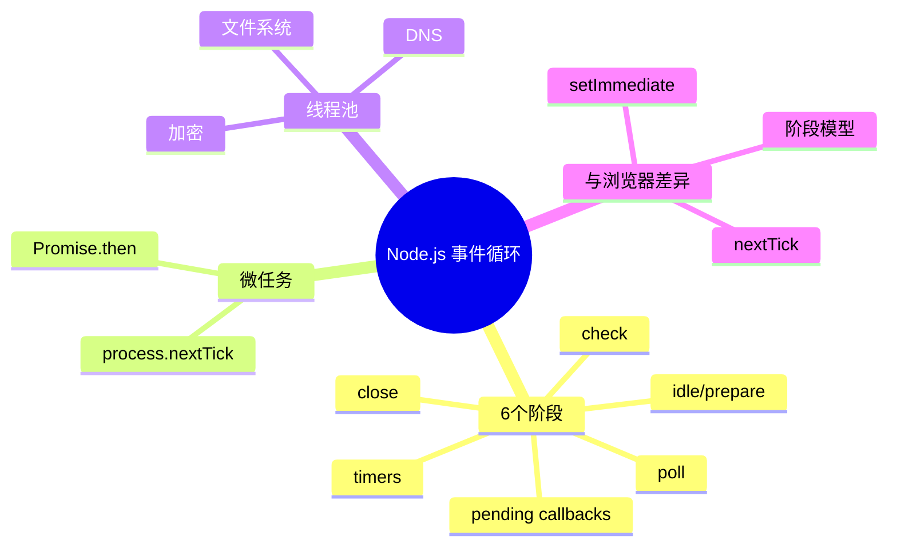
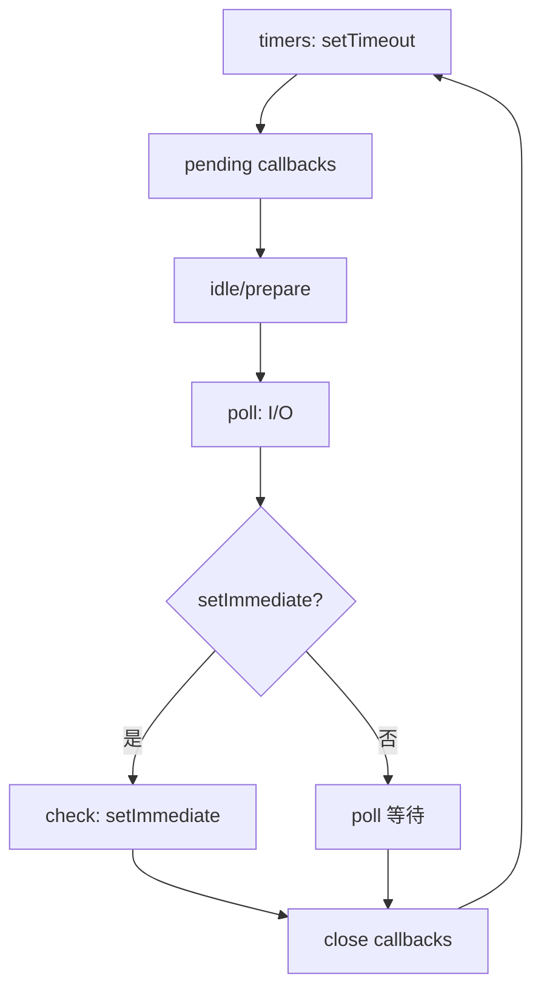
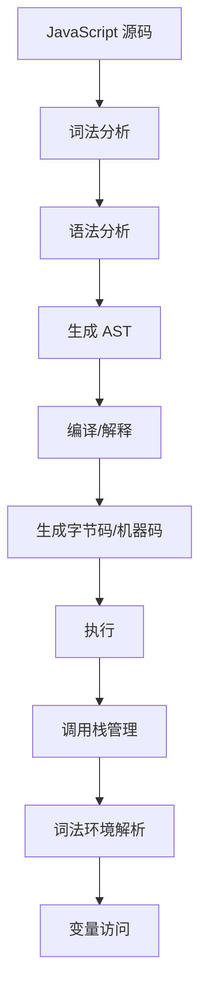

# Node.js 事件循环（Event Loop - Node.js）

> **形式化定义**：Node.js 事件循环基于 libuv 库实现，与浏览器事件循环有显著差异。Node.js 事件循环分为 6 个阶段（phases）：timers、pending callbacks、idle/prepare、poll、check、close callbacks。每个阶段维护一个 FIFO 队列，执行该阶段的回调。在阶段之间，Node.js 执行微任务队列（nextTickQueue 和 microtaskQueue）。libuv 还管理线程池（Thread Pool）处理阻塞 I/O 操作。
>
> 对齐版本：Node.js 22+ | libuv | ECMAScript 2025 (ES16)

---

## 1. 概念定义 (Concept Definition)

### 1.1 形式化定义

Node.js 事件循环的 6 个阶段：

| 阶段 | 说明 |
|------|------|
| **timers** | setTimeout/setInterval 回调 |
| **pending callbacks** | 系统操作的延迟回调 |
| **idle, prepare** | 内部使用 |
| **poll** | I/O 回调、新连接 |
| **check** | setImmediate 回调 |
| **close callbacks** | close 事件回调 |

### 1.2 概念层级图谱



---

## 2. 属性与特征 (Properties & Characteristics)

### 2.1 Node.js vs 浏览器事件循环

| 特性 | Node.js | 浏览器 |
|------|---------|--------|
| 阶段数 | 6 | 3（任务/微任务/渲染） |
| setImmediate | 有 | 无 |
| nextTick | 有（微任务前） | 无 |
| 线程池 | 有（libuv） | 无（Web Workers 分离） |
| I/O 模型 | 非阻塞 + 线程池 | 非阻塞（Web API） |

---

## 3. 关系分析 (Relationship Analysis)

### 3.1 阶段执行顺序

```
┌─────────┐    ┌─────────┐    ┌─────────┐    ┌─────────┐    ┌─────────┐    ┌─────────┐
│ timers  │───→│ pending │───→│  idle   │───→│  poll   │───→│  check  │───→│  close  │──┐
│         │    │callbacks│    │prepare  │    │         │    │         │    │callbacks│  │
└─────────┘    └─────────┘    └─────────┘    └─────────┘    └─────────┘    └─────────┘  │
     ↑─────────────────────────────────────────────────────────────────────────────────────┘
```

---

## 4. 机制解释 (Mechanism Explanation)

### 4.1 Node.js 事件循环周期



---

## 5. 论证与分析 (Argumentation & Analysis)

### 5.1 setTimeout vs setImmediate

```javascript
setTimeout(() => console.log("timeout"), 0);
setImmediate(() => console.log("immediate"));

// 输出顺序不确定！
// 如果主模块中：可能 timeout 先（取决于系统时钟精度）
// 如果 I/O 回调中：immediate 先（poll 阶段后执行 check）
```

### 5.2 process.nextTick 的优先级

```javascript
setTimeout(() => console.log("timeout"), 0);
setImmediate(() => console.log("immediate"));
Promise.resolve().then(() => console.log("promise"));
process.nextTick(() => console.log("nextTick"));

// 输出: nextTick, promise, timeout, immediate
// nextTick 优先级最高，在阶段之间执行
```

---

## 6. 实例与示例 (Examples)

### 6.1 正例：I/O 回调中的 setImmediate

```javascript
const fs = require("fs");

fs.readFile(__filename, () => {
  setTimeout(() => console.log("timeout"), 0);
  setImmediate(() => console.log("immediate"));
  // 输出: immediate, timeout
  // 因为在 poll 阶段后进入 check 阶段
});
```

---

## 7. 权威参考与国际化对齐 (References)

- **Node.js Docs: Event Loop** — https://nodejs.org/en/docs/guides/event-loop-timers-and-nexttick/
- **libuv Design** — https://docs.libuv.org/en/v1.x/design.html

---

## 8. 思维表征总结 (Cognitive Representations)

### 8.1 Node.js 事件循环阶段

```
┌─────────────────────────────────────────────────────────┐
│                   Node.js 事件循环                       │
├─────────────────────────────────────────────────────────┤
│  1. timers (setTimeout/setInterval)                     │
│  2. pending callbacks (系统回调)                         │
│  3. idle, prepare (内部)                                │
│  4. poll (I/O 回调)                                     │
│     └─ 检查 setImmediate?                               │
│  5. check (setImmediate)                                │
│  6. close callbacks (close 事件)                         │
│                                                         │
│  阶段之间: process.nextTick → Promise.then              │
└─────────────────────────────────────────────────────────┘
```

---

## 9. 公理化表述与形式证明 (Axiomatization & Formal Proof)

### 9.1 公理化基础

**公理 1（阶段顺序的确定性）**：
> Node.js 事件循环的阶段按固定顺序执行，timers → pending → idle → poll → check → close。

**公理 2（nextTick 的优先性）**：
> `process.nextTick` 回调在当前操作完成后、进入下一个阶段前执行。

### 9.2 定理与证明

**定理 1（setImmediate 在 I/O 中的优先性）**：
> 在 I/O 回调中，`setImmediate` 先于 `setTimeout(0)` 执行。

*证明*：
> I/O 回调在 poll 阶段执行。poll 阶段结束后进入 check 阶段（执行 setImmediate），然后才进入 timers 阶段（执行 setTimeout）。
> ∎

---

## 10. 推理链与演绎分析 (Deductive Reasoning Chain)

### 10.1 演绎推理

```mermaid
graph TD
    A[setTimeout(fn, 0)] --> B[timers 队列]
    A2[setImmediate(fn)] --> C[check 队列]
    A3[I/O 完成] --> D[poll 阶段]
    D --> E[执行 I/O 回调]
    E --> F[进入 check 阶段]
    F --> G[执行 setImmediate]
    G --> H[进入 timers 阶段]
    H --> I[执行 setTimeout]
```

### 10.2 反事实推理

> **反设**：Node.js 使用浏览器的事件循环模型。
> **推演结果**：没有 setImmediate、没有 nextTick、I/O 回调与定时器混合调度，服务器端性能下降。
> **结论**：Node.js 的阶段模型更适合服务器端 I/O 密集型场景。

---

**参考规范**：Node.js Docs: Event Loop | libuv Design


---

## 9. 公理化表述与形式证明 (Axiomatization & Formal Proof)

### 9.1 执行模型的公理化基础

**公理 1（单线程语义）**：
> JavaScript 在单个 Agent 内是单线程执行的，同一时刻只有一个执行上下文在运行。

**公理 2（运行至完成）**：
> 当前执行的任务（宏任务或微任务）不会被其他任务中断，直到完成。

**公理 3（调用栈的 LIFO 性）**：
> 执行上下文栈遵循后进先出原则，函数返回时弹出当前上下文。

**公理 4（词法环境的静态性）**：
> 词法环境的 `[[OuterEnv]]` 在函数定义时确定，不因调用位置改变。

### 9.2 定理与证明

**定理 1（事件循环的调度公平性）**：
> 事件循环按 FIFO 顺序从任务队列中取出任务执行，确保同一队列中的任务按顺序调度。

*证明*：
> HTML Living Standard §8.1.4.2 规定事件循环从任务队列中取出"最老的可运行任务"执行。最老即最先入队，遵循 FIFO。
> ∎

**定理 2（this 绑定的调用时确定性）**：
> 非箭头函数的 `this` 值在函数调用时确定，与定义位置无关。

*证明*：
> ECMA-262 §10.2.1 定义了 `[[Call]]` 方法的 this 绑定规则。调用时根据调用方式（默认/隐式/显式/new）确定 this 值。
> ∎

**定理 3（闭包的环境保持）**：
> 闭包函数在定义时捕获的词法环境，在函数对象存活期间保持可达。

*证明*：
> 函数对象的 `[[Environment]]` 内部槽指向定义时的词法环境。只要函数对象被引用，该词法环境即被引用，GC 不会回收。
> ∎

**定理 4（Promise.then 的异步时序）**：
> `Promise.resolve().then(f)` 中的 `f` 在当前同步代码执行完毕后执行。

*证明*：
> `then` 将回调包装为 Job 放入 Job Queue。根据 ECMA-262 §9.5，Job Queue 在当前执行上下文完成后处理。
> ∎

### 9.3 真值表：this 绑定规则

| 调用方式 | 严格模式 | 非严格模式 | 箭头函数 |
|---------|---------|-----------|---------|
| `fn()` | undefined | globalThis | 继承外层 |
| `obj.fn()` | obj | obj | 继承外层 |
| `fn.call(obj)` | obj | obj | 继承外层 |
| `fn.apply(obj)` | obj | obj | 继承外层 |
| `new Fn()` | 新对象 | 新对象 | 不可 new |
| `fn.bind(obj)()` | obj | obj | 继承外层 |

---

## 10. 推理链与演绎分析 (Deductive Reasoning Chain)

### 10.1 演绎推理：从源码到执行



### 10.2 归纳推理：从运行时现象推导机制

| 现象 | 推断的底层机制 | 验证方法 |
|------|--------------|---------|
| 变量提升 | 编译阶段变量实例化 | 在声明前访问 var 变量 |
| 闭包保持变量 | 词法环境被函数引用 | 外部函数返回后内部函数仍可访问变量 |
| 异步回调延迟 | 事件循环队列调度 | 对比同步和异步代码执行顺序 |
| this 值变化 | 动态绑定规则 | 同一函数不同调用方式测试 |
| 栈溢出 | 调用栈深度限制 | 无限递归测试 |

### 10.3 反事实推理

> **反设**：JavaScript 是多线程语言，没有事件循环。
> **推演结果**：
> 1. 需要显式锁和同步原语
> 2. 共享内存导致数据竞争
> 3. 异步编程模型完全不同
> 4. 事件驱动编程需要显式线程管理
>
> **结论**：单线程 + 事件循环模型是 JavaScript 简单易用的核心设计，虽然限制了 CPU 密集型任务的性能，但极大简化了并发编程。

---

## 11. 形式语义说明

### 11.1 操作语义

JavaScript 执行的操作语义可表示为状态转换：

```
⟨stmt, σ, θ⟩ → ⟨stmt', σ', θ'⟩
```

其中：
- `stmt`：当前执行的语句
- `σ`：程序状态（变量绑定）
- `θ`：执行上下文栈

### 11.2 指称语义

函数调用的指称语义：

```
[[fn(arg)]](σ) = 
  创建新上下文 ctx
  绑定参数 arg 到形参
  执行函数体
  返回结果
  弹出上下文 ctx
```

---

## 12. 性能与最佳实践

### 12.1 性能考量

| 操作 | 时间复杂度 | 空间复杂度 | 优化建议 |
|------|-----------|-----------|---------|
| 函数调用 | O(1) | O(1) | 避免深层递归 |
| 属性访问 | O(1) 平均 | O(1) | 使用局部变量缓存 |
| 闭包创建 | O(1) | O(环境大小) | 只引用需要的变量 |
| 事件监听 | O(1) | O(1) | 及时移除不需要的监听 |
| Promise 创建 | O(1) | O(1) | 避免不必要的包装 |

### 12.2 最佳实践总结

```javascript
// ✅ 避免深层递归，使用迭代
function factorial(n) {
  let result = 1;
  for (let i = 2; i <= n; i++) result *= i;
  return result;
}

// ✅ 缓存频繁访问的属性
function process(obj) {
  const data = obj.data; // 缓存
  for (let i = 0; i < 1000; i++) {
    use(data[i]);
  }
}

// ✅ 及时移除事件监听
const handler = () => { /* ... */ };
element.addEventListener("click", handler);
// ...
element.removeEventListener("click", handler);

// ✅ 使用 WeakMap 避免内存泄漏
const cache = new WeakMap();
function compute(obj) {
  if (!cache.has(obj)) {
    cache.set(obj, heavyCompute(obj));
  }
  return cache.get(obj);
}
```

---

## 13. 思维模型总结

### 13.1 执行模型核心速查

| 概念 | 关键属性 | 常见问题 |
|------|---------|---------|
| 调用栈 | LIFO、深度限制 | 栈溢出 |
| 执行上下文 | 词法环境、this、变量 | this 绑定错误 |
| 词法环境 | 静态作用域链 | 闭包内存泄漏 |
| 事件循环 | 单线程、任务队列 | 阻塞主线程 |
| 微任务 | Promise、nextTick | 微任务饿死 |
| GC | 可达性分析、分代 | 内存泄漏 |
| Agent | 逻辑线程、内存隔离 | SharedArrayBuffer 安全 |
| Realm | 全局环境隔离 | iframe 通信 |

### 13.2 调试工具链

| 工具 | 用途 | 场景 |
|------|------|------|
| Chrome DevTools Performance | 性能分析 | 长任务、渲染阻塞 |
| Chrome DevTools Memory | 内存分析 | 内存泄漏检测 |
| Node.js --prof | CPU 分析 | 热点函数识别 |
| Node.js --heapsnapshot | 堆快照 | 内存占用分析 |

---

## 14. 权威参考完整索引

| 来源 | 链接 | 相关章节 |
|------|------|---------|
| ECMA-262 | tc39.es/ecma262 | §8.1, §9, §10, §27 |
| HTML Living Standard | html.spec.whatwg.org | §8.1.4.2 |
| V8 Blog | v8.dev/blog | Ignition, TurboFan, GC |
| Node.js Docs | nodejs.org | Event Loop, libuv |
| MDN | developer.mozilla.org | Execution context, Event loop |

---

**参考规范**：ECMA-262 §8-10 | HTML Living Standard | V8 Blog | Node.js Docs
