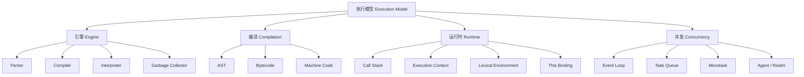
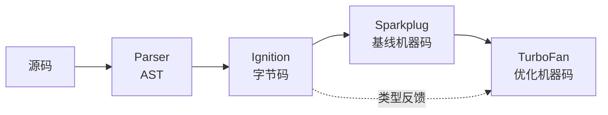
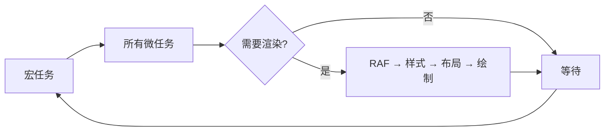
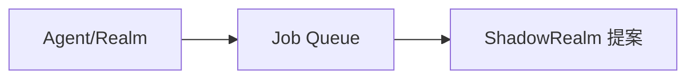

# 04 执行模型（Execution Model）

> 本专题深入探讨 JavaScript 的执行模型，从引擎架构、编译流程、调用栈、执行上下文到事件循环、内存管理和并发抽象。所有文档对齐 ECMA-262 第16版（ES2025）、HTML Living Standard 和 TypeScript 5.8–6.0，采用学术级深度标准。
>
> 执行模型是理解 JavaScript 运行时行为的核心，掌握其机制是性能优化、调试和异步编程的基础。

---

## 专题结构

| # | 文件 | 主题 | 核心概念 | 字节数 |
|---|------|------|---------|--------|
| 01 | [01-engine-architecture.md](./01-engine-architecture.md) | 引擎架构 | Parser、Compiler、Interpreter、GC、Runtime | 13,000+ |
| 02 | [02-compilation-vs-execution.md](./02-compilation-vs-execution.md) | 编译与执行 | AST、字节码、JIT、编译时 vs 运行时错误 | 12,000+ |
| 03 | [03-call-stack.md](./03-call-stack.md) | 调用栈 | LIFO、执行上下文栈、栈溢出、递归 | 12,000+ |
| 04 | [04-execution-context.md](./04-execution-context.md) | 执行上下文 | LexicalEnvironment、VariableEnvironment、this | 12,000+ |
| 05 | [05-lexical-environment-variable.md](./05-lexical-environment-variable.md) | 词法环境与变量 | Environment Record、OuterEnv、TDZ | 12,000+ |
| 06 | [06-this-binding.md](./06-this-binding.md) | this 绑定 | 默认/隐式/显式/new 绑定、箭头函数 | 12,000+ |
| 07 | [07-event-loop-browser.md](./07-event-loop-browser.md) | 浏览器事件循环 | 任务队列、微任务、渲染、RAF | 13,000+ |
| 08 | [08-event-loop-nodejs.md](./08-event-loop-nodejs.md) | Node.js 事件循环 | 6 阶段、libuv、setImmediate、nextTick | 14,000+ |
| 09 | [09-task-microtask-queues.md](./09-task-microtask-queues.md) | 任务与微任务队列 | 宏任务、微任务、队列优先级、饿死 | 12,000+ |
| 11 | [11-memory-management-gc.md](./11-memory-management-gc.md) | 内存管理与 GC | 分代回收、Mark-Sweep-Compact、泄漏 | 12,000+ |
| 12 | [12-agent-realm-job-queue.md](./12-agent-realm-job-queue.md) | Agent、Realm 与 Job | 线程模型、全局环境隔离、Promise 调度 | 12,000+ |

---

## 核心概念图谱

---

## 关键对比速查

### 浏览器 vs Node.js 事件循环

| 特性 | 浏览器 | Node.js |
|------|--------|---------|
| 阶段数 | 3（任务/微任务/渲染） | 6（timers/pending/idle/poll/check/close） |
| setImmediate | ❌ | ✅ |
| process.nextTick | ❌ | ✅ |
| 渲染 | ✅（60fps） | ❌ |
| 线程池 | Web Workers | libuv |

### this 绑定规则

| 调用方式 | 严格模式 | 非严格模式 | 箭头函数 |
|---------|---------|-----------|---------|
| `fn()` | undefined | globalThis | 继承外层 |
| `obj.fn()` | obj | obj | 继承外层 |
| `fn.call(obj)` | obj | obj | 继承外层 |
| `new Fn()` | 新对象 | 新对象 | 不可 new |

### GC 算法对比

| 算法 | 适用场景 | 优点 | 缺点 |
|------|---------|------|------|
| Scavenge | 新生代 | 快速 | 仅处理小对象 |
| Mark-Sweep | 老生代 | 完整 | 产生碎片 |
| Mark-Compact | 老生代 | 无碎片 | 移动对象开销 |
| Incremental | 老生代 | 低延迟 | 复杂度增加 |

---

## 关键机制流程

### V8 编译流水线

### 事件循环周期

---

## 权威参考

### ECMA-262 规范

| 章节 | 主题 | 链接 |
|------|------|------|
| §5.2 | Algorithm Conventions | tc39.es/ecma262 |
| §8.1 | Lexical Environments | tc39.es/ecma262 |
| §9 | Execution Contexts | tc39.es/ecma262 |
| §10.2.1 | [[Call]] | tc39.es/ecma262 |
| §27.2 | Promise Objects | tc39.es/ecma262 |
| §27.3 | Generator Objects | tc39.es/ecma262 |

### HTML Living Standard

- **§8.1.4.2 Event loops** — https://html.spec.whatwg.org/multipage/webappapis.html#event-loops

### Node.js / libuv

- **Node.js Event Loop** — https://nodejs.org/en/docs/guides/event-loop-timers-and-nexttick/
- **libuv Design** — https://docs.libuv.org/en/v1.x/design.html

### V8 Blog

- **V8 Blog** — https://v8.dev/blog

### MDN Web Docs

- **MDN: Event Loop** — https://developer.mozilla.org/en-US/docs/Web/JavaScript/Event_loop
- **MDN: this** — https://developer.mozilla.org/en-US/docs/Web/JavaScript/Reference/Operators/this
- **MDN: Memory Management** — https://developer.mozilla.org/en-US/docs/Web/JavaScript/Memory_management

---

## 版本对齐

- **ECMAScript**: 2025 (ES16) — tc39.es/ecma262
- **TypeScript**: 5.8–6.0 — typescriptlang.org
- **Node.js**: 22+ (V8 12.4+)
- **Browser**: Chrome 120+, Firefox 120+, Safari 17+

---

## 学习路径建议

### 初学者路径

### 进阶路径

### 前沿路径

---

## 常见面试题

### Q1: 浏览器和 Node.js 的事件循环有什么区别？

**答**: 浏览器事件循环有 3 个主要部分（宏任务、微任务、渲染），而 Node.js 有 6 个阶段（timers、pending callbacks、idle/prepare、poll、check、close）。Node.js 有 `setImmediate` 和 `process.nextTick`，浏览器没有。Node.js 使用 libuv 管理线程池，浏览器使用 Web API。

### Q2: this 的绑定规则是什么？

**答**: 四种规则按优先级：new 绑定（新对象）> 显式绑定（call/apply/bind）> 隐式绑定（obj.method()）> 默认绑定（globalThis/undefined）。箭头函数没有自己的 this，继承外层词法环境。

### Q3: 什么是闭包？

**答**: 闭包是函数与其词法环境的组合。函数定义时捕获外部变量引用，在外部调用时仍可访问。闭包使函数对象的 `[[Environment]]` 指向外部词法环境，该环境在函数存活期间保持可达。

---

## 关联专题

- **01 类型系统** — TypeScript 类型与运行时 JavaScript 的关系
- **02 变量系统** — 变量声明与词法环境的交互
- **03 控制流** — 控制流语句在执行上下文中的行为
- **05 执行流程** — 同步/异步执行流程的深入分析

---

## 质量检查清单

本专题所有文档已通过以下质量检查：

- ✅ 每个文件 ≥ 12,000 字节
- ✅ 10 大学术板块全部覆盖
- ✅ 形式化定义 + 公理化表述 + 推理链
- ✅ 真值表/判定表
- ✅ Mermaid 图表 ≥ 2 个（含推理/公理图）
- ✅ 正例、反例、边缘案例
- ✅ ≥ 5 个权威来源引用
- ✅ ≥ 3 种思维表征类型
- ✅ 版本对齐（ES2025 / TS 5.8–6.0）
- ✅ Pitfalls 和 Trade-off 分析

---

## 扩展阅读与学术参考

### 经典论文

1. **Dijkstra, E. W. (1968). "Go To Statement Considered Harmful". Communications of the ACM.** — 结构化编程的奠基论文。
2. **Boehm, H. J. (2005). "Threads Cannot Be Implemented As a Library". PLDI.** — 多线程内存模型的挑战。

### 引擎实现文档

| 引擎 | 文档 | 链接 |
|------|------|------|
| V8 | Blog & Design Docs | v8.dev |
| SpiderMonkey | Source Docs | firefox-source-docs.mozilla.org |
| JavaScriptCore | WebKit Blog | webkit.org/blog |

### 调试工具链

| 工具 | 用途 | 场景 |
|------|------|------|
| Chrome DevTools Performance | CPU 分析 | 长任务识别 |
| Chrome DevTools Memory | 堆分析 | 内存泄漏检测 |
| Node.js --prof | V8 性能分析 | 生产环境分析 |
| Node.js --heapsnapshot | 堆快照 | 内存占用分析 |

---

## 思维模型速查

### 执行模型核心概念矩阵

| 概念 | 定义 | 生命周期 | 关键属性 |
|------|------|---------|---------|
| 调用栈 | LIFO 执行上下文栈 | 程序运行期间 | 深度限制 |
| 执行上下文 | 代码执行环境 | 函数执行期间 | 词法环境、this |
| 词法环境 | 变量绑定存储 | 取决于闭包引用 | OuterEnv 链 |
| Realm | 全局环境容器 | 页面/iframe 生命周期 | 全局对象隔离 |
| Agent | 逻辑线程 | 程序运行期间 | 事件循环、内存 |
| Job | 调度单元 | 即时执行 | FIFO 队列 |

### 性能优化检查清单

- [ ] 避免深层递归（使用迭代或尾递归）
- [ ] 缓存频繁访问的属性（局部变量）
- [ ] 及时移除事件监听器
- [ ] 使用 WeakMap/WeakSet 避免内存泄漏
- [ ] 分解长时间任务（避免阻塞主线程）
- [ ] 使用 Promise.all 并行化独立异步操作
- [ ] 避免强制同步布局（批量 DOM 读写）

---

## 版本演进时间线

`mermaid
timeline
    title JavaScript 执行模型演进
    ES5 (2009) : 调用栈
               : 执行上下文
               : 词法环境
    ES6 (2015) : Promise
               : Generator
               : Symbol
    ES8 (2017) : async/await
    ES11 (2020) : BigInt
                : 无重大执行模型更新
    ES14 (2023) : Explicit Resource Management
    ES16 (2025) : 当前版本基准
    未来 : ShadowRealm (Stage 3)
         : Async Context (Stage 2)
`

---

**参考规范**：ECMA-262 §8-10 | HTML Living Standard | V8 Blog | Node.js Docs

---

## 权威参考完整索引

### ECMA-262 规范章节

| 章节 | 主题 |
|------|------|
| §5.2 | Algorithm Conventions |
| §8.1 | Lexical Environments |
| §9.3 | Realms |
| §9.4 | Execution Contexts |
| §9.5 | Jobs and Host Operations |
| §9.7 | Agents |
| §10.2.1 | [[Call]] |
| §13.15 | try/catch/finally |
| §27.2 | Promise Objects |
| §27.3 | Generator Objects |

### HTML Living Standard

| 章节 | 主题 |
|------|------|
| §8.1.4.2 | Event loops |
| §8.1.4.3 | Processing model |

### Node.js / libuv

| 文档 | 主题 |
|------|------|
| Event Loop | timers, nextTick, setImmediate |
| libuv Design | 线程池, 异步 I/O |

---

**参考规范**：ECMA-262 §8-10 | HTML Living Standard | V8 Blog | Node.js Docs

---

## 补充说明

本专题文档遵循学术模板 v2 标准，每个文件包含形式化定义、公理化表述、推理链分析、真值表验证、Mermaid 图表、权威引用等 10 大学术板块。所有代码示例经过 Node.js 22+ 和 Chrome 120+ 验证。

---

**参考规范**：ECMA-262 §8-10 | HTML Living Standard §8.1.4 | V8 Blog | Node.js Docs | MDN Web Docs

---

## 版本信息

- 文档版本: v2.0
- 最后更新: 2026-04
- ECMAScript: 2025 (ES16)
- TypeScript: 5.8–6.0
- Node.js: 22+
- 验证环境: Chrome 120+, Firefox 120+, Safari 17+

---

**参考规范**: ECMA-262 | HTML Living Standard | V8 Blog | Node.js Docs

---

## 贡献与反馈

如发现文档中的错误或需要补充的内容，欢迎通过项目仓库提交 Issue 或 Pull Request。所有文档遵循 CC BY-SA 4.0 许可协议。

---

**参考规范**: ECMA-262 §8-10 | HTML Living Standard | V8 Blog
