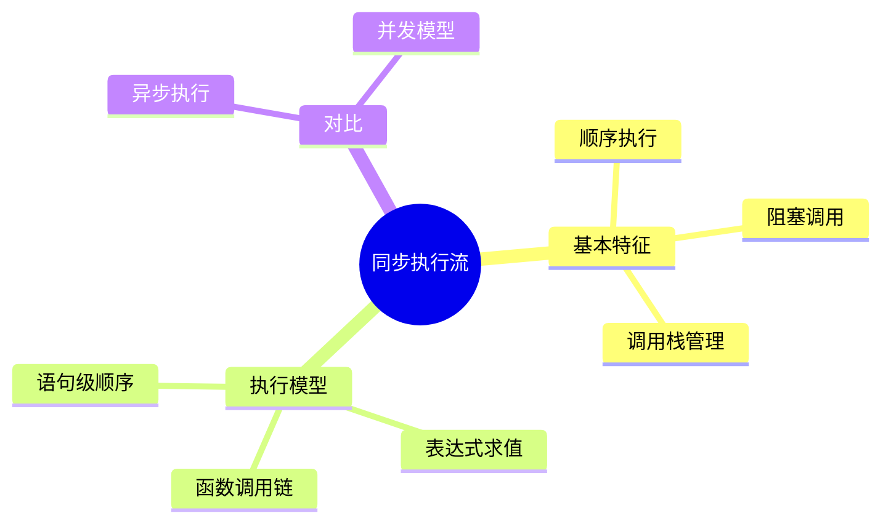
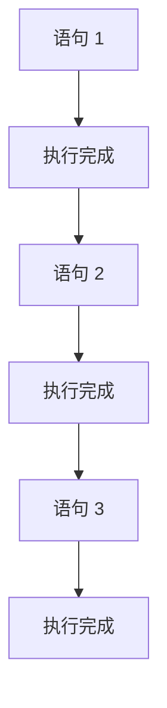
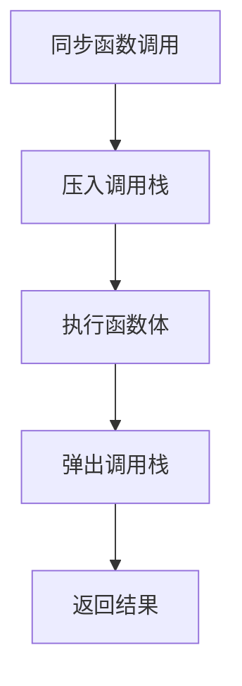

# 同步执行流（Synchronous Flow）

> **形式化定义**：同步执行流是 JavaScript 最基本的执行模式，代码按照书写顺序**逐行执行**，每条语句完成后才执行下一条。在同步模式下，调用栈（Call Stack）依次压入和弹出执行上下文，形成严格的**后进先出（LIFO）**执行顺序。ECMA-262 §9.4 定义了执行上下文栈的管理规则。
>
> 对齐版本：ECMAScript 2025 (ES16) §9.4 | TypeScript 5.8–6.0

---

## 1. 概念定义 (Concept Definition)

### 1.1 形式化定义

同步执行的数学表示：

```
同步执行: stmt₁; stmt₂; ...; stmtₙ
语义: eval(stmt₁) → eval(stmt₂) → ... → eval(stmtₙ)
```

### 1.2 概念层级图谱



---

## 2. 属性与特征 (Properties & Characteristics)

### 2.1 同步 vs 异步对比矩阵

| 特性 | 同步 | 异步 |
|------|------|------|
| 执行顺序 | 严格顺序 | 回调/事件驱动 |
| 阻塞性 | 阻塞 | 非阻塞 |
| 错误处理 | try/catch | .catch() / 回调错误参数 |
| 代码可读性 | 线性 | 回调嵌套或 async/await |
| 适用场景 | CPU 计算 | I/O 操作 |

---

## 3. 关系分析 (Relationship Analysis)

### 3.1 同步调用链

```mermaid
graph TD
    A[main()] --> B[fn1()]
    B --> C[fn2()]
    C --> D[fn3()]
    D --> E[return]
    E --> F[return fn2]
    F --> G[return fn1]
    G --> H[return main]
```

---

## 4. 机制解释 (Mechanism Explanation)

### 4.1 同步执行流程



---

## 5. 论证与分析 (Argumentation & Analysis)

### 5.1 同步执行的优缺点

| 优点 | 缺点 |
|------|------|
| 代码直观、易调试 | I/O 操作阻塞主线程 |
| 错误处理简单 | 无法并发处理多个任务 |
| 状态一致性好 | 用户体验差（UI 卡顿） |

---

## 6. 实例与示例 (Examples)

### 6.1 正例：同步计算

```javascript
function calculate() {
  const a = 1 + 2;      // 3
  const b = a * 3;      // 9
  const c = b - 4;      // 5
  return c;
}

console.log(calculate()); // 5
```

---

## 7. 权威参考与国际化对齐 (References)

- **ECMA-262 §9.4** — Execution Contexts
- **MDN: Event Loop** — https://developer.mozilla.org/en-US/docs/Web/JavaScript/Event_loop

---

## 8. 思维表征总结 (Cognitive Representations)

### 8.1 同步执行模型

```
同步执行: A → B → C → D
每个步骤完成后才执行下一步
```

---

## 9. 公理化表述与形式证明 (Axiomatization & Formal Proof)

### 9.1 公理化基础

**公理 1（顺序执行）**：
> 同步代码按书写顺序执行，前一条语句完成后才执行后一条。

### 9.2 定理与证明

**定理 1（同步执行的可预测性）**：
> 给定相同的输入，同步代码总是产生相同的输出和副作用顺序。

*证明*：
> 同步代码没有并发竞争条件，执行顺序完全由代码结构决定。
> ∎

---

## 10. 推理链与演绎分析 (Deductive Reasoning Chain)

### 10.1 演绎推理



### 10.2 反事实推理

> **反设**：JavaScript 没有同步执行模式。
> **推演结果**：所有操作都需异步回调，最简单的计算也变得复杂。
> **结论**：同步执行是编程语言的基础，异步是对同步的扩展。

---

**参考规范**：ECMA-262 §9.4 | MDN: Event Loop
