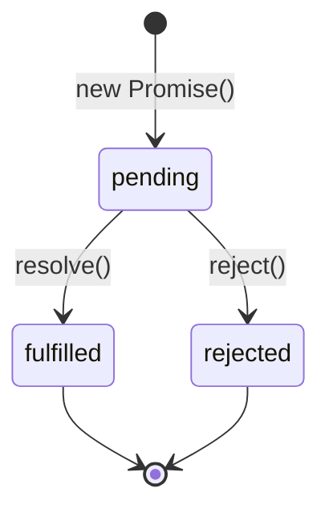

# Promise 执行流

> Promise 从创建到解决的完整执行轨迹
>
> 对齐版本：ECMAScript 2025 (ES16)

---

## 1. Promise 创建

```javascript
const promise = new Promise((resolve, reject) => {
  console.log("Executor runs immediately"); // 同步执行
  
  setTimeout(() => {
    resolve("Success"); // 异步解决
  }, 1000);
});
```

**关键点**：Promise executor 是**同步执行**的，这在理解 Promise 行为时非常重要。

---

## 2. 状态转换

```
pending ──resolve()──→ fulfilled
   │
   └─reject()──→ rejected
```

状态一旦确定，不可再变：

```javascript
const p = new Promise((resolve) => {
  resolve("first");
  resolve("second"); // 被忽略
});
```

---

## 3. 回调注册与执行

### 3.1 .then 的回调进入微任务队列

```javascript
Promise.resolve("value").then((value) => {
  console.log(value); // 微任务，当前同步代码结束后执行
});

console.log("sync"); // 先输出

// 输出：
// sync
// value
```

### 3.2 Promise 链的执行顺序

```javascript
Promise.resolve(1)
  .then((v) => { console.log("A:", v); return v + 1; })
  .then((v) => { console.log("B:", v); return v + 1; })
  .then((v) => { console.log("C:", v); });

// 输出：
// A: 1
// B: 2
// C: 3
```

---

## 4. 微任务调度细节

```javascript
console.log("1");

Promise.resolve().then(() => {
  console.log("2");
  Promise.resolve().then(() => {
    console.log("3");
  });
});

Promise.resolve().then(() => {
  console.log("4");
});

console.log("5");

// 输出：1, 5, 2, 4, 3
```

解析：
1. 同步代码：1, 5
2. 第一个微任务检查点：2, 4（按注册顺序）
3. 在 2 中注册了新的微任务 3
4. 第二个微任务检查点：3

---

## 5. Promise 静态方法执行流

### 5.1 Promise.resolve

```javascript
Promise.resolve("value");
// 等价于：
new Promise((resolve) => resolve("value"));
```

### 5.2 Promise.all

```javascript
Promise.all([
  Promise.resolve(1),
  Promise.resolve(2),
  Promise.resolve(3)
]).then((values) => console.log(values)); // [1, 2, 3]

// 如果任一 Promise 拒绝，立即拒绝
Promise.all([
  Promise.resolve(1),
  Promise.reject("error"),
  Promise.resolve(3)
]).catch((err) => console.log(err)); // "error"
```

### 5.3 Promise.race

```javascript
Promise.race([
  new Promise((resolve) => setTimeout(() => resolve("slow"), 100)),
  new Promise((resolve) => setTimeout(() => resolve("fast"), 10))
]).then((winner) => console.log(winner)); // "fast"
```

---

## 6. 可视化



---

**参考规范**：ECMA-262 §27.2 Promise Objects
