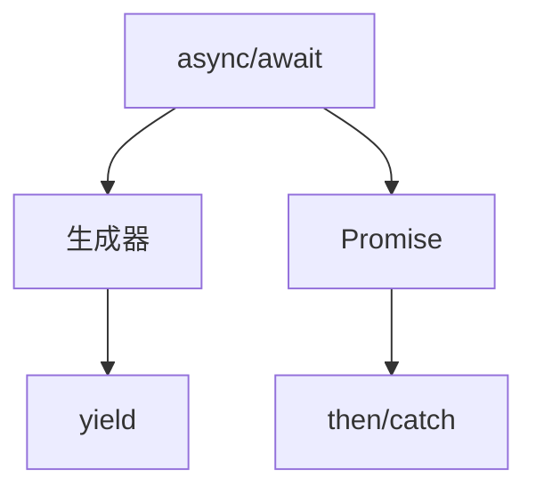
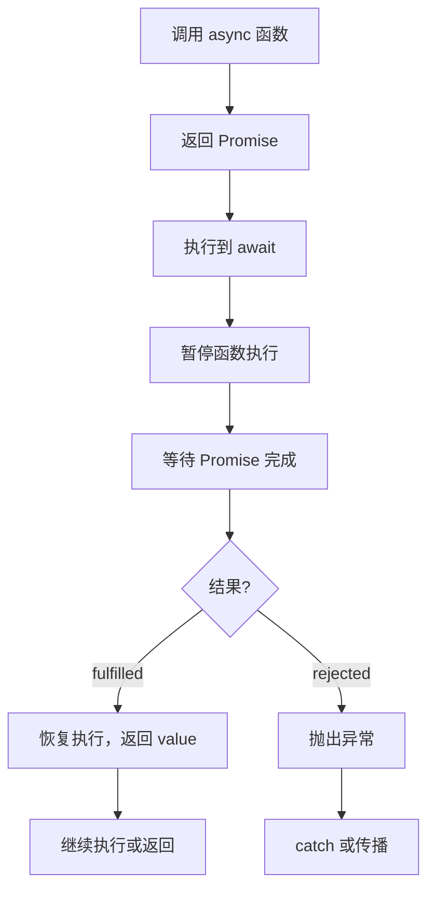
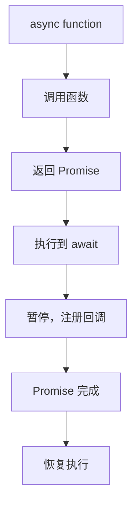

# async/await 转换（Async/Await Transformation）

> **形式化定义**：async/await 是 ECMAScript 2017（ES8）引入的语法糖，将基于 Promise 的异步代码转换为看似同步的写法。`async function` 隐式返回 Promise，`await` 表达式暂停 async 函数执行并等待 Promise 完成。ECMA-262 §15.8 定义了 async 函数的语义，其底层实现依赖于生成器（Generator）和 Promise 的组合。
>
> 对齐版本：ECMAScript 2025 (ES16) §15.8 | TypeScript 5.8–6.0

---

## 1. 概念定义 (Concept Definition)

### 1.1 形式化定义

async/await 的语法转换：

```
async function f() {
  const a = await p1;
  const b = await p2;
  return a + b;
}

// 等效于：
function f() {
  return new Promise((resolve, reject) => {
    p1.then(a => {
      p2.then(b => {
        resolve(a + b);
      }).catch(reject);
    }).catch(reject);
  });
}
```

---

## 2. 属性与特征 (Properties & Characteristics)

### 2.1 async/await 属性矩阵

| 特性 | async/await | Promise.then | 回调 |
|------|------------|--------------|------|
| 可读性 | ⭐⭐⭐⭐⭐ | ⭐⭐⭐ | ⭐⭐ |
| 错误处理 | try/catch | .catch() | 回调参数 |
| 调试友好 | ⭐⭐⭐⭐⭐ | ⭐⭐⭐ | ⭐⭐ |
| 性能 | 相同（语法糖） | 相同 | 略好 |
| 浏览器支持 | 现代浏览器 | 更广泛 | 全部 |

---

## 3. 关系分析 (Relationship Analysis)

### 3.1 async/await 与 Promise 的关系



---

## 4. 机制解释 (Mechanism Explanation)

### 4.1 async/await 的执行流程



---

## 5. 论证与分析 (Argumentation & Analysis)

### 5.1 async/await 常见陷阱

| 陷阱 | 示例 | 修复 |
|------|------|------|
| 忘记 await | `const x = asyncFn()` | `const x = await asyncFn()` |
| 串行执行可并行 | `await a(); await b()` | `await Promise.all([a(), b()])` |
| 顶级 await | 模块中直接使用 | ES2022 支持 |
| try/catch 范围过大 | 包裹过多代码 | 精细化错误处理 |

---

## 6. 实例与示例 (Examples)

### 6.1 正例：顺序执行

```javascript
async function getUserData(userId) {
  const user = await fetchUser(userId);
  const posts = await fetchPosts(user.id);
  const comments = await fetchComments(posts[0].id);
  return { user, posts, comments };
}
```

### 6.2 正例：并行执行

```javascript
async function getDashboard() {
  const [user, posts, notifications] = await Promise.all([
    fetchUser(),
    fetchPosts(),
    fetchNotifications()
  ]);
  return { user, posts, notifications };
}
```

---

## 7. 权威参考与国际化对齐 (References)

- **ECMA-262 §15.8** — Async Function Definitions
- **MDN: async function** — https://developer.mozilla.org/en-US/docs/Web/JavaScript/Reference/Statements/async_function

---

## 8. 思维表征总结 (Cognitive Representations)

### 8.1 async/await 转换规则

| 语法 | 转换结果 |
|------|---------|
| `async function` | 返回 Promise 的函数 |
| `await x` | `yield x` + 恢复 |
| `return v` | `return Promise.resolve(v)` |
| `throw e` | `return Promise.reject(e)` |
| `try/catch` | `.then().catch()` |

---

## 9. 公理化表述与形式证明 (Axiomatization & Formal Proof)

### 9.1 公理化基础

**公理 1（async 函数的 Promise 返回）**：
> 所有 async 函数隐式返回 Promise，无论是否有显式 return。

**公理 2（await 的暂停语义）**：
> `await` 暂停 async 函数执行，等待右侧 Promise 完成后恢复。

### 9.2 定理与证明

**定理 1（await 的链式等价性）**：
> `const v = await p` 语义等价于 `p.then(v => /* 后续代码 */)`。

*证明*：
> ECMA-262 §15.8 规定 async 函数在遇到 await 时暂停，将后续代码注册为 Promise 的 then 回调。
> ∎

---

## 10. 推理链与演绎分析 (Deductive Reasoning Chain)

### 10.1 演绎推理



### 10.2 反事实推理

> **反设**：ES2017 没有引入 async/await。
> **推演结果**：异步代码必须使用 Promise.then 链，深层嵌套可读性差。
> **结论**：async/await 是 JavaScript 异步编程的语法革命。

---

**参考规范**：ECMA-262 §15.8 | MDN: async function
