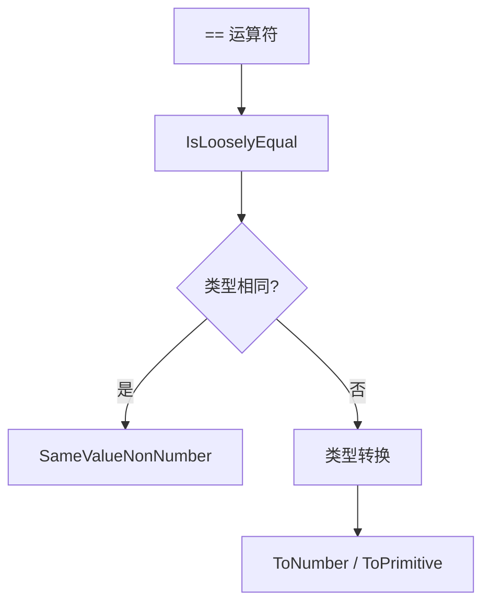
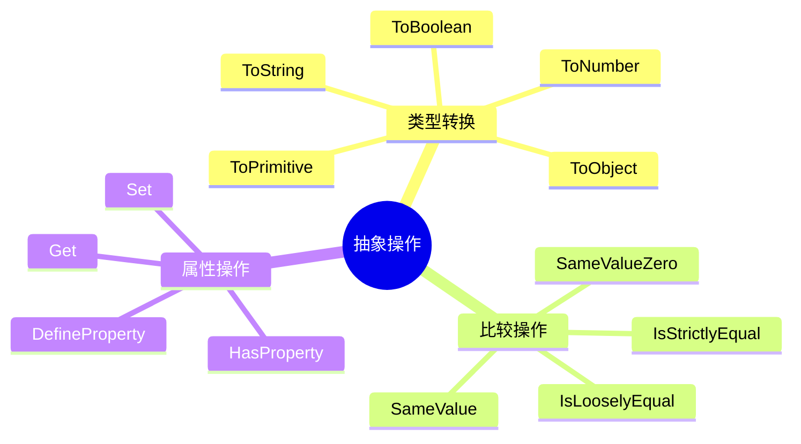
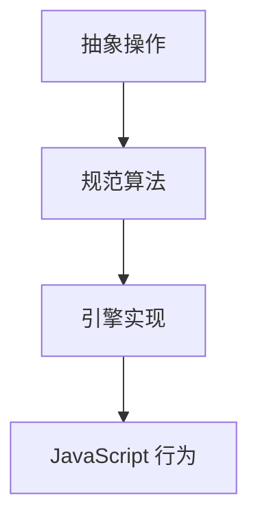

# 抽象操作（Abstract Operations）

> **形式化定义**：抽象操作（Abstract Operations）是 ECMA-262 规范中定义的伪函数，用于精确描述 JavaScript 引擎的内部行为。它们不是 JavaScript 语言本身的一部分，而是规范作者用来分解复杂算法的**元语言工具**。关键抽象操作包括 `ToPrimitive`、`ToBoolean`、`ToNumber`、`ToString`、`OrdinaryToPrimitive`、`RequireObjectCoercible`、`SameValue`、`SameValueZero`、`SameValueNonNumber` 等。ECMA-262 §7 定义了所有抽象操作。
>
> 对齐版本：ECMA-262 16th ed §7 | TypeScript 5.8–6.0

---

## 1. 概念定义 (Concept Definition)

### 1.1 形式化定义

ECMA-262 §7 定义：

> *"Abstract operations are named algorithms that are used to aid the specification of the semantics of the ECMAScript language."*

抽象操作的形式：

```
OperationName(argument1, argument2) → ReturnType
```

---

## 2. 属性与特征 (Properties & Characteristics)

### 2.1 类型转换抽象操作

| 操作 | 输入 | 输出 | 用途 |
|------|------|------|------|
| ToPrimitive | 任意值 | 原始值 | 对象转原始值 |
| ToBoolean | 任意值 | Boolean | 布尔转换 |
| ToNumber | 任意值 | Number | 数字转换 |
| ToString | 任意值 | String | 字符串转换 |
| ToObject | 任意值 | Object | 对象包装 |

### 2.2 抽象操作特征

| 特征 | 说明 |
|------|------|
| 规范内部使用 | 不暴露给 JavaScript 代码 |
| 参数化 | 接受 ECMAScript 值和规范类型 |
| 返回 Completion | 可能返回正常完成或突然完成 |
| 可递归 | 抽象操作可调用其他抽象操作 |

---

## 3. 关系分析 (Relationship Analysis)

### 3.1 抽象操作调用链



---

## 4. 机制解释 (Mechanism Explanation)

### 4.1 ToPrimitive 算法

```mermaid
flowchart TD
    A[ToPrimitive(input, hint)] --> B{input 是原始值?}
    B -->|是| C[返回 input]
    B -->|否| D{hint?}
    D -->|number| E[尝试 valueOf]
    D -->|string| F[尝试 toString]
    E --> G{valueOf 返回原始值?}
    G -->|是| H[返回]
    G -->|否| F
    F --> I{toString 返回原始值?}
    I -->|是| H
    I -->|否| J[抛出 TypeError]
```

---

## 5. 论证与分析 (Argumentation & Analysis)

### 5.1 == vs === 的抽象操作

| 运算符 | 抽象操作 | 类型转换 |
|--------|---------|---------|
| `==` | IsLooselyEqual | 是，强制转换 |
| `===` | IsStrictlyEqual | 否，严格比较 |
| `Object.is` | SameValue | 处理 -0/+0, NaN |

---

## 6. 实例与示例 (Examples)

### 6.1 正例：ToPrimitive

```javascript
const obj = {
  valueOf() { return 42; },
  toString() { return "hello"; }
};

console.log(obj + 1);      // 43 (hint: number → valueOf)
console.log(`${obj}`);     // "hello" (hint: string → toString)
```

---

## 7. 权威参考与国际化对齐 (References)

- **ECMA-262 §7** — Abstract Operations
- **MDN: Type Coercion** — <https://developer.mozilla.org/en-US/docs/Glossary/Type_coercion>

---

## 8. 思维表征总结 (Cognitive Representations)

### 8.1 抽象操作分类



---

## 9. 公理化表述与形式证明 (Axiomatization & Formal Proof)

### 9.1 公理化基础

**公理 1（抽象操作的原子性）**：
> 抽象操作是规范的原子操作，不能被 JavaScript 代码打断。

### 9.2 定理与证明

**定理 1（ToPrimitive 的终止性）**：
> 对于有限对象，ToPrimitive 必然终止。

*证明*：
> 每次递归调用沿着原型链向上。若原型链有环则已在规范中处理（不无限递归）。
> ∎

---

## 10. 推理链与演绎分析 (Deductive Reasoning Chain)

### 10.1 演绎推理



---

**参考规范**：ECMA-262 §7 | MDN: Type Coercion
