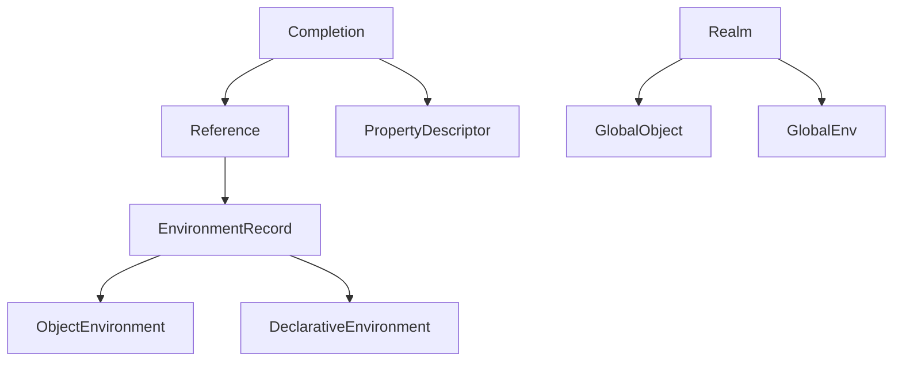
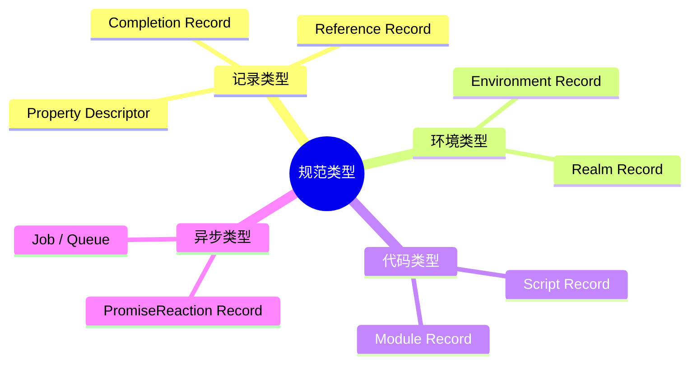
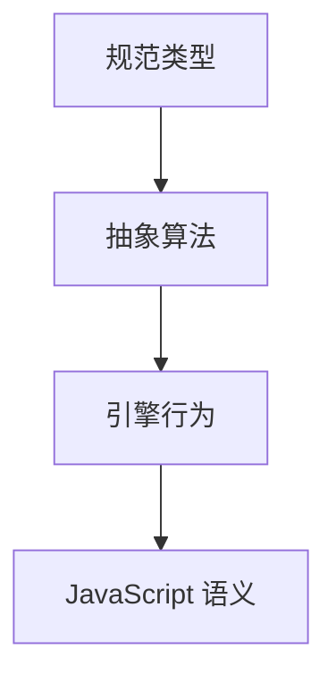

# 规范类型（Specification Types）

> **形式化定义**：规范类型（Specification Types）是 ECMA-262 规范内部使用的元类型，用于精确描述 JavaScript 引擎的内部数据结构和算法。与语言类型（String, Number, Boolean 等）不同，规范类型不直接对应 JavaScript 值。核心规范类型包括：Completion Record、Reference Record、Property Descriptor、Environment Record、Realm Record、Script Record、Module Record、PromiseReaction Record、Job 等。ECMA-262 §6.2 定义了所有规范类型。
>
> 对齐版本：ECMA-262 16th ed §6.2 | TypeScript 5.8–6.0

---

## 1. 概念定义 (Concept Definition)

### 1.1 形式化定义

ECMA-262 §6.2 定义：

> *"Specification types correspond to meta-values used within algorithms to describe the semantics of ECMAScript language constructs and ECMAScript language types."*

---

## 2. 属性与特征 (Properties & Characteristics)

### 2.1 规范类型 vs 语言类型

| 类型类别 | 示例 | 在 JavaScript 中可见? |
|---------|------|---------------------|
| 语言类型 | String, Number, Boolean, Object | ✅ |
| 规范类型 | Completion, Reference, Environment Record | ❌ |

---

## 3. 关系分析 (Relationship Analysis)

### 3.1 规范类型关系图



---

## 4. 机制解释 (Mechanism Explanation)

### 4.1 Completion Record

```
Completion Record: {
  [[Type]]: normal | return | throw | break | continue,
  [[Value]]: any | empty,
  [[Target]]: String | empty
}
```

---

## 5. 论证与分析 (Argumentation & Analysis)

### 5.1 为什么需要规范类型

| 原因 | 说明 |
|------|------|
| 精确性 | 消除自然语言的歧义 |
| 可验证性 | 支持形式化分析 |
| 一致性 | 所有引擎实现统一 |

---

## 6. 实例与示例 (Examples)

### 6.1 正例：Reference Record

```javascript
// 变量访问创建 Reference Record
// foo.bar 的求值：
// base = foo (对象)
// referencedName = "bar" (字符串)
// strict = false
```

---

## 7. 权威参考与国际化对齐 (References)

- **ECMA-262 §6.2** — Specification Types
- **MDN: Reference** — https://developer.mozilla.org/en-US/docs/Web/JavaScript/Reference

---

## 8. 思维表征总结 (Cognitive Representations)

### 8.1 规范类型分类



---

## 9. 公理化表述与形式证明 (Axiomatization & Formal Proof)

### 9.1 公理化基础

**公理 1（规范类型的不可见性）**：
> 规范类型不能被 JavaScript 代码直接创建或访问。

### 9.2 定理与证明

**定理 1（Completion Record 的完备性）**：
> 每个语句的执行都返回 Completion Record。

*证明*：
> ECMA-262 规定每个语句的语义都返回 Completion Record。
> ∎

---

## 10. 推理链与演绎分析 (Deductive Reasoning Chain)

### 10.1 演绎推理



---

**参考规范**：ECMA-262 §6.2 | MDN: Reference
