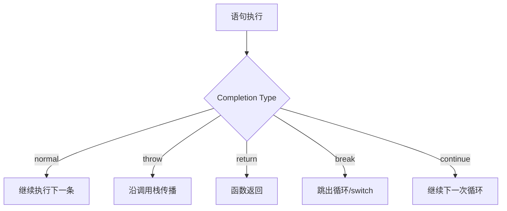

# 完成记录（Completion Records）

> ECMAScript 规范中控制流转移的统一抽象
>
> 对齐版本：ECMA-262 §6.2.4

---

## 1. Completion Record 结构

所有 ECMAScript 语句的执行结果都是一个 **Completion Record**：

```
Completion Record: {
  [[Type]]: normal | break | continue | return | throw,
  [[Value]]: any,
  [[Target]]: string | empty
}
```

| 字段 | 说明 |
|------|------|
| [[Type]] | 完成类型 |
| [[Value]] | 完成值 |
| [[Target]] | 标签目标（用于 break/continue）|

---

## 2. 各类 Completion

### 2.1 Normal Completion

正常执行完成：

```javascript
const x = 1; // Normal Completion: { [[Type]]: normal, [[Value]]: empty }
```

### 2.2 Throw Completion

抛出异常：

```javascript
throw new Error("Oops");
// Throw Completion: { [[Type]]: throw, [[Value]]: Error, [[Target]]: empty }
```

### 2.3 Return Completion

函数返回：

```javascript
return 42;
// Return Completion: { [[Type]]: return, [[Value]]: 42 }
```

### 2.4 Break Completion

break 语句：

```javascript
break;
// Break Completion: { [[Type]]: break, [[Value]]: empty, [[Target]]: empty }

break label;
// Break Completion: { [[Type]]: break, [[Value]]: empty, [[Target]]: "label" }
```

### 2.5 Continue Completion

continue 语句：

```javascript
continue;
// Continue Completion: { [[Type]]: continue, [[Value]]: empty, [[Target]]: empty }
```

---

## 3. 抽象语义中的传播

### 3.1 语句序列的执行

```javascript
const x = 1;
const y = 2;
return x + y;
```

执行过程：

1. `const x = 1` → Normal Completion
2. `const y = 2` → Normal Completion
3. `return x + y` → Return Completion

### 3.2 `?` 前缀操作（ReturnIfAbrupt）

规范中使用 `?` 表示：如果操作返回 Abrupt Completion，立即返回该 Completion：

```
? Operation()
// 等价于：
const result = Operation();
if (result is Abrupt Completion) return result;
```

### 3.3 `!` 前缀操作

规范中使用 `!` 表示：断言操作返回 Normal Completion：

```
! Operation()
// 断言 Operation() 返回 Normal Completion，直接使用 [[Value]]
```

---

## 4. 与开发者可见行为的关系

### 4.1 try/catch/finally 的规范解释

```javascript
try {
  riskyOperation();
} catch (e) {
  handleError(e);
} finally {
  cleanup();
}
```

规范执行：

1. 执行 try 块
2. 如果返回 Throw Completion，执行 catch 块
3. 无论结果如何，执行 finally 块
4. 如果 finally 返回 Abrupt Completion，覆盖之前的结果

### 4.2 函数返回值

```javascript
function foo() {
  return 42;
}
```

规范执行：

1. `return 42` 生成 Return Completion
2. 函数体执行结束，返回 Return Completion.[[Value]]

---

## 5. 可视化



---

**参考规范**：ECMA-262 §6.2.4 The Completion Record Specification Type | ECMA-262 §9.2.1 GetValue
