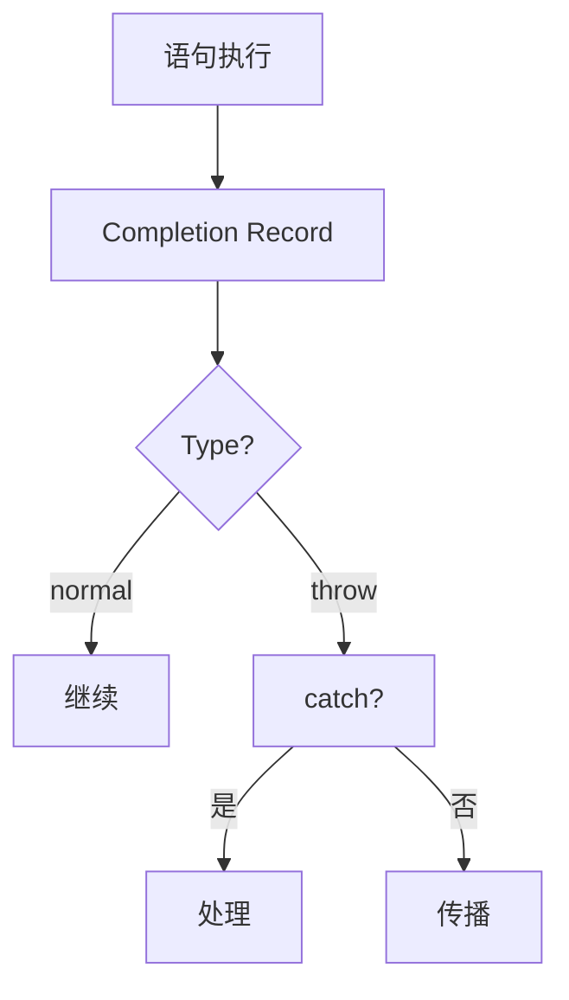

# 完成记录（Completion Records）

> **形式化定义**：完成记录（Completion Record）是 ECMA-262 规范中用于描述语句和控制流结构的规范类型。每个 JavaScript 语句的执行都产生一个 Completion Record，包含 `[[Type]]`（normal, return, throw, break, continue）、`[[Value]]`（结果值或 empty）、`[[Target]]`（标签或 empty）。ECMA-262 §6.2.4 定义了 Completion Record 的完整语义，它是理解 `return`、`throw`、`break`、`continue` 在规范层面如何工作的关键。
>
> 对齐版本：ECMA-262 16th ed §6.2.4 | TypeScript 5.8–6.0

---

## 1. 概念定义 (Concept Definition)

### 1.1 形式化定义

ECMA-262 §6.2.4 定义：

> *"The Completion Record type is a Record used to explain the runtime propagation of values and control flow."*

Completion Record 结构：

```
Completion Record = {
  [[Type]]:   normal | return | throw | break | continue,
  [[Value]]:  any | empty,
  [[Target]]: String | empty
}
```

### 1.2 五种完成类型

| [[Type]] | 来源 | [[Value]] | [[Target]] | 语义 |
|---------|------|----------|-----------|------|
| normal | 正常语句 | 表达式结果 | empty | 正常继续 |
| return | return 语句 | 返回值 | empty | 函数返回 |
| throw | throw 语句 | 错误对象 | empty | 异常传播 |
| break | break 语句 | empty | 标签或 empty | 跳出循环 |
| continue | continue 语句 | empty | 标签或 empty | 继续循环 |

---

## 2. 属性与特征 (Properties & Characteristics)

### 2.1 Completion Record 属性矩阵

| 属性 | 说明 |
|------|------|
| [[Type]] | 完成类型，决定控制流走向 |
| [[Value]] | 完成值，throw/return 有意义 |
| [[Target]] | 标签，break/continue 使用 |

### 2.2 辅助操作

```
NormalCompletion(value) → { [[Type]]: normal, [[Value]]: value, [[Target]]: empty }
ThrowCompletion(value)  → { [[Type]]: throw, [[Value]]: value, [[Target]]: empty }
ReturnCompletion(value) → { [[Type]]: return, [[Value]]: value, [[Target]]: empty }
```

---

## 3. 关系分析 (Relationship Analysis)

### 3.1 Completion Record 传播

```mermaid
graph TD
    Statement[语句执行] --> CR[Completion Record]
    CR --> Type{[[Type]]}
    Type -->|normal| Next[下一条语句]
    Type -->|return| FunctionReturn[函数返回]
    Type -->|throw| Catch[最近的 catch]
    Type -->|break| LoopExit[跳出循环]
    Type -->|continue| LoopNext[循环继续]
```

---

## 4. 机制解释 (Mechanism Explanation)

### 4.1 完成记录的传播规则

```mermaid
flowchart TD
    A[执行语句] --> B[获取 Completion Record]
    B --> C{[[Type]] === normal?}
    C -->|是| D[继续执行下一条]
    C -->|否| E[向上传播]
    E --> F{上层能处理?}
    F -->|是| G[处理完成]
    F -->|否| H[继续向上传播]
```

---

## 5. 论证与分析 (Argumentation & Analysis)

### 5.1 try/catch/finally 的完成记录

| 场景 | try | catch | finally | 最终完成 |
|------|-----|-------|---------|---------|
| 无异常 | normal | — | normal | try 的完成 |
| 异常 | throw | normal | normal | catch 的完成 |
| 异常 | throw | throw | normal | catch 的 throw |
| finally return | any | any | return | finally 的 return |

---

## 6. 实例与示例 (Examples)

### 6.1 正例：try/finally 覆盖

```javascript
function example() {
  try {
    return 1;      // 产生 ReturnCompletion(1)
  } finally {
    return 2;      // finally 的 ReturnCompletion(2) 覆盖 try 的
  }
}

console.log(example()); // 2
```

### 6.2 正例：异常传播

```javascript
function throws() {
  throw new Error("boom");  // ThrowCompletion(Error)
}

try {
  throws();  // ThrowCompletion 传播到 catch
} catch (e) {
  console.log(e.message);   // "boom"
}
```

---

## 7. 权威参考与国际化对齐 (References)

- **ECMA-262 §6.2.4** — The Completion Record Specification Type
- **MDN: Control flow** — https://developer.mozilla.org/en-US/docs/Web/JavaScript/Guide/Control_flow_and_error_handling

---

## 8. 思维表征总结 (Cognitive Representations)

### 8.1 完成记录传播

```
语句执行 → Completion Record
  normal → 继续下一条
  return → 函数返回
  throw → 寻找 catch
  break → 跳出循环
  continue → 循环继续
```

---

## 9. 公理化表述与形式证明 (Axiomatization & Formal Proof)

### 9.1 公理化基础

**公理 1（完成记录的完备性）**：
> 每个语句执行必然产生一个 Completion Record。

**公理 2（finally 的覆盖性）**：
> finally 块中的 return/throw 覆盖 try/catch 中的完成记录。

### 9.2 定理与证明

**定理 1（异常传播的确定性）**：
> throw 产生的 ThrowCompletion 必然被最近的 catch 捕获或传播到全局。

*证明*：
> ECMA-262 §13.15 规定 try/catch 语义：catch 块匹配时处理 ThrowCompletion，否则向上传播。
> ∎

---

## 10. 推理链与演绎分析 (Deductive Reasoning Chain)

### 10.1 演绎推理



### 10.2 反事实推理

> **反设**：没有 Completion Record。
> **推演结果**：return/throw/break/continue 的实现无法统一描述，规范将充满特例。
> **结论**：Completion Record 是 ECMA-262 规范优雅性的关键设计。

---

**参考规范**：ECMA-262 §6.2.4 | MDN: Control flow
