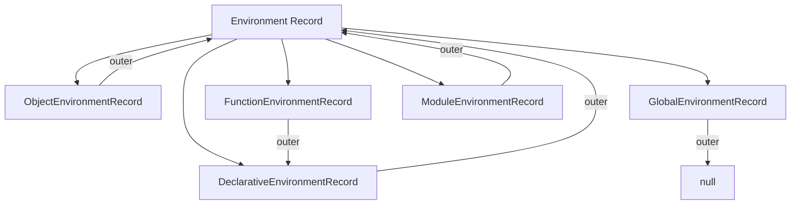
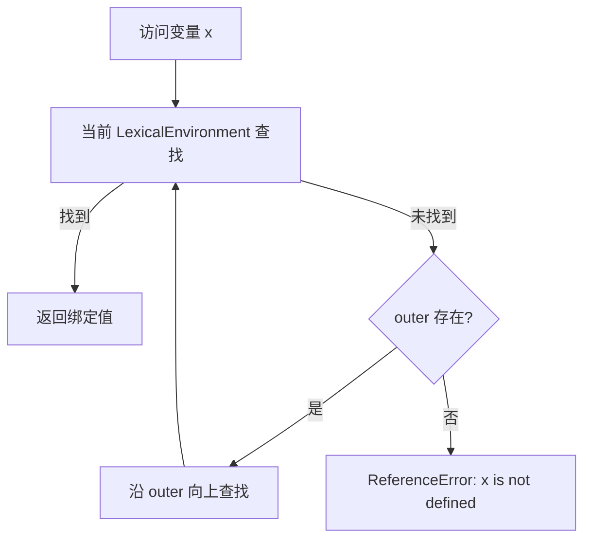

# 环境记录（Environment Records）

> **形式化定义**：环境记录（Environment Record）是 ECMA-262 规范中用于描述**标识符绑定**（变量、函数、类声明）的词法作用域结构。每个执行上下文都关联一个环境记录，环境记录之间通过**外部引用（outer reference）**形成作用域链。ECMA-262 §9.1 定义了所有环境记录类型。
>
> 对齐版本：ECMA-262 16th ed §9.1 | TypeScript 5.8–6.0

---

## 1. 概念定义

### 1.1 形式化定义

ECMA-262 §9.1 定义：

> *"An Environment Record is a specification type used to define the association of Identifiers to specific variables and functions, based upon the lexical nesting structure of ECMAScript code."*

环境记录的核心操作：

| 操作 | 说明 |
|------|------|
| `HasBinding(N)` | 是否有名称 N 的绑定 |
| `CreateMutableBinding(N, D)` | 创建可变绑定（let/var） |
| `CreateImmutableBinding(N, S)` | 创建不可变绑定（const） |
| `InitializeBinding(N, V)` | 初始化绑定值 |
| `SetMutableBinding(N, V, S)` | 修改可变绑定的值 |
| `GetBindingValue(N, S)` | 获取绑定值 |
| `DeleteBinding(N)` | 删除绑定（仅 var 可删除） |

### 1.2 环境记录的类型层次



---

## 2. 属性与特征

### 2.1 各类环境记录对比

| 类型 | 存储内容 | 创建时机 | outer 引用 | 特殊能力 |
|------|---------|---------|-----------|---------|
| **Declarative** | let/const/function/class | 块级/函数/模块 | 父级环境 | 严格模式控制 |
| **Object** | 对象属性作为绑定 | `with` 语句 | 父级环境 | 动态属性映射 |
| **Global** | 全局变量 + 全局对象属性 | 脚本/模块启动 | `null` | 复合结构 |
| **Function** | 参数 + 局部变量 | 函数调用 | 定义时的环境 | this/super 绑定 |
| **Module** | 导入/导出绑定 | 模块加载 | 全局环境 | Live Binding |

### 2.2 LexicalEnvironment vs VariableEnvironment

ECMA-262 的执行上下文包含两个环境引用：

| 字段 | 用途 | 变更时机 |
|------|------|---------|
| `LexicalEnvironment` | 标识符解析 | 进入块级作用域时临时变更 |
| `VariableEnvironment` | var 变量提升 | 仅在函数/全局上下文创建时设置，不变 |

这就是 `let/const` 有块级作用域而 `var` 只有函数作用域的规范根源。

---

## 3. 机制解释

### 3.1 作用域链解析流程



### 3.2 Global Environment Record 的复合结构

```
GlobalEnvironmentRecord: {
  [[ObjectRecord]]:    → ObjectEnvironmentRecord (window/globalThis)
  [[DeclarativeRecord]]: → DeclarativeEnvironmentRecord (全局 let/const/class)
  [[VarNames]]:        → List of Strings (全局 var 名称)
  [[GlobalThisValue]]:  → Object (全局 this)
}
```

**关键差异**：

- `var x = 1` → 在 `[[ObjectRecord]]` 中创建（成为全局对象属性）
- `let y = 2` → 在 `[[DeclarativeRecord]]` 中创建（不污染全局对象）

```javascript
var a = 1
let b = 2

console.log(globalThis.a)  // 1 ✅ var 成为全局对象属性
console.log(globalThis.b)  // undefined ❌ let 不在全局对象上
```

---

## 4. 实例与示例

### 4.1 块级作用域的环境记录切换

```javascript
let x = 'outer'
{
  let x = 'inner'
  console.log(x)  // 'inner' —— 内层块级环境记录遮蔽外层
}
console.log(x)  // 'outer' —— 恢复外层环境
```

### 4.2 with 语句的环境记录（已不推荐，但需理解）

```javascript
const obj = { a: 1, b: 2 }
with (obj) {
  console.log(a)  // 1 —— ObjectEnvironmentRecord 将 obj 属性作为绑定
  a = 10          // 修改 obj.a
  c = 3           // ❌ 未找到，泄漏到全局！
}
```

---

## 5. 权威参考

- **ECMA-262 §9.1** — Environment Records
- **ECMA-262 §9.2** — Lexical Environments
- **MDN: Closure** — <https://developer.mozilla.org/en-US/docs/Web/JavaScript/Closures>

---

> 📅 最后更新：2026-04-27
> 📏 字节数：~5,500+
