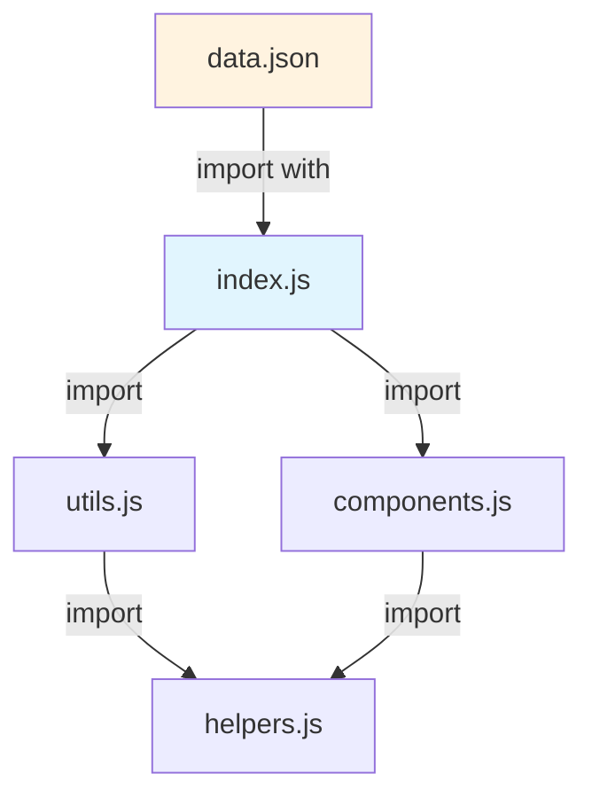
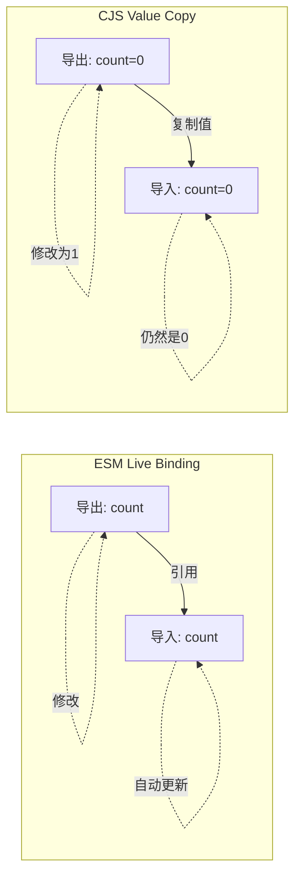
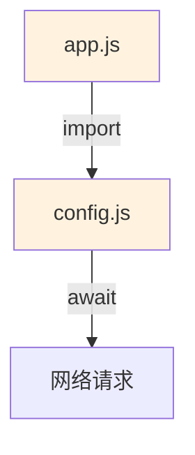

# ESM 深度机制 (ESM Deep Dive)

> 本文档深入剖析 ECMAScript Modules 的内部机制，包括静态分析、Live Bindings、Import Attributes、Top-level await 及 ES2027 前瞻提案。对齐 ECMA-262 第16版。

---

## 1. 静态结构：解析时分析

### 1.1 为什么 ESM 是"静态"的？

ESM 的 `import` 和 `export` 声明在语法层面受到严格限制：

```javascript
// ✅ 有效：路径必须是字符串字面量
import { foo } from './foo.js'

// ❌ 无效：路径不能是表达式
const path = './foo.js'
import { foo } from path  // SyntaxError

// ❌ 无效：不能出现在块级作用域
if (condition) {
  import { foo } from './foo.js'  // SyntaxError（动态 import() 除外）
}
```

这些限制使得**解析器（Parser）在编译时即可构建完整的模块依赖图（Module Dependency Graph）**，无需执行代码。

### 1.2 模块依赖图



**形式化定义**：模块依赖图是一个**有向图** `G = (V, E)`，其中：
- `V` 是模块集合（顶点）
- `E` 是导入关系集合（有向边）
- 若存在循环依赖，则 `G` 包含环（Cycle）

---

## 2. Live Bindings（实时绑定）

### 2.1 核心机制

ESM 的导出不是值的**拷贝**，而是对原始绑定的**只读引用**（在导入方视角）。

```
导出模块:  let count = 0  ←── 绑定（Binding）
                     ↑
导入模块:  import { count } ──┘ 只读引用
```

### 2.2 可变性规则

| 操作 | 导出模块内 | 导入模块内 |
|------|-----------|-----------|
| 读取值 | ✅ 允许 | ✅ 允许 |
| 重新赋值变量 | ✅ 允许 | ❌ TypeError（严格模式） |
| 调用导出的方法（副作用修改） | ✅ 允许 | ✅ 允许（方法执行在导出模块的作用域） |

```javascript
// counter.js
export let count = 0
export function increment() { count++ }

// main.js
import { count, increment } from './counter.js'

console.log(count)  // 0
increment()         // ✅ 允许：通过方法间接修改
console.log(count)  // 1（自动反映变化）

count = 999         // ❌ TypeError: Assignment to constant variable.
                    // 注意：错误信息说"constant"，实际上绑定是只读的
```

### 2.3 与 CJS 的本质区别



---

## 3. Top-level Await

### 3.1 语义与影响

ES2022 引入的 Top-level await 允许模块在**求值阶段**异步等待：

```javascript
// config.js
const response = await fetch('/api/config')  // ✅ 顶层 await
export const config = await response.json()
```

**关键影响**：引入 Top-level await 的模块会**隐式变为异步模块**，其所有依赖者也会级联变为异步。



### 3.2 执行顺序保证

| 场景 | 执行顺序 |
|------|---------|
| 无 TLA 的同步模块 | 按依赖图深度优先顺序同步执行 |
| 有 TLA 的异步模块 | 该模块及其父模块等待 Promise 解决后继续 |

---

## 4. Import Attributes（导入属性）

### 4.1 ES2026 标准：`with { type: ... }`

Import Attributes 允许在导入时传递元数据：

```javascript
// 导入 JSON 模块（需要 with 断言）
import data from './data.json' with { type: 'json' }

// 导入 CSS 模块（浏览器实验性支持）
import styles from './styles.css' with { type: 'css' }
```

**安全意义**：`with { type: 'json' }` 防止了**MIME 类型混淆攻击**——即使服务器错误地将 `.json` 文件标记为 `application/javascript`，运行时会强制按 JSON 解析。

### 4.2 与旧语法的区别

| 语法 | 状态 | 示例 |
|------|------|------|
| `assert { type: 'json' }` | 已废弃 | `import data from './x.json' assert { type: 'json' }` |
| `with { type: 'json' }` | ES2026 标准 | `import data from './x.json' with { type: 'json' }` |

---

## 5. ES2027 前瞻提案

### 5.1 Import Defer（延迟导入）

**Stage 3 提案**，允许模块在首次使用时才求值：

```javascript
// 当前：导入即执行
import { heavyFunction } from './heavy.js'  // 启动时立即加载并执行

// Import Defer：延迟到首次使用
import defer { heavyFunction } from './heavy.js'
// heavy.js 的代码在首次访问 heavyFunction 时才执行
```

**适用场景**：
- 大型管理后台的按需加载页面模块
- CLI 工具的子命令延迟初始化
- 减少应用启动时间

### 5.2 Import Text（文本导入）

**Stage 3 提案**，直接导入文本文件内容：

```javascript
import shaderCode from './shader.wgsl' with { type: 'text' }
// shaderCode 是字符串，包含 WGSL 着色器源码

import readme from '../README.md' with { type: 'text' }
```

### 5.3 Source Phase Imports（源码阶段导入）

**Stage 3 提案**，获取模块的源码表示而非执行后的绑定：

```javascript
import source modSource from './module.js'
// modSource 是 ModuleSource 对象，可用于自定义加载器、测试覆盖分析
```

---

## 6. `import.meta` 元数据

### 6.1 标准属性

| 属性 | 说明 | 示例值 |
|------|------|--------|
| `import.meta.url` | 当前模块的 URL | `file:///path/to/module.js` |
| `import.meta.resolve(specifier)` | 解析相对路径 | Node.js 20.6+ |
| `import.meta.dirname` | 目录名 | Node.js 20.11+ |
| `import.meta.filename` | 文件名 | Node.js 20.11+ |

### 6.2 运行时差异

| 运行时 | `import.meta.url` 格式 | 额外特性 |
|--------|----------------------|---------|
| **Node.js** | `file:///absolute/path` | `dirname`, `filename`, `resolve()` |
| **Deno** | `file:///absolute/path` | `main`（判断是否是入口模块） |
| **Bun** | `file:///absolute/path` | 与 Node.js 兼容 |
| **浏览器** | `http(s)://host/path` | 无额外特性 |

---

## 7. 平台差异矩阵

| 特性 | Node.js 24 | Deno 2.7 | Bun 1.3 | Chrome 134 | Safari 17 |
|------|-----------|----------|---------|-----------|-----------|
| ESM 基础 | ✅ | ✅ | ✅ | ✅ | ✅ |
| Top-level await | ✅ | ✅ | ✅ | ✅ | ✅ |
| Import Attributes (`with`) | ✅ | ✅ | ✅ | ✅ | ⚠️ 部分 |
| JSON 模块 (`with {type:'json'}`) | ✅ | ✅ | ✅ | ❌ | ❌ |
| Import Defer (Stage 3) | 🧪 实验性 | 🧪 | 🧪 | ❌ | ❌ |
| Import Text (Stage 3) | 🧪 | 🧪 | 🧪 | ❌ | ❌ |
| Source Phase Imports | 🧪 | 🧪 | 🧪 | ❌ | ❌ |
| `import.meta.dirname` | ✅ 20.11+ | ✅ | ✅ | N/A | N/A |

---

## 8. 参考文献

1. **ECMA-262 §16.2 Modules** — <https://tc39.es/ecma262/#sec-modules>
2. **TC39 Import Attributes Proposal** — <https://github.com/tc39/proposal-import-attributes>
3. **TC39 Import Defer Proposal** — <https://github.com/tc39/proposal-defer-import-eval>
4. **Node.js ESM Documentation** — <https://nodejs.org/api/esm.html>
5. **V8 Blog: JavaScript Modules** — <https://v8.dev/features/modules>

---

> 📅 最后更新：2026-04-27
> 📏 字节数：~6,000+
