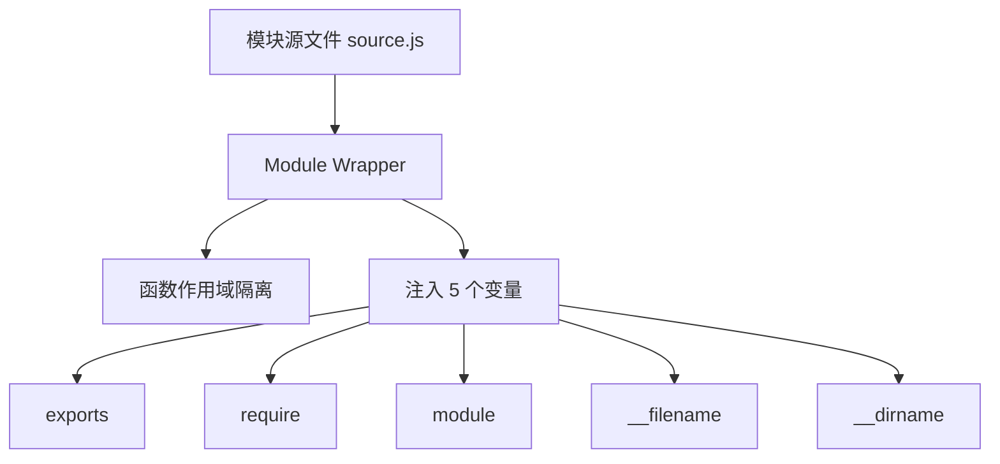
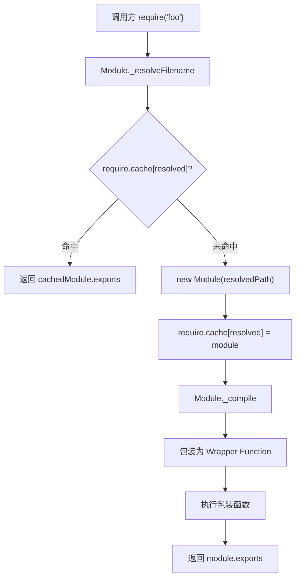
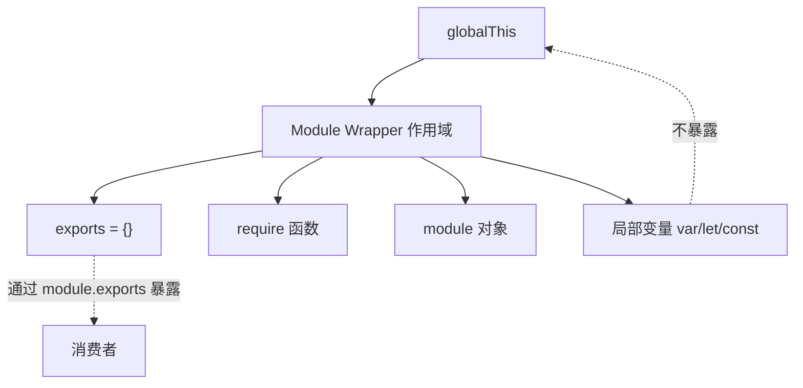
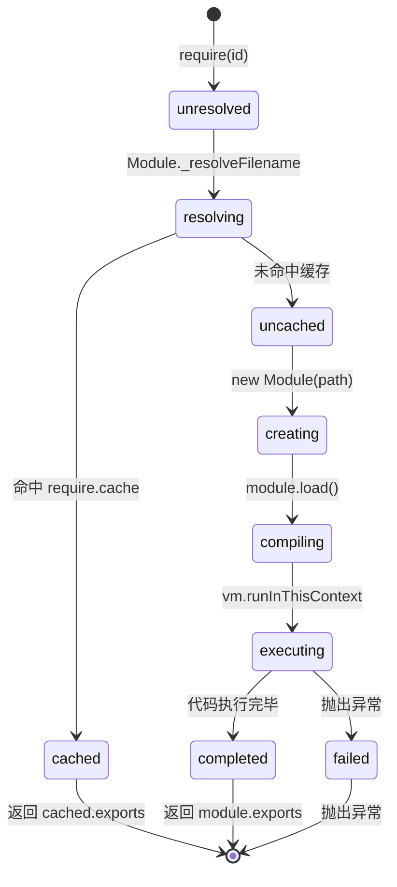
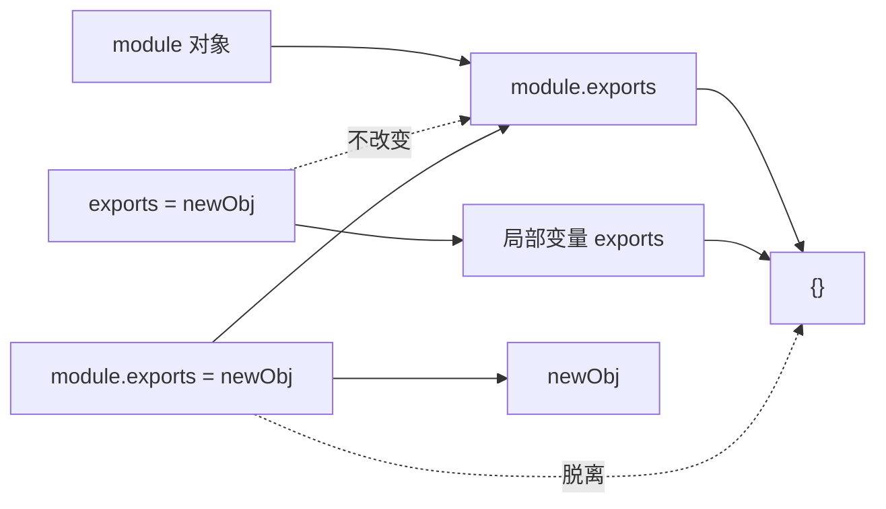

# CommonJS 机制深度解析

> **形式化定义**：CommonJS（CJS）是 Node.js 采用的模块系统，其核心语义建立在**同步函数式加载（Synchronous Functional Loading）**之上。每个 CJS 模块在加载时被包装为一个函数 `function(exports, require, module, __filename, __dirname) { ... }`，由 Node.js 的 `Module._load` 抽象操作调用。模块的导出通过修改 `module.exports` 对象实现，加载结果通过 `require.cache` 实现单例（Singleton）保证。
>
> 对齐版本：Node.js 22+ | CommonJS Modules 规范 | TypeScript 5.8–6.0

---

## 1. 概念定义 (Concept Definition)

### 1.1 形式化定义

Node.js 文档定义了 CJS 模块的语义：

> *"In Node.js, each file is treated as a separate module."* — Node.js Modules Documentation

CJS 模块系统的核心抽象为四元组 `(W, C, R, E)`：

- **W (Wrapper)**：模块包装函数，为模块代码提供隔离作用域和注入变量
- **C (Cache)**：`require.cache` 对象，键为绝对路径，值为 `Module` 实例
- **R (Require)**：`require(id)` 函数，执行模块解析、加载、缓存、执行四阶段
- **E (Exports)**：`module.exports` 对象，模块对外暴露的公共接口

### 1.2 Module Wrapper 的形式化结构

Node.js 在加载模块前，将源文本包裹为以下函数：

```javascript
(function(exports, require, module, __filename, __dirname) {
  // 用户的模块代码位于此处
});
```

该包装器提供四项核心语义保证：

1. **作用域隔离**：用户代码运行在函数作用域内，不会污染全局对象
2. **变量注入**：`exports`、`require`、`module`、`__filename`、`__dirname` 作为形参自动可用
3. **文件路径信息**：`__filename` 为绝对文件路径，`__dirname` 为其所在目录
4. **模块对象访问**：通过 `module` 对象可访问模块元数据和 `exports`



---

## 2. 属性与特征 (Properties & Characteristics)

### 2.1 CJS 核心属性矩阵

| 特性 | 说明 | 实现机制 | 行为 |
|------|------|---------|------|
| 同步加载 | `require()` 阻塞执行直到模块加载完成 | 文件系统同步读取 | 启动时性能敏感 |
| 运行时解析 | 模块路径在运行时计算 | `Module._resolveFilename` | 支持动态条件加载 |
| 值拷贝语义 | 导出的是值的拷贝 | `module.exports` 对象引用传递 | 重新赋值不通知消费者 |
| 单例保证 | 同一路径仅执行一次 | `require.cache` | 状态模块天然 Singleton |
| 循环依赖支持 | 允许循环引用 | 部分导出（Partial Exports） | 可能拿到不完整对象 |
| 非严格模式默认 | 模块不自动进入严格模式 | 无 `"use strict"` 注入 | 可用 `with`，可隐式创建全局变量 |

### 2.2 `exports` vs `module.exports` 真值表

| 操作 | `exports.x = 1` | `module.exports = { x: 1 }` | `exports = { x: 1 }` |
|------|----------------|---------------------------|-------------------|
| 是否有效导出 | ✅ | ✅ | ❌ |
| 是否改变引用 | ❌（修改原对象） | ✅（替换引用） | ❌（局部变量重新赋值） |
| 消费者能否访问 | ✅ | ✅ | ❌ |
| 推荐场景 | 多属性导出 | 单一对象/函数导出 | 应避免 |

**关键机制**：`exports` 是 `module.exports` 的初始引用。`exports.xxx = ...` 修改的是 `module.exports` 指向的对象本身，而 `exports = ...` 仅改变局部变量 `exports` 的指向，不影响 `module.exports`。

---

## 3. 关系分析 (Relationship Analysis)

### 3.1 `require()` 调用链关系图



### 3.2 CJS 与 Node.js 子系统的关系

| 子系统 | 关系 | 说明 |
|--------|------|------|
| 文件系统 | 直接依赖 | `require()` 使用 `fs.readFileSync` 读取模块源码 |
| V8 引擎 | 编译依赖 | `vm.runInThisContext` 编译 wrapper function |
| 路径解析 | 核心逻辑 | `path.resolve`、`node_modules` 递归查找 |
| 全局对象 | 弱关联 | 模块顶层 `this` 指向 `module.exports`，非 `globalThis` |
| ESM 加载器 | 互斥/共存 | Node.js 中 CJS 与 ESM 可互操作但加载器不同 |

---

## 4. 机制解释 (Mechanism Explanation)

### 4.1 `require()` 四阶段算法

Node.js 的 `require()` 执行以下算法：

```
Require(id):
  1. resolvedPath ← Module._resolveFilename(id, this)
  2. if require.cache[resolvedPath] exists:
       return require.cache[resolvedPath].exports
  3. module ← new Module(resolvedPath, parent)
  4. require.cache[resolvedPath] ← module
  5. module.load(resolvedPath)
  6. return module.exports
```

**阶段详解**：

1. **解析（Resolve）**：将模块标识符（可为相对路径、绝对路径或裸指定符）解析为绝对文件路径。对裸指定符，递归搜索 `node_modules`。

2. **缓存检查（Cache Check）**：查询 `require.cache`。若命中，直接返回缓存的 `exports`，跳过编译与执行。这是 Singleton 保证的核心。

3. **模块创建（Module Creation）**：创建新的 `Module` 实例，初始化 `exports = {}`、`loaded = false` 等属性。

4. **缓存注册（Cache Registration）**：**在执行前即将模块加入缓存**。这一步至关重要——它保证了循环依赖不会导致无限递归。

5. **加载与编译（Load & Compile）**：读取源文件，包装为 wrapper function，通过 `vm.runInThisContext` 编译为可执行函数。

6. **执行（Execute）**：调用编译后的函数，传入 `exports`、`require`、`module`、`__filename`、`__dirname`。

### 4.2 Module Wrapper 的作用域隔离



---

## 5. 论证分析 (Argumentation Analysis)

### 5.1 CJS 的设计假设与当代挑战

CJS 于 2009 年设计，其假设条件包括：

1. **本地文件系统访问**：`require()` 假设模块文件在本地磁盘，通过同步 I/O 读取
2. **单线程执行模型**：同步阻塞不会导致并发问题
3. **较小的模块图**：启动时加载所有依赖是可接受的

**当代挑战**：

- **浏览器环境**：无本地文件系统，同步加载不可行 → ESM 采用异步加载
- **大型应用**：模块图包含数万个节点，同步顺序加载启动慢 → Bundle 工具预合并
- **Tree Shaking**：CJS 的动态结构使静态分析困难 → ESM 的静态结构成为必需

### 5.2 推理链：为什么 CJS 难以 Tree Shake

**前提 1**：Tree Shaking 需要编译时确定哪些导出被使用、哪些未被使用。
**前提 2**：CJS 的导出通过运行时赋值 `module.exports = ...` 实现。
**前提 3**：运行时赋值的属性在解析阶段无法确定。
**前提 4**：`require()` 调用可出现在条件分支、循环内部或动态路径中。

**结论**：打包工具（如 Webpack、Rollup）处理 CJS 模块时，只能使用启发式算法（Heuristics）猜测导出结构，无法安全地消除 Dead Code。ESM 的 `export` 声明在解析时即可确定，天然支持 Tree Shaking。

---

## 6. 形式证明 (Formal Proof)

### 6.1 公理化基础

**公理 10（同步加载原子性）**：`require(id)` 调用是一个原子操作——要么返回完整的 `module.exports`，要么抛出异常。不存在返回部分结果的状态。

**公理 11（缓存优先性）**：对同一 `resolvedPath` 的所有 `require()` 调用，第一次之后的调用均返回 `require.cache[resolvedPath].exports`，不重新执行模块代码。

**公理 12（Wrapper 隔离性）**：模块内部声明的变量绑定不泄漏至模块外部，除非通过 `module.exports` 显式附加。

### 6.2 定理与证明

**定理 5（CJS Singleton 定理）**：在同一 Node.js 进程中，对同一模块标识符的所有 `require()` 调用返回同一对象引用。

*证明*：设两次 `require(id)` 调用。第一次调用解析得 `path`，创建 `Module` 实例 `m`，将 `require.cache[path] = m`，执行代码得到 `m.exports`，返回 `m.exports`。第二次调用解析同一 `id` 得相同 `path`，查询 `require.cache[path]` 命中 `m`，直接返回 `m.exports`。因此两次返回同一引用。∎

**定理 6（循环依赖的部分导出定理）**：若模块 `A` 与模块 `B` 循环依赖，且 `A` 在 `B` 完成执行前 `require('B')`，则 `A` 获得的 `B.exports` 是执行到该时刻的部分结果。

*证明*：设执行从 `A` 开始。`A` 被加入缓存后执行。当 `A` 执行到 `require('./B')` 时，`B` 被创建、加入缓存、开始执行。若 `B` 又 `require('./A')`，命中已缓存的 `A`（虽然 `A` 尚未执行完毕）。此时 `B` 获得的 `A.exports` 是 `A` 已执行部分导出的结果。该语义保证无无限递归，但可能导致部分导出。∎

---

## 7. 实例示例 (Examples)

### 7.1 正例：`module.exports` 的正确使用

```javascript
// calculator.js
function Calculator() {
  this.value = 0;
}
Calculator.prototype.add = function(n) { this.value += n; };

module.exports = Calculator; // 导出构造函数

// main.js
const Calculator = require("./calculator");
const calc = new Calculator();
```

### 7.2 反例：`exports` 重新赋值导致导出失效

```javascript
// broken.js
exports = { foo: 1 }; // ❌ 错误！仅改变了局部变量引用
// 正确做法：
// module.exports = { foo: 1 };
// 或：exports.foo = 1;
```

### 7.3 边缘案例：删除缓存强制重新加载

```javascript
// 强制重新加载模块（用于热更新等场景）
delete require.cache[require.resolve("./module")];
const fresh = require("./module"); // 重新执行
```

---

## 8. 权威参考 (References)

| 来源 | 链接 | 相关章节 |
|------|------|---------|
| Node.js Modules | nodejs.org/api/modules.html | The module wrapper |
| Node.js CJS | nodejs.org/api/modules.html | Caching |
| CommonJS Spec | wiki.commonjs.org/wiki/Modules/1.1 | Module Context |
| Node.js Source | github.com/nodejs/node | lib/internal/modules/cjs |
| TypeScript Handbook | typescriptlang.org/docs | Modules |

---

## 9. 思维表征 (Mental Representations)

### 9.1 CJS 模块生命周期状态机



### 9.2 `exports` vs `module.exports` 引用关系图



---

## 10. 版本演进 (Version Evolution)

### 10.1 CJS 在 Node.js 中的演进

| 版本 | 特性 | 说明 |
|------|------|------|
| Node.js 0.x | CJS 基础实现 | `require()`、`module.exports`、`.js` 扩展名 |
| Node.js 6+ | `require.cache` 稳定 | 缓存机制文档化 |
| Node.js 12+ | ESM 实验性支持 | `.mjs` 引入，CJS 与 ESM 共存 |
| Node.js 14+ | ESM 稳定 | CJS 仍为主流，但 ESM 成为推荐方向 |
| Node.js 20+ | `require(esm)` 讨论 | 允许 CJS 同步 require ESM（受限） |
| Node.js 22+ | 强化 ESM | CJS 进入维护模式，新功能优先 ESM |

### 10.2 CJS 与 ESM 的互操作限制

| 操作 | CJS → ESM | ESM → CJS | 说明 |
|------|-----------|-----------|------|
| `require()` | ❌（同步加载异步模块） | N/A | Node.js 禁止 CJS require ESM |
| `import` | ✅ | ✅ | ESM 可导入 CJS（default import） |
| `import()` | ✅ | ✅ | 动态导入两者均可 |
| `createRequire` | N/A | ✅ | ESM 中使用 CJS require |

---

**参考规范**：Node.js Modules API | CommonJS Modules/1.1.1 Spec | ECMA-262 §16.2 (对比参考)
