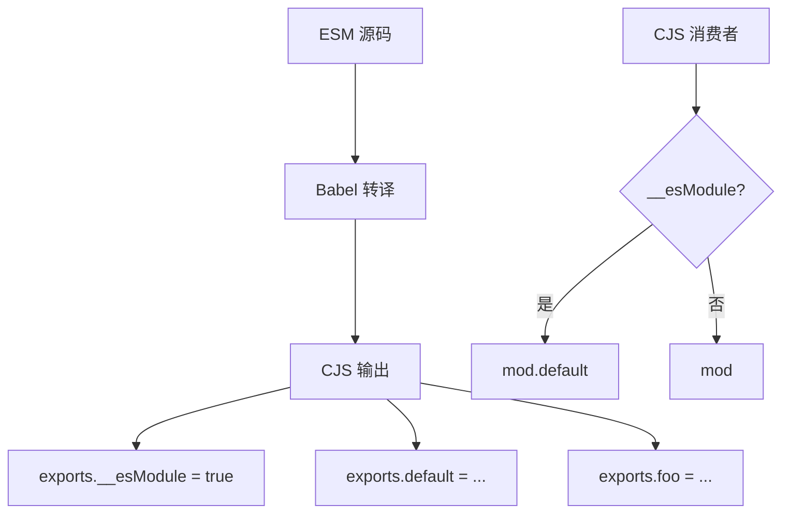
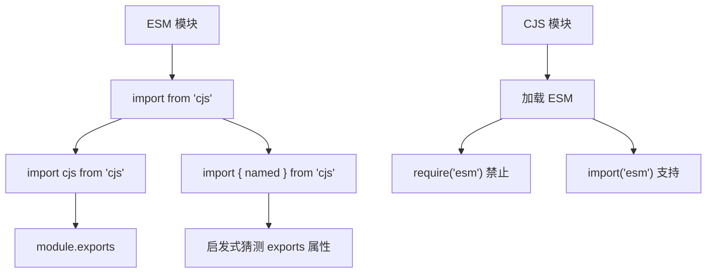
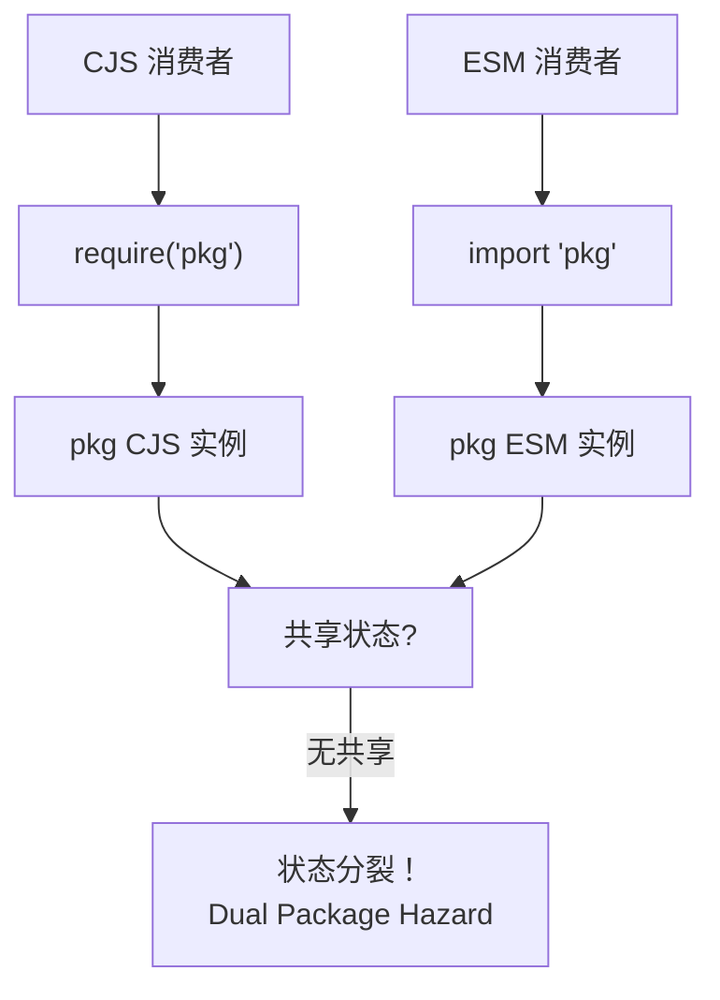
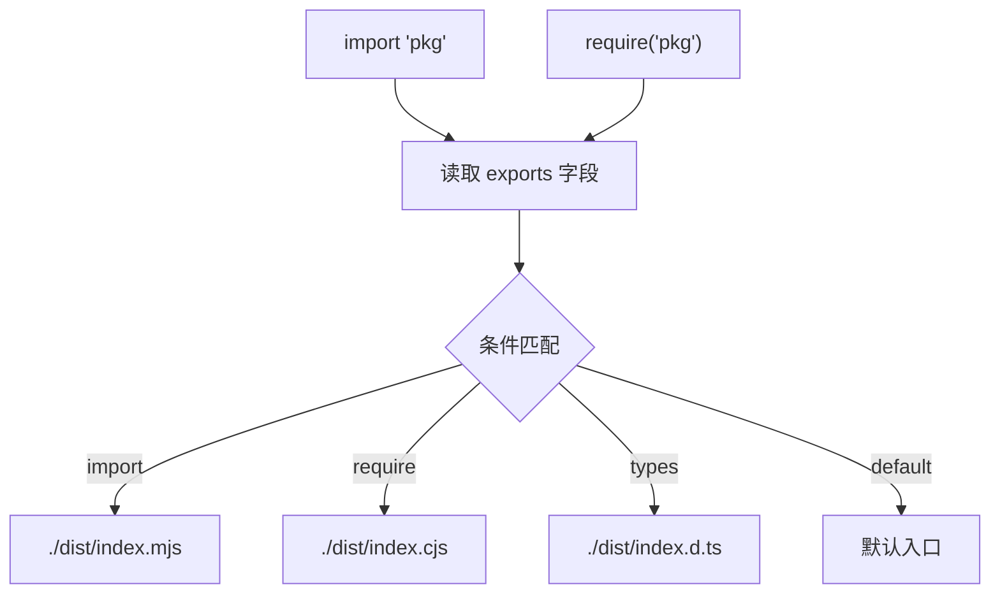
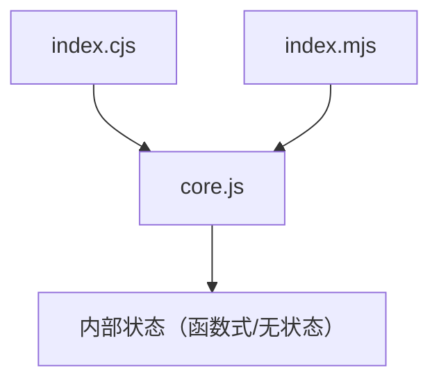
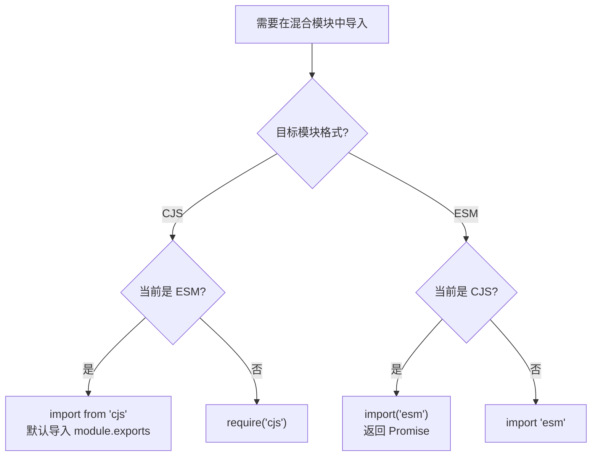
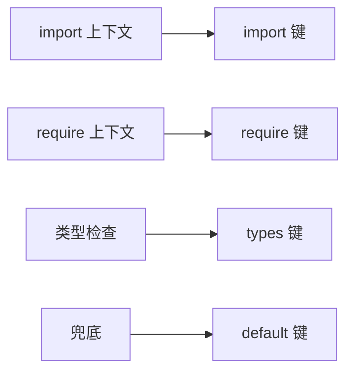

# CJS/ESM 互操作深度解析

> **形式化定义**：CJS/ESM 互操作（Interoperability）是指在单一运行时中，CommonJS 模块与 ECMAScript Modules 模块之间进行相互引用、调用和类型转换时所涉及的完整语义规则集。该规则集由 Node.js 的模块加载器实现、TypeScript 的类型擦除策略和打包工具（Bundler）的转换层共同定义，其核心矛盾在于 CJS 的**动态导出对象语义**与 ESM 的**静态绑定映射语义**之间的结构性不匹配。
>
> 对齐版本：Node.js 22+ | TypeScript 5.8–6.0 | ECMAScript 2025 (ES16)

---

## 1. 概念定义 (Concept Definition)

### 1.1 形式化定义

互操作问题的本质是一个**语义映射问题**：设 CJS 模块的导出空间为 `E_cjs = module.exports`（一个运行时确定的 JavaScript 对象），ESM 模块的导出空间为 `E_esm = { [name]: Binding }`（一组编译时确定的静态绑定）。互操作即构造一个映射函数 `φ: E_cjs → E_esm` 或其逆映射 `φ⁻¹`，使得两种模块系统的消费者能够透明地访问对方的导出。

**核心矛盾**：
- CJS 导出的是**单一对象**（`module.exports`），属性在运行时动态附加
- ESM 导出的是**命名绑定集合**，结构在解析时即固定

### 1.2 `__esModule` 标记的历史起源

Babel 在将 ESM 编译为 CJS 时，为了保留 ESM 的语义信息，引入了 `__esModule` 标记：

```javascript
Object.defineProperty(exports, "__esModule", { value: true });
```

该标记的语义为："本模块虽然以 CJS 格式输出，但其源语义是 ESM，默认导出应通过 `.default` 属性访问"。



---

## 2. 属性与特征 (Properties & Characteristics)

### 2.1 互操作方向矩阵

| 方向 | 语法 | 支持 | 语义转换 | 限制 |
|------|------|------|---------|------|
| ESM → CJS | `import foo from "cjs"` | 支持 | CJS 的 `module.exports` 映射为 ESM 的 `default` 导入 | 无法直接访问 CJS 的 `exports.foo` 作为命名导入 |
| ESM → CJS | `import { foo } from "cjs"` | 受限 | Node.js 通过静态分析启发式猜测命名导出 | 不可靠，推荐用 `default` 导入 |
| CJS → ESM | `require("esm")` | 禁止 | N/A | Node.js 禁止同步 require ESM |
| CJS → ESM | `import("esm")` | 支持 | 返回 Promise，解析为 ESM 的命名空间对象 | 异步 |
| ESM 内使用 CJS | `createRequire` | 支持 | 在 ESM 中创建 CJS require 函数 | 需基于 `import.meta.url` |

### 2.2 `type` 字段与扩展名真值表

| package.json type | 文件扩展名 | 模块格式 | 严格模式 |
|-------------------|-----------|---------|---------|
| 未指定 | `.js` | CJS | 否 |
| 未指定 | `.mjs` | ESM | 是（隐式） |
| 未指定 | `.cjs` | CJS | 否 |
| `"commonjs"` | `.js` | CJS | 否 |
| `"commonjs"` | `.mjs` | ESM | 是 |
| `"module"` | `.js` | ESM | 是 |
| `"module"` | `.cjs` | CJS | 否 |

---

## 3. 关系分析 (Relationship Analysis)

### 3.1 互操作语义映射图



### 3.2 Dual Package Hazard 成因

当 npm 包同时以 CJS 和 ESM 两种格式发布，且两种格式共享可变状态时，可能导致状态分裂：



---

## 4. 机制解释 (Mechanism Explanation)

### 4.1 Node.js 的 ESM 加载 CJS 算法

当 ESM 执行 `import cjs from "./module.cjs"` 时，Node.js 执行以下转换：

```
ESMImportCJS(module.exports):
  if module.exports is not an object or is null:
    return { default: module.exports, [Symbol.toStringTag]: 'Module' }
  
  namespace ← CreateSyntheticModule()
  
  if module.exports.__esModule is true:
    for each key in module.exports:
      if key ≠ "__esModule":
        namespace[key] ← module.exports[key]
    namespace.default ← module.exports.default ?? module.exports
  else:
    namespace.default ← module.exports
    // 启发式：尝试将 exports 的属性作为命名导出
    for each key in module.exports:
      if key ≠ "default":
        namespace[key] ← module.exports[key]
  
  return namespace
```

**关键语义**：
- CJS 的 `module.exports` 总是被包装为一个 ESM 命名空间对象
- 若 `__esModule` 为真，默认导出优先取 `module.exports.default`
- 若 `__esModule` 为假，整个 `module.exports` 对象成为 `default` 导出

### 4.2 Conditional Exports (`exports` 字段)

`package.json` 的 `exports` 字段是 Node.js 解决互操作问题的核心机制：

```json
{
  "exports": {
    ".": {
      "import": "./dist/index.mjs",
      "require": "./dist/index.cjs",
      "types": "./dist/index.d.ts"
    }
  }
}
```

**解析流程**：



---

## 5. 论证分析 (Argumentation Analysis)

### 5.1 `moduleResolution: "nodenext"` vs `"bundler"` 的 Trade-off

TypeScript 5.0+ 引入了 `"moduleResolution": "bundler"`，与 `"nodenext"` 形成对比：

| 维度 | `"nodenext"` | `"bundler"` |
|------|-------------|------------|
| 设计目标 | 精确匹配 Node.js 运行时行为 | 匹配打包工具行为 |
| 扩展名要求 | 强制 `.js`/`.mjs`/`.cjs` | 可省略扩展名 |
| `type` 字段 | 严格遵循 | 可忽略 |
| 条件导出 | 严格匹配 | 宽松匹配 |
| 适用场景 | Node.js 原生 ESM/CJS 库 | Web 应用、Vite/Webpack 项目 |

**推理链**：若项目最终由 Vite 打包，则 `"bundler"` 更贴近实际行为；若项目发布为 npm 包供 Node.js 直接使用，则 `"nodenext"` 是必要的，否则运行时可能出现路径解析失败。

### 5.2 Dual Package Hazard 的消除策略

**策略 1：状态隔离** — 将共享状态抽离至独立的 CJS 模块，让 ESM 入口通过 `createRequire` 引用该状态模块。

**策略 2：ESM 封装 CJS** — 仅发布 CJS 构建，ESM 入口为薄封装层：

```javascript
// index.mjs
import cjs from "./index.cjs";
export const { foo, bar } = cjs;
export default cjs.default;
```

**策略 3：Wrapper 模式** — CJS 和 ESM 均引用同一个内部实现，但自身无状态：



---

## 6. 形式证明 (Formal Proof)

### 6.1 公理化基础

**公理 13（互操作不对称性）**：CJS 同步加载语义与 ESM 异步求值语义之间存在根本性不对称，因此 `require()` 不能直接加载 ESM 模块。

**公理 14（命名空间封装性）**：当 CJS 被 ESM 导入时，Node.js 必定创建一个合成模块命名空间对象（Synthetic Module Namespace Object），CJS 的 `module.exports` 不会直接暴露给消费者。

### 6.2 定理与证明

**定理 7（Conditional Exports 排他性）**：对于同一包和同一子路径，`exports` 字段中 `"import"` 与 `"require"` 条件互斥，运行时只能命中其一。

*证明*：Node.js 模块加载器在解析模块标识符时，根据当前加载上下文（ESM `import` 或 CJS `require`）选择对应的条件键。同一调用不可能既是 `import` 又是 `require`，因此两个条件分支互斥。∎

**定理 8（`__esModule` 的传递性）**：若库 `A` 通过 Babel 编译输出 CJS（含 `__esModule`），库 `B` 以 CJS `require` 方式消费 `A`，则 `B` 看到的 `A` 具有 `__esModule` 标记。

*证明*：Babel 编译后的 CJS 模块在执行时通过 `Object.defineProperty(exports, "__esModule", { value: true })` 附加不可枚举属性。`B` 的 `require()` 返回该 `exports` 对象引用，因此 `B` 可通过 `A.__esModule` 读取该标记。∎

---

## 7. 实例示例 (Examples)

### 7.1 正例：使用 Conditional Exports

```json
{
  "name": "my-lib",
  "type": "module",
  "exports": {
    ".": {
      "import": {
        "types": "./dist/index.d.mts",
        "default": "./dist/index.mjs"
      },
      "require": {
        "types": "./dist/index.d.cts",
        "default": "./dist/index.cjs"
      }
    },
    "./package.json": "./package.json"
  }
}
```

### 7.2 反例：`require()` ESM 模块

```javascript
// 运行时错误
const esmModule = require("./module.mjs");
// Error [ERR_REQUIRE_ESM]: Must use import to load ES Module
```

### 7.3 边缘案例：`createRequire` 在 ESM 中使用 CJS

```javascript
// ESM 文件中使用 CJS
import { createRequire } from "node:module";
const require = createRequire(import.meta.url);
const cjs = require("./legacy.cjs");
```

---

## 8. 权威参考 (References)

| 来源 | 链接 | 相关章节 |
|------|------|---------|
| Node.js Interop | nodejs.org/api/esm.html#interoperability | ESM-CJS Interop |
| Node.js Packages | nodejs.org/api/packages.html | Conditional Exports |
| TypeScript Modules | typescriptlang.org/docs/handbook/modules | Module Resolution |
| TC39 ESM Spec | tc39.es/ecma262/#sec-modules | Module Semantics |
| Babel Interop | babeljs.io/docs/ | babel-plugin-transform-modules-commonjs |

---

## 9. 思维表征 (Mental Representations)

### 9.1 互操作决策树



### 9.2 `exports` 字段解析优先级



---

## 10. 版本演进 (Version Evolution)

### 10.1 Node.js 互操作演进

| 版本 | 特性 | 说明 |
|------|------|------|
| Node.js 12 | ESM 实验性支持 | `--experimental-modules` 标志 |
| Node.js 14 | `type: "module"` | 稳定化 |
| Node.js 16 | `exports` 条件稳定 | Conditional Exports 成为最佳实践 |
| Node.js 18 | `require(esm)` 讨论 | 社区提案允许同步 require ESM |
| Node.js 20 | `import.meta.resolve` | ESM 中解析模块路径 |
| Node.js 22 | `require(esm)` 实验 | `--experimental-require-module` |

### 10.2 TypeScript `moduleResolution` 策略矩阵

| 策略 | ESM 支持 | CJS 支持 | 扩展名要求 | 适用场景 |
|------|---------|---------|-----------|---------|
| `classic` | 否 | 受限 | 无 | 遗留项目 |
| `node` | 受限 | 支持 | 无 | Node.js CJS 项目 |
| `node16` | 支持 | 支持 | 有 | Node.js 16+ 混合项目 |
| `nodenext` | 支持 | 支持 | 严格 | Node.js ESM 库 |
| `bundler` | 支持 | 支持 | 宽松 | Vite/Webpack/Rollup |

---

**参考规范**：Node.js ESM Interop | TypeScript Handbook: Module Resolution | ECMA-262 §16.2
