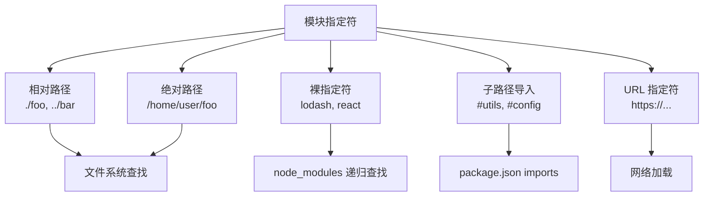
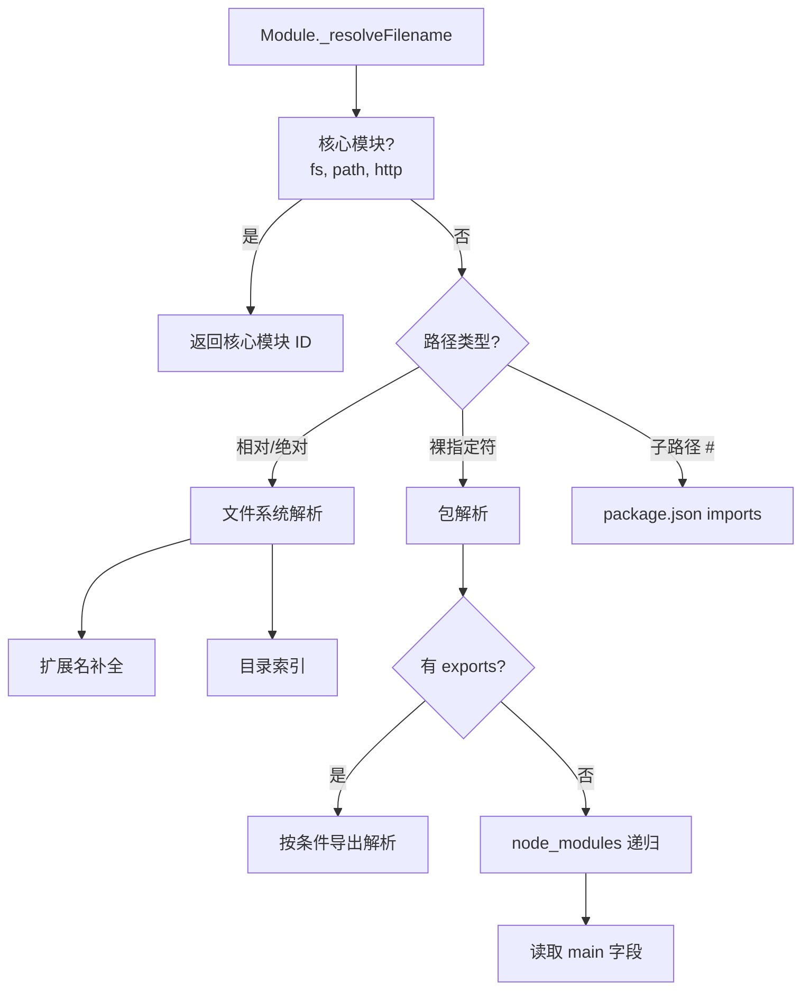
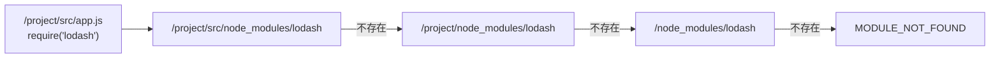
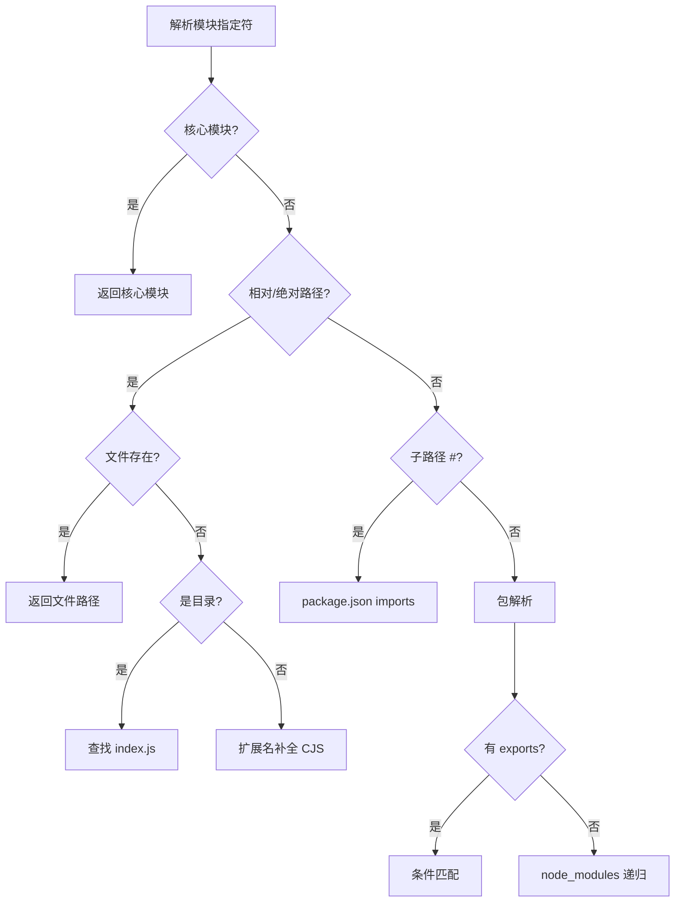
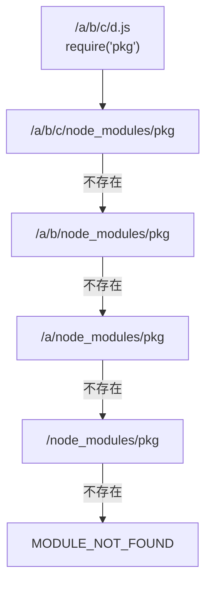

# 模块解析算法深度解析

> **形式化定义**：模块解析（Module Resolution）是将模块指定符（Module Specifier）——即 `import` 或 `require` 语句中的字符串字面量——映射到文件系统实际路径的算法过程。在 Node.js 中，该算法分为**传统解析算法（Legacy Algorithm）**和**现代解析算法（Modern Algorithm，含 `exports` 字段支持）**；在 TypeScript 中，该算法进一步扩展为包含 `paths`、`baseUrl` 和条件导出的类型感知解析系统。模块解析的正确性直接决定了模块图构建的完备性。
>
> 对齐版本：Node.js 22+ | TypeScript 5.8–6.0 | ECMAScript 2025 (ES16)

---

## 1. 概念定义 (Concept Definition)

### 1.1 形式化定义

模块解析可形式化为一个偏函数 `Resolve: Specifier × Context → Path | Error`，其中：

- **Specifier**：模块指定符字符串，如 `"./utils"`、`"lodash"`、`"#internal"`
- **Context**：解析上下文，包含当前文件路径、模块类型（ESM/CJS）、条件键（`import`/`require`/`types`/`default`）
- **Path**：文件系统绝对路径或内部核心模块标识符
- **Error**：解析失败时抛出的 `MODULE_NOT_FOUND` 错误

ECMA-262 本身不定义模块指定符的解析算法，将其留给宿主环境（Host Environment）。Node.js 和浏览器分别实现了不同的解析策略。

### 1.2 模块指定符分类



---

## 2. 属性与特征 (Properties & Characteristics)

### 2.1 解析算法属性矩阵

| 特性 | Node.js Legacy | Node.js Modern (含 exports) | TypeScript `node` | TypeScript `nodenext` |
|------|---------------|---------------------------|-------------------|----------------------|
| 支持 `exports` | 否 | 是 | 否 | 是 |
| 支持 `imports` | 否 | 是 | 否 | 是 |
| 扩展名自动补全 | `.js`/`.json`/`.node` | 相同 | `.ts`/`.tsx`/`.js` | 相同，更严格 |
| `node_modules` 递归 | 是 | 是 | 是 | 是 |
| 目录索引解析 | `index.js` | `index.js` | `index.ts` | 严格匹配 |
| 条件导出 | 否 | 是 | 否 | 是 |

### 2.2 扩展名解析优先级真值表

对于指定符 `"./utils"`，Node.js 尝试以下路径：

| 尝试顺序 | ESM 上下文 | CJS 上下文 | TypeScript (编译前) |
|---------|-----------|-----------|-------------------|
| 1 | `./utils` | `./utils` | `./utils.ts` |
| 2 | `./utils.js` | `./utils` | `./utils.tsx` |
| 3 | `./utils/package.json` | `./utils.js` | `./utils.d.ts` |
| 4 | — | `./utils.json` | `./utils.js` |
| 5 | — | `./utils.node` | — |

**注意**：ESM 在 Node.js 中**不自动补全扩展名**，`import "./utils"` 必须显式写为 `import "./utils.js"`（即使源文件是 `.ts`，编译后也需指向 `.js`）。这是 ESM 严格性的一部分。

---

## 3. 关系分析 (Relationship Analysis)

### 3.1 Node.js 模块解析层级结构



### 3.2 TypeScript 与 Node.js 解析的关系

| 层级 | Node.js 运行时 | TypeScript 编译时 |
|------|---------------|------------------|
| 目标 | 找到可执行的 `.js`/`.mjs`/`.cjs` | 找到类型定义 `.d.ts` 或源码 `.ts` |
| `paths` 支持 | 否 | 是 |
| `exports` 条件 | `import` / `require` / `default` | 增加 `types` 条件 |
| 扩展名 | 运行时实际扩展名 | 源码扩展名 + 编译后映射 |

---

## 4. 机制解释 (Mechanism Explanation)

### 4.1 Node.js 模块解析算法（现代版）

```
Resolve(specifier, parentURL):
  if specifier is a core module name:
    return core module
  
  if specifier starts with "/":
    resolved ← fileURLToPath(specifier)
  else if specifier starts with "./" or "../":
    resolved ← path.resolve(dirname(parentURL), specifier)
  else if specifier starts with "#":
    resolved ← PackageImportsResolve(specifier, parentURL)
  else:
    resolved ← PackageResolve(specifier, parentURL)
  
  if resolved is a file:
    return resolved
  if resolved is a directory:
    return DirectoryIndexResolve(resolved)
  
  // 扩展名补全（CJS 专属）
  for ext in [".js", ".json", ".node"]:
    if fileExists(resolved + ext):
      return resolved + ext
  
  throw MODULE_NOT_FOUND
```

### 4.2 `node_modules` 递归查找机制

对于裸指定符 `"lodash"`，Node.js 从 `parentURL` 所在目录开始，逐层向上查找 `node_modules/lodash`：



### 4.3 TypeScript Path Mapping 机制

TypeScript 的 `paths` 配置允许将模块指定符映射到自定义路径：

```json
{
  "compilerOptions": {
    "baseUrl": "./src",
    "paths": {
      "@app/*": ["app/*"],
      "@shared/*": ["../shared/*"]
    }
  }
}
```

**关键限制**：
- `paths` 仅在 TypeScript 编译时生效，**不影响运行时模块解析**
- 运行时（Node.js）需要通过 `--experimental-specifier-resolution=node` 或打包工具处理相同映射
- TypeScript 5.0+ 引入 `"rootDirs"` 作为补充，6.0 已移除 `baseUrl` 的自动推断（需显式配置）

---

## 5. 论证分析 (Argumentation Analysis)

### 5.1 ESM 不自动补全扩展名的设计理由

**问题**：为何 `import "./utils"` 在 ESM 中失败，而 `require("./utils")` 在 CJS 中成功？

**推理链**：
1. ESM 的设计目标之一是支持浏览器原生运行（无文件系统）。
2. 浏览器通过 HTTP 请求加载模块，每个请求都有网络开销。
3. 若浏览器尝试 `"./utils"` → 404 → 再试 `"./utils.js"`，会产生冗余请求。
4. 因此 ESM 要求显式扩展名，避免猜测带来的性能损耗和歧义。
5. CJS 仅运行于服务端，文件系统查找成本极低，因此允许扩展名补全。

**结论**：ESM 的显式扩展名要求是浏览器兼容性和性能优化的产物，是静态模块系统的必要严格性。

### 5.2 Subpath Imports (`#utils`) 的优势

TypeScript 5.4+ 和 Node.js 12.20+ 支持 `package.json` 的 `imports` 字段：

```json
{
  "imports": {
    "#utils": "./src/utils.js",
    "#config/*": "./config/*.js"
  }
}
```

**优势分析**：
- **封装性**：内部模块路径重构不影响消费者（`#utils` 始终有效）
- **免 `node_modules`**：不依赖符号链接或 `node_modules` 安装结构
- **类型安全**：TypeScript 支持 `imports` 字段解析，无需额外 `paths` 配置

---

## 6. 形式证明 (Formal Proof)

### 6.1 公理化基础

**公理 15（解析唯一性）**：在同一解析上下文中，同一模块指定符映射到唯一的绝对路径或核心模块标识符。

**公理 16（目录层级单调性）**：`node_modules` 查找遵循从近到远、从深到浅的单调顺序，不会跳过任何中间层级。

**公理 17（条件导出优先级）**：`exports` 字段的条件匹配遵循声明顺序，第一个匹配的条件键决定导出路径。

### 6.2 定理与证明

**定理 9（路径解析的传递闭包）**：若模块 `A` 导入 `"B"`，模块 `B` 导入 `"C"`，且三者均为相对路径，则 `C` 的解析路径相对于 `A` 的解析路径满足传递关系。

*证明*：设 `A` 位于 `/project/src/a.js`，`B` 位于 `/project/src/b.js`。`A` 解析 `"./c"` 得 `/project/src/c.js`。`B` 解析 `"./d"` 得 `/project/src/d.js`。相对路径解析以当前文件目录为基准，不依赖于调用链，因此具有局部确定性。∎

**定理 10（裸指定符的最长前缀匹配）**：对于 scoped package `"@scope/pkg/subpath"`，Node.js 解析时以 `"@scope/pkg"` 为包名，`"/subpath"` 为子路径，在包的 `exports` 或 `node_modules` 目录内继续解析。

*证明*：Node.js `PackageResolve` 算法识别 `@` 开头的指定符，找到第一个 `/` 后的第二个 `/` 分割包名与子路径。对于 `"@scope/pkg/subpath/module"`，包名为 `"@scope/pkg"`，子路径为 `"subpath/module"`。∎

---

## 7. 实例示例 (Examples)

### 7.1 正例：Conditional Exports 的精确配置

```json
{
  "exports": {
    ".": {
      "types": "./dist/index.d.ts",
      "import": "./dist/index.mjs",
      "require": "./dist/index.cjs"
    },
    "./feature": {
      "types": "./dist/feature.d.ts",
      "import": "./dist/feature.mjs",
      "require": "./dist/feature.cjs"
    }
  }
}
```

### 7.2 反例：循环的 `exports` 映射

```json
{
  "exports": {
    ".": "./dist/index.js",
    "./sub": "./dist/sub.js",
    "./sub/deep": "./sub"  
  }
}
```

`"./sub/deep"` 指向 `"./sub"`，而 `"./sub"` 不指向 `"./sub/deep"`，看似无循环，但若 `"./sub"` 通过目录索引解析回 `"./sub/deep"`，可能导致无限循环。Node.js 对此有检测机制。

### 7.3 边缘案例：`exports` 的通配符模式

```json
{
  "exports": {
    "./*.js": {
      "types": "./types/*.d.ts",
      "import": "./esm/*.js",
      "require": "./cjs/*.js"
    }
  }
}
```

`"./utils.js"` 匹配 `"./*.js"`，`*` 捕获 `"utils"`，因此解析为 `./types/utils.d.ts`（类型）、`./esm/utils.js`（ESM）、`./cjs/utils.js`（CJS）。

---

## 8. 权威参考 (References)

| 来源 | 链接 | 相关章节 |
|------|------|---------|
| Node.js Resolution | nodejs.org/api/modules.html | All Together |
| Node.js ESM Resolution | nodejs.org/api/esm.html#resolution-algorithm | Resolution Algorithm |
| TypeScript Module Resolution | typescriptlang.org/docs/handbook/module-resolution.html | Module Resolution |
| TypeScript TSConfig | typescriptlang.org/tsconfig | paths, baseUrl |
| Node.js Packages | nodejs.org/api/packages.html | Subpath Imports |

---

## 9. 思维表征 (Mental Representations)

### 9.1 模块解析决策树



### 9.2 `node_modules` 查找层级图



---

## 10. 版本演进 (Version Evolution)

### 10.1 TypeScript `paths` 与 `baseUrl` 演进

| 版本 | 特性 | 说明 |
|------|------|------|
| TS 1.0 | `paths` + `baseUrl` 引入 | 编译时路径映射 |
| TS 4.1 | `paths` 支持 `*` 通配 | 更灵活的子路径映射 |
| TS 4.7 | `moduleResolution: "node16"` | 支持 ESM/CJS 条件解析 |
| TS 5.0 | `moduleResolution: "bundler"` | 打包工具兼容模式 |
| TS 6.0 | `baseUrl` 非自动推断 | 必须显式声明 `baseUrl` |

### 10.2 Node.js 解析算法演进

| 版本 | 特性 | 说明 |
|------|------|------|
| Node.js 0.x | Legacy Algorithm | `node_modules` 递归、扩展名补全 |
| Node.js 12.7 | `exports` 字段 | Conditional Exports |
| Node.js 12.20 | `imports` 字段 | Subpath Imports |
| Node.js 14+ | ESM 严格解析 | 无扩展名自动补全 |
| Node.js 18+ | `node:` 前缀 | 核心模块显式前缀 |
| Node.js 20+ | `import.meta.resolve` | 运行时路径解析 |

---

**参考规范**：Node.js Module Resolution Algorithm | TypeScript Handbook: Module Resolution | ECMA-262 §16.2 (Host Resolve Imported Module)
