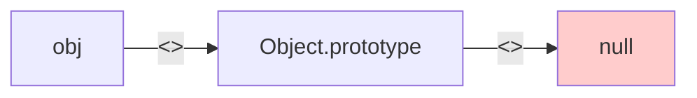
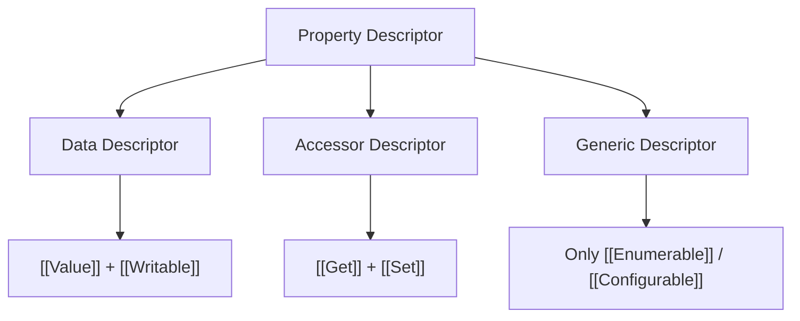
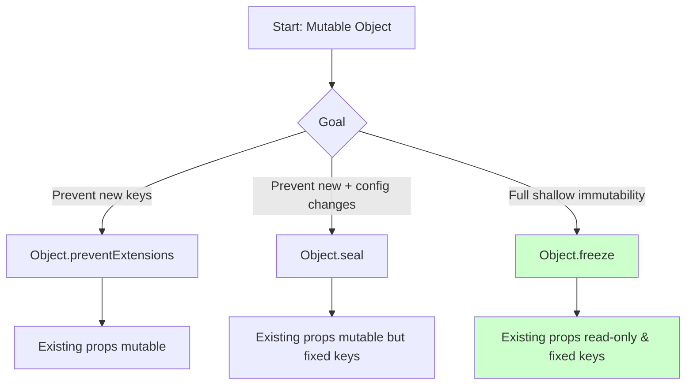

# JavaScript Object Model Overview

## 1. Introduction

In ECMAScript, an **object** is defined by the ECMA-262 specification as "a collection of zero or more properties, each with attributes that determine how the property can be used" (§6.1.7). Unlike class-based languages where objects are instances of static blueprints, JavaScript objects are dynamic, mutable mappings from string or symbol keys to values, governed by an internal mechanism of *property descriptors* and a *prototype chain*.

This document provides a comprehensive, specification-oriented analysis of the JavaScript object model, covering property representation, descriptors, accessor properties, object integrity levels, and formal definitions grounded in ECMA-262 terminology.

---

## 2. Objects as Collections of Properties

At the most fundamental level, a JavaScript object is a **collection of properties**. Each property is a key–value association where:

- The **key** is either a **String** or a **Symbol** (ECMA-262 §6.1.1, §6.1.5).
- The **value** is an ECMAScript language value (primitive or object).

Properties are stored in an internal data structure referred to in the specification as the **<<ObjectRecord>>** (conceptually). When we write:

```js
const obj = { a: 1, b: 2 };
```

we are creating an **Ordinary Object** whose internal slot <<Prototype>> is set to `Object.prototype` and whose own properties are `"a"` and `"b"`.

### 2.1 Property Categories

ECMA-262 distinguishes two categories of properties:

| Category | Description |
|----------|-------------|
| **Data Property** | Associates a key with an ECMAScript language value and a set of Boolean attributes. |
| **Accessor Property** | Associates a key with one or two accessor functions (`get` and/or `set`) and a set of Boolean attributes. |

Every property, regardless of category, has four core attributes: `[[Value]]` or `[[Get]]`/`[[Set]]`, `[[Writable]]`, `[[Enumerable]]`, and `[[Configurable]]`.

---

## 3. The Prototype Chain (`[[Prototype]]`)

Every object has an internal slot named **<<Prototype>>** (§9.1.2). The value of this slot is either `null` or another object. When a property is accessed on an object and the property is not found as an *own property*, the engine performs a **prototype lookup**: it follows the <<Prototype>> link recursively until either the property is found or the chain terminates at `null`.

This recursive resolution mechanism is the **prototype chain**.



*Figure 1: Minimal prototype chain for an ordinary object literal.*

The specification defines this lookup formally via **<<GetPrototypeOf>>** (§9.1.3) and the abstract operation **GetV** (§7.3.2).

---

## 4. Property Descriptors

A **Property Descriptor** (§6.2.5) is a specification type used to describe the attributes of a property. It is a Record whose fields are:

| Field | Applicable To | Meaning |
|-------|---------------|---------|
| `[[Value]]` | Data | The value retrieved by reading the property. |
| `[[Writable]]` | Data | If `false`, the `[[Value]]` cannot be changed. |
| `[[Get]]` | Accessor | A function called to retrieve the property value, or `undefined`. |
| `[[Set]]` | Accessor | A function called to assign the property value, or `undefined`. |
| `[[Enumerable]]` | Both | If `true`, the property will be enumerated by `for...in`. |
| `[[Configurable]]` | Both | If `false`, the descriptor cannot be changed and the property cannot be deleted. |

### 4.1 Data Property vs Accessor Property Descriptor



*Figure 2: Taxonomy of Property Descriptors.*

### 4.2 Comparison Table: Descriptor Combinations

| `[[Value]]` | `[[Writable]]` | `[[Get]]` | `[[Set]]` | `[[Enumerable]]` | `[[Configurable]]` | Result Type |
|-------------|----------------|-----------|-----------|------------------|--------------------|-------------|
| 42 | true | — | — | true | true | Mutable data property |
| 42 | false | — | — | true | true | Read-only data property |
| 42 | true | — | — | false | true | Non-enumerable data property |
| — | — | fn | fn | true | true | Accessor property with getter+setter |
| — | — | fn | undefined | true | true | Read-only accessor |
| — | — | undefined | fn | true | true | Write-only accessor |

> **Important**: A descriptor cannot be both a data descriptor and an accessor descriptor simultaneously. Attempting to define both `value`/`writable` and `get`/`set` in the same descriptor causes a `TypeError`.

---

## 5. Accessor Properties (Getters and Setters)

Accessor properties allow **computed property access**. Instead of storing a value directly, the engine invokes a getter function upon read and a setter function upon write.

### 5.1 Formal Semantics

When the abstract operation **<<Get>>** (§9.1.8) is called on an accessor property `P` of object `O`:

1. Let *desc* be `O.[[GetOwnProperty]](P)`.
2. If *desc* is `undefined`, traverse the prototype chain.
3. If *desc*.[[Get]] is `undefined`, return `undefined`.
4. Otherwise, call *desc*.[[Get]] with receiver `O`.

Similarly, **<<Set>>** (§9.1.9) for an accessor property invokes *desc*.[[Set]] if present.

### 5.2 Syntactic Forms

```js
// Object literal notation
const obj = {
  _x: 0,
  get x() { return this._x; },
  set x(v) { this._x = v; }
};

// defineProperty notation
Object.defineProperty(obj, 'y', {
  get() { return this._y; },
  set(v) { this._y = v; },
  enumerable: true,
  configurable: true
});
```

---

## 6. `Object.defineProperty` vs Direct Assignment

Direct property assignment (`obj.prop = value`) and `Object.defineProperty` operate at different levels of abstraction and exhibit different default behaviors.

| Aspect | Direct Assignment (`obj.x = 1`) | `Object.defineProperty` |
|--------|--------------------------------|--------------------------|
| Creates new property | Yes | Yes |
| Default `writable` | `true` | `false` |
| Default `enumerable` | `true` | `false` |
| Default `configurable` | `true` | `false` |
| Modifies existing descriptor | Only value (if writable) | Full descriptor control |
| Triggers setter | Yes, if accessor exists | Yes, if accessor exists on target |
| Returns | The assigned value | The object |

### 6.1 Formal Difference

Direct assignment is specified as the evaluation of the **AssignmentExpression** (§13.15). For a property access `LeftHandSideExpression = AssignmentExpression`, the engine performs:

1. Let *lref* be the result of evaluating `LeftHandSideExpression`.
2. Let *rref* be the result of evaluating `AssignmentExpression`.
3. Let *rval* be `? GetValue(rref)`.
4. Perform `? PutValue(lref, rval)`.

`PutValue` eventually calls **<<Set>>** (§9.1.9), which may invoke a setter or create a new data property with defaults `\{\[[Value]]: rval, [[Writable]]: true, [[Enumerable]]: true, [[Configurable]]: true\}`.

In contrast, `Object.defineProperty(obj, prop, desc)` performs the abstract operation **DefinePropertyOrThrow** (§7.3.7), which delegates to the object's internal method **<<DefineOwnProperty>>** (§9.1.6). Unspecified descriptor fields default to `false` or `undefined`.

---

## 7. Object Integrity Levels

ECMAScript provides three standard mechanisms to restrict mutability of objects, forming a hierarchy of decreasing mutability.

### 7.1 Overview

| Operation | Prevents New Properties | Marks Existing Properties Non-configurable | Marks Existing Data Properties Non-writable |
|-----------|------------------------|-------------------------------------------|--------------------------------------------|
| `Object.preventExtensions(O)` | Yes | No | No |
| `Object.seal(O)` | Yes | Yes | No |
| `Object.freeze(O)` | Yes | Yes | Yes |

### 7.2 Formal Specification

- **<<PreventExtensions>>** (§9.1.4): Sets the internal slot <<Extensible>> to `false`. After this, any call to <<DefineOwnProperty>> that would add a new property returns `false`.
- **<<Seal>>** (§19.1.2.20): First calls <<PreventExtensions>>, then iterates over all own properties and sets their `[[Configurable]]` attribute to `false`.
- **<<Freeze>>** (§19.1.2.21): First calls <<Seal>> equivalent steps, then additionally sets `[[Writable]]: false` on all data properties.

### 7.3 Detecting Integrity Level

```js
Object.isExtensible(obj);   // false after preventExtensions/seal/freeze
Object.isSealed(obj);       // true after seal/freeze
Object.isFrozen(obj);       // true after freeze only
```

These predicates are defined in §19.1.2.13, §19.1.2.16, and §19.1.2.15 respectively.

### 7.4 Shallow vs Deep Immutability

`Object.freeze` is **shallow**: it only freezes the own properties of the target object. If a property value is itself an object, that nested object remains mutable unless also frozen.



*Figure 3: Decision flow for object integrity levels.*

---

## 8. Formal Definitions (ECMA-262)

### Definition 8.1: Ordinary Object

An **Ordinary Object** is an object that has the default behavior for essential internal methods. Its <<Prototype>> is either `null` or another object, and its <<Extensible>> is a Boolean.

### Definition 8.2: Essential Internal Methods

Every object must implement the following internal methods (§9.1):

| Internal Method | Signature | Purpose |
|-----------------|-----------|---------|
| <<GetPrototypeOf>> | `( ) → Object | null` | Return prototype |
| <<SetPrototypeOf>> | `(Object | null) → Boolean` | Set prototype |
| <<IsExtensible>> | `( ) → Boolean` | Check extensibility |
| <<PreventExtensions>> | `( ) → Boolean` | Make non-extensible |
| <<GetOwnProperty>> | `(propertyKey) → PropertyDescriptor | undefined` | Retrieve own descriptor |
| <<DefineOwnProperty>> | `(propertyKey, PropertyDescriptor) → Boolean` | Define or modify property |
| <<HasProperty>> | `(propertyKey) → Boolean` | Check existence (own + chain) |
| <<Get>> | `(propertyKey, Receiver) → any` | Retrieve value |
| <<Set>> | `(propertyKey, value, Receiver) → Boolean` | Assign value |
| <<Delete>> | `(propertyKey) → Boolean` | Remove property |
| <<OwnPropertyKeys>> | `( ) → List of propertyKey` | Enumerate own keys |

### Definition 8.3: Property Descriptor Record

A **Property Descriptor** is a Record with optional fields:

- `[[Value]]`, `[[Writable]]`, `[[Get]]`, `[[Set]]`, `[[Enumerable]]`, `[[Configurable]]`

A descriptor is **generic** if it is neither a data descriptor nor an accessor descriptor.

---

## 9. Complete Descriptor Combination Matrix

The following matrix enumerates all meaningful descriptor configurations for a data property:

| Writable | Enumerable | Configurable | Behavior |
|----------|-----------|--------------|----------|
| T | T | T | Fully mutable, visible, deletable |
| T | T | F | Mutable, visible, not deletable |
| T | F | T | Mutable, hidden, deletable |
| T | F | F | Mutable, hidden, not deletable |
| F | T | T | Read-only, visible, deletable |
| F | T | F | Read-only, visible, not deletable |
| F | F | T | Read-only, hidden, deletable |
| F | F | F | Read-only, hidden, not deletable |

> **Note**: "hidden" means the property does not appear in `for...in`, `Object.keys`, or `JSON.stringify`.

---

## 10. Summary

The JavaScript object model, when viewed through the lens of ECMA-262, is a precisely specified system of property mappings governed by descriptors, internal methods, and prototype chains. Key takeaways:

1. Objects are dynamic property bags with specification-defined internal slots.
2. Every property has a descriptor that controls its mutability, visibility, and deletability.
3. Accessor properties decouple storage from retrieval via getter/setter functions.
4. `Object.defineProperty` provides low-level descriptor control; direct assignment provides convenience with permissive defaults.
5. `preventExtensions`, `seal`, and `freeze` offer progressively stricter object integrity, all operating shallowly.
6. Understanding the formal internal methods (<<Get>>, <<Set>>, <<DefineOwnProperty>>) is essential for predicting engine behavior in edge cases.

---

## References

- ECMA-262, 15th Edition, §6.1.7 Object Type
- ECMA-262, 15th Edition, §6.2.5 Property Descriptor Specification Type
- ECMA-262, 15th Edition, §9.1 Ordinary Object Internal Methods
- ECMA-262, 15th Edition, §19.1.2 Object Constructor Properties
