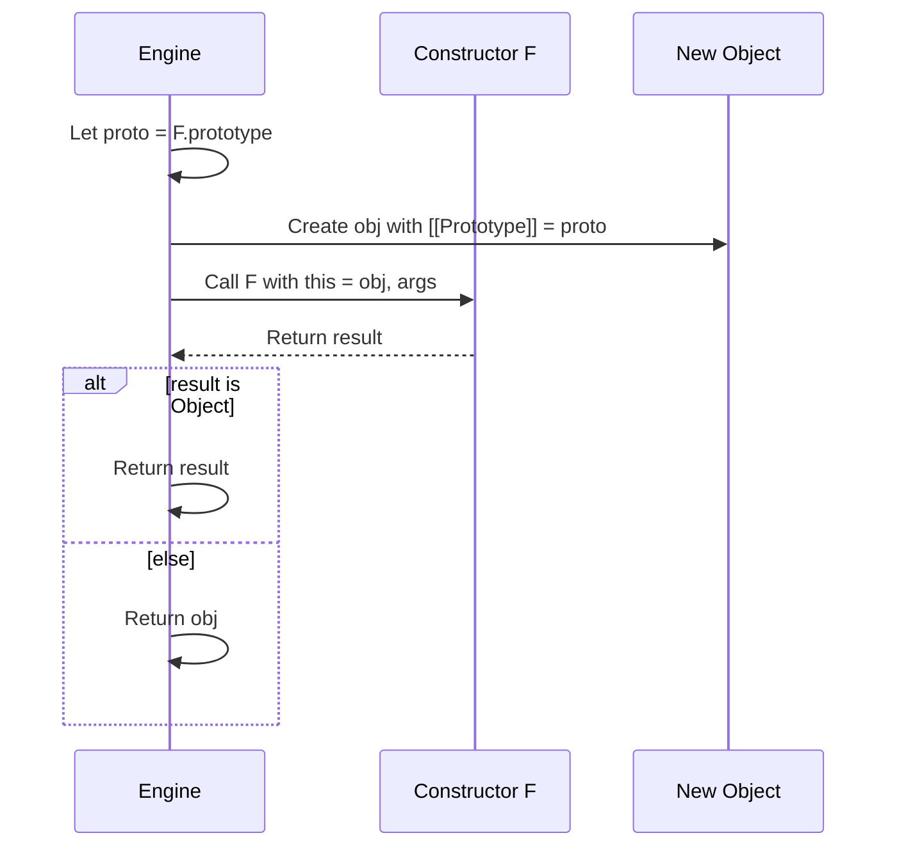

# Prototype Chain Deep Dive

## 1. Introduction

The **prototype chain** is the foundational inheritance mechanism in ECMAScript. Unlike class-based languages that rely on static type hierarchies, JavaScript delegates property and method lookup through a dynamic, mutable chain of objects. This document provides an academic-level examination of the prototype chain, encompassing legacy accessors, constructor semantics, the `new` operator, `instanceof`, and the modern `class` syntactic sugar, all grounded in ECMA-262 formalism.

---

## 2. `__proto__` vs `Object.getPrototypeOf()`

Historically, the only way to access an object's prototype in implementations was the non-standard `__proto__` property, introduced in SpiderMonkey and later de facto standardized. ECMAScript 2015 (6th Edition) formally specified `Object.getPrototypeOf(O)` and `Object.setPrototypeOf(O, proto)` as the standard API, while also standardizing `__proto__` as a legacy feature in Annex B.

### 2.1 Specification Distinction

| Feature | `__proto__` | `Object.getPrototypeOf()` |
|---------|-------------|---------------------------|
| Specification | Annex B (optional for non-web hosts) | §19.1.2.9 (core language) |
| Type | Accessor property on `Object.prototype` | Static method on `Object` |
| Mutability | Can be used as getter/setter | Getter only; use `setPrototypeOf` to mutate |
| Compatibility | Universal in browsers | Available in all ES5+ environments |

### 2.2 Formal Semantics

The abstract operation **<<GetPrototypeOf>>** (§9.1.3) returns the value of the <<Prototype>> internal slot. `Object.getPrototypeOf(O)` performs:

1. Let *obj* be `? ToObject(O)`.
2. Return `? obj.[[GetPrototypeOf]]()`.

The legacy `__proto__` getter does the same, but the setter additionally performs **<<SetPrototypeOf>>** (§9.1.2), which may reject the change if the object is non-extensible or if the operation would create a prototype cycle.

### 2.3 Modern Best Practice

```js
// Recommended
const proto = Object.getPrototypeOf(obj);
Object.setPrototypeOf(obj, newProto); // Use with caution; mutating prototypes is slow

// Avoid in new code
const legacy = obj.__proto__;
obj.__proto__ = newProto;
```

---

## 3. The End of the Chain: `Object.prototype`

All ordinary objects created by object literals, array literals, or the `Object` constructor inherit from **<<Object.prototype>>** (§19.1.3). This object has two critical characteristics:

1. Its own <<Prototype>> is **<<null>>**.
2. It defines universal methods such as `hasOwnProperty`, `isPrototypeOf`, `propertyIsEnumerable`, and `toString`.

### 3.1 Formal Chain Termination

The specification defines prototype lookup via **OrdinaryGetPrototypeOf** (§9.1.3.1), which simply returns the <<Prototype>> slot. When **<<Get>>** (§9.1.8) traverses the chain:

1. Let *desc* be `? O.[[GetOwnProperty]](P)`.
2. If *desc* is not `undefined`, return the value.
3. Let *parent* be `? O.[[GetPrototypeOf]]()`.
4. If *parent* is `null`, return `undefined`.
5. Return `? parent.[[Get]](P, Receiver)`.

Thus, `Object.prototype` acts as the final fallback; if a property is not found there, the chain terminates and `undefined` is returned.

### 3.2 Creating a Null-Prototype Object

```js
const dict = Object.create(null);
console.log(dict.toString); // undefined (no Object.prototype pollution)
```

This pattern is useful for dictionaries where arbitrary keys (e.g., `"toString"`) should not collide with inherited properties.

---

## 4. Constructor Functions and the `.prototype` Property

Prior to ECMAScript 2015, inheritance was established through **constructor functions** paired with a manually assigned `.prototype` object.

### 4.1 Mechanics

When a function is created, it receives an internal slot <<Prototype>> (pointing to `Function.prototype`) and a **callable** internal method. Additionally, every function object has a **<<prototype>>** *own property* (spelled with a lowercase "p") that defaults to an ordinary object with a single property `constructor` pointing back to the function.

```js
function Person(name) {
  this.name = name;
}
Person.prototype.greet = function() {
  return `Hello, ${this.name}`;
};
```

### 4.2 Two Meanings of "Prototype"

It is critical to distinguish:

| Notation | Meaning | Internal / Own |
|----------|---------|----------------|
| `obj.__proto__` / `Object.getPrototypeOf(obj)` | The object's prototype for inheritance | Internal slot <<Prototype>> |
| `Fn.prototype` | An *own property* of the function, used as the prototype of instances created by `new Fn()` | Own property |

---

## 5. `new` Operator Semantics (Step by Step)

The `new` operator is one of the most involved syntactic forms in ECMAScript. Its evaluation is specified in §13.5.3 and delegates to the abstract operation **<<Construct>>** (§7.3.14).

### 5.1 Formal Algorithm

For the expression `new F(args)`:

1. Evaluate the constructor expression `F` to obtain *constructor*.
2. Let *argList* be the argument list evaluation of `args`.
3. If *constructor* is not a constructor, throw a `TypeError`.
4. Return `? Construct(constructor, argList)`.

**Construct(F, argumentsList)** performs:

1. Let *obj* be `? OrdinaryCreateFromConstructor(F, "%Object.prototype%")`.
2. Let *result* be `? Call(F, obj, argumentsList)`.
3. If *result* is an Object, return *result*.
4. Otherwise, return *obj*.

**OrdinaryCreateFromConstructor(constructor, intrinsicDefaultProto)** performs:

1. Let *proto* be `? GetPrototypeFromConstructor(constructor, intrinsicDefaultProto)`.
2. Return `OrdinaryObjectCreate(proto)`.

### 5.2 The Three Steps Simplified

Developers often summarize `new` as:

1. Create a new empty object whose <<Prototype>> is `F.prototype`.
2. Invoke `F` with `this` bound to that new object.
3. If `F` returns an object, use it; otherwise use the new object.



*Figure 1: Sequence diagram of `new` operator execution.*

---

## 6. `instanceof` Operator and `Symbol.hasInstance`

The `instanceof` operator tests whether a constructor's `.prototype` appears anywhere in the prototype chain of an object.

### 6.1 Specification Algorithm (§13.10.2)

For `value instanceof C`:

1. Let *instOfHandler* be `? GetMethod(C, @@hasInstance)`.
2. If *instOfHandler* is not `undefined`, return `? ToBoolean(? Call(instOfHandler, C, « value »))`.
3. If `IsCallable(C)` is `false`, throw a `TypeError`.
4. Return `? OrdinaryHasInstance(C, value)`.

**OrdinaryHasInstance(C, O)** (§7.3.21):

1. If `IsCallable(C)` is `false`, return `false`.
2. If `C` has a <<BoundTargetFunction>> internal slot, return `? BoundFunctionHasInstance(C, O)`.
3. If `Type(O)` is not Object, return `false`.
4. Let *P* be `? Get(C, "prototype")`.
5. If `Type(P)` is not Object, throw a `TypeError`.
6. Repeat:
   a. Set *O* to `? O.[[GetPrototypeOf]]()`.
   b. If *O* is `null`, return `false`.
   c. If *O* is *P*, return `true`.

### 6.2 Customizing with `Symbol.hasInstance`

```js
class MyClass {
  static [Symbol.hasInstance](instance) {
    return instance && instance._tag === 'myclass';
  }
}

console.log({ _tag: 'myclass' } instanceof MyClass); // true
```

This allows `instanceof` to operate on arbitrary predicates, decoupling it from the prototype chain when needed.

---

## 7. `isPrototypeOf()`

The method `Object.prototype.isPrototypeOf(V)` (§19.1.3.4) tests whether an object exists in the prototype chain of another object. It is the inverse perspective of `instanceof`: instead of asking "is this instance of that constructor?", it asks "is this object a prototype of that instance?".

### 7.1 Algorithm

1. Let *O* be `? ToObject(this value)`.
2. Repeat:
   a. Set *V* to `? V.[[GetPrototypeOf]]()`.
   b. If *V* is `null`, return `false`.
   c. If *O* is *V*, return `true`.

### 7.2 Example

```js
const proto = { x: 1 };
const obj = Object.create(proto);

proto.isPrototypeOf(obj);        // true
Object.prototype.isPrototypeOf(obj); // true
```

---

## 8. Class Syntax as Prototype Chain Sugar

ECMAScript 2015 introduced the `class` keyword, which is entirely syntactic sugar over the constructor-function-and-prototype pattern. The specification defines class evaluation in §14.6 and §14.7.

### 8.1 Desugaring

```js
class Animal {
  constructor(name) {
    this.name = name;
  }
  speak() {
    return `${this.name} makes a sound.`;
  }
}

class Dog extends Animal {
  speak() {
    return `${this.name} barks.`;
  }
}
```

Roughly desugars to:

```js
function Animal(name) {
  this.name = name;
}
Animal.prototype.speak = function() {
  return `${this.name} makes a sound.`;
};

function Dog(name) {
  Animal.call(this, name);
}
Object.setPrototypeOf(Dog, Animal);           // static inheritance
Dog.prototype = Object.create(Animal.prototype);
Dog.prototype.constructor = Dog;
Dog.prototype.speak = function() {
  return `${this.name} barks.`;
};
```

### 8.2 Formal Class Semantics

The class body defines:

1. A constructor function (`constructor` method, defaulting to `function(){}` for base classes or forwarding to `super(...)` for derived classes).
2. Methods installed on the constructor's `.prototype`.
3. Static methods installed as own properties on the constructor itself.
4. For derived classes, `Object.setPrototypeOf(constructor, superConstructor)` establishes the static prototype chain.

### 8.3 `super` and Home Object

Inside class methods, `super` is not a variable but a special form. The specification introduces the concept of a **<<HomeObject>>** internal slot on functions defined in object/class literals. `super.prop` resolves `prop` on the prototype of <<HomeObject>>, ensuring correct `this` binding via **<<GetSuperBase>>** (§9.1.2.3).

---

## 9. Typical Prototype Chain Visualization

The following diagram illustrates the complete prototype topology for a class-based hierarchy:

```mermaid
graph BT
    instance["dog instance<br/>{ name: 'Rex' }"] -- <<Prototype>> --> DogProto["Dog.prototype<br/>{ speak(), constructor: Dog }"]
    DogProto -- <<Prototype>> --> AnimalProto["Animal.prototype<br/>{ speak(), constructor: Animal }"]
    AnimalProto -- <<Prototype>> --> ObjProto["Object.prototype<br/>{ toString, hasOwnProperty, ... }"]
    ObjProto -- <<Prototype>> --> Null["null<br/>(chain terminator)"]

    DogConstructor["Dog<br/>(constructor function)"] -- <<Prototype>> --> AnimalConstructor["Animal<br/>(constructor function)"]
    AnimalConstructor -- <<Prototype>> --> FunctionProto["Function.prototype<br/>{ call, apply, bind }"]
    FunctionProto -- <<Prototype>> --> ObjProto

    DogConstructor -. .prototype .-> DogProto
    AnimalConstructor -. .prototype .-> AnimalProto
```

*Figure 2: Complete prototype topology for `class Dog extends Animal`.*

---

## 10. Edge Cases and Specification Nuances

### 10.1 Prototype Cycles

The specification explicitly forbids prototype cycles. **<<SetPrototypeOf>>** (§9.1.2) must return `false` if setting the prototype would create a cycle. In strict mode, `Object.setPrototypeOf` throws a `TypeError` when the internal method returns `false`.

### 10.2 Proxy Objects and Prototype Traps

`Proxy` objects can intercept prototype operations via the `getPrototypeOf` and `setPrototypeOf` traps, allowing runtime control over the chain.

```js
const handler = {
  getPrototypeOf(target) {
    return Array.prototype;
  }
};
const p = new Proxy({}, handler);
console.log(p instanceof Array); // true
```

### 10.3 `Function.prototype` is a Function

Uniquely, `Function.prototype` is itself a callable object (a function with no executable body). This ensures that every function, including itself, has a consistent prototype chain terminating at `Object.prototype`.

---

## 11. Summary

| Concept | Key Takeaway |
|---------|-------------|
| `__proto__` | Legacy accessor; prefer `Object.getPrototypeOf` / `setPrototypeOf` |
| `Object.prototype` | The universal fallback; its prototype is `null` |
| `Fn.prototype` | An *own property* of the function, not the function's own prototype |
| `new` | Creates object → binds `this` → returns object or constructor result |
| `instanceof` | Walks the prototype chain looking for `C.prototype` |
| `Symbol.hasInstance` | Allows overriding `instanceof` behavior entirely |
| `isPrototypeOf` | Tests prototype relationship from the prototype's perspective |
| `class` | Syntactic sugar that sets up prototype chains automatically |

Understanding the prototype chain at the specification level enables precise reasoning about inheritance, property resolution, and the behavior of modern syntactic features.

---

## References

- ECMA-262, 15th Edition, §9.1 Ordinary Object Internal Methods
- ECMA-262, 15th Edition, §13.5.3 The `new` Operator
- ECMA-262, 15th Edition, §13.10 Relational Operators (`instanceof`)
- ECMA-262, 15th Edition, §14.6 Class Definitions
- ECMA-262, 15th Edition, §19.1.2.9 `Object.getPrototypeOf`
- ECMA-262, 15th Edition, §19.1.3.4 `Object.prototype.isPrototypeOf`
- ECMA-262, 15th Edition, Annex B.2.2 `Object.prototype.__proto__`
