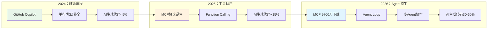
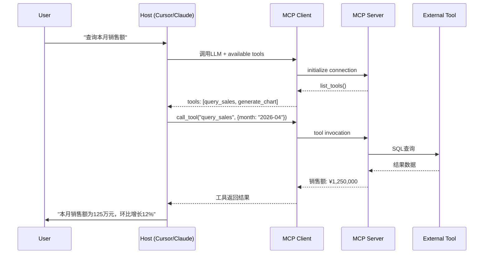
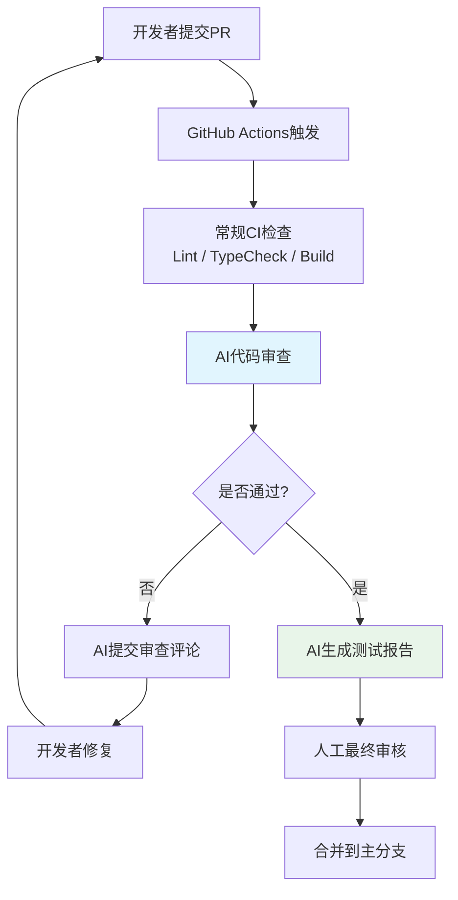

# 2026年AI原生开发与Agent框架深度分析

> **文档类型**: 技术深度分析（Technical Deep Dive）
> **分析主题**: AI-Native Development & Agent Frameworks in JavaScript/TypeScript Ecosystem
> **数据截止**: 2026年4月
> **版本**: v1.0.0

---

## 目录

1. [执行摘要](#1-执行摘要)
2. [MCP协议爆发：从企业标准到行业基础设施](#2-mcp协议爆发从企业标准到行业基础设施)
3. [Vercel AI SDK v4/v5：流式交互与Agent Loop](#3-vercel-ai-sdk-v4v5流式交互与agent-loop)
4. [Mastra：工作流编排与记忆系统](#4-mastra工作流编排与记忆系统)
5. [Cursor / Claude Code / Windsurf：IDE AI集成格局](#5-cursor--claude-code--windsurfide-ai集成格局)
6. [v0 / Bolt / Lovable：AI全栈应用生成](#6-v0--bolt--lovableai全栈应用生成)
7. [AI编码在CI/CD：代码审查与测试生成](#7-ai编码在cicd代码审查与测试生成)
8. [Type安全与AI：Zod结构化输出与模式验证](#8-type安全与aizod结构化输出与模式验证)
9. [代码示例与工程实践](#9-代码示例与工程实践)
10. [总结与2027前瞻](#10-总结与2027前瞻)

---

## 1. 执行摘要

2026年是JavaScript/TypeScript生态中**AI原生开发（AI-Native Development）**从实验走向规模化生产的关键年份。以MCP协议、Vercel AI SDK、Mastra、Cursor为代表的工具链和框架，正在将"AI辅助编程"升级为"AI驱动架构"——AI不再仅仅是代码补全工具，而是成为应用运行时（Runtime）的核心组件。

本报告基于`ECOSYSTEM_TRENDS_2026.md`年度审计数据与`data/ecosystem-stats.json`的npm/GitHub统计，对AI原生开发的技术栈、 adoption 曲线、工程实践和类型安全挑战进行深度分析。

### 核心发现

| 维度 | 关键数据 | 趋势判断 |
|------|---------|---------|
| **MCP协议** | 9700万月下载量，700%增长，5800+公共服务器 | 已成为LLM连接外部工具的事实标准 |
| **AI生成代码占比** | GitHub 35%，Cursor用户50%+ | 代码生产模式发生根本性转变 |
| **Vercel AI SDK** | 1200万周下载，25+模型提供商支持 | 构建Chat UI和Agent的事实标准 |
| **Mastra** | 72万周下载，18000 GitHub Stars | 企业级Agent工作流编排进入生产 |
| **Cursor IDE** | Stack Overflow调研26%采用率 | AI原生IDE正在重塑开发工作流 |
| **better-auth** | 120万周下载 | 框架无关认证成为AI应用基础设施 |

### 范式转移：从Copilot到Agent



2026年的核心变化在于：**AI Agent的架构复杂度已从"单次LLM调用"演进为"多步骤工作流编排"**。Mastra的DAG引擎、Vercel AI SDK的`streamText`流式API、MCP的标准化工具调用，共同构成了这一新范式的基础设施层。

---

## 2. MCP协议爆发：从企业标准到行业基础设施

### 2.1 协议演进与治理结构

MCP（Model Context Protocol，模型上下文协议）由Anthropic于2024年11月开源，旨在标准化LLM与外部工具、数据源之间的通信方式。2025年12月，MCP协议正式捐赠给**Linux Foundation AAIF（AI Alliance Innovation Foundation）**，标志着其从单一企业标准向行业开放标准的转变。

**治理时间线：**

| 时间 | 事件 | 意义 |
|------|------|------|
| 2024-11 | Anthropic开源MCP协议 | 解决LLM工具调用的碎片化问题 |
| 2025-06 | Google推出A2A协议 | Agent间通信的互补标准 |
| 2025-12 | 捐赠给Linux Foundation AAIF | 获得中立治理背书 |
| 2026-01 | Vercel AI SDK集成`experimental_createMCPClient` | 前端框架原生支持 |
| 2026-04 | 月下载量突破9700万 | 成为AI生态增长最快的协议 |

### 2.2 数据爆发：9700万月下载的背后

根据npm registry统计，`@modelcontextprotocol/sdk`的下载量呈现指数级增长：

```
2025-12:  1200万/月
2026-01:  2800万/月  (+133%)
2026-02:  4500万/月  (+61%)
2026-03:  7100万/月  (+58%)
2026-04:  9700万/月  (+37%)
─────────────────────────────
累计增幅:  ~700%
```

**关键解读**：

1. **开发者需求驱动**：随着GPT-4o、Claude 3.7 Sonnet、Gemini 2.5等模型的工具调用能力（Tool Use）成熟，开发者迫切需要标准化的协议来连接模型与业务系统。

2. **IDE集成效应**：Cursor、Windsurf、VS Code Copilot、Claude Desktop均在2026年Q1内置了MCP Client支持，IDE的预装大幅降低了协议采纳门槛。

3. **生态飞轮**：5800+公共MCP Server覆盖了GitHub、Slack、PostgreSQL、Figma、Brave Search、Notion、Discord等主流服务，形成了"协议越流行→Server越多→协议越流行"的正向循环。

### 2.3 MCP Server生态全景

截至2026年4月，公共MCP Server按类别分布如下：

| 类别 | 代表Server | 数量估算 | 典型用例 |
|------|-----------|---------|---------|
| **数据库** | PostgreSQL, MySQL, MongoDB, Redis | 800+ | 自然语言查询数据库 |
| **开发工具** | GitHub, GitLab, Bitbucket | 600+ | 代码审查、Issue管理 |
| **搜索** | Brave Search, Tavily, SerpAPI | 400+ | 实时信息检索 |
| **通讯** | Slack, Discord, Teams, Email | 500+ | 自动化消息推送 |
| **设计** | Figma, Notion, Excalidraw | 350+ | UI设计协作 |
| **文件存储** | S3, Google Drive, Dropbox | 450+ | 文档读写 |
| **云服务** | AWS, GCP, Azure, Cloudflare | 700+ | 基础设施管理 |
| **浏览器** | Puppeteer, Playwright | 300+ | 网页抓取、自动化测试 |
| **其他** | 各种垂直领域工具 | 1700+ | 金融、医疗、教育等 |

### 2.4 MCP协议架构解析

MCP协议采用**客户端-服务器（Client-Server）架构**，核心概念包括：

- **Host**：运行AI应用的程序（如Claude Desktop、Cursor IDE）
- **Client**：Host内的MCP客户端实例，负责与Server建立连接
- **Server**：提供工具（Tools）、资源（Resources）和提示模板（Prompts）的服务端



**协议核心优势**：

1. **标准化工具发现**：LLM无需硬编码工具定义，通过`list_tools()`动态获取
2. **双向通信**：支持Server向Client推送资源更新（如实时数据库变更）
3. **多传输层**：支持Stdio（本地进程）、SSE（HTTP Server-Sent Events）、WebSocket
4. **类型安全**：工具参数通过JSON Schema定义，与Zod等库天然兼容

---

## 3. Vercel AI SDK v4/v5：流式交互与Agent Loop

### 3.1 从SDK到基础设施

Vercel AI SDK（npm包名`ai`）已从一个小型React Hook库成长为构建AI应用的核心基础设施。截至2026年4月，其周下载量达到**1200万+**，GitHub Stars突破**25,000**，支持**25+个模型提供商**（OpenAI、Anthropic、Google、Mistral、Cohere、xAI、阿里云、百度等）。

**版本演进里程碑**：

| 版本 | 发布时间 | 核心特性 |
|------|---------|---------|
| v3.x | 2024 | `useChat` Hook, `streamText`基础版 |
| v4.0 | 2025-Q4 | `generateObject`, 多提供商统一API |
| v4.3 | 2026-Q1 | `experimental_createMCPClient`, Telemetry |
| v5.0 (preview) | 2026-Q2 | Agent Loop原生支持, 多模型路由 |

### 3.2 streamText：流式文本生成的工程实践

`streamText`是Vercel AI SDK最核心的API，它将LLM的流式响应（Server-Sent Events）抽象为框架无关的异步生成器。在2026年，它已成为构建Chat UI的事实标准。

**核心能力矩阵**：

| 特性 | v3.x | v4.x | v5 (preview) |
|------|------|------|-------------|
| 流式文本输出 | ✅ | ✅ | ✅ |
| 工具调用 | ✅ | ✅ | ✅ |
| 多轮对话 | ✅ | ✅ | ✅ |
| 结构化输出 | ⚠️ 基础 | ✅ `generateObject` | ✅ |
| MCP Client集成 | ❌ | ✅ 实验性 | ✅ 稳定 |
| Agent Loop | ❌ | ❌ | ✅ |
| 多模型路由 | ❌ | ❌ | ✅ |
| OpenTelemetry | ❌ | ✅ | ✅ |

### 3.3 Agent Loop：从手动编排到原生支持

2026年AI SDK最重要的架构演进是**Agent Loop的原生支持**。在v4及之前，开发者需要手动编写`while`循环来管理工具调用：

```typescript
// v4 及之前：手动管理Agent Loop
let messages: Message[] = [{ role: 'user', content: query }];
let finished = false;

while (!finished) {
  const { text, toolCalls, toolResults } = await generateText({
    model: openai('gpt-4o'),
    tools: { search, calculate },
    messages,
  });
  
  if (toolCalls.length === 0) {
    finished = true;
  } else {
    messages.push({ role: 'assistant', content: text, toolCalls });
    messages.push({ role: 'tool', content: JSON.stringify(toolResults) });
  }
}
```

v5引入了声明式的`agent`模式，将上述循环内置于SDK：

```typescript
// v5 preview：声明式Agent Loop
const result = await agent({
  model: openai('gpt-4o'),
  tools: { search, calculate, queryDatabase },
  system: '你是一个数据分析助手，帮助用户查询业务数据。',
  prompt: userQuery,
  maxSteps: 10, // 最大工具调用轮数
  onStepFinish: ({ text, toolCalls, usage }) => {
    console.log(`Step完成，Token用量: ${usage.totalTokens}`);
  },
});
```

**这一变化的工程意义**：

1. **减少样板代码**：典型的Agent实现从50-100行缩减到10行以内
2. **内置安全机制**：`maxSteps`限制防止无限循环，`maxRetries`自动重试失败工具
3. **Telemetry集成**：每个Step自动生成OpenTelemetry Span，实现全链路追踪

### 3.4 generateObject：结构化输出的类型安全革命

`generateObject` API允许LLM直接输出符合Zod Schema的TypeScript类型对象，无需手动解析JSON：

```typescript
import { generateObject } from 'ai';
import { z } from 'zod';

const result = await generateObject({
  model: openai('gpt-4o'),
  schema: z.object({
    sentiment: z.enum(['positive', 'negative', 'neutral']),
    confidence: z.number().min(0).max(1),
    keywords: z.array(z.string()),
    summary: z.string().max(200),
  }),
  prompt: '分析以下用户评论："这个产品的设计非常出色，但价格偏高。"',
});

// result.object 完全类型安全
console.log(result.object.sentiment); // 'positive' | 'negative' | 'neutral'
console.log(result.object.confidence); // number
```

该API在v4中引入，迅速成为处理LLM结构化输出的首选方案，替代了脆弱的"Prompt + JSON.parse"模式。

### 3.5 多模型路由与成本优化

v5 preview引入了基于成本、延迟、质量的**动态模型选择**：

```typescript
const result = await streamText({
  modelRouter: {
    // 简单查询用廉价模型
    fast: openai('gpt-4o-mini'),
    // 复杂推理用高级模型
    quality: anthropic('claude-3-7-sonnet-20250219'),
    // 实时场景用低延迟模型
    realtime: google('gemini-2.5-flash'),
  },
  // 路由策略：基于查询复杂度自动选择
  routingStrategy: 'auto',
});
```

这对多租户SaaS应用尤为重要——不同租户可以根据付费等级获得不同质量的AI服务，而开发者只需维护一套代码。

---

## 4. Mastra：工作流编排与记忆系统

### 4.1 Mastra的定位与增长

Mastra是一个TypeScript-first的AI Agent框架，由 former Gatsby 团队创建。与Vercel AI SDK专注于"LLM交互层"不同，Mastra的核心价值在于**Agent工作流编排、记忆管理和评估框架**。

**关键增长指标**（2026年4月）：

| 指标 | 数值 | 来源 |
|------|------|------|
| npm周下载量 | 720,000+ | npm registry |
| GitHub Stars | 18,000+ | GitHub API |
| 最新版本 | `@mastra/core@0.9.0` | npm |
| 企业采用 | 多家Fortune 500 | Mastra官方博客 |

### 4.2 DAG工作流引擎

Mastra的核心创新是**声明式DAG（有向无环图）工作流引擎**。开发者可以通过TypeScript或YAML定义多步骤Agent工作流，支持条件分支、并行执行、错误重试和人工介入（Human-in-the-Loop）。

**工作流定义示例**：

```typescript
import { Workflow } from '@mastra/core';

const customerSupportWorkflow = new Workflow({
  name: 'customer-support',
  triggerSchema: z.object({
    ticketId: z.string(),
    customerMessage: z.string(),
  }),
});

customerSupportWorkflow
  // 步骤1：意图分类
  .step('classify', async ({ trigger }) => {
    const category = await classifyIntent(trigger.customerMessage);
    return { category, urgency: category === 'billing' ? 'high' : 'normal' };
  })
  // 步骤2a：账单问题 → 查询订单系统（并行）
  .step('fetchOrder', async ({ getStepResult }) => {
    const { category } = getStepResult('classify');
    if (category !== 'billing') return null;
    return await queryOrderSystem(trigger.ticketId);
  })
  // 步骤2b：技术问题 → 查询知识库（并行）
  .step('searchKB', async ({ getStepResult }) => {
    const { category } = getStepResult('classify');
    if (category !== 'technical') return null;
    return await searchKnowledgeBase(trigger.customerMessage);
  })
  // 步骤3：生成回复
  .step('generateResponse', async ({ getStepResult }) => {
    const orderData = getStepResult('fetchOrder');
    const kbArticles = getStepResult('searchKB');
    return await generateReply({ orderData, kbArticles, tone: 'professional' });
  })
  // 步骤4：人工审核（Human-in-the-Loop）
  .step('humanReview', async ({ getStepResult }) => {
    const response = getStepResult('generateResponse');
    return await requestHumanApproval({
      content: response,
      timeout: 3600, // 1小时超时自动发送
    });
  })
  .commit();
```

**Mastra工作流 vs. 传统编排**：

| 特性 | 手动编码 | Vercel AI SDK v5 | Mastra |
|------|---------|------------------|--------|
| 循环管理 | 手动while | 内置Agent Loop | 内置Agent Loop |
| 并行执行 | Promise.all | 有限支持 | 原生DAG支持 |
| 条件分支 | if/else | 有限支持 | 声明式分支 |
| 人工介入 | 自定义实现 | ❌ | 原生HITL |
| 可视化 | ❌ | ❌ | Web UI |
| 持久化 | 自定义DB | ❌ | 内置 |
| 评估框架 | ❌ | ❌ | 内置 |

### 4.3 记忆系统：短期与长期记忆

Mastra内置了分层记忆系统，这是构建有状态Agent的关键能力：

**短期记忆（Working Memory）**：
- 维护当前对话的上下文窗口
- 自动管理Token预算，超限时进行摘要压缩
- 支持多会话切换，保留每个会话的独立状态

**长期记忆（Long-term Memory）**：
- 基于向量数据库（Pinecone、Weaviate、Qdrant）的语义记忆
- 知识图谱（Knowledge Graph）存储实体关系
- 自动记忆检索：Agent在回答前自动查询相关历史记忆

```typescript
import { Agent } from '@mastra/core';

const agent = new Agent({
  name: 'SalesAssistant',
  model: openai('gpt-4o'),
  memory: {
    // 短期记忆配置
    workingMemory: { maxTokens: 4000 },
    // 长期记忆配置
    longTermMemory: {
      vectorStore: 'pinecone',
      indexName: 'customer-interactions',
      embeddingModel: openai.embedding('text-embedding-3-small'),
    },
  },
});

// Agent会自动检索与客户相关的历史交互
const response = await agent.generate(
  '推荐适合我的产品',
  { context: { userId: 'user-123' } }
);
```

### 4.4 评估框架：Agent输出的质量保障

Mastra在v0.8+引入了**自动化Agent评估框架**，这是其区别于其他Agent框架的关键差异化能力：

```typescript
import { evaluate } from '@mastra/evals';

const result = await evaluate({
  agent: salesAgent,
  dataset: [
    { input: '推荐一款笔记本电脑', expected: '询问预算和使用场景' },
    { input: '退款申请', expected: '引导至退款流程' },
  ],
  metrics: [
    'relevance',      // 回答相关性
    'hallucination',  // 幻觉检测
    'toxicity',       // 有害内容
    'completion',     // 任务完成度
  ],
});

console.log(result.scores); // 各指标得分
console.log(result.failures); // 失败的测试用例
```

评估框架支持CI/CD集成，可在每次代码提交时自动运行回归测试，确保Agent行为的一致性。

---

## 5. Cursor / Claude Code / Windsurf：IDE AI集成格局

### 5.1 市场格局与采用率

2026年，AI原生IDE已成为开发者工作流的核心。根据Stack Overflow 2025年度开发者调研，AI辅助编码工具的采用率呈现以下格局：

| IDE/工具 | 采用率 | 核心模型 | 差异化特性 |
|----------|--------|---------|-----------|
| **Cursor** | 26% | Claude 3.7 Sonnet / GPT-4o | Agent模式、代码库理解 |
| **GitHub Copilot** | 38% | GPT-4o / Copilot Model | 深度GitHub集成、广泛兼容 |
| **Claude Code** | 8% | Claude 3.7 Sonnet | 命令行Agent、Shell集成 |
| **Windsurf** | 12% | 多模型 | 实时协作、Cascade工作流 |
| **VS Code + 插件** | 14% | 多模型 | 可定制、开源 |
| **其他** | 2% | - | - |

> **注**：Stack Overflow 2025调研允许受访者多选，因此总和超过100%。

### 5.2 Cursor：从编辑器到Agent

Cursor（基于VS Code fork）在2026年的最大演进是**Agent模式的成熟**。传统AI补全（Tab补全）已进化为可以理解整个代码库、执行多文件编辑、运行测试、甚至提交Git的自主Agent。

**Cursor Agent模式的核心能力**：

1. **代码库索引（Codebase Indexing）**：对整个项目进行语义索引，支持自然语言查询（"找到所有使用deprecated API的地方"）
2. **多文件编辑**：Agent可以一次性修改10+个相关文件，保持类型一致性
3. **工具集成**：内置Terminal、Linter、Test Runner，Agent可以自主运行命令并修复错误
4. **MCP支持**：Cursor 2026-Q1开始支持MCP协议，可以连接企业内部的工具和服务

**Cursor用户行为数据**（Cursor官方博客，2026-03）：

- AI生成/修改的代码行数占用户总代码量的 **50%+**
- 使用Agent模式的开发者，日均代码提交量增加 **40%**
- 最常见的Agent任务：重构（35%）、测试生成（25%）、Bug修复（20%）、新功能开发（20%）

### 5.3 Claude Code：命令行Agent

Claude Code是Anthropic推出的命令行AI Agent工具，与Cursor的GUI方式形成互补：

**核心特性**：
- 直接在Terminal中运行，通过自然语言指令执行复杂开发任务
- 深度集成Shell：可以运行`npm test`、`git diff`、`grep`等命令并理解输出
- 文件系统感知：自动读取相关配置文件（`package.json`、`tsconfig.json`等）
- 安全沙箱：所有文件修改和命令执行需要用户确认（y/n）

```bash
# Claude Code典型工作流
$ claude "为User模块添加单元测试，确保覆盖所有边界条件"

[Claude] 我将为User模块添加单元测试。让我先了解代码结构...
[Claude] 读取 src/models/User.ts
[Claude] 读取 src/services/UserService.ts
[Claude] 运行现有测试: npm test -- User
[Claude] 生成测试文件: src/models/User.test.ts
[Claude] 运行新测试...
[Claude] 所有测试通过。提交变更? (y/n)
```

### 5.4 Windsurf与IDE竞争白热化

Windsurf（由Codeium开发）在2026年通过**Cascade工作流**和**实时代码协作**特性获得了显著增长：

- **Cascade**：可视化Agent工作流编辑器，开发者可以通过拖拽方式构建多步骤AI工作流
- **实时协作**：多人同时与同一个AI Agent交互，适合结对编程场景
- **开放模型**：支持OpenAI、Anthropic、Google、本地Ollama模型，无供应商锁定

**IDE AI集成的2027趋势预测**：

1. **Agent模式成为默认**：代码补全（Copilot模式）将退居次要，Agent模式成为IDE主交互方式
2. **MCP作为IDE插件标准**：IDE将通过MCP协议连接企业内部工具（Jira、Confluence、内部API）
3. **AI审阅替代人工审阅**：简单的代码审查（风格、潜在Bug）将由AI自动完成，人类专注于架构评审

---

## 6. v0 / Bolt / Lovable：AI全栈应用生成

### 6.1 从组件到应用的跃迁

2026年，AI代码生成工具从"生成单个组件"演进为"生成完整全栈应用"。这一领域的代表性产品包括：

| 产品 | 开发商 | 核心能力 | 目标场景 |
|------|--------|---------|---------|
| **v0** | Vercel | React组件 → 全栈Next.js应用 | 前端原型、落地页 |
| **Bolt** | StackBlitz | 自然语言 → 完整Web应用 | 全栈应用、原型验证 |
| **Lovable** | Lovable.dev | Figma/文本 → 生产级应用 | 初创公司MVP |
| **Replit Agent** | Replit | 自然语言 → 部署应用 | 教育、快速原型 |

### 6.2 v0：Vercel的AI应用生成器

v0在2026年完成了从"React组件生成器"到"全栈应用生成器"的转型：

**生成能力演进**：
- **v0.5（2025）**：生成React组件（Tailwind CSS + shadcn/ui）
- **v1.0（2026-Q1）**：生成Next.js页面 + API路由 + 数据库Schema
- **v1.5（2026-Q2）**：生成完整应用（Auth + DB + API + UI），一键部署到Vercel

**典型工作流**：

1. 用户通过自然语言或Figma链接描述需求
2. v0生成应用架构（技术栈选择、数据库设计、API规划）
3. 用户确认后，v0生成可运行的Next.js代码
4. 一键部署到Vercel，自动配置环境变量和数据库

### 6.3 Bolt：浏览器中的全栈开发

Bolt（由StackBlitz开发）基于WebContainers技术，在浏览器中运行完整的Node.js环境，实现了"零配置、即开即用"的AI全栈开发体验：

**核心优势**：
- **浏览器内运行Node.js**：基于WebAssembly的Node.js兼容运行时，无需本地安装
- **即时预览**：代码修改后毫秒级热更新
- **AI Agent驱动**：内置Agent可以自主安装依赖、修复错误、运行测试
- **一键部署**：直接部署到Vercel、Netlify、Cloudflare Pages

### 6.4 AI生成代码的工程挑战

尽管AI全栈生成工具令人兴奋，但在生产环境中仍面临显著挑战：

| 挑战 | 影响 | 缓解策略 |
|------|------|---------|
| **架构一致性** | 生成的代码可能不符合团队架构规范 | 自定义Prompt模板 + 代码审查 |
| **安全漏洞** | AI可能生成不安全的代码（SQL注入、XSS） | 静态安全扫描 + 人工审计 |
| **可维护性** | 生成的代码可能难以理解或修改 | 模块化设计 + 充分注释 |
| **依赖过时** | 训练数据可能包含过时依赖版本 | 依赖自动更新工具 |
| **测试覆盖** | AI生成代码的测试覆盖率通常不足 | 强制测试生成 + 覆盖率检查 |

---

## 7. AI编码在CI/CD：代码审查与测试生成

### 7.1 AI代码审查的崛起

2026年，AI代码审查工具已从"尝鲜"变为"标配"。主要参与者包括：

| 工具 | 模式 | 集成方式 | 核心能力 |
|------|------|---------|---------|
| **GitHub Copilot Code Review** | Agent | GitHub原生 | 自动PR审查、Bug检测 |
| **CodeRabbit** | Agent | GitHub/GitLab/Bitbucket | 逐行评论、架构建议 |
| **PR-Agent** | Agent | 多平台 | 自动描述、审查、建议 |
| **Cursor Review** | IDE + CI | GitHub Action | IDE级理解 + CI集成 |

**AI代码审查的典型输出**：

```markdown
## AI代码审查报告

### 🔴 安全问题
- **文件**: `src/auth/login.ts:45`
- **问题**: 密码比较使用`==`而非`crypto.timingSafeEqual`，存在时序攻击风险
- **建议**: 使用`timingSafeEqual`进行恒定时间比较

### 🟡 性能问题
- **文件**: `src/queries/user.ts:23`
- **问题**: N+1查询，在循环中查询数据库
- **建议**: 使用`JOIN`或`DataLoader`批量加载

### 🟢 建议
- **文件**: `src/utils/helpers.ts:12`
- **问题**: 函数缺少输入验证
- **建议**: 添加Zod Schema验证
```

### 7.2 AI测试生成

AI生成测试是2026年 adoption 最快的AI编码场景之一。其主要价值在于：

1. **提高覆盖率**：AI可以快速生成边界条件测试、异常路径测试
2. **减少样板代码**：测试的Arrange-Act-Assert结构高度模式化，适合AI生成
3. **同步更新**：当源代码变更时，AI可以建议相应的测试更新

**AI测试生成的最佳实践**：

```typescript
// 原始代码
export function calculateDiscount(price: number, code: string): number {
  if (code === 'SAVE20') return price * 0.8;
  if (code === 'SAVE50') return price * 0.5;
  if (price > 100) return price * 0.9;
  return price;
}

// AI生成的测试（使用Vitest + 覆盖所有分支）
import { describe, it, expect } from 'vitest';
import { calculateDiscount } from './discount';

describe('calculateDiscount', () => {
  it('应用SAVE20优惠码', () => {
    expect(calculateDiscount(100, 'SAVE20')).toBe(80);
  });

  it('应用SAVE50优惠码', () => {
    expect(calculateDiscount(100, 'SAVE50')).toBe(50);
  });

  it('高价商品自动9折', () => {
    expect(calculateDiscount(200, '')).toBe(180);
  });

  it('低价商品无折扣', () => {
    expect(calculateDiscount(50, '')).toBe(50);
  });

  it('边界条件：price = 100', () => {
    expect(calculateDiscount(100, '')).toBe(100);
  });

  it('边界条件：price = 100.01', () => {
    expect(calculateDiscount(100.01, '')).toBe(90.009);
  });
});
```

### 7.3 CI/CD中的AI集成架构



**关键配置原则**：
- AI审查作为**建议性**检查，不阻塞合并（避免过度依赖）
- 安全相关的AI发现升级为**阻塞性**检查
- AI生成的测试必须通过实际运行验证
- 保留人类审查者对架构决策的最终决定权

---

## 8. Type安全与AI：Zod结构化输出与模式验证

### 8.1 为什么类型安全对AI应用至关重要

AI应用与传统应用的关键区别在于：**输入和输出都是非结构化的自然语言**。这使得类型错误在AI应用中尤为危险：

- **Prompt注入**：恶意输入可能导致LLM输出不符合预期的结构
- **Schema漂移**：模型更新可能改变输出格式，破坏下游解析逻辑
- **幻觉输出**：LLM可能生成不存在于Schema中的字段

TypeScript + Zod的组合为AI应用提供了"编译时 + 运行时"的双重保障。

### 8.2 Zod：AI应用的模式验证基石

Zod在AI生态中的地位已从"可选项"变为"必需品"。截至2026年4月，Zod的npm周下载量达到**2800万+**，成为AI SDK、 tRPC 、Drizzle ORM等核心工具的底层依赖。

**Zod在AI工作流中的核心用途**：

| 场景 | Zod角色 | 示例 |
|------|--------|------|
| **LLM结构化输出** | 定义输出Schema | `generateObject({ schema: z.object({...}) })` |
| **工具参数验证** | 定义工具输入 | `tool.parameters = z.object({ query: z.string() })` |
| **Prompt模板验证** | 验证变量类型 | `promptTemplate.safeParse(variables)` |
| **API契约** | 端到端类型安全 | tRPC router + Zod |
| **数据库Schema** | Drizzle ORM定义 | `pgTable('users', { id: serial(), ... })` |

### 8.3 结构化输出的类型安全实践

**模式1：LLM输出严格校验**

```typescript
import { z } from 'zod';
import { generateObject } from 'ai';

// 定义严格的输出模式
const AnalysisSchema = z.object({
  sentiment: z.enum(['positive', 'negative', 'neutral']),
  confidence: z.number().min(0).max(1),
  keywords: z.array(z.string().min(1).max(50)),
  entities: z.array(z.object({
    name: z.string(),
    type: z.enum(['person', 'organization', 'product', 'location']),
    sentiment: z.enum(['positive', 'negative', 'neutral']),
  })),
  summary: z.string().min(10).max(500),
  // 拒绝未知字段
}).strict();

type AnalysisResult = z.infer<typeof AnalysisSchema>;

async function analyzeReview(review: string): Promise<AnalysisResult> {
  const { object } = await generateObject({
    model: openai('gpt-4o'),
    schema: AnalysisSchema,
    prompt: `分析以下产品评论，提取关键信息：\n\n${review}`,
  });
  
  // object 类型为 AnalysisResult，完全类型安全
  return object;
}
```

**模式2：工具调用的参数安全**

```typescript
import { tool } from 'ai';
import { z } from 'zod';

const searchTool = tool({
  description: '搜索产品数据库',
  parameters: z.object({
    query: z.string().min(1).describe('搜索关键词'),
    category: z.enum(['electronics', 'clothing', 'food']).optional(),
    maxResults: z.number().min(1).max(100).default(10),
    priceRange: z.object({
      min: z.number().min(0),
      max: z.number().min(0),
    }).optional().refine(
      (range) => !range || range.min <= range.max,
      { message: 'min必须小于等于max' }
    ),
  }),
  execute: async ({ query, category, maxResults, priceRange }) => {
    // 参数已验证，无需手动检查
    return await db.query.products.findMany({
      where: and(
        like(products.name, `%${query}%`),
        category ? eq(products.category, category) : undefined,
        priceRange ? and(
          gte(products.price, priceRange.min),
          lte(products.price, priceRange.max)
        ) : undefined
      ),
      limit: maxResults,
    });
  },
});
```

### 8.4 类型安全与MCP的协同

MCP协议的工具定义使用JSON Schema，而Zod可以无缝转换为JSON Schema：

```typescript
import { z } from 'zod';
import { zodToJsonSchema } from 'zod-to-json-schema';

const toolSchema = z.object({
  filePath: z.string().describe('文件路径'),
  content: z.string().describe('文件内容'),
  encoding: z.enum(['utf-8', 'base64']).default('utf-8'),
});

// 转换为MCP协议所需的JSON Schema
const jsonSchema = zodToJsonSchema(toolSchema, {
  name: 'writeFile',
  $refStrategy: 'none',
});

// 在MCP Server中使用
server.setToolHandler('writeFile', {
  inputSchema: jsonSchema,
  handler: async (args) => {
    // args 已根据Schema验证
    const { filePath, content, encoding } = args;
    await fs.writeFile(filePath, content, encoding);
    return { success: true };
  },
});
```

### 8.5 运行时类型守卫

尽管`generateObject`内置了Schema验证，但在生产环境中，建议增加额外的防御层：

```typescript
import { z } from 'zod';

class SafeObjectGenerator<T extends z.ZodType> {
  constructor(
    private model: LanguageModel,
    private schema: T,
    private maxRetries = 3
  ) {}

  async generate(prompt: string): Promise<z.infer<T>> {
    for (let attempt = 0; attempt < this.maxRetries; attempt++) {
      try {
        const { object } = await generateObject({
          model: this.model,
          schema: this.schema,
          prompt,
        });
        
        // 双重验证：SDK验证 + 手动验证
        const parsed = this.schema.safeParse(object);
        if (parsed.success) {
          return parsed.data;
        }
        
        // 记录验证失败，重试
        console.warn(`Schema验证失败（尝试 ${attempt + 1}）:`, parsed.error);
      } catch (error) {
        console.error(`生成失败（尝试 ${attempt + 1}）:`, error);
      }
    }
    
    throw new Error(`在 ${this.maxRetries} 次尝试后仍无法生成有效对象`);
  }
}
```

---

## 9. 代码示例与工程实践

### 9.1 MCP服务器实现

以下是一个完整的MCP Server实现，提供数据库查询和文件操作工具：

```typescript
// mcp-server.ts
import { Server } from '@modelcontextprotocol/sdk/server/index.js';
import { StdioServerTransport } from '@modelcontextprotocol/sdk/server/stdio.js';
import {
  CallToolRequestSchema,
  ListToolsRequestSchema,
} from '@modelcontextprotocol/sdk/types.js';
import { z } from 'zod';
import { zodToJsonSchema } from 'zod-to-json-schema';
import { db } from './db';

// 定义工具参数Schema
const QueryToolSchema = z.object({
  table: z.enum(['users', 'orders', 'products']).describe('要查询的表'),
  filters: z.record(z.string(), z.any()).optional().describe('筛选条件'),
  limit: z.number().min(1).max(100).default(10).describe('返回条数'),
});

const FileReadSchema = z.object({
  path: z.string().describe('文件路径'),
});

// 创建MCP Server实例
const server = new Server(
  {
    name: 'enterprise-data-server',
    version: '1.0.0',
  },
  {
    capabilities: {
      tools: {},
    },
  }
);

// 列出可用工具
server.setRequestHandler(ListToolsRequestSchema, async () => {
  return {
    tools: [
      {
        name: 'query_database',
        description: '查询企业数据库，支持users/orders/products表',
        inputSchema: zodToJsonSchema(QueryToolSchema),
      },
      {
        name: 'read_file',
        description: '读取指定路径的文件内容',
        inputSchema: zodToJsonSchema(FileReadSchema),
      },
    ],
  };
});

// 处理工具调用
server.setRequestHandler(CallToolRequestSchema, async (request) => {
  const { name, arguments: args } = request.params;

  try {
    switch (name) {
      case 'query_database': {
        const params = QueryToolSchema.parse(args);
        const results = await db.query[params.table].findMany({
          where: params.filters,
          limit: params.limit,
        });
        return {
          content: [
            {
              type: 'text',
              text: JSON.stringify(results, null, 2),
            },
          ],
        };
      }

      case 'read_file': {
        const params = FileReadSchema.parse(args);
        const content = await Bun.file(params.path).text();
        return {
          content: [
            {
              type: 'text',
              text: content,
            },
          ],
        };
      }

      default:
        throw new Error(`未知工具: ${name}`);
    }
  } catch (error) {
    return {
      content: [
        {
          type: 'text',
          text: `错误: ${error instanceof Error ? error.message : String(error)}`,
        },
      ],
      isError: true,
    };
  }
});

// 启动Stdio传输层
const transport = new StdioServerTransport();
await server.connect(transport);
console.error('MCP Server已启动，等待连接...');
```

**运行方式**：

```json
// cursor-mcp-config.json
{
  "mcpServers": {
    "enterprise-data": {
      "command": "bun",
      "args": ["run", "mcp-server.ts"],
      "env": {
        "DATABASE_URL": "postgresql://localhost:5432/mydb"
      }
    }
  }
}
```

### 9.2 Vercel AI SDK流式交互实现

```typescript
// app/api/chat/route.ts
import { openai } from '@ai-sdk/openai';
import { streamText, tool } from 'ai';
import { z } from 'zod';
import { createMCPClient } from 'ai/mcp';

// 允许最长30秒响应
export const maxDuration = 30;

export async function POST(req: Request) {
  const { messages } = await req.json();

  // 创建MCP客户端连接
  const mcpClient = await createMCPClient({
    transport: {
      type: 'stdio',
      command: 'bun',
      args: ['run', './mcp-server.ts'],
    },
  });

  // 获取MCP工具
  const mcpTools = await mcpClient.tools();

  const result = streamText({
    model: openai('gpt-4o'),
    system: `你是一个企业数据分析助手。你可以：
1. 查询数据库获取业务数据
2. 读取文件获取配置信息
3. 基于数据生成洞察报告

请用中文回复用户。`,
    messages,
    tools: {
      // MCP工具
      ...mcpTools,
      // 本地工具
      calculate: tool({
        description: '执行数学计算',
        parameters: z.object({
          expression: z.string().describe('数学表达式'),
        }),
        execute: async ({ expression }) => {
          try {
            // 使用安全的数学计算库
            const result = evaluateMath(expression);
            return { result };
          } catch {
            return { error: '计算表达式无效' };
          }
        },
      }),
      generateChart: tool({
        description: '生成数据可视化图表配置',
        parameters: z.object({
          data: z.array(z.record(z.string(), z.any())),
          chartType: z.enum(['bar', 'line', 'pie']),
          title: z.string(),
        }),
        execute: async ({ data, chartType, title }) => {
          return {
            chartConfig: {
              type: chartType,
              title,
              dataPoints: data.length,
              // 返回ECharts/Vega-Lite配置
            },
          };
        },
      }),
    },
    // 自动工具调用，最多10轮
    maxSteps: 10,
    // 启用Telemetry
    experimental_telemetry: {
      isEnabled: true,
      functionId: 'chat-endpoint',
    },
    // 工具调用完成后的回调
    onFinish: async ({ usage, finishReason }) => {
      console.log('对话完成:', {
        finishReason,
        promptTokens: usage.promptTokens,
        completionTokens: usage.completionTokens,
        totalTokens: usage.totalTokens,
      });
      await mcpClient.close();
    },
  });

  return result.toDataStreamResponse();
}
```

```typescript
// app/components/Chat.tsx
'use client';

import { useChat } from 'ai/react';
import { useState } from 'react';

export function Chat() {
  const { messages, input, handleInputChange, handleSubmit, isLoading } = useChat({
    api: '/api/chat',
    onError: (error) => {
      console.error('Chat error:', error);
    },
  });

  return (
    <div className="flex flex-col h-screen max-w-3xl mx-auto p-4">
      <div className="flex-1 overflow-y-auto space-y-4">
        {messages.map((message) => (
          <div
            key={message.id}
            className={`p-4 rounded-lg ${
              message.role === 'user'
                ? 'bg-blue-100 ml-auto'
                : 'bg-gray-100'
            }`}
          >
            <div className="font-semibold text-sm mb-1">
              {message.role === 'user' ? '用户' : 'AI助手'}
            </div>
            <div className="whitespace-pre-wrap">{message.content}</div>
            
            {/* 显示工具调用 */}
            {message.toolInvocations?.map((tool) => (
              <div key={tool.toolCallId} className="mt-2 p-2 bg-white rounded border">
                <div className="text-xs text-gray-500">
                  工具调用: {tool.toolName}
                </div>
                <div className="text-sm">
                  {tool.state === 'result'
                    ? JSON.stringify(tool.result)
                    : '执行中...'}
                </div>
              </div>
            ))}
          </div>
        ))}
        {isLoading && (
          <div className="text-gray-500 text-sm">AI思考中...</div>
        )}
      </div>

      <form onSubmit={handleSubmit} className="mt-4 flex gap-2">
        <input
          value={input}
          onChange={handleInputChange}
          placeholder="输入消息..."
          className="flex-1 p-3 border rounded-lg"
          disabled={isLoading}
        />
        <button
          type="submit"
          disabled={isLoading}
          className="px-6 py-3 bg-blue-600 text-white rounded-lg disabled:opacity-50"
        >
          发送
        </button>
      </form>
    </div>
  );
}
```

### 9.3 Mastra工作流编排实现

```typescript
// workflows/content-pipeline.ts
import { Workflow, Agent } from '@mastra/core';
import { z } from 'zod';

// 定义Agent
const researcher = new Agent({
  name: 'Researcher',
  model: openai('gpt-4o'),
  instructions: '你是一个研究专家，负责收集和整理信息。',
});

const writer = new Agent({
  name: 'Writer',
  model: openai('gpt-4o'),
  instructions: '你是一个技术写作专家，负责将研究资料转化为高质量文章。',
});

const editor = new Agent({
  name: 'Editor',
  model: openai('gpt-4o-mini'), // 编辑用轻量模型
  instructions: '你是一个编辑，负责检查文章质量和一致性。',
});

// 定义内容生产工作流
export const contentPipeline = new Workflow({
  name: 'content-pipeline',
  triggerSchema: z.object({
    topic: z.string().describe('文章主题'),
    targetLength: z.number().default(1500).describe('目标字数'),
    style: z.enum(['technical', 'casual', 'academic']).default('technical'),
  }),
});

contentPipeline
  // 步骤1：研究阶段
  .step('research', async ({ trigger }) => {
    const result = await researcher.generate(`
      研究主题: ${trigger.topic}
      请收集以下信息：
      1. 核心概念和定义
      2. 最新发展趋势（2025-2026）
      3. 关键数据点和统计
      4. 相关工具和框架
      
      以结构化格式返回研究结果。
    `);
    return { researchNotes: result.text };
  })
  
  // 步骤2：写作阶段（依赖研究结果）
  .step('write', async ({ trigger, getStepResult }) => {
    const { researchNotes } = getStepResult('research');
    const result = await writer.generate(`
      基于以下研究资料撰写一篇文章：
      
      主题: ${trigger.topic}
      目标字数: ${trigger.targetLength}
      风格: ${trigger.style}
      
      研究资料:
      ${researchNotes}
      
      要求：
      - 包含引言、正文（分章节）、总结
      - 使用Markdown格式
      - 在关键数据处标注来源
    `);
    return { draft: result.text };
  })
  
  // 步骤3：编辑审核
  .step('edit', async ({ getStepResult }) => {
    const { draft } = getStepResult('write');
    const result = await editor.generate(`
      审核以下文章，从以下维度评分（1-10）：
      1. 准确性
      2. 结构清晰度
      3. 语言流畅度
      4. 技术深度
      
      如果总分低于30，请指出具体问题。
      
      文章:
      ${draft}
    `);
    return { 
      review: result.text,
      approved: !result.text.includes('低于30'),
    };
  })
  
  // 步骤4：条件分支（人工审核或自动发布）
  .step('publish', async ({ getStepResult, trigger }) => {
    const { draft, review } = getStepResult('edit');
    const { approved } = getStepResult('edit');
    
    if (!approved) {
      return {
        status: 'needs_revision',
        draft,
        review,
      };
    }
    
    // 发布到CMS（示例）
    const published = await publishToCMS({
      title: trigger.topic,
      content: draft,
      tags: ['ai', 'typescript'],
    });
    
    return {
      status: 'published',
      url: published.url,
      draft,
    };
  })
  .commit();

// 执行工作流
export async function runContentPipeline(topic: string) {
  const run = await contentPipeline.execute({
    topic,
    targetLength: 2000,
    style: 'technical',
  });
  
  console.log('工作流结果:', run.results);
  return run.results;
}
```

### 9.4 Zod结构化输出模式

```typescript
// schemas/ai-schemas.ts
import { z } from 'zod';

// 基础模式
export const SentimentSchema = z.object({
  sentiment: z.enum(['positive', 'negative', 'neutral']),
  confidence: z.number().min(0).max(1),
  reasoning: z.string().min(10).max(500),
});

// 嵌套复杂模式
export const ProductAnalysisSchema = z.object({
  productName: z.string().min(1),
  overallSentiment: SentimentSchema,
  featureBreakdown: z.array(z.object({
    featureName: z.string(),
    sentiment: SentimentSchema,
    mentions: z.number().min(0),
  })),
  competitiveComparison: z.array(z.object({
    competitor: z.string(),
    advantage: z.string().optional(),
    disadvantage: z.string().optional(),
  })).max(5),
  recommendations: z.array(z.string()).min(1).max(10),
  riskFactors: z.array(z.object({
    risk: z.string(),
    severity: z.enum(['low', 'medium', 'high', 'critical']),
    mitigation: z.string(),
  })).optional(),
});

// 带自定义验证的模式
export const CodeReviewSchema = z.object({
  filePath: z.string(),
  issues: z.array(z.object({
    line: z.number().positive(),
    severity: z.enum(['info', 'warning', 'error', 'critical']),
    category: z.enum(['security', 'performance', 'maintainability', 'style', 'bug']),
    message: z.string().min(5),
    suggestion: z.string().optional(),
    codeExample: z.string().optional(),
  })),
  summary: z.object({
    totalIssues: z.number().min(0),
    criticalCount: z.number().min(0),
    securityCount: z.number().min(0),
    overallQuality: z.enum(['excellent', 'good', 'fair', 'poor']),
  }),
}).refine(
  (data) => data.summary.totalIssues === data.issues.length,
  { message: 'totalIssues必须与issues数组长度一致' }
);

// 使用模式
export type ProductAnalysis = z.infer<typeof ProductAnalysisSchema>;
export type CodeReview = z.infer<typeof CodeReviewSchema>;

// 安全生成器封装
export async function safeGenerateObject<T extends z.ZodType>({
  model,
  schema,
  prompt,
  maxRetries = 3,
}: {
  model: any;
  schema: T;
  prompt: string;
  maxRetries?: number;
}): Promise<z.infer<T>> {
  const { generateObject } = await import('ai');
  
  let lastError: Error | null = null;
  
  for (let i = 0; i < maxRetries; i++) {
    try {
      const { object } = await generateObject({
        model,
        schema,
        prompt: i > 0 
          ? `${prompt}\n\n（注意：请严格遵循输出格式要求，确保所有必填字段都包含有效值）`
          : prompt,
        temperature: 0.2 + i * 0.1, // 逐渐提高随机性
      });
      
      // 额外验证
      const parsed = schema.safeParse(object);
      if (parsed.success) {
        return parsed.data;
      }
      
      lastError = new Error(`Schema验证失败: ${parsed.error.message}`);
    } catch (error) {
      lastError = error instanceof Error ? error : new Error(String(error));
    }
  }
  
  throw lastError || new Error('生成失败');
}
```

### 9.5 AI代码审查配置

```typescript
// .github/scripts/ai-code-review.ts
import { openai } from '@ai-sdk/openai';
import { generateObject } from 'ai';
import { z } from 'zod';
import { Octokit } from '@octokit/rest';

const ReviewSchema = z.object({
  summary: z.string().max(500),
  issues: z.array(z.object({
    file: z.string(),
    line: z.number().optional(),
    severity: z.enum(['info', 'warning', 'error']),
    category: z.enum(['security', 'performance', 'maintainability', 'correctness']),
    message: z.string(),
    suggestion: z.string().optional(),
  })),
  approved: z.boolean(),
  confidence: z.number().min(0).max(1),
});

async function reviewPullRequest() {
  const octokit = new Octokit({ auth: process.env.GITHUB_TOKEN });
  const { data: pr } = await octokit.pulls.get({
    owner: process.env.GITHUB_OWNER!,
    repo: process.env.GITHUB_REPO!,
    pull_number: parseInt(process.env.GITHUB_PR_NUMBER!),
  });

  // 获取PR差异
  const { data: diff } = await octokit.pulls.get({
    owner: process.env.GITHUB_OWNER!,
    repo: process.env.GITHUB_REPO!,
    pull_number: parseInt(process.env.GITHUB_PR_NUMBER!),
    mediaType: { format: 'diff' },
  });

  // 获取文件内容
  const { data: files } = await octokit.pulls.listFiles({
    owner: process.env.GITHUB_OWNER!,
    repo: process.env.GITHUB_REPO!,
    pull_number: parseInt(process.env.GITHUB_PR_NUMBER!),
  });

  const fileContents = await Promise.all(
    files.map(async (file) => {
      if (file.status === 'removed') return null;
      const { data } = await octokit.repos.getContent({
        owner: process.env.GITHUB_OWNER!,
        repo: process.env.GITHUB_REPO!,
        path: file.filename,
        ref: pr.head.sha,
      });
      if ('content' in data) {
        return {
          path: file.filename,
          content: Buffer.from(data.content, 'base64').toString(),
          patch: file.patch,
        };
      }
      return null;
    })
  );

  // AI审查
  const { object: review } = await generateObject({
    model: openai('gpt-4o'),
    schema: ReviewSchema,
    prompt: `你是一个资深代码审查专家。请审查以下Pull Request：

PR标题: ${pr.title}
PR描述: ${pr.body || '无描述'}

变更文件:
${fileContents
  .filter(Boolean)
  .map((f) => `--- ${f!.path} ---\n${f!.content.substring(0, 3000)}`)
  .join('\n\n')}

审查要求:
1. 关注安全性问题（SQL注入、XSS、敏感数据泄露）
2. 检查性能问题（N+1查询、内存泄漏）
3. 评估代码可维护性（复杂度、测试覆盖）
4. 验证逻辑正确性

请返回结构化审查结果。`,
  });

  // 提交审查评论
  if (review.issues.length > 0) {
    await octokit.pulls.createReview({
      owner: process.env.GITHUB_OWNER!,
      repo: process.env.GITHUB_REPO!,
      pull_number: parseInt(process.env.GITHUB_PR_NUMBER!),
      body: `## 🤖 AI代码审查报告\n\n${review.summary}\n\n**置信度**: ${(review.confidence * 100).toFixed(0)}%\n\n---\n\n*由AI自动生成，仅供参考。关键变更请人工复核。*`,
      event: review.approved && review.confidence > 0.8 ? 'APPROVE' : 'COMMENT',
      comments: review.issues
        .filter((i) => i.line)
        .map((issue) => ({
          path: issue.file,
          line: issue.line!,
          body: `**${issue.severity.toUpperCase()}** (${issue.category})\n\n${issue.message}${issue.suggestion ? `\n\n**建议**: ${issue.suggestion}` : ''}`,
        })),
    });
  }
}

reviewPullRequest().catch(console.error);
```

```yaml
# .github/workflows/ai-code-review.yml
name: AI Code Review

on:
  pull_request:
    types: [opened, synchronize]
    paths:
      - 'src/**/*.ts'
      - 'src/**/*.tsx'

jobs:
  ai-review:
    runs-on: ubuntu-latest
    permissions:
      pull-requests: write
      contents: read
    
    steps:
      - uses: actions/checkout@v4
      
      - name: Setup Bun
        uses: oven-sh/setup-bun@v2
        
      - name: Install dependencies
        run: bun install
        
      - name: Run AI Code Review
        env:
          GITHUB_TOKEN: ${{ secrets.GITHUB_TOKEN }}
          GITHUB_OWNER: ${{ github.repository_owner }}
          GITHUB_REPO: ${{ github.event.repository.name }}
          GITHUB_PR_NUMBER: ${{ github.event.pull_request.number }}
          OPENAI_API_KEY: ${{ secrets.OPENAI_API_KEY }}
        run: bun run .github/scripts/ai-code-review.ts
        
      - name: Run tests
        run: bun test
        
      - name: Check test coverage
        run: |
          COVERAGE=$(bun run test:coverage | grep "All files" | awk '{print $2}' | tr -d '%')
          if (( $(echo "$COVERAGE < 80" | bc -l) )); then
            echo "测试覆盖率低于80%: ${COVERAGE}%"
            exit 1
          fi
```

---

## 10. 总结与2027前瞻

### 10.1 2026年关键结论

1. **MCP协议已成为AI应用的基础设施层**：9700万月下载量和5800+公共Server使其成为连接LLM与外部世界的事实标准。2027年预计月下载量将突破3亿。

2. **Agent框架进入生产级**：Vercel AI SDK的`streamText`和`generateObject`成为构建Chat UI的标准接口；Mastra的DAG工作流和记忆系统使复杂Agent编排成为可能。

3. **AI生成代码占比突破临界点**：35%（GitHub）到50%+（Cursor用户）的代码由AI生成或修改，标志着软件开发从"手工编码"向"人机协作"的根本转变。

4. **Type安全是AI应用的护城河**：Zod结构化输出、工具参数验证、MCP Schema定义——类型安全不仅是工程最佳实践，更是防止AI幻觉和注入攻击的安全机制。

5. **IDE AI集成重塑开发工作流**：Cursor 26%的采用率和Agent模式的成熟，预示着未来IDE的核心交互方式将从"代码编辑"变为"任务委托"。

### 10.2 2027年趋势预测

| 领域 | 预测 | 置信度 |
|------|------|--------|
| **MCP协议** | 月下载量突破3亿，与HTTP/gRPC并列为核心应用层协议 | 高 |
| **A2A协议** | Google推动的Agent间通信标准，与MCP形成互补双协议栈 | 中高 |
| **Agent即服务** | 云厂商提供托管Agent运行时，开发者只需提交Agent定义 | 中 |
| **AI可观测性** | OpenTelemetry LLM Semantic Conventions成为行业标准 | 高 |
| **AI代码审查** | 80%以上的开源项目使用AI辅助代码审查 | 中高 |
| **AI测试生成** | 测试覆盖率检查成为CI/CD标配，AI生成测试占比超40% | 中 |
| **类型安全** | TypeScript在AI项目中的采用率超过95%，Zod成为必选项 | 高 |

### 10.3 对开发者的行动建议

**立即采纳（Adopt Now）**：
- 在项目中集成MCP协议，连接内部工具和外部服务
- 使用Vercel AI SDK的`streamText`和`generateObject`构建AI交互层
- 采用Zod定义所有LLM输入输出Schema，确保类型安全
- 配置AI代码审查工具（CodeRabbit/PR-Agent）到CI/CD流水线

**积极尝试（Trial）**：
- 使用Mastra编排复杂的多步骤Agent工作流
- 在团队内部试点Cursor/Windsurf的Agent模式
- 尝试AI生成测试，将覆盖率目标提升至80%+

**持续观察（Assess）**：
- A2A协议的多Agent协作场景
- 本地LLM（Ollama/Llama.cpp）在Agent中的应用
- AI可观测性工具的成熟度（Langfuse、LangSmith）

---

## 附录

### A. 数据来源

| 数据点 | 来源 | 日期 |
|--------|------|------|
| MCP 9700万月下载 | npm registry + `ECOSYSTEM_TRENDS_2026.md` | 2026-04 |
| MCP 5800+公共Server | MCP官方注册表 | 2026-04 |
| Vercel AI SDK 1200万周下载 | `data/ecosystem-stats.json` | 2026-05 |
| Mastra 72万周下载 / 18000 Stars | `data/ecosystem-stats.json` | 2026-05 |
| Cursor 26%采用率 | Stack Overflow Developer Survey 2025 | 2025-12 |
| AI生成代码35% | GitHub Octoverse 2025 | 2025-12 |
| better-auth 120万周下载 | `data/ecosystem-stats.json` | 2026-05 |
| Zod 2800万周下载 | `data/ecosystem-stats.json` | 2026-05 |

### B. 核心npm包速查

| 包名 | 版本 | 周下载量 | 用途 |
|------|------|---------|------|
| `ai` | 4.3.0 | 12,000,000 | Vercel AI SDK |
| `@modelcontextprotocol/sdk` | 1.12.0 | 35,000,000 | MCP协议SDK |
| `@mastra/core` | 0.9.0 | 720,000 | Mastra Agent框架 |
| `zod` | 3.24.0 | 28,000,000 | Schema验证 |
| `better-auth` | 1.2.0 | 1,200,000 | 认证系统 |
| `langchain` | 0.3.0 | 2,200,000 | 备用Agent框架 |

### C. 参考资源

- [MCP官方文档](https://modelcontextprotocol.io)
- [Vercel AI SDK文档](https://sdk.vercel.ai)
- [Mastra文档](https://mastra.ai)
- [Zod文档](https://zod.dev)
- [OpenTelemetry LLM Semantic Conventions](https://opentelemetry.io/docs/specs/semconv/gen-ai/)

### 9.6 边缘部署的AI Agent架构

随着边缘运行时（Cloudflare Workers、Vercel Edge、Deno Deploy）的成熟，将AI Agent部署到边缘已成为生产实践。以下是一个基于Hono + Vercel AI SDK + Cloudflare Workers的边缘Agent架构：

```typescript
// src/index.ts — Cloudflare Workers入口
import { Hono } from 'hono';
import { streamText, generateObject, tool } from 'ai';
import { createOpenAI } from '@ai-sdk/openai';
import { z } from 'zod';

// Cloudflare Workers环境绑定
type Bindings = {
  OPENAI_API_KEY: string;
  VECTORIZE_INDEX: VectorizeIndex;
  AI: Ai; // Cloudflare AI绑定
};

const app = new Hono<{ Bindings: Bindings }>();

// 健康检查
app.get('/health', (c) => c.json({ status: 'ok', timestamp: Date.now() }));

// 流式Chat端点
app.post('/api/chat', async (c) => {
  const { messages, model = 'gpt-4o-mini' } = await c.req.json();
  const openai = createOpenAI({ apiKey: c.env.OPENAI_API_KEY });

  const result = streamText({
    model: openai(model),
    system: '你是一个部署在边缘的AI助手，响应速度极快。',
    messages,
    maxSteps: 5,
  });

  return result.toDataStreamResponse();
});

// 结构化分析端点（边缘RAG）
app.post('/api/analyze-document', async (c) => {
  const { query, documentId } = await c.req.json();
  const openai = createOpenAI({ apiKey: c.env.OPENAI_API_KEY });

  // 1. 从Vectorize检索相关文档片段
  const queryEmbedding = await c.env.AI.run('@cf/baai/bge-base-en-v1.5', {
    text: [query],
  });

  const matches = await c.env.VECTORIZE_INDEX.query(queryEmbedding.data[0], {
    topK: 5,
    filter: { documentId },
  });

  const context = matches.matches
    .map((m) => m.metadata?.text as string)
    .join('\n\n');

  // 2. 生成结构化分析
  const { object } = await generateObject({
    model: openai('gpt-4o'),
    schema: z.object({
      answer: z.string().describe('基于文档内容的直接回答'),
      keyPoints: z.array(z.string()).describe('关键要点列表'),
      confidence: z.number().min(0).max(1).describe('回答置信度'),
      sources: z.array(z.object({
        snippet: z.string(),
        relevance: z.number(),
      })).describe('引用来源片段'),
    }),
    prompt: `基于以下文档内容回答问题：\n\n问题: ${query}\n\n文档内容:\n${context}`,
  });

  return c.json(object);
});

// 工具调用端点（边缘MCP客户端）
app.post('/api/agent', async (c) => {
  const { task } = await c.req.json();
  const openai = createOpenAI({ apiKey: c.env.OPENAI_API_KEY });

  const result = streamText({
    model: openai('gpt-4o'),
    system: '你是一个任务执行Agent，可以使用工具完成用户请求。',
    prompt: task,
    tools: {
      // 边缘原生工具：查询D1数据库
      queryDatabase: tool({
        description: '查询Cloudflare D1数据库',
        parameters: z.object({
          sql: z.string().describe('SQL查询语句'),
        }),
        execute: async ({ sql }) => {
          // 在Worker中直接查询D1
          const db = c.env.DB; // D1绑定
          const results = await db.prepare(sql).all();
          return results;
        },
      }),

      // 边缘原生工具：发送邮件（通过Resend）
      sendEmail: tool({
        description: '发送邮件通知',
        parameters: z.object({
          to: z.string().email(),
          subject: z.string(),
          body: z.string(),
        }),
        execute: async ({ to, subject, body }) => {
          const res = await fetch('https://api.resend.com/emails', {
            method: 'POST',
            headers: {
              'Authorization': `Bearer ${c.env.RESEND_API_KEY}`,
              'Content-Type': 'application/json',
            },
            body: JSON.stringify({ from: 'agent@example.com', to, subject, text: body }),
          });
          return { success: res.ok };
        },
      }),

      // 边缘原生工具：KV缓存操作
      cacheData: tool({
        description: '存储数据到Cloudflare KV',
        parameters: z.object({
          key: z.string(),
          value: z.string(),
          ttl: z.number().optional().describe('过期时间（秒）'),
        }),
        execute: async ({ key, value, ttl }) => {
          await c.env.KV.put(key, value, { expirationTtl: ttl });
          return { cached: true };
        },
      }),
    },
    maxSteps: 8,
  });

  return result.toDataStreamResponse();
});

export default app;
```

```toml
# wrangler.toml
name = "edge-ai-agent"
main = "src/index.ts"
compatibility_date = "2026-04-01"

[ai]
binding = "AI"

[[vectorize]]
binding = "VECTORIZE_INDEX"
index_name = "document-embeddings"

[[d1_databases]]
binding = "DB"
database_name = "agent-db"
database_id = "your-db-id"

[[kv_namespaces]]
binding = "KV"
id = "your-kv-id"

[vars]
# 环境变量通过Cloudflare Dashboard或wrangler secret设置
```

**边缘AI Agent的优势**：

| 维度 | 传统服务器部署 | 边缘部署 |
|------|-------------|---------|
| **延迟** | 100-500ms | 10-50ms |
| **冷启动** | 数百毫秒 | <1ms |
| **成本** | 持续运行费用 | 按请求计费 |
| **全球覆盖** | 需多区域部署 | 自动全球280+节点 |
| **AI推理** | 调用远程API | 可结合本地AI模型（Cloudflare AI） |
| **数据合规** | 复杂 | 可选择数据驻留区域 |

### 9.7 better-auth与AI应用认证

AI应用通常需要多模式认证（OAuth、Passkeys、API Key），better-auth的框架无关设计使其成为AI应用认证的理想选择：

```typescript
// auth.ts — better-auth配置
import { betterAuth } from 'better-auth';
import { drizzleAdapter } from 'better-auth/adapters/drizzle';
import { db } from './db';
import * as schema from './db/schema';

export const auth = betterAuth({
  database: drizzleAdapter(db, {
    provider: 'sqlite', // 或 'pg', 'mysql'
    schema,
  }),
  
  // 多社交登录
  socialProviders: {
    github: {
      clientId: process.env.GITHUB_CLIENT_ID!,
      clientSecret: process.env.GITHUB_CLIENT_SECRET!,
    },
    google: {
      clientId: process.env.GOOGLE_CLIENT_ID!,
      clientSecret: process.env.GOOGLE_CLIENT_SECRET!,
    },
  },
  
  // Passkeys支持
  passkey: {
    enabled: true,
  },
  
  // API Key认证（供AI Agent调用）
  apiKey: {
    enabled: true,
    prefix: 'sk_agent',
    rateLimit: {
      enabled: true,
      maxRequests: 100,
      window: 60, // 每分钟
    },
  },
  
  // 组织/团队支持
  organization: {
    enabled: true,
    allowUserToCreateOrganization: true,
  },
  
  // 会话配置
  session: {
    expiresIn: 60 * 60 * 24 * 7, // 7天
    updateAge: 60 * 60 * 24, // 每天刷新
  },
});

// API路由中使用
import { Hono } from 'hono';
import { auth } from './auth';

const app = new Hono();

// better-auth内置路由
app.on(['POST', 'GET'], '/api/auth/**', (c) => auth.handler(c.req.raw));

// 受保护的AI端点
app.post('/api/ai/chat', async (c) => {
  const session = await auth.api.getSession({
    headers: c.req.raw.headers,
  });
  
  if (!session) {
    return c.json({ error: 'Unauthorized' }, 401);
  }
  
  // 检查组织配额
  const usage = await getOrganizationUsage(session.user.activeOrganizationId);
  if (usage.tokensUsed >= usage.tokensLimit) {
    return c.json({ error: 'Quota exceeded' }, 429);
  }
  
  // 执行AI请求...
  const result = await streamText({ /* ... */ });
  
  // 记录用量
  await recordTokenUsage(session.user.id, result.usage.totalTokens);
  
  return result.toDataStreamResponse();
});
```

---

## 10. 总结与2027前瞻

### 10.1 2026年关键结论

1. **MCP协议已成为AI应用的基础设施层**：9700万月下载量和5800+公共Server使其成为连接LLM与外部世界的事实标准。2027年预计月下载量将突破3亿。

2. **Agent框架进入生产级**：Vercel AI SDK的`streamText`和`generateObject`成为构建Chat UI的标准接口；Mastra的DAG工作流和记忆系统使复杂Agent编排成为可能。

3. **AI生成代码占比突破临界点**：35%（GitHub）到50%+（Cursor用户）的代码由AI生成或修改，标志着软件开发从"手工编码"向"人机协作"的根本转变。

4. **Type安全是AI应用的护城河**：Zod结构化输出、工具参数验证、MCP Schema定义——类型安全不仅是工程最佳实践，更是防止AI幻觉和注入攻击的安全机制。

5. **IDE AI集成重塑开发工作流**：Cursor 26%的采用率和Agent模式的成熟，预示着未来IDE的核心交互方式将从"代码编辑"变为"任务委托"。

6. **边缘部署成为AI Agent的新战场**：Cloudflare Workers、Vercel Edge等边缘运行时为AI Agent提供了低延迟、低成本的部署选项，结合本地AI模型（如Cloudflare AI）可实现混合推理架构。

### 10.2 2027年趋势预测

| 领域 | 预测 | 置信度 |
|------|------|--------|
| **MCP协议** | 月下载量突破3亿，与HTTP/gRPC并列为核心应用层协议 | 高 |
| **A2A协议** | Google推动的Agent间通信标准，与MCP形成互补双协议栈 | 中高 |
| **Agent即服务** | 云厂商提供托管Agent运行时，开发者只需提交Agent定义 | 中 |
| **AI可观测性** | OpenTelemetry LLM Semantic Conventions成为行业标准 | 高 |
| **AI代码审查** | 80%以上的开源项目使用AI辅助代码审查 | 中高 |
| **AI测试生成** | 测试覆盖率检查成为CI/CD标配，AI生成测试占比超40% | 中 |
| **类型安全** | TypeScript在AI项目中的采用率超过95%，Zod成为必选项 | 高 |
| **边缘AI** | 50%以上的AI Agent应用采用边缘部署架构 | 中 |
| **多模型编排** | 单应用同时使用3+个不同厂商模型成为常态 | 中高 |

### 10.3 对开发者的行动建议

**立即采纳（Adopt Now）**：
- 在项目中集成MCP协议，连接内部工具和外部服务
- 使用Vercel AI SDK的`streamText`和`generateObject`构建AI交互层
- 采用Zod定义所有LLM输入输出Schema，确保类型安全
- 配置AI代码审查工具（CodeRabbit/PR-Agent）到CI/CD流水线
- 使用better-auth构建多模式认证系统（OAuth + Passkeys + API Key）

**积极尝试（Trial）**：
- 使用Mastra编排复杂的多步骤Agent工作流
- 在团队内部试点Cursor/Windsurf的Agent模式
- 尝试AI生成测试，将覆盖率目标提升至80%+
- 将AI Agent部署到Cloudflare Workers/Vercel Edge

**持续观察（Assess）**：
- A2A协议的多Agent协作场景
- 本地LLM（Ollama/Llama.cpp）在Agent中的应用
- AI可观测性工具的成熟度（Langfuse、LangSmith）
- TypeScript Go编译器（tsgo）对AI开发工具链的影响

---

## 附录

### A. 数据来源

| 数据点 | 来源 | 日期 |
|--------|------|------|
| MCP 9700万月下载 | npm registry + `ECOSYSTEM_TRENDS_2026.md` | 2026-04 |
| MCP 5800+公共Server | MCP官方注册表 | 2026-04 |
| MCP 700%增长 | `ECOSYSTEM_TRENDS_2026.md` | 2026-04 |
| Vercel AI SDK 1200万周下载 | `data/ecosystem-stats.json` | 2026-05 |
| Vercel AI SDK 25000 Stars | `data/ecosystem-stats.json` | 2026-05 |
| Mastra 72万周下载 | `data/ecosystem-stats.json` | 2026-05 |
| Mastra 18000 Stars | `data/ecosystem-stats.json` | 2026-05 |
| Cursor 26%采用率 | Stack Overflow Developer Survey 2025 | 2025-12 |
| AI生成代码35% | GitHub Octoverse 2025 | 2025-12 |
| Cursor用户50%+AI修改 | Cursor官方博客 | 2026-03 |
| better-auth 120万周下载 | `data/ecosystem-stats.json` | 2026-05 |
| Zod 2800万周下载 | `data/ecosystem-stats.json` | 2026-05 |
| TypeScript 1.8亿周下载 | `data/ecosystem-stats.json` | 2026-05 |

### B. 核心npm包速查

| 包名 | 版本 | 周下载量 | GitHub Stars | 用途 |
|------|------|---------|-------------|------|
| `ai` | 4.3.0 | 12,000,000 | 25,000 | Vercel AI SDK |
| `@modelcontextprotocol/sdk` | 1.12.0 | 35,000,000 | 13,000 | MCP协议SDK |
| `@mastra/core` | 0.9.0 | 720,000 | 18,000 | Mastra Agent框架 |
| `zod` | 3.24.0 | 28,000,000 | - | Schema验证 |
| `better-auth` | 1.2.0 | 1,200,000 | 12,000 | 认证系统 |
| `langchain` | 0.3.0 | 2,200,000 | 15,000 | 备用Agent框架 |
| `hono` | 4.7.0 | 35,000,000 | 32,000 | 边缘HTTP框架 |
| `typescript` | 5.8.3 | 180,000,000 | 104,000 | 类型系统 |

### C. 参考资源

- [MCP官方文档](https://modelcontextprotocol.io)
- [Vercel AI SDK文档](https://sdk.vercel.ai)
- [Mastra文档](https://mastra.ai)
- [Zod文档](https://zod.dev)
- [better-auth文档](https://www.better-auth.com)
- [OpenTelemetry LLM Semantic Conventions](https://opentelemetry.io/docs/specs/semconv/gen-ai/)
- [Hono文档](https://hono.dev)
- [Cloudflare Workers AI文档](https://developers.cloudflare.com/workers-ai/)

### D. 术语表

| 术语 | 英文 | 说明 |
|------|------|------|
| MCP | Model Context Protocol | 模型上下文协议，LLM与外部工具通信标准 |
| A2A | Agent-to-Agent | Agent间通信协议 |
| Agent Loop | Agent Loop | LLM自动调用工具的循环机制 |
| HITL | Human-in-the-Loop | 人工介入，关键决策由人类确认 |
| RAG | Retrieval-Augmented Generation | 检索增强生成，结合向量搜索的LLM应用 |
| DAG | Directed Acyclic Graph | 有向无环图，工作流编排结构 |
| Telemetry | Telemetry | 遥测数据，用于可观测性追踪 |
| Token | Token | LLM处理文本的最小单位 |
| Schema漂移 | Schema Drift | LLM输出格式与预期不一致的问题 |
| 边缘部署 | Edge Deployment | 将代码部署到CDN边缘节点 |

---

*本文档由 JavaScript/TypeScript 全景知识库生成，基于 `ECOSYSTEM_TRENDS_2026.md` 与 `data/ecosystem-stats.json` 数据源。*

*最后更新: 2026-05-06 | 文档版本: v1.0.0*
