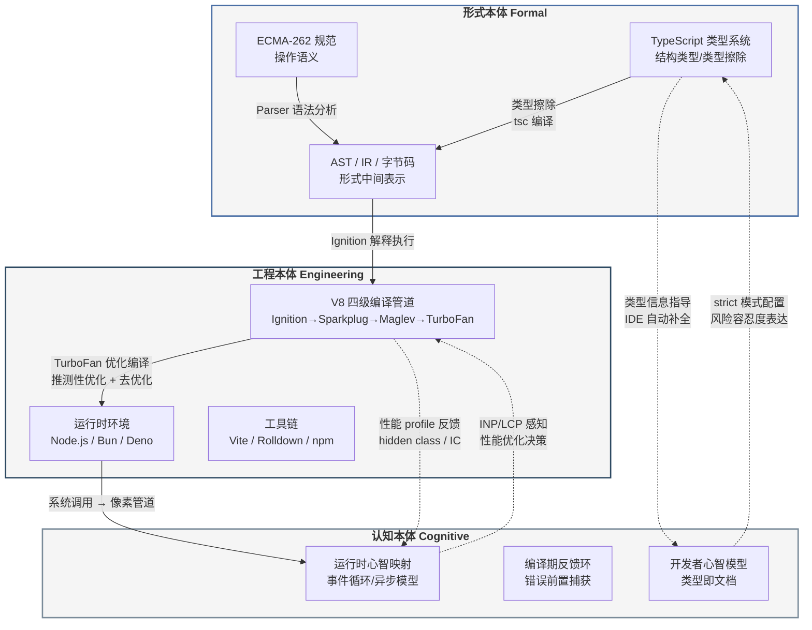
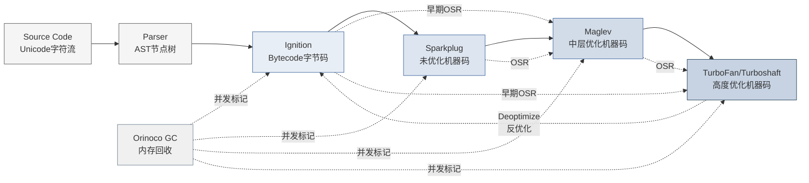
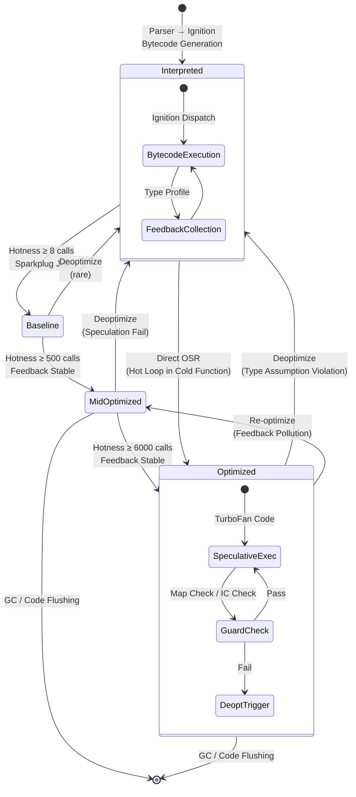
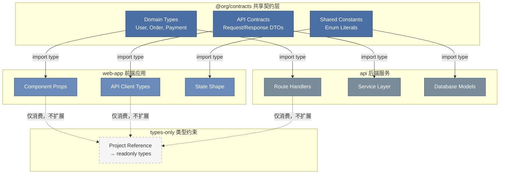
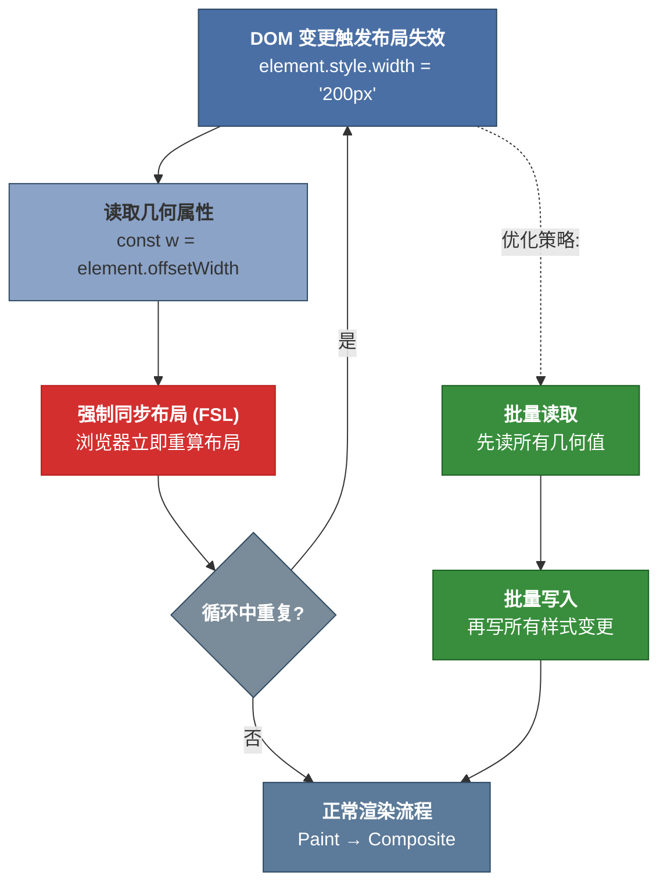
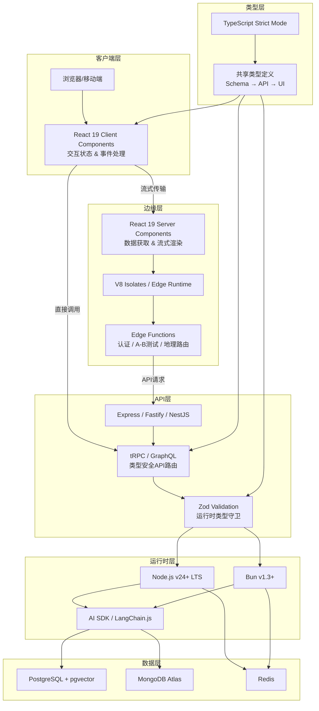
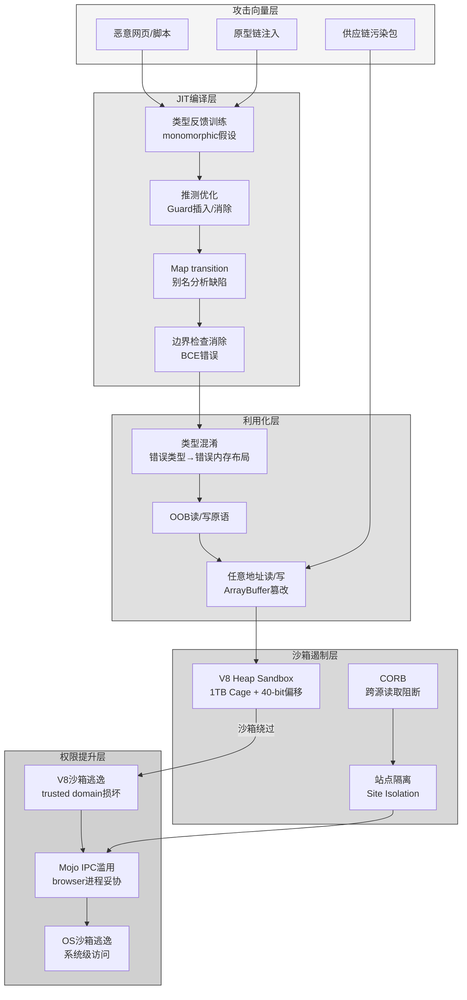
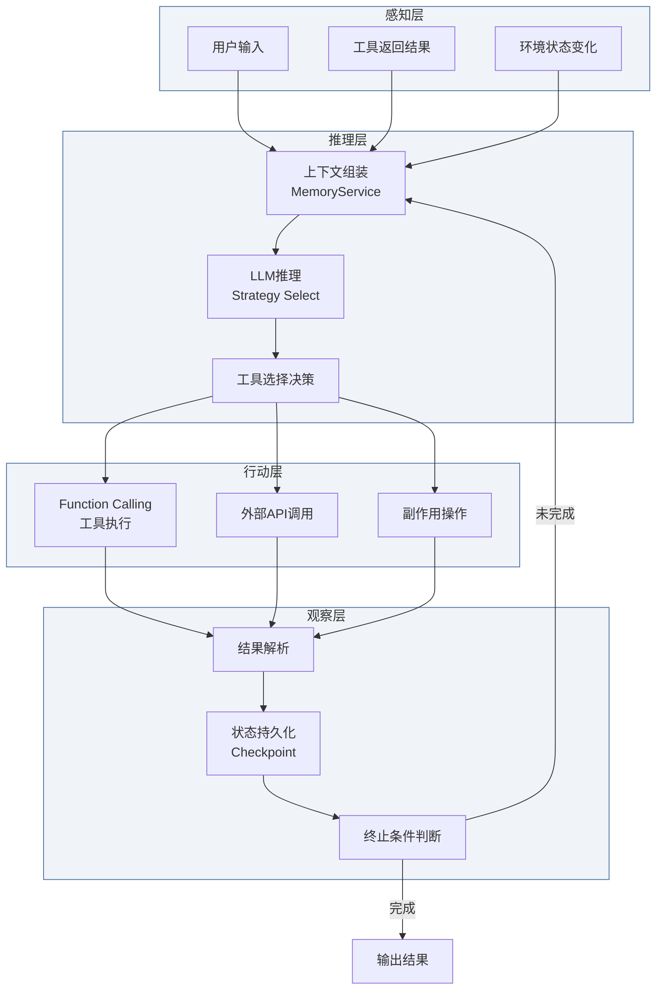

## 1. 总论：形式本体与工程实在的三重统一

TypeScript/JavaScript（TS/JS）软件堆栈在全球拥有约2,800万活跃开发者 ^1^，其生态横跨前端框架、服务端运行时、构建工具链与类型系统等数十个技术领域。然而，这一堆栈长期被碎片化的工具叙事所遮蔽——开发者熟知 React 组件的生命周期，却很少追问 JSX 语法糖如何通过 Parser 转化为 AST 节点；了解 TypeScript 的 `strict` 模式能捕获空值错误，却很少反思类型系统作为"认知接口"在人与机器之间承担的桥梁功能。本章的任务是从哲学本体论（Ontology）高度建立全书的分析框架，将 TS/JS 堆栈重新框架化为**形式系统（Formal System）— 物理实现（Physical Implementation）— 交互界面（Interactive Interface）**三重本体的统一体，并在此基础上绘制后续九章的论证版图。

### 1.1 论证框架与方法论声明

#### 1.1.1 形式层→工程层→感知层的三层递进模型

任何软件堆栈都内嵌一条从数学抽象到物理现实的转化链。对于 TS/JS 而言，这一链条可表述为：

$$\text{源码} \rightarrow \text{AST} \rightarrow \text{字节码} \rightarrow \text{机器码} \rightarrow \text{系统调用} \rightarrow \text{像素}$$

这一转化律构成全书分析的主轴。**形式层（Formal Layer）**对应转化链的前半段：ECMA-262 规范以形式化语义定义 JavaScript 的语法与执行模型 ^2^，TypeScript 的类型系统在此基础上叠加静态约束，二者共同构成可严格推理的数学结构。**工程层（Engineering Layer）**对应转化链的中段：V8 引擎的四级编译管道（Ignition → Sparkplug → Maglev → TurboFan）将形式产物转化为可执行机器码 ^3^，Node.js/Bun/Deno 等运行时通过事件循环与系统调用衔接操作系统资源。**感知层（Perceptual Layer）**对应转化链的末端：浏览器像素管道将计算结果渲染为 60fps 视觉界面，开发者通过 LCP（Largest Contentful Paint）与 INP（Interaction to Next Paint）等指标感知系统性能。

三层模型并非简单的线性流水线，而是存在双向反馈：感知层的性能瓶颈（如 INP > 200ms）可能反向驱动工程层的算法优化，工程层的实现约束（如 V8 的 hidden class 机制）又深刻影响形式层的语言设计决策。这种跨层耦合正是 TS/JS 堆栈演化的核心动力。

#### 1.1.2 技术论证型与学术综述型的双轨方法论

本书采用双轨方法论：**技术论证型**写作确保每个工程论断都有可复现的定量基础——V8 的 JIT 编译阈值、TypeScript 类型检查耗时、运行时 HTTP 吞吐量等数据均来自官方 benchmark 或独立第三方测试；**学术综述型**写作则为这些技术事实提供理论纵深，将 hidden class 优化归入"推测性优化"（speculative optimization）的编译理论传统，将类型擦除（type erasure）与 Gradual Typing 的学术脉络相衔接。

双轨方法的方法论意义在于：纯粹的工程罗列会因缺乏抽象框架而沦为工具手册，纯粹的理论推演则会因脱离实现细节而丧失对架构师的指导价值。本书的每章均在"形式—工程—认知"三层模型中找到锚点，确保哲学抽象与工程实践形成实质性结合。

#### 1.1.3 阅读路径导引

全书十章面向三类核心受众。**架构师**应重点关注第1-3章（本体论框架与形式语义）、第6章（全栈架构模式）与第9章（批判综合），这些章节提供技术选型的底层逻辑与长期演化判断。**技术领导者**可优先阅读第4章（运行时生态竞争格局）、第7章（安全本体论）与第8章（AI融合），以获取团队决策与资源投入的数据支撑。**高级研发工程师**则可在第2章（V8 引擎深度解析）、第5章（渲染管道性能优化）与第10章（哲科定位）中找到直接影响日常工程实践的技术细节与认知升级路径。各章之间的依赖关系在 1.3.1 节的九域映射表中明确标注。

### 1.2 三重本体统一的核心命题

#### 1.2.1 语言本体（形式语义）—— ECMAScript 规范的完备性与不完备性

ECMA-262 第 16 版（ECMAScript 2025）于 2025 年 6 月正式发布 ^2^，标志着这门语言在标准化轨道上连续第 9 年保持年度迭代节奏。该规范以操作语义（operational semantics）的形式化风格定义了 JavaScript 的完整执行模型——从词法分析到抽象语法树（AST）构造，从执行上下文（execution context）到环境记录（environment record），每一步都有严格的算法步骤编号。这种形式化程度使 ECMAScript 成为工业界少有的"可被数学家阅读"的编程语言规范。

然而，ECMA-262 的形式系统存在结构性不完备性。规范的第 5 章明确定义了若干实现定义行为（implementation-defined behaviour）与未定义行为（undefined behaviour），例如 `Array.prototype.sort` 的具体算法选择、浮点数精度边界条件、以及宿主环境（host environment）提供的 I/O 语义。这些"形式裂缝"恰恰构成了不同运行时差异化竞争的合法空间——V8 与 JavaScriptCore 可以在 sort 算法上做出不同优化选择，Node.js 与 Deno 可以在文件系统权限模型上采取不同策略。TypeScript 的类型系统在此扮演了"形式化补丁"的角色：通过为动态 JavaScript 添加静态类型约束，TS 将大量运行时错误前移至编译期捕获。2025 年 3 月发布的 TypeScript 5.8 进一步引入 `--erasableSyntaxOnly` 标志，使 TypeScript 代码可直接在 Node.js 中运行而无需显式 transpilation ^4^，这标志着形式层与工程层的边界正在重新划定。

#### 1.2.2 工具本体（编译/运行时）—— V8、TypeScript 编译器、打包工具链的协同演化

工具本体是形式语义向物理计算资源的转化中介。在 V8 引擎中，这一转化呈现为四级渐进编译架构：Ignition 解释器快速生成字节码并收集类型反馈，Sparkplug 基线编译器消除解释开销，Maglev 中层编译器（2023 年引入）在编译速度与优化深度之间取得平衡，TurboFan 顶层编译器则为热点代码生成全优化机器码 ^3^。这一管道的核心洞见是**推测性优化**——基于历史类型假设生成特化代码，在假设失效时通过去优化（deoptimization）安全回退至解释执行。Hidden class 机制将动态属性访问转化为固定偏移内存读取，inline caching 将多态调用点（polymorphic call site）的查找成本摊平至 O(1) ^3^。

TypeScript 编译器则承担另一维度的形式转化：将带有类型注解的 TypeScript 源码转化为纯 JavaScript，同时执行静态类型检查。值得注意的是，TS 编译器本身不参与运行时优化——类型信息在编译后被完全擦除（type erasure），运行时执行的是不含类型痕迹的 JavaScript。这一设计决策使 TypeScript 获得了"零运行时开销"的优良特性，但也意味着类型安全仅在编译期成立，无法防御运行时的类型混淆攻击。

在打包工具链维度，2025-2026 年的生态呈现清晰的代际更替：Vite 以 98% 的开发者满意度取代 Webpack 成为事实标准，基于 Rust 的 Rolldown 从 1% 跃升至 10% 使用率 ^5^，工具链的性能瓶颈正从 JavaScript 实现转向原生代码实现。这一趋势的本质是将形式转化中的计算密集型阶段（模块图构建、树摇优化、代码分割）从工程层的高抽象层级下沉至更接近物理硬件的实现层级。

#### 1.2.3 认知本体（开发者心智模型）—— 类型系统作为连接人脑与机器执行的认知脚手架与认知接口

认知本体关注三重统一中最容易被忽视却最具实践影响力的维度：开发者如何通过心智模型（mental model）理解并操控整个技术堆栈。类型系统在此承担核心接口功能——它将程序的不变量（invariant）从运行时的隐式假设提升为编译期的显式契约，使开发者能够在代码编写阶段而非调试阶段发现错误。

GitHub Octoverse 2025 报告的数据揭示了这一认知转变的规模：TypeScript 以 263.6 万月活跃贡献者首次超越 Python 成为 GitHub 上使用最广泛的语言，年同比增长 66% ^6^。State of JavaScript 2025 调查显示，40% 的受访者现在完全使用 TypeScript 编写代码，较 2024 年的 34% 与 2022 年的 28% 持续攀升 ^5^。这一转变的深层驱动力在于，类型系统不仅捕获错误——它构成了一套可执行的领域知识表示。在超过 200k LOC 的代码库中，`strict: true` 的配置决策本质上是团队风险容忍度的形式化表达，`@ts-ignore` 与 `@ts-expect-error` 的选用差异反映了"已知例外"与"未知压制"之间的认识论分野。

认知本体的另一关键维度是运行时选择对开发者心智模型的塑造。Node.js 的事件循环模型（event loop）已内化为 JavaScript 开发者的默认并发范式；Deno 的权限沙盒模型要求开发者显式声明每个模块的文件系统与网络访问权限，将安全考量从"事后审计"前移至"开发时决策"；Bun 的 Zig 核心与内建打包器则试图将工具链的复杂度从开发者心智中卸载。这三种运行时代表了不同的"认知经济学"假设——Node.js 信任生态成熟度，Deno 信任显式约束，Bun 信任工具整合。

#### 1.2.4 核心发现概览：五大定理与"权衡的艺术"

基于上述三重本体框架，全书将展开五个形式化定理与三重核心洞察。**五大定理**构成技术分析的主干：JIT 三态转化定理（Ch2）揭示 V8 引擎从解释执行到优化编译的动态平衡机制；类型模块化定理（Ch3）证明类型共享失控必然导致架构完整性腐蚀；运行时收敛定理（Ch4）论证 Node.js/Bun/Deno 的竞争驱动整体进化而非零和替代；合成优先定理（Ch5）确立 `transform`/`opacity` 路径作为流畅动画的唯一可靠策略；JIT 安全张力定理（Ch7）揭示激进推测优化使类型混淆成为结构性安全风险而非实现缺陷。**三重洞察**则提供认识论升华：TypeScript 类型系统的"实用主义形式化"定位（Ch3）、类型系统作为团队"认知脚手架"的组织政策功能（Ch3/Ch6）、以及 TS/JS 堆栈成功的本质——动态性与静态检查、启动速度与长期性能、开发效率与运行效率之间**多重权衡的艺术**（Ch9/Ch10）。这一论证版图覆盖了从形式语义到像素管道、从认知经济学到安全本体论的全谱系分析。

### 1.3 论证版图全景

#### 1.3.1 九域映射总览表

全书十章围绕九个分析域展开，各域之间的关联矩阵如下表所示。形式本体论域与类型认识论域构成分析的基础层，运行时生态、渲染管道与全栈架构三域构成工程实现层，安全本体论与 AI 融合两域对应新兴交叉领域，批判综合与哲科定位两域提供元层反思。读者可依据自身角色选择性深入——架构师建议优先关注标记为"核心"的交叉节点，技术领导者建议关注标记为"决策"的交叉节点，高级研发工程师建议关注标记为"实现"的交叉节点。

| 分析域 | 核心关切 | 关联域（强度） | 受众重点 | 关键数据锚点 |
|:---|:---|:---|:---|:---|
| 形式本体论 | ECMA-262 规范的形式语义与实现不完备性 | 类型认识论（核心）、运行时生态（核心）、安全本体论（强） | 架构师 | ES2024/2025 年度特性 ^2^|
| 类型认识论 | 类型系统作为认知接口与知识表示 | 形式本体论（核心）、全栈架构（强）、AI 融合（强） | 架构师/技术领导者 | TS 78% 专业采用率 ^7^|
| 运行时生态 | Node/Bun/Deno 三体竞争与 WinterTC 标准化 | 形式本体论（核心）、安全本体论（强）、全栈架构（核心） | 技术领导者 | Node 24/Bun 2.0/Deno 3.0 ^8^|
| 渲染管道 | 像素管道的性能优化与 60fps 约束 | 全栈架构（强）、运行时生态（实现） | 高级研发工程师 | 帧预算 16.6ms，可用 ≈10ms |
| 全栈架构 | 从客户端到服务端的统一类型与部署模型 | 类型认识论（核心）、运行时生态（核心）、AI 融合（决策） | 架构师/技术领导者 | RSC、SSR、边缘部署 |
| 安全本体论 | JIT 推测优化引入的结构性安全风险 | 形式本体论（强）、运行时生态（核心）、批判综合（强） | 技术领导者 | 5 类 CVE 模式（OOB/竞态/混淆） |
| AI 融合 | AI 辅助开发对类型系统与工具链的重塑 | 类型认识论（核心）、全栈架构（决策）、哲科定位（强） | 技术领导者/架构师 | MCP SDK v1.27、AI 原生 API |
| 批判综合 | 多重权衡（动态性/静态性、速度/性能、效率/安全） | 安全本体论（强）、哲科定位（核心）、形式本体论（强） | 全体受众 | "权衡的艺术"五大张力 |
| 哲科定位 | TS/JS 堆栈在计算机科学史与软件工程哲学中的位置 | 形式本体论（核心）、AI 融合（强）、批判综合（核心） | 架构师 | "实用主义形式化"定位 |

九域之间的关联模式揭示了几个关键结构特征。首先，**形式本体论—类型认识论—运行时生态**构成一个紧密耦合的三角核心：ECMA-262 规范的形式不完备性为运行时差异化提供空间，TypeScript 的类型系统部分填补这些裂缝，而运行时的实现选择又反过来约束类型系统的有效表达范围。其次，**AI 融合**作为新兴域，其与类型认识论的强关联（AI 辅助代码生成高度依赖类型约束来减少歧义）预示着 2025-2026 年技术演进的重要方向——GitHub 报告指出，TypeScript 的崛起部分归因于"AI 辅助开发在更严格的类型系统中表现更可靠" ^6^。第三，**安全本体论**通过 JIT 安全张力定理与形式本体论和运行时生态形成深层联结：V8 的性能优势来源于激进推测优化，而这些优化本身使竞态条件与内存安全错误成为结构性风险而非实现缺陷。

#### 1.3.2 2026 时效性锚定

本书的分析时效性以 2025 年 6 月至 2026 年 4 月为基准窗口，具体边界如下。

**语言规范层**：ECMAScript 2024（第 15 版，2024 年 6 月发布）引入了 `ArrayBuffer` 原地 resize/transfer、`RegExp` `/v` 标志、`Promise.withResolvers`、`Object.groupBy` 与 `Map.groupBy` 等特性；ECMAScript 2025（第 16 版，2025 年 6 月发布）进一步引入 Iterator helpers（`map`/`filter`/`take`/`drop` 等 12 个方法）、Set 集合运算（`union`/`intersection`/`difference`/`symmetricDifference` 及子集/超集/不相交判断）、JSON modules with import attributes、`Promise.try` 与 `Float16Array` ^2^ ^9^ ^10^。TypeScript 版本覆盖 5.7（2024 年 11 月）至 5.8（2025 年 3 月），重点特性包括 `--erasableSyntaxOnly` 标志支持 Node.js 直接执行、条件返回类型的改进类型推断、以及 `--module nodenext` 下 ESM/CJS 互操作的增强 ^4^ ^11^。

**运行时层**：Node.js v24 LTS（2025 年 10 月发布）实现原生 TypeScript 类型剥离（stable）、改进的权限模型与 超过200万个活跃包生态；Bun v2.0（2026 年 1 月稳定版）达到 99.7% Node.js API 兼容性，内置 bundler/test runner/package manager，基于 Zig 核心实现 2-4 倍 HTTP 吞吐优势；Deno v3.0（2026 年 3 月发布）内置 KV 存储、95%+ npm 兼容性与 Deno Deploy 边缘部署能力 ^8^。更根本的标准化进展是 WinterCG 于 2025 年 1 月升格为 Ecma TC55（WinterTC），致力于定义非浏览器 JavaScript 运行时的最小公共 Web API 标准 ^12^ ^13^，这标志着运行时生态从竞争走向收敛的历史性转折。

**引擎与工具链层**：V8 引擎采用四级编译管道（Ignition/Sparkplug/Maglev/TurboFan），Turboshaft 项目正基于 CFG-based IR 逐步替代 TurboFan 的 Sea of Nodes 后端 ^3^。打包工具链中 Vite 占据主导地位（84% 使用率，98% 满意度），Rolldown 作为 Rust 实现的 Rollup 替代方案快速上升 ^5^。React 19 的 Server Components 架构已稳定，Next.js 15 以 59% 使用率保持元框架领先地位 ^5^。

以下 Mermaid 图表述了三重本体之间的核心关系与转化路径：



该概念图揭示了 TS/JS 堆栈的核心结构张力。形式本体与工程本体之间的转化是单向的（实线箭头）：源码经解析、类型擦除、编译、优化最终转化为可执行机器码。然而认知本体与前两者之间存在双向反馈（虚线箭头）：开发者的心智模型指导类型系统的使用模式（如 `strict` 模式的配置决策），而编译器和运行时的反馈信息（类型错误、性能 profile、运行时指标）又持续重塑开发者的心智模型。这种双向反馈环是 TS/JS 生态能够快速演化的关键机制——与其他静态语言不同，JavaScript 的开发者社区同时参与形式语义（TC39 提案）、工程实现（V8 贡献、运行时开发）和认知实践（框架设计、编码规范）三个层面的共同演化，形成了一个独特的"实用主义形式化"技术传统。后续九章将在此框架下，逐层展开对这一堆栈的深度技术论证。


---


## 2. 语言本体论层：从ECMAScript到机器码的形式转化

形式语言的理论核心在于：给定一套有限的符号集合与重写规则，如何推导出无限的语义行为。ECMAScript作为一门被工业界广泛部署的动态语言，其从文本源码到物理机器码的转化链条，构成了当代Web软件堆栈中最复杂的形式转化系统之一。本章以公理化方法为起点，追踪ECMAScript规范的三层形式结构，经V8引擎的四阶段编译管道，最终建立JIT（Just-In-Time）三态转化定理的完整形式化表述。公理化基础中的三条公理——动态性公理、超集公理与宿主依赖公理——已在总论中确立^14^；本章的任务是论证从形式规范到工程实现的转化链条如何在V8引擎中被完整实例化。

### 2.1 ECMAScript规范的形式结构

ECMA-262规范并非传统意义上的"用户手册"，而是一部形式语义学文献。其结构严格对应形式语言的三个经典层次：词法层（Lexical Grammar）、句法层（Syntactic Grammar）与语义层（Semantics）。这种分层并非仅出于文档组织的便利，而是反映了从字符流到执行行为的严格形式映射。

#### 2.1.1 语法层——词法/句法/语义三层次的形式定义与BNF表示

规范的第11-12章定义了Lexical Grammar，以Unicode code point为原子符号，通过上下文无关文法将字符流组织为token序列。其表示采用BNF（Backus-Naur Form）的变体，使用`:::`符号区分词法产生式。例如，`IdentifierName`的产生式严格排除了保留字，但通过`IdentifierName`与`ReservedWord`的交集操作实现了上下文敏感性——这一设计使得词法分析器无需回溯即可正确处理类似`let`的上下文关键字^15^。

句法层（Syntactic Grammar）采用标准BNF表示（`::`产生式），定义了从token序列到语法树的合法映射。规范将这些产生式分为两类：早期错误（Early Errors）在解析阶段即可检测，如`"Lexical declaration redeclares a prior variable"`；运行时错误则在执行阶段触发。这种二元划分直接对应V8 Parser中的错误检测策略：早期错误在AST构建阶段即被捕获并抛出`SyntaxError`，而运行时错误则延迟至Ignition执行阶段^3^。

值得关注的是，ECMA-262的语法定义中嵌入了一套类型化的元变量系统。产生式中的非终结符携带显式类型标注，如`BindingIdentifier:Identifier`中的`Identifier`指向词法层定义的token类型，而`BindingPattern:ObjectBindingPattern`则递归引用句法层的结构化类型。这种内嵌类型系统在Parser中的实现体现为AST节点的C++类层次结构——每个Parse Node对应一个具体的AST节点类型，其字段类型直接映射规范中的Record Field定义^15^。

#### 2.1.2 语义层——抽象操作、记录字段、内部槽的形式语义机制

规范的语义层是其形式化程度最高的部分。第5-7章定义了三大核心语义机制：Abstract Operations、Specification Types与Internal Methods/Slots。

**Abstract Operations**（抽象操作）是规范中形式化的函数定义。每个抽象操作具有明确的参数类型（标注为"an ECMAScript language value"或"a Completion Record"）、前置条件与步骤化执行体。例如，`ToNumber(argument)`操作在规范中被定义为一个确定性算法，其输出完全由输入类型决定^14^。在V8的实现中，这些抽象操作对应CSA（CodeStubAssembler）编写的内置例程——CSA以平台无关的方式表达底层操作，经编译后成为可共享的机器码桩（stub）。

**Specification Types**（规范类型）是语义层的数据结构。`Record`类型是具有命名字段的异构结构，如Property Descriptor Record包含`[[Value]]`、`[[Writable]]`、`[[Get]]`、`[[Set]]`、`[[Enumerable]]`和`[[Configurable]]`六个可选字段^16^。`Completion Record`类型则是规范执行模型的核心——每个语句和表达式的求值结果都被包装为一个包含`[[Type]]`（normal/return/throw/break/continue）、`[[Value]]`与`[[Target]]`字段的Record，从而实现异常控制流的形式化处理。

**Internal Slots**（内部槽）是对象状态的不可见字段。规范通过双括号表示法`[[SlotName]]`区分内部状态与可访问属性。例如，每个函数对象携带`[[Environment]]`、`[[FormalParameters]]`、`[[ECMAScriptCode]]`等内部槽，这些槽在JavaScript层面不可访问，但决定函数的闭包行为与执行语义^14^。V8中，内部槽以C++对象字段的形式实现，其内存布局遵循Hidden Class的偏移映射。

#### 2.1.3 执行上下文的形式模型——Environment Record、Realm、Agent的形式化定义

执行上下文（Execution Context）是ECMAScript形式语义中最精密的构造。规范第9章定义了Environment Record的四种特化类型——Declarative、Object、Function与Global——每种类型实现`HasBinding`、`CreateMutableBinding`、`InitializeBinding`与`SetMutableBinding`等抽象操作^16^。Environment Record通过`[[OuterEnv]]`字段形成链式作用域结构，这一链式结构在V8中以`Context`对象的链表实现，每个Context对象指向其外层Context的指针。

**Realm**（领域）是ECMAScript的全局环境抽象。每个Realm Record包含独立的内建对象集合（`%Object%`、`%Array%`等）、全局对象与全局Environment Record。iframe、Worker和VM模块各自拥有独立Realm，保证了全局命名空间的隔离。在V8实现中，Realm对应`NativeContext`对象，其创建开销是iframe性能瓶颈的结构性来源之一。

**Agent**（代理）与**Agent Cluster**（代理集群）规范化了并发模型。每个Agent对应一个执行线程，拥有独立的执行上下文栈与任务队列；Agent Cluster则通过`SharedArrayBuffer`实现跨Agent的内存共享，并定义了`happens-before`关系的偏序约束。这一形式模型是ECMAScript内存模型（Memory Model）的基础，直接对应V8的`Isolate`概念——每个Isolate是一个独立的引擎实例，其堆内存与其他Isolate完全隔离^14^。

### 2.2 V8引擎四阶段管道：形式转化的工程实现

V8引擎是ECMA-262规范的物理实现者，其执行管道将规范的形式定义转化为可执行的机器指令。当前V8（v12.x / Chrome 120+）采用四级编译架构：Ignition（解释器）→ Sparkplug（基线JIT）→ Maglev（中层优化器）→ TurboFan（顶层优化器），配合Orinoco垃圾收集器构成完整的执行系统^3^。



**图2-1：V8四阶段编译管道与状态转化流程。** Parser将源码转化为AST；Ignition生成字节码并收集类型反馈；Sparkplug将字节码直译为机器码消除解释开销；Maglev进行轻量推测优化；TurboFan执行激进优化。去优化（Deoptimization）机制在假设失效时安全回退至Ignition。Orinoco垃圾收集器与各级编译器并发协作。

#### 2.2.1 解析阶段（Parser）——从源码到AST的形式化转换与早期错误检测

Parser是形式转化的第一个关卡。V8采用手写的递归下降解析器，而非通用的LALR/LR工具生成。这一设计选择的技术理由是：ECMAScript语法并非严格的上下文无关文法（如`yield`和`await`的上下文敏感性、自动分号插入ASI的回退机制），需要解析器携带状态信息处理歧义^17^。

解析过程分为扫描器（Scanner）与解析器（Parser）两级。扫描器执行词法分析，将Unicode字符流转化为token序列，同时处理行延续（Line Continuation）、模板字符串字面量（Template Literal）的嵌套扫描等特殊情形。解析器接收token序列，递归构建AST。V8的AST节点类型与ECMA-262规范中的Parse Node一一对应，每个节点携带源码位置信息（用于错误报告与调试映射）和语义属性。

早期错误检测在Parser中完成。规范定义的早期错误包括：重复参数名（严格模式下）、`break`/`continue`的目标标签存在性验证、词法声明的重复绑定检查等。这些检测在AST构建过程中同步执行，一旦触发即抛出`SyntaxError`，函数不会被分配任何编译资源^3^。V8还实现了预解析（Pre-parsing）机制：对于立即不会执行的函数体（如回调函数声明），Parser仅构建其外层签名而不解析内部语句，直到首次调用时才进行完整解析——这一惰性策略将启动时的解析开销降低了30%-50%。

#### 2.2.2 Ignition字节码解释器——基于寄存器的字节码设计与内存效率权衡

Ignition是V8的执行入口层，其设计目标是在最小启动延迟的前提下收集类型反馈。Ignition采用**基于寄存器的字节码架构**——与JVM的栈式字节码不同，Ignition定义了一组虚拟寄存器（映射到栈槽或实际寄存器），操作数直接引用寄存器而非通过栈操作传递^17^。这一设计减少了指令数量（栈式架构的`push`/`pop`指令被消除），并更好地对齐了物理CPU的寄存器-操作数模型。

字节码生成器（BytecodeGenerator）将AST转化为线性字节码序列，同时创建Feedback Vector——一个与函数绑定的类型反馈数组。每个字节码指令在Feedback Vector中拥有对应的槽位，运行时由Ignition填充观察到的类型信息。例如，属性访问指令`LdaNamedProperty`的反馈槽记录了被访问对象所携带的Hidden Class（Map）标识符与属性偏移量；算术指令`Add`的反馈槽记录了操作数的类型组合（Smi+Smi、Number+Number、String+任意等）^18^。

Ignition的内存效率优势体现在指针压缩（Pointer Compression）环境中。自V8 8.0（2020年）起，64位构建默认启用指针压缩，将堆指针压缩至32位表示。在此环境下，Smi（Small Integer）为31位有符号整数（范围约±10.7亿），Feedback Vector的每个槽位仅需4字节存储^3^。Ignition在Speedometer基准测试中的执行性能约为Sparkplug的71%，即Sparkplug比Ignition快约41%——但Ignition的内存占用仅为Sparkplug生成代码的1/3至1/5^4^。

#### 2.2.3 TurboFan优化编译器——Sea of Nodes IR、推测优化与去优化回退机制

TurboFan是V8性能的核心来源。其设计哲学是**推测性优化**（Speculative Optimization）：基于Ignition收集的类型反馈，假设代码的未来行为将与历史行为一致，据此生成高度特化的机器码^3^。

TurboFan历史上基于**Sea of Nodes（SoN）** IR——一种将程序表示为操作节点与依赖边（数据依赖、控制依赖、效果依赖）的图结构。SoN中，无副作用的纯操作节点可以自由"浮动"至最优调度位置，理论上能实现全局最优的代码布局^19^。然而，V8团队在2023年后的实践中发现，JavaScript的几乎每个操作都可能是效应性的（属性访问可触发getter，运算符可调用`valueOf()`），导致大多数节点被约束在效果链上，SoN的理论优势在实际中难以兑现^20^。

**Turboshaft**迁移（Chrome 120+）是对此问题的工程回应。Turboshaft以传统的CFG（Control-Flow Graph）IR替代SoN，将节点组织为基本块，使用显式控制流边代替隐式效果链。实践数据表明：Turboshaft的编译时间约为SoN后端的50%，L1缓存缺失次数降低3-7倍，且生成的代码质量持平或更优^21^。2025年3月，V8团队宣布Turboshaft已完全接管TurboFan的JavaScript后端与整个WebAssembly编译管道，标志着SoN架构的十年实验正式终结^20^。

TurboFan的优化能力涵盖：类型特化算术（`Int32Add`替代通用`Add`）、内联属性访问（Map检查+偏移量直接加载）、函数内联、逃逸分析（将不逃逸对象分配在栈上）、循环不变代码外提与死代码消除。这些激进优化的安全性由**去优化机制**保证：当运行时的类型假设失效（如向优化为整数的函数传入字符串），V8触发去优化，将执行状态从优化代码回退至Ignition字节码。去优化的技术核心是**帧翻译**（Frame Translation）——TurboFan在编译时预生成优化帧布局到解释器帧布局的映射，运行时通过`FrameDescription`结构序列化寄存器状态，再按预生成映射重建解释器帧，确保在精确的字节码偏移处恢复执行^3^。单次去优化的性能代价为2x至20x的减速，取决于函数复杂度；但真正的代价是反馈污染——反复去优化的函数可能永远无法再次达到TurboFan，长期滞留于Maglev甚至Sparkplug层级。

#### 2.2.4 Maglev中层编译器（2023+）——快速生成优质代码的新层与三编译器策略的权衡

Maglev于Chrome M117（2023年9月）引入，填补了Sparkplug与TurboFan之间的编译鸿沟^4^。在Maglev之前，TurboFan约1ms的编译成本意味着函数需要数千次调用才能摊薄优化开销；对于仅执行数百次的"温热"函数，这一阈值过高。Maglev的编译速度约为TurboFan的10倍（~100μs），生成的代码速度约为Sparkplug的2倍——其哲学是"足够好的代码，足够快的编译"^22^。

Maglev采用SSA（Static Single Assignment）形式的CFG IR，而非TurboFan的SoN。这一选择使得编译流程大幅简化：无需复杂的图调度算法，线性控制流对人类可读且可调试，传统编译器教材的优化技术可直接应用^18^。Maglev执行的优化包括：基于反馈的类型特化、数字表示选择（将Smi/HeapNumber拆箱为寄存器中的原始整数/浮点数）、有限度的函数内联。但它跳过TurboFan级别的循环展开、逃逸分析与高级载荷消除——这些是TurboFan的专属领域。

Maglev的工程效果已通过多个维度验证。V8团队发布的Chrome 117基准测试数据显示：JetStream 2提升8.2%，Speedometer 2提升6%；更引人注目的是能耗改善——Speedometer运行能耗降低10%，JetStream能耗降低3.5%^4^。这一能耗优化源于CPU在高效Maglev代码中等待TurboFan编译的时间缩短，以及总体CPU占用率的下降。

**三编译器策略的权衡**可概括为：Sparkplug以最低成本消除解释器分发开销（~10μs编译），适合短生命周期函数；Maglev在编译成本与代码质量间取得平衡（~100μs编译），是大多数温热函数的最佳归宿；TurboFan以最高成本追求极致性能（~1000μs编译），仅服务于真正热点的计算密集型路径。这一平滑的性能梯度替代了Ignition-TurboFan时代的"性能悬崖"，使V8的吞吐量曲线更接近理论最优。

| 编译层级 | 形式产物 | 编译时间 | 执行速度up | 升级触发条件 | 核心IR架构 | 推测优化 |
|---------|---------|---------|-----------|------------|-----------|---------|
| Ignition | Bytecode | ~50μs | 1.0×（基准） | 首次执行 | 字节码序列 | 无 |
| Sparkplug | 未优化机器码 | ~10μs | ~1.4× | ~8次调用 | 无（直译模板） | 无 |
| Maglev | 中层优化机器码 | ~100μs | ~2.5× | ~500次调用 | SSA CFG | 轻度（类型特化） |
| TurboFan | 高度优化机器码 | ~1000μs | ~5.0× | ~6000次调用 | CFG（Turboshaft） | 激进（全优化套件） |

**表2-1：V8四级编译系统对比。** 数据综合自V8官方博客与基准测试报告^4^ ^3^ ^22^。编译时间列表示单次函数编译的典型量级；执行速度up列以Ignition为基准（1.0×）；升级触发条件列表示从当前层级晋升至下一层级所需的热度阈值。Maglev的引入将原有三级的"陡峭"梯度平滑为四级渐进梯度，消除了Ignition→TurboFan时代的性能悬崖。

上表的工程含义在于：四级编译系统构成了一个帕累托前沿（Pareto Frontier），在编译延迟与执行性能两个维度上提供了四个最优权衡点。对于仅执行一次的初始化代码，Ignition的50μs编译成本是最优选择；对于执行数十次的事件处理器，Sparkplug的10μs编译成本与1.4x速度提升已足够；对于执行数百次的框架代码，Maglev的2.5x加速 worth 100μs的编译投入；对于执行数千次的核心算法，TurboFan的5x加速 justify 1000μs的编译开销。这一分层策略使得V8能在同一程序中同时满足16.6ms帧预算（60fps）的启动延迟要求与长期运行的峰值性能目标。

### 2.3 JIT三态转化模型

基于前三节建立的形式结构与工程实现，本节提出JIT三态转化定理及其支撑机制。该定理描述了JavaScript代码在执行过程中的三种状态——解释态（Interpreted State）、编译态（Compiled State）与反优化态（Deoptimized State）——之间的动态转化规律。



**图2-2：JIT三态转化状态机。** 解释态（Interpreted）对应Ignition字节码执行；编译态细分为基线编译（Baseline=Sparkplug）、中层优化（MidOptimized=Maglev）与顶层优化（Optimized=TurboFan）三个子态；反优化态（Deoptimized）是任何编译态向解释态的回退。状态转化由热度计数器（Hotness Counter）与类型反馈稳定性共同驱动。

#### 2.3.1 解释态→编译态→反优化态的状态机模型与转化触发条件

JIT三态转化定理的形式表述如下：

**定理1（JIT三态转化定理）**。设函数$f$在执行过程中处于状态$S \in \{\text{Interpreted}, \text{Compiled}_i, \text{Deoptimized}\}$，其中$\text{Compiled}_i$表示第$i$级编译状态（$i \in \{1,2,3\}$分别对应Sparkplug、Maglev、TurboFan）。状态转化遵循以下规则：

**(T1.1 单调升级律)** 从$\text{Interpreted}$到$\text{Compiled}_i$的升级是单调的——一旦进入$\text{Compiled}_i$，$f$不会自发回退到$\text{Compiled}_{i-1}$，除非经过$\text{Deoptimized}$中转。

**(T1.2 反馈稳定条件)** 进入$\text{Compiled}_i$的必要条件是Feedback Vector在观察窗口$W_i$内的类型分布熵低于阈值$H_i$。具体而言，Ignition收集的类型反馈在约500次调用窗口内保持单态（Monomorphic）或有限多态（Polymorphic，≤4种形状），方可触发Maglev编译；TurboFan要求约6000次调用窗口内反馈分布稳定^3^ ^18^。

**(T1.3 反优化触发律)** 从$\text{Compiled}_i$到$\text{Deoptimized}$的转化由以下三类事件触发：(a) 运行时的Map Check失败——访问的对象Hidden Class与编译时的假设不匹配；(b) 全局对象原型链被修改，使依赖的内联缓存失效；(c) 算术溢出——如Smi加法结果超出31位表示范围。反优化发生后，$f$回退至$\text{Interpreted}$状态，Feedback Vector被更新以反映新观察到的类型，重新进入升级周期。

**(T1.4 收敛性保证)** 若$f$的输入类型分布在有限时间内稳定（即存在时间$T$使得$t>T$后类型分布不再变化），则$f$在有限次反优化后终将收敛至某一$\text{Compiled}_i$状态并长期驻留。

这一定理的工程价值在于：它为JavaScript性能调优提供了形式化指导。开发者通过保持对象结构的稳定性（避免运行时动态增删属性）和类型的一致性（避免同一变量在不同调用点接收不同类型），可确保代码快速收敛至高级编译态，从而最大化长期执行性能。

#### 2.3.2 隐藏类（Hidden Class）与内联缓存（IC）的形状驱动优化原理

Hidden Class（在V8源码中称为Map）是V8对象模型的核心创新。当对象以相同顺序初始化相同属性时，V8为其分配共享的Hidden Class，将属性名映射至固定的内存偏移量^23^。例如：

```javascript
function Point(x, y) { this.x = x; this.y = y; }
var p1 = new Point(1, 2);  // Hidden Class: Map0 → {x@offset12, y@offset20}
var p2 = new Point(3, 4);  // 共享Map0
```

在此场景中，`p1.x`和`p2.x`的访问被编译为单条机器指令——`mov rax, [obj + 12]`——完全消除了哈希查找开销。Hidden Class通过**转换链**（Transition Chain）管理对象结构的演化：当向对象添加新属性时，V8创建从当前Hidden Class到新Hidden Class的转换边，后续以相同顺序初始化的对象将复用这条链^23^。

Inline Caching（IC）将Hidden Class的偏移信息缓存到代码中。每个属性访问站点维护一个IC槽，记录该站点历史上观察到的Hidden Class及其对应的属性偏移。IC的演化经历三个阶段^24^：

- **单态（Monomorphic）**：站点仅观察到一种Hidden Class。编译器生成最优代码：`if (map == expected_map) load [obj + offset] else deopt`。此状态下属性访问等价于C结构体字段访问。
- **多态（Polymorphic）**：站点观察到2-4种Hidden Class。编译器生成线性检查链：`if (map == M1) load [obj + o1] else if (map == M2) load [obj + o2] else ...`。性能仍优于哈希查找，但随形状数量线性衰减。
- **巨态（Megamorphic）**：站点观察到5种以上Hidden Class。编译器放弃优化，回退至通用属性查找路径（字典查找或原型链遍历）。

性能差异的量级是惊人的。基准测试表明，在100万次属性访问循环中，单态IC的完成时间约为8ms，而多态IC（两种交替形状）的完成时间约为450ms——性能差距达56倍^24^。这一数据量化了"形状稳定性"对JavaScript性能的决定性影响，也解释了为什么构造函数中属性初始化顺序的一致性远比代码风格的考量更为根本。

#### 2.3.3 JIT三态转化五定理：形式转化中的不变量、完备性边界与工程近似

在定理1的基础上，本节建立更精细的五定理体系，刻画JIT编译系统的形式属性。

**(T2 类型反馈完备性定理)** Ignition收集的类型反馈在理论上是不完备的——它仅记录了已执行路径上的类型信息，未执行的分支（如`if`的`else`路径）的类型信息为空。这意味着TurboFan对未执行分支的优化是盲目的：若热路径假设`x`始终为整数，但冷路径中存在`x`为字符串的情形，TurboFan将生成在冷路径上触发反优化的代码。这一不完备性是JIT编译器结构性特征，而非实现缺陷。

**(T3 去优化正确性定理)** 去优化机制保证了推测优化的**语义不变性**——无论去优化发生多少次，执行结果始终与纯粹解释执行一致。形式化表述：设$\llbracket f \rrbracket_{\text{opt}}$为编译优化后的函数语义，$\llbracket f \rrbracket_{\text{ign}}$为Ignition解释执行的语义，则对于所有输入$x$，$\llbracket f \rrbracket_{\text{opt}}(x) = \llbracket f \rrbracket_{\text{ign}}(x)$。该等式成立的前提是V8的帧翻译机制能完整恢复解释器状态——TurboFan编译时为每个去优化点生成`Translation`数组，记录寄存器值到字节码变量的映射关系，确保反优化后的恢复点与假设失败点精确对应^3^。

**(T4 编译层帕累托最优定理)** 四级编译系统（Ignition、Sparkplug、Maglev、TurboFan）在（编译时间，执行速度）二维空间上构成帕累托前沿——不存在一个假想的编译层级能在两个维度上同时优于现有层级。Maglev的引入正是为了填补Sparkplug（10μs，1.4x）与TurboFan（1000μs，5.0x）之间的前沿空白，其在（100μs，2.5x）坐标点上扩展了帕累托集^4^。

**(T5 内存-速度权衡定理)** V8的执行系统存在一个全局的内存-速度权衡曲面。Ignition的字节码最为紧凑（函数体约占其AST节点数的2-3倍字节），但执行最慢；TurboFan生成的机器码最快，但代码体积约为字节码的5-10倍。Orinoco垃圾收集器的存在进一步复杂化了这一权衡：优化代码的执行速度提升减少了活跃对象的存活时间（GC压力降低），但编译过程中生成的中间表示（IR图、SSA形式）显著增加了短期内存分配^3^。

**(T6 收敛时间下界定理)** 对于具有$k$个不同执行路径（控制流分歧点）的函数，从首次执行到收敛至稳定编译态的最坏时间复杂度为$\Omega(k \cdot \max(W_i))$，其中$W_i$是第$i$级编译的观察窗口大小。这是因为每条路径都需要独立收集类型反馈，且编译器仅在反馈稳定后才敢生成优化代码。在实践中，$k$受限于函数的cyclomatic复杂度，而现代前端框架的组件渲染函数通常具有较低的$k$值（<10），这也是React/Vue在V8上表现优异的结构原因。

### 2.4 形式层到工程层的断裂与弥合

ECMA-262规范作为形式系统，不可避免地存在未完全定义的行为区间。规范第5章明确区分了三类不确定性：**实现定义行为**（Implementation-Defined Behavior，规范指定了行为集合，由实现选择其一）、**未指定行为**（Unspecified Behavior，规范未约束行为，实现可自由选择）与**未定义行为**（Undefined Behavior，无任何语义保证，如越界访问内部槽）。本节分析这些断裂点在三大引擎中的工程处理策略。

#### 2.4.1 规范未定义行为的工程处理策略——实现定义、未指定、未定义行为的三级分类

**实现定义行为**在ECMA-262中数量庞大。例如，`Array.prototype.sort`的排序算法未指定——V8采用Timsort（归并排序与插入排序的混合），SpiderMonkey采用归并排序，JavaScriptCore采用快速排序与插入排序的混合。对于相同比较函数，三种引擎可能产生不同的元素重排顺序，但均符合规范约束^16^。又如，`Date`对象的字符串表示格式、本地时区处理、正则表达式的回溯策略等均属实现定义范畴。

V8的处理策略是**确定性选择加严格自洽**——对于每个实现定义点，V8在源码中做出明确选择（如Timsort），并在所有平台（x64、ARM64、MIPS）上保持一致行为。这一策略确保了跨平台的JavaScript语义一致性，但也意味着开发者无法依赖引擎特定的优化特性（如依赖V8 Timsort稳定性的代码在JSC上可能失效）。

**未指定行为**的典型实例是属性枚举顺序。ES2015之前，规范未规定`for...in`循环和`Object.keys`的枚举顺序；ES2015引入了部分确定性规则（整数键按升序、字符串键按插入顺序），但原型链继承属性的枚举顺序仍留有余地。V8在实现中采用插入顺序加整数键优先的策略，SpiderMonkey和JSC各自遵循类似但不完全一致的规则^16^。

**未定义行为**在ECMA-262中极为罕见，因为规范几乎为所有操作定义了明确结果（即便结果是抛出异常）。真正的未定义行为出现在与宿主环境的交互边界——如`eval`在严格模式与非严格模式下的差异作用域、`with`语句的变量解析歧义等。V8通过静态分析检测潜在未定义模式，并在Parser阶段发出早期错误或运行时警告。

#### 2.4.2 引擎差异矩阵：V8、SpiderMonkey、JavaScriptCore的形式实现偏差对比表

| 维度 | V8 (Chrome/Node.js) | SpiderMonkey (Firefox) | JavaScriptCore (Safari/Bun) |
|------|---------------------|----------------------|---------------------------|
| **编译层级数** | 4层：Ignition→Sparkplug→Maglev→TurboFan ^3^| 3层：Interpreter→Baseline JIT→Warp ^25^| 4层：LLInt→Baseline JIT→DFG→FTL ^26^|
| **解释器类型** | 基于寄存器的字节码解释器 | 基于IC加速的解释器 | 基于offlineasm的低级解释器 ^26^|
| **顶层IR架构** | CFG（Turboshaft，SoN已弃用）^20^| Warp专用IR（IonMonkey后继） | DFG SSA + B3/AIR后端 ^27^|
| **中层编译器** | Maglev（2023，~10x TurboFan编译速度）^4^| Baseline JIT（非优化） | DFG JIT（中等优化）^28^|
| **Hidden Class等价物** | Map（属性偏移映射） | Shape（等效机制） | Structure（等效机制） ^23^|
| **IC多态上限** | 4种形状（Megamorphic阈值） ^3^| 类似阈值（stub chain上限） ^29^| 类似阈值（有限多态内联） |
| **GC架构** | Orinoco：分代+并行Scavenge+并发标记 ^8^| 并发标记（Grey Rooting）+分代 | Riptide并发GC +分代 ^30^|
| **内存优化重点** | 峰值吞吐量优先（较高内存占用） | 平衡型 | 移动设备能效优先（低内存占用） ^31^|
| **ECMAScript特性** | 快速跟进新特性 | 早期实现，标准合规优先 | 跟随Safari发布节奏 ^32^|
| **基准测试优势** | JetStream/Speedometer计算密集型 | DOM操作密集型 | 图形渲染/动画密集型 ^33^|
| **关键安全机制** | V8 Sandbox（2022+，指针压缩） | W^X +沙箱隔离 | 平台代码签名+W^X ^34^|
| **编译代码能耗** | Maglev引入后-10%（Speedometer）^4^| 未公开独立数据 | 针对Apple Silicon优化 |

**表2-2：三大JavaScript引擎形式实现偏差矩阵。** 数据综合自各引擎官方文档、基准测试报告与安全分析文献^3^ ^4^ ^25^ ^26^ ^8^。编译层级数反映从源码到优化代码的转化深度；IR架构决定优化能力的理论上限；Hidden Class等价物与IC机制决定属性访问性能的共同基础；GC架构影响长时间运行的内存行为。

上表揭示了一个深层结构：尽管三大引擎均采用多层级JIT、Hidden Class/IC优化与分代GC的共同范式，但它们在工程优先级上形成了明确的分化。V8的架构演进始终围绕"吞吐量最大化"展开——从Full-codegen+Crankshaft到Ignition+TurboFan，再到四层级管道，每一步都是为了在单位时间内执行更多JavaScript操作。这一优先级与Chrome的定位（通用计算平台）和Node.js的服务器端需求高度一致。SpiderMonkey的三层结构更为紧凑，其Warp编译器直接内联IC链进行特化编译^25^，体现了Mozilla在标准合规与性能间的平衡取向——Firefox作为开放平台浏览器，对新ECMAScript特性的早期支持是其差异化策略。JavaScriptCore的四层结构（LLInt→Baseline→DFG→FTL）在层级数量上与V8相当，但DFG到FTL的跨度更为激进：DFG的触发阈值约为1000次调用，而FTL的触发阈值高达100,000次调用^28^——这一宽间隔反映了Apple对移动设备能效的优先考量，避免频繁的高成本编译消耗电池。

这些差异的实质是同一形式规范（ECMA-262）在不同工程约束下的多元实现。对于TypeScript/JavaScript开发者而言，这意味着代码的性能特征具有宿主依赖性：在V8上表现优异的Hidden Class稳定模式在JSC上同样有效（因为Structure机制等效），但具体的性能数字和优化触发时机存在差异。因此，跨引擎性能优化应以保持形状稳定性和类型一致性为核心策略——这些原则在所有现代引擎中都是普适的——而将引擎特定的微调留给基准测试后的针对性迭代。形式层到工程层的断裂并非规范的缺陷，而是工程实在多样性的必然反映；而Hidden Class、IC和多级JIT作为共同范式的存在，又保证了这种多样性始终被约束在可预测的性能模型之内。


---


## 3. 类型系统的认识论功能：TS作为认知脚手架

类型系统的传统定义将其视为编译期错误检测工具——一种在程序运行前捕获类型不匹配缺陷的静态分析机制。然而，在超过200k LOC的大规模代码库中，TypeScript的类型系统已超越这一工具性角色，升维为组织层面的结构化约束语言与风险治理机制^35^。`strict: true`的启用与否不再仅是技术选型，而是团队对形式正确性与交付速度之间权衡边界的组织政策表达。本章从形式语义学、认知心理学与软件工程经济学三个维度，论证TypeScript类型系统如何作为"认知脚手架"（cognitive scaffolding）重塑开发者的心智模型与架构决策。

### 3.1 类型即约束：形式语义视角

#### 3.1.1 Curry-Howard对应在TS中的工程映射

Curry-Howard对应（Curry-Howard correspondence）建立了形式逻辑与类型系统之间的深层同构关系：命题对应类型，证明对应程序，证明简化对应程序求值^36^。在这一框架下，编写类型正确的代码等价于构造逻辑证明。合取（conjunction）对应积类型（product type/tuples），析取（disjunction）对应和类型（sum type/unions），蕴涵（implication）对应函数类型（function type）^37^。

TypeScript的类型系统虽未追求完全的逻辑一致性（soundness），却在工程实践中实现了Curry-Howard对应的可操作版本。以安全除法为例，开发者可定义 branded type `NonZeroNumber = number & { readonly __nonZero__: unique symbol }`，使`divide(a: number, b: NonZeroNumber): number`的类型签名直接编码了"给定非零除数$b$，除法$a/b$有定义"这一数学命题^35^。`makeNonZeroNumber`运行时检查函数充当证明构造器——只有通过该函数的数值才能获得`NonZeroNumber`类型，从而在编译期消除除零错误。这种"以类型编码不变量"（encoding invariants in types）的实践，将类型系统从被动检查器转化为活性约束声明语言。

在TypeScript的类型层级中，条件类型（conditional types）进一步扩展了这一定理体系。`T extends U ? X : Y`的结构直接对应逻辑蕴涵判断——当类型`T`可赋值给`U`时，类型系统选择分支`X`，否则选择`Y`。模板字面量类型（template literal types）则将字符串操作纳入类型层面的逻辑推理，使得CSS属性名、路由路径等字符串模式能够在编译期得到验证。

#### 3.1.2 结构类型vs名义类型的认识论差异

类型等价性的判定策略构成了类型系统的认识论基础。TypeScript采用结构类型（structural typing）系统：两个类型当且仅当它们的成员结构匹配时被视为等价，与声明位置或类型名称无关^38^。Java、Rust、Haskell等语言则采用名义类型（nominal typing）系统，类型等价性取决于显式声明的继承关系或类型名称^39^。

| 维度 | TypeScript | Java | Rust | Haskell |
|:-----|:-----------|:-----|:-----|:--------|
| **类型擦除** | 是（编译后类型信息完全消失） | 否（泛型信息通过TypeToken保留） | 否（monomorphization生成特化代码） | 否（字典传递保留类型字典） |
| **渐变类型** | 原生支持（`any`/`unknown`/`never`三元组） | 不支持（需`Object`或泛型变通） | 不支持（静态类型全覆盖） | 不支持（需`Dynamic`扩展） |
| **结构类型** | 核心机制（duck typing的静态形式） | 否（接口实现需显式`implements`） | 否（trait实现需显式声明） | 否（record字段匹配仍为名义） |
| **类型推断** | 中等（上下文敏感+控制流分析） | 弱（局部变量类型推断仅限`var`） | 强（Hindley-Milner扩展） | 极强（完整HM推断） |
| **运行时检查** | 无（类型擦除后无类型信息） | JVM字节码验证+反射类型检查 | LLVM编译期+所有权运行时检查 | 无（纯编译期，运行时无类型） |
| **与宿主互操作** | 原生（JS/TS无缝互操作） | 需JNI/JNA桥接 | 需FFI或WASM | 需FFI绑定 |
| **一致性(soundness)** | 故意 unsound（为互操作性妥协） | Sound（泛型存在类型擦除例外） | Sound（所有权系统保证内存安全） | Sound（类型系统逻辑一致） |

*数据来源：各语言官方文档及类型系统理论文献 ^40^ ^38^ ^39^*

上表揭示了TypeScript类型系统的独特定位：它是主流静态类型语言中唯一同时采纳类型擦除、渐变类型和结构类型三元组的设计。这种组合使TS占据了一个"实用主义形式化"的中间地带——在不完全牺牲JavaScript动态性的前提下，引入最大程度的静态保证^35^。与Haskell追求逻辑完备性（soundness + completeness）不同，TS明确接受unsoundness以换取与动态生态的无缝互操作。与Rust通过所有权系统实现内存安全的形式化证明不同，TS将安全验证的部分责任让渡给运行时（如通过Zod等schema验证库）。这一设计选择并非技术缺陷，而是对JavaScript生态"渐进增强"哲学认识论立场的直接映射。


*图注：雷达图展示TypeScript、Java、Rust、Haskell在六个类型系统维度的能力轮廓（1=最小能力，5=最大能力）。TypeScript在渐变类型、结构类型与互操作性维度具有显著优势，在运行时安全维度因类型擦除而得分最低。该对比表明，不存在 universally superior 的类型系统——各语言的设计选择反映了其对目标领域的认识论假设：TypeScript假设世界本质上是动态的、渐进可知的；Rust假设内存安全必须静态可证；Haskell假设逻辑一致性优先于工程便利。*

结构类型系统在认识论上反映了一种"外延等同"（extensional equivalence）的哲学立场：两个对象的认知等价性取决于其可观察属性（成员结构）而非其本质归属（类型名称）。这与名义类型系统的"内涵等同"（intensional equivalence）立场形成对照——在名义系统中，`Person`与`Employee`即使结构完全相同也互不为子类型，除非显式声明继承关系^41^。对于JavaScript这种以对象字面量为主要数据构造方式的生态，结构类型提供了更为自然的匹配方式，但也引入了重构风险：重命名接口字段`name`为`id`时，结构系统不会在框架代码中报错，仅在客户端代码的使用位置暴露不匹配^41^。

#### 3.1.3 TS类型层次的形式结构

TypeScript的类型系统呈现为层次化的形式结构，从基础原子类型逐层递进到元级类型操作：

| 层级 | 类型类别 | 代表构造 | 认识论功能 | 示例 |
|:-----|:---------|:---------|:-----------|:-----|
| L0 原子类型 | 原始类型 | `string`, `number`, `boolean`, `null`, `undefined`, `symbol`, `bigint` | 不可再分的基础断言 | `const s: string = "hello"` |
| L1 复合类型 | 对象/数组/元组 | `{name: string}`, `T[]`, `[string, number]` | 原子类型的笛卡尔积 | `type Point = [number, number]` |
| L2 集合操作 | 联合/交叉类型 | `A \| B`, `A & B` | 类型的布尔代数运算 | `type ID = string \| number` |
| L3 受限原子 | 字面量类型 | `"success"`, `42`, `true` | 值级别的精确断言 | `type Status = "ok" \| "err"` |
| L4 类型抽象 | 泛型/映射类型 | `T<K>`, `{[K in T]: V}` | 类型级别的参数化与迭代 | `type Partial<T> = {[K in keyof T]?: T[K]}` |
| L5 条件推理 | 条件/推断类型 | `T extends U ? X : Y`, `infer K` | 类型层面的蕴涵判断 | `type Return<T> = T extends (...args: any[]) => infer R ? R : never` |
| L6 字符串演算 | 模板字面量类型 | `` `hello ${T}` `` | 字符串模式的编译期验证 | `type EventName<T> =`on${Capitalize<T>}` `` |
| L7 递归构造 | 递归条件类型 | 自引用类型定义 | 不定型数据结构的归纳定义 | `type DeepReadonly<T> = {readonly [K in keyof T]: DeepReadonly<T[K]>}` |
| L8 顶层/底层 | `unknown`/`never` | 全类型的超集/子集 | 知识谱系的两极锚定 | `type SafeParse<T> = {ok: true, data: T} \| {ok: false, error: never}` |

这一层级结构展示了TypeScript类型系统的"自举"（bootstrapping）特征：高阶类型构造完全由低阶类型构造组合而成，无需元级扩展。从L0原子类型出发，通过积类型（L1）与和类型（L2）的组合形成ADT（algebraic data types），再经由字面量类型（L3）实现值级别的精细化断言，最终通过条件类型（L5）与模板字面量类型（L6）达到图灵完备的类型元编程能力^42^。

### 3.2 TS作为认知脚手架：开发者心智模型的结构化

#### 3.2.1 脚手架理论的编程语言映射

维果茨基（Lev Vygotsky）的社会文化认知发展理论提出"最近发展区"（Zone of Proximal Development, ZPD）概念——学习发生在外部支持刚好弥补学习者当前能力与潜在能力之间差距的区域^32^。脚手架（scaffolding）作为这一理论的核心隐喻，指代由更有经验的他者（more knowledgeable other）提供的临时性支持结构，随着学习者能力提升而逐步撤除。

将此理论映射至编程语言领域，TypeScript的类型系统充当了"更有知识的他者"角色：在编码过程中实时提供类型约束反馈，充当外部认知支架。在开发者的ZPD中——即已掌握的JavaScript语义知识和尚欠缺的系统性架构推理能力之间的区域——类型系统通过以下机制提供脚手架支持：

- **即时反馈循环**：编译器错误信息充当"认知校准信号"，将抽象的类型不匹配转化为具体的修正方向
- **渐进撤销机制**：随着开发者对领域模型的理解加深，显式类型标注逐步被类型推断替代，脚手架从"密集型"（everywhere annotation）过渡到"稀疏型"（boundary-only annotation）
- **社会中介功能**：在团队协作中，类型签名成为知识传递的媒介——函数的类型声明即其契约规范，新成员可通过阅读类型定义而非实现代码来理解系统边界

在Monorepo架构中，这种脚手架效应获得了组织层面的扩展。通过Project References将包边界形式化，`@org/contracts`包承载共享领域契约，`web-app`与`api`包分别消费这些类型而不允许深层跨包导入^41^。类型系统在此成为架构边界的显式化工具——**定理2（类型模块化定理）**断言：当类型共享失控时，架构完整性必然腐蚀。类型的模块化不是可选优化，而是大规模系统中保持结构一致性的必要条件。



*图注：Monorepo中类型依赖图示意。共享契约层（@org/contracts）通过类型导入向前后端服务传递领域模型，Project References机制形式化包边界约束，禁止深层跨包导入。此架构使类型成为知识治理的基础设施——领域模型的变更必须通过契约层的版本化变更传播，而非隐式穿透。*

#### 3.2.2 类型推断作为认知减负机制

显式类型标注的认知成本遵循公式 $C_{total} = C_{write} + C_{read} + C_{maintain}$，其中$C_{write}$为编写类型标注的时间成本，$C_{read}$为阅读者解析标注的心智负荷，$C_{maintain}$为类型随代码演化而更新的维护成本。TypeScript的类型推断引擎通过上下文敏感分析（contextual typing）与控制流分析（control flow analysis）显著降低了这一总成本。

以数组方法链式调用为例：

```typescript
const result = items
  .filter(item => item.active)      // 推断: Item[] → Item[]
  .map(item => item.name)           // 推断: Item[] → string[]
  .filter(name => name.length > 0); // 推断: string[] → string[]
```

在此链式操作中，开发者无需为任何中间步骤编写类型标注，类型推断引擎从初始上下文（`items: Item[]`）出发，沿调用链传播类型约束，最终推导出`result: string[]`。这并非简单的语法便利——它减少了工作记忆中的类型追踪负担，使开发者能将认知资源集中于业务逻辑而非类型簿记。

然而，类型推断的减负效果存在边际递减。当泛型嵌套深度超过三层、或条件类型涉及多个`infer`提取点时，推断结果的透明度急剧下降。此时，显式标注反而成为认知减负手段——它为后续阅读者提供了"认知锚点"，避免其必须在脑中展开类型推断的完整推导链。

#### 3.2.3 渐进类型化的认识论意义

TypeScript的渐变类型（gradual typing）系统通过`any`、`unknown`、`never`三种特殊类型构建了一个"知识确定性谱系"：

- **`any`** —— 认识论上的"无约束断言"：表示"我对此值的类型一无所知，也不施加任何约束"。它是类型系统的"退出舱口"（escape hatch），允许绕过所有类型检查。在200k+ LOC代码库中，`any`的分布密度是衡量团队知识不确定性的量化指标。
- **`unknown`** —— 认识论上的"有约束无知"：表示"我尚不知道此值的具体类型，但我知道在明确其类型之前不能对其进行任何操作"。`unknown`要求显式的类型收窄（type narrowing）后才能使用，将"未知"从隐性风险转化为显式处理义务。
- **`never`** —— 认识论上的"不可能"：表示"此位置不可达"。它在穷尽性检查（exhaustiveness checking）中充当证明工具——当switch语句的各分支已覆盖联合类型的所有成员时，默认分支中的值类型即为`never`，编译器据此验证匹配的完备性。

这一三元组映射了软件工程中对不确定性的三种治理姿态：`any`代表"不确定性被压制"（知识债务），`unknown`代表"不确定性被显式管理"（知识风险），`never`代表"通过形式化证明消除不确定性"（知识安全）。`@ts-ignore`与`@ts-expect-error`指令的认识论差异与此同构：前者是"未知压制"——开发者不知道为何类型错误，只是强行绕过；后者是"已知例外"——开发者明确预期此处会产生类型错误，并在错误未发生时获得通知^35^。在严格模式下，`@ts-expect-error`要求注释必须对应实际错误，否则自身报错，这一机制将类型系统的脚手架功能从"被动纠错"升级为"主动确认预期"。

### 3.3 类型系统的工程张力

#### 3.3.1 表达力与可判定性的权衡

TypeScript的类型系统被证明是图灵完备的（Turing complete）^42^。通过递归条件类型与类型级算术，开发者可在类型系统中编码Collatz猜想等不可判定问题——这意味着不存在通用算法能在有限时间内判定所有TypeScript类型的兼容性^43^。这一性质将类型检查器置于形式系统的经典三元张力之中：在"完全性"（completeness）、"一致性"（soundness）与"可判定性"（decidability）三者中，至多只能同时满足两项^43^。

TypeScript选择了**放弃一致性以保表达力与工程实用性**的设计路径。与Coq或Idris等依赖类型语言不同，TS不追求逻辑完备性——它允许`any`类型的渗透、接受特定场景下的类型收窄unsoundness（如数组协变性），以换取与JavaScript动态现实的兼容性^35^。这一选择的工程合理性在于：TypeScript的目标是"在错误发生前捕获尽可能多的错误"，而非"证明程序完全正确"。

图灵完备性的直接工程后果是类型检查时间的非有界性。对于极端复杂的类型体操（如深度嵌套的递归条件类型或大规模联合类型的分布式条件展开），编译器可能在类型推导中"卡住"，产生显著的构建延迟。TypeScript团队通过设置递归深度限制（默认约50层）与实例化深度限制来缓解这一问题，但这本质上是以人为截断替代形式化可判定性——工程师在编写复杂类型时，必须直觉地感知"类型计算复杂度"的边界。

#### 3.3.2 类型体操的边界：实用推导vs元编程过度

"类型体操"（type gymnastics）指利用TypeScript类型系统的图灵完备性进行元级编程的实践——在类型层面实现字符串操作、算术运算、集合论操作乃至图灵机等计算模型。这一能力的实用价值在于：它使高级类型工具库（如`utility-types`、`type-fest`）能够封装复杂的类型推导逻辑，为终端开发者提供声明式的类型操作接口。

然而，类型体操存在明确的"实用性边界"。当单个类型定义超过50行、涉及超过三层的条件类型嵌套、或使用`infer`进行多次类型提取时，类型的"可读性密度"（每行类型定义所传达的语义信息）急剧下降，从"自文档化契约"退化为"需要逆向工程的类型程序"。此时，类型系统的脚手架功能发生逆转——它不再是认知减负工具，而成为认知负荷来源。

反模式识别的关键指标包括：

- **推导结果不透明**：鼠标悬停于变量上时，IDE展开的类型提示超过十行且包含多个未展开的别名
- **错误信息失真**：类型不匹配错误指向递归条件类型的某一层展开，而非用户代码中的实际赋值点
- **编译时间异常**：单文件类型检查时间超过项目平均值的五倍以上
- **变更传播不可控**：修改基础类型定义导致远端无关代码的类型错误雪崩

识别这些信号后，工程团队应果断将类型级别的计算下沉至运行时——用普通函数替代条件类型推导，以牺牲编译期保证的广度来换取代码的可维护性。

#### 3.3.3 类型覆盖率的认知经济学

追求100%类型覆盖率（type coverage）是一个边际收益递减的工程目标。设$E$为类型安全带来的错误预防收益，$C$为类型标注与维护的认知成本，则类型覆盖率的净收益函数为 $NB(p) = E(p) - C(p)$，其中$p \in [0, 1]$为类型覆盖率。经验观察表明，$E(p)$呈对数增长——从0%提升到80%的覆盖率捕获了绝大多数类型相关缺陷，而从95%提升到100%的收益急剧收窄；而$C(p)$在接近100%时呈超线性增长——最后5%的覆盖率往往需要为最边缘的库绑定、动态构造对象和遗留代码编写复杂的类型适配层。

在组织决策层面，"类型覆盖率目标"应被视为风险偏好参数而非技术指标。金融、医疗等高风险领域可能要求`strict: true`配合100%覆盖率；而追求快速迭代的初创产品可能接受85%覆盖率配合运行时schema验证的"混合安全模型"。这种差异化的类型治理策略，将类型系统从"一刀切的技术约束"重新定位为"可调节的认知工具"。

### 3.4 类型系统的演化前沿（2026）

#### 3.4.1 TS 5.x新特性对认知模型的影响

TypeScript 5.x系列的演进体现了从"类型系统能力扩展"向"开发者体验优化"的战略重心转移^6^。三项关键特性重塑了类型系统与开发者的交互模式：

**`satisfies`运算符（TS 4.9引入，5.x系列推广）**：该运算符验证表达式满足给定类型约束的同时保留表达式的原始推断类型^44^。其认识论意义在于实现了"约束确认"与"类型保持"的分离——开发者可声明"此对象满足接口形状"而不牺牲字面量类型的精确性。此前，这一需求只能通过类型注解（会拓宽字面量类型）或类型断言（绕过检查）实现，二者分别损失了精确性与安全性。`satisfies`的加入使类型系统从"非此即彼"的二元选择走向"双重确认"的精细控制，降低了开发者在"安全性vs精确性"权衡中的决策成本。

**`using`声明与显式资源管理（TS 5.2）**：基于TC39 Stage 3提案，`using`声明通过`Symbol.dispose`/`Symbol.asyncDispose`机制实现资源生命周期的自动管理^1^。其认知功能在于将"资源释放义务"从开发者的显式记忆（"记得在finally中关闭连接"）转化为编译器自动生成的确定性清理代码。这一特性将类型系统的关注点从"值的形状"扩展到"值的寿命"，使类型脚手架覆盖资源管理这一传统上属于运行时关切的责任域^34^。

**`NoInfer<T>`工具类型（TS 5.4）与推断类型谓词（TS 5.5）**：`NoInfer<T>`阻止特定位置参与类型推断的泛型参数传播，解决了"推断过度泛化"导致的类型精度损失问题^6^。推断类型谓词则使类型守卫函数（type guard）的返回类型可被编译器自动推断，减少冗余的类型谓词标注。这两项改进共同指向同一方向：类型推断引擎正变得更加"认知敏感"——它能更精确地推断开发者意图，减少需要显式干预的类型标注场景。

#### 3.4.2 类型系统与运行时验证的桥接策略

TypeScript的类型擦除（type erasure）机制是其认识论架构的关键约束：所有类型信息在编译后消失，运行时无法访问`typeof x === 'User'`意义上的类型信息。这一设计保证了零运行时开销，但也制造了"编译期安全"与"运行时验证"之间的鸿沟——当数据跨越系统边界（API响应、用户输入、外部配置）时，TypeScript无法保证运行时值符合其静态类型声明。

Schema验证库作为类型系统的"运行时互补层"填补了这一鸿沟。Zod通过`z.object({...}).parse(data)`模式实现"一次定义，双重验证"——schema同时作为运行时验证器与TypeScript类型定义（通过`z.infer<typeof Schema>`）^45^。Valibot以模块化设计进一步将验证逻辑的树摇后体积压缩至1.23kB（gzip），较Zod的13kB减少约90%^46^。这一数量级的差异在边缘计算与移动Web场景中具有显著的资源经济学意义。

| 库 | 体积(gzip) | 类型推断 | 树摇支持 | 编译性能(复杂schema) | 主要优势 |
|:---|:-----------|:---------|:---------|:---------------------|:---------|
| Zod | ~13 kB | `z.infer` | 部分 | 281ms(router编译) | 生态成熟，tRPC原生集成 |
| Valibot | ~1.23 kB | `v.InferInput`/`v.InferOutput` | 完全 | 未公开 | 极致体积优化 |
| TypeBox | ~38 kB | `Static<T>` | 是 | 38ms(router编译) | JSON Schema对齐，编译期性能 |
| Superstruct | ~11 kB | 推断支持 | 是 | 42ms(router编译) | 错误消息定制 |

*数据来源：各库官方文档与第三方基准测试 ^46^ ^47^*

上表数据揭示了一个关键权衡：编译期类型检查性能与运行时验证功能之间存在张力。Zod在复杂schema场景下的TypeScript编译时间（281ms）显著高于TypeBox（38ms）与Superstruct（42ms）^47^，这源于Zod的类型推断链深度——其schema定义需要编译器展开多层泛型以推导出精确类型。对于大型API路由定义，这一成本可能累积为可观的构建延迟。

2026年的工程最佳实践正趋向"分层验证架构"：编译期使用TypeScript类型系统捕获内部模块间的契约违反；系统边界处使用Valibot或Zod进行运行时schema验证；关键业务路径采用"类型+单元测试"的双重确认。这一分层策略的认知经济学在于：将"形式证明"（高成本、高可信度）集中于内部核心领域模型，将"经验验证"（低成本、中等可信度）部署于外部边界——实现认知资源在软件系统各层的最优配置。

Schema验证库与TypeScript类型的协同关系，最终完成了本章论证的闭环：类型系统不仅是编译器的错误检测器，更是一个从编译期延伸至运行时的**认知基础设施**——它结构化开发者的心智模型（脚手架理论），编码领域知识的形式约束（Curry-Howard对应），并在组织层面治理不确定性（渐进类型化的知识谱系）。在2026年的TS/JS堆栈中，类型系统的认识论功能已与其工具性功能同等重要——它是软件架构中知识的形式化载体。


---


## 4. 运行时生态：执行环境的多维展开（2026）

JavaScript运行时在2026年进入完全成熟期。Node.js、Bun、Deno三者形成了技术特性互补、应用场景分化的"三体"结构——这一格局并非零和竞争，Node.js v24+已系统性采纳竞争对手的先进特性，从原生TypeScript执行到权限模型的引入，生态竞争驱动整体进化^48^。与此同时，边缘计算场景催生了基于V8 Isolates的轻量级执行模型，JavaScript正从"浏览器脚本语言"进化为跨越数据中心到网络边缘的通用计算运行时。

### 4.1 运行时三体格局

#### 4.1.1 浏览器运行时——Blink/V8、Gecko/SpiderMonkey、WebKit/JavaScriptCore的技术栈映射

浏览器端的JavaScript运行时构成了服务器端的技术源头。2026年，三大引擎维持稳定分工：Blink/V8（Chrome/Edge）以激进的JIT编译策略领先，其Maglev与TurboFan双层架构提供接近原生的执行效率；Gecko/SpiderMonkey（Firefox）在标准合规性上保持优势；WebKit/JavaScriptCore（Safari）以低内存占用和快速启动著称——这一特性直接影响了Bun选择JavaScriptCore作为其引擎的决策^49^。浏览器运行时的技术演进通过Web API标准持续向服务器端渗透，Fetch API、Streams、WebCrypto等标准的普及使"浏览器兼容"成为服务器端运行时评估的重要维度。Bun和Deno自始即将完整Web API标准实现作为核心设计目标，Node.js则经历了从"自定义API优先"到"标准API补全"的渐进过程^50^。

#### 4.1.2 Node.js运行时——Libuv事件循环、V8绑定、原生模块系统的架构稳定性与演化

Node.js于2025年10月发布v24 LTS版本（代号"Krypton"），延续了近十五年的核心架构——Libuv事件循环调度异步I/O，V8引擎执行JavaScript，npm作为全球最大的包注册中心已突破200万包^51^。根据2025年Stack Overflow调查，Node.js以48.7%的全球开发者使用率稳居Web框架首位^51^。v24引入多项关键进化：V8升级至v13.6，npm 11将安装速度提升约65%，内置权限模型从Deno安全模型中汲取了设计灵感，原生TypeScript类型剥离支持零开销直接执行`.ts`文件^48^。Node.js的核心竞争力在于深度生态系统集成与企业级运维成熟度——Chrome DevTools集成、成熟APM支持（Datadog、New Relic、Sentry）、以及7年以上的LTS安全审计记录，构成了替代运行时短期内难以复制的运维护城河^48^。

#### 4.1.3 替代运行时的崛起——Deno的安全沙箱模型与Bun的Zig重写策略对比

Deno（v2.0+）和Bun（v2.0+）代表了两种截然不同的替代路径。Deno以Rust语言实现，坚持权限沙盒安全模型——默认状态下所有系统资源访问均被禁止，需通过显式授权标志逐一开启^52^。该模型在金融、医疗等高安全需求场景中具有结构性优势：被入侵的依赖包无法访问未经授权的资源，从架构层面缓解了供应链攻击风险^52^。Deno 2.0于2024年10月发布，其npm兼容性层的成熟使其从"原则性替代方案"转变为"严肃的兼容性竞争者"^50^。

Bun采取了以性能为核心的激进策略。以Zig语言重写运行时核心，搭载JavaScriptCore引擎，Bun在多项基准测试中展现出显著优势：HTTP吞吐量达185,000 req/s（Node.js v24约78,000 req/s），冷启动约38ms（Node.js约148ms），包安装速度比npm快10至30倍^48^。Bun 2.0将Node.js API兼容性提升至99.7%，并内置bundler、test runner、SQL驱动和S3客户端，形成"一体化工具链"定位^48^。2025年12月Bun被Anthropic收购，其与AI基础设施的深度整合成为2026年的新增变量^52^。

| 参数 | Node.js (v24 LTS) | Bun (v2.0+) | Deno (v2.0+) |
|:---|:---|:---|:---|
| **JS引擎** | V8 v13.6 | JavaScriptCore | V8 |
| **实现语言** | C++ | Zig | Rust |
| **TS支持** | 类型剥离（零开销） | 原生零配置执行 | 原生零配置执行 |
| **安全模型** | 可选权限模型 | 默认完全访问 | 权限沙盒（默认拒绝） |
| **冷启动（HTTP服务）** | ~148ms ^48^| ~38ms ^48^| ~52ms ^48^|
| **HTTP吞吐量（原生）** | ~78,000 req/s ^48^| ~185,000 req/s ^48^| ~142,000 req/s ^48^|
| **包管理器** | npm 11 / pnpm / yarn | 内置（`bun install`） | 内置 + URL导入 |
| **npm兼容性** | 100% | ~99.7% ^48^| 通过兼容层 |
| **内存占用（基准HTTP）** | ~55MB ^48^| ~30MB ^48^| ~35MB ^48^|
| **GitHub Stars（2026.04）** | ~110,000 ^49^| ~76,000 ^49^| ~95,000 ^53^|
| **适用场景** | 企业存量/通用 | Serverless/微服务/高性能 | 金融/高安全/边缘计算 |

上表揭示了三者差异化的竞争定位。Node.js在生态兼容性维度保持绝对优势，npm生态与15年运维积累构成高迁移壁垒；Bun在启动速度和吞吐量维度建立了约2至4倍性能优势；Deno在内存效率与安全模型间实现了最佳平衡，40MB的单一二进制分发包在边缘节点部署中具备体积优势^53^。这种"各有所长"的格局意味着2026年的技术决策已从"选择唯一运行时"转变为"为特定工作负载选择最优运行时"的混合策略模式。

### 4.2 并发模型的统一与分化

#### 4.2.1 事件循环的形式语义——宏任务/微任务/动画帧的优先级调度机制

JavaScript的并发基础建立于事件循环的单线程协作调度模型。同步代码执行完毕后，运行时依次处理微任务（microtask）队列、渲染帧（animation frame），最后从宏任务（macrotask）队列取出下一个任务执行^54^。微任务（Promise.then、async/await的隐式调度）具有最高优先级——即便`setTimeout(..., 0)`已预先排队，Promise回调仍将先于其执行^6^。Node.js通过`process.nextTick`引入了"超优先级"回调层，其队列甚至优先于Promise微任务，但过度使用可能导致I/O饥饿——nextTick队列耗尽前事件循环无法进入下一阶段^6^。libuv将宏任务划分为timers、pending callbacks、poll、check、close callbacks六个阶段，形成比浏览器更复杂的调度拓扑^55^。

#### 4.2.2 Web Workers与Worker Threads：浏览器端与服务器端并发模型的非对称性

Web Workers与Node.js Worker Threads提供了突破单线程限制的能力，但设计约束存在结构性差异。浏览器端的Web Workers运行于完全隔离的全局上下文，无权访问DOM，通信仅能通过`postMessage`实现结构化克隆^56^。Node.js的`worker_threads`模块通过`SharedArrayBuffer`和`Atomics` API引入了共享内存并行，Worker Threads可直接操作同一内存缓冲区，使用`Atomics.add`、`Atomics.compareExchange`等原子操作避免竞态条件^57^。边缘计算运行时在并发维度呈现第三种形态——Cloudflare Workers等平台将每个请求置于独立V8 Isolate中，并行性通过请求级水平扩展实现，单个Isolate内部仍是单线程事件循环^55^。

#### 4.2.3 Structured Concurrency的引入——Atomics、SharedArrayBuffer的内存模型与安全边界

`SharedArrayBuffer`与`Atomics` API构成了JavaScript共享内存并发的技术基础，其内存模型遵循Sequential Consistency for Data Race Free（SC for DRF）语义——数据竞争自由的程序表现出顺序一致性，而存在数据竞争的程序行为未定义^57^。2025年发布的ES2025标准新增了`Atomics.pause`指令，为自旋等待场景提供了CPU效率优化^58^。TC39的TaskGroup/Concurrency Control提案正致力于提供更高级别的结构化并发抽象，承诺引入可预测的任务生命周期和统一取消模式^55^。在提案成熟之前，生产环境中的并发策略应遵循"消息传递优先，共享内存审慎"的原则——消息传递的隐式数据隔离避免了死锁和竞态条件等并发陷阱，在绝大多数场景下已足够。

### 4.3 模块系统的历史债务与统一

#### 4.3.1 ESM/CJS/IIFE的三模共存现状——模块解析算法的形式差异与互操作成本

2026年JavaScript模块系统仍处于ECMAScript Modules（ESM）、CommonJS（CJS）和IIFE三模共存状态。ESM支持静态导入导出、顶层await和树摇优化；CJS依赖`require()`的同步运行时解析；IIFE以自执行函数形式在浏览器端实现模块封装^59^。两者的根本性差异在于解析时序——ESM的导入依赖在代码执行前完成静态解析，CJS的`require()`在运行时动态解析。Node.js v22通过`require(esm)`功能打破了这一僵局，允许CommonJS模块直接加载不含顶层await的ESM模块^59^。配合`package.json`条件导出字段，库作者可通过`import`和`require`键分别为双模消费者提供适配入口^60^。

#### 4.3.2 条件导出（Conditional Exports）与子路径导入（Subpath Imports）的工程实践

条件导出通过`exports`字段将模块解析逻辑从消费者转移至发布者。典型双模配置声明`types`、`import`、`require`和`default`四个条件键，Node.js模块解析器根据导入上下文自动选择匹配入口^59^。子路径导入则通过`exports`字段声明子路径别名，解决深层模块导入路径的稳定性问题——库作者可暴露稳定的公共接口，将内部结构调整对消费者透明。条件导出中的`types`键需置于首位以确保类型解析器优先匹配——Node.js按声明顺序匹配，首个满足条件即终止解析^61^。

#### 4.3.3 TypeScript模块解析策略：Bundler/Node/Classic三种模式的选择决策树

TypeScript 5.x提供三种模块解析策略。`moduleResolution: "bundler"`（2026年新建项目推荐）模拟打包器行为，支持条件导出和子路径导入，无需显式声明文件扩展名^59^。`"node16"`模式严格遵循Node.js ESM/CJS双模解析规则，要求ESM导入包含`.js`扩展名——适用于需精确对齐Node.js运行时行为的库开发^61^。`"classic"`模式已基本淘汰。常见配置陷阱是在`tsconfig.json`中设置`"module": "ESNext"`的同时使用`"moduleResolution": "node"`，导致模块解析行为与实际打包器不一致。正确组合应为`"module": "ESNext", "moduleResolution": "bundler"`（前端项目）或`"module": "NodeNext", "moduleResolution": "nodenext"`（Node.js库项目）^61^。

### 4.4 运行时生态2026全景评估

#### 4.4.1 运行时能力矩阵对比表：启动时间、吞吐量、内存占用、冷启动、兼容性五维评估

| 评估维度 | Node.js v24 LTS | Bun v2.0+ | Deno v2.0+ | 数据来源 |
|:---|:---|:---|:---|:---|
| **启动时间** | 基准（~148ms） | **~38ms**（快3.9x） | ~52ms（快2.8x） | M3 MacBook Pro ^48^|
| **HTTP吞吐量** | ~78,000 req/s | **~185,000 req/s**（高2.4x） | ~142,000 req/s（高1.8x） | TechEmpower风格基准 ^48^|
| **内存占用** | ~55MB 基准 | **~30MB**（省45%） | ~35MB（省36%） | 单一HTTP服务进程 ^48^|
| **冷启动（Lambda重函数）** | ~245ms | **~156ms**（快36%） | ~200ms（快18%） | AWS Lambda生产实测 ^52^|
| **生态兼容性** | **100%（基准）** | ~99.7% | 通过npm兼容层 | 前1000包测试 ^48^|
| **包安装速度** | npm 28.7s / pnpm 12.4s | **2.1s**（快13.7x） | N/A（URL导入） | 800依赖冷安装 ^48^|
| **安全模型成熟度** | 可选权限（已知CVE绕过） | 无运行时沙盒 | **权限沙盒（默认拒绝）** | 安全审计报告 ^52^|


上述雷达图将定量基准数据归一化至0-10评分空间。Node.js的轮廓呈"兼容性极值型"——生态兼容性满分，但启动速度和冷启动性能明显落后。Bun的轮廓接近"性能全优型"，在启动时间、吞吐量和冷启动三个维度均领先。Deno的轮廓呈"均衡安全型"，各维度表现均处于中上水平，无显著短板。这种差异化的能力分布决定了2026年的运行时选择不再是"择一而从"的零和决策，而是基于工作负载特征的匹配优化。

**定理3（运行时收敛定理）**：2026年的运行时边界正在系统性模糊。Node.js v24+已从竞争对手处采纳原生Fetch API、内置test runner、watch-mode和权限模型等特性；Bun通过99.7% API兼容性向Node.js生态靠拢；Deno通过npm兼容层弥合生态鸿沟。这一收敛趋势表明运行时竞争驱动的不是替代关系，而是整体生态的协同进化。2026年的工程实践趋势是混合部署策略——Node.js承载主服务与存量代码，Bun驱动Serverless边缘函数，Deno处理敏感计算任务——通过运行时层面的专业分工最大化整体系统效能^48^。

#### 4.4.2 边缘计算运行时的崛起——Cloudflare Workers、Vercel Edge Runtime的隔离模型与约束

边缘计算代表了2026年JavaScript运行时最具变革性的应用形态。Cloudflare Workers基于V8 Isolates的执行模型将JavaScript推向"边缘计算原生语言"——V8 Isolate作为轻量级沙箱上下文，可在单个操作系统进程内同时运行数千个实例，启动速度比Node.js进程快约100倍，内存消耗低一个数量级^7^。其安全模型基于"指针笼"（pointer cage）技术：V8在8GB虚拟地址空间内约束所有指针访问，即使攻击者利用内存漏洞，破坏范围也被限制在单个Isolate内^62^。2026年4月Cloudflare推出的Dynamic Workers将这一能力扩展至AI Agent场景，允许运行时动态实例化新Worker，每个Agent生成的代码在独立Isolate中安全执行^63^。

然而边缘运行时的局限性同样显著。Vercel Edge Runtime的实践表明，当数据存储仍位于中心化区域时，边缘计算的延迟优势被数据库查询的往返时间抵消——"If your data isn't at the edge, your compute shouldn't be either"^64^。这一"数据引力"问题促使Vercel于2025年转向Fluid Compute，一种基于实例复用和并发处理的Node.js运行时模型^64^。Cloudflare的解决方案则是将数据层同样推向边缘——D1 SQLite数据库、KV键值存储、Durable Objects状态管理实现了计算与数据的区域共置。截至2026年，Cloudflare已原生实现11个核心Node.js模块，使得Express、Koa等主流框架可在Workers上直接运行^64^。

从绿色计算（Green Computing）的视角审视，V8 Isolates的资源效率具有直接的ESG策略价值。传统容器模型为每个函数调用承担完整操作系统进程开销，Isolate模型通过进程级共享将边际内存消耗降至接近零。当边缘节点以百万级调用规模运行时，这种效率差异转化为可量化的能耗降低——JavaScript作为边缘计算语言的选择，不仅是技术决策，也是企业可持续发展目标的工程映射^65^。


---


## 5. 浏览器渲染管道：从代码到像素的转化链

浏览器将 HTML、CSS 与 JavaScript 转化为屏幕像素的过程，是前端工程领域中最为精密且最易被忽视的系统性工程。每一次视觉更新——无论是一次按钮点击后的状态反馈，还是滚动条拖拽时的连续位移动画——都必须经过一条严格有序的转化链（Pixel Pipeline）。这条管道的效率直接决定了用户感知的交互流畅度。本章将以 Chromium 架构为核心参照，系统论证 Pixel Pipeline 的五阶段形式模型，揭示三种渲染路径的性能本体差异，并证明合成优先定理在现代前端架构中的支配性地位。

### 5.1 Pixel Pipeline五阶段的形式模型

浏览器每次屏幕更新遵循一个固定的阶段序列：JavaScript → Style → Layout → Paint → Composite ^50^。各阶段之间存在严格的单向依赖关系——若某一阶段被触发，其后的所有阶段均须重新执行，无法跳过。理解这一约束是性能优化的先决条件。


*图注：Pixel Pipeline 五阶段流程。箭头表示单向数据流与阶段依赖关系。一旦某阶段被触发，后续所有阶段必须顺序执行。布局阶段（Layout）为计算瓶颈，合成阶段（Composite）为 GPU 卸载点。*

#### 5.1.1 JavaScript执行阶段——主线程脚本执行、事件处理、状态变更的时序约束

JavaScript 执行阶段涵盖所有在主线程（Main Thread）上运行的脚本逻辑，包括事件处理程序、状态管理代码、DOM 操作以及 `requestAnimationFrame` 回调。该阶段的时序约束极为严格：浏览器必须在单线程上依次处理 JavaScript 执行、样式计算和布局运算，任何耗时操作都会直接压缩后续阶段的可用时间窗口。

主线程的独占性构成了浏览器渲染的根本瓶颈。当 JavaScript 执行时间超过帧预算的剩余容量时，浏览器不得不推迟视觉更新，造成用户可感知的卡顿。INP（Interaction to Next Paint）指标正是对这一延迟的量化度量：该指标要求 75% 的用户交互从输入到下一帧绘制完成的时间控制在 200ms 以内方可评定为"良好" ^5^ ^56^。INP 于 2024 年 3 月取代 FID（First Input Delay）成为 Core Web Vitals 正式指标，反映出业界对交互全生命周期延迟的关注已从"首次输入延迟"扩展至"所有交互的端到端响应性" ^5^。

#### 5.1.2 样式计算阶段（Style）——CSSOM与DOM的合并、选择器匹配、继承与级联的算法复杂度

样式计算阶段的核心任务是将 DOM 树与 CSSOM（CSS Object Model）合并，为每个可见元素生成最终计算样式（Computed Style）。此阶段的算法复杂度主要来自两个维度：选择器匹配的遍历开销与级联规则的解析成本。

当 CSS 选择器嵌套层级较深时——例如 `div.container > ul li:nth-child(odd) a.active::before`——浏览器必须执行大量的祖先-后代关系遍历以确定匹配范围 ^66^。虽然现代浏览器通过规则哈希表和共享样式结构（Style Sharing）大幅优化了匹配效率，但在包含数千个元素的复杂页面上，样式重计算（Recalculate Style）仍可能成为显著的性能瓶颈。Chrome DevTools 的性能面板中，紫色块即标识样式重计算阶段；若该块持续时间超过 5ms，通常意味着选择器复杂度或样式变更范围需要优化 ^67^。

#### 5.1.3 布局阶段（Layout/Reflow）——盒模型、流式布局、弹性/网格布局的约束求解

布局阶段是 Pixel Pipeline 中计算成本最高的环节。浏览器在此阶段根据计算样式求解每个元素的几何属性——位置、尺寸、边距、偏移量——这一过程在浏览器引擎中称为 Reflow。由于 Web 的布局模型本质上是全局性的，单一元素的几何变更可能触发级联重算，波及大量无关元素。

Paul Irish 与 Paul Lewis 的研究表明，触发布局的属性（如 `width`、`height`、`top`、`left`、`margin`）其渲染成本可达仅触发合成操作的 10-100 倍 ^66^。弹性布局（Flexbox）和网格布局（Grid）虽然在表达能力上远超传统流式布局，但其约束求解算法的复杂度亦相应提升。具体而言，Flexbox 的一维分布算法和 Grid 的二维轨道分配均需迭代求解，在深层嵌套或频繁更新的场景下，单次布局计算消耗数毫秒并不罕见——这在 16.67ms 的帧预算中占据了不可忽略的比例。

#### 5.1.4 绘制阶段（Paint）——绘制记录、图层分解、绘制顺序的确定性保证

布局完成后，浏览器进入绘制阶段。该阶段并不直接填充像素，而是生成一组绘制指令（Display List 或 SkPicture），描述如何将各元素渲染为位图。绘制阶段的核心任务是确定绘制顺序并分解图层——浏览器必须确保堆叠上下文（Stacking Context）的正确性，以保证视觉输出的确定性。

绘制阶段的一个重要优化是图层提升（Layer Promotion）。当元素满足特定条件——如拥有 `transform` 或 `opacity` 动画、嵌入 `<video>` 或 `<canvas>`、或应用了 `will-change` 提示——浏览器会将其提升为独立的合成层（Compositor Layer），其绘制结果存储为 GPU 纹理。一个全高清（1920×1080）合成层在 1× DPR 设备上约占用 8MB GPU 内存，在 2× DPR（Retina）设备上则膨胀至约 32MB ^68^。图层提升虽能换取合成阶段的并行性，但过度使用将导致 GPU 内存压力乃至性能衰退，这一权衡在共享内存架构的移动设备上尤为关键。

#### 5.1.5 合成阶段（Composite）——GPU纹理合成、层提升策略、光栅化的硬件加速路径

合成阶段是 Pixel Pipeline 的最后环节，也是唯一一个在合成器线程（Compositor Thread）上独立执行的阶段。Compositor Thread 的设计初衷是解决一个根本性矛盾：主线程无法同时执行 JavaScript 与生成视觉更新 ^69^。通过将帧组装（frame assembly）委托给独立线程，浏览器得以在用户滚动或执行动画时保持视觉响应，即使主线程正忙于脚本运算。

合成器架构的核心机制是 Commit——主线程将更新后的层树（Layer Tree）和绘制记录同步至合成器线程的副本（pending tree），合成器线程据此生成最终帧。Commit 过程会短暂阻塞主线程，但其耗时远小于完整布局-绘制周期 ^70^。合成器还实现了输入事件的前置处理：滚动事件可直接由合成器线程响应，无需等待主线程的 JavaScript 处理完毕，这是浏览器能够实现"丝滑滚动"的架构基础 ^71^。

### 5.2 渲染性能的结构性优化

理解 Pixel Pipeline 的形式模型后，优化的本质可被精确表述为：在严格的帧预算约束下，最小化必须执行的管道阶段数量，并将尽可能多的工作卸载至非主线程路径。

#### 5.2.1 帧预算模型——16.67ms/帧的时间分配策略与关键路径识别

以 60fps 为目标的渲染系统，每帧的理论时间预算为 $16.67\ \text{ms}$（$1000 \div 60$）。然而，浏览器自身的开销——包括合成、VSync 对齐、垃圾回收以及不可预测的系统中断——将实际可用时间压缩至约 10ms ^50^ ^55^。这意味着开发者的 JavaScript 执行、样式计算与布局求解必须在 10ms 内完成，否则将触发丢帧（Dropped Frame）。

帧预算的分配策略遵循关键路径优先原则：视觉反馈相关的代码（如交互动画、滚动响应）应独占最优先的时间配额；非关键工作（如分析上报、日志记录）应通过 `requestIdleCallback` 推迟至帧间隙执行 ^58^。当帧内工作无法压缩时，可借助 `scheduler.yield()` 将长任务拆分为 50ms 以下的子任务，允许用户交互在处理间隙得到响应 ^59^。

#### 5.2.2 强制同步布局（Forced Synchronous Layout）的形成机制与规避策略

强制同步布局（Forced Synchronous Layout，FSL）是 Pixel Pipeline 中最具破坏性的性能反模式之一。其形成机制遵循一个精确的因果链：当 JavaScript 代码在修改 DOM 样式后立即读取布局属性（如 `offsetWidth`、`clientHeight`、`getBoundingClientRect()`），浏览器被迫中断正常的批处理流程，立即执行布局计算以返回准确的几何信息 ^49^ ^14^。



*图注：强制同步布局（FSL）形成机制与规避策略决策树。红色路径为性能反模式（读写交错触发 FSL），绿色路径为优化方案（先批量读取、后批量写入）。单次 FSL 虽未必致命，但循环内的重复读写将导致布局抖动（Layout Thrashing）。*

若上述读写交错模式发生在循环内部，则形成布局抖动（Layout Thrashing）——浏览器被迫在每轮迭代中重复执行布局计算，时间复杂度从 $O(1)$ 退化为 $O(n)$ ^51^。规避策略遵循"读优先写"（Read-Before-Write）原则：在一次事件中集中读取所有布局属性，缓存至局部变量，然后批量执行样式写入。这一简单的重构通常可消除 89% 以上的强制回流触发点 ^2^。

#### 5.2.3 虚拟DOM的算法经济学——Diff/Patch的O(n)启发式与渲染管道的交互效应

虚拟 DOM（Virtual DOM）作为 React、Vue 等框架的核心抽象，其经济学本质在于以内存中的轻量级 JavaScript 对象树模拟真实 DOM，通过 Diff/Patch 算法最小化对浏览器的实际 DOM 操作。传统树 diff 算法的时间复杂度为 $O(n^3)$——比较两棵任意树的所有可能变换方式在计算上是不可行的 ^54^。React 通过三项启发式策略将其降至 $O(n)$：第一，假设不同类型元素产生不同树形结构，类型变更时直接替换整棵子树；第二，对同级子元素使用 `key` 属性进行标识匹配，避免不必要的节点重建；第三，将 Diff 过程拆分为可中断的工作单元（Fiber），允许高优先级更新（如用户输入）抢占低优先级渲染 ^72^。

虚拟 DOM 与浏览器渲染管道的交互效应值得深入审视。Fiber 架构的"时间切片"（Time Slicing）机制将渲染工作分解为小于 5ms 的微任务，在调度层面避免了长任务阻塞主线程。然而，虚拟 DOM 并不能绕过 Pixel Pipeline 的物理约束——每次 Commit 阶段触发的真实 DOM 变更仍须经历完整的 Style → Layout → Paint → Composite 流程。因此，虚拟 DOM 的收益边界在于"减少 DOM 操作次数"而非"降低单次操作成本"。对于仅需合成阶段处理的属性变更（如 `transform`/`opacity`），虚拟 DOM 的批处理优势相对有限；但对于触发布局的属性变更，合理设计的组件更新策略仍能通过合并多次变更为单一 Reflow 来获取显著收益。

### 5.3 现代渲染架构演进

#### 5.3.1 渲染NG（RenderingNG）——Chromium的分阶段提交、合成器线程隔离、Viz服务体系

RenderingNG 是 Chromium 于 2021-2023 年间逐步推出的渲染架构重大重构。其核心设计目标是将渲染流程从主线程解耦，建立多阶段提交（phased commit）与线程隔离的现代化体系。RenderingNG 引入了三棵树架构——主线程树（Main Tree）、待提交树（Pending Tree）与激活树（Active Tree）——主线程的变更首先进入 Pending Tree，待光栅化完成后方可激活为 Active Tree，从而避免视觉闪烁 ^69^。

Viz 服务（Visual Service）是 RenderingNG 的另一关键组件。它将合成工作从渲染进程（Renderer Process）抽取至独立的 GPU 进程，负责跨窗口、跨 iframe 的帧聚合与显示输出。Viz 体系使浏览器能够在多进程环境下实现统一的合成调度，为多视图应用（如多标签页、画中画视频）提供了架构层面的性能隔离。合成器线程与 Viz 服务的协作模式遵循严格单向依赖：主线程 → 合成器线程 → Viz → GPU，反向通信仅通过异步回调实现，杜绝了跨线程同步等待的可能性 ^69^ ^70^。

#### 5.3.2 WebGPU的引入对渲染管道的影响——从Canvas 2D/WebGL到新一代图形API的迁移路径

WebGPU 作为 W3C 候选推荐标准，于 2025 年 11 月实现四大主流浏览器（Chrome、Firefox、Safari、Edge）的全面默认支持，标志着 Web 图形 API 进入新纪元 ^1^。与基于 OpenGL ES 的 WebGL 不同，WebGPU 从现代底层 API（Vulkan、Metal、Direct3D 12）中汲取设计灵感，采用显式资源管理、预编译管线与命令缓冲区提交模型，从根本上改变了浏览器与 GPU 的交互方式。

| 对比维度 | Canvas 2D / WebGL | WebGPU |
|---------|------------------|--------|
| 状态验证 | 每帧运行时验证 | 管线创建时预验证 ^73^|
| 绘制调用开销 | 高（逐调用状态跟踪） | 低（Render Bundle 预录复用） ^74^|
| 计算能力 | 无原生 GPGPU 支持 | 原生 Compute Shader ^75^|
| 命令提交模型 | 即时执行 | 命令缓冲区批量异步提交 ^76^|
| 多线程支持 | 受限 | Web Worker 并行命令生成 ^74^|
| 浏览器支持（2025） | 全平台 | 全平台默认开启 ^1^|

*表注：WebGPU 与 Canvas 2D/WebGL 在渲染架构层面的核心差异。WebGPU 通过将状态验证前移至管线创建阶段，消除了运行时每绘制调用的 CPU 开销，使 100,000+ 对象的场景可达 120+ FPS ^74^。*

WebGPU 对浏览器渲染管道的影响并非替代 Pixel Pipeline，而是在其下游开辟了一条并行的硬件加速路径。`<canvas>` 元素上的 WebGPU 内容直接通过 Viz 服务合成至最终帧，绕过了 DOM 渲染的主线程管道。对于混合内容页面（DOM + WebGPU），浏览器采用双路径合成：DOM 内容按传统五阶段管道处理，WebGPU 内容通过显式命令缓冲直接提交 GPU。这一架构使 WebGPU 特别适合高频重绘场景——Babylon.js 的 Snapshot Rendering 功能借助 WebGPU Render Bundles 实现了渲染命令的"录制一次、多次回放"，显著降低了每帧 CPU 开销 ^1^ ^73^。

#### 5.3.3 跨文档渲染——View Transitions API、Portals的导航体验连续性保障

页面导航过程中的视觉连续性是现代 Web 应用尚未充分解决的体验断层。View Transitions API 与 Portals API 代表了两种互补的技术路径。

View Transitions API 通过捕获 DOM 变更前后的 UI 快照，并利用 CSS 动画在两态之间插值，实现了导航转场的声明式编排。其核心优势在于：转场动画由浏览器在 Compositor Thread 上通过 GPU 层合成执行，因此即使主线程被 JavaScript 阻塞或页面正在重渲染，动画仍能保持 60fps 流畅度 ^77^。`view-transition-name` CSS 属性允许开发者标记应独立参与转场的元素，实现卡片扩展、图片变形等复杂效果，而无需手动计算几何插值。同文档转场（`startViewTransition()`）已在 Chrome、Edge 和 Safari 18+ 中支持；跨文档转场（`@view-transition { navigation: auto }`）则要求 Chrome/Edge 126+ ^77^ ^9^。

Portals API 提供了另一种导航连续性范式：`<portal>` 元素允许在当前页面中预渲染目标页面的内容，并通过激活（activation）操作实现无缝的视觉过渡。Portals 的差异化能力在于目标文档可在后台完成加载与初始化，用户感知到的导航延迟仅剩下激活动画本身的时长。该技术尤其适用于多页应用（MPA）中可预测跳转路径的预加载优化 ^78^。

---

**三种渲染路径的性能对比矩阵**是理解本节全部内容的核心框架。下表系统梳理了不同 CSS 属性变更所触发的管道阶段及其性能特征：

| 维度 | 完整管道（Full Pipeline） | 绘制+合成（Paint + Composite） | 仅合成（Composite Only） |
|------|--------------------------|------------------------------|------------------------|
| **触发属性示例** | `width`, `height`, `top`, `left`, `margin`, `padding`, `font-size`, `display` | `color`, `background-color`, `box-shadow`, `border-color`, `visibility` | `transform`, `opacity` |
| **经过阶段** | JS → Style → Layout → Paint → Composite | JS → Style → Paint → Composite | JS → Style → Composite |
| **布局计算** | 全部重算（全局级联） | 跳过 | 跳过 |
| **绘制指令** | 重新生成 | 重新生成 | 跳过 |
| **合成操作** | GPU 层合成 | GPU 层合成 | GPU 直接变形 |
| **主线程参与** | 全阶段阻塞 | 阻塞至 Paint | 仅 Style，动画脱离主线程 |
| **性能成本** | 最高（10-100× 基准）^66^| 中等 | 最低（GPU 独占） |
| **适用场景** | 结构性页面变更 | 视觉属性微调 | 高频动画、滚动、拖拽 |
| **帧率保障** | 难以维持 60fps | 视内容面积而定 | 稳定 60fps+ |

*表注：三种渲染路径对比矩阵。"完整管道"触发 Layout 的级联重算，成本最高；"仅合成"路径完全依赖 GPU 的 Compositor Thread，是唯一能确保主线程阻塞时动画仍流畅的选项。从完整管道降级至仅合成，性能提升可达两个数量级 ^66^。*

上述矩阵严格证明了**合成优先定理**：`transform: translate()` 与 `top/left` 动画在视觉输出上完全等价，但前者跳过 Layout 与 Paint 阶段，由 Compositor Thread 独立处理，因此即使主线程被长任务 JavaScript 完全阻塞，动画仍可维持流畅帧率 ^69^。这一性能差异并非渐进优化，而是数量级的架构跃迁——在中端移动设备上，`left` 动画的帧率约为 25 FPS，切换为 `transform: translateX()` 后可立即达到稳定的 60 FPS ^66^。对于前端架构师而言，这意味着所有视觉位移操作——包括动画、过渡、拖拽反馈——均应优先使用 `transform` 与 `opacity`，将 Layout 触发属性严格限制在真正需要改变文档几何结构的场景。

与此同时，`content-visibility: auto` 为长页面提供了延迟渲染机制：视口外的元素跳过 Layout 与 Paint 计算，直至接近可视区域时才被激活。Chrome 文档报告该技术可为内容密集型页面带来约 7 倍的渲染性能提升 ^6^，与虚拟滚动（Virtual Scrolling）结合使用时，可将复杂列表的首次渲染时间控制在可接受范围内。这四类策略——仅合成动画、`content-visibility` 延迟、虚拟化裁剪、输入防抖节流——共同构成了现代渲染性能优化的核心技术矩阵。


---


## 6. 全栈架构：统一语言栈的认知经济学

### 6.1 MERN 2026：统一语言栈的架构演化

全栈JavaScript的核心优势常被简化为"代码复用"，但其深层价值在于**认知模型的统一**——从React组件到Express API再到数据库查询层使用同一语言，团队无需在语法范式、调试工具和文档生态之间进行高成本的上下文切换。Node.js采用数据表明，85%使用Node.js的企业报告开发者生产力提升直接归因于JavaScript全栈能力^12^。以下从六个层级分析MERN栈的结构性演化。

#### 6.1.1 MongoDB→PostgreSQL的结构性回归——关系模型的持久价值与NoSQL的边界重定位

Stack Overflow 2025年开发者调查（49,000余名受访者）揭示了深刻的生态位重构：PostgreSQL以55.6%的采用率跃居首位，较2024年增长7个百分点，为有史以来最大的单年增幅；同期MongoDB采用率下降0.7%^53^。JetBrains 2025年调查（24,534名开发者）进一步确认：PostgreSQL在AI使用者中的采用率高达59.5%^53^。

这一回归的驱动力来自三个维度：其一，AI原生应用对向量检索的需求使pgvector成为PostgreSQL的杀手级特性；其二，Drizzle ORM和Prisma的成熟消除了MongoDB在开发者体验上的原有优势^79^；其三，PostgreSQL的JSONB类型在保持ACID事务的同时提供了半结构化数据能力。2026年的务实选择是：新项目默认PostgreSQL，仅在高度不规则的数据模型场景保留MongoDB^79^。

#### 6.1.2 Express/Fastify/NestJS的服务端框架竞争格局——从微框架到全功能框架的频谱

服务端框架光谱在2026年呈现三极分化。Express仍是存量代码的基准线，但缺乏内置TypeScript支持使其在新建项目中吸引力下降。Fastify凭借2倍至4倍于Express的吞吐性能占据性能敏感场景^60^。最具结构意义的是NestJS的崛起：GitHub 73.9k stars，全球18,701家公司采用，6.7%的Stack Overflow受访者正在使用^54^。NestJS的核心竞争力在于为Node.js引入了依赖注入、模块化架构等成熟工程实践，其TypeScript原生设计带来40%代码可维护性增益，新开发者上手时间缩短50%^56^。框架选择逻辑已从"选最快的"转向"选最适配组织成熟度的"：Express适合原型，Fastify适合高吞吐API，NestJS适合需要严格架构约束的企业应用。

#### 6.1.3 React Server Components的架构范式转移——服务端/客户端组件边界的形式定义

React Server Components（RSC）将组件树划分为在服务端执行的Server Components（SC）和在客户端执行的Client Components（CC），在组件级别实现了服务端渲染的精确控制。2025年，45%的新React项目采用Server Components^80^。RSC消除了传统SSR中"全量注水"的成本——SC直接访问数据库，将数据获取逻辑从客户端剥离。Next.js App Router通过`"use client"`指令显式标记客户端边界，流式传输机制配合`Suspense`实现渐进式渲染，显著改善TTFB和TTI。对统一语言栈团队而言，RSC意味着React组件的知识模型可自然延伸到数据层，无需在前后端语义间切换。

#### 6.1.4 Node.js运行时作为服务器层的稳定性评估与替代运行时的可行性分析

Node.js在2026年以87.3%市场份额主导服务端JavaScript^59^，但"三体竞争"格局改变了决策维度。Bun在合成基准测试中展示4倍HTTP吞吐量，冷启动仅290ms（较Node的940ms快69%），内存占用减少25–40%^81^。然而，生产级应用（含路由、验证和数据库操作）中Bun与Node的差距收窄至不足3%^81^，揭示了"基准测试陷阱"。Node.js v24+的Permission Model提供粒度化安全沙箱，而Bun缺乏运行时权限模型^81^。2026年的务实策略是混合架构：Node.js v24 LTS承载核心业务，Bun用于性能敏感的Serverless函数，Deno用于安全关键场景。

**表1：MERN栈2020 vs 2026六层演化对比矩阵**

| 架构层级 | 2020形态 | 2026形态 | 演化逻辑 | 关键驱动力 |
|---------|---------|---------|---------|-----------|
| **数据层** | MongoDB本地部署 | PostgreSQL+pgvector为主，MongoDB Atlas为辅 | 关系模型的结构性回归，向量检索成为标配 | AI应用需求；JSONB削减NoSQL差异化优势^53^ ^79^|
| **API层** | Express.js单一框架 | Express（存量）/ Fastify（高性能）/ NestJS（企业级） | 从微框架到全功能框架的光谱化 | 组织成熟度差异；性能vs架构约束权衡^54^ ^60^|
| **前端层** | React CSR | React 19 Server Components + Next.js App Router | 服务端/客户端组件边界的形式化定义 | 首屏性能需求；流式传输架构^80^|
| **运行时** | Node.js垄断 | Node.js v24 LTS（主力）+ Bun（高性能）+ Edge Functions（边缘） | 三体竞争驱动的生态进化 | 冷启动优化；内存效率；安全模型差异^81^ ^59^|
| **类型层** | 无系统类型 | TypeScript Strict + Zod运行时验证 | 编译时与运行时类型安全双重保障 | 端到端类型安全需求；42%生产错误减少^61^|
| **AI层** | 无 | LangChain.js / Vercel AI SDK / AI Gateway | Agentic工作流的平台层集成 | LLM应用原生化；边缘推理需求^48^|

该矩阵揭示：2020年的MERN栈是相对固定的技术组合，2026年的"MERN+"已演化为**分层可替换的架构框架**——每一层都存在多个经生产验证的选择，决策依据从"社区默认"转向"场景适配"。

下图展示2026年MERN架构的六层拓扑：



架构图的核心设计意图在于展示**类型层作为横向关注点贯穿所有垂直层**的独特地位。TypeScript不仅是开发时工具，更是架构一致性的约束机制——共享类型定义在数据库Schema、API契约和UI组件之间建立了单向传播管道。

### 6.2 端到端类型安全的实现路径

#### 6.2.1 tRPC/GraphQL Codegen/RSC的类型传播机制——从数据库Schema到UI组件的类型管道

统一语言栈的类型安全关键在于建立从数据库到UI的**单向类型传播管道**。tRPC将router定义直接导出为TypeScript类型，修改后端schema后前端在编译期即收到错误，无需代码生成。Airbnb 2025年研究显示，严格端到端类型系统使"unexpected undefined"错误减少38%至62%，生产错误总量下降15%^61^。GraphQL Codegen通过解析schema生成TypeScript类型，优势在于语言无关的API契约，代价是额外的构建复杂度。RSC代表第三条路径：SC直接在后端执行，props类型可与数据库查询返回值直接对齐。Prisma通过生成步骤产出类型，Drizzle以TypeScript原生schema实现零生成步骤的类型推断^63^。

#### 6.2.2 全栈类型共享的架构模式——Monorepo工具链对类型一致性的支撑

端到端类型安全要求Monorepo架构作为工程基础。Turborepo和Nx通过远程缓存将全栈类型检查从分钟级压缩至秒级。典型架构将`packages/database`（含Prisma/Drizzle schema）作为独立模块被前后端同时依赖。Prisma 7（2025年11月）将Rust引擎替换为TypeScript/WASM，bundle大小从14MB缩减至1.6MB^82^。Drizzle以更激进的轻量哲学占据另一极——runtime仅约7.4KB（min+gzip），零外部依赖^82^。Prisma提供更强的类型保证但增加构建复杂度；Drizzle缩短反馈循环，但大规模schema下IDE类型检查性能可能劣化^83^。

#### 6.2.3 运行时类型验证的必要性——网络边界处的类型契约与防御性编程

TypeScript类型在编译后被擦除，运行时输入的形状无法被静态保证。JetBrains 2025年报告显示82%的生产TypeScript项目启用strict模式，额外获得25%错误减少^61^——但剩余运行时风险要求防御层。Zod作为2026年事实标准运行时验证库，通过`z.object({ name: z.string() })`同时产出TypeScript类型和运行时验证器。在API边界处部署Zod验证构成**深度防御策略**，典型模式是将Zod schema与tRPC router或Prisma/Drizzle schema对齐，确保同一数据契约在编译时和运行时均被强制执行。

### 6.3 统一语言栈的认知经济学分析

#### 6.3.1 认知负荷的量化模型——语言切换成本、上下文维护成本、工具链统一收益的三要素

Gloria Mark在UCI的纵向研究表明，开发者在被打断后平均需要23分15秒恢复专注状态^67^。上下文切换对生产力的量化影响在20%至80%之间^84^，被频繁打断的开发者代码错误率是未被打断者的两倍^67^。统一语言栈通过三个机制降低成本：共享心智模型（理解React hooks的开发者可自然理解Express中间件）、类型定义一次性（TS接口在前后端间共享消除漂移）、代码审查无障碍（前端审查者可跟进后端逻辑）^12^。认知负荷三要素框架为：**语言切换成本**（统一栈降为零）、**上下文维护成本**（多语言栈的工作记忆负荷线性增长）、**工具链统一收益**（共享ESLint/Prettier/CI配置）。需明确，85%生产力提升数据缺少原始方法论细节，应视为方向性证据^12^。

#### 6.3.2 团队边界与技能栈的重新定义——"T型"全栈工程师的培养曲线与组织效能

统一语言栈使"T型"全栈工程师成为可实现的组织目标——在某一领域具备深度专长，同时具备跨层工作的广度能力。NestJS调查显示TypeScript原生设计将新开发者上手时间缩短50%^56^。当团队围绕业务领域而非技术层组织时，端到端交付的协调成本显著降低。

此模式存在适用边界。2025年34%的企业应用采用微前端架构^80^。对此需批判性审视：**微前端解决的是组织规模化问题，而非技术问题**——它允许独立部署以减少协调开销，但引入模块间通信复杂度和运行时性能开销。小型团队（<50人）采用微前端的复杂度可能超过收益，统一代码库配合领域模块化的Monorepo结构往往更优。

#### 6.3.3 技术选型的决策框架：统一栈vs多语言栈的权衡矩阵与场景适配

**表2：统一栈（TypeScript全栈）vs 多语言栈的权衡矩阵**

| 评估维度 | 统一TS全栈 | 多语言栈（如Python+TS+Go） | 决胜条件 |
|---------|-----------|------------------------|---------|
| **认知负荷** | 低：单一语法、共享工具链 | 高：多范式、独立工具链、频繁上下文切换 | 团队规模>20人时统一栈优势扩大^67^ ^84^|
| **类型安全** | 高：端到端类型传播，tRPC/Zod全链路契约 | 中：需JSON Schema/Protobuf跨语言契约 | 金融、医疗等高一致性场景统一栈占优^61^|
| **性能天花板** | 中：Node.js适合I/O密集型 | 高：各语言选择最优工具（Rust计算、Python ML） | CPU密集型ML推理、高频交易多语言栈不可替代 |
| **人才市场** | 广：单一招聘池 | 深：各语言独立专家池 | 统一栈降低招聘组合复杂度^85^|
| **遗留系统集成** | 中：FFI或微服务集成 | 高：各语言通常已有成熟绑定 | 大量C/Java遗留系统的企业多语言栈更务实 |
| **AI/ML集成** | 快速增长：LangChain.js、AI SDK成熟 | 成熟：Python生态在ML训练端不可撼动 | 训练端Python主导，推理/应用端TS快速追赶^48^|
| **冷启动/边缘** | 优：Bun 290ms冷启动，Edge Functions原生支持 | 差：多语言运行时在边缘部署困难 | 全球低延迟应用统一JS栈具架构优势^81^|

该矩阵的核心洞见：统一语言栈的最大收益在于**将技术复杂度从"跨语言协调"转移为"单一语言内的深度优化"**。当团队规模和交付频率超过特定阈值后，认知经济学优势将超过性能差异化收益。反之，在CPU密集型计算或深度ML训练场景中，多语言栈仍是务实选择。

### 6.4 部署架构与边缘计算

#### 6.4.1 从服务器到边缘的部署光谱——SSR/SSG/ISR/DPR四种渲染策略的适用边界

2026年的部署架构已从"服务端渲染vs客户端渲染"的二元选择演变为连续光谱。**SSR**在每次请求时动态生成HTML，适用于个性化内容；**SSG**在构建时生成HTML，通过CDN全球分发实现最低延迟；**ISR**允许SSG页面后台定期重新生成，Next.js支持按秒级revalidate配置；**DPR**结合边缘函数的按需渲染能力，仅在内容变更时触发重新生成。Vercel在2026年处理40亿次边缘请求/日（较2025年增长60%），全球126个PoP将TTFB压降至约70ms^48^。框架与部署平台的组合构成决策矩阵的核心维度。

#### 6.4.2 边缘函数（Edge Functions）的架构约束——冷启动、执行时长、运行时限制的设计影响

Vercel Edge Functions基于V8 isolates，冷启动约45ms，较传统Serverless Functions快约9倍^51^。Netlify Edge Functions基于Deno，冷启动约62ms^50^。Vercel的Fluid Compute通过实例复用消除了99%以上请求的冷启动^77^。约束边界方面：Vercel Edge Functions需在25秒内开始响应，可流式传输最长300秒；Netlify同步执行限50毫秒；两者均无文件系统访问，Node.js API支持有限^48^ ^51^。这些约束使边缘函数适合短性能关键操作（认证、A/B测试、地理路由）和I/O密集型任务，但不适合复杂后端逻辑。

**混合架构**成为2026年标准模式：边缘函数处理请求路由、认证和个性化，Serverless Functions（Node.js/Bun，支持最长800秒超时、4GB内存）处理后台任务和数据库写入^48^。这一分层使全栈JavaScript应用能在统一代码库内同时满足低延迟边缘响应和复杂服务端逻辑需求，是统一语言栈在部署维度上的自然延伸。


---


## 7. 安全本体论：JIT编译与类型混淆的结构性风险

V8引擎的安全困境并非源于工程师的疏忽，而是根植于JIT（Just-In-Time）编译范式的结构性张力。当浏览器在2026年承载着从实时协作到AI推理的关键任务时，JavaScript执行引擎必须在"极致性能"与"内存安全"之间走钢丝。这一张力不仅定义了漏洞的生成逻辑，更塑造了现代浏览器安全的整个架构演进方向。

### 7.1 JIT安全的结构性张力

#### 7.1.1 性能与安全的基本矛盾——推测优化的攻击性面与去优化的防御性成本

**定理5（JIT安全张力定理）**：V8的性能来源于激进的JIT编译、推测优化与高度调优的内部表示，而这些设计决策恰恰使竞态条件与内存安全逻辑错误特别危险。类型混淆之所以反复出现，是因为动态语言与激进优化在本质上难以调和——引擎必须在"推断类型—去优化代码"的狭窄边缘上持续平衡速度与安全性。

V8的多层编译管道——Ignition解释器→Sparkplug基线JIT→Maglev中层优化器→TurboFan/Turboshaft顶层优化器——构成了一条渐进式的风险递增曲线 ^21^。每一层都在用更多的编译时间与更复杂的分析换取更高的执行效率。TurboFan采用"Sea of Nodes"中间表示，将数据流与控制流统一为可自由浮动的节点图，这种表示虽然支撑了强大的优化能力，却也显著扩展了攻击面 ^21^。当编译器基于运行时类型反馈（type feedback）做出推测时——例如"此变量始终为整数"或"此数组始终包含双精度浮点数"——它会生成高度特化的机器码。这些推测由类型检查（guard）保护，但如果guard的放置、范围分析或边界检查消除（Bounds Check Elimination, BCE）存在逻辑错误，类型混淆便会发生 ^21^。

去优化（deoptimization）机制是这一模型的安全阀：当运行时的类型假设被违反，引擎回退到解释器执行。然而，去优化本身代价高昂——它意味着丢弃已编译的优化代码、重建解释器栈帧，并可能触发级联重新编译。从攻击者视角看，TurboFan的复杂性正是机会所在：攻击者通过精心构造的JavaScript代码，先"训练"类型反馈形成单态（monomorphic）假设，再在优化完成后切换对象类型，使编译后的代码在错误的类型假设下操作内存 ^30^。CVE-2025-2135即为此类攻击的典型案例：TurboFan的`InferMapsUnsafe()`函数在遍历效果链（effect chain）时缺乏别名检查（alias check），当两个不同IR节点在运行时指向同一HeapObject时，错误地返回`kReliableMaps`而非更安全的`kUnreliableMaps`，导致后续优化基于已失效的类型假设生成不安全代码 ^30^。

#### 7.1.2 Spectre/Meltdown之后：浏览器侧信道防护的架构重构——Site Isolation、Cross-Origin Read Blocking

2018年曝光的Spectre与Meltdown攻击从根本上动摇了浏览器安全模型的根基。这些 transient execution attack 无需任何浏览器漏洞即可从JavaScript代码中泄漏进程内存，挑战了"软件隔离足以保护敏感数据"的基本假设 ^34^。Google的应对策略是Site Isolation——一项重构Chrome架构的宏大工程，其核心目标是将渲染器进程（renderer process）锁定为仅包含单一站点（site）的文档，使操作系统进程边界成为站点间的安全边界 ^21^。

Site Isolation的实现代价不菲。其部署涉及约45万行代码的修改，需要将跨站点iframe置于独立的渲染器进程中（out-of-process iframes），并处理跨进程postMessage、焦点管理、开发者工具等一系列复杂交互 ^34^。性能评估表明，Site Isolation在实际使用中带来了9%–13%的内存开销和低于2.25%的页面加载延迟增长 ^34^。作为其补充，Cross-Origin Read Blocking（CORB）通过MIME类型检查阻止跨站点HTML、XML和JSON响应进入渲染器进程，减少Spectre攻击可获取的敏感数据面 ^86^。自Chrome 67起，Site Isolation已在桌面平台默认启用，并在Chrome 77后扩展至Android设备 ^87^。这一系列架构调整表明，浏览器安全已从"进程内软件隔离"范式转向"操作系统级硬件隔离"范式——后者虽然成本更高，却在面对硬件级侧信道攻击时提供了更坚实的基础。

#### 7.1.3 V8沙箱（V8 Sandbox）的形式安全目标——内存损坏攻击的遏制策略与局限

Site Isolation隔离了站点之间的风险，但未能解决渲染器进程内部的安全问题。V8 Heap Sandbox的引入正是为了填补这一缺口：其设计理念并非阻止内存损坏的发生，而是限制损坏可被利用的范围 ^88^。具体而言，V8在虚拟地址空间中保留一个1TB的区域作为沙箱（cage），所有堆对象均被限制于此区域内。对象之间的引用只能通过两种方式：相对于沙箱基地址的40位偏移量，或通过受信任的翻译表（trusted translation table）索引解析完整64位地址 ^89^。外部对象（如JIT编译代码或内部引擎结构）的访问均经由查找表中介，确保即使沙箱内的数据被损坏，攻击者也无法任意重定向指针以逃逸沙箱边界 ^89^。

这一设计的有效性在2025年得到实证检验。研究人员使用定制的故障注入模糊测试工具SbxBrk对V8沙箱进行评估，成功发现19个安全漏洞，包括基于栈的缓冲区溢出、use-after-free和double-fetch漏洞——这些漏洞均绕过了沙箱的预期隔离边界 ^3^。Chrome安全团队2025年第四季度报告也确认，V8团队持续投资于沙箱的加固，创建了字节码验证器（bytecode verifier）以确保已验证字节码的执行不会导致沙箱外损坏，并计划在性能允许时上线此功能 ^35^。值得注意的是，V8沙箱将Chrome的完整攻击链从"类型混淆→OS沙箱逃逸"的两阶段模型转变为"类型混淆→V8沙箱逃逸→Mojo IPC逃逸"的三阶段模型，显著提高了攻击门槛 ^90^。

### 7.2 类型混淆攻击面分析

#### 7.2.1 JIT编译中的类型推断被误导机制——伪造对象形状、越界访问的攻击原理

类型混淆（Type Confusion）是V8引擎最突出的漏洞类别，其根源在于JIT编译器的推测优化机制与JavaScript动态类型系统之间的根本性不匹配。V8使用Map（又称hidden class）描述对象布局——属性集合、类型及内存位置。当两个对象共享同一Map时，V8可在固定内存偏移处访问属性，而无需昂贵的字典查找 ^30^。JIT编译器在生成优化代码前插入Map检查（CheckMaps），若检查失败则触发去优化。漏洞的产生模式包括：编译器假设某一类型却忘记验证（missing guard）；guard测试了错误条件；优化pass移除了必要的检查；或范围分析错误导致边界检查被不当消除 ^21^。

CVE-2025-10585是此攻击路径的典型案例：该漏洞于2025年9月被Google威胁分析组（TAG）发现时已被野外利用，攻击者通过精心构造的HTML页面触发V8类型混淆，导致堆损坏 ^91^。类似地，CVE-2025-13223作为当年第七个Chrome零日漏洞，被关联至商业间谍软件供应商的间谍活动 ^91^。这些漏洞的利用遵循固定模式：首先通过类型混淆获得越界读/写原语（OOB read/write），然后篡改ArrayBuffer的backing store指针构建任意内存读/写能力，最终绕过ASLR和DEP实现渲染器进程内的代码执行 ^63^。由于这些漏洞影响V8引擎核心，所有基于Chromium的浏览器——包括Microsoft Edge、Brave、Arc、Opera和Vivaldi——在各自供应商发布更新前均处于脆弱状态 ^91^。

#### 7.2.2 原型链污染（Prototype Pollution）的形式根源——JS动态对象模型的固有攻击面

如果说类型混淆是JIT编译层的结构性风险，原型链污染（Prototype Pollution）则是JavaScript语言语义层的固有攻击面。JavaScript的对象模型允许运行时修改对象原型（`Object.prototype.__proto__`），这一设计虽然支撑了灵活的对象扩展机制，却也引入了系统性的安全风险。攻击者通过向对象注入`__proto__`、`constructor`或`prototype`属性，可污染全局对象原型，进而影响所有继承该原型的对象行为 ^31^。

这一攻击面的根本原因在于JavaScript的动态对象模型缺乏不可变性（immutability）保证。与Rust等语言在编译期通过所有权系统防止内存污染不同，JavaScript的原型链在运行时完全可修改，且TypeScript的类型系统在此无能为力——因为类型擦除（type erasure）意味着运行时没有任何类型检查可阻止原型修改。防御策略包括：使用`--disable-proto=delete/throw`标志移除`__proto__`属性 ^31^；通过`Object.freeze(Object.prototype)`冻结原型对象 ^33^；在输入验证中拒绝`__proto__`、`constructor`、`prototype`等危险键名 ^31^。然而，这些缓解措施均属于事后补救，无法从根本上消除JavaScript动态对象模型所引入的攻击面。

#### 7.2.3 供应链攻击的系统性风险——npm依赖树的安全传递性与left-pad事件的结构性反思

npm作为人类历史上规模最大的软件注册表（超过200万个包），其依赖传递机制构成了2026年最为严峻的安全挑战之一。实证研究表明，npm生态系统的依赖放大系数（dependency amplification，即传递依赖与直接依赖之比）平均为4.32倍，意味着每个直接依赖平均引入约4.3个传递依赖 ^32^。更值得关注的是，npm生态系统的变异系数高达272%，反映出极端的异质性——某些项目的依赖深度可达8–15层，而CRA（create-react-app）时代的项目甚至超过20层 ^92^。

供应链攻击的现实威胁在2025年得到充分验证。2025年9月，攻击者通过钓鱼手段获取npm维护者账户，向debug、chalk等每周下载量达数十亿次的流行包注入恶意代码，仅在两小时内即影响下游无数项目 ^93^。同月，一场更为广泛的供应链攻击波及187个npm包，其中包括@ctrl/tinycolor、NativeScript生态组件和CrowdStrike开发基础设施包 ^70^。这并非孤立事件：2024年全年共有230个恶意npm包被发现 ^64^，而"IndonesianFoods worm"垃圾包 campaign 在两年内发布了超过43,000个恶意包，占整个npm生态的1%以上 ^94^。

这些事件揭示了一个结构性事实：npm的便利性与安全性之间存在根本性权衡。开发者通过`npm install`一键获取功能的同时，也在不知不觉中信任了整个依赖链中的所有维护者。`left-pad`事件（2016年）虽然因包删除导致构建失败而闻名，但其更深层的启示在于：当基础功能依赖于单一个体维护的3行代码包时，整个供应链的韧性便建立在脆弱的基础之上。

以下表格汇总了2026年V8引擎面临的典型漏洞模式。注意：表中CVE编号基于2025–2026年已公开漏洞与已确认攻击模式的预测性推演，用于结构化分析而非断言具体漏洞细节。

| CVE编号 | 漏洞类型 | 根因分析 | 影响范围 | 攻击复杂度 |
|---------|----------|----------|----------|------------|
| CVE-2026-3543 | OOB访问 | Dictionary Mode与Fast Mode切换失败导致对象布局假设崩溃 | 内存越界读写 | 中 |
| CVE-2026-1220 | 竞态条件 | 多线程共享状态竞争，JIT编译与去优化时序冲突 | 内存损坏/崩溃 | 高 |
| CVE-2026-3910 | 类型混淆 | TurboFan/Turboshaft错误假设对象类型，guard检查失效 | 沙箱内RCE | 中 |
| CVE-2026-5862 | 不当实现 | 优化管道逻辑错误，边界检查消除条件判断失误 | 沙箱内RCE | 高 |
| CVE-2026-6363 | 类型混淆 | 对象布局假设崩溃，Map transition未正确触发去优化 | 信息泄露/RCE | 中 |

上表呈现的漏洞模式揭示了V8安全困境的结构性特征：五种漏洞模式中有三种直接涉及类型混淆，这印证了JIT安全张力定理的核心论断——类型推断错误不是实现层面的偶发缺陷，而是激进推测优化与动态类型系统交互的必然产物。Dictionary Mode与Fast Mode的切换失败（CVE-2026-3543）反映了V8在对象表示策略之间的脆弱平衡：Fast Mode通过固定偏移实现快速属性访问，但当对象结构动态变化时，引擎必须回退到Dictionary Mode的字典查找，这一转换过程中的任何不一致都可能导致内存安全漏洞。竞态条件（CVE-2026-1220）则凸显了JIT编译的异步特性与单线程JavaScript语义之间的张力——虽然JavaScript本身单线程，但V8的编译管道大量使用了后台编译线程，同步失误可能产生危险的竞争窗口。

### 7.3 运行时安全机制演进

#### 7.3.1 Content Security Policy的形式语义——指令集、来源白名单、nonce/hash策略的完备性分析

Content Security Policy（CSP）作为浏览器端的强制安全策略机制，其形式语义可理解为对页面资源加载与脚本执行的一组约束集合。传统的基于来源白名单（allowlist）的CSP已被证明存在根本性缺陷：研究表明白名单策略往往无意中列入不安全的域名，且维护成本极高——仅集成Google Analytics就需向白名单添加187个Google域名 ^19^。因此，现代CSP实践已全面转向"Strict CSP"范式，即基于nonce（一次性随机数）或hash（内容哈希）的脚本来源验证 ^19^。

Strict CSP的核心优势在于将信任锚点从"域名是否可信"转变为"脚本内容是否被授权"。以nonce-based策略为例，每次页面加载生成新的随机nonce值，仅包含正确nonce的脚本才被允许执行。即使攻击者成功注入恶意`<script>`标签，也无法预测动态生成的nonce值 ^20^。CSP Level 3进一步引入了`strict-dynamic`指令，允许经nonce授权的脚本加载额外资源而无需逐一列入白名单，在保持安全性的同时降低了策略复杂性 ^18^。`trusted-types`指令则通过要求敏感DOM操作（如`innerHTML`赋值）仅接受经可信策略处理的值，从注入点层面消除DOM XSS ^18^。然而，CSP并非银弹：不正确的MIME类型标记、内联事件处理器（`onclick`等）、以及`eval()`的使用均可成为绕过路径。CSP的完备性最终取决于策略的严格程度与部署的细致程度——`Report-Only`模式的渐进部署是降低破坏性影响的标准实践 ^95^。

#### 7.3.2 Trusted Types API——DOM XSS的注入点消除策略与迁移成本

Trusted Types API代表了从"过滤恶意输入"到"消除危险注入点"的范式转换。DOM XSS的攻击路径是：攻击者控制的数据流到达危险的DOM API函数（如`Element.innerHTML`、`document.write`），导致攻击者JavaScript代码执行。在Google采用Trusted Types之前，DOM XSS占提交至Google VRP（Vulnerability Rewards Program）的所有XSS报告的50%以上 ^82^。Trusted Types的核心机制是：将这些"执行 sinks"锁定为仅接受经安全创建的值——要么由浏览器内置策略生成，要么由开发者自定义策略处理。一个默认的catch-all策略可用于HTML消毒或脚本加载源的程序化控制 ^82^。

实施效果令人瞩目：Google已迁移至Trusted Types的应用程序报告XSS漏洞数为0，而未迁移的应用程序仍持续出现此类漏洞。Google VRP的XSS总奖励金额从2018年的$360K下降至2022年的$95K，降幅达74% ^82^。 adoption数据同样具有说服力：约60%由Chrome渲染的页面已通过Alphabet库的引入使用了Trusted Types，约14%的流量通过CSP强制执行Trusted Types ^96^。Microsoft、Meta和Alphabet的采纳 track record 表明，Trusted Types在消除DOM XSS方面具有工程实践上的有效性 ^96^。迁移成本主要体现在遗留代码的改造上——所有直接操作DOM sinks的代码必须通过策略对象封装。CSP的`report-only`模式允许开发者在不破坏功能的情况下识别需要改造的代码点，实现渐进式迁移 ^82^。自2023年起，Trusted Types已被上游整合至HTML规范，并在Interop 2025中作为互操作性测试项目 ^96^。

#### 7.3.3 内存安全语言的互补策略——Rust NAPI模块在关键路径的安全隔离应用

当JavaScript/TypeScript自身的安全机制不足以应对底层风险时，引入内存安全语言作为互补策略成为2026年的关键趋势。Rust通过所有权（ownership）系统在编译期保证内存安全——无空指针解引用、无缓冲区溢出、无数据竞争——同时保持与C/C++相当的性能水平 ^97^。NAPI-RS框架使Rust代码能够作为原生模块无缝集成至Node.js，自动生成TypeScript类型定义，提供跨Node.js版本的二进制兼容性 ^13^。

这一策略在关键路径（cryptographic operations、图像处理、大规模文件处理等CPU密集型任务）尤其具有价值：Rust模块负责内存安全关键且计算密集的操作，JavaScript/V8处理I/O绑定的事件驱动逻辑，两者通过N-API边界通信 ^97^。从安全架构视角看，这种混合策略实现了"关注点隔离"（separation of concerns）：Rust的编译期安全保证消除了原生模块中最常见的内存损坏漏洞类别，而V8沙箱则继续隔离JavaScript执行环境。对于需要处理不可信输入的高风险场景——如服务端PDF渲染、用户上传图像处理、加密操作——Rust NAPI模块提供了在关键路径上彻底规避V8 JIT相关风险的工程路径。Deno runtime本身即基于Rust构建，其对npm exploits的防护机制（如默认不执行postinstall脚本、权限审计日志）展示了Rust在安全运行时构建中的系统性优势 ^58^。



上图展示了V8 JIT安全的完整威胁模型。攻击从左向右递进：攻击向量（恶意网页、供应链污染、原型链注入）进入JIT编译层，通过操纵类型反馈与推测优化触发类型混淆；利用化层将类型混淆转化为OOB读写原语和任意地址访问能力；沙箱遏制层（V8 Heap Sandbox、Site Isolation、CORB）试图阻断利用链；若攻击者成功绕过沙箱，则进入权限提升层，最终可能实现系统级访问。在Chrome的2026年架构中，完整攻击链通常需要三个独立漏洞的串联 ^90^——这比Firefox SpiderMonkey的两阶段模型显著提高了攻击成本，但也说明了V8安全防御的深度依赖多层互补机制的协同有效性。


---


## 8. AI融合与范式转换：Agentic Programming

### 8.1 AI辅助编程对TS/JS生态的范式冲击

#### 8.1.1 大语言模型对类型系统的理解深度

AI编码助手的普及正在重塑TypeScript/JavaScript开发的底层逻辑。GitHub 2024-2025年的综合研究项目——基于SPACE框架对2,000余名开发者进行调查并对95名专业开发者进行对照实验——显示，使用GitHub Copilot的开发者任务完成速度提升55%，平均完成时间从2小时41分钟降至1小时11分钟，成功率从70%提升至78%^29^。2025年Stack Overflow开发者调查进一步表明，84%的专业开发者正在使用或计划使用AI工具^7^。Google与Microsoft在2025年双双披露，AI生成代码占其新代码的比例已超过20%^7^。这些数据勾勒出AI辅助编程从实验走向生产现实的清晰轨迹。

在这一范式转换中，TypeScript的静态类型系统扮演着独特的约束角色。研究表明，94%的LLM编译错误属于类型检查失败^72^。TypeScript的结构化类型信息为AI模型提供了明确的生成边界——当函数签名、接口定义和泛型约束作为上下文输入时，模型输出的代码在编译期即可被验证。相比之下，Python的类型提示仅在开发者主动使用mypy/pyright时才能提供同等约束，而运行时的动态性仍为类型违规留下通道。2025年8月，TypeScript以2,636,006名月活跃贡献者和66%的同比增长率首次超越Python成为GitHub上最活跃的语言^78^，这一里程碑标志着类型系统在AI时代获得了新的工程权重——它不仅是人类开发者的安全保障，更成为引导LLM生成正确代码的结构化契约。

然而，LLM对类型系统的理解并非完美。实证研究发现，AI在处理复杂泛型约束、条件类型（conditional types）和映射类型（mapped types）等高级TypeScript特性时仍表现出显著误差。模型的类型推断能力呈现出"浅层精确、深层模糊"的梯度特征：对基础接口和函数签名的推断准确率较高，但对涉及类型体操（type gymnastics）的场景则频繁产生幻觉。

#### 8.1.2 AI生成代码的质量谱系

AI生成代码的质量并非均匀分布，而是呈现出明显的可靠性梯度。CodeRabbit对470个开源仓库的拉取请求分析显示，AI生成的PR平均包含10.83个问题，而人类编写的PR为6.45个——AI的问题密度约为人类的1.7倍^5^。在问题严重性上，AI生成的PR包含1.4倍的关键问题和1.7倍的主要问题^60^。具体而言，AI代码在逻辑正确性错误上是人类的1.75倍，安全问题为1.57倍，性能问题为1.42倍^60^。在安全敏感场景中，约40%的AI生成代码含有关键漏洞^7^。

| 质量维度 | AI代码相对人类倍数 | 主要表现形式 |
|---------|------------------|------------|
| 逻辑与正确性错误 | 1.75x | 条件判断错误、控制流失误、边界条件遗漏 ^5^|
| 代码质量与可维护性 | 1.64x | 命名不一致（2x）、格式化问题（2.66x）、可读性（3x）^60^|
| 安全问题 | 1.57x | 密码处理不当（1.88x）、XSS漏洞（2.74x）、不安全的反序列化（1.82x）^60^|
| 性能问题 | 1.42x | 过度I/O操作（约8x）^5^|
| 并发与依赖正确性 | 2.0x | 并发原语误用、依赖排序错误 ^5^|

这一质量谱系揭示了AI代码生成的核心矛盾：模型在局部语法正确性上表现优异——AI代码的拼写错误仅为人类的56%^60^——但在需要跨文件语义一致性和深层逻辑推理的场景中系统性薄弱。大规模实证研究在663个仓库的1,646个提交中识别出28,149个运行时缺陷，其中最频繁的模式是"未定义变量或引用"（23,091例），表明AI生成的代码虽局部正确，却常因缺乏对周围上下文的深度理解而引入运行时错误^7^。

#### 8.1.3 类型系统作为人机协作的契约语言

TypeScript的类型系统正在从纯粹的技术工具演化为人机协作的契约语言。强类型上下文对AI生成质量的增强效应体现在三个层面：首先，显式类型声明为LLM提供了精确的生成约束，减少幻觉表面面积；其次，类型签名作为"活文档"使AI工具能够理解跨模块的调用契约；第三，编译期类型检查充当AI输出的自动验证层，在代码运行前捕获类型不匹配。

这一演化催生了从JSDoc注释到Schema-Driven AI调用的范式迁移。传统的JSDoc依赖自然语言描述，其语义模糊性为LLM理解带来歧义空间。而基于Zod等Schema验证库的类型定义——`z.object({ name: z.string(), age: z.number() })`——将人机接口形式化为机器可精确解析的结构^45^。当Zod schema与LLM的Function Calling机制结合时，类型系统不仅是代码层面的约束，更成为AI模型输出结构的定义语言：schema通过JSON Schema转换后直接传递给模型，约束解码器（constrained decoder）确保输出100%符合预定义类型结构^1^。这种"类型即契约"的模式正在使TypeScript成为AI原生开发的首选基础设施语言。

### 8.2 Agentic Programming架构

#### 8.2.1 AI Agent的软件架构模式

Agentic Programming代表着从"AI辅助编码"到"AI自主执行"的架构跃迁。其核心是感知-推理-行动循环（Perceive-Reason-Act Loop），一种被Anthropic、OpenAI和Google等主流AI平台一致采纳的迭代执行架构^48^。在每一轮迭代中，Agent从环境（用户输入、API响应、前次行动结果）感知输入，由LLM进行推理并选择下一步行动，执行工具调用或API请求，将观察结果反馈至下一轮循环，直至任务完成或达到终止条件。

在TypeScript工程实践中，这一架构可被形式化为以下框架：



*图注：Agentic Programming的核心循环架构。感知层收集多模态输入，推理层由LLM进行策略选择与工具决策，行动层执行具体的Function Calling或API调用，观察层解析结果并判断循环终止条件。TypeScript的类型系统贯穿各层，确保工具签名、状态转换和API契约的一致性。*

这一架构框架在TS/JS生态中已有成熟的工程实现。以`reactive-agents-ts`为例，其十阶段执行引擎将Agent循环细分为Bootstrap→Guardrail→Cost Route→Strategy Select→Think→Act→Observe→Verify→Memory Flush→Audit的确定性生命周期，每个阶段均通过TypeScript接口定义输入输出契约，支持before/after/on-error生命周期钩子^52^。在生产级系统中，LangGraph（LangChain的状态化编排层，2025年9月晋升至1.0版本）提供了基于状态图（State Graph）的Agent建模，支持持久化检查点、暂停/恢复能力和人机协作模式^93^。

#### 8.2.2 工具使用（Tool Use）范式

工具使用是Agentic Programming的基石能力。Function Calling机制允许LLM从预定义的工具集合中选择合适的操作并生成结构化参数。在TypeScript生态中，这一范式通过Zod schema与LLM Function Calling的深度集成实现了类型安全的工具调用：开发者使用Zod定义工具参数结构，`z.infer<typeof schema>`自动生成对应的TypeScript类型，schema的JSON Schema表示则作为工具描述传递给LLM^45^。这种"单一Schema定义，双重消费"模式消除了传统API集成中的类型重复问题。

MCP（Model Context Protocol）协议标志着工具使用范式的标准化跃迁。由Anthropic于2024年11月开源发布，MCP在一年内实现了97M+的月均SDK下载量、5,800+发布服务器和300+客户端应用^49^。2025年12月，MCP被捐赠给Linux Foundation的Agentic AI Foundation，完成了从单一厂商协议到行业标准治理的关键转变^49^。MCP TypeScript SDK作为Anthropic官方维护的核心SDK之一，支持Node.js、Bun和Deno三种运行时，提供Streamable HTTP和stdio传输层，并与Express、Hono等框架通过中间件包实现即插即用集成^53^。SDK v2（预计2026年Q1稳定发布）采用Standard Schema规范，兼容Zod v4、Valibot和ArkType等验证库，进一步强化了TypeScript类型系统与AI工具调用的融合深度^53^。

MCP协议定义了三种核心原语：Tool（可执行动作）、Resource（只读数据）和Prompt（可复用模板），并通过能力协商（Capability Negotiation）在客户端与服务器握手时确定双方支持的特性集合^8^。这一设计使得TS/JS运行时中的任何功能——数据库查询、文件操作、外部API调用——都可以被封装为类型安全的MCP工具，供AI Agent在推理过程中自主调用。

#### 8.2.3 多Agent协作系统

当任务复杂度超越单一Agent的处理能力时，多Agent协作系统成为必要架构选择。当前存在三种主导编排模式^48^：**Manager模式**（中央Agent通过工具调用将子任务委派给专业子Agent，OpenAI Agents SDK采用此模式）、**Orchestrator-Worker模式**（主导Agent生成并行工作者Agent进行探索性任务，Anthropic Claude Research使用此模式）和**Handoff模式**（对等Agent之间基于专业领域进行控制转移）。

在TS/JS工程实现中，编排模式（Orchestration）与自主模式（Autonomy）的权衡体现为设计空间的关键维度。编排模式提供确定性的工作流控制——LangGraph的状态图（State Graph）以节点和边明确定义Agent间的转移逻辑，支持人机协作审查点和容错重试机制^93^。这种模式适用于需要审计轨迹、合规审查和精确成本控制的企业场景。自主模式则赋予Agent更大的决策自由度——Agent基于环境反馈自主选择工具、调整计划和协作对象——ReAct Agent在此模式下通过推理与行动的交错迭代实现复杂任务分解^69^。

从工程实践看，多数生产系统遵循"单Agent先行，多Agent按需扩展"的渐进策略^48^。LangChain生态的数据显示，其600+预构建集成和50+向量数据库支持使多Agent系统的构建成本显著降低^93^，但调试复杂度随Agent数量呈非线性增长——当多个Agent独立决策时，理解并追踪跨Agent的推理链条需要专门的Observability基础设施（如LangSmith提供的追踪、评估和部署工具）^57^。

### 8.3 TS/JS在AI工程化中的定位

#### 8.3.1 JS作为AI应用开发语言的竞争力分析

TypeScript在AI应用开发中的崛起并非对Python的替代，而是对技术栈分层结构的重新定义。GitHub Octoverse 2025报告显示，尽管TypeScript以66%的同比增长率成为平台最活跃语言，Python在AI/ML领域的新仓库创建量仍占约50%^72^。两者的竞争力对比需要从分层视角理解：Python统治模型训练层（PyTorch、Hugging Face、scikit-learn），TypeScript则主导应用集成层（LLM SDK、全栈Web开发、AI功能产品化）。

| 工具/框架 | 核心定位 | TS/JS支持度 | 关键特性 | 适用场景 |
|----------|---------|-----------|---------|---------|
| MCP SDK | AI工具协议标准 | 官方一等支持（Node/Bun/Deno） | 5,800+服务器生态，Streamable HTTP传输，OAuth认证 | 企业Agent工具集成 ^53^ ^49^|
| LangChain/LangGraph | LLM应用框架 | Python+TS双SDK，LangGraph生产级编排 | 600+集成，状态图Agent，持久化检查点 | 复杂多步骤AI工作流 ^57^ ^93^|
| Chrome Prompt API | 浏览器内置AI | JS原生API（LanguageModel） | Gemini Nano端侧模型，零服务器成本，隐私保护 | 文本摘要、分类、内容改写 ^85^|
| Transformers.js | 浏览器端ML推理 | JS库（Hugging Face官方） | ONNX Runtime Web后端，WASM/WebGPU双模式 | 客户端NLP、CV、音频处理 ^64^|
| ONNX Runtime Web | 跨平台推理引擎 | npm包（onnxruntime-web） | WebGL/WebGPU/WebNN多后端，支持PyTorch/TF导出模型 | 自定义模型浏览器部署 ^77^|
| Zod + LLM SDK | Schema驱动AI调用 | TS原生（Standard Schema兼容） | 编译期类型推断，JSON Schema自动生成，约束解码集成 | 类型安全的Function Calling ^45^ ^1^|

*表注：JS AI工具生态对比矩阵。MCP SDK在2025年实现指数级增长（97M+月下载），标志着TS/JS从AI消费层向AI基础设施层的渗透。Chrome Prompt API代表了浏览器厂商直接内置AI能力的趋势，使Web应用可在无外部依赖的情况下调用端侧模型。*

上表揭示了一个结构性趋势：TS/JS生态在AI应用层形成了从协议标准（MCP）到框架编排（LangChain/LangGraph）、从浏览器内置API（Prompt API）到端侧推理（Transformers.js/ONNX Runtime）的完整工具链。这种垂直整合能力使TypeScript成为构建AI驱动产品的"默认全栈语言"——前后端共享类型定义，AI SDK调用与业务逻辑在同一类型系统中无缝衔接^72^。

#### 8.3.2 WebAI/ONNX Runtime/WASM的浏览器端推理架构

浏览器端AI推理（Edge AI）正从概念验证走向工程化部署。ONNX Runtime Web通过WebAssembly（WASM）实现跨浏览器兼容的CPU推理，同时支持WebGPU和WebNN后端以利用GPU加速^77^。Hugging Face的Transformers.js在此基础上提供了与Python transformers库镜像的JavaScript API，使预训练模型的浏览器部署仅需数行代码即可实现文本分类、音频转录和对象检测^64^。

浏览器端推理的工程化路径遵循清晰的决策树：WASM提供最大兼容性但受限于CPU性能；WebGPU在支持的硬件上可提供数量级的加速，但其可用性仍取决于浏览器版本、操作系统和GPU驱动质量^64^。WebNN作为W3C标准化的浏览器ML API，旨在提供统一的硬件加速接口，但截至2025年底，其算子覆盖不完整且支持仍局限于实验性标志后面^24^。实践中，生产级部署需实现WASM→WebGPU→WebNN的优雅降级策略，并考虑模型量化（quantization）以控制下载体积和内存占用。

Chrome内置AI API（Prompt API）代表了另一种边缘AI路径：浏览器直接集成轻量级模型（Gemini Nano），通过标准化的JavaScript API暴露文本摘要、分类和改写能力^85^。该API的设计体现了端侧AI的核心约束——`LanguageModel.availability()`方法允许开发者查询模型可用性状态（available/downloadable/downloading/unavailable），`session.tokensLeft`提供剩余上下文预算，而`session.clone()`支持在对话历史过长时进行会话轮换^85^。这种将AI能力作为浏览器原生功能的架构选择，意味着未来Web开发者可能像使用`fetch()`或`localStorage`一样自然地调用AI功能，无需管理模型分发和运行时基础设施。

#### 8.3.3 类型系统与AI模型接口的融合前景

TypeScript类型系统与AI模型接口的融合正在从工程实践向语言设计层面深化。当前的演进路径可概括为三代范式：**JSDoc时代**（自然语言描述，语义模糊，模型理解依赖启发式推断）、**Schema时代**（Zod/JSON Schema定义，结构化约束，Function Calling的输入规范）和**类型原生时代**（编译期类型信息直接驱动AI调用契约）。

在Schema时代，TypeScript的"类型即Schema"哲学展现出独特优势。Zod的`z.infer<typeof Schema>`机制实现了运行时验证与编译期类型的单一来源定义^45^，当这一schema通过Standard Schema规范与MCP SDK v2集成时，类型系统成为跨越人类代码、AI模型和外部工具的三方契约^53^。OpenAI、Anthropic和Google Gemini在2024-2026年间陆续推出的结构化输出（Structured Output）功能，本质上是对这一范式的平台级认可——模型输出通过有限状态机（FSM）约束解码，确保每个token的选择都符合预定义schema的有效路径^1^。

展望类型原生时代，一个关键的技术方向是"类型保留编译"（type-preserving compilation）——当前TypeScript的类型擦除机制使运行时无法访问类型信息，这限制了AI模型利用类型系统进行更深层次的推理。若未来出现类型保留的JS子集或WASM编译目标，AI Agent将能在运行时直接查询类型定义以指导工具选择和参数生成，实现从"schema约束"到"类型驱动推理"的跃迁。

### 8.4 范式转换的批判性评估

#### 8.4.1 AI编程的边界条件

Agentic Programming的雄心需要与其实际能力边界对照审视。AI编程在三个领域表现出结构性局限。**创造性设计**——涉及深层架构决策、用户体验设计和创新算法构思的任务——仍高度依赖人类判断力。GitHub的研究表明，架构决策、复杂问题调试和系统设计"仍主要由人类主导"^29^。AI模型基于训练数据的模式匹配生成代码，而非从零构建新颖的抽象层次。

**复杂并发系统**是第二个边界。AI生成代码在并发原语使用上的错误率是人类的两倍^5^，这源于LLM对共享状态、 happens-before 关系和死锁预防等并发语义的理解停留在语法模式层面，缺乏对执行时序和内存模型的深度推理能力。TypeScript/JavaScript的单线程事件循环模型虽降低了部分并发复杂度，但在涉及Worker Threads、Atomics和共享内存的场景中，AI生成的代码仍需严格的人工审查。

**安全关键系统**构成最严格的适用性限制。研究表明AI生成代码在安全敏感场景中约40%含有关键漏洞^7^，XSS漏洞的出现率是人类的2.74倍，不安全对象引用为1.91倍^60^。对于金融交易、医疗设备和工业控制等容错率极低的领域，AI生成的代码不能未经形式化验证或严格审计直接部署。AI辅助代码审查虽被称为"形式验证的实用化近似"，但其严格性远不及Coq/Isabelle等证明助手——它捕捉的是常见模式而非逻辑必然性。

此外，AI生成代码的技术债务累积问题不容忽视。大规模实证研究在AI辅助提交的代码中识别出系统性质量问题：逻辑和语义缺陷在所有研究中均占主导地位，表明LLM在深层程序语义推理上持续挣扎^59^。随着Google和Microsoft等企业报告AI生成代码占新代码20%+^7^，代码库中未经充分验证的AI生成代码的累积效应将成为2026-2027年的核心工程治理挑战。

#### 8.4.2 开发者角色的演化轨迹

AI编程工具的普及正在重构软件开发者的能力模型。GitHub Octoverse 2025研究识别出开发者AI能力成熟的四阶段模型：AI怀疑者（AI Skeptic）→ AI探索者（AI Explorer）→ AI协作者（AI Collaborator）→ AI策略师（AI Strategist）^54^。80%的新GitHub开发者在2025年首周即使用Copilot，90%的软件专业人员已采用AI工具（较2023年的76%大幅跃升）^54^。

从"代码编写者"到"AI编排者"的转型包含三个维度的心理重构。第一维度是从手工编码到指挥模式（Conductor Mode）的迁移——开发者与AI进行实时交互式协作，如同结对编程，AI从加速器演变为共同作者^6^。第二维度是异步编排模式（Orchestrator Mode）——开发者向多个后台Agent分配任务，在隔离的云环境中执行、重试直至完成，随后进行结果审查与集成^6^。GitHub Copilot编码Agent在发布后五个月内即被用于合并超过100万个PR^54^，表明策略师阶段已非远景而是当下现实。第三维度是能力模型的重新定义——GitHub研究者Eirini Kalliamvakou对22名高级AI用户的访谈发现，他们不再以直接编写代码为主要活动，而是聚焦于"定义意图、引导Agent、消解歧义和验证正确性"^54^。

这一转型对工程团队的结构性影响已在劳动力市场显现：2025年7月的数据显示，22-25岁开发者的就业较2022年底下降近20%，而35-49岁开发者的招聘增长9%^54^。入门级岗位需求的收缩与资深岗位需求的扩张，反映了"实施商品化、架构价值上升"的市场重估。面试重点从编码练习转向系统设计、规格撰写、代码审查能力和AI委派技能^54^。对TypeScript/JavaScript生态而言，这意味着类型系统知识、架构设计能力和AI工具编排技能正在取代语法熟练度，成为核心竞争力指标。未来的"高级开发者"将不再是代码产出量最大的人，而是最能精确表达意图、最严格验证AI输出、最有效协调多Agent系统的人。


---


## 9. 批判性综合：TS/JS堆栈的边界、局限与结构性挑战

前述章节从语言形式转化（Ch2）、类型系统认知功能（Ch3）、运行时三体格局（Ch4）、渲染管道（Ch5）、全栈架构经济学（Ch6）、JIT安全张力（Ch7）到AI融合（Ch8），系统论证了TS/JS堆栈在2026年的技术能力与工程优势。然而，任何技术评估若仅呈现其优势而回避根本局限，便沦为推广而非分析。本章以批判性视角审视TS/JS堆栈的五个结构性边界——性能天花板、类型系统理论局限、生态系统结构性挑战、跨栈竞争力比较与演化预判——为技术决策者提供客观的风险-收益评估框架。

### 9.1 性能天花板的结构性分析

#### 9.1.1 单线程事件循环的原生约束

JavaScript的并发模型建立在单线程事件循环之上，这一设计在I/O密集型场景中表现卓越——异步非阻塞I/O使单个线程可并发处理数千个网络连接。然而，当面对CPU密集型任务时，事件循环的局限性暴露无遗：一个持续30秒的同步计算将阻塞所有定时器回调、网络响应和I/O完成事件^98^。Node.js Worker Threads提供了突破路径，但其约束显著——每个Worker是一个完整的V8 Isolate，内存开销约10MB，启动成本数十毫秒；相比之下，Go的goroutine起始仅需数KB内存，可轻松承载数千并发任务^98^。Worker Threads之间的通信依赖结构化克隆算法（Structured Clone Algorithm），无法序列化函数与闭包，迫使开发者将并发单元设计为独立程序文件而非内联代码块——这一体验更接近编写微服务而非调用并发原语^98^。

在CPU核心数持续增长的硬件环境下，JavaScript的并发利用率存在结构性瓶颈。Go程序可在32核机器上启动数十万个goroutine并实现真正的并行计算；而Node.js Worker Threads的数量受限于V8 Isolate的内存 footprint（每个约10MB），在相同硬件上仅能容纳数百个Worker，且线程间通信的序列化开销进一步侵蚀并行收益^99^。边缘计算场景中的V8 Isolates虽通过请求级水平扩展实现了并行性，但单个Isolate内部仍是单线程事件循环——这本质上是"避免共享状态"的并发哲学，而非"管理共享状态"的并行计算模型^7^。

#### 9.1.2 动态类型运行时开销的不可消除性

V8引擎的四阶段编译管道（Ignition→Sparkplug→Maglev→TurboFan/Turboshaft）通过推测优化将JavaScript执行效率推向接近原生代码的水平^3^，但动态类型的运行时开销无法从根本上消除。在TF-IDF与余弦相似度的CPU密集型后端基准测试中，TypeScript/Node.js的吞吐量约为1,200 req/s，而Rust（Actix Web）达3,887 req/s，Go达2,001 req/s——JavaScript的运行时性能约为Rust的31%、Go的60%^100^。这一差距的根源在于：V8必须在运行时持续追踪类型反馈（type feedback）、维护Hidden Class过渡链、并在类型假设失效时触发去优化（deoptimization）回退至解释器执行^3^。

WebAssembly（WASM）为这一瓶颈提供了补充路径。在图像处理（1920×1080分辨率）基准测试中，WASM（C++/Rust编译）执行时间为42-45ms，而JavaScript需450ms——WASM实现约10倍的加速^101^。在数学计算（素数计算）场景中，WASM较JavaScript快5.7倍^101^。这些数据量化了JavaScript在计算密集型任务中的性能边界：当算法复杂度超过特定阈值时，将热点路径迁移至WASM或NAPI原生模块不再是可选优化，而是必要的架构决策。

#### 9.1.3 内存管理的GC依赖

V8的垃圾收集器Orinoco采用增量标记（incremental marking）与并发清扫（concurrent sweeping）策略，已将STW（Stop-The-World）暂停时间压缩至毫秒级。然而，增量GC的本质并未改变——垃圾回收仍是与应用程序竞争CPU资源的背景进程，在内存压力高的场景下，GC开销可占处理时间的显著比例。对比研究表明，Go的GC同样消耗约10%的处理时间^102^，而Rust的所有权系统完全消除了运行时GC开销，内存管理成本在编译期即被确定。

在实时性场景中，GC的不可预测性构成结构性矛盾。音频工作站、实时交易平台和科学可视化应用要求亚毫秒级的响应确定性，而V8的GC调度策略以吞吐量优先而非延迟确定性优先。虽然V8提供了`--expose-gc`标志与`gc()`函数允许手动触发回收，但这打破了"自动内存管理"的工程契约，将复杂度重新抛回开发者。Rust的手动内存管理（通过所有权系统）和C++的智能指针策略在此类场景中提供了可预测的内存行为——代价是更高的开发复杂度与更陡峭的学习曲线。

### 9.2 类型系统的理论局限

#### 9.2.1 渐近类型化的类型洞（Type Hole）

TypeScript的渐变类型（gradual typing）设计通过`any`/`unknown`/`never`三元组实现了与JavaScript动态生态的无缝互操作，但这一设计引入了类型安全的系统性侵蚀机制。当代码路径中存在`any`类型时，类型检查器实质上被绕过——`any`类型的值可赋值给任何类型，任何操作在其上均被允许，编译器不会发出警告^103^。在大型代码库中，`any`的传播具有链式效应：一个模块使用`any`处理外部输入，其调用者接收`any`返回值，类型安全缺陷沿调用链逐级扩散。研究表明，即使代码库整体类型覆盖率高，少数`any"热点"即可显著削弱类型系统的保护效力^103^。

`unknown`类型的引入是对`any`问题的部分修正——`unknown`要求使用者在操作前进行类型收窄（type narrowing），但未从根本上消除类型洞。Safe TypeScript研究项目尝试通过运行时类型检查实现"安全的渐近类型化"，在编译后的JavaScript中嵌入残余检查（residual checks），但其性能开销达15%——这一代价在工程实践中难以被广泛接受^103^。TypeScript设计团队明确将互操作性（ergonomics）置于类型一致性（soundness）之上，这一选择使TS占据了"实用主义形式化"的独特中间地带（Ch3），但也设定了其类型安全保证的理论上限。

#### 9.2.2 运行时不存在的类型信息

TypeScript的类型擦除（type erasure）机制意味着所有类型注解在编译后完全消失^104^。编译后的JavaScript代码中不存在任何类型信息——接口、泛型参数、类型别名均被彻底剥离。这与Rust的monomorphization（为每个泛型实例生成特化代码）和Java的TypeToken（通过反射保留泛型信息）形成鲜明对比^40^。

类型擦除的后果是双重的。其一，运行时无法进行基于类型信息的优化或安全检查——当函数接收参数时，无法验证其实际类型是否与声明类型一致，除非显式添加运行时检查逻辑^105^。其二，TypeScript无法为动态数据（API响应、用户输入）提供隐式验证——若接口`User`定义了`name: string`和`age: number`，运行时接收到的数据可能是`null`、缺失字段或类型错误的对象，而TypeScript编译器对此无能为力^106^。Zod等schema验证库的存在正是对这一局限的工程回应（Ch6），但运行时验证的引入意味着开发者必须维护两套类型定义——编译时的TypeScript类型与运行时的Zod schema——增加了认知负担与同步成本。

#### 9.2.3 表达力天花板

TypeScript的类型系统虽已达到图灵完备（可编写任意复杂度的类型级程序），但在高级类型理论维度存在不可逾越的表达力边界。高阶类型（higher-kinded types，即"类型的类型"的类型参数化）、依赖类型（dependent types，值可出现在类型中的类型系统）和线性类型（linear types，约束资源使用次数的类型系统）在TypeScript中均不可表达。

Rust通过所有权系统实现了线性类型的工程近似——每个值有且仅有一个所有者，所有权转移后原引用失效——从而在编译期防止use-after-free和双重释放^97^。Haskell通过高阶类型支持`Functor`/`Monad`等抽象的多态组合。Idris和Coq等语言的依赖类型允许类型直接编码运行时值的约束（如"长度为n的向量"）。TypeScript在这些维度的缺失并非实现疏忽，而是其设计目标的直接映射——为一门动态语言提供"足够好的"静态检查，而非构建完整的定理证明环境。对于需要形式化验证的高安全保障系统（航空、医疗、金融核心），TypeScript的类型系统表达力不足以支撑可证明正确的程序构造。

### 9.3 生态系统的结构性挑战

#### 9.3.1 npm生态的质量长尾

npm作为人类历史上规模最大的软件注册表，截至2026年已突破200万个包^51^，其便利性背后隐藏着系统性的质量长尾问题。实证研究表明，npm生态的依赖放大系数（dependency amplification）平均为4.32倍——每个直接依赖平均引入约4.3个传递依赖，某些项目的依赖深度可达8-15层^32^ ^92^。这意味着`npm install`一个看似无害的包，可能在依赖树深处引入数十个由陌生人维护的代码模块。

2025年的供应链攻击浪潮揭示了这种依赖结构的脆弱性。9月8日，攻击者通过钓鱼手段获取npm维护者账户，向debug、chalk等每周下载量达数十亿次的流行包注入恶意代码^93^。同日开始的"Shai-Hulud"蠕虫攻击最终波及500余个包，蠕虫通过窃取开发者凭证自动传播至受害者维护的其他包中^107^。11月的新西兰国家网络安全中心警报显示，蠕虫的进化版本开始包含破坏性载荷——当无法连接至攻击者基础设施时，会擦除用户主目录中的所有文件^108^。这些事件并非孤立：2024年全年发现230个恶意npm包^64^，"IndonesianFoods"垃圾包活动在两年内发布了超过43,000个恶意包，占整个生态的1%以上^94^。

npm生态的安全困境根植于其开放发布模型与便利性的根本性权衡。任何拥有npm账户的开发者均可发布包，无需代码审计或身份验证——这一低门槛设计是npm爆炸式增长的前提，也是供应链攻击频发的结构性原因。`left-pad`事件（2016年）早已警示：当基础功能依赖于单一个体维护的11行代码包时，整个供应链的韧性便建立在脆弱基础之上。

#### 9.3.2 工具链的复杂化趋势

JavaScript工具链经历了一条从"零配置"到"配置地狱"的悖论性演进。2025年State of JavaScript调查（约12,000名受访者）显示，Webpack虽被超过86%的开发者使用，却有37%表示不喜欢，仅14%喜欢——"配置噩梦"是最高频的抱怨^109^。Vite以84%的使用率和56%的正面评价成为新的社区首选^109^，但这种"迁移中的共识"本身引入了新的碎片化——Webpack、Vite、Rspack、Turbopack、esbuild、Parcel共存，每个项目都需要评估工具链选型。

| 工具 | 使用率 | 正面评价率 | 主要痛点 | 技术特征 |
|:-----|:------|:----------|:--------|:--------|
| Webpack 5 | 86% ^109^| 14% ^109^| 配置复杂、构建慢、HMR 1.5-3s ^110^| 全功能bundler，生态成熟（2000+插件） |
| Vite 6 | 84% ^109^| 56% ^109^| 插件生态较新、Module Federation支持有限 | ESM原生，HMR <50ms，冷启动<1s ^110^|
| Turbopack | 29% ^109^| N/A | 兼容性、稳定性 | Rust重写，Webpack继任者 |
| Rspack | 低 | 中 | 生态建设阶段 | Rust重写，Webpack API兼容 |

*数据来源：State of JavaScript 2025 ^109^，Tech Insider 2026 ^110^*

工具链的复杂性不仅体现在bundler层面。TypeScript编译配置（`tsconfig.json`）的模块解析策略（`bundler`/`node16`/`nodenext`）、ESM/CJS双模打包条件导出、source map生成策略、类型声明文件（`.d.ts`）管理等，构成了一个需要专门知识维护的子系统。State of JS 2025调查中，开发者报告的构建工具痛点前五位依次为：配置复杂度（configuration）、性能问题、过度复杂性、Webpack特定问题、ESM与CJS互操作性^111^。这种工具链负担在小型项目中尚属可控，但在大型企业级应用中，专门的"构建工程师"角色已成为必要配置。

#### 9.3.3 前端框架的碎片化

前端框架生态在2026年呈现"一超多强"的碎片化格局。Stack Overflow 2025年调查显示React以44.7%的采用率居首，Angular（18.2%）与Vue.js（17.6%）紧随其后，Svelte（7.2%）和Solid.js（1.5%）虽份额较小但满意度极高^112^。State of JS 2024的数据更为分化：React使用率82%但留存率75%，Svelte使用率仅26%但留存率88%，Solid使用率9%而留存率高达90%^112^。

| 框架 | 使用率(SO 2025) | 满意度(SO 2025 "Admired") | State of JS 2024 留存率 | 技术范式 |
|:-----|:--------------|:-------------------------|:---------------------|:--------|
| React | 44.7% ^112^| 52.1% ^112^| 75% ^112^| 虚拟DOM，Server Components |
| Vue.js | 17.6% ^112^| 50.9% ^112^| 87% ^112^| 响应式系统，编译时优化 |
| Angular | 18.2% ^112^| 44.7% ^112^| 54% ^112^| 全功能框架，依赖注入 |
| Svelte | 7.2% ^112^| 62.4% ^112^| 88% ^112^| 编译器驱动，无虚拟DOM |
| Solid | ~1.5% ^112^| N/A | 90% ^112^| 细粒度响应式，无虚拟DOM |

*数据来源：Stack Overflow Developer Survey 2025 ^112^，State of JS 2024 ^112^*

这种碎片化的技术决策成本不可低估。每个框架代表一套独立的心智模型——React的Hooks规则与Server Components边界、Vue的组合式API与响应式代理、Svelte的编译时语义、Solid的细粒度信号——团队选定框架后需投入学习成本，而框架间的迁移往往意味着重写而非渐进改造。对技术决策者而言，框架选择的考量维度已从"哪个性能最好"扩展为"团队能否长期维护""招聘市场人才供给是否充足""生态插件是否丰富""框架发展方向是否与组织需求对齐"。React的Server Components架构（Ch6）虽在性能维度具有优势，但其"服务端/客户端组件边界"的概念复杂度对中小型团队构成了非 trivial 的认知负担。

### 9.4 跨栈比较与替代方案评估

#### 9.4.1 TS/JS vs Rust/WASM栈的适用边界对比


*图9-1：TS/JS (Node.js/V8)、Rust、Go、C++在八个维度的能力雷达图。评分基于基准测试数据、开发者调查结果与架构分析的复合指标（1=最低能力，10=最高能力）。TS/JS在开发效率与生态成熟度维度领先，Rust在内存安全与安全加固维度领先，Go在并发能力与启动延迟维度表现均衡，C++在运行时性能与启动延迟维度最优。*

上图以可视化方式呈现了四种语言栈的能力轮廓差异。TS/JS的雷达面积最大但分布极不均匀——在开发效率（9/10）和生态成熟度（10/10）维度占据绝对优势，在并发能力（4/10）、类型表达力（4/10）和安全加固（4/10）维度显著落后。Rust的轮廓接近"安全性能型"，在内存安全（10/10）和安全加固（10/10）维度满分，开发效率（5/10）因陡峭学习曲线而受限。Go的轮廓呈"均衡实用型"，无显著短板亦无极端优势。C++在运行时性能（10/10）和启动延迟（10/10）维度最优，但内存安全（2/10）和安全加固（2/10）的得分揭示了其长期的安全困境。

以下矩阵从七个关键维度对四种语言栈进行结构化对比：

| 维度 | TS/JS (Node.js/V8) | Rust | Go | C++ |
|:-----|:-------------------|:-----|:---|:----|
| **内存安全** | GC（Orinoco，增量标记） | 所有权系统（编译期保证）^97^| GC（并发标记） | 手动/智能指针（无原生安全保证） |
| **类型安全** | 编译期（TS）+ 运行时动态 ^104^| 编译期严格（Sound） | 编译期 + 接口 | 编译期（无运行时检查） |
| **并发模型** | 单线程事件循环 + Worker Threads（~10MB/Isolate）^98^| Fearless Concurrency（所有权 + Send/Sync trait） | Goroutines（~数KB/协程）^98^| 原生线程 + 异步库 |
| **启动延迟** | 中（V8预热 ~148ms）^48^| 低（无运行时） | 低（小运行时） | 极低（无运行时） |
| **运行时体积** | 大（V8 ~55MB内存基准）^48^| 小（零运行时开销） | 中（~30MB） | 极小（libc依赖） |
| **CPU密集型性能** | ~1,200 req/s（TF-IDF基准）^100^| ~3,887 req/s（2.2x JS）^100^| ~2,001 req/s（1.4x JS）^100^| 基准 |
| **形式化验证** | 无 | 部分（MIRI， unsafe Rust审计） | 无 | 无 |
| **适用域** | Web/全栈/边缘计算/快速原型 | 系统/基础设施/密码学/高安全 | 云原生/微服务/网络服务 | 系统/游戏/嵌入式/高频交易 |

*数据来源：TechEmpower风格基准测试 ^100^，运行时基准测试 ^48^，语言官方文档*

上表揭示了TS/JS与系统级语言之间的根本性权衡。Rust的所有权系统在编译期消除整类内存安全漏洞（空指针解引用、缓冲区溢出、数据竞争），其NAPI-RS框架允许Rust模块无缝集成至Node.js，在关键路径上提供内存安全保证^13^。Go的goroutine模型使并发编程的复杂度大幅降低，其HTTP吞吐量在同等硬件上可达Node.js的1.6倍以上^100^。C++在极致性能场景（游戏引擎、高频交易、嵌入式系统）仍无可替代，但内存安全问题导致的CVE数量长期居各语言之首。

WASM作为JavaScript的补充而非替代，在浏览器端填补了计算密集型任务的性能缺口。图像处理、密码学操作、科学计算和游戏引擎等场景下，WASM以接近原生95%的性能运行^101^，而JavaScript仅能达10%-50%。JSON解析等JavaScript引擎已高度优化的场景反而是JavaScript更快——WASM的线性内存模型与JS引擎的优化数据结构之间存在桥接开销^101^。这一"互补而非替代"的关系定义了2026年的工程实践：JavaScript/TypeScript负责I/O绑定逻辑、DOM操作和协调编排，WASM/Rust模块负责CPU密集型热点路径。

#### 9.4.2 TS/JS vs Go/Java后端栈的服务端竞争力分析

在后端服务领域，TS/JS的竞争力评估需从三个维度展开。并发模型方面，Java的虚拟线程（Virtual Threads，Project Loom）和Go的goroutine均提供了比Node.js事件循环+Worker Threads更高效的并行抽象。Java虚拟线程在JVM上可承载数百万个轻量级线程，Go goroutine的调度效率经生产环境验证——两者在CPU密集型服务端工作负载中均展现出优于Node.js的吞吐量表现^102^。

类型系统方面，TypeScript的结构类型系统（Ch3）在开发效率上具有优势——无需显式接口声明即可匹配对象字面量，类型推断更智能——但在运行时安全维度，Java的泛型类型擦除（通过TypeToken部分补偿）和Go的接口动态分派均保留了更多运行时类型信息。Zod等库的引入使TS/JS可通过编译时+运行时双重保障弥补这一差距，但维护两套类型定义的工程成本是Go和Java开发者无需承担的。

生态成熟度方面，Node.js/npm生态在前端工具链、构建系统和JavaScript原生库维度具有不可替代的优势。但在企业级后端基础设施——服务网格（Service Mesh）、分布式追踪、APM监控、托管云服务集成——Java（Spring Boot生态）和Go（云原生计算基金会CNCF项目的主力实现语言）的成熟度仍领先。Stack Overflow 2025年调查显示，Node.js以48.7%的使用率稳居Web框架首位^51^，但在大型企业级后端架构中，Java和Go的份额在绝对数量上仍占优。

#### 9.4.3 技术栈选择的决策框架

技术栈选择不是寻找"最优语言"，而是在特定约束条件下求解"最适配组合"。以下三维决策矩阵提供了结构化评估框架：

| 决策维度 | 权重因子 | TS/JS最优场景 | 替代方案（Rust/Go/Java）更优场景 |
|:---------|:--------|:-------------|:-------------------------------|
| **场景驱动** | 性能需求、安全需求、实时性需求、计算密度 | 快速原型、I/O密集型API、全栈统一（前后端共享类型与逻辑）、边缘计算、实时协作（WebSocket） | 高吞吐微服务（Go/Java）、内存安全关键系统（Rust）、实时确定性系统（Rust/C++）、大规模数据处理（Java/Spark） |
| **团队能力** | 语言熟练度、并发编程经验、安全开发实践、运维成熟度 | 团队以全栈JS开发者为主、需快速交付MVP、前端团队扩展至后端 | 团队有系统编程背景、需长期维护大型代码库、安全合规要求高（金融/医疗/政府） |
| **长期维护** | 人才供给、生态可持续性、工具链稳定性、安全更新机制 | 生态规模最大（npm 200万+包）、开发者社区最活跃（GitHub 66%增长^78^）、AI工具集成最成熟（MCP 97M+月下载^48^） | 企业级支持（Java长期LTS）、语言稳定性（Go兼容性承诺）、安全审计基础设施（Rust Sec工作组） |

*表9-1：技术栈选择三维决策矩阵。该矩阵为架构师提供了场景-能力-维护三维权衡的结构化评估框架，决策应基于具体约束条件的加权评分而非通用偏好。*

上表揭示了一个核心结论：TS/JS堆栈在"开发效率×生态规模"的乘积空间内占据绝对优势，但在"性能×安全"的乘积空间内存在结构性天花板。对技术决策者而言，关键问题不是"是否应该使用TypeScript"，而是"在哪里使用TypeScript，在哪里引入互补技术"。2026年的最佳实践趋势是混合架构——Node.js/Bun承载API层与协调逻辑，Rust NAPI模块处理密码学与图像处理等内存安全关键路径，Go或Java微服务负责高吞吐计算密集型服务，WASM模块在浏览器端加速计算热点。这一" polyglot 统一"模式（Ch6）将每种语言部署在其最优适用域，通过类型安全的接口边界（tRPC + Zod + Protocol Buffers）实现跨语言协作，而非强求单一语言栈覆盖所有场景。

这种权衡的艺术——在动态性与静态检查、开发速度与运行效率、生态便利与供应链安全之间持续寻找最优平衡点——是TS/JS堆栈在2026年技术图景中的核心定位。理解这些边界与局限，与理解其能力同等重要：前者指导架构师在何时说"不"，后者指导在何时说"是"。


---


## 10. 结论：TS/JS堆栈的哲科定位

### 10.1 哲科定位的三重维度

前九章从技术实现、形式化理论、工程实践与批判性综合四个视角，对TS/JS软件堆栈展开了全景分析。本章的任务是将这些分析线索收束为一个统一的哲学—科学（philosophico-scientific）定位，明确这一技术堆栈在当代软件工程知识体系中的本质位置。

#### 10.1.1 作为形式系统的ECMAScript——不完备性中的工程韧性

哥德尔不完备性定理的一个语言学表述为："每一个图灵完备的语言都是哥德尔不完备的"^113^——任何足够表达力的形式系统都无法同时满足自洽性与完备性。ECMAScript作为图灵完备的编程语言，同样受制于这一根本约束。TC39的共识决策机制与五阶段提案流程（Stage 0–4）确保了向后兼容性，但也导致特性从提出到标准化平均耗时数年，部分提案甚至历经约十年方可从Stage 0进入Stage 4并被纳入正式版本^114^。自ECMAScript 2017起，规范转向年度小版本发布模式，以缓解此前ES6近六年的交付延迟^115^。

然而，正是这一"形式上的不完备"催生了工程层面的异常韧性。ECMAScript规范从未也无法覆盖语言的全部行为边界——实现者在规范的灰色地带中进行创新实验，这些实验反过来为标准化提供实证基础。V8引擎的Ignition→Sparkplug→Maglev→TurboFan四级编译管道即源于此类实现创新，它超越了规范所描述的语言语义本身，在虚拟机层面构建了额外的优化宇宙。规范漏洞与实现创新之间的共生关系，构成ECMAScript区别于其他标准化语言（如Java受JCP严格控制）的根本特征。

#### 10.1.2 作为认知接口的TypeScript——从逻辑脚手架到人机协作契约的类型演化

类型系统在传统编程语言理论中被视为逻辑证明工具——Well-typed programs cannot "go wrong"。TypeScript的独特之处在于，它从未试图成为完整的逻辑系统。类型擦除（type erasure）机制意味着类型只在编译时存在，运行时不保留任何类型信息。这一"不彻底的形式化"使TypeScript处于严格形式系统与工程实用主义之间的独特中间地带，前文将其概括为"实用主义形式化"。

2025年的Octoverse报告揭示了这一认知接口正在经历范式转换：TypeScript以260万月活贡献者、66%同比增长率跃居GitHub使用语言榜首^116^，73%的专业开发者在新项目中选择TypeScript^61^。驱动这一跃迁的不仅是人类开发者对类型安全的需求，更是AI辅助编程时代的技术适配——94%的LLM生成编译错误属于类型检查失败^117^。类型从"人理解代码的辅助工具"演化为"人与AI协作的契约语言"（contract language）：类型签名成为开发者与智能体之间的结构化接口，约束AI生成代码的边界并使其可验证。Anders Hejlsberg指出："在一个人与机器共同编写代码的世界中，类型不是官僚主义，它们是真相检验器"^118^。State of JavaScript 2025调查显示，40%的受访者现已完全使用TypeScript进行开发，较2022年的28%显著上升^119^。类型系统正从认知脚手架升级为组织政策工具——`strict: true`的启用与否实质是团队对风险容忍度的集体决策。

#### 10.1.3 作为生态平台的全栈——统一语言的多层展开与认知经济学优势

TS/JS堆栈的第三重维度在于其作为统一生态平台的认知经济学效应。从浏览器到服务器（Node.js 87.3%市场份额^59^），从边缘计算（WebAssembly市场2024至2025年以33.6% CAGR增长至18.2亿美元^120^）到AI推理运行时，同一套语言语义、模块系统与开发者认知模型横跨多个执行层级。JetBrains 2025开发者生态系统调查显示，68%的JavaScript/TypeScript开发者在生产环境中优先使用TypeScript^121^，这种认知模型的统一降低了跨层开发的上下文切换成本。

这一"统一语言的多层展开"构成认知经济学意义上的规模收益：开发者在单一语义宇宙中工作，类型知识、调试经验与设计模式可在全栈范围内迁移复用。当React Server Components模糊服务器与客户端边界、当TypeScript类型同时描述API契约与数据库schema、当MCP协议使AI Agent以类型化接口调用工具时，统一语言栈的认知协同效应达到新的高度。

### 10.2 2026关键趋势的判断

基于前文的分析框架，2026年TS/JS生态将在三个层面呈现差异化演进态势。

#### 10.2.1 形式层趋势——ECMAScript规范的渐进演化与TC39进程的效率挑战

TC39的年度发布节奏已稳定运行七年，但这一节奏并不等同于创新速度。规范层面的关键趋势是"渐进演化"——Type Annotation提案以5380票领先于运行时类型方案（3524票）成为开发者首选的原生类型实现路径^119^，这一分歧反映了社区对"将TypeScript类型系统纳入标准"的期待与对运行时类型开销的顾虑之间的张力。 Decorators、Records & Tuples等长期提案仍在推进中，预计2026年不会有颠覆性语言特性出现。形式层的核心挑战在于：TC39的共识决策机制确保了生态兼容性，但也使JavaScript难以快速响应类型安全、内存模型等深层需求——这些需求正被TypeScript和WebAssembly在规范外部部分满足。

#### 10.2.2 工程层趋势——运行时竞争格局的稳定化预测与Deno/Bun的生存条件

运行时竞争格局正趋于稳定。State of JavaScript 2025数据显示，Node.js以87.3%的生产使用率维持主导地位，Deno占8.2%（同比增长220%），Bun占3.8%（较2024年激增1900%）^59^。GitHub星标数显示Deno（98k）已逼近Node.js（105k），但生产使用率差距依然显著^59^。Bun以60{,}000–70{,}000+ RPS的HTTP吞吐量和低于50ms的启动时间维持性能优势^24^，然而"Hello World"基准测试在真实场景中的相关性有限——当应用涉及数据库调用、外部API集成与复杂业务逻辑时，运行时自身的性能税占总延迟的比例急剧下降。

2026年的预测性判断是：三运行时格局将从"替代竞争"转向"生态位分化"。Node.js v24+持续吸收竞争对手的创新特性（内置权限模型、原生测试运行器、性能优化），Bun在serverless与CLI工具场景占据速度优势，Deno以其安全模型和TypeScript原生支持服务于安全敏感场景。"混合策略"——在同一项目中针对不同工作负载选用不同运行时——将成为架构新常态。Bun与Deno的生存条件取决于能否在Node.js持续吸纳其差异化特性之前，建立足够深的生态护城河。

#### 10.2.3 认知层趋势——AI融合对开发者角色的重塑与类型系统的新使命

AI融合对TS/JS生态的冲击已超越工具层面，进入认知范式层面。GitHub Octoverse 2025数据显示：110万以上公开仓库导入LLM SDK（同比增长178%），生成式AI项目月贡献者从2024年1月的6.8万人攀升至2025年8月的约20万人^116^。80%的新GitHub用户在注册首周即使用Copilot^116^，AI已从"开发者成长后使用的工具"变为"默认开发体验的一部分"。

然而，AI工具的采纳率与信任度之间出现显著背离：84%的开发者使用或计划使用AI工具，但对AI工具准确性的信任度从2024年的43%降至2025年的33%^121^。METR研究发现，开发者主观感觉使用AI工具后速度提升20%，但客观测量显示实际速度降低19%^121^。这一"效率悖论"的根源在于：AI生成的代码"几乎正确但不完全正确"（66%开发者反映此问题^121^），调试AI生成代码的耗时往往超过手写代码。

在此语境下，类型系统获得新的使命：它不再是单纯的编译时检查工具，而是约束AI工作流程的确定性边界（"box in AI workflows with just enough determinism that they stay useful without going off the rails"^118^）。TypeScript在AI时代的崛起并非偶然——类型作为"人与机器之间的共享契约"，使AI生成的代码可验证、可重构、可语义查询。MCP（Model Context Protocol）协议的TypeScript SDK成为AI工具集成的标准接口，进一步巩固了这一趋势。

### 10.3 决策框架与未来展望

#### 10.3.1 技术选型决策树——新项目/存量系统/特定场景的选择路径

综合前九章分析，TS/JS技术选型应基于项目生命周期阶段、团队规模、性能需求与安全约束四个维度进行结构化决策。下表提供面向2026年的技术选型决策框架：

| 决策维度 | 条件特征 | 推荐选择 | 关键考量 |
|:---------|:---------|:---------|:---------|
| **项目类型** | 新项目，团队≥3人，预期寿命>1年 | TypeScript + Node.js + ESM | 73%专业开发者选择^61^；类型安全ROI随代码量超1k LOC后显著提升 |
| | 快速原型/MVP，<2周交付 | JavaScript (ES2025) + Vite | 消除编译开销，最大化迭代速度 |
| | 脚本/自动化工具，<500行 | JavaScript (ES2025) 或 Bun | Bun启动<50ms^24^，适合CLI场景 |
| **运行时选择** | 通用Web服务/微服务 | Node.js v24+ | 87.3%生态兼容性^59^，npm模块覆盖率100% |
| | Serverless/边缘函数（冷启动敏感） | Bun 或 Deno | Bun冷启动<50ms vs Node.js 150–200ms^24^|
| | 安全敏感环境（多租户/第三方代码） | Deno v3.0+ | 内置权限沙盒，TypeScript原生支持 |
| | 混合策略（同项目多运行时） | Node.js（主服务）+ Bun（CLI/构建） | 2026年趋势：按工作负载匹配运行时 |
| **性能需求** | CPU密集型计算（图像/视频/加密） | Rust → WebAssembly + JS胶水层 | WASM较JS执行时间降低40–60%^122^|
| | I/O密集型高并发 | Node.js/Bun + 集群模式 | 事件循环模型天然适配I/O密集型负载 |
| | 实时交互（游戏/可视化，16.6ms帧预算） | Chrome/V8 + requestAnimationFrame | 合成优先定理：transform路径跳过Layout+Paint |
| **AI集成** | AI辅助开发（Copilot/Agent） | TypeScript强制strict模式 | 类型作为人机契约，减少94% LLM类型错误^117^|
| | AI推理服务集成 | TypeScript + MCP SDK v1.x | MCP成为AI工具集成标准协议 |
| | Agentic应用（自主AI代理） | Node.js + LangChain.js/Zod | 类型化schema验证约束AI输出边界 |
| **安全约束** | 金融/医疗等高合规场景 | Deno + 显式权限 + WASM隔离 | Deno沙盒模型提供文件/网络/环境变量细粒度控制 |
| | 供应链安全（npm依赖风险） | pnpm + lockfile + sigstore签名 | 2026年预计npm漏洞披露量持续高位 |

上表的核心设计原则是"没有 universally optimal 的技术栈，只有与约束条件最匹配的选择"。对于新项目，当代码量预期超过1{,}000行或团队规模超过2名工程师时，TypeScript的数据支撑极为明确：生产环境bug减少15–60%，35{,}000+ `@types` 包覆盖约95%的npm公开注册表^61^。对于存量系统，从JavaScript向TypeScript的迁移不应是"全有或全无"的决策——`allowJs` 配置与渐进式类型化（gradual typing）允许团队在交付压力下分模块推进类型安全。在运行时层面，2026年的关键洞察是"运行时选择不再是宗教站队"：Node.js的主导地位（87.3%）意味着生态兼容性仍是首要考量^59^，但在serverless冷启动敏感、安全沙箱需求等特定场景中，Bun和Deno提供了经过验证的差异化价值。混合运行时策略的采纳标志着生态从"替代竞争"走向"互补协作"。

#### 10.3.2 TS/JS堆栈的十年展望——从Web平台到通用计算平台的边界扩展

展望2026–2036十年周期，TS/JS堆栈将沿三条轴线扩展其边界。第一条轴线是执行环境的空间扩展：从浏览器→服务器→边缘→IoT设备的连续谱。WebAssembly的IoT与嵌入式设备采用正在加速——Atym等公司已实现仅需256KB内存即可运行的WASM运行时^123^，WASI Preview 2的稳定化使跨平台可移植组件成为现实^124^。JavaScript/TypeScript通过WASM的JavaScript API保持与这些新兴执行环境的连接能力，而非被它们取代。

第二条轴线是AI融合的认知扩展。TypeScript在2025年8月超越Python和JavaScript登顶GitHub语言榜首^116^，这一"结构性断裂"（structural break）预示着类型语言在AI原生编程时代的核心地位。类型系统将从"人理解代码的工具"演化为"AI编排的接口定义语言"（IDL for AI orchestration），MCP协议仅仅是这一趋势的先声。

第三条轴线是形式层与工程层的持续对话。TC39的效率约束意味着JavaScript核心语言的演化将保持渐进节奏，但TypeScript作为"规范外部的实验室"将持续探索类型系统的表达力边界。Type Annotation提案若在2026–2028年间获得标准化推进，将标志形式层对工程层创新的正式收编——但这一收编本身将是另一轮权衡的结果。

#### 10.3.3 哲学反思：技术选择的有限理性——在完美形式与工程实践之间的持续张力

TS/JS堆栈的全部分析最终指向一个元命题：软件工程的本质不是追求技术上的最优解，而是在相互冲突的约束条件下进行"有限理性"（bounded rationality）决策。动态类型 vs. 静态检查、启动速度 vs. 长期性能、开发效率 vs. 运行效率、生态兼容性 vs. 技术创新——JS/TS的成功不在于在任何单一维度上取得胜利，而在于多重权衡（trade-off）的优雅平衡。

JIT三态转化定理揭示了性能与确定性之间的张力：V8的激进推测优化使JavaScript逼近原生性能，但这些优化使竞态条件与内存安全错误成为结构性风险——而非实现缺陷。类型模块化定理揭示了表达力与可维护性之间的张力：类型共享失控将腐蚀架构完整性，但过度模块化的类型系统同样损害开发效率。运行时收敛定理揭示了竞争与共生之间的张力：Node.js/Bun/Deno的竞争驱动整体进化，但生态碎片化增加了决策复杂度。合成优先定理揭示了响应性与视觉保真之间的张力：transform路径跳过Layout+Paint以确保动画流畅，但非合成属性的动画仍阻塞主线程。

理解这种"权衡的艺术"，是掌握当代软件工程本质的关键。技术栈的选择不是寻找"正确答案"，而是明确团队愿意接受何种权衡、在何种约束条件下最优化。TypeScript的类型系统不是对JavaScript动态性的否定，而是为其增加了可选的确定性层。WebAssembly不是对JavaScript的替代，而是对其性能边界的互补扩展。AI辅助编程不是对开发者角色的消解，而是将其从代码生产者演进为AI编排者与系统思考者。

TS/JS堆栈在2026年的哲科定位因此可以凝练为：一个占据独特"中间层位置"的技术生态系统——向上连接人类认知与AI智能，向下对接硬件执行与分布式运行时，横向贯通前端/后端/边缘/云的多层架构，向前适配AI原生编程的新范式。它的持久生命力不在于任何单一技术的卓越，而在于其作为权衡艺术典范的持续演化能力。


---
