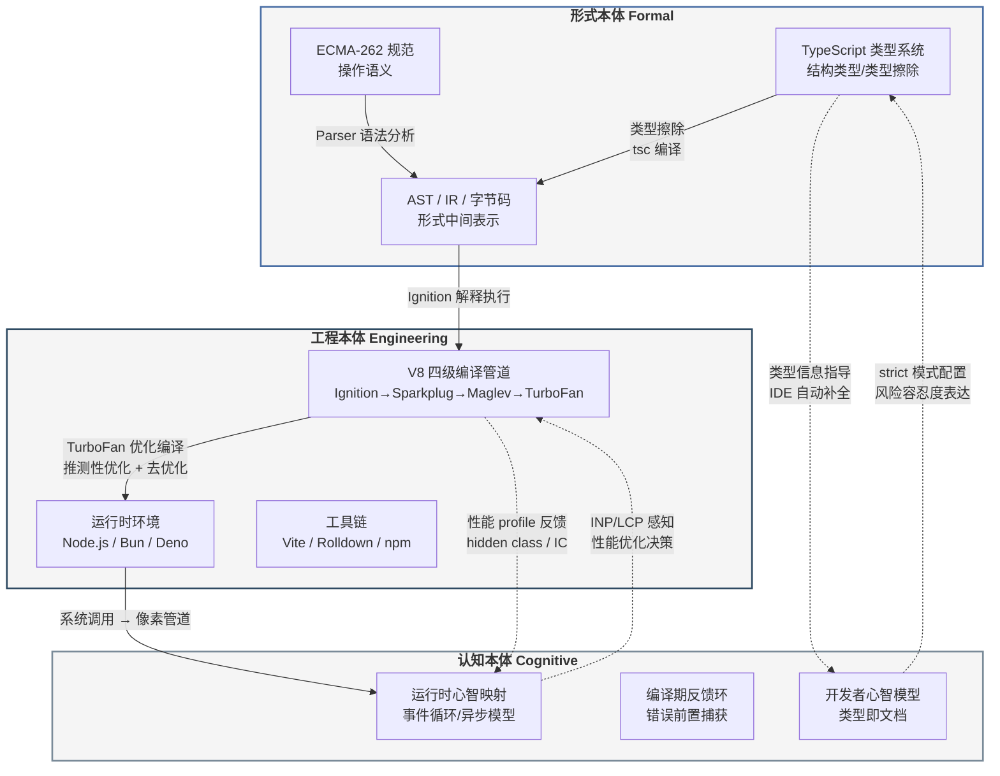

## 1. 总论：形式本体与工程实在的三重统一

TypeScript/JavaScript（TS/JS）软件堆栈在全球拥有约2,800万活跃开发者 [^91^]，其生态横跨前端框架、服务端运行时、构建工具链与类型系统等数十个技术领域。
然而，这一堆栈长期被碎片化的工具叙事所遮蔽——开发者熟知 React 组件的生命周期，却很少追问 JSX 语法糖如何通过 Parser 转化为 AST 节点；
了解 TypeScript 的 `strict` 模式能捕获空值错误，却很少反思类型系统作为"认知接口"在人与机器之间承担的桥梁功能。
本章的任务是从哲学本体论（Ontology）高度建立全书的分析框架，将 TS/JS 堆栈重新框架化为**形式系统（Formal System）— 物理实现（Physical Implementation）— 交互界面（Interactive Interface）**三重本体的统一体，并在此基础上绘制后续九章的论证版图。

### 1.1 论证框架与方法论声明

#### 1.1.1 形式层→工程层→感知层的三层递进模型

任何软件堆栈都内嵌一条从数学抽象到物理现实的转化链。
对于 TS/JS 而言，这一链条可表述为：

$$\text{源码} \rightarrow \text{AST} \rightarrow \text{字节码} \rightarrow \text{机器码} \rightarrow \text{系统调用} \rightarrow \text{像素}$$

这一转化律构成全书分析的主轴。
**形式层（Formal Layer）**对应转化链的前半段：ECMA-262 规范以形式化语义定义 JavaScript 的语法与执行模型 [^59^]，TypeScript 的类型系统在此基础上叠加静态约束，二者共同构成可严格推理的数学结构。
**工程层（Engineering Layer）**对应转化链的中段：V8 引擎的四级编译管道（Ignition → Sparkplug → Maglev → TurboFan）将形式产物转化为可执行机器码 [^1^]，Node.js/Bun/Deno 等运行时通过事件循环与系统调用衔接操作系统资源。
**感知层（Perceptual Layer）**对应转化链的末端：浏览器像素管道将计算结果渲染为 60fps 视觉界面，开发者通过 LCP（Largest Contentful Paint）与 INP（Interaction to Next Paint）等指标感知系统性能。

三层模型并非简单的线性流水线，而是存在双向反馈：感知层的性能瓶颈（如 INP > 200ms）可能反向驱动工程层的算法优化，工程层的实现约束（如 V8 的 hidden class 机制）又深刻影响形式层的语言设计决策。
这种跨层耦合正是 TS/JS 堆栈演化的核心动力。

#### 1.1.2 技术论证型与学术综述型的双轨方法论

本书采用双轨方法论：**技术论证型**写作确保每个工程论断都有可复现的定量基础——V8 的 JIT 编译阈值、TypeScript 类型检查耗时、运行时 HTTP 吞吐量等数据均来自官方 benchmark 或独立第三方测试；
**学术综述型**写作则为这些技术事实提供理论纵深，将 hidden class 优化归入"推测性优化"（speculative optimization）的编译理论传统，将类型擦除（type erasure）与 Gradual Typing 的学术脉络相衔接。

双轨方法的方法论意义在于：纯粹的工程罗列会因缺乏抽象框架而沦为工具手册，纯粹的理论推演则会因脱离实现细节而丧失对架构师的指导价值。
本书的每章均在"形式—工程—认知"三层模型中找到锚点，确保哲学抽象与工程实践形成实质性结合。

#### 1.1.3 阅读路径导引

全书十章面向三类核心受众。
**架构师**应重点关注第1-3章（本体论框架与形式语义）、第6章（全栈架构模式）与第9章（批判综合），这些章节提供技术选型的底层逻辑与长期演化判断。
**技术领导者**可优先阅读第4章（运行时生态竞争格局）、第7章（安全本体论）与第8章（AI融合），以获取团队决策与资源投入的数据支撑。
**高级研发工程师**则可在第2章（V8 引擎深度解析）、第5章（渲染管道性能优化）与第10章（哲科定位）中找到直接影响日常工程实践的技术细节与认知升级路径。
各章之间的依赖关系在 1.3.1 节的九域映射表中明确标注。

### 1.2 三重本体统一的核心命题

#### 1.2.1 语言本体（形式语义）—— ECMAScript 规范的完备性与不完备性

ECMA-262 第 16 版（ECMAScript 2025）于 2025 年 6 月正式发布 [^59^]，标志着这门语言在标准化轨道上连续第 9 年保持年度迭代节奏。
该规范以操作语义（operational semantics）的形式化风格定义了 JavaScript 的完整执行模型——从词法分析到抽象语法树（AST）构造，从执行上下文（execution context）到环境记录（environment record），每一步都有严格的算法步骤编号。
这种形式化程度使 ECMAScript 成为工业界少有的"可被数学家阅读"的编程语言规范。

然而，ECMA-262 的形式系统存在结构性不完备性。
规范的第 5 章明确定义了若干实现定义行为（implementation-defined behaviour）与未定义行为（undefined behaviour），例如 `Array.prototype.sort` 的具体算法选择、浮点数精度边界条件、以及宿主环境（host environment）提供的 I/O 语义。
这些"形式裂缝"恰恰构成了不同运行时差异化竞争的合法空间——V8 与 JavaScriptCore 可以在 sort 算法上做出不同优化选择，Node.js 与 Deno 可以在文件系统权限模型上采取不同策略。
TypeScript 的类型系统在此扮演了"形式化补丁"的角色：通过为动态 JavaScript 添加静态类型约束，TS 将大量运行时错误前移至编译期捕获。
2025 年 3 月发布的 TypeScript 5.8 进一步引入 `--erasableSyntaxOnly` 标志，使 TypeScript 代码可直接在 Node.js 中运行而无需显式 transpilation [^64^]，这标志着形式层与工程层的边界正在重新划定。

#### 1.2.2 工具本体（编译/运行时）—— V8、TypeScript 编译器、打包工具链的协同演化

工具本体是形式语义向物理计算资源的转化中介。
在 V8 引擎中，这一转化呈现为四级渐进编译架构：Ignition 解释器快速生成字节码并收集类型反馈，Sparkplug 基线编译器消除解释开销，Maglev 中层编译器（2023 年引入）在编译速度与优化深度之间取得平衡，TurboFan 顶层编译器则为热点代码生成全优化机器码 [^1^]。这一管道的核心洞见是**推测性优化**——基于历史类型假设生成特化代码，在假设失效时通过去优化（deoptimization）安全回退至解释执行。Hidden class 机制将动态属性访问转化为固定偏移内存读取，inline caching 将多态调用点（polymorphic call site）的查找成本摊平至 O(1) [^1^]。

TypeScript 编译器则承担另一维度的形式转化：将带有类型注解的 TypeScript 源码转化为纯 JavaScript，同时执行静态类型检查。值得注意的是，TS 编译器本身不参与运行时优化——类型信息在编译后被完全擦除（type erasure），运行时执行的是不含类型痕迹的 JavaScript。这一设计决策使 TypeScript 获得了"零运行时开销"的优良特性，但也意味着类型安全仅在编译期成立，无法防御运行时的类型混淆攻击。

在打包工具链维度，2025-2026 年的生态呈现清晰的代际更替：Vite 以 98% 的开发者满意度取代 Webpack 成为事实标准，基于 Rust 的 Rolldown 从 1% 跃升至 10% 使用率 [^86^]，工具链的性能瓶颈正从 JavaScript 实现转向原生代码实现。这一趋势的本质是将形式转化中的计算密集型阶段（模块图构建、树摇优化、代码分割）从工程层的高抽象层级下沉至更接近物理硬件的实现层级。

#### 1.2.3 认知本体（开发者心智模型）—— 类型系统作为连接人脑与机器执行的认知脚手架与认知接口

认知本体关注三重统一中最容易被忽视却最具实践影响力的维度：开发者如何通过心智模型（mental model）理解并操控整个技术堆栈。类型系统在此承担核心接口功能——它将程序的不变量（invariant）从运行时的隐式假设提升为编译期的显式契约，使开发者能够在代码编写阶段而非调试阶段发现错误。

GitHub Octoverse 2025 报告的数据揭示了这一认知转变的规模：TypeScript 以 263.6 万月活跃贡献者首次超越 Python 成为 GitHub 上使用最广泛的语言，年同比增长 66% [^88^]。State of JavaScript 2025 调查显示，40% 的受访者现在完全使用 TypeScript 编写代码，较 2024 年的 34% 与 2022 年的 28% 持续攀升 [^86^]。这一转变的深层驱动力在于，类型系统不仅捕获错误——它构成了一套可执行的领域知识表示。在超过 200k LOC 的代码库中，`strict: true` 的配置决策本质上是团队风险容忍度的形式化表达，`@ts-ignore` 与 `@ts-expect-error` 的选用差异反映了"已知例外"与"未知压制"之间的认识论分野。

认知本体的另一关键维度是运行时选择对开发者心智模型的塑造。Node.js 的事件循环模型（event loop）已内化为 JavaScript 开发者的默认并发范式；Deno 的权限沙盒模型要求开发者显式声明每个模块的文件系统与网络访问权限，将安全考量从"事后审计"前移至"开发时决策"；Bun 的 Zig 核心与内建打包器则试图将工具链的复杂度从开发者心智中卸载。这三种运行时代表了不同的"认知经济学"假设——Node.js 信任生态成熟度，Deno 信任显式约束，Bun 信任工具整合。

#### 1.2.4 核心发现概览：五大定理与"权衡的艺术"

基于上述三重本体框架，全书将展开五个形式化定理与三重核心洞察。**五大定理**构成技术分析的主干：JIT 三态转化定理（Ch2）揭示 V8 引擎从解释执行到优化编译的动态平衡机制；类型模块化定理（Ch3）证明类型共享失控必然导致架构完整性腐蚀；运行时收敛定理（Ch4）论证 Node.js/Bun/Deno 的竞争驱动整体进化而非零和替代；合成优先定理（Ch5）确立 `transform`/`opacity` 路径作为流畅动画的唯一可靠策略；JIT 安全张力定理（Ch7）揭示激进推测优化使类型混淆成为结构性安全风险而非实现缺陷。**三重洞察**则提供认识论升华：TypeScript 类型系统的"实用主义形式化"定位（Ch3）、类型系统作为团队"认知脚手架"的组织政策功能（Ch3/Ch6）、以及 TS/JS 堆栈成功的本质——动态性与静态检查、启动速度与长期性能、开发效率与运行效率之间**多重权衡的艺术**（Ch9/Ch10）。这一论证版图覆盖了从形式语义到像素管道、从认知经济学到安全本体论的全谱系分析。

### 1.3 论证版图全景

#### 1.3.1 九域映射总览表

全书十章围绕九个分析域展开，各域之间的关联矩阵如下表所示。形式本体论域与类型认识论域构成分析的基础层，运行时生态、渲染管道与全栈架构三域构成工程实现层，安全本体论与 AI 融合两域对应新兴交叉领域，批判综合与哲科定位两域提供元层反思。读者可依据自身角色选择性深入——架构师建议优先关注标记为"核心"的交叉节点，技术领导者建议关注标记为"决策"的交叉节点，高级研发工程师建议关注标记为"实现"的交叉节点。

| 分析域 | 核心关切 | 关联域（强度） | 受众重点 | 关键数据锚点 |
|:---|:---|:---|:---|:---|
| 形式本体论 | ECMA-262 规范的形式语义与实现不完备性 | 类型认识论（核心）、运行时生态（核心）、安全本体论（强） | 架构师 | ES2024/2025 年度特性 [^59^] |
| 类型认识论 | 类型系统作为认知接口与知识表示 | 形式本体论（核心）、全栈架构（强）、AI 融合（强） | 架构师/技术领导者 | TS 78% 专业采用率 [^85^] |
| 运行时生态 | Node/Bun/Deno 三体竞争与 WinterTC 标准化 | 形式本体论（核心）、安全本体论（强）、全栈架构（核心） | 技术领导者 | Node 24/Bun 2.0/Deno 3.0 [^56^] |
| 渲染管道 | 像素管道的性能优化与 60fps 约束 | 全栈架构（强）、运行时生态（实现） | 高级研发工程师 | 帧预算 16.6ms，可用 ≈10ms |
| 全栈架构 | 从客户端到服务端的统一类型与部署模型 | 类型认识论（核心）、运行时生态（核心）、AI 融合（决策） | 架构师/技术领导者 | RSC、SSR、边缘部署 |
| 安全本体论 | JIT 推测优化引入的结构性安全风险 | 形式本体论（强）、运行时生态（核心）、批判综合（强） | 技术领导者 | 5 类 CVE 模式（OOB/竞态/混淆） |
| AI 融合 | AI 辅助开发对类型系统与工具链的重塑 | 类型认识论（核心）、全栈架构（决策）、哲科定位（强） | 技术领导者/架构师 | MCP SDK v1.27、AI 原生 API |
| 批判综合 | 多重权衡（动态性/静态性、速度/性能、效率/安全） | 安全本体论（强）、哲科定位（核心）、形式本体论（强） | 全体受众 | "权衡的艺术"五大张力 |
| 哲科定位 | TS/JS 堆栈在计算机科学史与软件工程哲学中的位置 | 形式本体论（核心）、AI 融合（强）、批判综合（核心） | 架构师 | "实用主义形式化"定位 |

九域之间的关联模式揭示了几个关键结构特征。首先，**形式本体论—类型认识论—运行时生态**构成一个紧密耦合的三角核心：ECMA-262 规范的形式不完备性为运行时差异化提供空间，TypeScript 的类型系统部分填补这些裂缝，而运行时的实现选择又反过来约束类型系统的有效表达范围。其次，**AI 融合**作为新兴域，其与类型认识论的强关联（AI 辅助代码生成高度依赖类型约束来减少歧义）预示着 2025-2026 年技术演进的重要方向——GitHub 报告指出，TypeScript 的崛起部分归因于"AI 辅助开发在更严格的类型系统中表现更可靠" [^88^]。第三，**安全本体论**通过 JIT 安全张力定理与形式本体论和运行时生态形成深层联结：V8 的性能优势来源于激进推测优化，而这些优化本身使竞态条件与内存安全错误成为结构性风险而非实现缺陷。

#### 1.3.2 2026 时效性锚定

本书的分析时效性以 2025 年 6 月至 2026 年 4 月为基准窗口，具体边界如下。

**语言规范层**：ECMAScript 2024（第 15 版，2024 年 6 月发布）引入了 `ArrayBuffer` 原地 resize/transfer、`RegExp` `/v` 标志、`Promise.withResolvers`、`Object.groupBy` 与 `Map.groupBy` 等特性；ECMAScript 2025（第 16 版，2025 年 6 月发布）进一步引入 Iterator helpers（`map`/`filter`/`take`/`drop` 等 12 个方法）、Set 集合运算（`union`/`intersection`/`difference`/`symmetricDifference` 及子集/超集/不相交判断）、JSON modules with import attributes、`Promise.try` 与 `Float16Array` [^59^][^60^][^69^]。TypeScript 版本覆盖 5.7（2024 年 11 月）至 5.8（2025 年 3 月），重点特性包括 `--erasableSyntaxOnly` 标志支持 Node.js 直接执行、条件返回类型的改进类型推断、以及 `--module nodenext` 下 ESM/CJS 互操作的增强 [^64^][^66^]。

**运行时层**：Node.js v24 LTS（2025 年 10 月发布）实现原生 TypeScript 类型剥离（stable）、改进的权限模型与 超过200万个活跃包生态；Bun v2.0（2026 年 1 月稳定版）达到 99.7% Node.js API 兼容性，内置 bundler/test runner/package manager，基于 Zig 核心实现 2-4 倍 HTTP 吞吐优势；Deno v3.0（2026 年 3 月发布）内置 KV 存储、95%+ npm 兼容性与 Deno Deploy 边缘部署能力 [^56^]。更根本的标准化进展是 WinterCG 于 2025 年 1 月升格为 Ecma TC55（WinterTC），致力于定义非浏览器 JavaScript 运行时的最小公共 Web API 标准 [^103^][^104^]，这标志着运行时生态从竞争走向收敛的历史性转折。

**引擎与工具链层**：V8 引擎采用四级编译管道（Ignition/Sparkplug/Maglev/TurboFan），Turboshaft 项目正基于 CFG-based IR 逐步替代 TurboFan 的 Sea of Nodes 后端 [^1^]。打包工具链中 Vite 占据主导地位（84% 使用率，98% 满意度），Rolldown 作为 Rust 实现的 Rollup 替代方案快速上升 [^86^]。React 19 的 Server Components 架构已稳定，Next.js 15 以 59% 使用率保持元框架领先地位 [^86^]。

以下 Mermaid 图表述了三重本体之间的核心关系与转化路径：

该概念图揭示了 TS/JS 堆栈的核心结构张力。形式本体与工程本体之间的转化是单向的（实线箭头）：源码经解析、类型擦除、编译、优化最终转化为可执行机器码。然而认知本体与前两者之间存在双向反馈（虚线箭头）：开发者的心智模型指导类型系统的使用模式（如 `strict` 模式的配置决策），而编译器和运行时的反馈信息（类型错误、性能 profile、运行时指标）又持续重塑开发者的心智模型。这种双向反馈环是 TS/JS 生态能够快速演化的关键机制——与其他静态语言不同，JavaScript 的开发者社区同时参与形式语义（TC39 提案）、工程实现（V8 贡献、运行时开发）和认知实践（框架设计、编码规范）三个层面的共同演化，形成了一个独特的"实用主义形式化"技术传统。后续九章将在此框架下，逐层展开对这一堆栈的深度技术论证。
