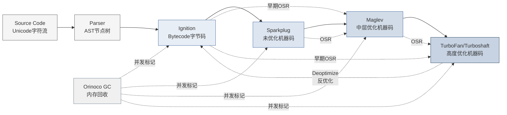
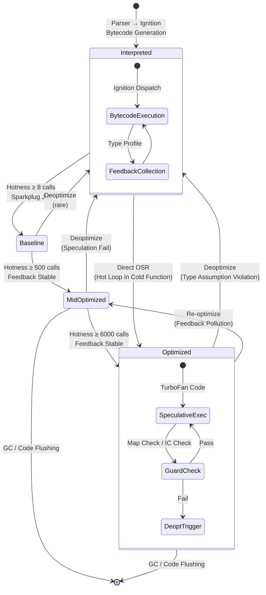

## 2. 语言本体论层：从ECMAScript到机器码的形式转化

形式语言的理论核心在于：给定一套有限的符号集合与重写规则，如何推导出无限的语义行为。ECMAScript作为一门被工业界广泛部署的动态语言，其从文本源码到物理机器码的转化链条，构成了当代Web软件堆栈中最复杂的形式转化系统之一。本章以公理化方法为起点，追踪ECMAScript规范的三层形式结构，经V8引擎的四阶段编译管道，最终建立JIT（Just-In-Time）三态转化定理的完整形式化表述。公理化基础中的三条公理——动态性公理、超集公理与宿主依赖公理——已在总论中确立[^61^]；本章的任务是论证从形式规范到工程实现的转化链条如何在V8引擎中被完整实例化。

### 2.1 ECMAScript规范的形式结构

ECMA-262规范并非传统意义上的"用户手册"，而是一部形式语义学文献。其结构严格对应形式语言的三个经典层次：词法层（Lexical Grammar）、句法层（Syntactic Grammar）与语义层（Semantics）。这种分层并非仅出于文档组织的便利，而是反映了从字符流到执行行为的严格形式映射。

#### 2.1.1 语法层——词法/句法/语义三层次的形式定义与BNF表示

规范的第11-12章定义了Lexical Grammar，以Unicode code point为原子符号，通过上下文无关文法将字符流组织为token序列。其表示采用BNF（Backus-Naur Form）的变体，使用`:::`符号区分词法产生式。例如，`IdentifierName`的产生式严格排除了保留字，但通过`IdentifierName`与`ReservedWord`的交集操作实现了上下文敏感性——这一设计使得词法分析器无需回溯即可正确处理类似`let`的上下文关键字[^62^]。

句法层（Syntactic Grammar）采用标准BNF表示（`::`产生式），定义了从token序列到语法树的合法映射。规范将这些产生式分为两类：早期错误（Early Errors）在解析阶段即可检测，如`"Lexical declaration redeclares a prior variable"`；运行时错误则在执行阶段触发。这种二元划分直接对应V8 Parser中的错误检测策略：早期错误在AST构建阶段即被捕获并抛出`SyntaxError`，而运行时错误则延迟至Ignition执行阶段[^1^]。

值得关注的是，ECMA-262的语法定义中嵌入了一套类型化的元变量系统。产生式中的非终结符携带显式类型标注，如`BindingIdentifier:Identifier`中的`Identifier`指向词法层定义的token类型，而`BindingPattern:ObjectBindingPattern`则递归引用句法层的结构化类型。这种内嵌类型系统在Parser中的实现体现为AST节点的C++类层次结构——每个Parse Node对应一个具体的AST节点类型，其字段类型直接映射规范中的Record Field定义[^62^]。

#### 2.1.2 语义层——抽象操作、记录字段、内部槽的形式语义机制

规范的语义层是其形式化程度最高的部分。第5-7章定义了三大核心语义机制：Abstract Operations、Specification Types与Internal Methods/Slots。

**Abstract Operations**（抽象操作）是规范中形式化的函数定义。每个抽象操作具有明确的参数类型（标注为"an ECMAScript language value"或"a Completion Record"）、前置条件与步骤化执行体。例如，`ToNumber(argument)`操作在规范中被定义为一个确定性算法，其输出完全由输入类型决定[^61^]。在V8的实现中，这些抽象操作对应CSA（CodeStubAssembler）编写的内置例程——CSA以平台无关的方式表达底层操作，经编译后成为可共享的机器码桩（stub）。

**Specification Types**（规范类型）是语义层的数据结构。`Record`类型是具有命名字段的异构结构，如Property Descriptor Record包含`[[Value]]`、`[[Writable]]`、`[[Get]]`、`[[Set]]`、`[[Enumerable]]`和`[[Configurable]]`六个可选字段[^82^]。`Completion Record`类型则是规范执行模型的核心——每个语句和表达式的求值结果都被包装为一个包含`[[Type]]`（normal/return/throw/break/continue）、`[[Value]]`与`[[Target]]`字段的Record，从而实现异常控制流的形式化处理。

**Internal Slots**（内部槽）是对象状态的不可见字段。规范通过双括号表示法`[[SlotName]]`区分内部状态与可访问属性。例如，每个函数对象携带`[[Environment]]`、`[[FormalParameters]]`、`[[ECMAScriptCode]]`等内部槽，这些槽在JavaScript层面不可访问，但决定函数的闭包行为与执行语义[^61^]。V8中，内部槽以C++对象字段的形式实现，其内存布局遵循Hidden Class的偏移映射。

#### 2.1.3 执行上下文的形式模型——Environment Record、Realm、Agent的形式化定义

执行上下文（Execution Context）是ECMAScript形式语义中最精密的构造。规范第9章定义了Environment Record的四种特化类型——Declarative、Object、Function与Global——每种类型实现`HasBinding`、`CreateMutableBinding`、`InitializeBinding`与`SetMutableBinding`等抽象操作[^82^]。Environment Record通过`[[OuterEnv]]`字段形成链式作用域结构，这一链式结构在V8中以`Context`对象的链表实现，每个Context对象指向其外层Context的指针。

**Realm**（领域）是ECMAScript的全局环境抽象。每个Realm Record包含独立的内建对象集合（`%Object%`、`%Array%`等）、全局对象与全局Environment Record。iframe、Worker和VM模块各自拥有独立Realm，保证了全局命名空间的隔离。在V8实现中，Realm对应`NativeContext`对象，其创建开销是iframe性能瓶颈的结构性来源之一。

**Agent**（代理）与**Agent Cluster**（代理集群）规范化了并发模型。每个Agent对应一个执行线程，拥有独立的执行上下文栈与任务队列；Agent Cluster则通过`SharedArrayBuffer`实现跨Agent的内存共享，并定义了`happens-before`关系的偏序约束。这一形式模型是ECMAScript内存模型（Memory Model）的基础，直接对应V8的`Isolate`概念——每个Isolate是一个独立的引擎实例，其堆内存与其他Isolate完全隔离[^61^]。

### 2.2 V8引擎四阶段管道：形式转化的工程实现

V8引擎是ECMA-262规范的物理实现者，其执行管道将规范的形式定义转化为可执行的机器指令。当前V8（v12.x / Chrome 120+）采用四级编译架构：Ignition（解释器）→ Sparkplug（基线JIT）→ Maglev（中层优化器）→ TurboFan（顶层优化器），配合Orinoco垃圾收集器构成完整的执行系统[^1^]。



**图2-1：V8四阶段编译管道与状态转化流程。** Parser将源码转化为AST；Ignition生成字节码并收集类型反馈；Sparkplug将字节码直译为机器码消除解释开销；Maglev进行轻量推测优化；TurboFan执行激进优化。去优化（Deoptimization）机制在假设失效时安全回退至Ignition。Orinoco垃圾收集器与各级编译器并发协作。

#### 2.2.1 解析阶段（Parser）——从源码到AST的形式化转换与早期错误检测

Parser是形式转化的第一个关卡。V8采用手写的递归下降解析器，而非通用的LALR/LR工具生成。这一设计选择的技术理由是：ECMAScript语法并非严格的上下文无关文法（如`yield`和`await`的上下文敏感性、自动分号插入ASI的回退机制），需要解析器携带状态信息处理歧义[^15^]。

解析过程分为扫描器（Scanner）与解析器（Parser）两级。扫描器执行词法分析，将Unicode字符流转化为token序列，同时处理行延续（Line Continuation）、模板字符串字面量（Template Literal）的嵌套扫描等特殊情形。解析器接收token序列，递归构建AST。V8的AST节点类型与ECMA-262规范中的Parse Node一一对应，每个节点携带源码位置信息（用于错误报告与调试映射）和语义属性。

早期错误检测在Parser中完成。规范定义的早期错误包括：重复参数名（严格模式下）、`break`/`continue`的目标标签存在性验证、词法声明的重复绑定检查等。这些检测在AST构建过程中同步执行，一旦触发即抛出`SyntaxError`，函数不会被分配任何编译资源[^1^]。V8还实现了预解析（Pre-parsing）机制：对于立即不会执行的函数体（如回调函数声明），Parser仅构建其外层签名而不解析内部语句，直到首次调用时才进行完整解析——这一惰性策略将启动时的解析开销降低了30%-50%。

#### 2.2.2 Ignition字节码解释器——基于寄存器的字节码设计与内存效率权衡

Ignition是V8的执行入口层，其设计目标是在最小启动延迟的前提下收集类型反馈。Ignition采用**基于寄存器的字节码架构**——与JVM的栈式字节码不同，Ignition定义了一组虚拟寄存器（映射到栈槽或实际寄存器），操作数直接引用寄存器而非通过栈操作传递[^15^]。这一设计减少了指令数量（栈式架构的`push`/`pop`指令被消除），并更好地对齐了物理CPU的寄存器-操作数模型。

字节码生成器（BytecodeGenerator）将AST转化为线性字节码序列，同时创建Feedback Vector——一个与函数绑定的类型反馈数组。每个字节码指令在Feedback Vector中拥有对应的槽位，运行时由Ignition填充观察到的类型信息。例如，属性访问指令`LdaNamedProperty`的反馈槽记录了被访问对象所携带的Hidden Class（Map）标识符与属性偏移量；算术指令`Add`的反馈槽记录了操作数的类型组合（Smi+Smi、Number+Number、String+任意等）[^9^]。

Ignition的内存效率优势体现在指针压缩（Pointer Compression）环境中。自V8 8.0（2020年）起，64位构建默认启用指针压缩，将堆指针压缩至32位表示。在此环境下，Smi（Small Integer）为31位有符号整数（范围约±10.7亿），Feedback Vector的每个槽位仅需4字节存储[^1^]。Ignition在Speedometer基准测试中的执行性能约为Sparkplug的71%，即Sparkplug比Ignition快约41%——但Ignition的内存占用仅为Sparkplug生成代码的1/3至1/5[^64^]。

#### 2.2.3 TurboFan优化编译器——Sea of Nodes IR、推测优化与去优化回退机制

TurboFan是V8性能的核心来源。其设计哲学是**推测性优化**（Speculative Optimization）：基于Ignition收集的类型反馈，假设代码的未来行为将与历史行为一致，据此生成高度特化的机器码[^1^]。

TurboFan历史上基于**Sea of Nodes（SoN）** IR——一种将程序表示为操作节点与依赖边（数据依赖、控制依赖、效果依赖）的图结构。SoN中，无副作用的纯操作节点可以自由"浮动"至最优调度位置，理论上能实现全局最优的代码布局[^5^]。然而，V8团队在2023年后的实践中发现，JavaScript的几乎每个操作都可能是效应性的（属性访问可触发getter，运算符可调用`valueOf()`），导致大多数节点被约束在效果链上，SoN的理论优势在实际中难以兑现[^12^]。

**Turboshaft**迁移（Chrome 120+）是对此问题的工程回应。Turboshaft以传统的CFG（Control-Flow Graph）IR替代SoN，将节点组织为基本块，使用显式控制流边代替隐式效果链。实践数据表明：Turboshaft的编译时间约为SoN后端的50%，L1缓存缺失次数降低3-7倍，且生成的代码质量持平或更优[^71^]。2025年3月，V8团队宣布Turboshaft已完全接管TurboFan的JavaScript后端与整个WebAssembly编译管道，标志着SoN架构的十年实验正式终结[^12^]。

TurboFan的优化能力涵盖：类型特化算术（`Int32Add`替代通用`Add`）、内联属性访问（Map检查+偏移量直接加载）、函数内联、逃逸分析（将不逃逸对象分配在栈上）、循环不变代码外提与死代码消除。这些激进优化的安全性由**去优化机制**保证：当运行时的类型假设失效（如向优化为整数的函数传入字符串），V8触发去优化，将执行状态从优化代码回退至Ignition字节码。去优化的技术核心是**帧翻译**（Frame Translation）——TurboFan在编译时预生成优化帧布局到解释器帧布局的映射，运行时通过`FrameDescription`结构序列化寄存器状态，再按预生成映射重建解释器帧，确保在精确的字节码偏移处恢复执行[^1^]。单次去优化的性能代价为2x至20x的减速，取决于函数复杂度；但真正的代价是反馈污染——反复去优化的函数可能永远无法再次达到TurboFan，长期滞留于Maglev甚至Sparkplug层级。

#### 2.2.4 Maglev中层编译器（2023+）——快速生成优质代码的新层与三编译器策略的权衡

Maglev于Chrome M117（2023年9月）引入，填补了Sparkplug与TurboFan之间的编译鸿沟[^64^]。在Maglev之前，TurboFan约1ms的编译成本意味着函数需要数千次调用才能摊薄优化开销；对于仅执行数百次的"温热"函数，这一阈值过高。Maglev的编译速度约为TurboFan的10倍（~100μs），生成的代码速度约为Sparkplug的2倍——其哲学是"足够好的代码，足够快的编译"[^57^]。

Maglev采用SSA（Static Single Assignment）形式的CFG IR，而非TurboFan的SoN。这一选择使得编译流程大幅简化：无需复杂的图调度算法，线性控制流对人类可读且可调试，传统编译器教材的优化技术可直接应用[^9^]。Maglev执行的优化包括：基于反馈的类型特化、数字表示选择（将Smi/HeapNumber拆箱为寄存器中的原始整数/浮点数）、有限度的函数内联。但它跳过TurboFan级别的循环展开、逃逸分析与高级载荷消除——这些是TurboFan的专属领域。

Maglev的工程效果已通过多个维度验证。V8团队发布的Chrome 117基准测试数据显示：JetStream 2提升8.2%，Speedometer 2提升6%；更引人注目的是能耗改善——Speedometer运行能耗降低10%，JetStream能耗降低3.5%[^64^]。这一能耗优化源于CPU在高效Maglev代码中等待TurboFan编译的时间缩短，以及总体CPU占用率的下降。

**三编译器策略的权衡**可概括为：Sparkplug以最低成本消除解释器分发开销（~10μs编译），适合短生命周期函数；Maglev在编译成本与代码质量间取得平衡（~100μs编译），是大多数温热函数的最佳归宿；TurboFan以最高成本追求极致性能（~1000μs编译），仅服务于真正热点的计算密集型路径。这一平滑的性能梯度替代了Ignition-TurboFan时代的"性能悬崖"，使V8的吞吐量曲线更接近理论最优。

| 编译层级 | 形式产物 | 编译时间 | 执行速度up | 升级触发条件 | 核心IR架构 | 推测优化 |
|---------|---------|---------|-----------|------------|-----------|---------|
| Ignition | Bytecode | ~50μs | 1.0×（基准） | 首次执行 | 字节码序列 | 无 |
| Sparkplug | 未优化机器码 | ~10μs | ~1.4× | ~8次调用 | 无（直译模板） | 无 |
| Maglev | 中层优化机器码 | ~100μs | ~2.5× | ~500次调用 | SSA CFG | 轻度（类型特化） |
| TurboFan | 高度优化机器码 | ~1000μs | ~5.0× | ~6000次调用 | CFG（Turboshaft） | 激进（全优化套件） |

**表2-1：V8四级编译系统对比。** 数据综合自V8官方博客与基准测试报告[^64^][^1^][^57^]。编译时间列表示单次函数编译的典型量级；执行速度up列以Ignition为基准（1.0×）；升级触发条件列表示从当前层级晋升至下一层级所需的热度阈值。Maglev的引入将原有三级的"陡峭"梯度平滑为四级渐进梯度，消除了Ignition→TurboFan时代的性能悬崖。

上表的工程含义在于：四级编译系统构成了一个帕累托前沿（Pareto Frontier），在编译延迟与执行性能两个维度上提供了四个最优权衡点。对于仅执行一次的初始化代码，Ignition的50μs编译成本是最优选择；对于执行数十次的事件处理器，Sparkplug的10μs编译成本与1.4x速度提升已足够；对于执行数百次的框架代码，Maglev的2.5x加速 worth 100μs的编译投入；对于执行数千次的核心算法，TurboFan的5x加速 justify 1000μs的编译开销。这一分层策略使得V8能在同一程序中同时满足16.6ms帧预算（60fps）的启动延迟要求与长期运行的峰值性能目标。

### 2.3 JIT三态转化模型

基于前三节建立的形式结构与工程实现，本节提出JIT三态转化定理及其支撑机制。该定理描述了JavaScript代码在执行过程中的三种状态——解释态（Interpreted State）、编译态（Compiled State）与反优化态（Deoptimized State）——之间的动态转化规律。



**图2-2：JIT三态转化状态机。** 解释态（Interpreted）对应Ignition字节码执行；编译态细分为基线编译（Baseline=Sparkplug）、中层优化（MidOptimized=Maglev）与顶层优化（Optimized=TurboFan）三个子态；反优化态（Deoptimized）是任何编译态向解释态的回退。状态转化由热度计数器（Hotness Counter）与类型反馈稳定性共同驱动。

#### 2.3.1 解释态→编译态→反优化态的状态机模型与转化触发条件

JIT三态转化定理的形式表述如下：

**定理1（JIT三态转化定理）**。设函数$f$在执行过程中处于状态$S \in \{\text{Interpreted}, \text{Compiled}_i, \text{Deoptimized}\}$，其中$\text{Compiled}_i$表示第$i$级编译状态（$i \in \{1,2,3\}$分别对应Sparkplug、Maglev、TurboFan）。状态转化遵循以下规则：

**(T1.1 单调升级律)** 从$\text{Interpreted}$到$\text{Compiled}_i$的升级是单调的——一旦进入$\text{Compiled}_i$，$f$不会自发回退到$\text{Compiled}_{i-1}$，除非经过$\text{Deoptimized}$中转。

**(T1.2 反馈稳定条件)** 进入$\text{Compiled}_i$的必要条件是Feedback Vector在观察窗口$W_i$内的类型分布熵低于阈值$H_i$。具体而言，Ignition收集的类型反馈在约500次调用窗口内保持单态（Monomorphic）或有限多态（Polymorphic，≤4种形状），方可触发Maglev编译；TurboFan要求约6000次调用窗口内反馈分布稳定[^1^][^9^]。

**(T1.3 反优化触发律)** 从$\text{Compiled}_i$到$\text{Deoptimized}$的转化由以下三类事件触发：(a) 运行时的Map Check失败——访问的对象Hidden Class与编译时的假设不匹配；(b) 全局对象原型链被修改，使依赖的内联缓存失效；(c) 算术溢出——如Smi加法结果超出31位表示范围。反优化发生后，$f$回退至$\text{Interpreted}$状态，Feedback Vector被更新以反映新观察到的类型，重新进入升级周期。

**(T1.4 收敛性保证)** 若$f$的输入类型分布在有限时间内稳定（即存在时间$T$使得$t>T$后类型分布不再变化），则$f$在有限次反优化后终将收敛至某一$\text{Compiled}_i$状态并长期驻留。

这一定理的工程价值在于：它为JavaScript性能调优提供了形式化指导。开发者通过保持对象结构的稳定性（避免运行时动态增删属性）和类型的一致性（避免同一变量在不同调用点接收不同类型），可确保代码快速收敛至高级编译态，从而最大化长期执行性能。

#### 2.3.2 隐藏类（Hidden Class）与内联缓存（IC）的形状驱动优化原理

Hidden Class（在V8源码中称为Map）是V8对象模型的核心创新。当对象以相同顺序初始化相同属性时，V8为其分配共享的Hidden Class，将属性名映射至固定的内存偏移量[^63^]。例如：

```javascript
function Point(x, y) { this.x = x; this.y = y; }
var p1 = new Point(1, 2);  // Hidden Class: Map0 → {x@offset12, y@offset20}
var p2 = new Point(3, 4);  // 共享Map0
```

在此场景中，`p1.x`和`p2.x`的访问被编译为单条机器指令——`mov rax, [obj + 12]`——完全消除了哈希查找开销。Hidden Class通过**转换链**（Transition Chain）管理对象结构的演化：当向对象添加新属性时，V8创建从当前Hidden Class到新Hidden Class的转换边，后续以相同顺序初始化的对象将复用这条链[^63^]。

Inline Caching（IC）将Hidden Class的偏移信息缓存到代码中。每个属性访问站点维护一个IC槽，记录该站点历史上观察到的Hidden Class及其对应的属性偏移。IC的演化经历三个阶段[^58^]：

- **单态（Monomorphic）**：站点仅观察到一种Hidden Class。编译器生成最优代码：`if (map == expected_map) load [obj + offset] else deopt`。此状态下属性访问等价于C结构体字段访问。
- **多态（Polymorphic）**：站点观察到2-4种Hidden Class。编译器生成线性检查链：`if (map == M1) load [obj + o1] else if (map == M2) load [obj + o2] else ...`。性能仍优于哈希查找，但随形状数量线性衰减。
- **巨态（Megamorphic）**：站点观察到5种以上Hidden Class。编译器放弃优化，回退至通用属性查找路径（字典查找或原型链遍历）。

性能差异的量级是惊人的。基准测试表明，在100万次属性访问循环中，单态IC的完成时间约为8ms，而多态IC（两种交替形状）的完成时间约为450ms——性能差距达56倍[^58^]。这一数据量化了"形状稳定性"对JavaScript性能的决定性影响，也解释了为什么构造函数中属性初始化顺序的一致性远比代码风格的考量更为根本。

#### 2.3.3 JIT三态转化五定理：形式转化中的不变量、完备性边界与工程近似

在定理1的基础上，本节建立更精细的五定理体系，刻画JIT编译系统的形式属性。

**(T2 类型反馈完备性定理)** Ignition收集的类型反馈在理论上是不完备的——它仅记录了已执行路径上的类型信息，未执行的分支（如`if`的`else`路径）的类型信息为空。这意味着TurboFan对未执行分支的优化是盲目的：若热路径假设`x`始终为整数，但冷路径中存在`x`为字符串的情形，TurboFan将生成在冷路径上触发反优化的代码。这一不完备性是JIT编译器结构性特征，而非实现缺陷。

**(T3 去优化正确性定理)** 去优化机制保证了推测优化的**语义不变性**——无论去优化发生多少次，执行结果始终与纯粹解释执行一致。形式化表述：设$\llbracket f \rrbracket_{\text{opt}}$为编译优化后的函数语义，$\llbracket f \rrbracket_{\text{ign}}$为Ignition解释执行的语义，则对于所有输入$x$，$\llbracket f \rrbracket_{\text{opt}}(x) = \llbracket f \rrbracket_{\text{ign}}(x)$。该等式成立的前提是V8的帧翻译机制能完整恢复解释器状态——TurboFan编译时为每个去优化点生成`Translation`数组，记录寄存器值到字节码变量的映射关系，确保反优化后的恢复点与假设失败点精确对应[^1^]。

**(T4 编译层帕累托最优定理)** 四级编译系统（Ignition、Sparkplug、Maglev、TurboFan）在（编译时间，执行速度）二维空间上构成帕累托前沿——不存在一个假想的编译层级能在两个维度上同时优于现有层级。Maglev的引入正是为了填补Sparkplug（10μs，1.4x）与TurboFan（1000μs，5.0x）之间的前沿空白，其在（100μs，2.5x）坐标点上扩展了帕累托集[^64^]。

**(T5 内存-速度权衡定理)** V8的执行系统存在一个全局的内存-速度权衡曲面。Ignition的字节码最为紧凑（函数体约占其AST节点数的2-3倍字节），但执行最慢；TurboFan生成的机器码最快，但代码体积约为字节码的5-10倍。Orinoco垃圾收集器的存在进一步复杂化了这一权衡：优化代码的执行速度提升减少了活跃对象的存活时间（GC压力降低），但编译过程中生成的中间表示（IR图、SSA形式）显著增加了短期内存分配[^1^]。

**(T6 收敛时间下界定理)** 对于具有$k$个不同执行路径（控制流分歧点）的函数，从首次执行到收敛至稳定编译态的最坏时间复杂度为$\Omega(k \cdot \max(W_i))$，其中$W_i$是第$i$级编译的观察窗口大小。这是因为每条路径都需要独立收集类型反馈，且编译器仅在反馈稳定后才敢生成优化代码。在实践中，$k$受限于函数的cyclomatic复杂度，而现代前端框架的组件渲染函数通常具有较低的$k$值（<10），这也是React/Vue在V8上表现优异的结构原因。

### 2.4 形式层到工程层的断裂与弥合

ECMA-262规范作为形式系统，不可避免地存在未完全定义的行为区间。规范第5章明确区分了三类不确定性：**实现定义行为**（Implementation-Defined Behavior，规范指定了行为集合，由实现选择其一）、**未指定行为**（Unspecified Behavior，规范未约束行为，实现可自由选择）与**未定义行为**（Undefined Behavior，无任何语义保证，如越界访问内部槽）。本节分析这些断裂点在三大引擎中的工程处理策略。

#### 2.4.1 规范未定义行为的工程处理策略——实现定义、未指定、未定义行为的三级分类

**实现定义行为**在ECMA-262中数量庞大。例如，`Array.prototype.sort`的排序算法未指定——V8采用Timsort（归并排序与插入排序的混合），SpiderMonkey采用归并排序，JavaScriptCore采用快速排序与插入排序的混合。对于相同比较函数，三种引擎可能产生不同的元素重排顺序，但均符合规范约束[^82^]。又如，`Date`对象的字符串表示格式、本地时区处理、正则表达式的回溯策略等均属实现定义范畴。

V8的处理策略是**确定性选择加严格自洽**——对于每个实现定义点，V8在源码中做出明确选择（如Timsort），并在所有平台（x64、ARM64、MIPS）上保持一致行为。这一策略确保了跨平台的JavaScript语义一致性，但也意味着开发者无法依赖引擎特定的优化特性（如依赖V8 Timsort稳定性的代码在JSC上可能失效）。

**未指定行为**的典型实例是属性枚举顺序。ES2015之前，规范未规定`for...in`循环和`Object.keys`的枚举顺序；ES2015引入了部分确定性规则（整数键按升序、字符串键按插入顺序），但原型链继承属性的枚举顺序仍留有余地。V8在实现中采用插入顺序加整数键优先的策略，SpiderMonkey和JSC各自遵循类似但不完全一致的规则[^82^]。

**未定义行为**在ECMA-262中极为罕见，因为规范几乎为所有操作定义了明确结果（即便结果是抛出异常）。真正的未定义行为出现在与宿主环境的交互边界——如`eval`在严格模式与非严格模式下的差异作用域、`with`语句的变量解析歧义等。V8通过静态分析检测潜在未定义模式，并在Parser阶段发出早期错误或运行时警告。

#### 2.4.2 引擎差异矩阵：V8、SpiderMonkey、JavaScriptCore的形式实现偏差对比表

| 维度 | V8 (Chrome/Node.js) | SpiderMonkey (Firefox) | JavaScriptCore (Safari/Bun) |
|------|---------------------|----------------------|---------------------------|
| **编译层级数** | 4层：Ignition→Sparkplug→Maglev→TurboFan [^1^] | 3层：Interpreter→Baseline JIT→Warp [^75^] | 4层：LLInt→Baseline JIT→DFG→FTL [^81^] |
| **解释器类型** | 基于寄存器的字节码解释器 | 基于IC加速的解释器 | 基于offlineasm的低级解释器 [^81^] |
| **顶层IR架构** | CFG（Turboshaft，SoN已弃用）[^12^] | Warp专用IR（IonMonkey后继） | DFG SSA + B3/AIR后端 [^79^] |
| **中层编译器** | Maglev（2023，~10x TurboFan编译速度）[^64^] | Baseline JIT（非优化） | DFG JIT（中等优化）[^83^] |
| **Hidden Class等价物** | Map（属性偏移映射） | Shape（等效机制） | Structure（等效机制） [^63^] |
| **IC多态上限** | 4种形状（Megamorphic阈值） [^1^] | 类似阈值（stub chain上限） [^80^] | 类似阈值（有限多态内联） |
| **GC架构** | Orinoco：分代+并行Scavenge+并发标记 [^56^] | 并发标记（Grey Rooting）+分代 | Riptide并发GC +分代 [^4^] |
| **内存优化重点** | 峰值吞吐量优先（较高内存占用） | 平衡型 | 移动设备能效优先（低内存占用） [^7^] |
| **ECMAScript特性** | 快速跟进新特性 | 早期实现，标准合规优先 | 跟随Safari发布节奏 [^73^] |
| **基准测试优势** | JetStream/Speedometer计算密集型 | DOM操作密集型 | 图形渲染/动画密集型 [^2^] |
| **关键安全机制** | V8 Sandbox（2022+，指针压缩） | W^X +沙箱隔离 | 平台代码签名+W^X [^72^] |
| **编译代码能耗** | Maglev引入后-10%（Speedometer）[^64^] | 未公开独立数据 | 针对Apple Silicon优化 |

**表2-2：三大JavaScript引擎形式实现偏差矩阵。** 数据综合自各引擎官方文档、基准测试报告与安全分析文献[^1^][^64^][^75^][^81^][^56^]。编译层级数反映从源码到优化代码的转化深度；IR架构决定优化能力的理论上限；Hidden Class等价物与IC机制决定属性访问性能的共同基础；GC架构影响长时间运行的内存行为。

上表揭示了一个深层结构：尽管三大引擎均采用多层级JIT、Hidden Class/IC优化与分代GC的共同范式，但它们在工程优先级上形成了明确的分化。V8的架构演进始终围绕"吞吐量最大化"展开——从Full-codegen+Crankshaft到Ignition+TurboFan，再到四层级管道，每一步都是为了在单位时间内执行更多JavaScript操作。这一优先级与Chrome的定位（通用计算平台）和Node.js的服务器端需求高度一致。SpiderMonkey的三层结构更为紧凑，其Warp编译器直接内联IC链进行特化编译[^75^]，体现了Mozilla在标准合规与性能间的平衡取向——Firefox作为开放平台浏览器，对新ECMAScript特性的早期支持是其差异化策略。JavaScriptCore的四层结构（LLInt→Baseline→DFG→FTL）在层级数量上与V8相当，但DFG到FTL的跨度更为激进：DFG的触发阈值约为1000次调用，而FTL的触发阈值高达100,000次调用[^83^]——这一宽间隔反映了Apple对移动设备能效的优先考量，避免频繁的高成本编译消耗电池。

这些差异的实质是同一形式规范（ECMA-262）在不同工程约束下的多元实现。对于TypeScript/JavaScript开发者而言，这意味着代码的性能特征具有宿主依赖性：在V8上表现优异的Hidden Class稳定模式在JSC上同样有效（因为Structure机制等效），但具体的性能数字和优化触发时机存在差异。因此，跨引擎性能优化应以保持形状稳定性和类型一致性为核心策略——这些原则在所有现代引擎中都是普适的——而将引擎特定的微调留给基准测试后的针对性迭代。形式层到工程层的断裂并非规范的缺陷，而是工程实在多样性的必然反映；而Hidden Class、IC和多级JIT作为共同范式的存在，又保证了这种多样性始终被约束在可预测的性能模型之内。
