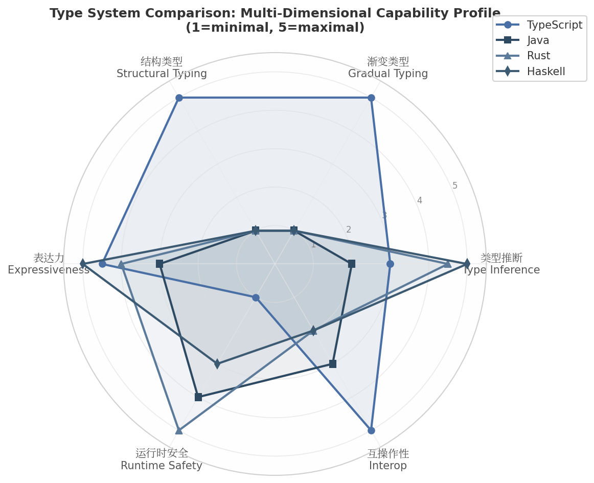
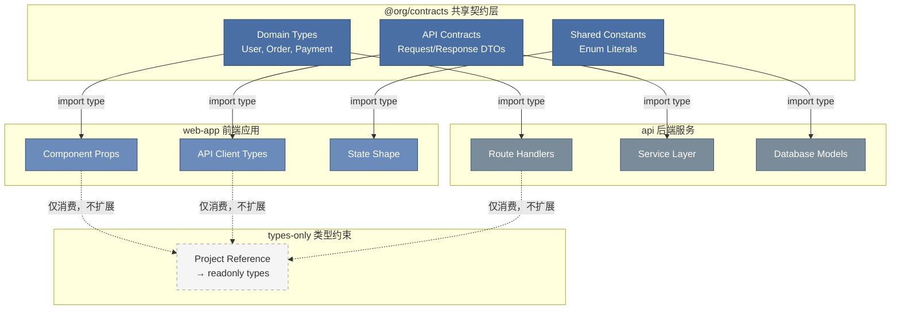

## 3. 类型系统的认识论功能：TS作为认知脚手架

类型系统的传统定义将其视为编译期错误检测工具——一种在程序运行前捕获类型不匹配缺陷的静态分析机制。然而，在超过200k LOC的大规模代码库中，TypeScript的类型系统已超越这一工具性角色，升维为组织层面的结构化约束语言与风险治理机制[^17^]。`strict: true`的启用与否不再仅是技术选型，而是团队对形式正确性与交付速度之间权衡边界的组织政策表达。本章从形式语义学、认知心理学与软件工程经济学三个维度，论证TypeScript类型系统如何作为"认知脚手架"（cognitive scaffolding）重塑开发者的心智模型与架构决策。

### 3.1 类型即约束：形式语义视角

#### 3.1.1 Curry-Howard对应在TS中的工程映射

Curry-Howard对应（Curry-Howard correspondence）建立了形式逻辑与类型系统之间的深层同构关系：命题对应类型，证明对应程序，证明简化对应程序求值[^25^]。在这一框架下，编写类型正确的代码等价于构造逻辑证明。合取（conjunction）对应积类型（product type/tuples），析取（disjunction）对应和类型（sum type/unions），蕴涵（implication）对应函数类型（function type）[^27^]。

TypeScript的类型系统虽未追求完全的逻辑一致性（soundness），却在工程实践中实现了Curry-Howard对应的可操作版本。以安全除法为例，开发者可定义 branded type `NonZeroNumber = number & { readonly __nonZero__: unique symbol }`，使`divide(a: number, b: NonZeroNumber): number`的类型签名直接编码了"给定非零除数$b$，除法$a/b$有定义"这一数学命题[^17^]。`makeNonZeroNumber`运行时检查函数充当证明构造器——只有通过该函数的数值才能获得`NonZeroNumber`类型，从而在编译期消除除零错误。这种"以类型编码不变量"（encoding invariants in types）的实践，将类型系统从被动检查器转化为活性约束声明语言。

在TypeScript的类型层级中，条件类型（conditional types）进一步扩展了这一定理体系。`T extends U ? X : Y`的结构直接对应逻辑蕴涵判断——当类型`T`可赋值给`U`时，类型系统选择分支`X`，否则选择`Y`。模板字面量类型（template literal types）则将字符串操作纳入类型层面的逻辑推理，使得CSS属性名、路由路径等字符串模式能够在编译期得到验证。

#### 3.1.2 结构类型vs名义类型的认识论差异

类型等价性的判定策略构成了类型系统的认识论基础。TypeScript采用结构类型（structural typing）系统：两个类型当且仅当它们的成员结构匹配时被视为等价，与声明位置或类型名称无关[^26^]。Java、Rust、Haskell等语言则采用名义类型（nominal typing）系统，类型等价性取决于显式声明的继承关系或类型名称[^28^]。

| 维度 | TypeScript | Java | Rust | Haskell |
|:-----|:-----------|:-----|:-----|:--------|
| **类型擦除** | 是（编译后类型信息完全消失） | 否（泛型信息通过TypeToken保留） | 否（monomorphization生成特化代码） | 否（字典传递保留类型字典） |
| **渐变类型** | 原生支持（`any`/`unknown`/`never`三元组） | 不支持（需`Object`或泛型变通） | 不支持（静态类型全覆盖） | 不支持（需`Dynamic`扩展） |
| **结构类型** | 核心机制（duck typing的静态形式） | 否（接口实现需显式`implements`） | 否（trait实现需显式声明） | 否（record字段匹配仍为名义） |
| **类型推断** | 中等（上下文敏感+控制流分析） | 弱（局部变量类型推断仅限`var`） | 强（Hindley-Milner扩展） | 极强（完整HM推断） |
| **运行时检查** | 无（类型擦除后无类型信息） | JVM字节码验证+反射类型检查 | LLVM编译期+所有权运行时检查 | 无（纯编译期，运行时无类型） |
| **与宿主互操作** | 原生（JS/TS无缝互操作） | 需JNI/JNA桥接 | 需FFI或WASM | 需FFI绑定 |
| **一致性(soundness)** | 故意 unsound（为互操作性妥协） | Sound（泛型存在类型擦除例外） | Sound（所有权系统保证内存安全） | Sound（类型系统逻辑一致） |

*数据来源：各语言官方文档及类型系统理论文献 [^19^][^26^][^28^]*

上表揭示了TypeScript类型系统的独特定位：它是主流静态类型语言中唯一同时采纳类型擦除、渐变类型和结构类型三元组的设计。这种组合使TS占据了一个"实用主义形式化"的中间地带——在不完全牺牲JavaScript动态性的前提下，引入最大程度的静态保证[^17^]。与Haskell追求逻辑完备性（soundness + completeness）不同，TS明确接受unsoundness以换取与动态生态的无缝互操作。与Rust通过所有权系统实现内存安全的形式化证明不同，TS将安全验证的部分责任让渡给运行时（如通过Zod等schema验证库）。这一设计选择并非技术缺陷，而是对JavaScript生态"渐进增强"哲学认识论立场的直接映射。



*图注：雷达图展示TypeScript、Java、Rust、Haskell在六个类型系统维度的能力轮廓（1=最小能力，5=最大能力）。TypeScript在渐变类型、结构类型与互操作性维度具有显著优势，在运行时安全维度因类型擦除而得分最低。该对比表明，不存在 universally superior 的类型系统——各语言的设计选择反映了其对目标领域的认识论假设：TypeScript假设世界本质上是动态的、渐进可知的；Rust假设内存安全必须静态可证；Haskell假设逻辑一致性优先于工程便利。*

结构类型系统在认识论上反映了一种"外延等同"（extensional equivalence）的哲学立场：两个对象的认知等价性取决于其可观察属性（成员结构）而非其本质归属（类型名称）。这与名义类型系统的"内涵等同"（intensional equivalence）立场形成对照——在名义系统中，`Person`与`Employee`即使结构完全相同也互不为子类型，除非显式声明继承关系[^21^]。对于JavaScript这种以对象字面量为主要数据构造方式的生态，结构类型提供了更为自然的匹配方式，但也引入了重构风险：重命名接口字段`name`为`id`时，结构系统不会在框架代码中报错，仅在客户端代码的使用位置暴露不匹配[^21^]。

#### 3.1.3 TS类型层次的形式结构

TypeScript的类型系统呈现为层次化的形式结构，从基础原子类型逐层递进到元级类型操作：

| 层级 | 类型类别 | 代表构造 | 认识论功能 | 示例 |
|:-----|:---------|:---------|:-----------|:-----|
| L0 原子类型 | 原始类型 | `string`, `number`, `boolean`, `null`, `undefined`, `symbol`, `bigint` | 不可再分的基础断言 | `const s: string = "hello"` |
| L1 复合类型 | 对象/数组/元组 | `{name: string}`, `T[]`, `[string, number]` | 原子类型的笛卡尔积 | `type Point = [number, number]` |
| L2 集合操作 | 联合/交叉类型 | `A \| B`, `A & B` | 类型的布尔代数运算 | `type ID = string \| number` |
| L3 受限原子 | 字面量类型 | `"success"`, `42`, `true` | 值级别的精确断言 | `type Status = "ok" \| "err"` |
| L4 类型抽象 | 泛型/映射类型 | `T<K>`, `{[K in T]: V}` | 类型级别的参数化与迭代 | `type Partial<T> = {[K in keyof T]?: T[K]}` |
| L5 条件推理 | 条件/推断类型 | `T extends U ? X : Y`, `infer K` | 类型层面的蕴涵判断 | `type Return<T> = T extends (...args: any[]) => infer R ? R : never` |
| L6 字符串演算 | 模板字面量类型 | `` `hello ${T}` `` | 字符串模式的编译期验证 | `type EventName<T> =`on${Capitalize<T>}` `` |
| L7 递归构造 | 递归条件类型 | 自引用类型定义 | 不定型数据结构的归纳定义 | `type DeepReadonly<T> = {readonly [K in keyof T]: DeepReadonly<T[K]>}` |
| L8 顶层/底层 | `unknown`/`never` | 全类型的超集/子集 | 知识谱系的两极锚定 | `type SafeParse<T> = {ok: true, data: T} \| {ok: false, error: never}` |

这一层级结构展示了TypeScript类型系统的"自举"（bootstrapping）特征：高阶类型构造完全由低阶类型构造组合而成，无需元级扩展。从L0原子类型出发，通过积类型（L1）与和类型（L2）的组合形成ADT（algebraic data types），再经由字面量类型（L3）实现值级别的精细化断言，最终通过条件类型（L5）与模板字面量类型（L6）达到图灵完备的类型元编程能力[^24^]。

### 3.2 TS作为认知脚手架：开发者心智模型的结构化

#### 3.2.1 脚手架理论的编程语言映射

维果茨基（Lev Vygotsky）的社会文化认知发展理论提出"最近发展区"（Zone of Proximal Development, ZPD）概念——学习发生在外部支持刚好弥补学习者当前能力与潜在能力之间差距的区域[^73^]。脚手架（scaffolding）作为这一理论的核心隐喻，指代由更有经验的他者（more knowledgeable other）提供的临时性支持结构，随着学习者能力提升而逐步撤除。

将此理论映射至编程语言领域，TypeScript的类型系统充当了"更有知识的他者"角色：在编码过程中实时提供类型约束反馈，充当外部认知支架。在开发者的ZPD中——即已掌握的JavaScript语义知识和尚欠缺的系统性架构推理能力之间的区域——类型系统通过以下机制提供脚手架支持：

- **即时反馈循环**：编译器错误信息充当"认知校准信号"，将抽象的类型不匹配转化为具体的修正方向
- **渐进撤销机制**：随着开发者对领域模型的理解加深，显式类型标注逐步被类型推断替代，脚手架从"密集型"（everywhere annotation）过渡到"稀疏型"（boundary-only annotation）
- **社会中介功能**：在团队协作中，类型签名成为知识传递的媒介——函数的类型声明即其契约规范，新成员可通过阅读类型定义而非实现代码来理解系统边界

在Monorepo架构中，这种脚手架效应获得了组织层面的扩展。通过Project References将包边界形式化，`@org/contracts`包承载共享领域契约，`web-app`与`api`包分别消费这些类型而不允许深层跨包导入[^21^]。类型系统在此成为架构边界的显式化工具——**定理2（类型模块化定理）**断言：当类型共享失控时，架构完整性必然腐蚀。类型的模块化不是可选优化，而是大规模系统中保持结构一致性的必要条件。



*图注：Monorepo中类型依赖图示意。共享契约层（@org/contracts）通过类型导入向前后端服务传递领域模型，Project References机制形式化包边界约束，禁止深层跨包导入。此架构使类型成为知识治理的基础设施——领域模型的变更必须通过契约层的版本化变更传播，而非隐式穿透。*

#### 3.2.2 类型推断作为认知减负机制

显式类型标注的认知成本遵循公式 $C_{total} = C_{write} + C_{read} + C_{maintain}$，其中$C_{write}$为编写类型标注的时间成本，$C_{read}$为阅读者解析标注的心智负荷，$C_{maintain}$为类型随代码演化而更新的维护成本。TypeScript的类型推断引擎通过上下文敏感分析（contextual typing）与控制流分析（control flow analysis）显著降低了这一总成本。

以数组方法链式调用为例：

```typescript
const result = items
  .filter(item => item.active)      // 推断: Item[] → Item[]
  .map(item => item.name)           // 推断: Item[] → string[]
  .filter(name => name.length > 0); // 推断: string[] → string[]
```

在此链式操作中，开发者无需为任何中间步骤编写类型标注，类型推断引擎从初始上下文（`items: Item[]`）出发，沿调用链传播类型约束，最终推导出`result: string[]`。这并非简单的语法便利——它减少了工作记忆中的类型追踪负担，使开发者能将认知资源集中于业务逻辑而非类型簿记。

然而，类型推断的减负效果存在边际递减。当泛型嵌套深度超过三层、或条件类型涉及多个`infer`提取点时，推断结果的透明度急剧下降。此时，显式标注反而成为认知减负手段——它为后续阅读者提供了"认知锚点"，避免其必须在脑中展开类型推断的完整推导链。

#### 3.2.3 渐进类型化的认识论意义

TypeScript的渐变类型（gradual typing）系统通过`any`、`unknown`、`never`三种特殊类型构建了一个"知识确定性谱系"：

- **`any`** —— 认识论上的"无约束断言"：表示"我对此值的类型一无所知，也不施加任何约束"。它是类型系统的"退出舱口"（escape hatch），允许绕过所有类型检查。在200k+ LOC代码库中，`any`的分布密度是衡量团队知识不确定性的量化指标。
- **`unknown`** —— 认识论上的"有约束无知"：表示"我尚不知道此值的具体类型，但我知道在明确其类型之前不能对其进行任何操作"。`unknown`要求显式的类型收窄（type narrowing）后才能使用，将"未知"从隐性风险转化为显式处理义务。
- **`never`** —— 认识论上的"不可能"：表示"此位置不可达"。它在穷尽性检查（exhaustiveness checking）中充当证明工具——当switch语句的各分支已覆盖联合类型的所有成员时，默认分支中的值类型即为`never`，编译器据此验证匹配的完备性。

这一三元组映射了软件工程中对不确定性的三种治理姿态：`any`代表"不确定性被压制"（知识债务），`unknown`代表"不确定性被显式管理"（知识风险），`never`代表"通过形式化证明消除不确定性"（知识安全）。`@ts-ignore`与`@ts-expect-error`指令的认识论差异与此同构：前者是"未知压制"——开发者不知道为何类型错误，只是强行绕过；后者是"已知例外"——开发者明确预期此处会产生类型错误，并在错误未发生时获得通知[^17^]。在严格模式下，`@ts-expect-error`要求注释必须对应实际错误，否则自身报错，这一机制将类型系统的脚手架功能从"被动纠错"升级为"主动确认预期"。

### 3.3 类型系统的工程张力

#### 3.3.1 表达力与可判定性的权衡

TypeScript的类型系统被证明是图灵完备的（Turing complete）[^24^]。通过递归条件类型与类型级算术，开发者可在类型系统中编码Collatz猜想等不可判定问题——这意味着不存在通用算法能在有限时间内判定所有TypeScript类型的兼容性[^29^]。这一性质将类型检查器置于形式系统的经典三元张力之中：在"完全性"（completeness）、"一致性"（soundness）与"可判定性"（decidability）三者中，至多只能同时满足两项[^29^]。

TypeScript选择了**放弃一致性以保表达力与工程实用性**的设计路径。与Coq或Idris等依赖类型语言不同，TS不追求逻辑完备性——它允许`any`类型的渗透、接受特定场景下的类型收窄unsoundness（如数组协变性），以换取与JavaScript动态现实的兼容性[^17^]。这一选择的工程合理性在于：TypeScript的目标是"在错误发生前捕获尽可能多的错误"，而非"证明程序完全正确"。

图灵完备性的直接工程后果是类型检查时间的非有界性。对于极端复杂的类型体操（如深度嵌套的递归条件类型或大规模联合类型的分布式条件展开），编译器可能在类型推导中"卡住"，产生显著的构建延迟。TypeScript团队通过设置递归深度限制（默认约50层）与实例化深度限制来缓解这一问题，但这本质上是以人为截断替代形式化可判定性——工程师在编写复杂类型时，必须直觉地感知"类型计算复杂度"的边界。

#### 3.3.2 类型体操的边界：实用推导vs元编程过度

"类型体操"（type gymnastics）指利用TypeScript类型系统的图灵完备性进行元级编程的实践——在类型层面实现字符串操作、算术运算、集合论操作乃至图灵机等计算模型。这一能力的实用价值在于：它使高级类型工具库（如`utility-types`、`type-fest`）能够封装复杂的类型推导逻辑，为终端开发者提供声明式的类型操作接口。

然而，类型体操存在明确的"实用性边界"。当单个类型定义超过50行、涉及超过三层的条件类型嵌套、或使用`infer`进行多次类型提取时，类型的"可读性密度"（每行类型定义所传达的语义信息）急剧下降，从"自文档化契约"退化为"需要逆向工程的类型程序"。此时，类型系统的脚手架功能发生逆转——它不再是认知减负工具，而成为认知负荷来源。

反模式识别的关键指标包括：

- **推导结果不透明**：鼠标悬停于变量上时，IDE展开的类型提示超过十行且包含多个未展开的别名
- **错误信息失真**：类型不匹配错误指向递归条件类型的某一层展开，而非用户代码中的实际赋值点
- **编译时间异常**：单文件类型检查时间超过项目平均值的五倍以上
- **变更传播不可控**：修改基础类型定义导致远端无关代码的类型错误雪崩

识别这些信号后，工程团队应果断将类型级别的计算下沉至运行时——用普通函数替代条件类型推导，以牺牲编译期保证的广度来换取代码的可维护性。

#### 3.3.3 类型覆盖率的认知经济学

追求100%类型覆盖率（type coverage）是一个边际收益递减的工程目标。设$E$为类型安全带来的错误预防收益，$C$为类型标注与维护的认知成本，则类型覆盖率的净收益函数为 $NB(p) = E(p) - C(p)$，其中$p \in [0, 1]$为类型覆盖率。经验观察表明，$E(p)$呈对数增长——从0%提升到80%的覆盖率捕获了绝大多数类型相关缺陷，而从95%提升到100%的收益急剧收窄；而$C(p)$在接近100%时呈超线性增长——最后5%的覆盖率往往需要为最边缘的库绑定、动态构造对象和遗留代码编写复杂的类型适配层。

在组织决策层面，"类型覆盖率目标"应被视为风险偏好参数而非技术指标。金融、医疗等高风险领域可能要求`strict: true`配合100%覆盖率；而追求快速迭代的初创产品可能接受85%覆盖率配合运行时schema验证的"混合安全模型"。这种差异化的类型治理策略，将类型系统从"一刀切的技术约束"重新定位为"可调节的认知工具"。

### 3.4 类型系统的演化前沿（2026）

#### 3.4.1 TS 5.x新特性对认知模型的影响

TypeScript 5.x系列的演进体现了从"类型系统能力扩展"向"开发者体验优化"的战略重心转移[^88^]。三项关键特性重塑了类型系统与开发者的交互模式：

**`satisfies`运算符（TS 4.9引入，5.x系列推广）**：该运算符验证表达式满足给定类型约束的同时保留表达式的原始推断类型[^20^]。其认识论意义在于实现了"约束确认"与"类型保持"的分离——开发者可声明"此对象满足接口形状"而不牺牲字面量类型的精确性。此前，这一需求只能通过类型注解（会拓宽字面量类型）或类型断言（绕过检查）实现，二者分别损失了精确性与安全性。`satisfies`的加入使类型系统从"非此即彼"的二元选择走向"双重确认"的精细控制，降低了开发者在"安全性vs精确性"权衡中的决策成本。

**`using`声明与显式资源管理（TS 5.2）**：基于TC39 Stage 3提案，`using`声明通过`Symbol.dispose`/`Symbol.asyncDispose`机制实现资源生命周期的自动管理[^91^]。其认知功能在于将"资源释放义务"从开发者的显式记忆（"记得在finally中关闭连接"）转化为编译器自动生成的确定性清理代码。这一特性将类型系统的关注点从"值的形状"扩展到"值的寿命"，使类型脚手架覆盖资源管理这一传统上属于运行时关切的责任域[^72^]。

**`NoInfer<T>`工具类型（TS 5.4）与推断类型谓词（TS 5.5）**：`NoInfer<T>`阻止特定位置参与类型推断的泛型参数传播，解决了"推断过度泛化"导致的类型精度损失问题[^88^]。推断类型谓词则使类型守卫函数（type guard）的返回类型可被编译器自动推断，减少冗余的类型谓词标注。这两项改进共同指向同一方向：类型推断引擎正变得更加"认知敏感"——它能更精确地推断开发者意图，减少需要显式干预的类型标注场景。

#### 3.4.2 类型系统与运行时验证的桥接策略

TypeScript的类型擦除（type erasure）机制是其认识论架构的关键约束：所有类型信息在编译后消失，运行时无法访问`typeof x === 'User'`意义上的类型信息。这一设计保证了零运行时开销，但也制造了"编译期安全"与"运行时验证"之间的鸿沟——当数据跨越系统边界（API响应、用户输入、外部配置）时，TypeScript无法保证运行时值符合其静态类型声明。

Schema验证库作为类型系统的"运行时互补层"填补了这一鸿沟。Zod通过`z.object({...}).parse(data)`模式实现"一次定义，双重验证"——schema同时作为运行时验证器与TypeScript类型定义（通过`z.infer<typeof Schema>`）[^16^]。Valibot以模块化设计进一步将验证逻辑的树摇后体积压缩至1.23kB（gzip），较Zod的13kB减少约90%[^18^]。这一数量级的差异在边缘计算与移动Web场景中具有显著的资源经济学意义。

| 库 | 体积(gzip) | 类型推断 | 树摇支持 | 编译性能(复杂schema) | 主要优势 |
|:---|:-----------|:---------|:---------|:---------------------|:---------|
| Zod | ~13 kB | `z.infer` | 部分 | 281ms(router编译) | 生态成熟，tRPC原生集成 |
| Valibot | ~1.23 kB | `v.InferInput`/`v.InferOutput` | 完全 | 未公开 | 极致体积优化 |
| TypeBox | ~38 kB | `Static<T>` | 是 | 38ms(router编译) | JSON Schema对齐，编译期性能 |
| Superstruct | ~11 kB | 推断支持 | 是 | 42ms(router编译) | 错误消息定制 |

*数据来源：各库官方文档与第三方基准测试 [^18^][^22^]*

上表数据揭示了一个关键权衡：编译期类型检查性能与运行时验证功能之间存在张力。Zod在复杂schema场景下的TypeScript编译时间（281ms）显著高于TypeBox（38ms）与Superstruct（42ms）[^22^]，这源于Zod的类型推断链深度——其schema定义需要编译器展开多层泛型以推导出精确类型。对于大型API路由定义，这一成本可能累积为可观的构建延迟。

2026年的工程最佳实践正趋向"分层验证架构"：编译期使用TypeScript类型系统捕获内部模块间的契约违反；系统边界处使用Valibot或Zod进行运行时schema验证；关键业务路径采用"类型+单元测试"的双重确认。这一分层策略的认知经济学在于：将"形式证明"（高成本、高可信度）集中于内部核心领域模型，将"经验验证"（低成本、中等可信度）部署于外部边界——实现认知资源在软件系统各层的最优配置。

Schema验证库与TypeScript类型的协同关系，最终完成了本章论证的闭环：类型系统不仅是编译器的错误检测器，更是一个从编译期延伸至运行时的**认知基础设施**——它结构化开发者的心智模型（脚手架理论），编码领域知识的形式约束（Curry-Howard对应），并在组织层面治理不确定性（渐进类型化的知识谱系）。在2026年的TS/JS堆栈中，类型系统的认识论功能已与其工具性功能同等重要——它是软件架构中知识的形式化载体。
