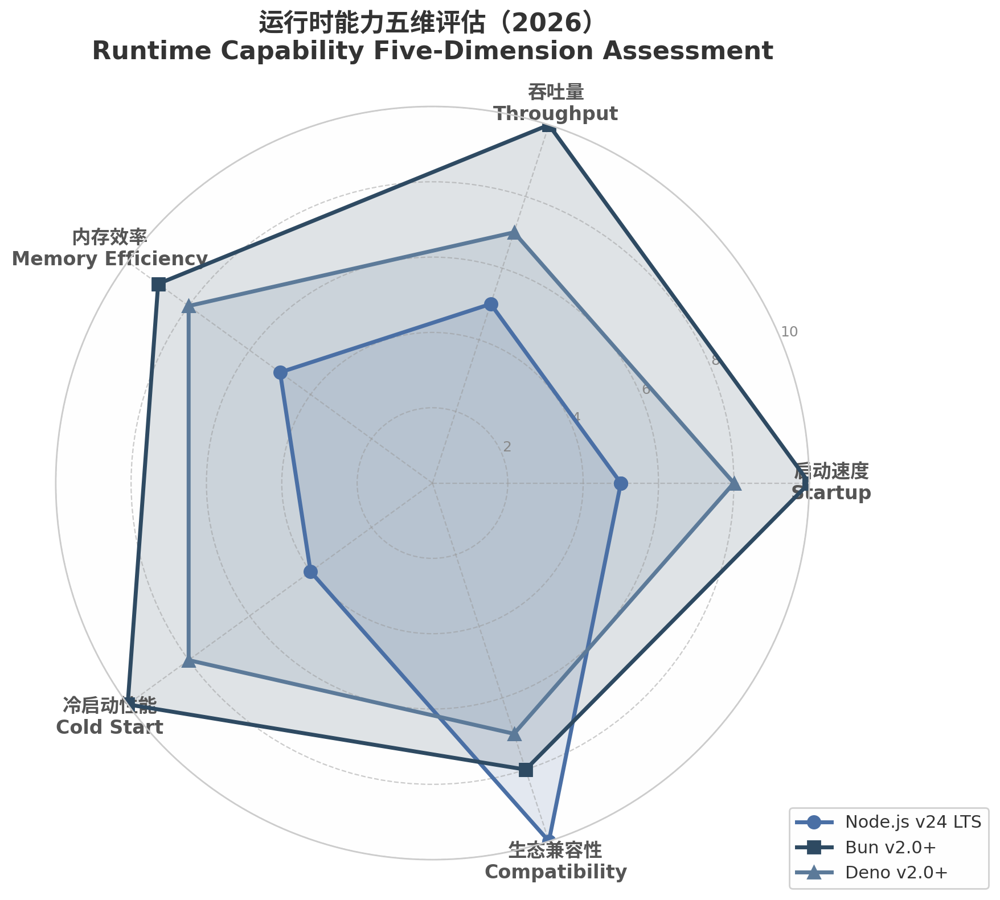

## 4. 运行时生态：执行环境的多维展开（2026）

JavaScript运行时在2026年进入完全成熟期。Node.js、Bun、Deno三者形成了技术特性互补、应用场景分化的"三体"结构——这一格局并非零和竞争，Node.js v24+已系统性采纳竞争对手的先进特性，从原生TypeScript执行到权限模型的引入，生态竞争驱动整体进化[^43^]。与此同时，边缘计算场景催生了基于V8 Isolates的轻量级执行模型，JavaScript正从"浏览器脚本语言"进化为跨越数据中心到网络边缘的通用计算运行时。

### 4.1 运行时三体格局

#### 4.1.1 浏览器运行时——Blink/V8、Gecko/SpiderMonkey、WebKit/JavaScriptCore的技术栈映射

浏览器端的JavaScript运行时构成了服务器端的技术源头。2026年，三大引擎维持稳定分工：Blink/V8（Chrome/Edge）以激进的JIT编译策略领先，其Maglev与TurboFan双层架构提供接近原生的执行效率；Gecko/SpiderMonkey（Firefox）在标准合规性上保持优势；WebKit/JavaScriptCore（Safari）以低内存占用和快速启动著称——这一特性直接影响了Bun选择JavaScriptCore作为其引擎的决策[^46^]。浏览器运行时的技术演进通过Web API标准持续向服务器端渗透，Fetch API、Streams、WebCrypto等标准的普及使"浏览器兼容"成为服务器端运行时评估的重要维度。Bun和Deno自始即将完整Web API标准实现作为核心设计目标，Node.js则经历了从"自定义API优先"到"标准API补全"的渐进过程[^45^]。

#### 4.1.2 Node.js运行时——Libuv事件循环、V8绑定、原生模块系统的架构稳定性与演化

Node.js于2025年10月发布v24 LTS版本（代号"Krypton"），延续了近十五年的核心架构——Libuv事件循环调度异步I/O，V8引擎执行JavaScript，npm作为全球最大的包注册中心已突破200万包[^47^]。根据2025年Stack Overflow调查，Node.js以48.7%的全球开发者使用率稳居Web框架首位[^47^]。v24引入多项关键进化：V8升级至v13.6，npm 11将安装速度提升约65%，内置权限模型从Deno安全模型中汲取了设计灵感，原生TypeScript类型剥离支持零开销直接执行`.ts`文件[^43^]。Node.js的核心竞争力在于深度生态系统集成与企业级运维成熟度——Chrome DevTools集成、成熟APM支持（Datadog、New Relic、Sentry）、以及7年以上的LTS安全审计记录，构成了替代运行时短期内难以复制的运维护城河[^43^]。

#### 4.1.3 替代运行时的崛起——Deno的安全沙箱模型与Bun的Zig重写策略对比

Deno（v2.0+）和Bun（v2.0+）代表了两种截然不同的替代路径。Deno以Rust语言实现，坚持权限沙盒安全模型——默认状态下所有系统资源访问均被禁止，需通过显式授权标志逐一开启[^44^]。该模型在金融、医疗等高安全需求场景中具有结构性优势：被入侵的依赖包无法访问未经授权的资源，从架构层面缓解了供应链攻击风险[^44^]。Deno 2.0于2024年10月发布，其npm兼容性层的成熟使其从"原则性替代方案"转变为"严肃的兼容性竞争者"[^45^]。

Bun采取了以性能为核心的激进策略。以Zig语言重写运行时核心，搭载JavaScriptCore引擎，Bun在多项基准测试中展现出显著优势：HTTP吞吐量达185,000 req/s（Node.js v24约78,000 req/s），冷启动约38ms（Node.js约148ms），包安装速度比npm快10至30倍[^43^]。Bun 2.0将Node.js API兼容性提升至99.7%，并内置bundler、test runner、SQL驱动和S3客户端，形成"一体化工具链"定位[^43^]。2025年12月Bun被Anthropic收购，其与AI基础设施的深度整合成为2026年的新增变量[^44^]。

| 参数 | Node.js (v24 LTS) | Bun (v2.0+) | Deno (v2.0+) |
|:---|:---|:---|:---|
| **JS引擎** | V8 v13.6 | JavaScriptCore | V8 |
| **实现语言** | C++ | Zig | Rust |
| **TS支持** | 类型剥离（零开销） | 原生零配置执行 | 原生零配置执行 |
| **安全模型** | 可选权限模型 | 默认完全访问 | 权限沙盒（默认拒绝） |
| **冷启动（HTTP服务）** | ~148ms [^43^] | ~38ms [^43^] | ~52ms [^43^] |
| **HTTP吞吐量（原生）** | ~78,000 req/s [^43^] | ~185,000 req/s [^43^] | ~142,000 req/s [^43^] |
| **包管理器** | npm 11 / pnpm / yarn | 内置（`bun install`） | 内置 + URL导入 |
| **npm兼容性** | 100% | ~99.7% [^43^] | 通过兼容层 |
| **内存占用（基准HTTP）** | ~55MB [^43^] | ~30MB [^43^] | ~35MB [^43^] |
| **GitHub Stars（2026.04）** | ~110,000 [^46^] | ~76,000 [^46^] | ~95,000 [^48^] |
| **适用场景** | 企业存量/通用 | Serverless/微服务/高性能 | 金融/高安全/边缘计算 |

上表揭示了三者差异化的竞争定位。Node.js在生态兼容性维度保持绝对优势，npm生态与15年运维积累构成高迁移壁垒；Bun在启动速度和吞吐量维度建立了约2至4倍性能优势；Deno在内存效率与安全模型间实现了最佳平衡，40MB的单一二进制分发包在边缘节点部署中具备体积优势[^48^]。这种"各有所长"的格局意味着2026年的技术决策已从"选择唯一运行时"转变为"为特定工作负载选择最优运行时"的混合策略模式。

### 4.2 并发模型的统一与分化

#### 4.2.1 事件循环的形式语义——宏任务/微任务/动画帧的优先级调度机制

JavaScript的并发基础建立于事件循环的单线程协作调度模型。同步代码执行完毕后，运行时依次处理微任务（microtask）队列、渲染帧（animation frame），最后从宏任务（macrotask）队列取出下一个任务执行[^87^]。微任务（Promise.then、async/await的隐式调度）具有最高优先级——即便`setTimeout(..., 0)`已预先排队，Promise回调仍将先于其执行[^88^]。Node.js通过`process.nextTick`引入了"超优先级"回调层，其队列甚至优先于Promise微任务，但过度使用可能导致I/O饥饿——nextTick队列耗尽前事件循环无法进入下一阶段[^88^]。libuv将宏任务划分为timers、pending callbacks、poll、check、close callbacks六个阶段，形成比浏览器更复杂的调度拓扑[^110^]。

#### 4.2.2 Web Workers与Worker Threads：浏览器端与服务器端并发模型的非对称性

Web Workers与Node.js Worker Threads提供了突破单线程限制的能力，但设计约束存在结构性差异。浏览器端的Web Workers运行于完全隔离的全局上下文，无权访问DOM，通信仅能通过`postMessage`实现结构化克隆[^93^]。Node.js的`worker_threads`模块通过`SharedArrayBuffer`和`Atomics` API引入了共享内存并行，Worker Threads可直接操作同一内存缓冲区，使用`Atomics.add`、`Atomics.compareExchange`等原子操作避免竞态条件[^113^]。边缘计算运行时在并发维度呈现第三种形态——Cloudflare Workers等平台将每个请求置于独立V8 Isolate中，并行性通过请求级水平扩展实现，单个Isolate内部仍是单线程事件循环[^110^]。

#### 4.2.3 Structured Concurrency的引入——Atomics、SharedArrayBuffer的内存模型与安全边界

`SharedArrayBuffer`与`Atomics` API构成了JavaScript共享内存并发的技术基础，其内存模型遵循Sequential Consistency for Data Race Free（SC for DRF）语义——数据竞争自由的程序表现出顺序一致性，而存在数据竞争的程序行为未定义[^113^]。2025年发布的ES2025标准新增了`Atomics.pause`指令，为自旋等待场景提供了CPU效率优化[^117^]。TC39的TaskGroup/Concurrency Control提案正致力于提供更高级别的结构化并发抽象，承诺引入可预测的任务生命周期和统一取消模式[^110^]。在提案成熟之前，生产环境中的并发策略应遵循"消息传递优先，共享内存审慎"的原则——消息传递的隐式数据隔离避免了死锁和竞态条件等并发陷阱，在绝大多数场景下已足够。

### 4.3 模块系统的历史债务与统一

#### 4.3.1 ESM/CJS/IIFE的三模共存现状——模块解析算法的形式差异与互操作成本

2026年JavaScript模块系统仍处于ECMAScript Modules（ESM）、CommonJS（CJS）和IIFE三模共存状态。ESM支持静态导入导出、顶层await和树摇优化；CJS依赖`require()`的同步运行时解析；IIFE以自执行函数形式在浏览器端实现模块封装[^89^]。两者的根本性差异在于解析时序——ESM的导入依赖在代码执行前完成静态解析，CJS的`require()`在运行时动态解析。Node.js v22通过`require(esm)`功能打破了这一僵局，允许CommonJS模块直接加载不含顶层await的ESM模块[^89^]。配合`package.json`条件导出字段，库作者可通过`import`和`require`键分别为双模消费者提供适配入口[^90^]。

#### 4.3.2 条件导出（Conditional Exports）与子路径导入（Subpath Imports）的工程实践

条件导出通过`exports`字段将模块解析逻辑从消费者转移至发布者。典型双模配置声明`types`、`import`、`require`和`default`四个条件键，Node.js模块解析器根据导入上下文自动选择匹配入口[^89^]。子路径导入则通过`exports`字段声明子路径别名，解决深层模块导入路径的稳定性问题——库作者可暴露稳定的公共接口，将内部结构调整对消费者透明。条件导出中的`types`键需置于首位以确保类型解析器优先匹配——Node.js按声明顺序匹配，首个满足条件即终止解析[^96^]。

#### 4.3.3 TypeScript模块解析策略：Bundler/Node/Classic三种模式的选择决策树

TypeScript 5.x提供三种模块解析策略。`moduleResolution: "bundler"`（2026年新建项目推荐）模拟打包器行为，支持条件导出和子路径导入，无需显式声明文件扩展名[^89^]。`"node16"`模式严格遵循Node.js ESM/CJS双模解析规则，要求ESM导入包含`.js`扩展名——适用于需精确对齐Node.js运行时行为的库开发[^96^]。`"classic"`模式已基本淘汰。常见配置陷阱是在`tsconfig.json`中设置`"module": "ESNext"`的同时使用`"moduleResolution": "node"`，导致模块解析行为与实际打包器不一致。正确组合应为`"module": "ESNext", "moduleResolution": "bundler"`（前端项目）或`"module": "NodeNext", "moduleResolution": "nodenext"`（Node.js库项目）[^96^]。

### 4.4 运行时生态2026全景评估

#### 4.4.1 运行时能力矩阵对比表：启动时间、吞吐量、内存占用、冷启动、兼容性五维评估

| 评估维度 | Node.js v24 LTS | Bun v2.0+ | Deno v2.0+ | 数据来源 |
|:---|:---|:---|:---|:---|
| **启动时间** | 基准（~148ms） | **~38ms**（快3.9x） | ~52ms（快2.8x） | M3 MacBook Pro [^43^] |
| **HTTP吞吐量** | ~78,000 req/s | **~185,000 req/s**（高2.4x） | ~142,000 req/s（高1.8x） | TechEmpower风格基准 [^43^] |
| **内存占用** | ~55MB 基准 | **~30MB**（省45%） | ~35MB（省36%） | 单一HTTP服务进程 [^43^] |
| **冷启动（Lambda重函数）** | ~245ms | **~156ms**（快36%） | ~200ms（快18%） | AWS Lambda生产实测 [^44^] |
| **生态兼容性** | **100%（基准）** | ~99.7% | 通过npm兼容层 | 前1000包测试 [^43^] |
| **包安装速度** | npm 28.7s / pnpm 12.4s | **2.1s**（快13.7x） | N/A（URL导入） | 800依赖冷安装 [^43^] |
| **安全模型成熟度** | 可选权限（已知CVE绕过） | 无运行时沙盒 | **权限沙盒（默认拒绝）** | 安全审计报告 [^44^] |

上述雷达图将定量基准数据归一化至0-10评分空间。Node.js的轮廓呈"兼容性极值型"——生态兼容性满分，但启动速度和冷启动性能明显落后。Bun的轮廓接近"性能全优型"，在启动时间、吞吐量和冷启动三个维度均领先。Deno的轮廓呈"均衡安全型"，各维度表现均处于中上水平，无显著短板。这种差异化的能力分布决定了2026年的运行时选择不再是"择一而从"的零和决策，而是基于工作负载特征的匹配优化。

**定理3（运行时收敛定理）**：2026年的运行时边界正在系统性模糊。Node.js v24+已从竞争对手处采纳原生Fetch API、内置test runner、watch-mode和权限模型等特性；Bun通过99.7% API兼容性向Node.js生态靠拢；Deno通过npm兼容层弥合生态鸿沟。这一收敛趋势表明运行时竞争驱动的不是替代关系，而是整体生态的协同进化。2026年的工程实践趋势是混合部署策略——Node.js承载主服务与存量代码，Bun驱动Serverless边缘函数，Deno处理敏感计算任务——通过运行时层面的专业分工最大化整体系统效能[^43^]。

#### 4.4.2 边缘计算运行时的崛起——Cloudflare Workers、Vercel Edge Runtime的隔离模型与约束

边缘计算代表了2026年JavaScript运行时最具变革性的应用形态。Cloudflare Workers基于V8 Isolates的执行模型将JavaScript推向"边缘计算原生语言"——V8 Isolate作为轻量级沙箱上下文，可在单个操作系统进程内同时运行数千个实例，启动速度比Node.js进程快约100倍，内存消耗低一个数量级[^85^]。其安全模型基于"指针笼"（pointer cage）技术：V8在8GB虚拟地址空间内约束所有指针访问，即使攻击者利用内存漏洞，破坏范围也被限制在单个Isolate内[^98^]。2026年4月Cloudflare推出的Dynamic Workers将这一能力扩展至AI Agent场景，允许运行时动态实例化新Worker，每个Agent生成的代码在独立Isolate中安全执行[^99^]。

然而边缘运行时的局限性同样显著。Vercel Edge Runtime的实践表明，当数据存储仍位于中心化区域时，边缘计算的延迟优势被数据库查询的往返时间抵消——"If your data isn't at the edge, your compute shouldn't be either"[^108^]。这一"数据引力"问题促使Vercel于2025年转向Fluid Compute，一种基于实例复用和并发处理的Node.js运行时模型[^108^]。Cloudflare的解决方案则是将数据层同样推向边缘——D1 SQLite数据库、KV键值存储、Durable Objects状态管理实现了计算与数据的区域共置。截至2026年，Cloudflare已原生实现11个核心Node.js模块，使得Express、Koa等主流框架可在Workers上直接运行[^108^]。

从绿色计算（Green Computing）的视角审视，V8 Isolates的资源效率具有直接的ESG策略价值。传统容器模型为每个函数调用承担完整操作系统进程开销，Isolate模型通过进程级共享将边际内存消耗降至接近零。当边缘节点以百万级调用规模运行时，这种效率差异转化为可量化的能耗降低——JavaScript作为边缘计算语言的选择，不仅是技术决策，也是企业可持续发展目标的工程映射[^95^]。
