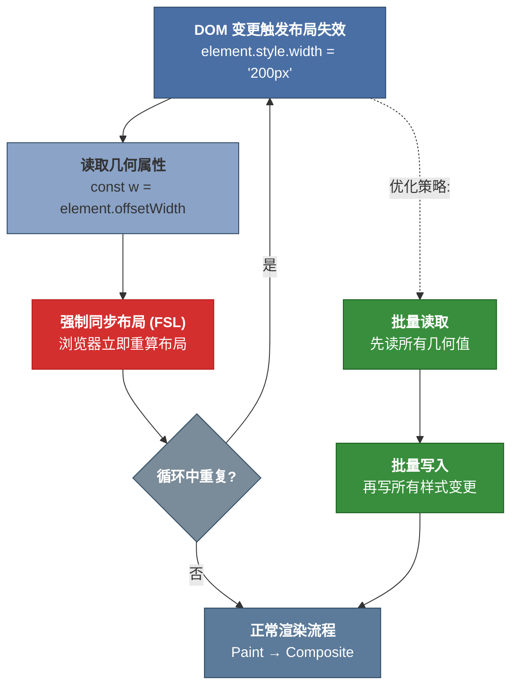

## 5. 浏览器渲染管道：从代码到像素的转化链

浏览器将 HTML、CSS 与 JavaScript 转化为屏幕像素的过程，是前端工程领域中最为精密且最易被忽视的系统性工程。每一次视觉更新——无论是一次按钮点击后的状态反馈，还是滚动条拖拽时的连续位移动画——都必须经过一条严格有序的转化链（Pixel Pipeline）。这条管道的效率直接决定了用户感知的交互流畅度。本章将以 Chromium 架构为核心参照，系统论证 Pixel Pipeline 的五阶段形式模型，揭示三种渲染路径的性能本体差异，并证明合成优先定理在现代前端架构中的支配性地位。

### 5.1 Pixel Pipeline五阶段的形式模型

浏览器每次屏幕更新遵循一个固定的阶段序列：JavaScript → Style → Layout → Paint → Composite [^45^]。各阶段之间存在严格的单向依赖关系——若某一阶段被触发，其后的所有阶段均须重新执行，无法跳过。理解这一约束是性能优化的先决条件。

*图注：Pixel Pipeline 五阶段流程。箭头表示单向数据流与阶段依赖关系。一旦某阶段被触发，后续所有阶段必须顺序执行。布局阶段（Layout）为计算瓶颈，合成阶段（Composite）为 GPU 卸载点。*

#### 5.1.1 JavaScript执行阶段——主线程脚本执行、事件处理、状态变更的时序约束

JavaScript 执行阶段涵盖所有在主线程（Main Thread）上运行的脚本逻辑，包括事件处理程序、状态管理代码、DOM 操作以及 `requestAnimationFrame` 回调。该阶段的时序约束极为严格：浏览器必须在单线程上依次处理 JavaScript 执行、样式计算和布局运算，任何耗时操作都会直接压缩后续阶段的可用时间窗口。

主线程的独占性构成了浏览器渲染的根本瓶颈。当 JavaScript 执行时间超过帧预算的剩余容量时，浏览器不得不推迟视觉更新，造成用户可感知的卡顿。INP（Interaction to Next Paint）指标正是对这一延迟的量化度量：该指标要求 75% 的用户交互从输入到下一帧绘制完成的时间控制在 200ms 以内方可评定为"良好" [^86^][^93^]。INP 于 2024 年 3 月取代 FID（First Input Delay）成为 Core Web Vitals 正式指标，反映出业界对交互全生命周期延迟的关注已从"首次输入延迟"扩展至"所有交互的端到端响应性" [^86^]。

#### 5.1.2 样式计算阶段（Style）——CSSOM与DOM的合并、选择器匹配、继承与级联的算法复杂度

样式计算阶段的核心任务是将 DOM 树与 CSSOM（CSS Object Model）合并，为每个可见元素生成最终计算样式（Computed Style）。此阶段的算法复杂度主要来自两个维度：选择器匹配的遍历开销与级联规则的解析成本。

当 CSS 选择器嵌套层级较深时——例如 `div.container > ul li:nth-child(odd) a.active::before`——浏览器必须执行大量的祖先-后代关系遍历以确定匹配范围 [^132^]。虽然现代浏览器通过规则哈希表和共享样式结构（Style Sharing）大幅优化了匹配效率，但在包含数千个元素的复杂页面上，样式重计算（Recalculate Style）仍可能成为显著的性能瓶颈。Chrome DevTools 的性能面板中，紫色块即标识样式重计算阶段；若该块持续时间超过 5ms，通常意味着选择器复杂度或样式变更范围需要优化 [^52^]。

#### 5.1.3 布局阶段（Layout/Reflow）——盒模型、流式布局、弹性/网格布局的约束求解

布局阶段是 Pixel Pipeline 中计算成本最高的环节。浏览器在此阶段根据计算样式求解每个元素的几何属性——位置、尺寸、边距、偏移量——这一过程在浏览器引擎中称为 Reflow。由于 Web 的布局模型本质上是全局性的，单一元素的几何变更可能触发级联重算，波及大量无关元素。

Paul Irish 与 Paul Lewis 的研究表明，触发布局的属性（如 `width`、`height`、`top`、`left`、`margin`）其渲染成本可达仅触发合成操作的 10-100 倍 [^132^]。弹性布局（Flexbox）和网格布局（Grid）虽然在表达能力上远超传统流式布局，但其约束求解算法的复杂度亦相应提升。具体而言，Flexbox 的一维分布算法和 Grid 的二维轨道分配均需迭代求解，在深层嵌套或频繁更新的场景下，单次布局计算消耗数毫秒并不罕见——这在 16.67ms 的帧预算中占据了不可忽略的比例。

#### 5.1.4 绘制阶段（Paint）——绘制记录、图层分解、绘制顺序的确定性保证

布局完成后，浏览器进入绘制阶段。该阶段并不直接填充像素，而是生成一组绘制指令（Display List 或 SkPicture），描述如何将各元素渲染为位图。绘制阶段的核心任务是确定绘制顺序并分解图层——浏览器必须确保堆叠上下文（Stacking Context）的正确性，以保证视觉输出的确定性。

绘制阶段的一个重要优化是图层提升（Layer Promotion）。当元素满足特定条件——如拥有 `transform` 或 `opacity` 动画、嵌入 `<video>` 或 `<canvas>`、或应用了 `will-change` 提示——浏览器会将其提升为独立的合成层（Compositor Layer），其绘制结果存储为 GPU 纹理。一个全高清（1920×1080）合成层在 1× DPR 设备上约占用 8MB GPU 内存，在 2× DPR（Retina）设备上则膨胀至约 32MB [^136^]。图层提升虽能换取合成阶段的并行性，但过度使用将导致 GPU 内存压力乃至性能衰退，这一权衡在共享内存架构的移动设备上尤为关键。

#### 5.1.5 合成阶段（Composite）——GPU纹理合成、层提升策略、光栅化的硬件加速路径

合成阶段是 Pixel Pipeline 的最后环节，也是唯一一个在合成器线程（Compositor Thread）上独立执行的阶段。Compositor Thread 的设计初衷是解决一个根本性矛盾：主线程无法同时执行 JavaScript 与生成视觉更新 [^111^]。通过将帧组装（frame assembly）委托给独立线程，浏览器得以在用户滚动或执行动画时保持视觉响应，即使主线程正忙于脚本运算。

合成器架构的核心机制是 Commit——主线程将更新后的层树（Layer Tree）和绘制记录同步至合成器线程的副本（pending tree），合成器线程据此生成最终帧。Commit 过程会短暂阻塞主线程，但其耗时远小于完整布局-绘制周期 [^114^]。合成器还实现了输入事件的前置处理：滚动事件可直接由合成器线程响应，无需等待主线程的 JavaScript 处理完毕，这是浏览器能够实现"丝滑滚动"的架构基础 [^120^]。

### 5.2 渲染性能的结构性优化

理解 Pixel Pipeline 的形式模型后，优化的本质可被精确表述为：在严格的帧预算约束下，最小化必须执行的管道阶段数量，并将尽可能多的工作卸载至非主线程路径。

#### 5.2.1 帧预算模型——16.67ms/帧的时间分配策略与关键路径识别

以 60fps 为目标的渲染系统，每帧的理论时间预算为 $16.67\ \text{ms}$（$1000 \div 60$）。然而，浏览器自身的开销——包括合成、VSync 对齐、垃圾回收以及不可预测的系统中断——将实际可用时间压缩至约 10ms [^45^][^110^]。这意味着开发者的 JavaScript 执行、样式计算与布局求解必须在 10ms 内完成，否则将触发丢帧（Dropped Frame）。

帧预算的分配策略遵循关键路径优先原则：视觉反馈相关的代码（如交互动画、滚动响应）应独占最优先的时间配额；非关键工作（如分析上报、日志记录）应通过 `requestIdleCallback` 推迟至帧间隙执行 [^117^]。当帧内工作无法压缩时，可借助 `scheduler.yield()` 将长任务拆分为 50ms 以下的子任务，允许用户交互在处理间隙得到响应 [^89^]。

#### 5.2.2 强制同步布局（Forced Synchronous Layout）的形成机制与规避策略

强制同步布局（Forced Synchronous Layout，FSL）是 Pixel Pipeline 中最具破坏性的性能反模式之一。其形成机制遵循一个精确的因果链：当 JavaScript 代码在修改 DOM 样式后立即读取布局属性（如 `offsetWidth`、`clientHeight`、`getBoundingClientRect()`），浏览器被迫中断正常的批处理流程，立即执行布局计算以返回准确的几何信息 [^46^][^61^]。

*图注：强制同步布局（FSL）形成机制与规避策略决策树。红色路径为性能反模式（读写交错触发 FSL），绿色路径为优化方案（先批量读取、后批量写入）。单次 FSL 虽未必致命，但循环内的重复读写将导致布局抖动（Layout Thrashing）。*

若上述读写交错模式发生在循环内部，则形成布局抖动（Layout Thrashing）——浏览器被迫在每轮迭代中重复执行布局计算，时间复杂度从 $O(1)$ 退化为 $O(n)$ [^47^]。规避策略遵循"读优先写"（Read-Before-Write）原则：在一次事件中集中读取所有布局属性，缓存至局部变量，然后批量执行样式写入。这一简单的重构通常可消除 89% 以上的强制回流触发点 [^59^]。

#### 5.2.3 虚拟DOM的算法经济学——Diff/Patch的O(n)启发式与渲染管道的交互效应

虚拟 DOM（Virtual DOM）作为 React、Vue 等框架的核心抽象，其经济学本质在于以内存中的轻量级 JavaScript 对象树模拟真实 DOM，通过 Diff/Patch 算法最小化对浏览器的实际 DOM 操作。传统树 diff 算法的时间复杂度为 $O(n^3)$——比较两棵任意树的所有可能变换方式在计算上是不可行的 [^87^]。React 通过三项启发式策略将其降至 $O(n)$：第一，假设不同类型元素产生不同树形结构，类型变更时直接替换整棵子树；第二，对同级子元素使用 `key` 属性进行标识匹配，避免不必要的节点重建；第三，将 Diff 过程拆分为可中断的工作单元（Fiber），允许高优先级更新（如用户输入）抢占低优先级渲染 [^109^]。

虚拟 DOM 与浏览器渲染管道的交互效应值得深入审视。Fiber 架构的"时间切片"（Time Slicing）机制将渲染工作分解为小于 5ms 的微任务，在调度层面避免了长任务阻塞主线程。然而，虚拟 DOM 并不能绕过 Pixel Pipeline 的物理约束——每次 Commit 阶段触发的真实 DOM 变更仍须经历完整的 Style → Layout → Paint → Composite 流程。因此，虚拟 DOM 的收益边界在于"减少 DOM 操作次数"而非"降低单次操作成本"。对于仅需合成阶段处理的属性变更（如 `transform`/`opacity`），虚拟 DOM 的批处理优势相对有限；但对于触发布局的属性变更，合理设计的组件更新策略仍能通过合并多次变更为单一 Reflow 来获取显著收益。

### 5.3 现代渲染架构演进

#### 5.3.1 渲染NG（RenderingNG）——Chromium的分阶段提交、合成器线程隔离、Viz服务体系

RenderingNG 是 Chromium 于 2021-2023 年间逐步推出的渲染架构重大重构。其核心设计目标是将渲染流程从主线程解耦，建立多阶段提交（phased commit）与线程隔离的现代化体系。RenderingNG 引入了三棵树架构——主线程树（Main Tree）、待提交树（Pending Tree）与激活树（Active Tree）——主线程的变更首先进入 Pending Tree，待光栅化完成后方可激活为 Active Tree，从而避免视觉闪烁 [^111^]。

Viz 服务（Visual Service）是 RenderingNG 的另一关键组件。它将合成工作从渲染进程（Renderer Process）抽取至独立的 GPU 进程，负责跨窗口、跨 iframe 的帧聚合与显示输出。Viz 体系使浏览器能够在多进程环境下实现统一的合成调度，为多视图应用（如多标签页、画中画视频）提供了架构层面的性能隔离。合成器线程与 Viz 服务的协作模式遵循严格单向依赖：主线程 → 合成器线程 → Viz → GPU，反向通信仅通过异步回调实现，杜绝了跨线程同步等待的可能性 [^111^][^114^]。

#### 5.3.2 WebGPU的引入对渲染管道的影响——从Canvas 2D/WebGL到新一代图形API的迁移路径

WebGPU 作为 W3C 候选推荐标准，于 2025 年 11 月实现四大主流浏览器（Chrome、Firefox、Safari、Edge）的全面默认支持，标志着 Web 图形 API 进入新纪元 [^91^]。与基于 OpenGL ES 的 WebGL 不同，WebGPU 从现代底层 API（Vulkan、Metal、Direct3D 12）中汲取设计灵感，采用显式资源管理、预编译管线与命令缓冲区提交模型，从根本上改变了浏览器与 GPU 的交互方式。

| 对比维度 | Canvas 2D / WebGL | WebGPU |
|---------|------------------|--------|
| 状态验证 | 每帧运行时验证 | 管线创建时预验证 [^122^] |
| 绘制调用开销 | 高（逐调用状态跟踪） | 低（Render Bundle 预录复用） [^127^] |
| 计算能力 | 无原生 GPGPU 支持 | 原生 Compute Shader [^125^] |
| 命令提交模型 | 即时执行 | 命令缓冲区批量异步提交 [^126^] |
| 多线程支持 | 受限 | Web Worker 并行命令生成 [^127^] |
| 浏览器支持（2025） | 全平台 | 全平台默认开启 [^91^] |

*表注：WebGPU 与 Canvas 2D/WebGL 在渲染架构层面的核心差异。WebGPU 通过将状态验证前移至管线创建阶段，消除了运行时每绘制调用的 CPU 开销，使 100,000+ 对象的场景可达 120+ FPS [^127^]。*

WebGPU 对浏览器渲染管道的影响并非替代 Pixel Pipeline，而是在其下游开辟了一条并行的硬件加速路径。`<canvas>` 元素上的 WebGPU 内容直接通过 Viz 服务合成至最终帧，绕过了 DOM 渲染的主线程管道。对于混合内容页面（DOM + WebGPU），浏览器采用双路径合成：DOM 内容按传统五阶段管道处理，WebGPU 内容通过显式命令缓冲直接提交 GPU。这一架构使 WebGPU 特别适合高频重绘场景——Babylon.js 的 Snapshot Rendering 功能借助 WebGPU Render Bundles 实现了渲染命令的"录制一次、多次回放"，显著降低了每帧 CPU 开销 [^91^][^122^]。

#### 5.3.3 跨文档渲染——View Transitions API、Portals的导航体验连续性保障

页面导航过程中的视觉连续性是现代 Web 应用尚未充分解决的体验断层。View Transitions API 与 Portals API 代表了两种互补的技术路径。

View Transitions API 通过捕获 DOM 变更前后的 UI 快照，并利用 CSS 动画在两态之间插值，实现了导航转场的声明式编排。其核心优势在于：转场动画由浏览器在 Compositor Thread 上通过 GPU 层合成执行，因此即使主线程被 JavaScript 阻塞或页面正在重渲染，动画仍能保持 60fps 流畅度 [^50^]。`view-transition-name` CSS 属性允许开发者标记应独立参与转场的元素，实现卡片扩展、图片变形等复杂效果，而无需手动计算几何插值。同文档转场（`startViewTransition()`）已在 Chrome、Edge 和 Safari 18+ 中支持；跨文档转场（`@view-transition { navigation: auto }`）则要求 Chrome/Edge 126+ [^50^][^60^]。

Portals API 提供了另一种导航连续性范式：`<portal>` 元素允许在当前页面中预渲染目标页面的内容，并通过激活（activation）操作实现无缝的视觉过渡。Portals 的差异化能力在于目标文档可在后台完成加载与初始化，用户感知到的导航延迟仅剩下激活动画本身的时长。该技术尤其适用于多页应用（MPA）中可预测跳转路径的预加载优化 [^112^]。

---

**三种渲染路径的性能对比矩阵**是理解本节全部内容的核心框架。下表系统梳理了不同 CSS 属性变更所触发的管道阶段及其性能特征：

| 维度 | 完整管道（Full Pipeline） | 绘制+合成（Paint + Composite） | 仅合成（Composite Only） |
|------|--------------------------|------------------------------|------------------------|
| **触发属性示例** | `width`, `height`, `top`, `left`, `margin`, `padding`, `font-size`, `display` | `color`, `background-color`, `box-shadow`, `border-color`, `visibility` | `transform`, `opacity` |
| **经过阶段** | JS → Style → Layout → Paint → Composite | JS → Style → Paint → Composite | JS → Style → Composite |
| **布局计算** | 全部重算（全局级联） | 跳过 | 跳过 |
| **绘制指令** | 重新生成 | 重新生成 | 跳过 |
| **合成操作** | GPU 层合成 | GPU 层合成 | GPU 直接变形 |
| **主线程参与** | 全阶段阻塞 | 阻塞至 Paint | 仅 Style，动画脱离主线程 |
| **性能成本** | 最高（10-100× 基准）[^132^] | 中等 | 最低（GPU 独占） |
| **适用场景** | 结构性页面变更 | 视觉属性微调 | 高频动画、滚动、拖拽 |
| **帧率保障** | 难以维持 60fps | 视内容面积而定 | 稳定 60fps+ |

*表注：三种渲染路径对比矩阵。"完整管道"触发 Layout 的级联重算，成本最高；"仅合成"路径完全依赖 GPU 的 Compositor Thread，是唯一能确保主线程阻塞时动画仍流畅的选项。从完整管道降级至仅合成，性能提升可达两个数量级 [^132^]。*

上述矩阵严格证明了**合成优先定理**：`transform: translate()` 与 `top/left` 动画在视觉输出上完全等价，但前者跳过 Layout 与 Paint 阶段，由 Compositor Thread 独立处理，因此即使主线程被长任务 JavaScript 完全阻塞，动画仍可维持流畅帧率 [^111^]。这一性能差异并非渐进优化，而是数量级的架构跃迁——在中端移动设备上，`left` 动画的帧率约为 25 FPS，切换为 `transform: translateX()` 后可立即达到稳定的 60 FPS [^132^]。对于前端架构师而言，这意味着所有视觉位移操作——包括动画、过渡、拖拽反馈——均应优先使用 `transform` 与 `opacity`，将 Layout 触发属性严格限制在真正需要改变文档几何结构的场景。

与此同时，`content-visibility: auto` 为长页面提供了延迟渲染机制：视口外的元素跳过 Layout 与 Paint 计算，直至接近可视区域时才被激活。Chrome 文档报告该技术可为内容密集型页面带来约 7 倍的渲染性能提升 [^88^]，与虚拟滚动（Virtual Scrolling）结合使用时，可将复杂列表的首次渲染时间控制在可接受范围内。这四类策略——仅合成动画、`content-visibility` 延迟、虚拟化裁剪、输入防抖节流——共同构成了现代渲染性能优化的核心技术矩阵。
