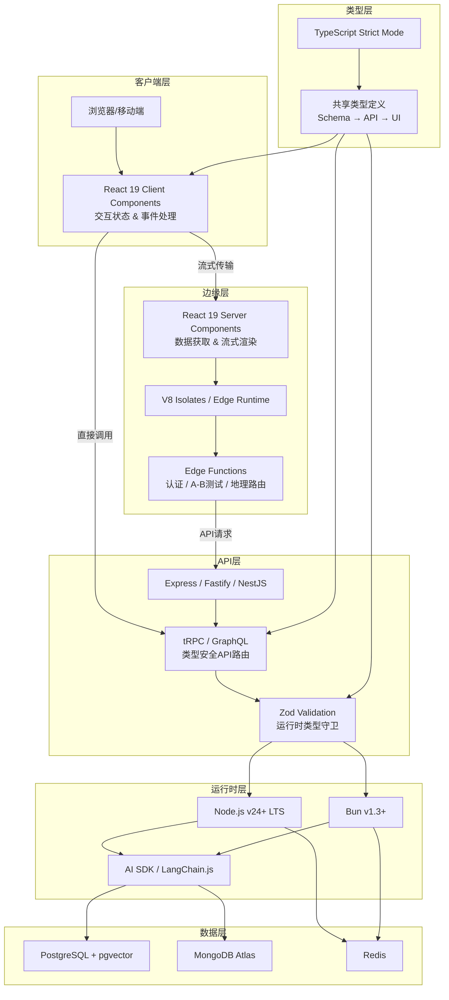

## 6. 全栈架构：统一语言栈的认知经济学

### 6.1 MERN 2026：统一语言栈的架构演化

全栈JavaScript的核心优势常被简化为"代码复用"，但其深层价值在于**认知模型的统一**——从React组件到Express API再到数据库查询层使用同一语言，团队无需在语法范式、调试工具和文档生态之间进行高成本的上下文切换。Node.js采用数据表明，85%使用Node.js的企业报告开发者生产力提升直接归因于JavaScript全栈能力[^103^]。以下从六个层级分析MERN栈的结构性演化。

#### 6.1.1 MongoDB→PostgreSQL的结构性回归——关系模型的持久价值与NoSQL的边界重定位

Stack Overflow 2025年开发者调查（49,000余名受访者）揭示了深刻的生态位重构：PostgreSQL以55.6%的采用率跃居首位，较2024年增长7个百分点，为有史以来最大的单年增幅；同期MongoDB采用率下降0.7%[^48^]。JetBrains 2025年调查（24,534名开发者）进一步确认：PostgreSQL在AI使用者中的采用率高达59.5%[^48^]。

这一回归的驱动力来自三个维度：其一，AI原生应用对向量检索的需求使pgvector成为PostgreSQL的杀手级特性；其二，Drizzle ORM和Prisma的成熟消除了MongoDB在开发者体验上的原有优势[^51^]；其三，PostgreSQL的JSONB类型在保持ACID事务的同时提供了半结构化数据能力。2026年的务实选择是：新项目默认PostgreSQL，仅在高度不规则的数据模型场景保留MongoDB[^51^]。

#### 6.1.2 Express/Fastify/NestJS的服务端框架竞争格局——从微框架到全功能框架的频谱

服务端框架光谱在2026年呈现三极分化。Express仍是存量代码的基准线，但缺乏内置TypeScript支持使其在新建项目中吸引力下降。Fastify凭借2倍至4倍于Express的吞吐性能占据性能敏感场景[^90^]。最具结构意义的是NestJS的崛起：GitHub 73.9k stars，全球18,701家公司采用，6.7%的Stack Overflow受访者正在使用[^87^]。NestJS的核心竞争力在于为Node.js引入了依赖注入、模块化架构等成熟工程实践，其TypeScript原生设计带来40%代码可维护性增益，新开发者上手时间缩短50%[^93^]。框架选择逻辑已从"选最快的"转向"选最适配组织成熟度的"：Express适合原型，Fastify适合高吞吐API，NestJS适合需要严格架构约束的企业应用。

#### 6.1.3 React Server Components的架构范式转移——服务端/客户端组件边界的形式定义

React Server Components（RSC）将组件树划分为在服务端执行的Server Components（SC）和在客户端执行的Client Components（CC），在组件级别实现了服务端渲染的精确控制。2025年，45%的新React项目采用Server Components[^49^]。RSC消除了传统SSR中"全量注水"的成本——SC直接访问数据库，将数据获取逻辑从客户端剥离。Next.js App Router通过`"use client"`指令显式标记客户端边界，流式传输机制配合`Suspense`实现渐进式渲染，显著改善TTFB和TTI。对统一语言栈团队而言，RSC意味着React组件的知识模型可自然延伸到数据层，无需在前后端语义间切换。

#### 6.1.4 Node.js运行时作为服务器层的稳定性评估与替代运行时的可行性分析

Node.js在2026年以87.3%市场份额主导服务端JavaScript[^89^]，但"三体竞争"格局改变了决策维度。Bun在合成基准测试中展示4倍HTTP吞吐量，冷启动仅290ms（较Node的940ms快69%），内存占用减少25–40%[^70^]。然而，生产级应用（含路由、验证和数据库操作）中Bun与Node的差距收窄至不足3%[^70^]，揭示了"基准测试陷阱"。Node.js v24+的Permission Model提供粒度化安全沙箱，而Bun缺乏运行时权限模型[^70^]。2026年的务实策略是混合架构：Node.js v24 LTS承载核心业务，Bun用于性能敏感的Serverless函数，Deno用于安全关键场景。

**表1：MERN栈2020 vs 2026六层演化对比矩阵**

| 架构层级 | 2020形态 | 2026形态 | 演化逻辑 | 关键驱动力 |
|---------|---------|---------|---------|-----------|
| **数据层** | MongoDB本地部署 | PostgreSQL+pgvector为主，MongoDB Atlas为辅 | 关系模型的结构性回归，向量检索成为标配 | AI应用需求；JSONB削减NoSQL差异化优势[^48^][^51^] |
| **API层** | Express.js单一框架 | Express（存量）/ Fastify（高性能）/ NestJS（企业级） | 从微框架到全功能框架的光谱化 | 组织成熟度差异；性能vs架构约束权衡[^87^][^90^] |
| **前端层** | React CSR | React 19 Server Components + Next.js App Router | 服务端/客户端组件边界的形式化定义 | 首屏性能需求；流式传输架构[^49^] |
| **运行时** | Node.js垄断 | Node.js v24 LTS（主力）+ Bun（高性能）+ Edge Functions（边缘） | 三体竞争驱动的生态进化 | 冷启动优化；内存效率；安全模型差异[^70^][^89^] |
| **类型层** | 无系统类型 | TypeScript Strict + Zod运行时验证 | 编译时与运行时类型安全双重保障 | 端到端类型安全需求；42%生产错误减少[^96^] |
| **AI层** | 无 | LangChain.js / Vercel AI SDK / AI Gateway | Agentic工作流的平台层集成 | LLM应用原生化；边缘推理需求[^43^] |

该矩阵揭示：2020年的MERN栈是相对固定的技术组合，2026年的"MERN+"已演化为**分层可替换的架构框架**——每一层都存在多个经生产验证的选择，决策依据从"社区默认"转向"场景适配"。

下图展示2026年MERN架构的六层拓扑：

架构图的核心设计意图在于展示**类型层作为横向关注点贯穿所有垂直层**的独特地位。TypeScript不仅是开发时工具，更是架构一致性的约束机制——共享类型定义在数据库Schema、API契约和UI组件之间建立了单向传播管道。

### 6.2 端到端类型安全的实现路径

#### 6.2.1 tRPC/GraphQL Codegen/RSC的类型传播机制——从数据库Schema到UI组件的类型管道

统一语言栈的类型安全关键在于建立从数据库到UI的**单向类型传播管道**。tRPC将router定义直接导出为TypeScript类型，修改后端schema后前端在编译期即收到错误，无需代码生成。Airbnb 2025年研究显示，严格端到端类型系统使"unexpected undefined"错误减少38%至62%，生产错误总量下降15%[^96^]。GraphQL Codegen通过解析schema生成TypeScript类型，优势在于语言无关的API契约，代价是额外的构建复杂度。RSC代表第三条路径：SC直接在后端执行，props类型可与数据库查询返回值直接对齐。Prisma通过生成步骤产出类型，Drizzle以TypeScript原生schema实现零生成步骤的类型推断[^99^]。

#### 6.2.2 全栈类型共享的架构模式——Monorepo工具链对类型一致性的支撑

端到端类型安全要求Monorepo架构作为工程基础。Turborepo和Nx通过远程缓存将全栈类型检查从分钟级压缩至秒级。典型架构将`packages/database`（含Prisma/Drizzle schema）作为独立模块被前后端同时依赖。Prisma 7（2025年11月）将Rust引擎替换为TypeScript/WASM，bundle大小从14MB缩减至1.6MB[^100^]。Drizzle以更激进的轻量哲学占据另一极——runtime仅约7.4KB（min+gzip），零外部依赖[^100^]。Prisma提供更强的类型保证但增加构建复杂度；Drizzle缩短反馈循环，但大规模schema下IDE类型检查性能可能劣化[^101^]。

#### 6.2.3 运行时类型验证的必要性——网络边界处的类型契约与防御性编程

TypeScript类型在编译后被擦除，运行时输入的形状无法被静态保证。JetBrains 2025年报告显示82%的生产TypeScript项目启用strict模式，额外获得25%错误减少[^96^]——但剩余运行时风险要求防御层。Zod作为2026年事实标准运行时验证库，通过`z.object({ name: z.string() })`同时产出TypeScript类型和运行时验证器。在API边界处部署Zod验证构成**深度防御策略**，典型模式是将Zod schema与tRPC router或Prisma/Drizzle schema对齐，确保同一数据契约在编译时和运行时均被强制执行。

### 6.3 统一语言栈的认知经济学分析

#### 6.3.1 认知负荷的量化模型——语言切换成本、上下文维护成本、工具链统一收益的三要素

Gloria Mark在UCI的纵向研究表明，开发者在被打断后平均需要23分15秒恢复专注状态[^52^]。上下文切换对生产力的量化影响在20%至80%之间[^54^]，被频繁打断的开发者代码错误率是未被打断者的两倍[^52^]。统一语言栈通过三个机制降低成本：共享心智模型（理解React hooks的开发者可自然理解Express中间件）、类型定义一次性（TS接口在前后端间共享消除漂移）、代码审查无障碍（前端审查者可跟进后端逻辑）[^103^]。认知负荷三要素框架为：**语言切换成本**（统一栈降为零）、**上下文维护成本**（多语言栈的工作记忆负荷线性增长）、**工具链统一收益**（共享ESLint/Prettier/CI配置）。需明确，85%生产力提升数据缺少原始方法论细节，应视为方向性证据[^103^]。

#### 6.3.2 团队边界与技能栈的重新定义——"T型"全栈工程师的培养曲线与组织效能

统一语言栈使"T型"全栈工程师成为可实现的组织目标——在某一领域具备深度专长，同时具备跨层工作的广度能力。NestJS调查显示TypeScript原生设计将新开发者上手时间缩短50%[^93^]。当团队围绕业务领域而非技术层组织时，端到端交付的协调成本显著降低。

此模式存在适用边界。2025年34%的企业应用采用微前端架构[^49^]。对此需批判性审视：**微前端解决的是组织规模化问题，而非技术问题**——它允许独立部署以减少协调开销，但引入模块间通信复杂度和运行时性能开销。小型团队（<50人）采用微前端的复杂度可能超过收益，统一代码库配合领域模块化的Monorepo结构往往更优。

#### 6.3.3 技术选型的决策框架：统一栈vs多语言栈的权衡矩阵与场景适配

**表2：统一栈（TypeScript全栈）vs 多语言栈的权衡矩阵**

| 评估维度 | 统一TS全栈 | 多语言栈（如Python+TS+Go） | 决胜条件 |
|---------|-----------|------------------------|---------|
| **认知负荷** | 低：单一语法、共享工具链 | 高：多范式、独立工具链、频繁上下文切换 | 团队规模>20人时统一栈优势扩大[^52^][^54^] |
| **类型安全** | 高：端到端类型传播，tRPC/Zod全链路契约 | 中：需JSON Schema/Protobuf跨语言契约 | 金融、医疗等高一致性场景统一栈占优[^96^] |
| **性能天花板** | 中：Node.js适合I/O密集型 | 高：各语言选择最优工具（Rust计算、Python ML） | CPU密集型ML推理、高频交易多语言栈不可替代 |
| **人才市场** | 广：单一招聘池 | 深：各语言独立专家池 | 统一栈降低招聘组合复杂度[^92^] |
| **遗留系统集成** | 中：FFI或微服务集成 | 高：各语言通常已有成熟绑定 | 大量C/Java遗留系统的企业多语言栈更务实 |
| **AI/ML集成** | 快速增长：LangChain.js、AI SDK成熟 | 成熟：Python生态在ML训练端不可撼动 | 训练端Python主导，推理/应用端TS快速追赶[^43^] |
| **冷启动/边缘** | 优：Bun 290ms冷启动，Edge Functions原生支持 | 差：多语言运行时在边缘部署困难 | 全球低延迟应用统一JS栈具架构优势[^70^] |

该矩阵的核心洞见：统一语言栈的最大收益在于**将技术复杂度从"跨语言协调"转移为"单一语言内的深度优化"**。当团队规模和交付频率超过特定阈值后，认知经济学优势将超过性能差异化收益。反之，在CPU密集型计算或深度ML训练场景中，多语言栈仍是务实选择。

### 6.4 部署架构与边缘计算

#### 6.4.1 从服务器到边缘的部署光谱——SSR/SSG/ISR/DPR四种渲染策略的适用边界

2026年的部署架构已从"服务端渲染vs客户端渲染"的二元选择演变为连续光谱。**SSR**在每次请求时动态生成HTML，适用于个性化内容；**SSG**在构建时生成HTML，通过CDN全球分发实现最低延迟；**ISR**允许SSG页面后台定期重新生成，Next.js支持按秒级revalidate配置；**DPR**结合边缘函数的按需渲染能力，仅在内容变更时触发重新生成。Vercel在2026年处理40亿次边缘请求/日（较2025年增长60%），全球126个PoP将TTFB压降至约70ms[^43^]。框架与部署平台的组合构成决策矩阵的核心维度。

#### 6.4.2 边缘函数（Edge Functions）的架构约束——冷启动、执行时长、运行时限制的设计影响

Vercel Edge Functions基于V8 isolates，冷启动约45ms，较传统Serverless Functions快约9倍[^47^]。Netlify Edge Functions基于Deno，冷启动约62ms[^45^]。Vercel的Fluid Compute通过实例复用消除了99%以上请求的冷启动[^50^]。约束边界方面：Vercel Edge Functions需在25秒内开始响应，可流式传输最长300秒；Netlify同步执行限50毫秒；两者均无文件系统访问，Node.js API支持有限[^43^][^47^]。这些约束使边缘函数适合短性能关键操作（认证、A/B测试、地理路由）和I/O密集型任务，但不适合复杂后端逻辑。

**混合架构**成为2026年标准模式：边缘函数处理请求路由、认证和个性化，Serverless Functions（Node.js/Bun，支持最长800秒超时、4GB内存）处理后台任务和数据库写入[^43^]。这一分层使全栈JavaScript应用能在统一代码库内同时满足低延迟边缘响应和复杂服务端逻辑需求，是统一语言栈在部署维度上的自然延伸。
